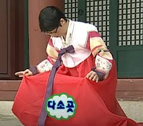
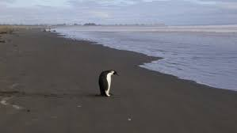
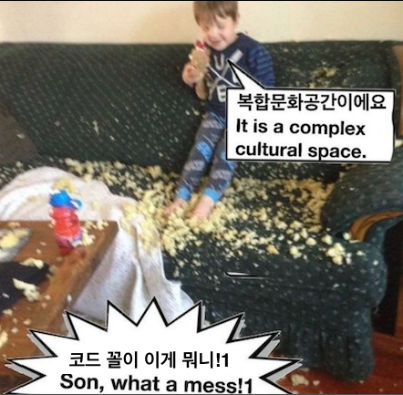
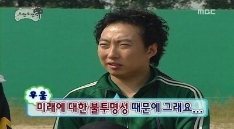
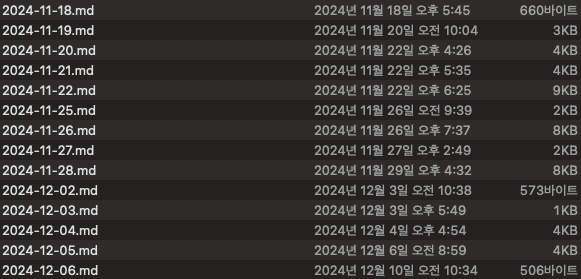
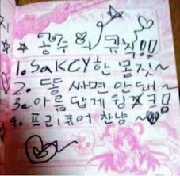
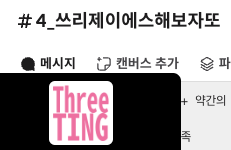
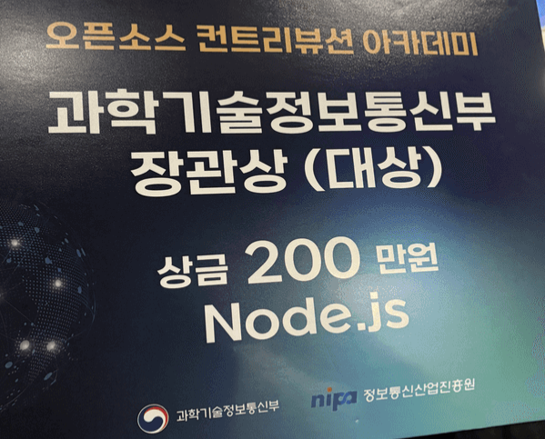
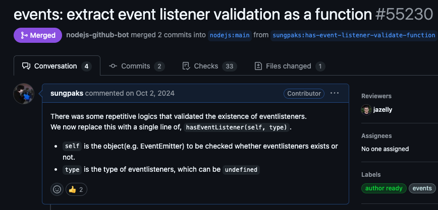
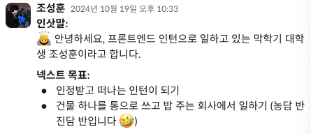

2025년입니다.  
새해 복 많이 받읍시다.

이 블로그를 딱 작년 새해가 되자마자 시작했는데, 벌써 1년이 지난거네요  
TIL 제외하고도 36개를 업로드했으니 달에 3개 정도는 썼다고 보여집니다  
앞으로도 꾸준히 잘 쓰도록 하겠습니다.

2025년에 저는 대학 졸업을 앞두고 있습니다  
또한.. 1월 1일 현재 기준으로 인턴생활을 어제 끝냈는데 당장 내일 새로운 회사에 출근하기로 했습니다  
약간 이직하는기분? 사실 그냥 인턴 끝내고 취직한거지만..

암튼간에 자세한 이야기는 밑에서 하기로 하고  
제 마지막 학기에는 어떤 일이 있었는지 적어두려구요  
주로 인턴 후기가 될 듯

# 4개월 간의 인턴생활 (2024.09 ~ 2024.12)

제가 2024년 시작할 쯤에 그냥 두리뭉실하게  
"올해는 졸업하기 전에 인턴을 해보고 싶다"고 누군가에게 말한 적이 있었는데  
어쩌다보니 그게 현실이 됐습니다  
마지막 학기를 아예 통으로 인턴생활하며 보내게 됐어요  
그래서 남은 교양학점은 온라인으로 채우고.. 학교에는 거의 안 갔네요

## 사수가 없어졌어요

저는 웹 프론트엔드 개발 직무였고, 제가 처음 왔을 때 같은 프론트엔드 분들은 2분 계셨습니다  
근데 웬걸  
온보딩 끝내고 슬슬 실무시작할 쯤이 되니  
한 분은 회사의 다른 사업때문에 두 달 가까이 다른 사무실에 출근하셨고  
한 분은 이직으로 인해 퇴사하셨습니다 ,,

응애

그래도 제가 리액트에 이미 익숙하다는 점이 다행이었고  
뭐든간에 코드더미를 파헤쳐보면 답은 나오더라구요  
"이 구현 어디있지?"나 "이 구현 어떻게하지?" 이런건 크게 문제되지 않았습니다

가장 문제는 "이 구현 왜 이렇게함?"같은건 물어볼 수는 없었다는 점인데  
어차피 물어볼 사람이 없을 뿐더러 (심지어 깃 이력에 찍힌 작성자는 전대 인턴분이거나..)  
컨벤션도 딱히 정해진게 없고, 문서도 최신인지 아닌지도 모를 것들만 남아있고..

## 그래도 일은 해요

우짜든둥 일은 했습니다  
자사 서비스를 고도화하는 작업을 보통 했는데

- QA에서 발견된 이슈사항들을 수정하거나
- UI/UX 개선사항들을 적용하거나

이게.. 서비스가 이미 배포가 되어있지만서도 구멍이 막 뚫려있어서 크고작은 QA이슈가 끊임이 없었고  
UI/UX개선은 아예 제 앞자리 디자이너분께서 전권을 위임받으셨는데  
그동안 참은게 많으셨는지 개선사항을 마구마구 찍어내셔서 ㅋㅋㅋ 작업할게 꽤 많았네요

그래도 혼자니까 시간이 남는대로 꿈펼치기를 막 했습니다  
진짜 못참겠는 코드들은 좀 정리하고..  
성능 로깅도 찍어가면서 굵직한 곳들은 좀 최적화하구요  
특히 무지성 `useState, useEffect`가 막 있는 코드들이 가끔 있었어서 이것만 정리해도 사람구실은 했었네요

UIUX개선하면서 디자이너분과 엄청 자주 면대면으로 논의하고 협업했는데 이것도 매우 좋았습니다  
처음에는 그냥 피그마 디자인 대충 보고 지레짐작(제 천성인가봄 ;;;)으로 작업했었는데, 이러면 작업을 막 두번 세번 다시 하게 되더라구요  
디자이너분도 피곤하고 저도 피곤하고 참..  
그래서 그냥 자리도 가까우니까 자주 왔다갔다했습니다  
나중에는 "덕분에 많이 개선됐어요" 이런 말을 하셨는데 가슴이 찡.

## 외주개발도 2번 담당했는데요

처음 맡았던 외주는 바닥구현이었고, 두 번째로 맡았던 외주는 유지보수였어요

바닥구현 외주는 너무 재밌었습니다  
이미지를 다뤄야 해서 canvas, 이미지최적화, 이미지 편집 기능 등등 혼자만의 자유로운 기술고민의 시간..  
그리고 여기서야말로 Next.js의 힘을 제대로 써봐야겠다! 싶어서 ISR도 해보고..(물론 성능을 위한게 가장 컸습니다)  
재밌는 기능구현 잔뜩했네요

반면 아이러니하게도.. 유지보수 외주는 매우 고통스러웠습니다  
그 코드를 작성한사람은 진짜로 누군지도 모르는 사람(아마 고객사의 이전 외주개발사)고,  
기획도 구현도 제대로된 문서 없이 코드더미를 파헤쳐 버그를 고쳐야 하고,  
게다가 문제점이 뻔히 보이는데도 킵고잉 해야하는 그 기분이란

외주는 제품이 아닌 노동을 서비스한다고 했던가요.

## 어려웠던 것들

처음에 가장 난감했던? 어려웠던 것은.. 구체적으로 기한을 세우고 일정을 픽스하는 것인데요  
일단 태스크의 단위를 어느정도로 끊어서 일정에 올리느냐?도 그렇지만 구체적인 기간을 정하는게 역시 가장 어렵습니다

내가이거다하가막힐지아닐지어떻게알고버그가나서하루꼬박새울지어떻게알고사이드이펙트때문에이거고치다가하루더쓸지어떻게알고디자인이꼬여있을지코드가뒤죽박죽이라파헤치느라하루더필요할지어떻게알겠습니까만은

근데 기한을 정하고 지키는 것도 능력이라고 생각하긴해요. 당연히 필요함  
회사 입장에서도 일정이 있고 협업에 있어서도 중요한 요소구요  
앞으로도 계속 "얼마나 걸립니다"를 구체적으로 제시하고 잘 지키는 사람이 되려고 합니다  
이건 그리고 경험에서 우러나오는게 크긴 할 듯

일단은 항상 의식적으로 생각보다 조금 더 여유를 두고 기간을 자고자 했습니다  
조금 더 빨리 진행해야 하면 다시 기간 줄여서 잡으면 되는거고,  
빨리 끝나면 충분히 확인하고 검수하고 다듬을 시간이 확보된거고,  
딱 맞춰 끝나면 완전히 베스트고,  
정한 기간보다 늦게 끝나면 문제긴 한데 사실 타이트하게 잡지 않은게 오히려 감사하겠네요

그리고 생각보다 질문을 주저하지 않는게 어렵긴했습니다  
어지간하면 혼자 해결하려고 막 문서든 코드든 뒤져보고 심지어 가끔 백엔드 코드도 열어볼 떄가 있었는데  
결국 일은 같이 하는거니까 물어봐야 할 때가 언젠가는 오더라구요.  
기획이나, api이슈나, 이런 것들 특히  
너무 머리싸매는게 답은 아니란 것을 알았습니다  
질문할 용기 이거 참 중요한 듯

그리고 사무실에 온 전화 받는게 제일 어려움;; 땀이 줄줄

## 지키고자 했던 것들과 앞으로 지키고자 하는 것들

저는 평소에 기록이나 문서화가 제 부족함이라고 생각하는데요  
이거때문에 블로그도 시작했고 기록도 막 의식적으로 습관을 들이고 그랬었습니다  
일 시작할 때 가장 먼저 들었던 생각이 이거네요. 기록 잘 해두기  
내가 작업한 것들은 내가 다시 열어볼 수 있게 했습니다.  
근데 나중에 또 든 생각은, "나"가 아닌 "다른 사람"을 위한 버전도 정리해뒀으면 좋았을걸.

<figure>

<figcaption>obsidian으로 매일 남겨둔 나를 위한 기록들</figcaption>

</figure>

그리고 이건 기록에서 한 발짝 더 나아간 것인데..  
태스크를 항목별로 구분하여 리스트업하고, 완료하면 체크하기를 습관화하고자 했고  
이에 따라 누군가 제 일의 진행상황이 궁금하면 바로 알 수 있도록 하고자 했습니다  
특히 퇴근 직전에는 진행중이던 태스크의 진행이 어디까지 됐는지, TODO가 무엇이 있는지는 무조건 정리하고 퇴근했었네요

그리고 질문이나 논의 등은 다른 팀원 모두가 볼 수 있게 가급적이면 메신저 채널에 올리고  
구두로 논의한 내용들은 반드시 기록하고자 했습니다  
일을 하면 할수록 공유가 잘 되어야 한다는 것을 느꼈어요

이렇게 한 번 겪고나니 아, 이렇게 할걸, 이런게 좀 남더라구요.  
그래서 좀 생각해봤습니다. 앞으로는 어떤 원칙을 지킬지?

- 기록은 물론이고, 미래의 동료 또는 미래의 내 대체자를 위한 문서를 따로 보존하기(아예 주에 한번씩 정리하는 등 주기를 정해도 괜찮을 듯.)
- 협업 컨벤션, 가이드라인 등을 정하고 이를 준수하기. "없으면 없는대로~"는 안 해야지..
  - 아, 그리고 잘 공유하기.
- 동료에 대해 잘 알고, 동료와 더 나누고, 동료를 더 잘 이용하기
- 컴포트 존 경계하기

# 글또

그리고 [글또](https://geultto.github.io/)를 시작했어요  
여기다 혼자 글 던져놓으면 별로 누군가 보는 사람이 없다, 는 기분도 있고  
블로그에 글을 자주 올리다보니 다른사람들 글도 막 보고 싶어졌습니다  
그러던 참에 글또에 참여하게 됐어요. 덕분에 이제 2주에 한 번씩 꼬박꼬박 글을 쓸 이유가 생겼습니다

저는 글또에 참여하기를 너무 잘했다고 생각하는데  
많은 이유가 있지만 아무래도 다른 분들의 좋은 글을 더 많이 볼 수 있다는 점입니다  
이게 재밌어서 같은 코어 내의 글들은 어지간하면 다 읽고 댓글을 남기려고 하고 있고  
글또 내 소모임인 글읽었또에서 큐레이션 리뷰도 하고 재밌게 본 글 공유도 하고 그러고 있네요  
그리고 누군가 볼까봐 이제 더 글 완성도도 신경쓰게 되더라구요 ㅋㅋ

이외에도 글또에서는 다른 많은 활동을 할 수 있어서 좋습니다  
커피챗도 하고, 스터디도 하고, 여러 다른 활동들도 하구요  
특히 튜링의 사과 1+1이 GOAT임 ㄷㄷ

## Three.js 스터디

특히 Three.js 스터디를 시작한지 두 달? 정도 더 지난 것 같네요  
막연한 관심만 있었는데, 스터디를 덜컥 시작하고 얼레벌레 하다보니 뭔가를 하고있긴 합니다  
혼자였으면 걍 안했을 듯;; 스터디로 하면서 격주마다 오프라인에서 공유도 하고 그러니까 좋더라구여

음 근데 이게 약간 관성이 심해서.. 요새 안하니까 계속 안건들게되네요 ㅜ

아 럭키인건 새로 가는 회사가 3D 이커머스 도메인이고 three.js 스택이 있다는 점인데  
앞으로 어떻게 될지는 모르겠지만 three.js 실무에서도 쓸 기회가 있을지도?를 기대중입니다  
이 회사에 합류하고 싶었던 여러 이유 중 하나에요

# OSSCA - Node.js팀 대상받다

오픈소스 컨트리뷰션 아카데미에 Node.js팀 멘티로 참여하여 기여활동을 했었는데요  
지난 11월 9일 최종발표를 마지막으로 활동이 종료되었었습니다  
그런데 웬걸

저는 되게 얼레벌레 따라가기 급했는데..  
다른 많은 분들의 노력이 모여 가장 큰 상을 받을 수 있었습니다 ㅜㅜ 감동.

그리고 사실 이 수상이 확정난 날 Node.js에 PR이 하나 더 머지되었는데

사실은 거의 잊은 채로 지내던 PR인데.. 한참 지나고서 "LGTM" 코멘트가 달리더니 머지되었네요

아무튼 이렇게 너무 좋은 경험이었던 Node.js팀 활동이 끝났고..  
다음 기회가 있으면 꼭 다시 OSSCA 참여하고싶네요

---

\
이외에도 음.. 교내 창업컨퍼런스도 참가했었고  
가벼운 사이드프로젝트인 [햄부기](https://chromewebstore.google.com/detail/bugi-and-friends/cidndoahplamogkfaimmahedcnakjnag?hl=ko)도 배포하고  
여기저기 서류도 넣고 면접도 다니고  
틈틈히 온라인강의 듣고 과제하고 시험보고  
그러면서 막학기를 보냈네요

# 커리어를 시작하며

인턴하던 회사에서 감사하게도 정규직 전환 제의를 주셨었지만..  
제가 더 하고 싶은 일이 있는 회사에 합류할 수 있는 기회가 생겼고, 그 곳에서의 출근을 앞두고 있습니다  
이렇게 말하니까 프론트엔드 그만두는 것 같기도 한데 직무는 프론트엔드로 동일하고 도메인이 달라서 그렇습니다

생각해보니 글또 어떤 채널에서 이런 목표를 적었는데

인정받는다는 주관적인 기준이고,, 일단 떠난건 맞네요. ㅋㅋㅋ

암튼간에 인턴으로 일하며 실무능력 뿐만 아니라  
나는 어떤 회사에 가고 싶은지? 어떤 경력을 쌓고 싶은지?  
어떤 동료가 되어야 할지? 어떤 노력을 해야 하는지?  
이런 생각들을 하게 되고 답을 찾으려 해보는 것 자체로 너무 좋은 경험이었습니다  
이런 생각은 보통 그냥 학생일 때, 또는 취준할 때는 고민하기 힘들고 실제로 겪어봐야 아는 것 같아요

제가 좀 고민에 빠졌을 때 누군가 [찰리 멍거의 커리어 원칙](https://m.blog.naver.com/1lsang_/223325365476)에 대해 소개해주셨는데요

1. 스스로 사지 않을 것은 팔지 말라
2. 존경할 수 있는 사람과 일하라
3. 즐겁게 일할 수 있는 사람과 함께 일하라

아.. 이게 진짜 제가 찾던 그것이네요  
사실 이 중 하나라도 잘 충족되는 회사라면 너무 좋은 회사인게 아닐지?

아무튼  
새로운 경험 새로운 시작을 앞두고 꽤 기대도 되고 사알짝 걱정도 되네요  
아좌좍~
