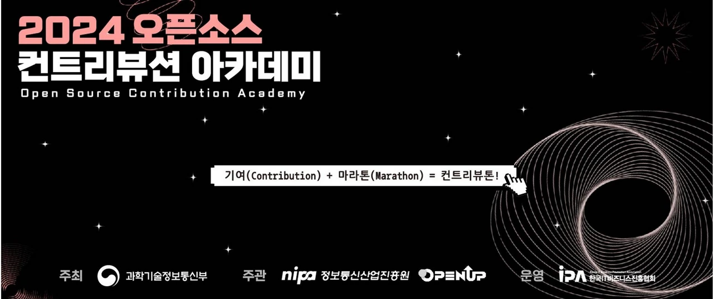
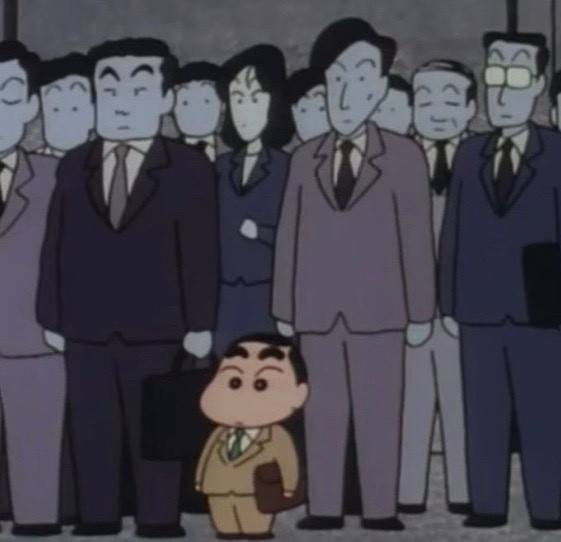
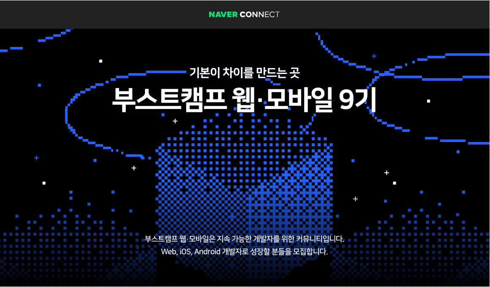
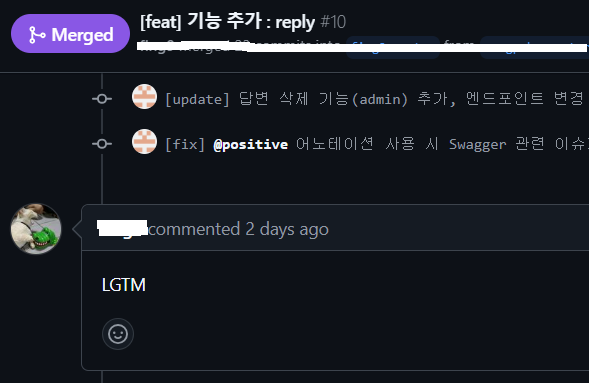

회고라는 단어 진짜 개발자스러운거같아요  
회고라는 그 단어 자체가 주는 이물감이 꽤 있습니다 ㅋㅋ  
막상 쓰려면 좀 낯뜨겁기도 하고..  
그래도 회고 쓸 결심을 좀 해보기로 했습니다  
응당 개발자라면 회고도 써버릇 해줘야.

<figure>

<figcaption>
영화 [헤어질 결심]
</figcaption>

</figure>

아무튼.. 내일이면 개강인데  
저는 마지막 개강입니다. a.k.a. 막학기  
그럼 마지막 개강을 앞두고 마지막 방학 간에 뭘 했는지 써보겠습니다  
어느정도 시간 순으로 사건들이 정렬되어 있습니다?

## OSSCA (오픈소스 컨트리뷰션 아카데미)

> [OSSCA](https://www.oss.kr/contribution_academy)는 언어, 개발 문화, 시작의 두려움으로 인해 높게만 느껴지던 오픈소스에 대한 진입장벽을 허물고 선배 개발자와 함께 서로의 '컨트리뷰톤'을 응원하며 참여, 오픈, 공유, 협업하는 오픈소스 문화를 직접 경험할 수 있는 멘토링 프로그램입니다. 

<figure>

<figcaption>
OSSCA
</figcaption>

</figure>

저는 약 13주 간 활동하는 참여형 프로그램의 Node.js 팀 멘티로 참여하고 있어요  
종강하고나서 지원서를 써서, 7월 초쯤 결과가 나오고 발대식이 있었습니다  

오픈소스 프로젝트에 기여하는 일은 안그래도 막막한데  
Node.js는 그 규모와 생태계가 넘사라서.. 혼자서는 꿈도 못 꿨을 텐데  
멘토님께서 잘 끌어주시고, 멘티님들과 함께하는 덕에 재밌게 활동하고 있습니다  
기여 활동에 대한 내용은 [이미 글을 한 번 썼습니다.](https://sungpaks.github.io/contributing-nodejs/) 궁금하시면 봐주셍쇼  

여기에서 무엇보다도 좋은 점은.. 보고 배울 능력자분들 천지라는 것입니다  
참여가 상대적으로 자율적인 특성이 한 몫 하는지, 현직자분들도 굉장히 많습니다  
학생인 분들도, 대단한 포포몬쓰를 보여주시는 분들이 많아서.. 많이 보고 배우는 중입니다  

특히 어느 날에는.. 일정이 되는 분들만 모각코 한번 하자고 모였는데  
어라? 저를 포함해 단 둘만.. 나온 ㅋㅋㅋ 날이 있었습니다  
근데 오히려 너무 재밌었어요  
굉장한 커리어를 갖고 계신.. 대단한 현직자분이셨는데  
단 둘이 몇 시간을 떠들며 인생에 너무 도움 될 이야기를 많이 나누었습니다  
커리어 이야기와 팁도 많이 얘기해 주시고, 자소서와 포트폴리오도 살펴봐주시고, 조언해주시고, ...  
인사이트를 많이 얻었답니다? 시간 가는 줄도 모르게 재밌었구요  
사실 이 회고도 "회고 쓰는거 좋은 것 같다"고 하셔서, 써야지 써야지 하다가 쓰는 것입니다 ㅋㅋㅋ

아무튼 앞으로 한 달? 그 정도 남았는데,  
앞으로도 열심히 재밌게 컨트리뷰션 해야겠습니다 

## 부스트캠프 챌린지 과정

[부스트캠프](https://boostcamp.connect.or.kr/) 멤버십에 가기 전 단계인, 챌린지 과정을 잠깐 했습니다.  

<figure>

<figcaption>
저는 웹풀스택으로 참여했습니다
</figcaption>

</figure>

챌린지 과정 시작하기 전에, 학습 기록이나 회고를 남기려고 블로그에 [TIL 페이지](https://sungpaks.github.io/til/)를 따로 만들기도 했어요  
원래 공부 시작하기 전에 책상정리를 한 번 하듯이 ㅋㅋㅋ  

근데 이거 시작할 때가 진짜 다른 일도 많고 바쁠 때였어서 굉장히 굉장했습니다  
멋사 해커톤도 슬슬 다가와서 본격적인 개발에 착수해야 했고  
OSSCA 발대식 직후라 Node.js 기여 프로젝트에 참여도 해야 했고  
서류 넣었던거 면접도 겹쳤고.. 등등

그래도 매일 피어 리뷰도 하고, 좀 막막해보였던 과제들을 갖고 이리저리 굴려보고, 공부하고, 하니까 꽤 좋았습니다  
처음 3일은 아침에 운동도 갔다오고 상쾌하게 시작했는데, 그 후로는 어림도 없었습니다 ㅋㅋㅎ  
특히 매일매일 나오는 과제의 주제들이 재밌는게 많았어서, 도움이 많이 됐습니다  
자세한 후기는.. [1주차 회고](https://sungpaks.github.io/til/%EB%84%A4%EC%9D%B4%EB%B2%84_%EB%B6%80%EC%8A%A4%ED%8A%B8%EC%BA%A0%ED%94%84_1%EC%A3%BC%EC%B0%A8_%ED%9A%8C%EA%B3%A0/), [2주차 회고](https://sungpaks.github.io/til/%EB%84%A4%EC%9D%B4%EB%B2%84_%EB%B6%80%EC%8A%A4%ED%8A%B8%EC%BA%A0%ED%94%84_2%EC%A3%BC%EC%B0%A8_%ED%9A%8C%EA%B3%A0/)  

회고가 2주차로 끝인 것은, 사실 2주차까지만 하고 그만뒀습니다  
사실 이 챌린지는 2학기와 딱 겹치는 멤버십 과정에 들어가기 위한 빌드업인데  
2학기에 인턴을 하게 되어서..  
이에 대해서는 밑에서 더 쓰겠습니다  

## 멋쟁이사자처럼 해커톤

제가 3월부터 멋쟁이사자처럼이라는 IT동아리에 가입하고 활동중입니다  
이 멋쟁이사자처럼은 각 대학에 지부?가 여기저기 있어요 *멋쟁이사자처럼 OO대학교점* 이런식으로  
이 모든 멋쟁이사자처럼 동아리가 모이는 중앙 해커톤이 8월 6~7일에 있었습니다  
1500명이 모였다고 했었나? 아무튼.. 사람이 너무 많으니 같은 멋사라고 해도 친밀감은 전혀 들지 않았습니다 ㅋㅋㅋ ㅜ

사실 말이 해커톤이지 한 달을 준비했습니다  
이미 작년에 멋사 해커톤 해본 팀원이 있는데, 당일에는 와이파이가 진짜 안 된다고  
후다닥 해서 배포는 다 하고 가는게 좋다고 해서, 가기 전에 아예 다 완성했습니다  
다른 해커톤들은 진짜 1박2일동안 개발해서 결과를 완성해야 하는 것인지   
그게 가능은 한 것인지..  

아무튼, [런테일](https://github.com/RunTale/RunTale_FE)이라는, 재밌게 러닝을 할 수 있게 하자는 서비스를 개발했어요  
기획 1인, 백엔드 2인, 프론트엔드 2인 총 5인으로 팀이 이루어졌고, 저는 프론트엔드 개발을 담당했습니다  
팀은 더할 나위 없이 좋았어요.  
다른 프론트엔드 팀원은 작년에 기획을 해본 경험이 있어서, 같이 도우면서 하고  
백엔드는 작업 속도도 빠르고, 배포와 CI/CD도 미리 해둬서 작업이 너무 편했습니다  
그 덕분에 해커톤 당일이 되기 전에 프론트엔드까지 배포를 모두 끝내고 당일에는 핫픽스만 했어요  

<figure>

</figure>

<figcaption>
스플렌더를 해요 ㅋㅋ
</figcaption>

새벽에는 다같이 보드게임이나 했습니다 ㅋㅋㅋㅋ  
재밌게 놀고 왔답니다?  
근데 끝나고 나니 좀 허전?공허? 헛헛? 했어요  
목적의식이 사라진 느낌  

그래서!

## 새로운 사이드 프로젝트

저는 계속 뭔가 할 일이 있어야 안정되는 기분입니다  
Node.js 컨트리뷰션 활동도 있지만, 새로운 뭔가가 필요했고  
마침 지인들과 사이드 프로젝트를 시작하게 됐어요..  
이건 아직 진행 중입니다

지인이 이번에 프론트엔드로 어엿한 프로젝트를 하나 해보고 싶다고, 백엔드 해줄 생각 없냐고 했었어요  
전 저번 겨울에 스프링을 혼자 공부했던 적이 있어서 다시 더듬더듬어.. 해보기로 했습니다  
그래서 처음엔 제가 로그인 구현 해놓고, 아 해커톤좀 끝나고 하겠수다. 했다가  
서비스 컨셉을 확 바꿔서 새로 시작하게 되었기 때문에  
백엔드 전문인 또 다른 지인이 인증은 구현해줬습니다. 제가 해커톤 때문에 바쁜 동안  
그리고.. 저는 백엔드 새싹이기 때문에 그 백엔드 전문 지인이 제가 짠 코드를 리뷰해주고 있어요  
거인의 어깨에서 쪽쪽 빨아먹고 있답니다. 음하하

<figure>

</figure>

<figcaption>
Looks Good To Me.
</figcaption>

~~근데 스프링 말고 Node.js 프레임워크로 할 걸 그랬나~~

## ICT 인턴십

이제 내일이면 막학기 개강인데  
운이 좋게도 프론트엔드 직무 인턴에 합격했어요  
[ICT 인턴십](https://www.ictintern.or.kr/main.do)이라는 것인데.. 기관에서 학생들과 기업을 이어주고 학생한테는 학점도 주고 하는 시스템입니다.  
결과 나왔을 때가 부스트캠프 2주차까지 딱 끝난 상황이었는데  
어차피 부스트캠프 멤버십에 갈 수 있게 되어도 못 가게 되었고, 이미 걷잡을 수 없이 바쁜 김에 그만뒀었습니다  

그래서 앞으로 당장 내일부터 12월까지, 4개월 간 출근하게 됐습니다  

학생 때 인턴 해보고 싶었는데 초 럭키~  

이만 마칩니다.