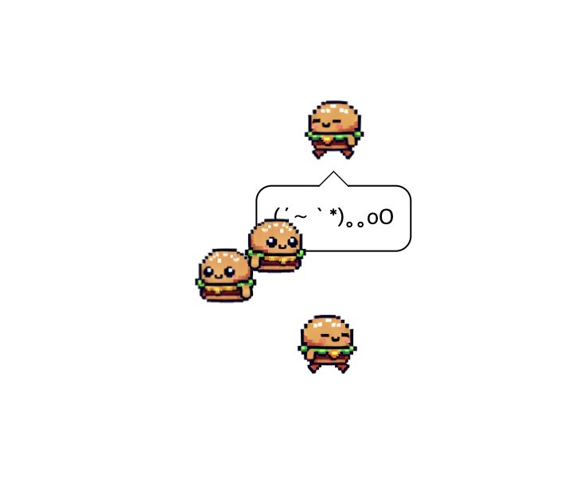
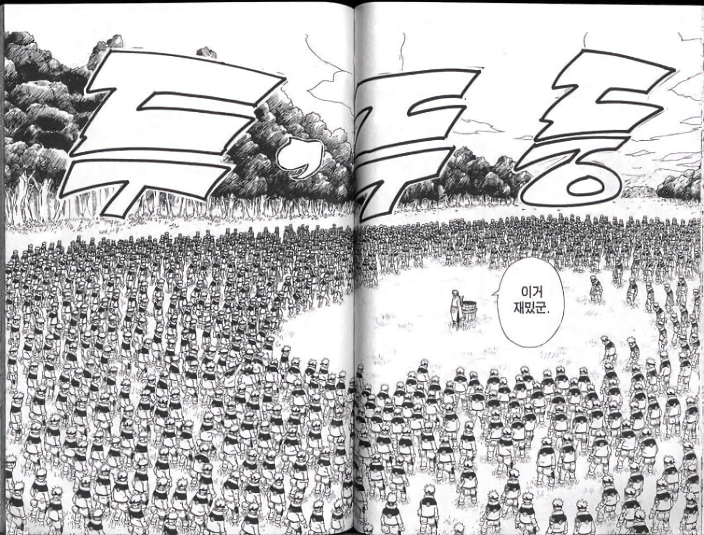
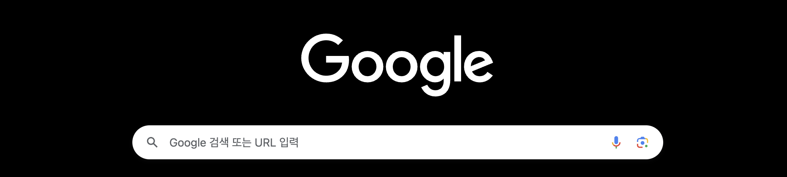
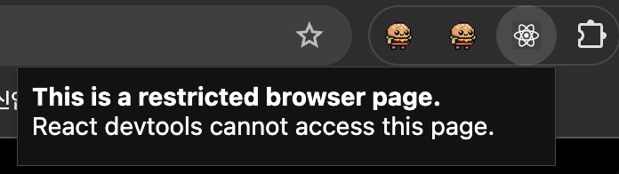
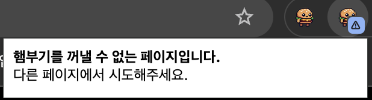
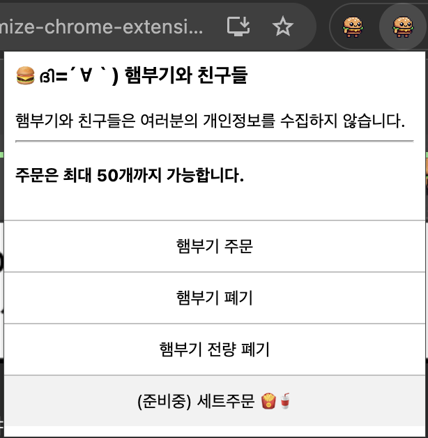
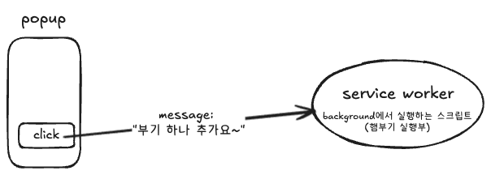

안녕하세요  
오늘은 귀여운 햄부기로 다시 돌아왔습니다  
[햄부기 1.2.1](https://chromewebstore.google.com/detail/bugi-and-friends-121/cidndoahplamogkfaimmahedcnakjnag?hl=ko) 👈👈 즉시시작



근데 이제 다중그림자분신술을 곁들인..

<figure>



<figcaption>만화 나루토 中</figcaption>

</figure>

앞으로 햄부기 업데이트에 대해 다루는 글을 시리즈로 쓰려고 하는데  
이 글에서 다룰 내용은

1. 햄부기가 나오지 못하는 페이지에서는 별도의 안내 팝업을 띄우기
2. 햄부기를 생성하고 삭제하는 등 상호작용할 수 있는 팝업 패널을 추가하기

이 정도입니다.  
사실 다중그림자분신술 어그로끌어놓았지만 정작 그 구현은 다음 글에서 쓰겠네요.. ^^;

# 크롬 확장프로그램은 실행할 수 없는 페이지가 있어요

햄부기 뿐만 아니라 모든 크롬 확장프로그램들은 실행할 수 없는 페이지가 정해져 있습니다.  
이를테면 `chrome://` 으로 시작하는 url이거나 등등..  
특히 아래와 같은 크롬 기본페이지에서 그렇습니다.



유저들은 보통 이런 사실을 모르니까 냅다 눌러보고 "어라 왜 안되는거징;;" 이라고 느낍니다

보통 잘 만들어진 크롬 익스텐션들은 아래와 같이 합니다 :



근데 햄부기는 그런게 없어서 유저들이 잘 모르겠네요.  
적당히 저런 안내 팝업을 띄울 수 있도록 해주려고 합니다.

## 그런 경우에는 안내 팝업을 띄워줍시다.

이거 하려고 React Dev Tools Extensions의 코드베이스를 뜯어봤어요 - [이거](https://github.com/facebook/react/blob/main/packages/react-devtools-extensions/src/background/tabsManager.js) 그리고 [이거](https://github.com/facebook/react/blob/main/packages/react-devtools-extensions/chrome/manifest.json) 등.  
그랬더니 React Dev Tools는 아래와 같이 써서 제한된 페이지를 판별하는 것을 발견했습니다.

```js
function isRestrictedBrowserPage(url) {
  if (!url) {
    return true;
  }

  const urlProtocol = new URL(url).protocol;
  return urlProtocol === "chrome:" || urlProtocol === "about:";
}
```

그대로 긁어주면 되겠네요 ㅋㅋㅎ

이제 이 경우 띄워줄 팝업을 위한 html을 적당히 하나 만듭시다.

```html
<script src="shared.js"></script>
<link rel="stylesheet" href="shared.css" />
<style>
  html,
  body {
    min-width: 286px;
    min-height: 33px;
  }
</style>
<p>
  <b>Sorry, Bugi is not supported here.</b>
  <br />
  Extension cannot be activated on this type of page.
</p>
```

이제 서비스워커로 등록한 스크립트(`manifest.json`에서 > `"background": {}`에서 > `"service_worker":` 로 등록한)에서

```js
function setPopup(type, tabId) {
  chrome.action.setPopup({
    tabId,
    popup: chrome.runtime.getURL(`popups/${type}.html`)
  });
  chrome.action.openPopup();
}
```

이렇게 팝업을 오픈하는 유틸함수를 정의합시다.  
이렇게 하면 `tabId`(현재 탭을 의미)에다 특정 팝업 html을 오픈해줍니다.

이제 `chrome.action.onClicked`에서 :

```js
chrome.action.onClicked.addListener(async (tab) => {
  const currentUrl = tab.url;
  const isRestricted = isRestrictedBrowserPage(currentUrl);
  ...
  if(isRestricted) setPopup('restricted', tab.id)
  ...
  await chrome.action.setBadgeText({
    tabId: tab.id,
    text: isRestricted ? '⚠️' : nextState,
  });
})
```

제한된 url인 경우 이 팝업을 띄우게 해줍시다.  
내친김에 뱃지도 달아줬어요.



문구는 좀 바꾸긴했는데 아무튼 잘됩니다. 야호

이게 되는거면 아예 햄부기를..  
옛날처럼 저 아이콘을 누르면 하나 띵 나오는게 아니라  
팝업 패널을 띄워서 거기서 하나 더 추가 주문하든, 하나 없애버리든, 우짜든, 할 수 있을 것 같은데요?

# 확장프로그램을 누르면 (상호작용할 수 있는)패널이 나오게 하기

무슨 말이냐면요



이렇게 만들어서, 햄부기를 나오게 하고 또는 없애고를 이 패널에서 버튼으로 해결하게 하고 싶다는 뜻입니다.

이게 저는 처음에 `manifest.json`에서 `defaultPopup`과 `scripting` 권한은 양립할 수 없다고 봤어서 구현못하나? 싶었는데  
찾다보니 [스택오버플로우](https://stackoverflow.com/questions/20764517/execute-script-after-click-in-popup-html-chrome-extension)에서 답을 찾을 수 있었습니다.

한 마디로 **팝업 html에 삽입하는 자바스크립트와 서비스워커 자바스크립트 간에 메세지를 보내 통신**하면 됩니다



일단 그럼 `popup.html`부터 만들어봅시다

```html
<style>
  /* 대충 스타일 작성 */
</style>
<ul>
  <li id="create-new-bugi">햄부기 주문</li>
  <li id="destroy-bugi">햄부기 폐기</li>
</ul>
<script src="popup.js"></script>
```

여기에 바로 인라인 스크립트를 작성할 수는 없더라구요  
그래서 `popup.js`를 따로 만들어 삽입해줍니다

```js
document
  .getElementById("create-new-bugi")
  .addEventListener("click", () =>
    chrome.runtime.sendMessage({ action: "create-new-bugi" })
  );
document
  .getElementById("destroy-bugi")
  .addEventListener("click", () =>
    chrome.runtime.sendMessage({ action: "destroy-bugi" })
  );
```

각 버튼에 이렇게 클릭 이벤트리스너를 등록해줍니다.  
`chrome.runtime.sendMessage`로 적절한 메시지를 보내면 됩니다

이제 서비스워커인 `scripting.js`에서는..

```js
chrome.runtime.onMessage.addListener((message, sender, sendResponse) => {
  if (!message.action || !currentTabId) {
    return;
  }
  if (message.action === "create-new-bugi") {
    createNewBugi(currentTabId);
  } else if (message.action === "destroy-bugi") {
    destroyBugi(currentTabId);
  }
});
```

이런 식으로 메시지를 받을 수 있게 구독해둡시다.

아, 원래 `chrome.action.onClicked`는 바로 햄부기소환이었는데, 이제 바꿔야겠죠? `popup.html`을 띄울 수 있도록.  
아까 `setPopup()`함수를 만들어뒀으니, `type`값을 `popup`이라고 이름을 넣어서 사용하면 됩니다

```js
chrome.action.onClicked.addListener(async tab => {
  currentTabId = tab.id;
  const currentUrl = tab.url;
  const isRestricted = isRestrictedBrowserPage(currentUrl);
  const prevState = await chrome.action.getBadgeText({ tabId: tab.id });

  if (isRestricted) {
    setPopup("restricted", tab.id);
    await setBadgeText("⚠️", tab.id);
  } else {
    setPopup("popup", tab.id);
  }
});
```

`chrome.action.onMessage`에서 tabid를 써야하니까 `tab.id`를 따로 전역변수로 저장합시다.  
이제 `isRestricted`가 아닌 경우에는 `popup.html`을 띄우게 해주면 되겠습니다.

마지막으로 할 일은 `createBugi`와 `destroyBugi`함수를 작성해주는 것인데요

```js
function createNewBugi(tabId) {
  chrome.scripting.insertCSS({
    target: { tabId: tabId },
    files: ["bugi.css"]
  });
  chrome.scripting.executeScript({
    target: { tabId: tabId },
    files: ["bugi.js"]
  });
}

function destroyBugi(tabId) {
  chrome.scripting.executeScript({
    target: { tabId: tabId },
    function: () => {
      const bugiToDestroy = window.bugi;
      bugi._destroy();
      delete window.bugi;
    }
  });
}
```

이러면 끝입니다.

---

\
사실 bugi를 클래스로 만들어둔 덕에 여기서 살짝 잡기술만 넣어주면 다중그림자분신술을 쓸 수 있게 구현하는게 매우 간단합니다  
근데 이 기능 추가는 다음 글에서 **관성운동(던지기)** 기능 추가까지 해서 한번에 알아보도록 합시다..

이만 마칩니다.
