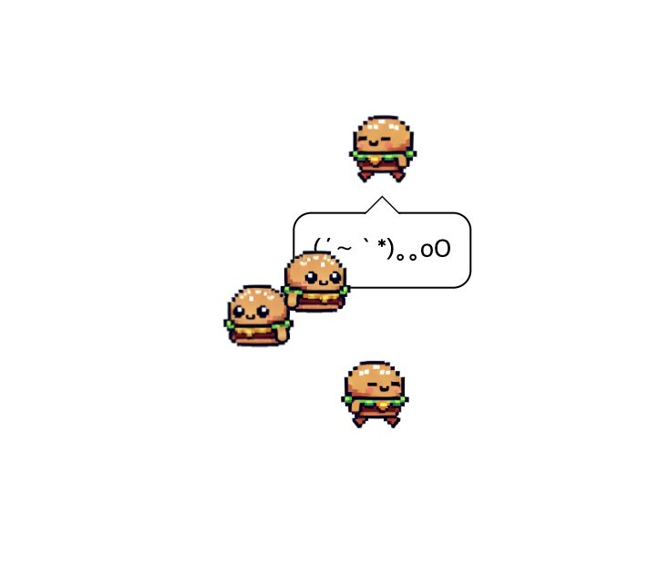
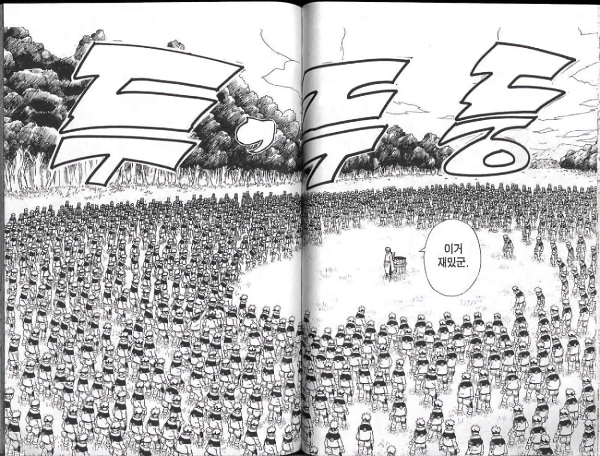
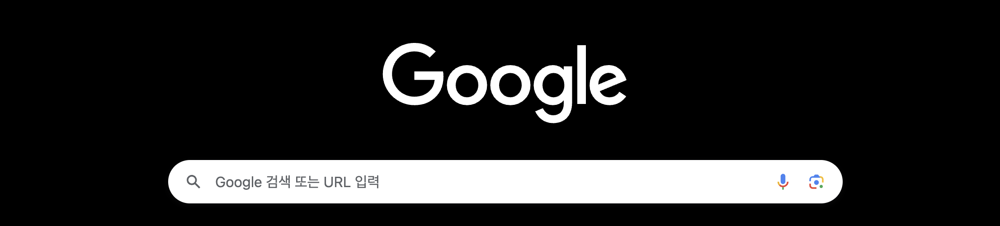
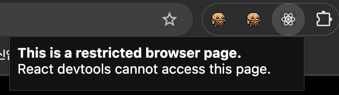
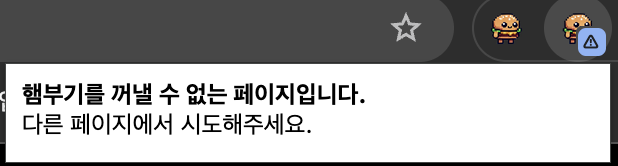
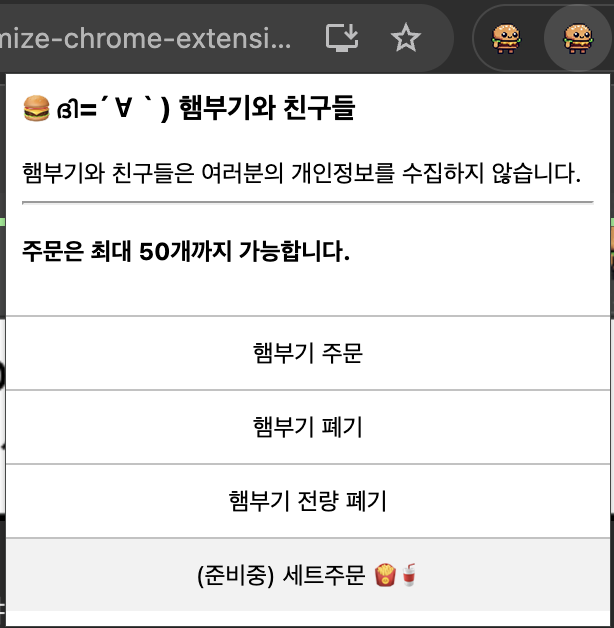
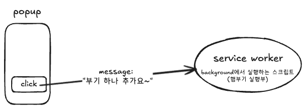
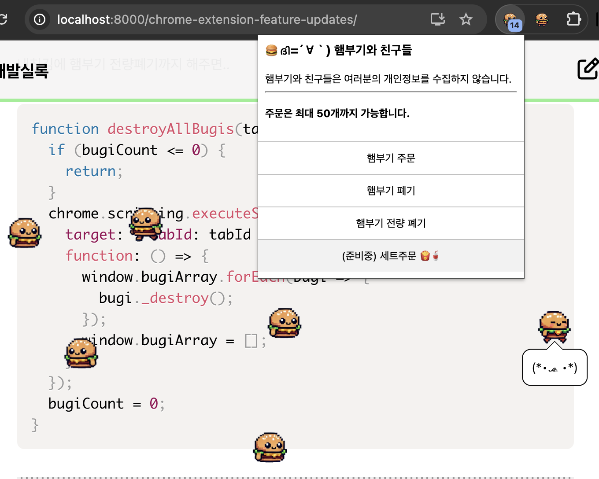
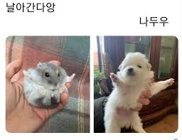

안녕하세요  
오늘은 귀여운 햄부기로 다시 돌아왔습니다  
[햄부기 1.2.1](https://chromewebstore.google.com/detail/bugi-and-friends-121/cidndoahplamogkfaimmahedcnakjnag?hl=ko) 👈👈 즉시시작



근데 이제 다중그림자분신술을 곁들인..

<figure>



<figcaption>만화 나루토 中</figcaption>

</figure>

이 글에서는 햄부기 기능 업데이트에 대해 아래와 같은 내용을 다룹니다.

1. 햄부기가 나오지 못하는 페이지에서는 별도의 안내 팝업을 띄우기
2. 햄부기를 생성하고 삭제하는 등 상호작용할 수 있는 팝업 패널을 추가하기
3. 다중 그림자분신술!!
4. 관성운동(던지기) 구현

# 크롬 확장프로그램은 실행할 수 없는 페이지가 있어요

햄부기 뿐만 아니라 모든 크롬 확장프로그램들은 실행할 수 없는 페이지가 정해져 있습니다.  
이를테면 `chrome://` 으로 시작하는 url이거나 등등..  
특히 아래와 같은 크롬 기본페이지에서 그렇습니다.



유저들은 보통 이런 사실을 모르니까 냅다 눌러보고 "어라 왜 안되는거징;;" 이라고 느낍니다

보통 잘 만들어진 크롬 익스텐션들은 아래와 같이 합니다 :



근데 햄부기는 그런게 없어서 유저들이 잘 모르겠네요.  
적당히 저런 안내 팝업을 띄울 수 있도록 해주려고 합니다.

## 그런 경우에는 안내 팝업을 띄워줍시다.

이거 하려고 React Dev Tools Extensions의 코드베이스를 뜯어봤어요 - [이거](https://github.com/facebook/react/blob/main/packages/react-devtools-extensions/src/background/tabsManager.js) 그리고 [이거](https://github.com/facebook/react/blob/main/packages/react-devtools-extensions/chrome/manifest.json) 등.  
그랬더니 React Dev Tools는 아래와 같이 써서 제한된 페이지를 판별하는 것을 발견했습니다.

```js
function isRestrictedBrowserPage(url) {
  if (!url) {
    return true;
  }

  const urlProtocol = new URL(url).protocol;
  return urlProtocol === "chrome:" || urlProtocol === "about:";
}
```

그대로 긁어주면 되겠네요 ㅋㅋㅎ

이제 이 경우 띄워줄 팝업을 위한 html을 적당히 하나 만듭시다.

```html
<script src="shared.js"></script>
<link rel="stylesheet" href="shared.css" />
<style>
  html,
  body {
    min-width: 286px;
    min-height: 33px;
  }
</style>
<p>
  <b>Sorry, Bugi is not supported here.</b>
  <br />
  Extension cannot be activated on this type of page.
</p>
```

이제 서비스워커로 등록한 스크립트(`manifest.json`에서 > `"background": {}`에서 > `"service_worker":` 로 등록한)에서

```js
function setPopup(type, tabId) {
  chrome.action.setPopup({
    tabId,
    popup: chrome.runtime.getURL(`popups/${type}.html`)
  });
  chrome.action.openPopup();
}
```

이렇게 팝업을 오픈하는 유틸함수를 정의합시다.  
이렇게 하면 `tabId`(현재 탭을 의미)에다 특정 팝업 html을 오픈해줍니다.

이제 `chrome.action.onClicked`에서 :

```js
chrome.action.onClicked.addListener(async (tab) => {
  const currentUrl = tab.url;
  const isRestricted = isRestrictedBrowserPage(currentUrl);
  ...
  if(isRestricted) setPopup('restricted', tab.id)
  ...
  await chrome.action.setBadgeText({
    tabId: tab.id,
    text: isRestricted ? '⚠️' : nextState,
  });
})
```

제한된 url인 경우 이 팝업을 띄우게 해줍시다.  
내친김에 뱃지도 달아줬어요.



문구는 좀 바꾸긴했는데 아무튼 잘됩니다. 야호

이게 되는거면 아예 햄부기를..  
옛날처럼 저 아이콘을 누르면 하나 띵 나오는게 아니라  
팝업 패널을 띄워서 거기서 하나 더 추가 주문하든, 하나 없애버리든, 우짜든, 할 수 있을 것 같은데요?

# 확장프로그램을 누르면 (상호작용할 수 있는)패널이 나오게 하기

무슨 말이냐면요



이렇게 만들어서, 햄부기를 나오게 하고 또는 없애고를 이 패널에서 버튼으로 해결하게 하고 싶다는 뜻입니다.

이게 저는 처음에 `manifest.json`에서 `defaultPopup`과 `scripting` 권한은 양립할 수 없다고 봤어서 구현못하나? 싶었는데  
찾다보니 [스택오버플로우](https://stackoverflow.com/questions/20764517/execute-script-after-click-in-popup-html-chrome-extension)에서 답을 찾을 수 있었습니다.

한 마디로 **팝업 html에 삽입하는 자바스크립트와 서비스워커 자바스크립트 간에 메세지를 보내 통신**하면 됩니다



일단 그럼 `popup.html`부터 만들어봅시다

```html
<style>
  /* 대충 스타일 작성 */
</style>
<ul>
  <li id="create-new-bugi">햄부기 주문</li>
  <li id="destroy-bugi">햄부기 폐기</li>
</ul>
<script src="popup.js"></script>
```

여기에 바로 인라인 스크립트를 작성할 수는 없더라구요  
그래서 `popup.js`를 따로 만들어 삽입해줍니다

```js
document
  .getElementById("create-new-bugi")
  .addEventListener("click", () =>
    chrome.runtime.sendMessage({ action: "create-new-bugi" })
  );
document
  .getElementById("destroy-bugi")
  .addEventListener("click", () =>
    chrome.runtime.sendMessage({ action: "destroy-bugi" })
  );
```

각 버튼에 이렇게 클릭 이벤트리스너를 등록해줍니다.  
`chrome.runtime.sendMessage`로 적절한 메시지를 보내면 됩니다

이제 서비스워커인 `scripting.js`에서는..

```js
chrome.runtime.onMessage.addListener((message, sender, sendResponse) => {
  if (!message.action || !currentTabId) {
    return;
  }
  if (message.action === "create-new-bugi") {
    createNewBugi(currentTabId);
  } else if (message.action === "destroy-bugi") {
    destroyBugi(currentTabId);
  }
});
```

이런 식으로 메시지를 받을 수 있게 구독해둡시다.


아, 원래 `chrome.action.onClicked`는 바로 햄부기소환이었는데, 이제 바꿔야겠죠? `popup.html`을 띄울 수 있도록.  
아까 `setPopup()`함수를 만들어뒀으니, `type`값을 `popup`이라고 이름을 넣어서 사용하면 됩니다

```js
chrome.action.onClicked.addListener(async tab => {
  currentTabId = tab.id;
  const currentUrl = tab.url;
  const isRestricted = isRestrictedBrowserPage(currentUrl);
  const prevState = await chrome.action.getBadgeText({ tabId: tab.id });

  if (isRestricted) {
    setPopup("restricted", tab.id);
    await setBadgeText("⚠️", tab.id);
  } else {
    setPopup("popup", tab.id);
  }
});
```

`chrome.action.onMessage`에서 tabid를 써야하니까 `tab.id`를 따로 전역변수로 저장합시다.  
이제 `isRestricted`가 아닌 경우에는 `popup.html`을 띄우게 해주면 되겠습니다.

마지막으로 할 일은 `createBugi`와 `destroyBugi`함수를 작성해주는 것인데요

```js
function createNewBugi(tabId) {
  chrome.scripting.insertCSS({
    target: { tabId: tabId },
    files: ["bugi.css"]
  });
  chrome.scripting.executeScript({
    target: { tabId: tabId },
    files: ["bugi.js"]
  });
}

function destroyBugi(tabId) {
  chrome.scripting.executeScript({
    target: { tabId: tabId },
    function: () => {
      const bugiToDestroy = window.bugi;
      bugi._destroy();
      delete window.bugi;
    }
  });
}
```

이러면 끝입니다.

# 다중그림자분신술 구현하기

사실 bugi를 클래스로 만들어둔 덕에 여기서 살짝 잡기술만 넣어주면 끝인데요  
먼저 `bugi.js`에서..

```js
window.bugi = new window.Bugi();
```

이렇게였나.. 햄부기 인스턴스를 하나 만들게 되어있었는데요  
아래와 같이 배열로 관리될 수 있게끔 해줍시다.

```js
if (!window.bugiArray) {
  window.bugiArray = [];
}
window.bugiArray.push(new window.Bugi());
```

그리고 이제... 다시 `scripting.js`에서,  
`createNewBugi()`와 `destroyBugi()`는 아래처럼 생겨먹으면 되겠죠?

```js
function createNewBugi(tabId) {
  if (bugiCount >= bugiMaxCount) {
    return;
  }
  chrome.scripting.insertCSS({
    target: { tabId: tabId },
    files: ["bugi.css"]
  });
  chrome.scripting.executeScript({
    target: { tabId: tabId },
    files: ["bugi.js"]
  });
  bugiCount++;
}

function destroyBugi(tabId) {
  if (bugiCount <= 0) {
    return;
  }
  chrome.scripting.executeScript({
    target: { tabId: tabId },
    function: () => {
      const bugiToDestroy = window.bugiArray.shift();
      bugiToDestroy._destroy();
      // delete window.bugi;
    }
  });
  bugiCount--;
}

function destroyAllBugis(tabId) {
  if (bugiCount <= 0) {
    return;
  }
  chrome.scripting.executeScript({
    target: { tabId: tabId },
    function: () => {
      window.bugiArray.forEach(bugi => {
        bugi._destroy();
      });
      window.bugiArray = [];
    }
  });
  bugiCount = 0;
}
```

서비스워커 스크립트는 `window`객체에 접근해서 `bugiArray.length`를 가져오기 귀찮으니, 따로 변수를 관리해주게 했습니다.  
이 `bugiCount`는 `chrome.runtime.onMessage`에서 `setBadgeText(bugiCount.toString(), currentTabId);` 이렇게 해서 현재 화면에 나온 햄부기 수를 알 수 있게 해뒀습니다.

내친김에 햄부기 전량폐기까지 해주면..

```js
function destroyAllBugis(tabId) {
  if (bugiCount <= 0) {
    return;
  }
  chrome.scripting.executeScript({
    target: { tabId: tabId },
    function: () => {
      window.bugiArray.forEach(bugi => {
        bugi._destroy();
      });
      window.bugiArray = [];
    }
  });
  bugiCount = 0;
}
```

그럼 이제 "햄부기 주문" 버튼을 막 눌러보면



햄부기가 가득한데요~  
진짜 화면가득 채우실 분들도 있을까? 싶지만 일단 50개까지 맥스를 해뒀습니다 ㅎㅎ;;

# 관성운동을 구현해서 햄부기를 던져요

이건 1.1.0 업데이트에서 추가된 기능인데요  
햄부기를 잡아다 드래그해서 탁! 놓으면 그대로 쭉 던져집니다!!


구현하러 갑시다.

일단 이런걸 구현하려면 `dx, dy, dt`같은 순간변화량들을 계산해야겠어요  
그럼 먼저 `mousemove`(그리고 `touchmove`) 리스너에서

```js
// 기존 mousemove리스너 코드
...
// 관성운동량 계산
const currentTimestamp = e.timeStamp;
const dx = clickX - this.lastPosition.x;
const dy = clickY - this.lastPosition.y;
const dt = (currentTimestamp - this.lastTimestamp) / 1000;
if (dt) {
  this.velocity.x = dx / dt;
  this.velocity.y = dy / dt;
}
this.lastPosition = { x: clickX, y: clickY };
this.lastTimestamp = currentTimestamp;
```

일단 먼저 `this.lastPosition`과 `this.lastTimestamp`를 미리 저장해두고 있어야겠습니다  
timestamp는 이벤트객체로부터 얻어옵니다.  
이 직전 물리량들로부터 매 순간 `dx, dy, dt`를 계산하고,  
이로부터 매 순간의 속도를 계산해둡시다.

이제 `mouseup`(그리고 `touchend`) 리스너에서는, `isDragging`인 채로 끝났고, 실제로 움직였는지 확인하고 `startInertiaAnimation()`메서드를 호출하게 하겠습니다  
=> `if (this.moved) this.startInertiaAnimation();`

`startInertiaAnimation`은.. 좀 긴데요

```js
startInertiaAnimation() {
  const decay = 0.95; // 감쇠상수 decay
  const easeFactor = 0.0075;
  const rotationFactor = -0.2;
  this.setPose('standing');

  // requestAnimationFrame에 넣을 콜백 animate함수
  const animate = (timestamp, currentVelocity) => {
    // 1. 속도 감소
    currentVelocity.x *= decay;
    currentVelocity.y *= decay;

    // 2. 다음 위치 계산
    let nextLeft = this.position.left + currentVelocity.x * easeFactor;
    let nextTop = this.position.top + currentVelocity.y * easeFactor;

    // 3. 브라우저를 벗어나게 생겼으면 방향 반전 (반사)
    if (
      nextLeft < 0 ||
      nextLeft + this.imgOffsetWidth > window.innerWidth
    ) {
      currentVelocity.x *= -1;
    }
    if (
      nextTop < 0 ||
      nextTop + this.imgOffsetHeight > window.innerHeight
    ) {
      currentVelocity.y *= -1;
    }
    // 4. 반사를 적용해서 다시 다음 위치 계산, 위치 업데이트
    nextLeft = this.position.left + currentVelocity.x * easeFactor;
    nextTop = this.position.top + currentVelocity.y * easeFactor;
    this.position.left = nextLeft;
    this.position.top = nextTop;

    // 5. 회전하면서 날아가게 함
    const rotateDegree =
      Math.sqrt(currentVelocity.x ** 2 + currentVelocity.y ** 2) *
      rotationFactor;
    this.degree = rotateDegree;
    this.updatePosition();
    this.setFlipped(currentVelocity.x < 0);

    // 6-1. 속도가 충분히 작아지면 애니메이션 끝
    if (
      Math.abs(currentVelocity.x) < 0.1 &&
      Math.abs(currentVelocity.y) < 0.1
    ) {
      if (this.inertiaRAF) {
        cancelAnimationFrame(this.inertiaRAF);
        this.inertiaRAF = null;
      }
      this.setPose('sitting');
      return;
    }

    // 6-2. 속도가 아직 남아있으면 계속 진행
    this.inertiaRAF = requestAnimationFrame((newTimestamp) =>
      animate(newTimestamp, currentVelocity),
    );
  };

  // 애니메이션 시작!!
  this.inertiaRAF = requestAnimationFrame((timestamp) =>
    animate(timestamp, this.velocity),
  );
}
```

1. 일단 먼저 감쇠계수인 `decay`를 적당히 0.95정도로 정하고, 다른 상수들도 적당히 조정해가며 정해줬습니다.
2. `requestAnimationFrame`에 넘길 콜백함수 `animate`을 선언합니다.
3. `requestAnimationFrame` 호출!!

`animate()` 함수는..

1. 먼저 속도를 decay
2. 다음 위치를 일단 계산
3. 다음 위치가 브라우저 밖으로 나가려 하면 방향을 반전 (벽에 튕기기)
4. 방향이 변했을 수 있으니 다시 다음 위치 계산
5. 날아가며 회전하게 하고자 $\sqrt{(v_x^2 + v_y^2) * factor}$
   - 속도라는 2차원 벡터의 크기를 구한다.. 어쩌구. 근데 너무 빙글빙글돌아서 ease-factor를 곱해 회전수를 적게 가져가줍니다.
   - 생각해보니 360deg 기준에 맞게 정규화?했어야 하는 듯
6. 속도가 일정 이하로 작아지면 애니메이션 끝, 아니면 계속 진행.

사실 `timestamp`는 유지할 필요 없었네요.

아무튼 이렇게 해주면 이제 햄부기를 막 던질 수 있게 됩니다~  
나중에는 햄부기끼리도 튕겨서 당구가 되게 하고 싶은데요 ㅋㅋㅋ



---

\
다음번 글은 성능개선에 관해 쓸건데요  
지금은 위치 업데이트를 `position`속성을 직접 바꿔서 하고 있습니다만  
근데 그것보단 `transform`을 이용한다면 layout 재배치(reflow)단계를 확 줄일 수 있는거 아닌가? 라고 생각했습니다  
이를 검증하고.. 성능지표를 수집/분석해보고.. 실제로 개선해보는 과정에 대해 써보려고 합니다

커밍쑨.
