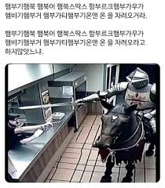
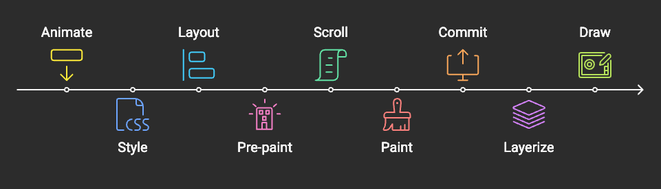
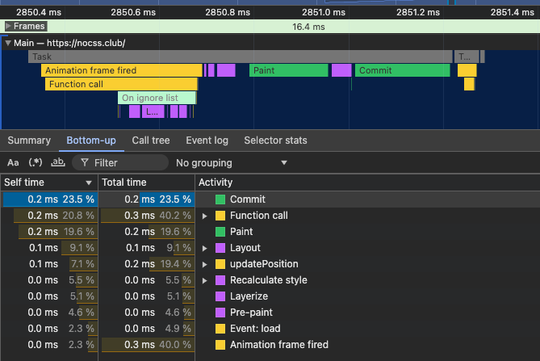
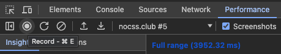
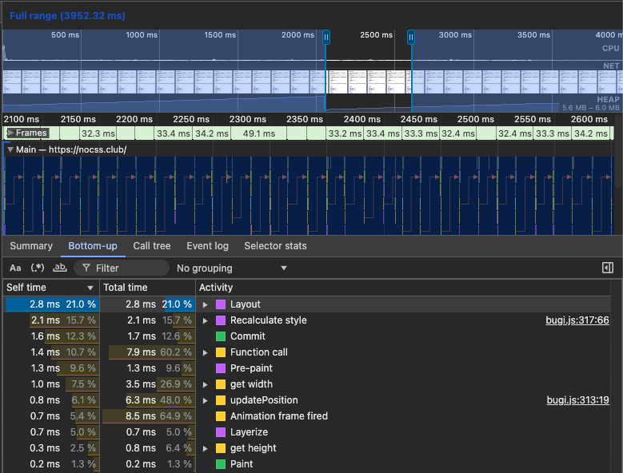
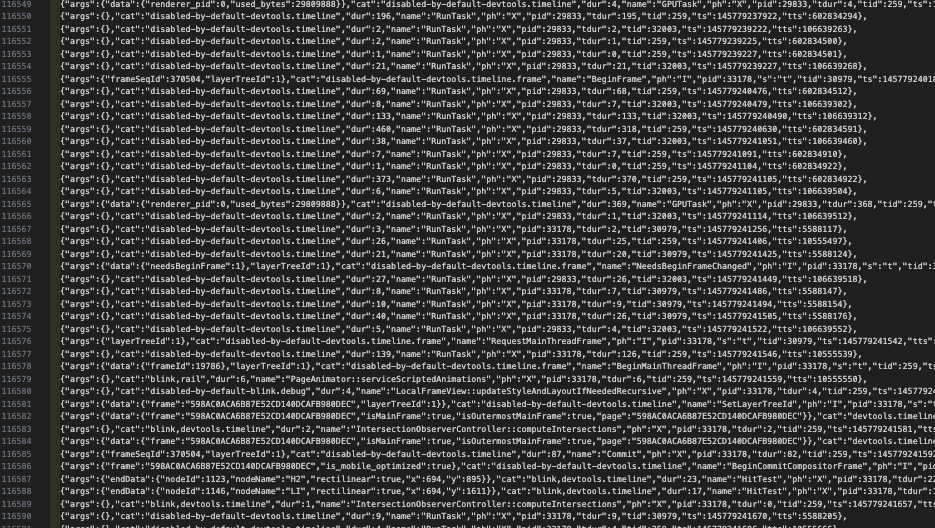
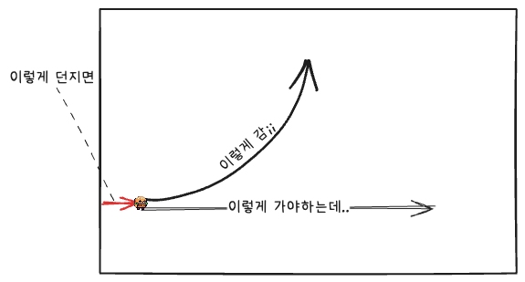

오늘은 햄부기햄북 햄북어 햄북스딱스 함부르크햄부가우가 햄비기햄부거 햄부가티햄부기온앤 온 의 성능을 최적화해볼게요

# 배경지식

웹 성능 최적화를 이루기 위해서는, 웹페이지를 사용자에게 보여주기까지 웹브라우저 상에서 어떤 일이 일어나는지부터 알아야겠습니다  
이에 관해 MDN에 [브라우저는 어떻게 동작하는가](https://developer.mozilla.org/ko/docs/Web/Performance/How_browsers_work)에 대한 글이 있는데, 시간이 많으시면 한번 쭉 읽어보시는 것을 추천드려요. 재밌습니다  
웹페이지를 요청한 이후로 그 웹페이지의 콘텐츠를 사용자에게 보여줄 때까지 브라우저가 무슨 일을 하는지에 대해 나와있는데요,  
이것만 정독하시면 면접에서 "`브라우저에 www.google.com을 입력하면 어떤 일이 일어나나요?`"라고 질문받으셔도 걱정 없을 듯

근데 우리 햄부기의 성능을 최적화하는 데는 이 정보가 모두 필요하진 않구요,  
[중요 렌더링 경로](https://developer.mozilla.org/ko/docs/Web/Performance/Critical_rendering_path)에 나오는 내용만 응용하면 됩니다

## 중요 렌더링 경로

브라우저가 웹페이지를 그릴 때 일어나는 일련의 과정은

1. HTML을 파싱하여 DOM(Document Object Model)을, CSS를 파싱하여 CSSOM(CSS Object Model)을 생성
2. DOM + CSSOM => Render Tree로 합성
3. Layout : Render Tree를 기반으로 요소의 위치와 크기를 결정
4. Paint : 화면에 픽셀을 그려내기
   - 요소를 별도의 레이어로 분리하여 GPU 레이어로 격상하면 Paint단계의 성능을 높일 수 있습니다.
   - (필요한 경우) Composite : 필요에 따라, 또는 개발자의 조작에 따라 레이어가 나뉘어 Paint되었다면, 이를 합성하여 화면에 그려냅니다

이 과정을 **중요 렌더링 경로(Critical Rendering Path, CRP)** 부른다네요  
또는 [Broswer Rendering Pipeline](https://webperf.tips/tip/browser-rendering-pipeline/)라고도 하는 듯  
그리고 Layout단계부터 다시 재계산하며 실행하는 것을 Reflow(크롬에서는 Layout 재계산)라고 부르며,  
Paint단계를 다시 실행하는 것을 Repaint라고 합니다

웹 성능 최적화를 위해서는 이 CRP의 길이를 최소화하고 병목 구간을 줄이기 위해 힘써야겠습니다.

## Chrome 브라우저 렌더링 파이프라인

위에서 살펴본 중요 렌더링 경로가 크롬 브라우저에서는 어떻게 진행되고, 이를 어떻게 분석하면 좋을지 궁리해야겠는데요  
이에 관해 크롬에서 [RenderingNG의 아키텍처](https://developer.chrome.com/docs/chromium/renderingng-architecture?hl=ko)에 대해 쓴 글이 있습니다  
RenderingNG에서 NG는 Next Generation이라는 뜻인데요  
Chromium계열 브라우저에서 사용하는 개쩌는 렌더링 아키텍처라고 하네요

위 글을 살펴보면 Chrome브라우저에서 렌더링은 아래와 같은 과정을 거치며 이를 **렌더링 파이프라인**이라고도 부릅니다. (각 단계의 설명은 단순하게 요약되었습니다)

- Animate: 스타일 속성이 변경됨
- Style: CSS를 DOM트리에 적용(Render Tree를 합성하듯이)하고, *계산된 스타일*을 생성
- Layout: DOM 요소들의 화면 상 위치와 크기 등을 결정
- Pre-paint: 레이어를 구성하기 위한 직전 단계로, 아래와 같은 작업들을 포함 :
  - 기존 페인트 목록 등을 무효화
  - property tree : `transform, opacity`등의 속성은 별도의 속성 트리로 관리했다가 레이어를 병합
- Scroll: 문서 또는 스크롤 가능한 DOM요소의 스크롤 오프셋을 업데이트
- Paint: DOM요소를 실제로 어떻게 그려낼지에 대한 데이터를 계산 => 디스플레이 목록
- Commit: compositor 스레드에 속성 트리와 디스플레이 목록을 복사
- Layerize: 디스플레이 목록을 필요에 따라 레이어로 분할
- Raster, decode and paint worklets: 디스플레이 목록, 인코딩된 이미지, 페인트 워크렛 코드 등을 [GPU 텍스처 타일](https://en.wikipedia.org/wiki/Tiled_rendering)로 변환
- Activate: 화면에 GPU 타일이 어떻게 그려져야 하는지 나타내는 compositor 프레임을 생성
- Aggregate: compositor 프레임들을 결합
- Draw: 그리기!!



이 때 중요한 점은, **필요하지 않은 단계는 생략**할 수 있습니다.  
예를 들어, 스크롤에 의한 애니메이션은 Layout, Pre-paint, Paint 단계를 건너뛸 수 있습니다

그리고 지금 살펴본 Layout, Pre-paint, Paint 등 용어를 잘 봐두면 좋은데요



스포를 하자면 Chrome Devtools의 Performance 탭에서 이러한 각 렌더링 path에 대한 지표를 확인할거라서요  
저 이름 그대로 마킹이 되어있습니다

# 성능 최적화 전략

노드의 사이즈나 위치가 변하면 Layout단계를 거쳐야 합니다  
현재 Bugi는 이동할 때 `position.x += 1`과 같이 직접 위치를 움직이므로, Layout단계를 진행해야곘네요  
근데 그 대신 `transform`을 사용하여 GPU 레이어로 격상하면 단계도 건너뛰고, 메인스레드 점유 시간도 줄일 수 있을 것 같네요?

또는 툴팁 표시를 지금은 `visibility`를 조절하고 있는데, `opacity`를 사용한다거나  
모션이 바뀌는 효과를 위해 이미지를 갈아끼우는 대신에 또한 `opacity`를 사용하여 가시성을 제어한다거나?  
이런 개선 아이디어가 추가로 있을 수 있겠는데요

일단은 이동 애니메이션에서 위치를 `transform`으로 제어하게 하고  
이것이 실제로 Layout단계를 건너뛰는지, 레이어는 잘 분리되는지, 실제로 성능은 개선되는지,  
이러한 내용을 알아보고자 합니다

## 성능 확인 방법

스포했듯이 크롬 개발자도구에서 performance탭에 들어갑시다.  
여기에서 볼 수 있고 할 수 있는 것에 대한 설명은 [관련 Chrome DevTools Docs](https://developer.chrome.com/docs/devtools/performance/overview)에 잘 나와있습니다  
여기서 제가 할 일은



저 녹화버튼을 눌러 햄부기가 애니메이션을 진행할 때의 지표를 수집하고



어떤 일들이 일어났는지 확인하는 것입니다  
위에서도 잠깐 여기 지표들에 대해 언급했었지만  
Web Performance Tips라는 웹사이트에 [An Introduction to the Browser Rendering Pipeline](https://webperf.tips/tip/browser-rendering-pipeline/)라는 글에서 각 지표에 대해 자세하고 쉬운 설명이 있으니  
더 깊게 궁금하시다면 참고해주세요

그리고 이 통계 데이터들은 녹화버튼 오른쪽에 보면 있는 다운로드 버튼을 눌러 JSON파일을 받아볼 수도 있습니다



이렇게 어렵게 생겼지만 이를 파싱해서 통계를 분석해볼 수도 있곘죠?  
근데 그러려면 JSON파일의 포맷과 각 지표들이 무슨 데이터를 의미하는지 알아야 할텐데  
관련 [stackoverflow 글](https://stackoverflow.com/questions/71454764/chrome-devtools-perfomance-profiler-dump-json-file-parser)에서 [Trace Event Format에 대한 문서](https://docs.google.com/document/d/1CvAClvFfyA5R-PhYUmn5OOQtYMH4h6I0nSsKchNAySU/preview?tab=t.0#heading=h.yr4qxyxotyw)를 찾을 수 있었습니다

## 비교를 해보려면..

먼저.. 햄부기를 소환하는 배경 웹사이트로부터의 노이즈를 최소화하기위해  
https://nocss.club/ 이런 힙한 사이트에서 실험을 진행했습니다  
진짜 말그대로 HTML로만 작성된 문서라서 어떤 CSS도 없습니다  
사실 그냥 빈 HTML문서 로컬에 띄우면 되는게 아니냐?할 수도 있지만  
그냥 힙하잖아요?


그리고 문제는 그냥 햄부기로 실험하기에는 변수가 좀 많아요. 랜덤으로 걷기 시작하기 때문에..  
그리고 이전 버전과 새롭게 수정한 버전 사이의 비교를 위해서는 before & after 비교군을 분리할 필요성도 있겠습니다  
그래서 이전 버전의 코드로 `bugi_before`를, 새롭게 수정할 버전의 코드를 `bugi_after`로 나눠주고  
둘 다 아래와 같이 랜덤 걷기 애니메이션은 끄고 나오자마자 1초 후 걷기 시작하는 것으로 고정했습니다

```js
constructor() {
	...
	this.emotions = ['Before Ver.'];
	...
	// this.setupAutoWalk();
	// this.setuptooltip();
	setTimeout(() => this.startWalk('auto'), 1000);
	this.showtooltip();
}
```

그리고 본인 버전이 뭔지 말풍선으로 표시도 해주고요  
이제 `bugi_after`에서는 실제로 `position`이 아닌 `transform`으로 위치이동 효과를 구현해보고 성능지표를 수집해봐야겠죠?

# 구현하기

이제 position대신 transform을 쓸거니까, 처음 생성할 때만 위치를 고정하고 transform을 준비해줍니다.

```js
this.img.style.left = `${0}px`;
this.img.style.top = `${0}px`;
this.img.style.transform = `translate(${this.position.left}px, ${this.position.top}px)`;
```

이제 좌표를 적용할 때는 `transform = translate(${left}px, ${top}px)`와 같이 하겠습니다  
다행히도 "위치를 업데이트"하는 메서드를 따로 만들어두고 이걸 사용하니 해당 메서드만 내부 구현을 바꿔주면 되겠습니다

```js
updatePosition() {
  /* 기존에는... */
  // this.img.style.left = `${this.position.left}px`;
  // this.img.style.top = `${this.position.top}px`;

  /* 대신에 transform으로.. */
  this.img.style.transform = `translate(${this.position.left}px, ${this.position.top}px)`;

  // ... 말풍선도 같이 위치 업데이트
}
```

이렇게 해주면 되겠죠?

## 던지면 이상하게 날아가요

그런데 이렇게 바꾸고나니 관성운동(던져서 날아갈 때)이 이상해졌어요



대충 이런 식으로 되는 상황이었는데..  
이렇게 원운동울 해버립니다? ;;

알고보니.. 날아가면서 햄부기가 뱅글뱅글 돌게 하기 위해서 아래처럼 코드를 작성했었는데요

```js
this.img.style.rotate =
  Math.sign(currentVelocity.x * 10000) * rotateDegree + "deg";
```

문제는 rotate의 기준점은 요소의 중앙이라는 점입니다  
기존에는 요소가 직접 움직이므로 기준점이 진짜로 햄부기의 중앙에 있었는데,  
이제 위치는 `(0,0)`에 고정이고 transform으로 움직여놨으니 `(0,0)`을 기준으로 회전해버립니다

이를 해결하기 위해 `transformOrigin`을 임시로 바꿔두고 rotate할 수도 있겠지만  
아래처럼 `updatePosition()`메서드에 transform을 한번에 선언해버리면 해결됩니다

```js
updatePosition() {
	this.img.style.transform = `
		translate(${this.position.left}px, ${this.position.top}px)
		${this.isFlipped ? 'scaleX(-1)' : ''}
		rotate(${this.degree || 0}deg)
  `;
}
```
