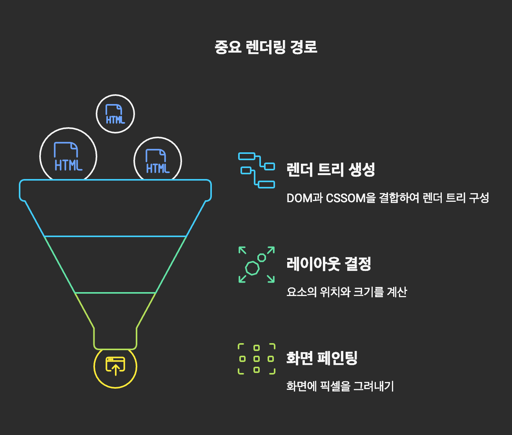
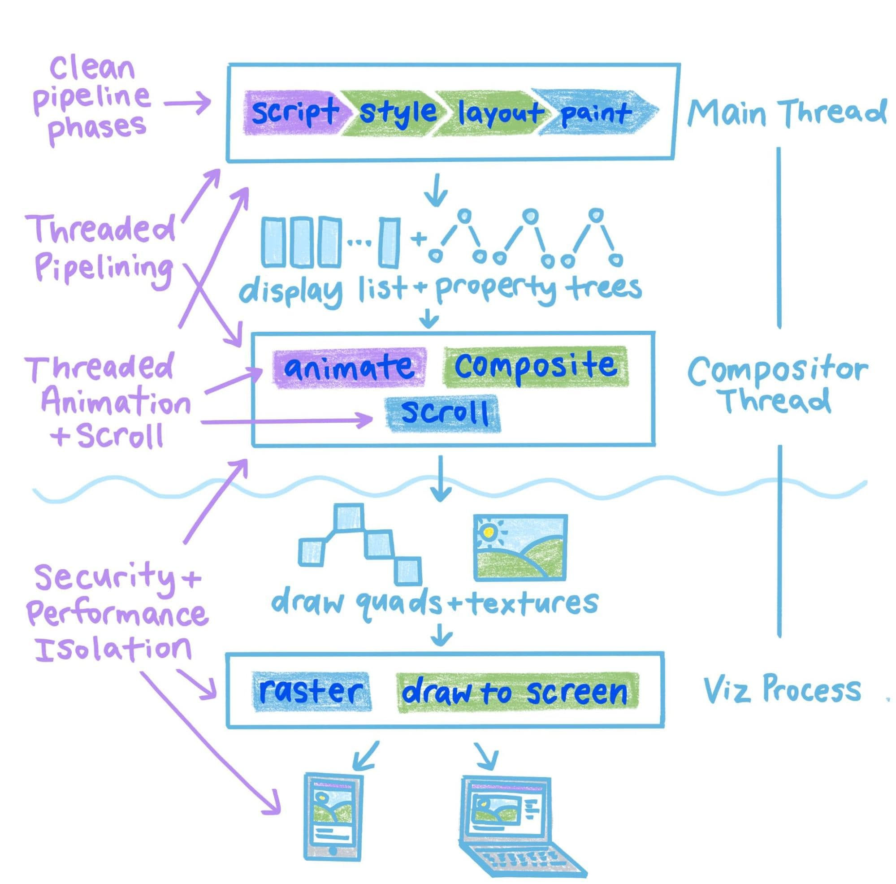
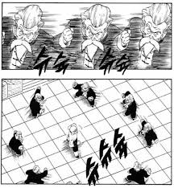
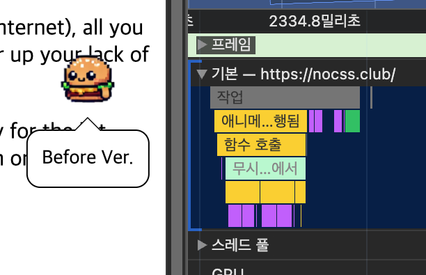
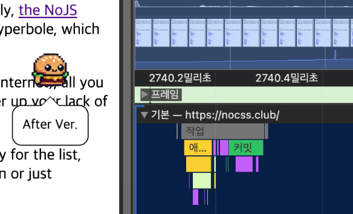
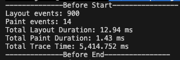
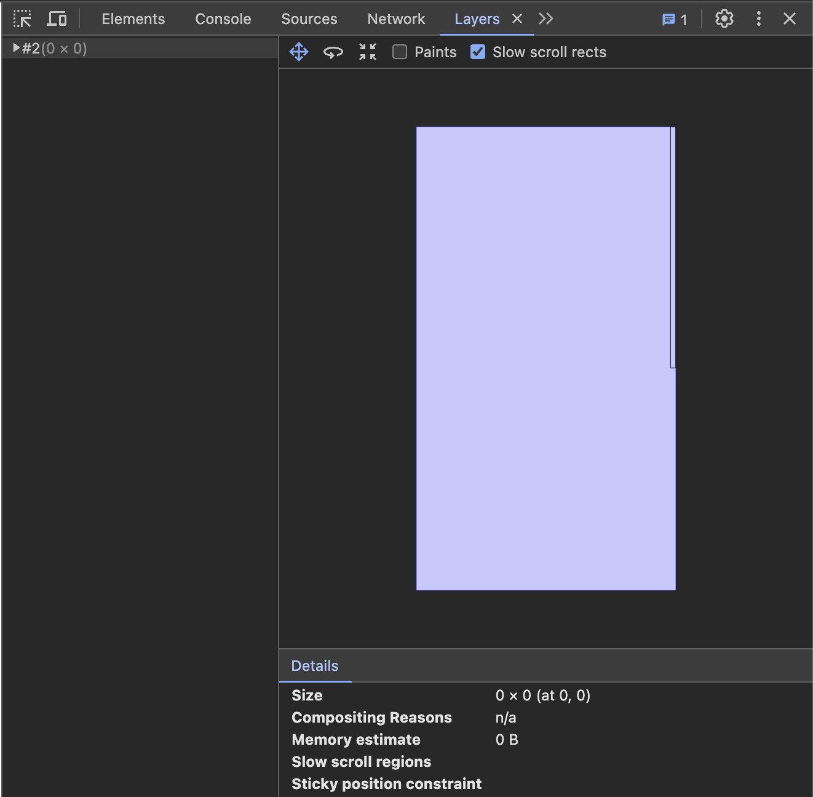
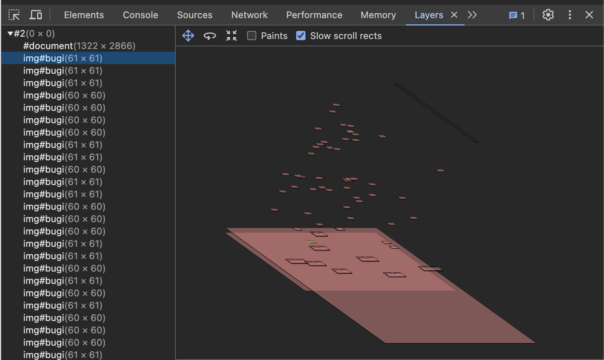
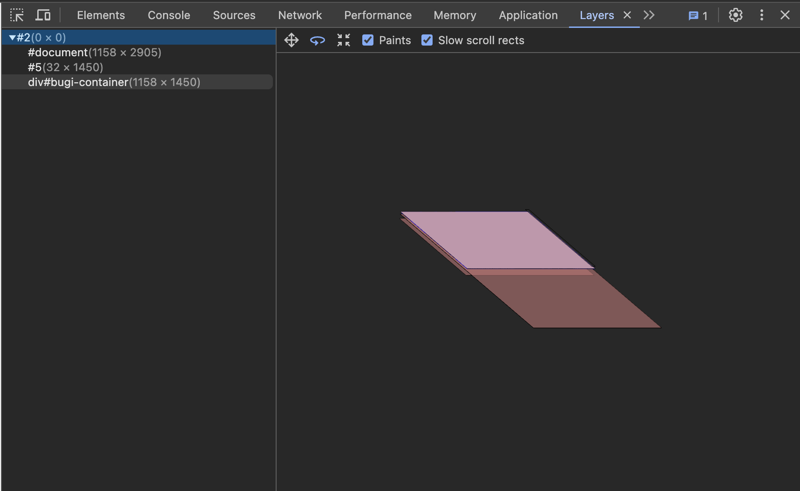
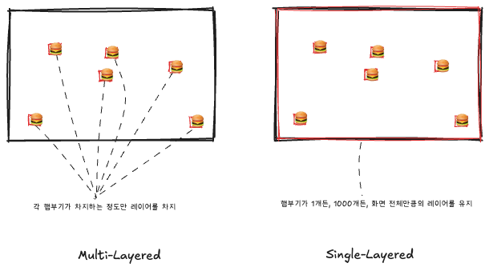

오늘은 햄부기햄북 햄북어 햄북스딱스 함부르크햄부가우가 햄비기햄부거 햄부가티햄부기온앤 온 의 애니메이션 성능을 최적화해보려고 합니다  
엥? 햄부기가 뭔데요? 하신다면

> 크롬 확장프로그램 햄부기♜♜[즉시설치](https://chromewebstore.google.com/detail/bugi-and-friends-121/cidndoahplamogkfaimmahedcnakjnag?hl=ko)☜☜평생무료획득♜♜

들어가기에 앞서, 이런 내용을 준비했습니다

- **렌더링 성능 최적화**를 위한 **배경지식**: 중요 렌더링 경로, Chrome의 렌더링 파이프라인
- 위 배경지식을 토대로 크롬 확장프로그램의 애니메이션 **성능 최적화를 위한 가설** 수립
- 실제로 확인하기 위해 **구현**하고 **성능 지표를 수집, 분석**
- 또 **주의**해야 할 점은?

# 배경지식

웹 성능 최적화를 이루기 위해서는, 웹페이지를 사용자에게 보여주기까지 웹브라우저 상에서 어떤 일이 일어나는지부터 알아야겠습니다  
이에 관해 MDN에 [브라우저는 어떻게 동작하는가](https://developer.mozilla.org/ko/docs/Web/Performance/How_browsers_work)에 대한 글이 있는데, 시간이 많으시면 한번 쭉 읽어보시는 것을 추천드려요. 재밌습니다  
웹페이지를 요청한 이후로 그 웹페이지의 콘텐츠를 사용자에게 보여줄 때까지 브라우저가 무슨 일을 하는지에 대해 나와있는데요,  
이것만 정독하시면 면접에서 "`브라우저에 www.google.com을 입력하면 어떤 일이 일어나나요?`"라고 질문받으셔도 걱정 없을 듯


근데 우리 햄부기의 성능을 최적화하는 데는 이 정보가 모두 필요하진 않구요,  
[중요 렌더링 경로](https://developer.mozilla.org/ko/docs/Web/Performance/Critical_rendering_path)에 나오는 내용만 응용하면 됩니다

## 중요 렌더링 경로

브라우저가 웹페이지를 그릴 때 일어나는 일련의 과정은

1. HTML을 파싱하여 DOM(Document Object Model)을, CSS를 파싱하여 CSSOM(CSS Object Model)을 생성
2. DOM + CSSOM => Render Tree로 합성
3. Layout : Render Tree를 기반으로 요소의 위치와 크기를 결정
4. Paint : 화면에 픽셀을 그려내기
   - 요소를 별도의 레이어로 분리하여 GPU 레이어로 격상하면 Paint단계의 성능을 높일 수 있습니다.
   - (필요한 경우) Composite : 필요에 따라, 또는 개발자의 조작에 따라 레이어가 나뉘어 Paint되었다면, 이를 합성하여 화면에 그려냅니다



이 과정을 **중요 렌더링 경로(Critical Rendering Path, CRP)** 부릅니다  
또는 [Broswer Rendering Pipeline](https://webperf.tips/tip/browser-rendering-pipeline/)라고도 하는 듯  
그리고 Layout단계의 재계산을 Reflow(크롬에서는 Layout 재계산)라고 부르며,  
Paint단계를 다시 실행하는 것을 Repaint라고 합니다

웹 성능 최적화를 위해서는 이 CRP의 길이를 최소화하고 병목 구간을 줄이기 위해 힘써야겠습니다.

## Chrome 브라우저 렌더링 파이프라인

위에서 살펴본 중요 렌더링 경로가 크롬 브라우저에서는 어떻게 진행되고, 이를 어떻게 분석하면 좋을지 궁리해야겠는데요  
이에 관해 크롬에서 [RenderingNG의 아키텍처](https://developer.chrome.com/docs/chromium/renderingng-architecture?hl=ko)에 대해 쓴 글이 있습니다  
RenderingNG에서 NG는 Next Generation이라는 뜻인데요  
Chromium계열 브라우저에서 사용하는 개쩌는 최신 렌더링 아키텍처라고 합니다

<figure>



<figcaption>출처: https://developer.chrome.com/docs/chromium/renderingng</figcaption>
</figure>

위 글을 살펴보면 Chrome브라우저에서 렌더링은 아래와 같은 과정을 거치며 이를 **렌더링 파이프라인**이라고도 부릅니다. (각 단계의 설명은 단순하게 요약되었습니다)

- Animate: 스타일 속성이 변경됨
- Style: CSS를 DOM트리에 적용(Render Tree를 합성하듯이)하고, *계산된 스타일*을 생성
- Layout: DOM 요소들의 화면 상 위치와 크기 등을 결정
- Pre-paint: 레이어를 구성하기 위한 직전 단계로, 아래와 같은 작업들을 포함 :
  - 기존 페인트 목록 등을 무효화
  - property tree : `transform, opacity`등의 속성은 별도의 속성 트리로 관리했다가 레이어를 병합
- Scroll: 문서 또는 스크롤 가능한 DOM요소의 스크롤 오프셋을 업데이트
- Paint: DOM요소를 실제로 어떻게 그려낼지에 대한 데이터를 계산 => 디스플레이 목록
- Commit: compositor 스레드에 속성 트리와 디스플레이 목록을 복사
- Layerize: 디스플레이 목록을 필요에 따라 레이어로 분할
- Raster, decode and paint worklets: 디스플레이 목록, 인코딩된 이미지, 페인트 워크렛 코드 등을 [GPU 텍스처 타일](https://en.wikipedia.org/wiki/Tiled_rendering)로 변환
- Activate: 화면에 GPU 타일이 어떻게 그려져야 하는지 나타내는 compositor 프레임을 생성
- Aggregate: compositor 프레임들을 결합
- Draw: 그리기!!


이 때 중요한 점은, **필요하지 않은 단계는 생략**할 수 있습니다.  
예를 들어, 스크롤에 의한 애니메이션은 합성 스레드에서 실행되게 하면 Layout, Pre-paint, Paint 단계를 건너뛸 수 있습니다

그리고 지금 살펴본 Layout, Pre-paint, Paint 등 용어를 잘 봐두면 좋은데요


스포를 하자면 Chrome Devtools의 Performance 탭에서 이러한 각 렌더링 path에 대한 지표를 확인할거라서요  
저 이름 그대로 마킹이 되어있습니다

# 성능 최적화 전략

노드의 사이즈나 위치가 변하면 Layout단계를 거쳐야 합니다  
현재 Bugi는 이동할 때 `position.x += 1`과 같이 직접 위치를 움직이므로, Layout단계를 진행하게 됩니다  
근데 그 대신 `transform`을 사용하여 GPU 레이어로 격상하면:  
브라우저는 기존의 Layout Box를 변경하는 대신 Compositing단계에서 변환만 수행하고,  
Compositor 스레드에서 따로 작업하므로 메인스레드를 점유하는 시간도 줄일 수 있을 듯 합니다.

또는 툴팁 표시를 지금은 `visibility`를 조절하고 있는데, `opacity`를 사용한다거나  
모션이 바뀌는 효과를 위해 이미지를 갈아끼우는 대신에 또한 `opacity`를 사용하여 가시성을 제어한다거나?  
이런 개선 아이디어가 추가로 있을 수 있겠는데요

일단은 이동 애니메이션에서 위치를 `transform`으로 제어하게 하고  
이것이 실제로 Layout단계를 건너뛰는지, 레이어는 잘 분리되는지, 실제로 성능은 개선되는지,  
이러한 내용을 알아보고자 합니다

결론적으로, 확인해보고자 하는 점은:

> 가설 1. `transform`을 적용하면 Layout단계를 건너뛸 수 있다  
> 가설 2. Layout단계를 건너뛰면 실제로 매 렌더링마다 드는 비용(duration 등)이 감소한다

## 성능 확인 방법

스포했듯이 크롬 개발자도구에서 performance탭에 들어갑시다.  
여기에서 볼 수 있고 할 수 있는 것에 대한 설명은 [관련 Chrome DevTools Docs](https://developer.chrome.com/docs/devtools/performance/overview)에 잘 나와있습니다  
여기서 제가 할 일은


저 녹화버튼을 눌러 햄부기가 애니메이션을 진행할 때의 지표를 수집하고


어떤 일들이 일어났는지 확인하는 것입니다  
위에서도 잠깐 여기 지표들에 대해 언급했었지만  
Web Performance Tips라는 웹사이트에 [An Introduction to the Browser Rendering Pipeline](https://webperf.tips/tip/browser-rendering-pipeline/)라는 글에서 각 지표에 대해 자세하고 쉬운 설명이 있으니  
더 깊게 궁금하시다면 참고해주세요

그리고 이 통계 데이터들은 녹화버튼 오른쪽에 보면 있는 다운로드 버튼을 눌러 JSON파일을 받아볼 수도 있습니다


이렇게 어렵게 생겼지만 이를 파싱해서 통계를 분석해볼 수도 있곘죠?  
근데 그러려면 JSON파일의 포맷과 각 지표들이 무슨 데이터를 의미하는지 알아야 할텐데  
관련 [stackoverflow 글](https://stackoverflow.com/questions/71454764/chrome-devtools-perfomance-profiler-dump-json-file-parser)에서 [Trace Event Format에 대한 문서](https://docs.google.com/document/d/1CvAClvFfyA5R-PhYUmn5OOQtYMH4h6I0nSsKchNAySU/preview?tab=t.0#heading=h.yr4qxyxotyw)를 찾을 수 있었습니다

## 비교를 해보려면..

먼저.. 햄부기를 소환하는 배경 웹사이트로부터의 노이즈를 최소화하기위해  
https://nocss.club/ 이런 힙한 사이트에서 실험을 진행했습니다  
진짜 말그대로 HTML로만 작성된 문서라서 어떤 CSS도 없습니다  
사실 그냥 빈 HTML문서 로컬에 띄우면 되는게 아니냐?할 수도 있지만  
그냥 힙하잖아요?


그리고 문제는 그냥 햄부기로 실험하기에는 변수가 좀 많아요. 랜덤으로 걷기 시작하기 때문에..  
그리고 이전 버전과 새롭게 수정한 버전 사이의 비교를 위해서는 before & after 비교군을 분리할 필요성도 있겠습니다  
그래서 이전 버전의 코드로 `bugi_before`를, 새롭게 수정할 버전의 코드를 `bugi_after`로 나눠주고  
둘 다 아래와 같이 랜덤 걷기 애니메이션은 끄고 나오자마자 1초 후 걷기 시작하는 것으로 고정했습니다

```js
constructor() {
	...
	this.emotions = ['Before Ver.'];
	...
	// this.setupAutoWalk();
	// this.setuptooltip();
	setTimeout(() => this.startWalk('auto'), 1000);
	this.showtooltip();
}
```

그리고 본인 버전이 뭔지 말풍선으로 표시도 해주고요  
이제 `bugi_after`에서는 실제로 `position`이 아닌 `transform`으로 위치이동 효과를 구현해보고 성능지표를 수집해봐야겠죠?

# 구현하기

이제 position대신 transform을 쓸거니까, 처음 생성할 때만 위치를 고정하고 transform을 준비해줍니다.

```js
this.img.style.left = `${0}px`;
this.img.style.top = `${0}px`;
this.img.style.transform = `translate(${this.position.left}px, ${this.position.top}px)`;
```

이제 좌표를 적용할 때는 `transform = translate(${left}px, ${top}px)`와 같이 하겠습니다  
다행히도 "위치를 업데이트"하는 메서드를 따로 만들어두고 이걸 사용하니 해당 메서드만 내부 구현을 바꿔주면 되겠습니다

```js
updatePosition() {
  /* 기존에는... */
  // this.img.style.left = `${this.position.left}px`;
  // this.img.style.top = `${this.position.top}px`;

  /* 대신에 transform으로.. */
  this.img.style.transform = `translate(${this.position.left}px, ${this.position.top}px)`;

  // ... 말풍선도 같이 위치 업데이트
}
```

이렇게 해주면 되겠죠?

## 던지면 이상하게 날아가요

그런데 이렇게 바꾸고나니 관성운동(던져서 날아갈 때)이 이상해졌어요


대충 이런 식으로 되는 상황이었는데..  
이렇게 원운동울 해버립니다? ;;


알고보니.. 날아가면서 햄부기가 뱅글뱅글 돌게 하기 위해서 아래처럼 코드를 작성했었는데요

```js
this.img.style.rotate =
  Math.sign(currentVelocity.x * 10000) * rotateDegree + "deg";
```

문제는 rotate의 기준점은 요소의 중앙이라는 점입니다  
기존에는 요소가 직접 움직이므로 기준점이 진짜로 햄부기의 중앙에 있었는데,  
이제 위치는 `(0,0)`에 고정이고 transform으로 움직여놨으니 `(0,0)`을 기준으로 회전해버립니다



이를 해결하기 위해 `transformOrigin`을 임시로 바꿔두고 rotate할 수도 있겠지만  
아래처럼 `updatePosition()`메서드에 transform을 한번에 선언해버리면 해결됩니다

```js
updatePosition() {
	this.img.style.transform = `
		translate(${this.position.left}px, ${this.position.top}px)
		${this.isFlipped ? 'scaleX(-1)' : ''}
		rotate(${this.degree || 0}deg)
  `;
}
```

# before & after 비교 분석하기

이제 개선 버전의 햄부기가 완성되었으니 정말 변화가 있는지 봐야겠어요  
진짜 최대최대로 확대해서 렌더링 태스크 하나만 골라서 봐보면..





이래서는 정확히 알기 힘들겠죠??  
그리고 실험은 응당 많은 표본을 통계를 내야합니다  
이 성능 측정 데이터인 Trace.json을 다운로드해서 이걸 파싱하고 분석하면 좋겠는데요

## Trace.json 파싱, 분석하기

위에서 찾은 Trace의 Format에 대한 글 + GPT에게 도움을 받아 Trace를 파싱하고 분석하는 `parseTrace.js`파일을 작성했습니다


```js
const fs = require("fs");

// 특정 이벤트 분석 함수
function analyzeTrace(data) {
  const events = data.traceEvents;

  // 관심 있는 이벤트 필터링 (예: Layout, Paint)
  const layoutEvents = events.filter(
    event => event.name === "Layout" && event.ph === "X"
  );
  const paintEvents = events.filter(
    event => event.name === "Paint" && event.ph === "X"
  );

  console.log(`Layout events: ${layoutEvents.length}`);
  console.log(`Paint events: ${paintEvents.length}`);

  // 평균 소요 시간 계산
  const layoutDuration =
    layoutEvents.reduce((sum, event) => sum + (event.dur || 0), 0) / 1000; // ms
  const paintDuration =
    paintEvents.reduce((sum, event) => sum + (event.dur || 0), 0) / 1000; // ms

  console.log(`Total Layout Duration: ${layoutDuration.toFixed(2)} ms`);
  console.log(`Total Paint Duration: ${paintDuration.toFixed(2)} ms`);

  // 전체 실행 시간 계산
  const totalTime =
    parseInt(data.metadata.modifications.initialBreadcrumb.window.range) / 1000; // ms

  console.log(`Total Trace Time: ${totalTime.toLocaleString()} ms`);
}

// 분석 실행
const traceDataBefore = JSON.parse(
  fs.readFileSync("./Trace_Before.json", "utf8")
);
console.log("--------------Before Start----------------");
analyzeTrace(traceDataBefore);
console.log("--------------Before End----------------");

const traceDataAfter = JSON.parse(
  fs.readFileSync("./Trace_After.json", "utf8")
);
console.log("--------------After Start----------------");
analyzeTrace(traceDataAfter);
console.log("--------------After End----------------");
```

간단히 Layout 단계와 Paint 단계는 몇 번 일어나는지, 각각의 단계에 소요된 시간은 어느정도인지를 출력하게 했습니다  
일단 이게 파싱과 계산이 잘 된건지 확인하기 위해 Before만 한번 돌려보겠습니다


위와 같은 결과를 json파일로 다운로드받아 실행하여 출력을 보니 아래와 같았습니다 :



전체 시간 범위, Layout 단계의 duration, Paint 단계의 duration 등 모두 잘 일치하네요  
잘 계산되었습니다

## 결과는??

각 기록은 5초 간의 걷기 애니메이션을 모두 담도록 했습니다.

<figure>


<figcaption>parseTrase.js 실행결과</figcaption>
</figure>

<figure>


<figcaption>DevTools상에서 Before 표본의 Bottom-up 지표 (위에서 쓴 것과 동일)</figcaption>
</figure>

<figure>


<figcaption>DevTools상에서 After 표본의 Bottom-up 지표</figcaption>
</figure>

실제로 이전에는 5초 간 900번 트리거되었던 **Layout 단계가 0회로 아예 사라졌습니다!!**  
특히 Layout단계는 Self time(하위 activity 실행시간을 제외한 해당 activity 자체 시간)에서 가장 큰 비중을 차지했는데, 완전히 사라져버렸네요.

> ✅ ~~가설 1. `transform`을 적용하면 Layout단계를 건너뛸 수 있다~~  
> ✅ ~~가설 2. Layout단계를 건너뛰면 실제로 매 렌더링마다 드는 비용(duration 등)이 감소한다~~

위와 같이 세웠던 가설들을 모두 검증했습니다.


실제로 **Layout 재계산(Reflow)를 건너뛰고, 17.5%의 duration을 절감**했네요.

# 레이어 남용에 주의합시다.

위에서 `transform`같은 프로퍼티를 사용하여 레이어를 분리하고 Layout단계를 건너뛰었는데요  
그런데 MDN의 중요 렌더링 경로에 대한 글에서 이런 내용이 있습니다

> 레이어는 성능을 향상시킵니다. 하지만 메모리 관리 측면에서 봤을 때는 비싼 작업입니다. 따라서 웹 성능 최적화 전략으로 과도하게 쓰이지는 않아야 합니다.

레이어를 너무 양산하지 말라고 하네요.  
그러고보니 문득..


햄부기의 인스턴스마다 각각의 레이어가 생기고 있는게 아닌가? 라는 생각이 들었습니다.

이를 확인하기 위해 크롬 개발자도구에서 Layers 탭에 들어가봤습니다



이렇게 생긴 곳인데요.  
위에서와 같은 레이어 분리를 적용한 햄부기 인스턴스를 50개 만들어봤습니다



햄부기 하나 당 하나의 레이어가 생긴 것을 확인할 수 있었습니다  
구글 크롬 Web.dev 컨텐츠에서는 [너무 많은 레이어를 생성하지 않도록 주의](https://web.dev/articles/stick-to-compositor-only-properties-and-manage-layer-count?hl=ko#manage_layers_and_avoid_layer_explosions)해야함을 경고하고 있습니다  
따라서 이 햄부기들을 위한 하나의, 통일된 레이어를 만들어봐야겠습니다.

## 햄부기들을 위한 레이어를 만들어주기

이를 위해서는 간단히 *모든 햄부기 요소를 위한 공통 부모 컨테이너*만 하나 추가해주면 되는데요

```js
if (!window.bugiContainer) {
  const container = document.createElement("div");
  container.id = "bugi-container";
  document.body.appendChild(container);
  window.bugiContainer = container;
}
```

이를 위해 컨테이너가 될 요소를 하나 만든 다음,

```css
#bugi-container {
  position: fixed;
  top: 0;
  left: 0;
  width: 100%;
  height: 100%;
  /* 부모 컨테이너 클릭 방지 */
  pointer-events: none;
  /* 레이어 격상 - translateZ 또는 will-change 속성 */
  will-change: transform;
  transform: translateZ(0);
}
```

화면 전체를 덮게 하고,  
`translateZ(0)`또는 `will-change`속성으로 레이어를 분리. 격상합니다

이제 햄부기가 생성될 때는 아래와 같이,

```js
//document.body.appendChild(this.img);  원래..
//document.body.appendChild(this.tooltip);
window.bugiContainer.appendChild(this.img);
window.bugiContainer.appendChild(this.tooltip);
```

body에 직접 집어넣던 것을 bugiContainer로 넣어줍니다  
이러면 이론상 `bugiContainer`라는 단 하나의 레이어만이 추가적으로 분리되었고,  
각 햄부기 요소들은 이 안에서 존재해야 합니다.  
확인해보면..



추가적인 레이어는 `div#bugi-container` 단 하나만 존재함을 알 수 있습니다

## 효과는 미미했다?

위와 같이, 햄부기 인스턴스 각각에 대한 레이어를 유지하는 대신, 모든 햄부기들을 공통 부모 요소 내부에 두어 단일 레이어로 병합하는 최적화 전략을 시도해봤는데요


이것도, 한번에 햄부기 50개가 나와서 모두 똑같이 5초간 걷기 애니메이션을 진행하도록 하여 비교군을 만들어 실험했습니다..만  
렌더링/페인팅 시간이나, 메모리 사용량이나, 어떤 큰 변화를 발견하지 못했습니다

특히 햄부기 프로젝트에서는:  
(Multi Ver.)햄부기들이 각각의 레이어를 갖게 하면, 각 레이어는 그 햄부기들이 차지하는 영역(ex. 햄부기가 50x50픽셀이면, 50x50픽셀만큼만)만큼만 차지하는 반면,  
(Single ver.)햄부기들을 모두 하나의 레이어로 병합하기 위해서는 각 햄부기가 차지하는 영역에 관계없이 부모 레이어가 화면 전체를 덮게 됩니다.



실제로 이 때문에 뷰포트가 넓어질수록 싱글 레이어가 차지하는 메모리는 증가함을 확인할 수 있었습니다  
따라서, 뷰포트는 좁을 수록, 그리고 햄부기 수는 많아질수록 단일 레이어로 병합하여 유지하는 방법이 효과가 있을 것이지만  
반대의 경우에는 효과를 보장할 수 없고, 심지어는 더 큰 오버헤드로 이어질 수도 있습니다(극단적으로, 매우 큰 화면에 단 하나의 햄부기만..)  
그래서 일단 해당 업데이트를 적용하는 것은 보류하기로 했습니다.

그러나 이 사례는 **레이어를 남용 시 부작용**을 미리 인지하고, 적절한 **성능 측정에 근거**하여 레이어 승격을 적용해야 함을 알리기 위한 수단으로 소개해드렸습니다

---

# 끝

이렇게 **웹 애니메이션에서의 렌더링 성능 최적화**에 대해 알아봤습니다.  
`transform, opacity`같은 속성 등을 적절히 사용하면 **렌더링 경로를 최소화**할 수 있고,  
이는 곧 자연스럽게 **렌더링 성능 최적화**로 이어짐을 확인했구요  
**Chrome DevTools**를 통해 **성능지표를 수집하고 분석**하여 실제로 이를 확인하는 과정을 보여드렸습니다  
또한 추가로, **무분별한 레이어 증식에 주의**해야 함을 확인했구요

혹시나 글에 이상한 점, 이거 아닌데, 이건 어떤가요? 등 의견이 있다면 꼭 남겨주세요

앞으로 햄부기는

- 뷰포트가 줄어들면 햄부기들의 위치 또한 이에 따라 반응형으로 이동하게 하기
- `requestAnimationFrame` 콜백을 하나로 관리하기
  - 최근 읽은 [requestAnimationFrame의 성능이슈 관련 글](https://velog.io/@k-svelte-master/optimize-request-animation-frame-frontend#requestanimationframe%EA%B3%BC-%EC%9E%90%EB%B0%94%EC%8A%A4%ED%81%AC%EB%A6%BD%ED%8A%B8-%EB%9F%B0%ED%83%80%EC%9E%84-%EC%9D%B4%ED%95%B4%ED%95%98%EA%B8%B0)에서 영감을 받았습니다.
- 햄부기 세트메뉴 업데이트.....
- 햄부기끼리 부딪히는 등 인터렉션 추가...

등.. 을 하고싶긴 한데요, 시간이 없어서 언제 할지는 모르겠습니다.


아래에는 제가 참고한 링크들을 남겨둘건데요, 웹 렌더링 성능 최적화에 관심이 있으시다면 추천

## Ref.

[렌더링 성능 개선 (1)](https://so-so.dev/web/browser-rendering-process/)  
[렌더링 성능 개선 (2)](https://so-so.dev/web/browser-rendering-performance/)  
[타임라인 이벤트 참조](https://developer.chrome.com/docs/devtools/performance/timeline-reference?hl=ko)  
[An Introduction to the Broswer Rendering Pipeline](https://webperf.tips/tip/browser-rendering-pipeline/)  
[RenderingNG Architecture](https://developer.chrome.com/docs/chromium/renderingng-architecture?hl=ko)  
[Frontend Web Performance: The Essentials [0]](https://medium.com/@matthew.costello/frontend-web-performance-the-essentials-0-61fea500b180)  
[Layers, layers, layers… Be careful!](https://medium.com/masmovil-engineering/layers-layers-layers-be-careful-6838d59c07fa#:~:text=Using%20too%20many%20%E2%80%9Clayers%E2%80%9D%20will%20not%20improve,the%20opposite%20effect%20that%20we%20want%E2%80%A6be%20careful!)  
[최신 웹브라우저 들여다보기 (3부)](https://developer.chrome.com/blog/inside-browser-part3?hl=ko#dividing_into_layers)  
[컴포저 전용 속성 준수 및 레이어 개수 관리](https://web.dev/articles/stick-to-compositor-only-properties-and-manage-layer-count?hl=ko#manage_layers_and_avoid_layer_explosions)
