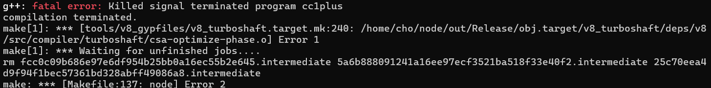
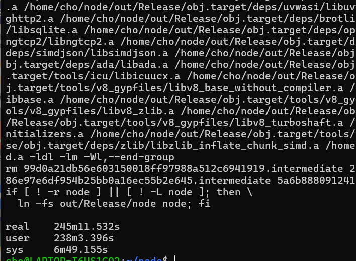
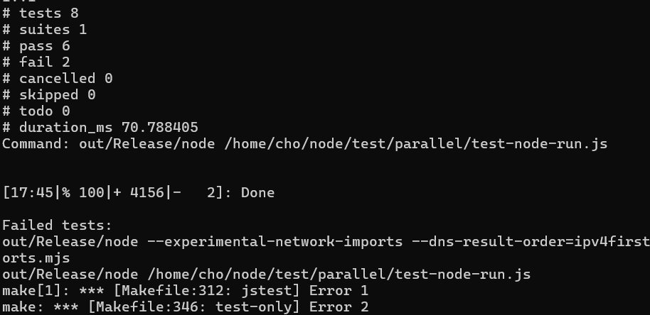
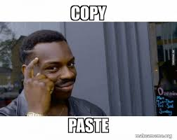
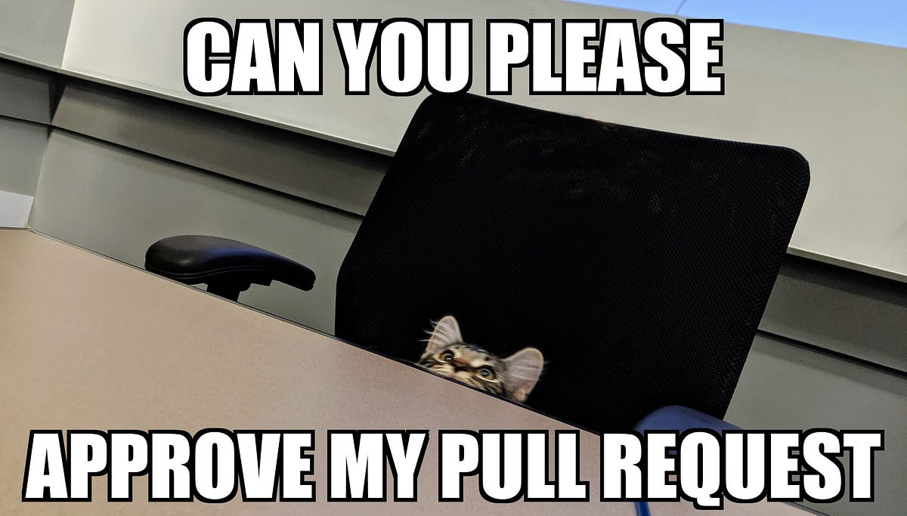

오픈소스 컨트리뷰션 아카데미라는 프로그램에서 멘티로 활동하고 있어요  
자세한 설명은 제가 쓰기 귀찮으니 [여기 링크](https://www.contribution.ac/ossca)를 참고하시면 좋겠습니다.  
대충.. 오픈소스 기여하는거 처음에 좀 힘들고 벽이 느껴질 수 있으니  
먼저 해본 멘토분들에게 배우기도 하고 다같이 으쌰으쌰 해봅시다!  
이런.. 프로젝트입니다

저는 Node.js 팀이라서, Node.js 코어에 기여하는 활동을 하고 있어요  
여기에서의 활동과 경험이 근래 들어 가장 저에게 도움이 되는 일이었다고 생각하는데


이런 감상젖은 말들은 나중에 회고같은 것으로 더 쓰겠습니다

오늘은 Node.js에 기여하기 위한, PR이 merge되기까지의 한 사이클을 기록하고자 해요

# Build & Test

먼저 본격적인 기여 활동에 앞서, 프로젝트를 빌드해봐야겠죠?

## 빌드해요

[Building Node.js](https://github.com/nodejs/node/blob/main/BUILDING.md) 여기를 참고하여 진행해볼 수 있습니다.

저는 Windows 11(WSL2 Ubuntu 20.04) 환경에서 진행했습니다.  
그리고 먼저 사전 준비사항 중 gcc, g++ 버전 요구사항이 있었는데,  
저는 요구사항보다 낮아서 업그레이드하고 진행했습니다.  
[여기를 참고](https://int-i.github.io/cpp/2021-07-10/ubuntu-gcc-11/)했어요.

이제 준비가 끝났으면, 로컬에 클론 받고,  
`./configure && make -j4`로 빌드를 시작해줍니다.

- `./configure`: 먼저 빌드 환경이 제대로 갖추어졌는지 사전에 점검합니다.
- `make` : Node.js 빌드 프로세스는 Makefile로 관리되며, `make` 명령어로 빌드를 시작합니다.
- `-j4` : 프로세스를 4개 써서 병렬 연산을 진행합니다.

아? 그리고 시작부터 끝까지의 시간이 알고싶다면 `time`명령을 사용합니다.  
`time make` 이런식으로요  
시작!


어라? 그런데



이렇게 끝나버렸어요 ㅜㅜ  
찾아보니.. `-j4`를 더 낮춰서 해보라고 하길래(대충.. wsl2에서, 프로세서가 충분치 않을 때 그런다고 합니다)  
아예 그냥 프로세서 하나만 써서 하기로 하고, 자고 일어났습니다.

<figure>


<figcaption>

출처 - https://www.youtube.com/watch?app=desktop&v=7vnqiQ5_qU8

</figcaption>

</figure>

자고 일어났더니..



음... 4시간이 걸렸네요?  
그나마 별 일 없이 끝난게 다행입니다 ㅋㅋ

나중에는 [Building Node.js with Ninja](https://github.com/nodejs/node/blob/main/doc/contributing/building-node-with-ninja.md)라는 잡기술을 사용하여 그나마 빠른 빌드가 가능해졌습니다

## 테스트를 실행해봐요

이제 테스트를 돌려봅시다.  
Node.js는 프로젝트 규모도 크니까 매우 많은 테스트코드가 있어요..  
[여기](https://github.com/nodejs/node/blob/main/BUILDING.md#running-tests)를 참고하여 테스트를 실행해봅시다

`make test-only`를 실행한 결과



어라? 테스트가 실패해버렸어요

## 실패한 테스트를 살펴봐요

`node --run <script-in-package-json>`라는 cli 명령에 대한 테스트가 실패한 것인데요..  
해당 feature는 [PR #52190](https://github.com/nodejs/node/pull/52190)에서 처음 제안되어 Node 22버전에서 합류했습니다  
`npm run build` 이런거 하듯이, `package.json`에 정의된 script를 실행하는 명령이고, 아직 experimental인가봅니다.

아무튼.. 테스트 파일에서 어떤 하위 테스트가 실패했는지도 살펴보고,  
다른 테스트는 무엇이 있으며  
소스코드(`task-runner.cc`)도 살펴보고 나서, 왜 그랬는지 보니..

이게 package.json을 찾으러 현재 디렉토리부터 시작해서 root(`/`) 디렉토리까지 거슬러 거슬러 올라가게 되어있습니다.  
근데 실패한 테스트는, root까지 `package.json`이 없다고 상정한 것인데  
저는 왜인지 루트에 `package.json`이 있어서  
테스트에서 기대하는 에러 문구와는 다른게 출력된 것입니다

# 기여하기

이제 기여를 해봅시다.  
위에서 이미 뭔가 문제를 겪었으니, 이걸 활용하면 될 것 같아요

## 1. Contribution Idea

해당 경험을 온라인 미팅 때 나누었는데,  
멘토님께서 관련해서 여러 조언이나 기여 방향 등을 말씀해주셨어요  
마침 예외처리 관련 테스트가 부족한 듯 보여서  
소스코드에서 발견했던 다른 예외케이스들도 다루는 하위 테스트를 작성하는 쪽으로 생각하게 됐습니다  
기여 뭐하지? 하는게 꽤 큰 고민인데.. 바로 발견해버렸어요. 츄베릅


## 2. 수정사항을 작성하기

먼저 어떤 예외케이스가 있을지 봅시다.

```cpp
  if (!package_json.has_value()) {
    fprintf(stderr, "Can't read package.json\n");
    result->exit_code_ = ExitCode::kGenericUserError;
    return;
  }

...

  // If document is not an object, throw an error.
  if (error || document.get_object().get(main_object)) {
    fprintf(stderr, "Can't parse package.json\n");
    result->exit_code_ = ExitCode::kGenericUserError;
    return;
  }

  // If package_json object doesn't have "scripts" field, throw an error.
  simdjson::ondemand::object scripts_object;
  if (main_object["scripts"].get_object().get(scripts_object)) {
    fprintf(stderr, "Can't find \"scripts\" field in package.json\n");
    result->exit_code_ = ExitCode::kGenericUserError;
    return;
  }
```

(1) `package.json`이 없을 때, (2) `package.json`을 파싱할 수 없을 때, (3) `package.json`에 적절한 `script` 룰이 없을 때  
일단은 이정도 있네요  
(1)은 이미 어느정도 다루어지고 있으니, (2)와 (3)에 대한 서브테스트를 만들어보면 좋겠어요

일단 테스트를 위한 더미 파일을 만들고 싶은데  
이런 테스트용 파일은 `test/fixtures`에 두면 된다네요  
이미 이 `test-node-run` 테스트에서 `/test/fixtures/run-script` 위치에 테스트용 파일들을 두고 쓰고 있으니  
여기에 추가적으로 파싱 불가한 `package.json`과 `script`룰이 없는 `package.json`을 만들어줬습니다

이제, sub test를 작성합시다

```js
it("returns error on unparsable file", async () => {
  const child = await common.spawnPromisified(
    process.execPath,
    ["--no-warnings", "--run", "test"],
    { cwd: fixtures.path("run-script/cannot-parse") }
  );
  assert.match(child.stderr, /Can't parse package\.json/);
  assert.strictEqual(child.stdout, "");
  assert.strictEqual(child.code, 1);
});

it('returns error when there is no "scripts" field file', async () => {
  const child = await common.spawnPromisified(
    process.execPath,
    ["--no-warnings", "--run", "test"],
    { cwd: fixtures.path("run-script/cannot-find-script") }
  );
  assert.match(child.stderr, /Can't find "scripts" field in package\.json/);
  assert.strictEqual(child.stdout, "");
  assert.strictEqual(child.code, 1);
});
```

먼저 `it()`에 서브테스트 설명을 쓰고..  
`node --run`을 실행하고..  
`어쩔.매치(regex)`로 에러 문구를 확인하고..  
`어쩔.무조건같아야함()`으로 에러코드와 출력 등을 확인하고..

이런 식의 테스트 코드를 짜줍니다.  
이미 일련의 테스트 코드가 있으니 어렵지 않게 따라할 수 있어요

<figure>



<figcaption>

제가 이랬다는건 아닙니다..  
출처 - https://makeameme.org/meme/copy-paste-859eee9d5e

</figcaption>

</figure>

## 3. Commit & PR

이제 준비되었다면, 커밋하고 풀 리퀘스트를 올릴 차례입니다  
이 과정은 [pull-requests](https://github.com/nodejs/node/blob/main/doc/contributing/pull-requests.md)문서를 꼼꼼히 확인하여  
컨벤션 룰을 잘 지키도록 합시다.

### 3-1. Commit 사전 준비

먼저 위에서 수정하기 전에, 먼저 **Fork**한 상태일 것인데  
새로운 PR을 위한 브랜치를 먼저 뻗은 상태에서 수정했어야 합니다.

만약 아차! 이미 메인에 했어요! 하시는 분들이 있다면  
`git stash`로 수정을 임시저장하고,  
`git checkout -b new-branch-name`으로 새로운 브랜치를 만들어 체크아웃,  
`git stash pop`으로 다시 가져와줍시다.

수정했으면, 테스트도 잘 돌아가는지 확인해야겠죠?  
`make test`로 전부 돌려볼 수도 있지만  
특정 테스트만 필요한 경우 `tools/test.py test-node-run.js` 이런 식으로 골라서 할 수 있습니다

그리고 `make lint`같은 lint 체크도 잊지맙시다.

### 3-2. Commit

그 다음은.. 커밋합시다.  
커밋과 관련해서도 [가이드라인](https://github.com/nodejs/node/blob/main/doc/contributing/pull-requests.md#step-4-commit)이 잘 나와있어요  
아래처럼 나오면 됩니다.

```
subsystem: explain the commit in one line

The body of the commit message should be one or more paragraphs, explaining
things in more detail. Please word-wrap to keep columns to 72 characters or
less.

Fixes: https://github.com/nodejs/node/issues/1337
Refs: https://eslint.org/docs/rules/space-in-parens.html
```

앗 그런데 `upstream`의 `main`에서 혹시나 업데이트가 있었을 수 있어요  
`git fetch upstream HEAD && git rebase FETCH_HEAD`를 한 번 해줍시다

### 3-3. Pull Request

먼저 `git push origin my-branch`로, fork된 레포지토리에 push합시다.  
이제 Github로 가서 새 Pull Request를 열고..  
적당한 내용을 작성해줍시다  
눈 한번 딱 감고 PR 열기 누르면 됩니다~  
이제 어뿌루부를 기다리는 일만 남았어요

<figure>



<figcaption>

출처 - https://oumaima-dahhoum.medium.com/how-to-create-a-good-pull-request-with-examples-and-templates-cfc92f2bb94e

</figcaption>

</figure>

이제 코멘트를 기다리다보면 "이 부분 살짝 이렇게 수정 가능?" 이런 요청이 있을 수도 있는데  
이런 경우 고쳐서, fixup으로 커밋하고, 푸시하면, 기존 PR에 반영됩니다

[제가 열고, approve받고, merge된 PR](https://github.com/nodejs/node/pull/54204)

# 끝

꽤 호흡이 긴 주제기도 했고  
자꾸 기록이 빵꾸난 곳이 있어서.. 제대로 썼는지 모르겠네요  
엥? 싶은것들은 말씀 주시면 감사하겠습니다.

이제 다음 사냥감을 찾으러 가야겠습니다..
기여할 주제 찾는 것부터 어려워요  
제 실력도 부족하니 그에 맞는걸 찾으려니 더욱 ㅜㅜ.

이만 마칩니다
