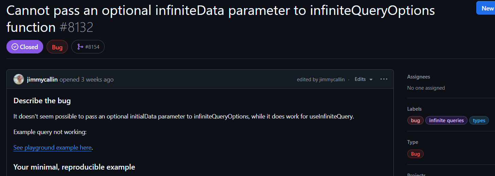
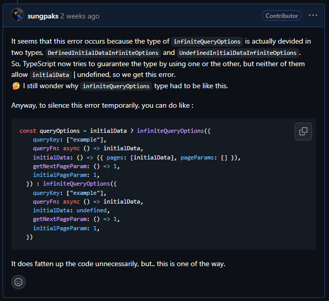
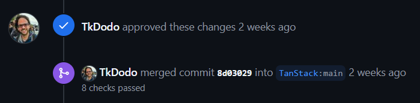
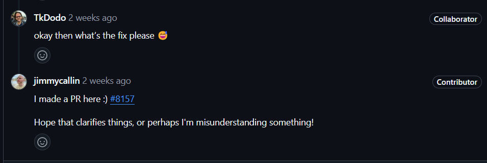
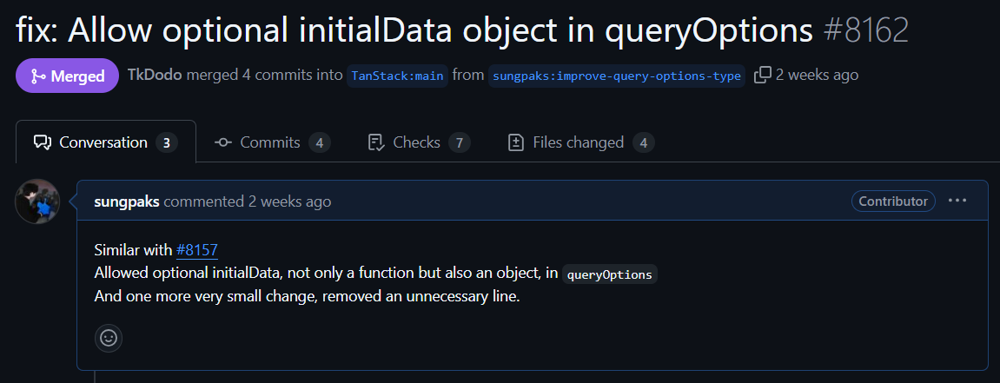
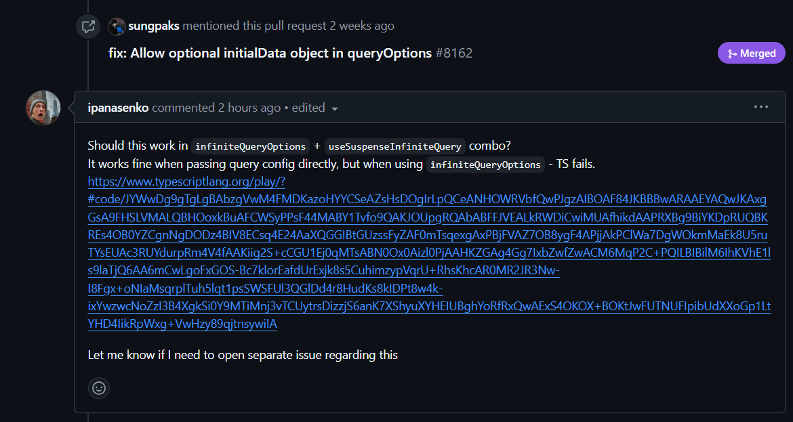

<figure>


<figcaption>
요새 갑자기 꽂힌 밈.. (원본: https://x.com/tttoootchi/status/1801572477702967698)
</figcaption>

</figure>

[TanStack Query](https://github.com/TanStack/query)는 프론트엔드 개발자분들에겐 꽤 유명할 것 같은데요  
이름이 바뀌기 전에는 React Query로 유명했고, Svelte, Vue 등등 다른 프레임워크들 또한 지원합니다  
이게 뭐하는 패키지냐 하면

> 🤖 Powerful asynchronous state management, server-state utilities and data fetching for the web.

한 마디로 서버와 브라우저 간에 데이터를 동기화하고 관리하는 데 아주 강력한 도구입니다  
TypeScript와의 완전한 통합도 지원하구요

이 유명한 프로젝트에 박힌 42.2k회의 Star에 저도 한 몫 하고 있었는데요  
그냥 어느 날엔가.. 깃허브를 내리다가.. 피드에서 TanStack Query로 들어가서.. Issue를 봤습니다  
그러고는 우연히 그냥 재밌어보이는, 할만해보이는 이슈를 발견했습니다

# 이슈를 뜯어봐요

[Cannot pass an optional infiniteData parameter to infiniteQueryOptions function](https://github.com/TanStack/query/issues/8132)라는 이슈였습니다



이게 TanStack React Query에서는 Query에 넣는 옵션 객체를 `queryOptions`로 따로 선언하여 만들어둘 수 있습니다  
`infiniteQuery`에 대한 `infiniteQueryOptions`도 마찬가지구요  
이런 식으로요

```ts
const queryOptions = infiniteQueryOptions({
  queryKey: ["example"],
  queryFn: async () => initialData,
  getNextPageParam: () => 1,
  initialPageParam: 1
});
```

그리고 이제 여기에 `initialData`라는 초기값을 정의해줄 수 있는데,  
아래같이 optional하게 넣으면 사실 동작은 하는데 typescript에서 타입 에러를 띄운다는 문제였습니다

```ts
const queryOptions = infiniteQueryOptions({
  queryKey: ["example"],
  queryFn: async () => initialData,
  // initialData below errors
  initialData: initialData
    ? () => ({ pages: [initialData], pageParams: [] })
    : undefined,
  getNextPageParam: () => 1,
  initialPageParam: 1
});
```

음..  
재밌어보입니다

# 소스코드를 들춰봐요

당연히 먼저 소스코드를 까봐야겠죠?  
어지간히 해볼만한지 판단도 해야하고요 ㅋㅋㅋ


일단 루트 경로에서.. `packages`로 들어갑니다.  
TanStack Query 레포지토리는 vue, svelte, 등등 여러 패키지들에 대한 소스코드를 여기에 다 둡니다  
그리고 여기서, 우리는 React Query니까, `/packages/react-query`로 들어갑시다.  
그리고 `src/`로 한번 더 들어가면..  
[`infiniteQueryOptions.ts`](https://github.com/TanStack/query/blob/main/packages/react-query/src/infiniteQueryOptions.ts)를 찾아낼 수 있습니다

이제 docs에서 [infiniteQueryOptions](https://tanstack.com/query/latest/docs/framework/react/reference/infiniteQueryOptions)가 어떤 값을 가질 수 있는지 명세도 좀 보고, 소스코드를 주르륵 한번 봅니다.

`infiniteQueryOptions`는 `initialData` 프로퍼티를 가질 수도, 가지지 않을 수도 있는데  
타입 구현이 사실은 어떻게 되어있냐면..  
`initialData`가 undefined버전인 type과, defined버전인 type이 따로 있습니다;;  
git blame 열어봤는데 무슨 이유에서 이렇게 됐는지는 잘 모르겠습니다 ㅜㅜ

암튼간에, 이렇게 오버라이드된 type의 버전이 두 개고,  
optional할 때는 이 중 뭘 선택해도 `initialData`가 있거나 없거나인 양자중첩상태를 허용하지 않으니 문제가 생깁니다


그래서 이렇게 일단 답변을 달았었습니다



요약하자면, 이러이렇게 해서 슈뢰딩거의 타입으로 지정하니까 안됐던거다, 대충 저런 바보같은 방식으로 고칠수는 있는데.. 좀 드럽긴함  
이라고 적어놨습니다

사실 이러고 말면 좀 .. 그렇죠? 게다가 좀 간단하기도 하고, 고쳐보기로 했습니다

# 고쳐봐요

오픈소스 프로젝트에 기여할 때 가장 먼저 해야하는 것은  
대개 [`CONTRIBUTING.md`](https://github.com/TanStack/query/blob/main/CONTRIBUTING.md)라는 이름의 기여 가이드라인을 읽는 것입니다  
여기서는 보통 프로젝트를 로컬에서 빌드하고, 코드를 작성/수정하고, 커밋하고, 테스트하고, PR하고, 어쩌구 저쩌구 하는 가이드라인을 줍니다

그러니 그대로 따라서 빌드를 해주고  
`pnpm run watch`로 개발서버를 열어줍니다  
이제 `undefined`버전 타입을 수정하여 Optional이 가능하게 했습니다

저는 처음엔 잘 몰라서 *examples/react/infinite-query/index.tsx*같은 example코드에 버그 reproduce 코드를 써놓고  
_import '../../packages/react-query/src/infiniteQueryOptions'_ 처럼 가져와 사용하면서 확인했는데  
나중에 보시면 아시겠지만 각 소스코드들 근처에 test코드가 함께 있어서, 여기다가 테스트를 작성하며 작업하는게 좋겠습니다.

<figure>


<figcaption>누군가는 테스트 작성해야하잖아</figcaption>

</figure>

그래서 아래처럼 고쳐놓고, PR을 열었습니다

```diff
export type DefinedInitialDataInfiniteOptions<
  TQueryFnData,
  TError = DefaultError,
  TData = InfiniteData<TQueryFnData>,
  TQueryKey extends QueryKey = QueryKey,
  TPageParam = unknown,
 > = UseInfiniteQueryOptions<
  TQueryFnData,
  TError,
  TData,
  TQueryFnData,
  TQueryKey,
  TPageParam
 > & {
  initialData:
    | NonUndefinedGuard<InfiniteData<TQueryFnData, TPageParam>>
    | (() => NonUndefinedGuard<InfiniteData<TQueryFnData, TPageParam>>)
+    | undefined
```

고작 한 줄 써놓고 생색내는 것 같지만 여정은 지금부터 시작입니다  
그리고 사실 오픈소스 기여는 작은 기여와 큰 기여로 나뉘는게 아닌  
큰 기여와 개큰 기여로 나뉩니다. (뇌피셜임)

## 아차, 답변을 못 봤어요

후다닥 고쳐서 커밋,푸시하고 PR을 열었는데  
이슈에 답변이 달려있었습니다


저는 `Defined~~`에서 받아주게 했는데  
`Undefined~~`에서 해야한다고 하네요  
`queryOptions`에서도 그렇게 처리하고 있다고 합니다.

그래서 다시 `Undefined~~`를 아래와 같이 수정했습니다

```diff
- initialData?: undefined
+ initialData?:
+  | undefined
+  | InitialDataFunction<
+    NonUndefinedGuard<InfiniteData<TQueryFnData, TPageParam>>
+    >
```

콜라보레이터가 답변에서 언급한 `UndefinedInitialDataOptions`도 아래처럼 생겼습니다

```ts
UseQueryOptions<TQueryFnData, TError, TData, TQueryKey> &
  {
    initialData:
      undefined | InitialDataFunction<NonUndefinedGuard<TQueryFnData>>
  };
```

이와 일관성있게, `UndefinedInitialDataInfiniteOptions`도 `undefined`와 `InitialDataFunction`까지 커버 가능하게 타입을 수정하고 PR을 올렸습니다.

## 근데 InitialDataFunction과 NoneUndefinedGuard는 먼가요?

근데 작성한 코드를 보면 `InitialDataFunction`이라는 것과 `NonUndefinedGuard`라는게 있습니다

`InitialDataFunction`에 대해서 먼저 보면 사실

```
(() => NonUndefinedGuard<InfiniteData<TQueryFnData, TPageParam>>)
```

라고 그냥 써두면 안되나? 싶지만  
소스코드에 보면 아래와 같이 정의되어 있습니다

```ts
type InitialDataFunction<T> = () => T | undefined;
```

그리고 콜라보레이터가 말해주기를


> InitialDataFunction has undefined baked into the return value:

반환값이 `undefined`일 수도 있는 경우에 대해 보장해주는 유틸함수타입이네요.  
`baked into`라는 말은 약간.. _이미 반영되어 떼어낼 수 없는? 실수로 들어가버린?_ 이런 뜻이라고 합니다

그리고 `NoneUndefinedGuard`는 아래와 같이 정의되어 있습니다

```ts
type NonUndefinedGuard<T> = T extends undefined ? never : T;
```

undefined는 never 안되게 해준다네요~

# 테스트를 작성해요

또한 아래와 같은 피드백도 받았습니다


테스트를 좀 작성해달라고 합니다.  
아, 사실 응당 그래야죠?

테스트 파일에 가서 아래와 같은 항목을 만듭니다.

```ts
test("allow optional initialData", () => {});
```

이제 두 번째 인자의 콜백 내에 테스트를 작성합니다.  
이전에는 실패하지만 제가 고친 이후로 성공하는 테스트를요

```ts
test("allow optional initialData", () => {
  const initialData: { example: boolean } | undefined = { example: true };
  const queryOptions = infiniteQueryOptions({
    queryKey: ["example"],
    queryFn: async () => initialData,
    // initialData below errors
    initialData: initialData
      ? () => ({ pages: [initialData], pageParams: [] })
      : undefined,
    getNextPageParam: () => 1,
    initialPageParam: 1
  });
  expectTypeOf(queryOptions.initialData).toMatchTypeOf<
    InitialDataFunction<InfiniteData<{ example: boolean }, number>> | undefined
  >();
});
```

위와 같이 짜줬습니다. 사실 처음에 Issue 열었던 분이 제보한 코드를 긁어다 넣었어요  
그리고는 이제

```ts
expectTypeOf(targetObject).toMatchTypeOf<TypeToMatch>();
```

와 같이, `targetObject`와 `TypeToMatch`의 타입이 호환가능한지 테스트합니다.

이제 `pnpm run test`로 테스트를 실행하면 되겠습니다.



짜잔~ 그렇게 머지됐습니다

# 새로운 의견이 달렸어요

Merge된 PR에 새로운 의견이 달렸습니다.  
최초 이 이슈를 올리셨던 분이네요


제가 수정한 내용은 아래처럼

```diff
+  initialData?:
+    | undefined
+    | InitialDataFunction<
+        NonUndefinedGuard<InfiniteData<TQueryFnData, TPageParam>>
```

초기값을 반환하는 함수를 허용하는 내용이었습니다.  
`infiniteQueryOptions`의 레퍼런스 격인 `queryOptions`도 똑같이 생겼구요  
그런데 이 분이 말씀하시기를, 초기값 반환 함수 뿐만 아니라 그냥 초기값 객체도 받아줘야 하는게 아니냐? 입니다

```tsx
| NonUndefinedGuard<InfiniteData<TQueryFnData, TPageParam>>;
```

요놈을 포함하도록 말이죠  
그리고 이것이 없음으로 인해서 TypeError가 나는 코드를 보여주셨습니다  
콜라보레이터분이 보시고는 ㅇㅋ 그럼 고쳐주시던지~ 라고 하셨어요



그래서 이분이 직접 PR을 올리시고 머지되었습니다.

## 그럼 `queryOptions`도 이렇게 바꿔줘야 하는거 아님?

근데 처음에 말씀드렸듯이, 초기값 반환 함수까지만 허용하고, 초기값 객체 자체는 명시하지 않은거는 `queryOptions`도 마찬가지입니다. 저도 그래서 함수만 포함했구요
근데 그럼.. `infiniteQueryOptions`에 초기값 객체도 줄 수 있게 타입을 명시한 PR이 Merge되었다면,  
`queryOptions`도 마찬가지로 수정되어야 하는게 아닌지?  
그래서 물어보니까,  
_"물론, 전에는 실패하지만 수정 시 성공하는 테스트케이스를 작성 가능하다면요~"_ 라고 하셨습니다

## 그래서 2번째 PR을 준비했습니다.

그럼 이제 그것도 수정해봅시다.  
테스트 코드 먼저 짰어요 이번에는

```ts
it("should allow optional initialData object", () => {
  const testFn = (id?: string) => {
    const options = queryOptions({
      queryKey: ["test"],
      queryFn: async () => "something string",
      initialData: id ? "initial string" : undefined
    });
    expectTypeOf(options.initialData).toMatchTypeOf<
      InitialDataFunction<string> | string | undefined
    >();
  };
  testFn("id");
  testFn();
});
```

data타입이 `string`인 `queryOptions`를 만들고, `initialData`를 조건부에 따라 `undefined` 또는 `string`으로 넘겨줍니다.  
이제 `expectTypeOf().toMatchTypeOf<>();`로 확인해주면, 예상대로 수정 전에는 실패해요  
현재는 타입이 `undefined` 또는, `string을 뱉는 함수`만 가능하니까요

이제 `queryOptions`의 `UndefinedInitialDataOptions` 타입을 고쳐줍시다.

```diff
-  initialData?: undefined | InitialDataFunction<NonUndefinedGuard<TQueryFnData>>
+  initialData?:
+    | undefined
+    | InitialDataFunction<NonUndefinedGuard<TQueryFnData>>
+    | NonUndefinedGuard<TQueryFnData>
```

이렇게 고치니 테스트가 통과합니다



이제 수정사항을 커밋/푸시하고, 풀리퀘를 올리고 머지되었습니다

---

\
여기까지였습니다.  
재밌었네요~


오픈소스인 TanStack Query는 타입을 어떻게 정의해두는지도 살펴볼 수 있었고  
Type Test를 작성하는 법도 대충 알게 된 시간이었습니다  
오픈소스 들여다 보면 안목도 넓어지는게 좀 느껴지는 것 같기도 하구요

특히 오픈소스 기여는 쌩판 모르는(심지어는 외국의) 개발자들이랑 소통하고 협업한다는게 좀 매력적이고 재밌습니다  
기술적인 이야기도 나누고, 코드를 리뷰하고, 피드백을 반영하고, 이런 일련의 과정이 너무 좋죠  
그리고 Node.js 기여할 때부터 좀 느꼈는데, PR이 거절될 때조차 의미가 큽니다. 거절당하는게 무서워서 의견도 못 내면 안되잖아요

앞으로는 좀 주기적으로 꾸준히 기여해보는 것도 좋을 것 같아요  
Node.js 기여 팀에서 활동할 때 들었는데, 멘토님은 옛날에 한창 Node.js 기여활동 할 때는 아예 주 1회정도는 목표를 잡았다고 합니다  
Node.js같은 큰 프로젝트에서 어떻게 주 1회 기여를 하셨지..? ㄷㄷ;  
저도 좀 더 딥다이브로 기여해보고 해야겠어요

맞다 그리고 2시간 전에 따끈따끈한 새 코멘트가..



새로운 모험의 냄새가?

이만 마칩니다
