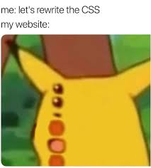

[No CSS Club](https://nocss.club/)회원이 아니라면 웹페이지의 스타일링을 위해 CSS는 필수적이고 중요합니다  
그러나 역사적으로 CSS는 개발자들에게 많은 고통을 주었습니다..  
그 역사에 대해서는 [CSS는 왜 어려운가?](https://yozm.wishket.com/magazine/detail/1319/)시리즈 글이 재밌고 유익하니 한번쯤 보시면 좋겠습니다.  
이 글 쓰신 분이 꽤 유명하신 분이던데, 최근에 한동안 velog trending 1위에 머무는 중인 [프론트엔드 관심사 분리에 관한 글](https://velog.io/@teo/separation-of-concerns-of-frontend#%EA%B4%80%EC%8B%AC%EC%82%AC%EC%9D%98-%EB%B6%84%EB%A6%AC-%EC%99%9C-%ED%95%B4%EC%95%BC%ED%95%A0%EA%B9%8C%EC%9A%94) 도 매우 유익합니다. 추천

아무튼 CSS에는 몇 가지 결함이 존재했습니다 :

- **Global Scope** : CSS 규칙을 선언하면 전체 문서에 영향을 미칩니다. 이 특성은 프로젝트가 커질수록 문서를 발디딜 틈 없는 규칙과 선택자의 지뢰밭으로 만들었습니다.
- **Specificity** : CSS는 선택자에 의한 규칙의 적용에 우선순위가 존재합니다. 규칙을 나중에 선언했다고 해서 기존 스타일을 덮어쓸 수 있는게 아닌 것입니다. 이러한 특성은 개발자들로 하여금 점점 더 복잡한 선택자를 만들고, `!important`나 inline-style같은 우회책에 찌들게 했습니다

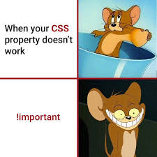

프로젝트가 커질수록 이 결함은 늘어나고 불어나서 개발자들을 고통스럽게 했습니다  
이러한 문제점을 해결하고 CSS를 현명하게 사용하기 위해, 단순히 CSS를 살짝 확장하는 방법론부터 아예 새로운 패러다임을 갖는 라이브러리나 프레임워크 등이 등장해왔습니다.  
CSS Modules, SCSS, CSS-in-JS, Utility-First CSS 라이브러리, 등등..

이러한 많은 선택지들 사이에서 프론트엔드 개발자는 매번 선택의 기로에 놓입니다.  
프로젝트의 특성, 함께 쓸 기술, 응집성, 생산성 등.. 많은 요인들이 고려되는데  
저는 이에 대해 고민하고 적절한 근거를 기반으로 어떤 방법을 사용할지 선택하려면 이론을 넘어서 경험이 필요하다고 생각했어요  
이것도 써보고, 저것도 써보고, 그 장단점을 몸으로 느껴보고, 그 경험들을 가지고 있다가 나중에 진짜 필요할 때 의사결정에 쓰고자 했습니다

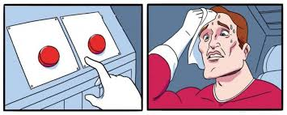

그리고 지금까지의 고민과 경험을 나누고자 해요  
이제부터는 제가 **지금껏 사용해본 스타일링 방법들**에 대해 이야기하고  
이를 실제로 사용했던 입장에서 어떤 **장단점**들이 있었는지 써보겠습니다  
그리고 모던 웹페이지 구성을 위해 필수적인 **동적 스타일링** 측면에 대해서도 쓰려고 합니다  
이는 매우 중요하고 이 또한 어떤 방법을 고를지 고민할 때 중요한 요인이니까요

# vanila CSS

이 블로그에는 순수하게 CSS만 사용하고 있습니다.  
처음 만들 때부터 일부러 생각했어요. CSS만 써보면서, 무슨 불편함이 생기고, 어떤 니즈가 생기는지 느껴보고 싶었습니다

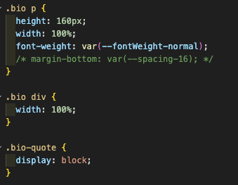

Global Scope는 확실히 문제입니다.  
블로그는 제가 혼자 개발하기도 하고, 그정도로 많은 스타일 코드가 발생하지 않아서 다행이지, 협업자가 있고 프로젝트가 커질 수록 이 선택자들 사이의 지뢰밭을 피하기는 쉽지 않을거예요

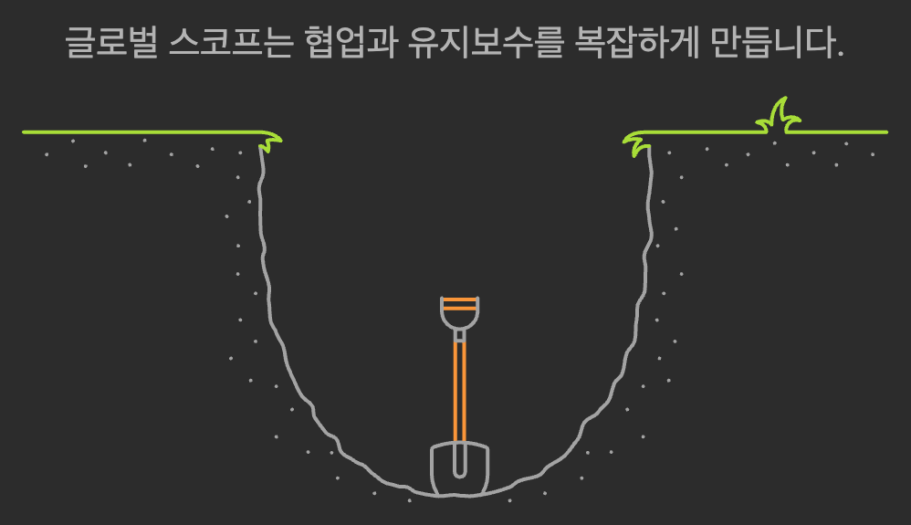

그리고 모든 스타일코드가 중앙화될 수밖에 없기 때문에, 전환 사이의 거리가 너무 멀어집니다..  
그렇다고 스타일코드를 여러개 둘 수도 없죠. 파편화되기 시작하면 Global Scope를 감당하기 끔찍해집니다

vanila CSS에서는 조건부 스타일링을, class같은 것을 동적으로 추가하거나 제거하여 달성합니다.  
만약 버튼을 클릭하여 body에 darkmode 클래스를 넣거나 제거하려면, 아래처럼 합니다.

```js
button.addEventListener("click", () => {
  // body 태그에 darkmode 클래스를 추가하거나 제거
  document.body.classList.toggle("darkmode");
});
```

또는 리액트 상태를 이용하여 일부 컴포넌트에 대해 동적으로 스타일을 적용하려면 이렇게 되겠네요

```jsx
<button className={isActive ? "active" : undefined}>
```

# CSS Modules

[런테일](https://github.com/RunTale/Runtale_FE_v2)이라는 서비스를 개발할 때 썼습니다

그대로 CSS를 작성하는건 똑같은데, 일정 부분(파일 등)에만 국한되는 **Local Scope를 가진 CSS코드**를 작성할 수 있어요.
`파일명.module.css` 이렇게 이름을 지으면 CSS module이 됩니다  
이를 `import styles from './my-style.module.css'`와 같이 import하여 사용해요  
그럼 이제 CSS Module은 선언된 클래스들에 대해 임의의 해시값을 추가하므로, class이름이 겹치더라도 다른 클래스가 되어 범위가 이를 import한 파일에만 한정됩니다.
이 덕분에 **CSS코드를 파일(컴포넌트, 페이지 등) 단위로 격리하고 구분**지을 수 있어요.

```css
/* Button.module.css */
.button {
  background-color: #3498db;
  padding: 10px;
}
```

```jsx
// React Component
import styles from "./Button.module.css";

function Button() {
  return <button className={styles.button}>Click Me</button>;
}
```

CSS Modules에서 조건부로 스타일을 적용하고 싶다면  
vanila CSS에서처럼 클래스를 동적으로 끼우는 것으로 해요  
`className={isActive ? styles.active : undefined}` 이런 식으로요

## 장단점

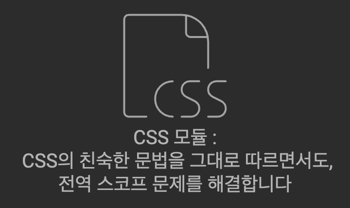

좋은 점은, vanila CSS를 잘 알면 이 module만으로도 충분히 편합니다.  
사실상 CSS와 달라질게 하나도 없으니까요.  
기존 CSS에서 열받았던 global scope를 해결하고, 덕분에 우선도와 복잡도가 점점 깊어지는 상황도 피할 수 있습니다  
또한 이제 이 덕분에 CSS 코드는 이를 필요로하는 코드의 바로 옆에 위치하여 묶일 수 있게 돼요

단점으로는 class이름의 가독성이 좀 떨어집니다. 어느정도는 알아볼만한데, 개발자도구로 검사할 때 좀 까다로워지는 측면이 없지않아 있습니다.  
동적스타일링도 사실은 다른 방법들에 비해 강점이 있는 편은 아니죠, 클래스 자체를 갈아끼우기 때문입니다

이외에 다른 자료들에서 보면 전역스타일링이나, 파편화가 심해진다는 것을 단점으로 이야기하기도 하는데, 전 딱히 공감하지는 않습니다.  
전역스타일링이 필요하면 여전히 모듈이 아닌 전역css시트를 작성할 수 있고, 우리는 모듈화를 위해 CSS Modules를 사용하기 시작한겁니다

# CSS-in-JS

CSS-in-JS는 **자바스크립트 코드에서 CSS를 작성**하는 패러다임입니다.  
styled-component나 emotion같은 것들이 대표주자인데  
저는 [emotion](https://emotion.sh/docs/introduction)을 주로 사용해봤습니다.
회사에서도 emotion으로 작성하는 경우가 꽤 많고,  
[처음 리액트 프로젝트](https://github.com/GPGT-Algorithm-Study/GPGT-Client) 할 때도 이거로 시작했어요.

emotion은 아래처럼 작성해요

```jsx
const RedButton = styled.button`
  background-color: red;
`;

function FooComponent() {
  return <RedButton>START!</RedButton>;
}
```

스타일을 갖는 컴포넌트를 생성하고, 마치 으레 HTML요소나 컴포넌트를 사용하듯이 사용합니다.  
컴포넌트 파일에 함께 존재하게 해도 되고, 따로 `style.jsx`로 옆에 분리하여 둬도 괜찮습니다.  
취향에 따라 갈리는 것 같아요.

동적 스타일링은 아래처럼 합니다.

```jsx
const RedButton = styled.button`
  background-color: ${props => (props.active ? "red" : "gray")};
`;

function FooComponent() {
  const [isActive, setIsActive] = useState(false);
  return (
    <RedButton active={isActive} onClick={() => setIsActive(prev => !prev)}>
      START!
    </RedButton>
  );
}
```

마치 진짜 컴포넌트를 만들듯이, props를 넘기고 styled 코드 내에서 props를 받아 쓸 수 있어요.  
또는 아래처럼도 됩니다.

```jsx
function FooComponent() {
  const [isActive, setIsActive] = useState(false);
  const buttonStyle = css`
    background-color: ${isActive ? "red" : "gray"};
  `;
  return (
    <button css={buttonStyle} onClick={() => setIsActive(prev => !prev)}>
      START!
    </button>
  );
}
```

## 장단점

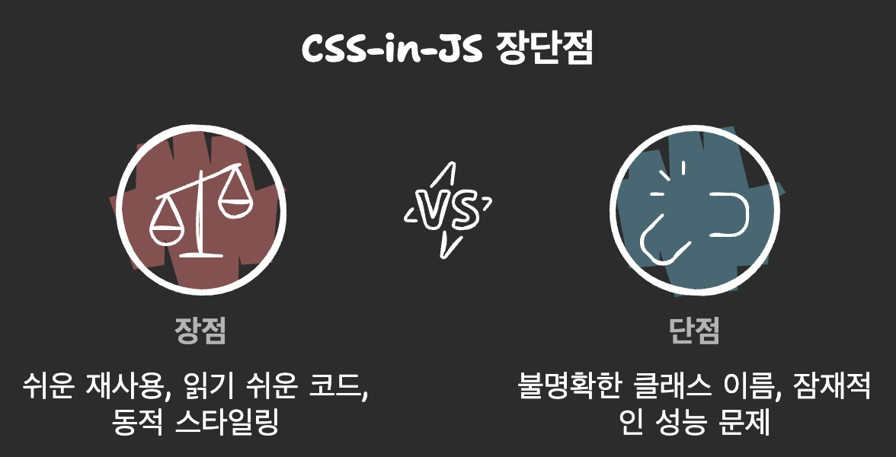

이 방법은 스타일 코드의 재사용이 꽤 쉽고 좋았어요.  
그리고 제일 좋은 점은, 각 컴포넌트들에 이름이 있으니까 코드 수정할 때 알아보기 쉽다는 점입니다.  
예를 들어 `TitleWrapper, ContentWrapper` 이런식으로요. 원래같으면 그냥 `div, div, ...` 다 똑같은 div겠네요.  
꽤 **읽기 쉬운 코드**를 만들어줍니다.

JS 변수를 그대로 가져다가 동적 스타일링에 활용할 수 있다는 점도 큰 장점입니다.  
리액트나 JS적인 사고방식에서 별로 멀리 떨어지지 않아도 된다는 점에서 좋습니다  
다른 방법들도 동적 스타일링이 어려운건 아니지만, 따지자면 이게 좀 더 편하더라구요

그리고 CSS코드가 JS코드 옆에 존재할 수 있다는 점도 은근히 장점입니다 (colocation.)  
딱 한 파일에 필요한 CSS-in-JS 코드만이 해당 파일 옆 또는 심지어 같은 파일에 존재할 수 있습니다

한 가지 아쉬운 점은, 개발자도구에서 검사할 때 class이름이 그냥 임의의 문자열입니다  
이게 진짜 알아보기 힘들어져요.  
근데 이 단점은 [이런 플러그인](https://emotion.sh/docs/@emotion/babel-plugin)같은 것들로 커버할 수 있습니다

진짜 단점으로는 **런타임 성능**이 안좋다는 썰이 있는데.. 밑에서 알아보도록 하겠습니다.

# Material UI (UI 라이브러리)

사실 [런테일](https://github.com/RunTale/RunTale_FE)이라는 서비스를 개발하는 단계에서 처음에 주로 Material UI를 사용했습니다  
Material UI라는건 일종의.. **UI라이브러리** 또는 컴포넌트 라이브러리예요  
`npm install @mui/material @emotion/react @emotion/styled` 이렇게 일단 설치하면  
이 패키지에서 여러 미리 스타일이 적용된 컴포넌트들을 제공해줍니다.  
Material UI 이외에도 Chakra UI, bootstrap, ... 이런게 있나봅니다.

```jsx
import React from "react";
import Button from "@mui/material/Button";

function App() {
  return (
    <Box sx={{ textAlign: "center", marginTop: "50px" }}>
      <Button variant="contained" color="primary">
        Click Me
      </Button>
      <Button variant="outlined" color="secondary" sx={{ marginLeft: "10px" }}>
        Cancel
      </Button>
    </Box>
  );
}

export default App;
```

동적 스타일링은 mui같은 경우 `sx` props를 inline-style처럼 명시하게 하거나, 아예 몇몇 자주 쓰이는 토큰을 props로 넣을 수 있으니 이걸 이용합니다.

```jsx
<Button variant="contained" color={isCancel ? "red" : "blue"}>
  This is button
</Button>
```

## 장단점

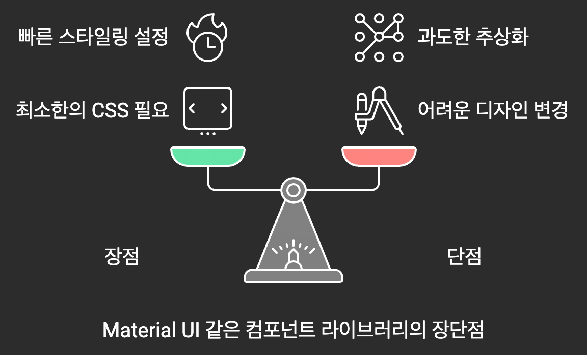

장점으로는, 일단 "우리 프로젝트 깔에는 이게 맞겠다" 싶은걸 잘 고르고 시작한다면, 별도의 CSS코드를 거의 작성하지 않아도 됩니다  
런테일 프로젝트도 처음에는 색상 스타일 구상했던게 딱 MUI 깔이라서, 이걸 거의 가져다 썼어요  
그랬더니 아예 전체 프로젝트에서 css코드는 거의 없었습니다  
근데 디자인 컨셉을 새로 수정하는 v2작업을 진행하면서 거의 쓸모가 없어졌지만..

이게 단점이긴합니다. 어느정도 수준에서는 매우 빠르고 간단하게 스타일링할 수 있지만, 디테일이 달라지게 되면 힘들어져요. 결국은 쓰는 의미가 거의 없어집니다  
또 단점인건 대신 해주는게 너무 많아요. 기본 글로벌 스타일이나, 컴포넌트 자체의 스타일이나, 어디서부터 잘못됐는지를 잘 모를 때가 있습니다

그리고 그 UI라이브러리에 대해 조금은 알고 시작해야하는 러닝커브가 존재합니다  
MUI를 예로 들면, `<Box>`를 이용해야겠구나, `<Card>`를 사용해야지, 이런거를 처음부터 알 수는 없으니까요

그리고 MUI는 `<Grid>, <TreeView>`같은 유틸리티 UI 컴포넌트 셋도 제공합니다.  
이건 꽤 강력한데, `<Grid>`로 반응형 레이아웃을 빈틈없이 구성할 수도 있고  
`<TreeView>`같은 경우, 복잡한 UI구성을 빌트인 컴포넌트로 편하게 작성해볼 수 있습니다

# Tailwind CSS

[tailwind css](https://tailwindcss.com/)는 **utility-first** CSS 프레임워크입니다.

> *Tailwind CSS* is a utility-first CSS framework for rapidly building modern websites without ever leaving your HTML.

공식사이트에서 이런 소개를 할 정도로, 어디 가지 말고 적당히 클래스 몇 개 붙여서 스타일을 적용할 수 있게 한다, 라는 목표를 두고 있습니다.  
실제로도 컴포넌트에서 바로 인라인으로 스타일을 주르륵 써놓기만 하면 끝입니다

```jsx
<button className="bg-blue-500 text-white py-2 px-4 rounded hover:bg-blue-700">
  Click Me
</button>
```

이런 식으로, 간단히 유틸리티 클래스를 몇 개 덕지덕지 붙여서 스타일을 적용합니다.  
예를 들어, "글씨는 흰색이면 좋겠어" => `text-white`

Tailwind CSS를 사용하는데 조건부로 스타일을 적용하고 싶다면  
간단히, 자바스크립트의 템플릿 리터럴 문법으로 원하는 자리에 쉽게 동적으로 유틸리티 클래스를 넣을 수 있습니다

```jsx
<button
  className={`bg-blue-500 ${theme === "DARK" ? "text-white" : "text-black"}`}
>
  Click Me
</button>
```

이렇게요

아니면 문자열 뒤에 `+ " text-white"`처럼 덧붙여서 스타일을 빌드할 수도 있습니다  
물론 중간중간에 공백이 잘 들어가게 해주도록 합시다  
이런 식으로 할 수 있다는 뜻

```jsx
const buttonClassName = "rounded ";
if (selectedColor === "RED") buttonClassName += "bg-red-500 ";
if (selectedColor === "GREEN") buttonClassName += "bg-green-500 ";
if (selectedColor === "BLUE") buttonClassName += "bg-blue-500 ";
...
return <button className={buttonClassName}>Click Me</button>
```

그럼 복잡한 조건문이라도 문제없이 주르륵 다 거쳐서 문자열로 쉽게 빌드하고 꽂아넣을 수 있습니다

## 장단점

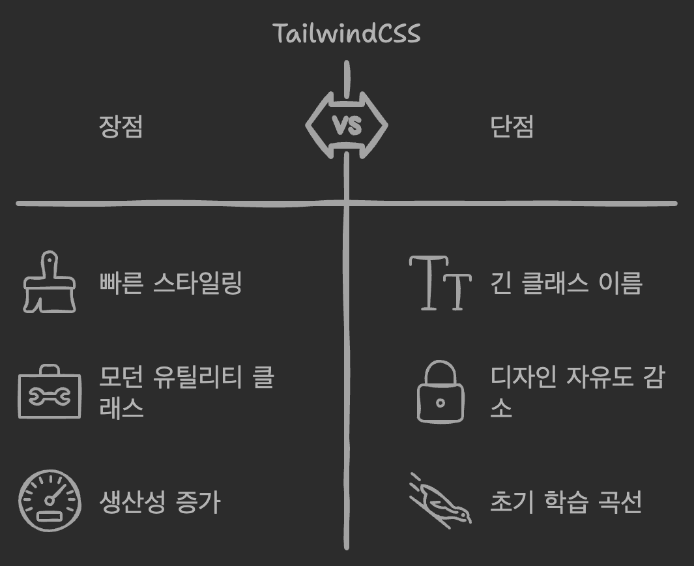

단점으로는..  
매우 긴.. **끔찍하게 긴 클래스이름**을 갖는 컴포넌트가 등장해버립니다 ;; 막 쓰다보면 생각보다 길어져요.  
그리고 물론 모던 디자인을 위해 엄선된 유틸리티 클래스들이지만, 그만큼 **자유도**가 떨어집니다

장점으로는..
그래도 앉은 자리에서 스타일을 모두 해결할 수 있고, 엄선된 모던 스타일용 유틸리티 클래스들이라 은근 편한건 맞습니다.  
유틸리티 클래스들을 좀 쓰다보면 은근히 익숙해져서 꽤 빠르게 스타일작업을 진행할 수 있습니다  
진짜 이것만 쓰면서 한 몇 주 지나면? 또는 며칠내로? 완전히 **생산성**이 엄청나질 것 같다는 느낌이 들었습니다

근데 이건 곧 단점이 될 수 있어요  
새롭게 배워야 할게 생긴다는 뜻이고, 추가적인 **러닝 커브**가 존재하는 셈입니다  
CSS만 알면 됐지 또 각각의 유틸리티 클래스들을 외우려면 싱찌증날 수 있어요

저는 컴포넌트의 재사용성이 떨어진다고 생각했는데, 사실 그렇지는 않은 것 같아요. 오히려 더 용이할 수도 있겠다는 생각을 합니다  
미리 공통버튼같은 재사용 컴포넌트를 만들어두고, 이걸 분리해둔 다음에, 나중에 갖다 쓰고 필요에 따라 클래스이름을 또 거기다 덧붙여서 스타일을 커스텀할 수도 있겠습니다

# CSS-in-JS 성능에 대한 괴소문은 진짜인가요?

CSS-in-JS는 편하지만 최종적으로는 **runtime에 이를 변환해주는 작업이 필요**합니다  
이는 다른 방법들과는 다르게 성능 오버헤드를 유발할 수 있습니다  
라는 이야기가 있어서, 한번 간단히 확인해봤습니다.

## 간단한 성능 테스트를 위한 세팅

간단한 코드들을 작성할건데, 별 신경쓰지 않고 결과만 보셔도 됩니다

```jsx
import { useState } from "react";

export default function VanilaTest() {
  const [isActive, setIsActive] = useState(false);

  return (
    <div>
      <button onClick={() => setIsActive(prev => !prev)}>
        Toggle Active State
      </button>
      <TestArea isActive={isActive} />
    </div>
  );
}

function TestArea({ isActive }) {
  return (
    <div className={`test-element ${isActive ? "active" : "inactive"}`}>
      Vanila CSS Test
      {isActive && <div className="status-badge">Active!!</div>}
    </div>
  );
}
```

```css
.test-element {
  width: 300px;
  height: 200px;
  background-color: lightgray;
  border-radius: 10px;
  box-shadow: 0 4px 6px rgba(0, 0, 0, 0.1);
  display: flex;
  flex-direction: column;
  justify-content: center;
  align-items: center;
  font-size: 20px;
  font-weight: bold;
  color: #333;
  transition: all 0.3s ease;
}

.test-element.active {
  background-color: lightcoral;
  color: white;
}

.test-element.inactive {
  background-color: lightblue;
  color: darkblue;
}

.status-badge {
  margin-top: 10px;
  padding: 5px 10px;
  background-color: orange;
  color: white;
  border-radius: 5px;
  font-size: 14px;
}
```

그냥 vanila CSS를 사용하는 `VanilaTest` 컴포넌트를 위와 같이 작성하고

```jsx
import { useState } from "react";
import styled from "@emotion/styled";

export default function EmotionTest() {
  const [isActive, setIsActive] = useState(false);

  return (
    <div>
      <button onClick={() => setIsActive(prev => !prev)}>
        Toggle Active State
      </button>
      <TestElement isActive={isActive}>
        Emotion Test
        {isActive && <StatusBadge>Active!!</StatusBadge>}
      </TestElement>
    </div>
  );
}

const TestElement = styled.div`
  width: 300px;
  height: 200px;
  background-color: ${props => (props.isActive ? "lightcoral" : "lightblue")};
  border-radius: 10px;
  box-shadow: 0 4px 6px rgba(0, 0, 0, 0.1);
  display: flex;
  flex-direction: column;
  justify-content: center;
  align-items: center;
  font-size: 20px;
  font-weight: bold;
  color: ${props => (props.isActive ? "white" : "darkblue")};
  transition: all 0.3s ease;
`;

const StatusBadge = styled.div`
  margin-top: 10px;
  padding: 5px 10px;
  background-color: orange;
  color: white;
  border-radius: 5px;
  font-size: 14px;
`;
```

CSS-in-JS 라이브러리인 emotion을 사용하는 `EmotionTest` 컴포넌트를 만들었어요  
비교에 도움이 될까 싶어 일부러 스타일 줄도 많이 넣고, 조건부 스타일도 추가해버렸습니다.  
이정도면 조건은 똑같겠죠?

아, Tailwind도 같이 해보고싶어져서 `TailwindTest`도 만들었습니다

```jsx
export default function TailwindTest() {
  const [isActive, setIsActive] = useState(false);

  return (
    <div>
      <button onClick={() => setIsActive(prev => !prev)}>
        Toggle Active State
      </button>
      <TestArea isActive={isActive} />
    </div>
  );
}

function TestArea({ isActive }) {
  return (
    <div
      className={`flex flex-col items-center w-[300px] h-[200px] rounded-lg shadow-lg justify-center text-xl font-bold transition-all duration-300 ${
        isActive
          ? "bg-[lightcoral] text-white"
          : "bg-[lightblue] text-[darkblue]"
      }`}
    >
      Tailwind Test
      {isActive && (
        <div className="mt-2 px-4 py-2 bg-[orange] text-white rounded-lg text-sm">
          Active!!
        </div>
      )}
    </div>
  );
}
```

처음에는 따로 `TestArea`를 분리하지 않았는데,  
나중에 생각해보니 Emotion은 컴포넌트 하나 더 뺀 셈이니까 Emotion가 더 불리하려나? 싶어서,  
스타일이 적용된 영역을 Vanila와 Tailwind에서도 별도의 컴포넌트로 분리했습니다  
이제 이 컴포넌트들을 적당히 잘 나열했습니다

```jsx
function App() {
  return (
    <>
      <VanilaTest />
      <br />
      <EmotionTest />
      <br />
      <TailwindTest />
    </>
  );
}
```


## 성능 테스트해보기

이제 React Dev Tools - Profiler를 켜고, 첫 렌더링의 FlameGraph를 살펴봅시다

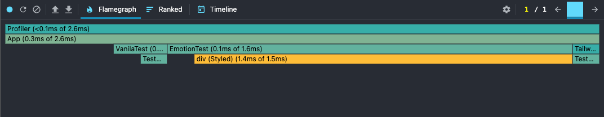

`VanilaTest, EmotionTest, TailwindTest` 각각이 사이놓게 어깨동무하고 있네요  
근데 딱봐도 Emotion의 어깨가 너무 넓습니다  
엄청난 차이를 보여주네요..  
너무 간단한 성능테스트라서 정확히 어느정도 수치의 차이가 난다, 를 결론짓기는 조심스럽습니다만  
`div (Styled)`가 확실히 렌더링 성능이 안 좋은 것을 알 수 있습니다

버튼을 토글해서 리렌더링 성능 프로파일링도 한번 해보겠습니다  
`<Profiler>`로 세 개의 테스트 컴포넌트들을 감싸서 프로파일링 로그를 모을 수 있는데  
아래와 같이 코드를 짜줬습니다.

```jsx
// 성능 데이터를 저장할 객체 (각 id 별로 성능 데이터를 저장)
const performanceData = {};

// onRender 콜백 함수
function onRenderCallback(
  id,
  phase,
  actualDuration,
  baseDuration,
  startTime,
  commitTime
) {
  // 해당 id에 대한 성능 데이터가 없으면 초기화
  if (!performanceData[id]) {
    performanceData[id] = {
      count: 0,
      totalActualDuration: 0,
      minActualDuration: Infinity,
      maxActualDuration: 0
    };
  }

  // 해당 id에 대한 성능 데이터를 업데이트
  const data = performanceData[id];
  data.count += 1;
  data.totalActualDuration += actualDuration;
  data.minActualDuration = Math.min(data.minActualDuration, actualDuration);
  data.maxActualDuration = Math.max(data.maxActualDuration, actualDuration);

  // 평균 렌더링 시간 계산
  const averageActualDuration = data.totalActualDuration / data.count;

  const result =
    `Profiler Data for ${id} (${phase} phase): \n` +
    `Actual duration: ${actualDuration.toFixed(2)}ms \n` +
    `Base duration: ${baseDuration.toFixed(2)}ms \n` +
    `Total renders: ${data.count} \n` +
    `Average actual duration: ${averageActualDuration.toFixed(2)}ms \n` +
    `Min actual duration: ${data.minActualDuration.toFixed(2)}ms \n` +
    `Max actual duration: ${data.maxActualDuration.toFixed(2)}ms \n`;

  console.log(result);
}

function App() {
  return (
    <>
      <Profiler id="vanila" onRender={onRenderCallback}>
        <VanilaTest />
      </Profiler>
      <br />
      <Profiler id="emotion" onRender={onRenderCallback}>
        <EmotionTest />
      </Profiler>
      <br />
      <Profiler id="tailwind" onRender={onRenderCallback}>
        <TailwindTest />
      </Profiler>
    </>
  );
}
```

이렇게 하면 `onRender` props로 등록한 `onRenderCallback`함수는 매번 렌더링이 일어날 때마다 호출되며  
각 컴포넌트의 `id`에 따라 각기 따로 저장되고 유지됩니다  
이제 토글버튼을 각각 50번씩 누르고 콘솔로그를 봅시다

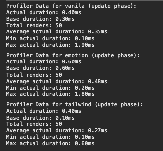

렌더링에 평균적으로 소요되는 시간(`Average actual duration`)은..

1. vanila CSS : 0.35ms
2. Emotion : 0.48ms
3. tailwind css : 0.27ms

Tailwind > Vanila CSS > Emotion 순으로 빨랐네요  
생각보다 Tailwind가 좀 빠릅니다..  
그리고 생각보다 vanila CSS가 조금 느릴 때가 있네요?  
재밌네요.. 연구를 좀 더 하면 재밌을 것 같습니다

아무튼 간단한 환경에서 각 방법들의 성능을 비교하고  
CSS-in-JS가 성능이 안 좋다는 괴소문이 진짜인지 확인해봤습니다  
꽤나 진짜인 것처럼 보이네요. 확실히 런타임 변환이 필요하니까 그럴만 하고요  
간단한 예제로 확인했는데, 프로젝트가 커질수록 큰 이슈로 다가올 수도 있겠습니다

그리고 특이한 것은, Emotion 케이스에 대한 프로파일링 결과에서

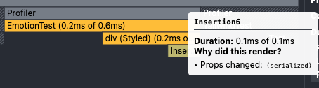

`Insertion`이라는.. 제가 추가하지도 않은 컴포넌트가 있습니다  
스택오버플로우를 살짝 찾아봤는데, [emotion의 스타일링 엔트리포인트에 해당하는 컴포넌트](https://github.com/emotion-js/emotion/blob/main/packages/styled/src/base.js#L27)라고 해요  
언젠가 이 라이브러리 간단히 한번 뜯어보는것도 재밌을 것 같습니다.

# 결론?

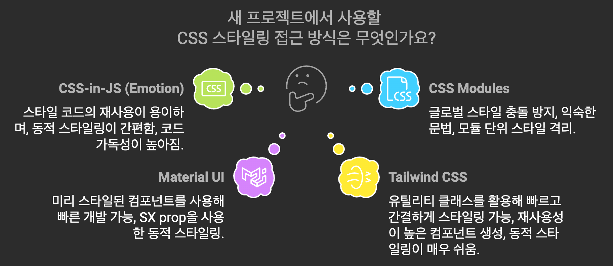

AI친구에게 요약해달라고 해봤습니다.

결론은..


저라면

다른 별도의 의존성 없이 가볍게 가고싶다면 CSS Modules를 선택하겠습니다. CSS의 고질적인 문제를 충분히 해결해줄 수 있어요

Emotion같은 CSS-in-JS는 복잡한 협업이 있을 때 사용하기 좋은 것 같네요. 다른사람들 코드를 시맨틱하게 알아볼 수 있는게 장점입니다  
특히 Emotion은 와 함께할 때 또한 강력([MUI 오피셜](https://mui.com/material-ui/getting-started/#material-ui-vs-base-ui))해서, 둘을 같이 사용할 때 장점이 많습니다.  
대신에 성능을 극한까지 아껴야 하는 프로젝트라면 재고할 필요가 있겠습니다

만약 디자인같은거에 신경쓸 겨를이 없이 빠른 개발이 필요하면, MUI나 다른 UI라이브러리를 사용하면 좋을 듯 합니다.  
많은 빌트인 컴포넌트로 빠르게 강력한 UI를 구성할 수 있게 도와줍니다  
적당히 팀원들과 상의해서 프로젝트에 적절한 테마만을 고르면 되겠죠  
저도 해커톤할 때 그래서 MUI를 선택했습니다.


Tailwind로도 빠르게 디자인을 해결할 수 있습니다. 애초에 그러려고 만들어졌고요  
그리고 위에서 살펴본 것처럼, 성능에 (vanila CSS보다도??) 꽤 큰 이점이 있습니다  
번들사이즈는 어떨까? 싶어서 살짝 찾아봤는데, 빌드시에 Tailwind 내부에서 필요없는 CSS라인들을 정리해주기 때문에 번들 사이즈도 경량이라고 하네요  
매우 깃털처럼 사용할 수 있는 라이브러리같습니다  
대신 협업할 때는 알아보기 힘들 수도 있겠네요.

이러한 점들을 고려해서 상황에 맞게 사용하시면 좋을 것 같습니다  
제 고민들이 조금이나마 도움이 되었으면 하네요

---

\
아휴.. 원래 이렇게까지 길게 쓸 생각이 아니었는데  
성능 테스트 한번 해보려다보니까 욕심이 나서 꽤 길게 썼습니다  
그래도 재밌었네요  
이만 마칩니다
