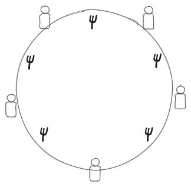

# 데드락이 뭔데요?

그런 적 있으신가요? 친구들이랑 얘기할 때  
예를 들어.. 시험기간에 피시방가자거나? 술먹으러가자거나?  
"너 가면 나도 간다"를 서로 주고 받는 ...


이렇게.. 예를 들어 민수와 철수가 둘이서

- 철수 : "민수 가면 나도 감"
- 민수 : "철수 가면 나도 감"

이렇게 하면 둘이 서로가 서로의 행동을 기다리며 교착상태에 빠지는 셈인데  
프로세스끼리도 이런 일이 생깁니다  
**데드락(DeadLock)** 이라는 것인데요  
**둘 이상**의 프로세스가 서로를 기다리며 **BLOCK**상태에 빠지고, 그 **BLOCK**을 푸는 **열쇠(signal)** 를 또한 서로가 쥐고 있는 상태를 의미합니다


이 데드락이 발생하는 경우를 잘 보아하니, 아래 **4가지 조건을 모두 만족하는 경우** 데드락에 빠지더랍니다

- **Mutual Exclusion** : "열쇠"같은 자원에 상호배제적으로 접근하도록 되어있습니다. (관련한 설명은 [전에 쓴 글](https://sungpaks.github.io/mutual-exclusion-software-approach/)을 참고해주세요)
- **Hold-and-Wait** : 자원을 가진 채(Hold)로 다른 자원을 요청하여 기다립니다(Wait).
- **No Preemption** : 자원을 강제로 뺏어가는 경우는 없습니다.
- **Circular Wait** : 자원을 가지고 있으면서, 요청하고, 요청하고, ... 가 순환적으로 연결됩니다

이렇게 자원을 요청하거나 할당하는 양상을 **Resource Allocation Graph**로 나타낼 수 있는데

<figure>


<figcaption>
Wait / Hold
</figcaption>

</figure>

- 프로세스가 자원을 요청할 때는, 리소스 Ra의 까만 점으로 바로 연결되지는 않습니다. 아직 요청이 받아들여지지 않았기 때문
- 프로세스의 요청을 받아들이고 할당(hold by)하는 경우, 리소스의 까만 점에서부터 프로세스로 화살표를 긋습니다

<figure>


<figcaption>
Circular Wait으로 데드락이 발생환 상황 / 데드락이 아닌 상황
</figcaption>

</figure>

그럼 두 프로세스 P1, P2가 자원 Ra, Rb에 접근하는 경우를 다음과 같이 생각해볼 수 있습니다  
왼쪽의 경우 P1, P2 사이에 데드락이 발생한 것을 알 수 있습니다..  
그러나 비슷하지만 오른쪽의 경우, 데드락이 발생한 것은 아닙니다. P1과 P2의 요청을 받아들일만한 재고가 남아있기 때문입니다

# 데드락 해결을 위한 방법

그럼 데드락을 어떻게 해결할 수 있을지 알아봅시다?
크게 세 가지 접근법이 있는데

- **_Prevent Deadlock_** : 데드락을 **예방**합시다. 이를 위해, **자원 할당 시 규칙을 잘 만들고 이를 지키도록**합니다.
- **_Avoid Deadlock_** : 규칙을 따로 두고 지키는 것이 아닌, **자원을 주려고 할 때 데드락 위험을 확인**하고 할당해주도록 합니다.
- **_Detect Deadlock_** : 별 규칙이나 확인 같은 절차 없이, 그냥 두고, 단 **OS에게 수시로 확인하도록** 합니다. 초기 진압을 목적으로 합니다.

## Deadlock Prevention

**데드락이 발생하지 않을 규칙을 만들어 예방**하는 것이 목적이라고 했습니다.  
그럼 어떤 규칙을 만드는게 좋을까요?

<figure>


<figcaption>
규칙은 예외없이 지켜야 합니다
</figcaption>

</figure>

우리가 위에서, *데드락이 발생하는 4가지 조건*을 언급했고,  
이 4가지 조건이 모두 만족된다면 데드락이 발생한다고 했습니다  
그렇다면.. 4가지 조건 중 하나라도 깰 수 있는 규칙을 만들면 되겠네요?  
4가지 조건을 다시 살펴보며, 깰 수 있는 방법에 대해 생각해봅시다

- **Mutual Exclusion** : 근데 이건 동시성 문제 해결을 위해 꼭 필요해서.. 이걸 깰 수는 없습니다 ㅜㅜ
- **Hold and Wait** : 프로세스가 자원을 Hold만 하거나, Wait만 하거나, **둘 중 하나만** 하게 만들면 어떨까요?
  - 그렇다면.. 실행 시작 전에 **필요한 모든 자원을 할당(Hold)하고 시작**하면 wait은 없을 것 같습니다
    - 그런데 이렇게 하려면, 자원이 총 얼마나 필요한지 알아야 하는데 : 이건 사실 컴파일하면서 알 수 있어서 어렵지 않습니다
    - 그런데 모든 자원을 한꺼번에 Hold한다는 점이 문제입니다 : 언제 필요한지 모르는 자원을 시작부터 끝까지 점거하는 셈이고, 이건 굉장한 낭비입니다
- **No Preemption** : 프로세스가 자원을 요청했다가 **Block**당하게 되면, **자원을 강제로 뺏고 종료**시킨 뒤 다시 실행하면 어떨까요?
  - 그런데 이렇게 하면 실행 시간을 예측할 수가 없고, 비용 또한 많이 들겠습니다
- **Circular Wait** : 모든 자원에 **정수 번호**를 붙이고, 자원 할당은 그 정수 번호 **오름차순 순서로 할당**하게 하면 어떨까요?
  - 만약 프로세스가 5번 다음 3번을 할당 받으려면, 3번을 먼저 할당받고 5번을 할당받게 합니다.
  - 3번을 먼저 할당받는 점이 조금의 낭비가 발생하는 지점이지만, 다른 방법들보다는 **가장 현실적**인 방법입니다 그나마..

그런데 **Circular Wait**을 깨는 조건으로 말한 **정수 번호 순으로 할당**하는 방법이 실제로 어떻게 데드락 발생을 막을 수 있는지 어떻게 증명할 수 있을까요?  
"어떤 방법이 데드락 발생을 막는다"? 를 증명하려면 간단히 "그 방법을 적용해도 데드락이 발생한다"를 가정하고 이것이 모순임을 증명해야 합니다  
[코넬대학교 자료](https://www.cs.cornell.edu/courses/cs4410/2017su/lectures/lec09-deadlock.html)를 보면 다음과 같이 써있는데

> That means that when traversing any path in the resource allocation graph, the numbers must increase (because if resource A is held by process P which is trying to acquire B, B must be bigger than A). This means that there can't be loops, because in a loop, the number must eventually **go down**

요약하자면.. 순환이 발생하려면 결국은 `1->2->3->1` 이런 식의 *go down*이 발생해야 "순환"이 성립한다는 내용입니다  
생각해보니 당연하죠? 그것이 "순환"이니까


## Deadlock Avoidance

이번에는 따로 규칙을 두지는 않고, 자원 할당 전에 **데드락 가능성을 판단**하고 수행하도록 해봅시다.  
자원 할당을 해주면 데드락이 발생할 것 같을 때, 프로세스의 요청을 거절하고 block상태로 대기하도록 하는 방법입니다.


그런데 그러려면 **어떤 프로세스의 요청 상한선**을 기준으로 판단하게 되고  
이는 최대치를 가정하고 작업하는 것이므로, **불필요한 낭비를 하는 경향**이 있을 수 밖에 없긴 합니다  
어떤 사람이 3시간 동안 과제를 할건데, 중간에 프린트를 해야한다고 해서 3시간동안 프린트기를 쭉 점거하고 있으면 매우 낭비겠죠?

일단 이 Deadlock Avoidance에는 두 가지 종류가 있습니다

- **Process Initiation Denial** : 프로세스를 시작할 때, 이 프로세스의 요구치가 데드락을 야기할 것 같으면, 프로세스의 시작을 거부합니다.
  - 이 경우, 가장 최악의 경우를 상정하는 Not Optimal한 방법입니다
- **Resource Allocation Denial** : 프로세스가 자원 할당을 요청하면, 이를 받아들인다면 데드락이 발생할 것 같을 경우, 자원 할당 요청을 거부합니다.
  - **banker's algorithm**이라고도 합니다
  - 먼저 시스템이 고정된 양의 자원을 가진다고 가정하고, 현재 상태에서 자원 요청을 승인하면 **safe**한지, 아닌지, 를 확인합니다
  - 이 **safe**상태란, 데드락에 빠지지 않는 sequence가 단 하나라도 존재하는 경우입니다

자원 할당 상태를 행렬이나 벡터 등으로 나타내어 safe상태를 확인해볼 수 있습니다


프로세스 P1,P2,P3,P4, 자원 R1,R2,R3에 대해 이러한 상태가 있다고 생각해봅시다.  
 각 matrix와 vector들은

- **R** (Resource Vector) : 시스템의 전체 자원 수(R1,R2,R3에 대한)
- **V** (Available Vector): 시스템에 현재 남아 있는 자원 수
- **C** (Claim Matrix) : 각 프로세스들의 최대 자원 요구치
  - P1은 `[3,3,2]` : 실행 시작부터 끝까지, R1을 3개, R2를 3개, R3를 2개 요구할 것임
- **A** (Allocation Matrix) : 각 프로세스가 현재 가지고 있는 자원의 양
  - P1은 `[1,0,0]` : 현재 R1을 1개, 나머지는 0개 가지고 있다
- **C-A** : (전체)-(현재) 자원 양이므로, 각 프로세스가 앞으로 요구할 자원의 양.

이 각 matrix와 vector들의 의미를 정확히 알아둔 다음, 두 가지 Deadlock Avoidance 기법으로 데드락 가능성을 확인해봅시다

### Process Initation Denial

P1, P2, P3, P4가 모두 시작을 대기하고 있고, 프로세스 번호 오름차순 순서로 확인 후 시작한다고 생각해봅시다.  
그럼 **R** == **V**인 상태로 시작하므로, `V [9, 3, 6]`에서 시작하고, Process Initiation Denial 방법은 **C**를 잘 살피면 됩니다

1. P1의 **C**값은 : `[3,2,2]`이므로, `V [9,3,6]` 이내입니다. 할당해주고 나면, `V [6,1,4]`가 됩니다.
2. P2의 **C**값은 : `[6,1,3]`이므로, `V [6,1,4]` 이내입니다. 할당해주고 나면, `V [0,0,1]`이 됩니다.
3. P3의 **C**값은, `[3,1,4]`인데, `V [0,0,1]`을 초과하므로, 시작할 수 없습니다. (거부)

이렇게, 자원 요구의 최대치를 기준으로 계산합니다.  
그러나 모든 자원을 한 번에 사용하는 것이 아니므로, 가장 최악의 경우를 상정한 Not Optimal 방법입니다.


### Process Allocation Denial

프로세스가 자원 할당을 요청하면, 그 요청을 받아들일 경우를 가정하고 진행해봅니다.  
데드락에 빠지지 않고 끝날 수 있는 실행 순서가 단 하나라도 존재하면, **safe**상태인 것으로 간주하고 요청을 받아들입니다.  
그러나 어떤 경우에도 데드락에 빠진다면, **unsafe**상태로 간주하고 요청을 거절합니다.

**Banker's Algorithm**이라고도 하는 이 방법은, 프로세스를 **하나씩 종료**시켜보며 safe/unsafe를 판단합니다


아까 위에서 봤던 상태도를 다시 가져와봤습니다  
먼저 이 상태가 safe인지 확인해봅시다.  
**C-A** matrix (앞으로 더 요구할 자원 양)에 주목해야 합니다

1. `V [0,1,1]`인 현 상태에서, **C-A**를 보아하니, 지금의 자원 내에서 종료 가능한 프로세스는 P2밖에 없습니다.
2. P2를 종료하면, P2가 가지고 있던 자원의 양(**A** 행렬 중 P2)이 모두 반납되어, `V [6 2 3]`으로 늘어납니다.
3. Available Vector **V**가 매우 풍족해졌으므로, **C-A**를 보면 남은 P1, P3, P4 뭐든 종료할 수 있습니다.
4. 이럴 때는 번호가 작은 P1을 종료합니다. 우리가 반복문 코드 짤 때는 응당 `i++`처럼 짜기 마련이죠
5. 이제 P1을 종료하면 `V [7,2,3]`이 됩니다.
6. 이제 P3종료, 또 P4 종료가 가능하므로, **safe**상태임을 알 수 있습니다.

이제 아래 (a)상태에서, "P1이 `[1, 0, 1]`의 자원을 요청"하여, 이를 받아준 경우인 (b)를 생각해봅시다.


이 경우 현재 `V [0, 1, 1]` 내에서 감당 가능한 **C-A** 양을 갖는 프로세스가 단 하나도 없으므로, 자원을 더 이상 할당해줄 수 없습니다  
 즉 **unsafe**한 상태가 되어버렸습니다..  
 따라서 P1의 요구를 거절하고, P1의 요청을 받아들여도 괜찮을 때까지 block시킵니다.

그런데 다만, safe한 순서를 발견했다고 해서 그 순서를 따라가는 것이 아닙니다  
그저 "가능한 세계선이 존재한다" 뿐이죠  
따라서 매 할당마다 unsafe/safe 여부를 확인해야만 합니다

아무튼, 이 과정을 코드 로직으로 나타내보면 아래와 같이 나타내볼 수 있겠습니다


일단 아래와 같이 각 행렬과 벡터들을 정의하고

```c
struct state { //m개 자원, n개 프로세스
	int resource[m]; //시스템의 전체 자원의 양인 리소스 벡터
	int available[m]; //시스템의 현재 가능한 자원의 양인 avilable 벡터
	int claim[n][m]; //프로세서가 요구하는 자원 최대치인 claim matrix
	int alloc[n][m]; //프로세서가 현재 할당받은 자원의 양인 alloc matrix
}
```

resource allocation algorithm을 아래와 같이 작성합니다.

```cpp
if (alloc[i, *] + request[*] > claim [i,*])
	< error >; //할당받은 양 + 요청할 양 > claim이면? 거짓말쳤네?
else if (request[*] > available[*])
	< suspend process >; //request(C-A)가 가용한도보다 적으면
else {
	< define newstate by : //이제, 자원 할당을 가정한 새로운 상태를 정의함 :
		alloc[i,*] = alloc[i,*] + request[*]; //alloc[i]에 할당한 만큼 더하고
		available[*] = available[*] - request[*]; //현재 양에서 할당한 만큼 뺌
	>;
}
if (safe(newstate)) < carry out allocation >; //safe하면 할당 진행
else {
	< restore original state >;
	< suspend process >;
}
```

1. 만약 **A**(현재 할당량) + 요청량 > **C**(최대 요청량) 면, 사실 말이 안되는 상황이죠? 지금까지의 계산이 모두 잘못되었을 가능성이 큽니다(error).
2. request하는 양보다 avilable한 양(**V**)이 벌써 작다면, 줄 수조차 없겠죠?(suspend)
3. 이제, 자원 할당 요청을 받아들인 상황을 가정하여, 새로이 상태를 정의합니다
   1. allocation matrix **A**를 업데이트
   2. available vector **V**를 업데이트
4. 그 상태가 safe한지 판단하고, safe하면 할당을 진행
5. unsafe하면, 직전 상태로 복귀하고, 프로세스를 suspend

safe한 상태인지를 판별하는 것은 아래와 같이 합니다:

```cpp
bool safe (state S) {
	int currentavail[m];
	process rest[<number of process>];

	currentavail = available; //변화시킬 available 벡터
	rest = {all processes}; //하나씩 종료시킬건데, 남은 프로세스들
	possible = true;
	while(possible) {
		<find a process Pk in rest such that :
			claim[k,*] - alloc[k,*] <= currentavail;
		>  //남은 애들 중 하나인 Pk가 C-A가 currentavail 내에서 감당 가능?
		if (found) { //true : Pk에게 자원 줬다고 보고, 계속 진행
			currentavail = currentavail + alloc[k,*];
			rest = rest-{Pk};
		}
		else possible = false; //false : currentavail 내에서 감당 가능한 C-A가  없으므로, unsafe함
	}
	return (rest == null);
}
```

1. 먼저 available vector를 복사하여 `currentavail`를 만들어 요놈을 업데이트하기로 하고, `rest`에는 종료되지 않고 남은 프로세스들을 넣습니다
2. 이제 `while`문을 계속 돌며, **C-A**가 `currentavail` 이하인 프로세스 `Pk`를 찾습니다
   1. 찾았다면 `currentavail`을 업데이트하고, `Pk`를 종료시켜 `rest`를 업데이트합니다
   2. 찾지 못했다면, `possible`을 `false`로 세팅하여 반복문을 끝내게 합니다.
3. 이제 반복문이 끝나면, `rest`에 프로세스가 남아있으면 unsafe, 없다면 safe입니다

이렇게 해서 Deadlock Avoidance에 대해 알아보았지만  
위에서도 계속 언급했듯이,  
자원 요구 최대치를 미리 알고, 최악의 경우를 상정하여 대비한다는 점이 문제입니다.  
너무 **소극적, 보수적**으로 시스템을 운용하는 셈이고  
또한 시스템 내 자원의 양이 **고정되어있음을 가정**했는데  
사실 `semaphore`같은 경우만 해도, 프로세스들이 막 만들고 없앨 수 있어 변동이 존재할 수 밖에 없습니다..

## Deadlock Detection

Deadlock Avoidance가 너무 보수적으로 자원을 운용한 것에 반해  
Deadlock Detection은 꽤나 적극적으로 자원을 운용하는 방법입니다

- 자원 할당 요청이 들어오면, "일단 줘"를 시전합니다
- 이제 정기적으로 데드락 여부를 체크하도록 합니다.
- 데드락이란 초기에 두 프로세스에서 시작하여 셋, 넷, ..으로 번지기 마련이므로, 초기 진압을 목적으로 합니다.


위에서 살펴봤던 자원 할당 상태도와 비슷하게 해서, Common Detection Algorithm에 대해 알아봅시다


조금 달라진 점은, Claim Matrix **C** 대신, **Request Matrix Q**를 사용합니다.  
이 $Q_{ij}$는, *프로세스 $i$가 자원 $j$를 요청한 뒤, 아직 요청이 받아들여지지 않은 자원의 양*입니다.  
OS는 여러 사정으로 인해 자원 할당을 지연시킬 수도 있지만, 이게 실제로 **데드락이 발생**하여 무한히 기다리고 있는 상태일 수도 있습니다.  
이 대기 상태의 원인이 데드락인지, 아닌지를 가려보자 하는 방법론입니다

Common Detection Algorithm은, "확실히 데드락이 아닌 프로세스에 **Mark**"합니다

1. allocation matrix가 전부 0인 프로세스는 바로 **mark**해줍시다.
   - hold-and-wait 조건 생각 나시나요? hold하는 자원이 없으면 데드락 조건에 부합하지 않습니다.
2. 이제, available vector를 카피한 **W** vector를 만들어서 이를 이용해 available을 시뮬레이션합시다.
   1. mark되지 않은 프로세스들 중, **W**값보다 **Q**값이 작거나 같은, 즉 대기중인 자원 요청을 즉시 받아들여 할당해줄 수 있는 프로세스를 찾아봅니다.
   2. P3이 가능하므로, 이 P3 또한 **mark**합니다.
   3. mark한 프로세스 P3이 종료되어 자원을 반납한다고 생각하고, **W**를 업데이트합니다. (`W:[0,0,0,0,1] -> W:[0,0,0,1,1]`)
   4. 위 과정을 계속 반복할 것인데, 지금 `W:[0,0,0,1,1]`상태에서 **mark**할 프로세스가 더이상 존재하지 않습니다.
   5. 따라서 P1, P2가 데드락인 것 같네요. 조치를 취해야 하겠습니다

이를 **resource allocation graph**로 그려보면, 다음과 같습니다


검은 색 화살표는 할당(hold), 회색 화살표는 요청(request)입니다.
P1과 P2 사이에 `r1->h3->r3->h4`와 같은 **circular wait**이 발생했고, 데드락에 빠졌음을 알 수 있습니다.

### 데드락 발생 시 조치

그럼 데드락이 감지되었다면, 어떻게 조치할 수 있나요?


1. 데드락에 걸린 모든 프로세스를 중단(**abort**)해버립니다. : 무식하게
2. **backup**포인트를 뒀다가 그 포인트에서부터 다시 시작합니다. : 처음부터 시작하기엔 아까우니까요
3. 데드락이 **풀릴 때까지 프로세스를 종료**시켜봅니다. : 적당히 circular wait 사이클이 끊어질 때까지 종료시켜보면 되겠죠?
4. 데드락이 **풀릴 때까지 자원을 preempt**(빼앗기)해봅니다. : 데드락 발생 4가지 조건 중 No Preemption 조건을 깨는 셈.

Deadlock avoidance로 데드락을 막을 때는, 자원 할당을 할 때마다 알고리즘을 수행하려면 부담이 너무 큽니다..  
그런데 이렇게 Deadlock Detection 방법은 resource graph만 유지하면  
쉽게 둘 or 세 프로세스 사이의 사이클을 감지하여 조치할 수 있어서 아주 굿입니다

<figure>


<figcaption>
백안!!!!
</figcation>

</figure>

# 철학자 문제 : Dining Philosophers' Problem

데드락 응용문제로 유명한 문제가 있습니다  
철학자 문제 (Dining Philosophers' Problem)
(_포크 두 개 들고 밥먹기_) 또는 (_생각에 빠지기_) 둘 중 하나를 하는 철학자 5명이 있습니다  
이 5명의 철학자들은 원탁에 빙 둘러 앉아있고  
5개의 포크가 철학자들 왼편, 오른편에 놓여있습니다  
그림으로 나타내면 아래와 같습니다



어떤 철학자가, 양 옆의 다른 철학자들이 사색에 빠진 타이밍에  
잽싸게 왼쪽 포크와 오른쪽 포크를 둘 다 집어버려 식사를 시작하면 굿이지만  
운 나쁘게도.. 철학자들이 번갈아가면서, 자신 왼쪽에 놓인 포크를 집고, 왼쪽 포크를 집고, ...  
이렇게 되면 각 철학자들이 왼손에 포크를 들고 오른쪽 포크를 기다리며 다같이 굶어 죽습니다...


참 내. 양보들 좀 하지.

이런 일이 발생하지 않도록, 아래와 같이 밥먹는 규칙을 정해줘야 하겠습니다

- 먼저, 포크를 동시에 집지 못하게 **Mutual Exclusion**을 보장해야 할 것이며
- 철학자들이 굶어 죽지 않게 **데드락, starvation**이 발생하지 않게 해주어야 함

## 이렇게 하면 데드락이 발생해요

Mutual Exclusion을 보장하기 위해 Critical Section을 구현해야 하니  
semaphore를 이용(semaphore 또는 monitor에 대한 자세한 설명은 [여기](https://sungpaks.github.io/mutual-exclusion-by-os/))하여 간단히 아래와 같이 쓰려고 할 수도 있겠습니다

```c
semaphore fork[5] = {1};
int i;
void philosohper (int i) {
	while(true) {
		think();
		wait (fork[i]); //왼쪽 잡기 시도
		wait (fork[(i+1)%5]); //오른쪽 잡기 시도
		eat(); //냠
		signal(fork[(i+1)%5]); //오른쪽 포크 내려놓기
		signal(fork[i]); //왼쪽 포크 내려놓기
	}
}
void main() {
	parbegin(philosopher(0), philosopher(1), philosopher(2), philosopher(3), philosopher(4));
}
```

그런데 이렇게 작성하면 **데드락이 발생**해버릴 수 있습니다...  
위에서 말했던 것처럼, $i$번째 철학자가 $i$번(왼쪽) 포크를 집고, timeout되는 과정을 반복하면  
모든 철학자들이 왼손에는 포크를 들고, 옆 철학자가 왼 손에 들고 있는 본인 기준 오른쪽 포크를 기다리며 교착 상태에 빠져버립니다


## Circular Wait Prevetion으로 해결해봐요

위에서 살펴본, 데드락 발생 4가지 조건 중 Circular Wait을 깨뜨리는 방법으로 간단히 해결해볼 수 있는데  
먼저 포크에 번호를 다 붙입시다. 0~4번 포크로  
이제 $i$번 철학자는 포크를 집을 때, 포크 번호가 작은 것부터 집도록 합시다.

`fork[0],fork[1],fork[2],fork[3],fork[4]` 존재

- 0번 철학자 : `fork[0] -> fork[1]` 요청할 예정
- 1번 철학자 : `fork[1] -> fork[2]` 요청할 예정
- 2번 철학자 : `fork[2] -> fork[3]` 요청할 예정
- 3번 철학자 : `fork[3] -> fork[4]` 요청할 예정
- 4번 철학자 : `fork[0] -> fork[4]` 요청할 예정 (4번과 (4+1)%5=0번인데, 번호 작은 포크부터 요청하기로 함)

이제, 데드락이 발생했던 상황인 포크 하나 집고 time-out 당하는 경우를 생각해봅시다

1. 0번 철학자가 먼저 `fork[0]`을 집은 경우 :
   1. 이후 1번이 `fork[1]`, 2번이 `fork[2]`, 3번이 `fork[3]`을 집게 되어도, 4번 철학자는 `fork[0]`을 집기 전에는 `fork[4]`를 집지 않을 것인데, 이미 `fork[0]`은 0번 철학자 손에 있습니다.
   2. 그럼 `fork[4]`가 남아있으므로, 언젠가 3번 철학자는 `fork[4]`까지 집어들 수 있고, 식사를 할 수 있습니다.
2. 4번 철학자가 먼저 `fork[0]`을 집은 경우 :
   1. 0번 철학자는 `fork[0]`을 집기 전에는 `fork[1]`을 집지 않습니다.
   2. 다시, 남은 철학자들이 하나 집고 timeout, ...과 같은 상황이 발생해도, 3번 또는 4번 철학자 둘 중 하나가 `fork[4]`를 집을 때는 이미 포크를 하나 집어든 상태이므로, 식사를 시작합니다.

이런 식으로 해서 데드락을 해결해볼 수 있겠네요

## 밥 먹는 공간은 따로 분리하고, 인원 제한을 둬요


이런 식으로, 밥 먹는 공간과 생각하는 공간을 따로 분리한 뒤  
밥 먹는 공간에는 4명까지만 들어가게 하면 어떨까요?


그럼 4명이 포크 5개를 공유하니, 누군가는 포크를 두 개 집을 수 있습니다

`semaphore room`을 새로 도입하여 이를 구현하면 :

```c
semaphore fork[5] = {1}; //포크는 여전히 다섯 개
semaphore room = {4}; //밥 먹는 방에는 4명만 들어오세요
int i;
void philosopher(int i) {
	while (true) {
		think(); //생각은 방 밖에서 알아서 하세요
		wait(room); //밥 먹으러 들어가려면, 4명 꽉찼으면 대기, 자리 있으면 들어가
		//이제 방에 들어왔음
		wait(fork[i]); //왼쪽 포크가 있으면 포크 집어들기
		wait(fork[(i+1)%5]); //오른쪽 포크가 있으면 포크 집어들기
		eat(); //냠
		signal(fork[(i+1)%5]); //오른쪽 포크 내려놓고
		signal(fork[i]); //왼쪽 포크 내려놓고
		signal(room); //방 나간다
	}
}
```

이와 같이, 포크를 집고, 먹고, 포크를 내려놓는 일련의 과정을 `semaphore room = {4]`로 감싸버립니다.

## Monitor로 해결해요

`semaphore`말고도 `monitor`라는 강력한 동기화 툴이 있었죠?  
이를 이용하여 해결해봅시다  
코드 먼저 봅시다 :

```c
monitor dining_controller;
cond ForkReady[5]; //포크 동기화를 위한 조건변수
boolean fork[5]={true}; //각 포크가 집을 수 있는 상태인가??

void get_forks(int pid) {
	int left = pid;
	int right = (++pid)%5;

	/* 왼쪽 포크 집기 */
	if (!fork[left]) cwait(ForkReady[left]); //왼쪽 포크 없으면 밖에서 기다려!!
	fork[left] = false; //왼쪽 포크 있으면 집어들고, false 체크
	/* 오른쪽 포크 집기 */
	if (!fork[right]) cwait(ForkReady[right]); //오른쪽 포크 없으면 기다려!!
	fork[right] = false; //오른쪽 포크 있으면 집어들고, false 체크
}
void release_forks(int pid) {
	int left = pid;
	int right = (++pid)%5;

	/* 왼쪽 포크 내려놓기 */
	if (empty(ForkReady[left])) fork[left]=true; //왼쪽 포크 기다리는 애 없으면 그냥 놓고
	else csignal(ForkReady[left]); //기다리는 애가 있으면 걔 준다
	/* 오른쪽 포크 내려놓기 */
	if (empty(ForkReady[right])) fork[right]=true; //오른쪽 포크 기다리는 애 없으면 그냥 놓고
	else cisngal(ForkReady[right]); //기다리는 애가 있으면 걔 준다
}

/* --- 모니터 외부 --- */
void philosopher[k=0 to 4] {
	while(true) {
		think();
		get_forks(k);
		eat();
		release_forks(k);
	}
}
```

- `void get_forks()` : 포크를 무조건 두 개 다 집고, 모니터를 빠져나온다.
  - `fork[left]==false?` 누군가 왼쪽 포크를 쓰고 있으니, 기다리자.
  - `fork[right]==false?` 누군가 오른쪽 포크를 쓰고 있으니, 기다리자.
- `void release_forks()` : 포크를 두 개 다 내려놓고, 모니터를 빠져나온다.
  - 내려놓을 포크를 기다리던 애가 없다면, `fork[left]=true`와 같이 그냥 내려놓는다.
  - 내려놓을 포크를 기다리던 애가 있으면, `csignal`로 포크를 넘겨준다.

이렇게 하면 **데드락이 발생하지 않는다**.. 입니다만, 저희 교수님께서 말씀하시길

왜 그렇죠? 처음에 데드락이 발생할 때도, semaphore로 왼쪽을 잡고, 아니면 기다리고, 그 다음 오른쪽을 잡고, 아니면 기다리고, 의 과정을 거쳤습니다  
그런데 여기서도, 왼쪽 포크 있으면 집고, 아니면 기다리고, 오른쪽 포크 있으면 집고, 아니면 기다리고, 의 과정을 거치는게 비슷한 것 같은데요  
라고 질문하셨습니다.. 잘 생각보라고 하시네요

또한  
일단.. "monitor는 그 자체로 내부가 Critical Section이다", "프로세스 혼자서만 들어간다", 같은 설명은 답이 되지 않을 것 같네요  
`void get_forks()`함수를, `void get_left_fork(), void get_right_fork()`와 같이,  
왼쪽 포크 따로, 오른쪽 포크 따로 집게 함수를 분리하면 데드락이 발생합니다.  
모니터 자체의 특성으로 인해 해결되는 것이 아니라는 뜻입니다  
라고 하셨는데

교수님께서 주신 힌트를 종합해보면, 한 마디로  
**포크를 집으려다, 또는 하나 집고, CPU를 뺏겨도, 누군가 내가 집을 포크에 손 대지 못한다**  
정도로 정리할 수 있을 것 같습니다  
Monitor에서 **포크를 둘 다 집어야만 모니터를 나온다**라는 점이 중요한 셈인데  
Monitor내에서 time-out당해도, Monitor 내부는 잠겨있어 다른 누군가 포크를 손도 대지 못합니다


이렇게 생각해보면, 함수를 둘로 나누어 왼쪽 포크 집는 함수, 오른쪽 포크 집는 함수로 나누면 데드락이 여전히 발생한다는 점이 납득이 갑니다  
그렇게 되면 왼쪽 포크를 집은 뒤 Monitor를 나오게 되는데, 이 타이밍에 CPU를 뺏기면, 다른 누군가 포크에 손을 댈 수 있습니다..  
결국 `semaphore` 경우와 다를 바가 없어지는 셈이네요

---

\
이렇게 프로세스 세계의 평화를 지켜냈습니다.. 후


치킨 먹고싶네요~
