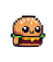
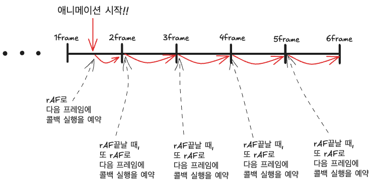
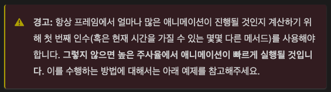
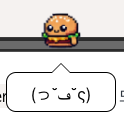

혹시 이 친구 보셨나요? 제 블로그에 돌아다니는데  
이름은 햄부기로 했습니다.  
그냥 갑자기 블로그에 귀엽고 특별한 것을 넣고싶어서 만들어봤어요  
햄버거인 이유는 그냥 제가 햄버거를 좋아해서 그렇습니다

아무튼 이 친구가 어떤 기능이 있고 어떻게 구현했는지 쓰려고 해요  
그리고 이거 크롬 익스텐션으로도 만들어서 제출했는데요, 그 여정까지 쓰겠습니다  
나중에는 부기와 친구들 머 이런식으로 계속 캐릭터도 추가하고, 그러고 싶습니다  
막 오픈소스처럼 다른 사람들이 캐릭터도 추가하고 어쩌구저쩌구 하게 하고싶은데 귀찮고 그럴 사람이 있을지는 모르곘어용

아무튼 시작합시다

# 1. 드래그 앤 드롭으로 잡아 옮길 수 있습니다

햄부기를 잡고, 드래그하여 다른 곳으로 옮겨버릴 수 있습니다  
얘때문에 글을 못 읽으면 안되잖아요?

마침 JAVA수업 때 SWING 쓰면서 이런거는 또 전문이었습니다  
게다가 얼마전에 회사 업무에서도 canvas 쓸 일이 있었는데 거기서도 그 수업 때 했던걸 톡톡히 썼네요  
아. 그립읍니다 교수님.  
그래픽스 수업도 좀 들을걸 그랬어요


## HTML요소를 드래그 앤 드롭하기

웹 API에는 [DragEvent](https://developer.mozilla.org/en-US/docs/Web/API/DragEvent)가 이미 존재하지만 어떤 요소를 자유롭게 드래그 앤 드롭으로 옮기고 싶다면 꽤 한계가 있습니다  
모던 자바스크립트 튜토리얼의 [mouse-drag-and-drop](https://ko.javascript.info/mouse-drag-and-drop)에서도 이에 대한 내용이 나옵니다  
대신에 `mousedown, mousemove, mouseup` 이 세 이벤트만으로 드래그 앤 드롭을 구현해봅시다

`const [isDragging, setIsDragging] = useState(false)`처럼 드래깅 여부를 나타낼 상태를 하나 선언하고 시작합시다.  
이제 아래와 같은 단계를 생각해볼 수 있습니다 :

1. 원하는 요소에서, 마우스 버튼을 누르면(`mousedown`) 드래깅을 시작 (`setIsDragging(true)`)
2. `isDragging === true`인 동안 마우스를 움직이면(`mousemove`), 요소의 위치를 현재 마우스 위치로 업데이트
3. 마우스 버튼을 떼면(`mouseup`), 드래깅을 종료 (`setIsDragging(false)`)

그럼 요소의 위치를 나타낼 `[position, setPosition]` 같은 상태값이 필요하겠습니다.  
위치가 변함에 따라 요소가 다시 그려지게 해야 하니까요  
또한 그 요소의 CSS `position` 속성은 `fixed`로 지정하여 자유로운 위치선정을 가능하게 해야겠습니다.  
모던 자바스크립트 튜토리얼에서는 `absolute`로 구현하긴 합니다. `absolute`도 레이아웃 배치 흐름에서 제외된다는 사실은 매한가지니까요

아무튼 그럼 이런 식으로 될 것 같아요

```tsx
const handleMouseDown = (e: React.MouseEvent) => {
  setIsDragging(true);
};
const handleMouseMove = (e: MouseEvent | React.MouseEvent) => {
  if (isDragging) {
    if (e.buttons !== 1) return; // 왼쪽버튼만
    setPosition({
      left: e.clientX,
      top: e.clientY
    });
  }
};
const handleMouseUp = () => {
  setIsDragging(false);
};
```

이제 요소에 등록합니다.

```tsx
useEffect(() => {
  document.addEventListener("mousemove", handleMouseMove);

  return () => {
    document.removeEventListener("mousemove", handleMouseMove);
  };
}, [isDragging]);
return (
  <div
    style={{ position: "fixed", top: position.top, left: position.left }}
    onMouseDown={handleMouseDown}
    onMouseUp={handleMouseUp}
  />
);
```

이 때, `mousemove`는 꼭 `useEffect`를 활용하여 document에 등록해줘야 합니다.  
전체 문서를 기준으로 마우스 이벤트를 받아야하기 때문입니다

근데 여기까지만 하면 드래그가 잘 안될건데  
막 커서가 not-allowed로 바뀌고 드래깅이 멈추고..  
이게 기본 드래깅 이벤트때문인데  
드래그 앤 드롭하는 요소의 props에 `draggable={false}`한 줄 추가해주면 됩니다.

```diff
<div
	style={{ position: "fixed", top: position.top, left: position.left}}
	onMouseDown={handleMouseDown}
	onMouseUp={handleMouseUp}
+	draggable={false}
	/>
```

### 드래그를 시작하면 커서 위치로 요소가 순간이동해요

지금 이 상태로도 드래그 앤 드롭이 잘 되긴 하지만  
드래그를 시작하면 요소의 위치가 현재 커서 위치로 순간적으로 바뀌어서 살짝 어색해보입니다  
[모던 자바스크립트 튜토리얼 > 드래그 앤 드롭 > 올바른 위치 지정](https://ko.javascript.info/mouse-drag-and-drop#ref-319)에서 자세한 설명과 예시를 볼 수 있습니다

이건 `mousedown` 위치와 요소가 원래 있던 위치의 차이(offset)를 저장해두면 됩니다  
이건 어차피 딱히 렌더링에 필요한 정보는 아니라서, 참조로 저장했습니다.

```tsx
const handleMouseDown = (e: React.MouseEvent) => {
  setIsDragging(true);
  shift.current = {
    x: e.clientX - ref.current.offsetLeft,
    y: e.clientY - ref.current.offsetTop
  };
};
const handleMouseUp = () => {
  setIsDragging(false);
};

const handleMouseMove = (e: MouseEvent) => {
  if (isDragging && ref.current) {
    if (e.buttons !== 1) return;
    setPosition({
      left: e.clientX - shift.current.x,
      top: e.clientY - shift.current.y
    });
  }
};
```

이렇게 커서 위치에서, 햄버거의 왼쪽위 좌표를 빼주면 => shift
그럼 이제 left, top을 최신화할 때, shift를 빼줘서 보정해주면 됩니다

## 터치로 드래그 앤 드롭하기

클릭과 터치는 비슷해보이지만 은근 다릅니다  
생각해보면, 마우스는 항상 화면 위에 존재하는데 반해, 터치는 그렇지 않습니다  
터치는 여러 손가락에 의한 이벤트도 다뤄야 하고, 게다가 손가락은 점이 아니라 면이고, ..  
hover를 테스트할 때도, 크롬 개발자모드로 반응형 모드를 켜면 커서가 터치모드가 되어서  
커서를 올리는 것 만으로는 hover가 트리거되지 않는 것을 볼 수 있습니다

이렇게 마우스 클릭과 화면 터치는 은근히 다르고 이벤트도 따로 존재합니다  
`touchstart, touchmove, touchend`처럼요  
마우스 이벤트는 `e.clientX`처럼 바로 좌표값을 가져올 수 있었는데, 터치 이벤트는 그렇지 않습니다  
먼저 `TouchEvent.touches[0]`으로 `Touch`이벤트의 목록 중 가장 첫 번째를 가져옵니다.  
이제 여기서 `clientX,Y`를 꺼냅니다

근데 리액트를 사용하신다면 위 내용은 다 잊어두셔도 됩니다  
[React 이벤트 객체](https://ko.react.dev/reference/react-dom/components/common#react-event-object)가 알아서 추상화해주거든요. "**합성 이벤트**"라고도 합니다  
예를 들어, `onMouseDown`에서 진짜 자바스크립트 이벤트인 `mousedown`은 `e.nativeEvent`에 들어있습니다  
이외에는 다 리액트 이벤트로 한 겹 래핑하여 제공됩니다.  
덕분에 `TouchEvent`든, `MouseEvent`든 상관 없이 `e.clientX`만으로 충분합니다

그래서 아까 마우스 이벤트로 했던 것과 동일하게, `onTouchStart={onMouseDown}`처럼 재활용하면 됩니다  
`touchmove`이벤트도 `mousemove`처럼 useEffect에서 `document`에 등록해주시구요.

# 2. 클릭 시, 또는 가만히 서있다가 아무 때나 걷기를 시작합니다

지 혼자 움직이게끔 만들고 싶었어요  
그리고 또한 클릭하면 움직이게요. 건들면 도망간다는 느낌으로?  
그래서 먼저 `startWalk`라는 함수를 정의했습니다

```tsx
const startWalk = () => {
  if (!isWalking) {
    // 화면 내 좌표 중 랜덤으로 targetX, targetY를 선정 (걸어가려는 목표지점)
    setIsWalking(true);
    setPose(walking01);
    setIsFlipped(position.left - targetX > 0);
    animationFrameId.current = requestAnimationFrame(timestamp =>
      animateWalk(timestamp, 0, targetX, targetY)
    );
  }
};
```

움직이는 중이 아니라면 먼저 화면 내에서 아무 지점을 목표점으로 잡습니다.  
그 다음 이미지를 걷는 모션 프레임으로 바꾸고, 가려는 방향이 왼쪽이면 이미지를 뒤집습니다  
이제 비로소 애니메이션을 시작해야 하는데 :

## requestAnimationFrame으로 애니메이션 설정하기

애니메이션은 [`requestAnimationFrame`](https://developer.mozilla.org/ko/docs/Web/API/Window/requestAnimationFrame)으로 구현합니다.  
`requestAnimationFrame`은 첫 번째 인자로 콜백을 받습니다.  
자세히는, 브라우저에게 콜백을 넘기고, 다음 리페인트 바로 전에 브라우저가 이 콜백을 호출하도록 요청합니다.  
그리고 콜백함수는 `timestamp`라는 인수를 하나 받습니다. 이는 애니메이션이 요청된 이후의 timestamp입니다

> `requestAnimationFrame`은 하나의 프레임을 요청합니다. 따라서 다음 리페인트에서 다음 애니메이션 프레임을 적용하려면 콜백 루틴이 스스로 `requestAnimationFrame()`을 다시 호출해야 합니다.

그리고 이외에도 필요한 값들(목표 지점인 `targetX, targetY` 등.)을 인자로 넘겨 갖고다니겠습니다  
이제 매 애니메이션마다 targetX, targetY에 가까워지는 방향으로 움직이면 될 것 같아요

그런데 의문이 있습니다  
왜 `setInterval`이 아닌 `requestAnationFrame`(이하 rAF)인가요?

- 같은 비동기처리라도 rAF는 별도의 큐에서 관리되므로 콜백 실행이 밀리는 현상을 최소화할 수 있다
- setInterval은 주어진 간격을 지키려할 뿐 주사율에 관심이 없다. 그러나 rAF는 부드럽고 최적화된 애니메이션을 위해 디스플레이 주사율을 따른다
- setInterval과는 달리 rAF는 **다음 리페인트가 준비되었을 때 콜백을 호출**하므로, 각 프레임 간격을 지키며 실행됨을 보장할 수 있다
- rAF는 탭이 비활성화되면 애니메이션을 중단해두므로 배터리와 리소스 소모를 최소화한다



조잡하게 그려봤는데 딱히 도움이 될 것 같지는 않아 보입니다 ㅜㅜ

아무튼 그래서 애니메이션 각 프레임에 전달할 콜백인 `animateWalk`를 이렇게 작성했습니다

```tsx
const animateWalk = (
    timestamp: number,
    count = 0,
    targetX: number,
    targetY: number
  ) => {
    if (!startTimestamp.current) { // 걷기가 시작될 때의 타임스탬프를 기록 : elapsed 계산을 위함
      startTimestamp.current = timestamp;
    }
    const elapsed = timestamp - startTimestamp.current;
    if (elapsed > 5000) {
      setIsWalking(false);
      setPose(sitting);
      cancelAnimationFrame(animationFrameId.current);
      animationFrameId.current = 0;
      startTimestamp.current = 0;
      return;
    }
    if (count % 30 === 0) { // 이미지를 바꿔 모션을 연출하기 }
    if (count % 10 === 0) { // 매번 실행하니까 너무 빨라서 .. 10번에 한번씩만
      // targetX, targetY로 조금 이동하기
    }
    // 다음 애니메이션 프레임 요청
    animationFrameId.current = requestAnimationFrame(timestamp =>
      animateWalk(timestamp, count + 1, targetX, targetY)
    );
  };
```

그런데 [MDN 문서](https://developer.mozilla.org/ko/docs/Web/API/Window/requestAnimationFrame)에서 이런 경고를 발견했습니다



저는 이동이 너무 빠르게 되는 것을 막고자 10프레임마다 한번씩 하려고 count값을 유지했습니다  
그런데 이것말고 `timestamp`를 기반으로 이를 구현해야 했겠네요  
저처럼 하면 주사율에 따라, 주사율이 높으면 그만큼 애니메이션 진행이 빨라진다고 경고하는 것입니다

그럴만한게, 주사율이 초당 60번이면 1초 간 콜백이 60번 실행되고, 그 중 6회가 실제로 이동을 트리거하는 반면  
주사율이 촏아 120번이면, 1초 간 콜백이 120번 실행되고, 그 중 12회가 실제로 이동을 트리거합니다.  
그럼 같은 애니메이션이지만 디스플레이 주사율 차이로 인해 이동 애니메이션의 속도가 2배 차이가 나겠네요

그리고 맨 처음에 `startTimestamp`라는 참조값에 `timestamp`를 저장하고, 애니메이션이 끝날 때 이를 삭제해주는데요  
이는 **애니메이션이 시작된 후로 지난 시간**(elapsedTime)을 계산하기 위함입니다  
이게 가장 최초로 rAF를 호출할 때는 timestamp가 0부터 시작하는데,  
그 후로는 다시는 timestamp가 0이 되지 않습니다 (애니메이션이 끝날 때 `cancelAnmationFrame`을 호출해도)  
따라서 이러한 값을 유지해줘야합니다  
MDN 문서에서도 예제에 아래와 같이 썼습니다

```jsx
function step(timestamp) {
  if (start === undefined) {
    start = timestamp;
  }
  const elapsed = timestamp - start;

  ...

  if (elapsed < 2000) {
    // 애니메이션 진행은 2초가 지나기 전까지만
    window.requestAnimationFrame(step);
  }
}
```

## 랜덤으로 애니메이션을 시작하기

useEffect를 사용하여 마운트 시 일정 간격마다 랜덤 숫자를 뽑는 interval을 설정합시다.  
이 랜덤 숫자를 이용하여 분기처리하여 확률을 정의합니다.
예를 들어, 매 초 랜덤을 뽑고 10퍼센트 확률로 애니메이션을 트리거하게 하려면 :

```tsx
useEffect(() => {
  const intervalId = setInterval(() => {
    // walking 중이 아니고, dragging 중이 아닐 때 10% 확률로 walking 시작
    if (!isWalking && !isDragging && Math.random() < 0.1) {
      startWalk();
    }
  }, 2000); // 2초마다 확률 체크

  return () => clearInterval(intervalId); // 컴포넌트 언마운트 시 interval 정리
}, [isWalking, isDragging]); // isWalking, isDragging 상태에 의존
```

이런 식으로 2초마다 10% 확률로 걷는 모션을 시작하게 설정할 수 있습니다.

## onClick이벤트로 `startWalk`를 등록하되 드래그했으면 트리거하지 않기

그리고 클릭 시에도 걷기 모션을 트리거하기로 했으니까, 간단히 `onClick={startWalk}`와 같이 설정해주면 됩니다

그런데 문제가 있어요  
`mousedown`과 `mouseup`이 트리거되면 그 후에는 `click`이벤트가 트리거돼요  
순서가 `mousedown` -> `mouseup` -> `click` 순으로 트리거되는 셈입니다  
이는 `mousedown` 이후에 `mousemove`가 트리거되는 드래그 상황에도 똑같아요  
이 때문에, 드래그(햄부기를 잡고 옮김)후에도 마우스 클릭 이벤트가 트리거되어서 걷기 모션을 시작해버립니다.

그래서 `dragged`값을 하나 유지하고, `mousemove` 이벤트핸들러에서 햄부기의 위치가 변할 때 true로 이 값을 `true`로 변경해주도록 했습니다  
그리고 `mousedown` 이벤트에서 이 `dragged`값을 `false`로 변경하구요  
이제 `startWalk()`함수에서는 이 `dragged`값이 true면 걷기를 시작하지 않도록 합니다.

음 근데 이렇게만 하면 드래그 후에 다시는 랜덤으로 걷기 모션이 시작되지 않아요  
`dragged`가 true로 남기 때문인데요  
그래서 아래와 같이 최종적으로 수정했습니다

```tsx
const startWalk = (method: "click" | "auto") => {
    if ((method === "click" && dragged) || isWalking) return;
    ... //걷기모션 시작
}
```

걷기 모션이 트리거된 사유를 인자로 받습니다.  
`click`에 의한 것이라면, dragged여부를 확인하도록이요  
이러면 이제 드래그 이후에도 걷기 모션이 시작되는 일을 막을 수 있습니다

# 3. 말풍선으로 감정을 표현합니다

이거는 딱히 사실 설명할게 없긴한데요  
아까 걷는 모션을 랜덤으로 시작하게 interval을 설정했던 것처럼  
가끔 2초 간 말풍선을 띄우게 했습니다

```tsx
useEffect(() => {
  let timeoutId: NodeJS.Timeout | number;
  const intervalId = setInterval(() => {
    if (!tooltipVisible && Math.random() < 0.1) {
      setTooltipVisible(true);
      setEmotionIndex(Math.floor(Math.random() * emotions.length));
      timeoutId = setTimeout(() => {
        setTooltipVisible(false);
      }, 2000);
    }
  }, 2000); // 2초마다 확률 체크

  return () => {
    clearInterval(intervalId);
    if (timeoutId) clearTimeout(timeoutId);
  }; // 컴포넌트 언마운트 시 interval 정리
}, []);
```

그리고 랜덤으로 말풍선을 띄우는 타이밍에, 말풍선 내용물도 바꿉니다.(`emotionIndex`)  
또한 햄부기 위에 마우스를 올려두면(호버 시) 또한 말풍선을 보여줍니다.



그리고 드래그 시에는 당황한 표정을 짓습니다 ㅋㅋㅋ

# 크롬 익스텐션으로 만들려고 하는데요..

이제 이 리액트 코드로 작성된 햄부기를 크롬 확장 프로그램으로 만들고 싶습니다  
다만 그러면 리액트 코드 그대로 쓸 수는 없겠고 자바스크립트를 사용해야 합니다  
리액트로 코드를 작성하고 자바스크립트로 변환을 거쳐도 되지만,  
이왕 하는거 그냥 같은 기능을 하는 자바스크립트 코드로 바꿔버렸습니다  
변환은 그냥 지피티 시켰습니다

그리고 혹시 아예 나중에 인스턴스를 여럿 끼울 수도 있어서 클래스로 만들었어요  
부기를 화면에 둘, 셋, 넷, ... 추가하고 싶을 수도요

자바스크립트로 변환된 코드를 다듬기 전에 먼저 크롬 확장프로그램을 어떻게 만드는지 필요한만큼만 이해해봅시다

## 크롬 확장프로그램

[크롬 확장프로그램 시작하기 가이드](https://support.google.com/chrome/a/answer/2714278?hl=ko)

### manifest 파일 정의하고, 개발자모드에서 프로그램을 추가하기

### 활성 탭에 스크립트 삽입하기

### 이미지 가져오려면

manifest에 `web_accessible_resources` 설정하고,  
`chrome.runtime.getURL`로 가져온다

## 익스텐션 끌 때는 스크립트를 제거하기

Bugi 클래스에 destroy 메서드를 추가하고
익스텐션 스크립트에 관련 코드를 추가하기

## 익스텐션 켤 때마다 bugi.js가 실행되어서 스코프에 변수들이 중복으로 생성됨

그래서 전역객체인 window에 선언하고, 없을 때만 새로 생성하게 했다
중복선언 피하기 어쩌구저쩌구

## 이제 터치 이벤트를 따로 관리해줘야 함

리액트일 때는 알아서 추상화된 이벤트를 썼지만, 이제 아닙니다  
그래서 터치 이벤트에 대해 따로 구현해줘야 합니다
