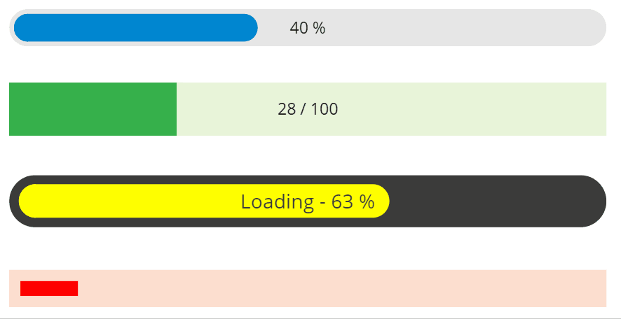
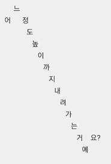
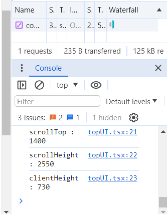
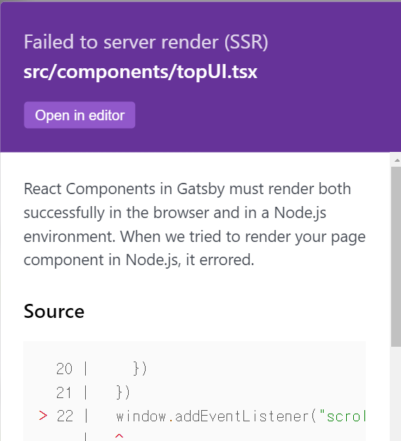

그냥 갑자기 progress bar를 블로그에 추가하고 싶어졌습니다..



그 왜 그런거 있잖아요. \
블로그 내리면 스크롤 얼마나 내렸는지 보여주는 상단 바\
간단히 스크롤 정보를 얻어다가 몇 퍼센트나 왔는지 확인하고, 그 퍼센트를 bar의 width로 주면 될 것 같네요?



시작해봅시다

# 스크롤 정보와 스크롤 이벤트 얻어오기


먼저, 스크롤이 어디 쯤 있고, 전체 스크롤 높이는 어느 정도인지 알아야겠죠?\
`document`, 또는 `window`객체에서 정보를 가져오면 될 것 같습니다.\
저는 `document`썼습니다

`document.documentElement.scrollTop`으로 현재 스크롤이 위치한 높이를 알 수 있습니다.\
근데 스크롤은 두께가 있죠? 전체 문서에서 현재 위치한 화면의 가장 위쪽이냐, 가장 밑이냐, 등등..\
`scrollTop`은 현재 위치한 스크롤의 가장 위쪽 좌표값을 줍니다.

이제 전체 스크롤 높이를 알고자 한다면, `document.documentElement.scrollHeight`를 가져오면 됩니다.\
그런데 주의할 점은, 이 전체 `scrollHeight`에서 클라이언트 화면(유저가 보고 있는)의 높이인\
`documentElement.clientHeight`를 빼줘야 합니다.\
우리가 방금 `scrollTop`, 즉 스크롤 중에서도 위쪽 좌표를 기준으로 하기로 했죠?\
따라서 `documentElement.scrollHeight - documentElement.clientHeight`값을 전체 스크롤 높이로 써야\
가장 하단까지 갔을 때 진행률이 100%가 될 수 있습니다.

이 세 가지 정보를 하나씩 `console.log`로 찍어보면



대충 이런 식입니다

이제 스크롤 정보 가져오는 것은 알았으니, 이벤트리스너를 등록해봅시다.\
`document.addEventListener("scroll", scrollEventHandlerFunction)`과 같이 해줍니다.

```typescript
document.addEventListener("scroll", () => {
  const currentScroll: number = document.documentElement.scrollTop
  const totalScroll: number =
    document.documentElement.scrollHeight -
    document.documentElement.clientHeight
  setScrollPercent((currentScroll * 100) / totalScroll)
})
```

대충 이런 식의 코드를.. 상단 고정 레이아웃 컴포넌트에서 추가해줬습니다.

# progress-bar 컴포넌트 생성하기

이미 상단에 고정된 레이아웃인 `top-ui` 컴포넌트가 있으므로,

```javascript
<div className="progress-bar" style={{ width: `${scrollPercent}%` }}></div>
```

밑에 적당히 이런 친구를 추가해줍시다.\
css 클래스인 `.progress-bar`는 적당히 원하는대로 작성해줍시다.\
width는 변수인 `scrollPercent`를 쓰고싶으니까, 리액트 컴포넌트에서 직접 줍니다.

# Failed to server render(SSR)이라는 에러가 떴어요

그대로 진행해보면..
\
이런 에러가 납니다\
게다가 `gatsby-config`에서 `flags: {DEV_SSR: true}`를 추가하여 서버 사이드 빌드 에러를 활성화하지 않았다면\
그냥 `gatsby develop`환경에서는 모르고 개발했다가 빌드할 때가 되어서야 에러를 알게 됩니다

[Debugging HTML Builds](https://www.gatsbyjs.com/docs/debugging-html-builds/)에서 관련 내용을 확인할 수 있는데요\
Gatsby는 기본적으로 페이지들을 정적 HTML파일로 빌드하고 서버사이드에서 렌더링해주기 때문에\
브라우저 레퍼런스인 `window` 또는 `document`객체에 접근하려고 해도 해당 객체가 없습니다..

그래서 이걸 해결하기 위해 찾아보다가 [스택오버플로우](https://stackoverflow.com/questions/62816197/how-to-implement-document-getelementbyid-in-gatsbyreact)에서 관련 글을 찾았는데\
코드를 React Lifecycle에 포함시키기 위해 `useEffect`로 감싸면 간단히 해결된다고 하네요

그래서 결국 이렇게 됩니다

```typescript
const [scrollPercent, setScrollPercent] = useState(0)
useEffect(() => {
  document.addEventListener("scroll", () => {
    const currentScroll: number = document.documentElement.scrollTop
    const totalScroll: number =
      document.documentElement.scrollHeight -
      document.documentElement.clientHeight
    setScrollPercent((currentScroll * 100) / totalScroll)
  })
})
```

---

<br/>


짜잔 이렇게 태그 색깔과 좀 비슷하게 연두색으로 progress bar를 넣어봤습니다

별 것도 아닌데 이렇게나 떠들었네요\
마치 제 자소서같습니다.

이만 마칩니다
