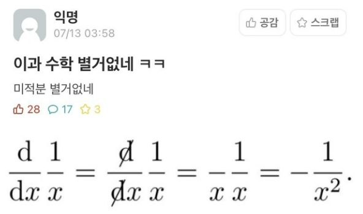

저런 수식을 손으로 쓸 때는 아주 내맘대로 글씨를 쓰면 되니까 문제없지만  
컴퓨터로 저런거 쓰려면 어라? 싶은 사람들도 있을 것 같습니다  
그런데 21세기 이공계열 학생들 박사님들 교수님들은 논문 쓸 때나 뭘 하든간에  
$\int_{-\infty}^\infty x\ dx$ 같은 수식들을 키보드로 숨쉬듯이 뱉어내야 합니다..

이걸 위해서 [LaTeX](https://www.latex-project.org/)라는 일종의 문서 작성 도구가 존재합니다  
좀 더 친숙한 설명은 역시 [나무위키](https://namu.wiki/w/LaTeX)인데, 여기서도 잠깐 이야기하는 것처럼  
라텍스라고 읽고 싶어지는 이름이지만 "**_레이텍_**"과 같이 발음해야 합니다..  
제발 라텍스라고 읽지 말라던 교수님이 생각나네요


물리천문학과 교수님들께서는 이 _LaTeX_ 위에서는 손글씨 속도 그 이상으로 수식을 찍어내시곤 합니다..  
이 사실을 알고 돌이켜 보면  
교수님들께서 과제나 시험을 내실 때 보통 *LaTeX*을 이용하시기 때문에  
거의 모든 교수님들의 양식이 뭔가 다 비슷하게 생겼음을 깨달을 수 있습니다

아무튼간에.. 저희같은 머글들은 레이텍인지 라텍스인지 잘 모르지만  
Github나 Obsidian에는 마크다운으로 마치 *LaTeX*을 쓰듯이 수식을 표현하는 방법이 존재합니다

# Markdown을 사용하여 수학 식 표현

[Github Docs](https://docs.github.com/ko/get-started/writing-on-github/working-with-advanced-formatting/writing-mathematical-expressions)에 따르면,

> 수학 식의 명확한 전달을 위해 GitHub는 Markdown 내에서 LaTeX 형식의 수학을 지원합니다.

근데 이거는 마크다운 표준의 오피셜 문법이라기보다는..  
일부 서비스에서 지원하는 확장형 문법이라고 봐야할 것 같습니다  
[마크다운 가이드](https://www.markdownguide.org/)에도 관련 설명은 없더라고여

아무튼 제가 쓰는 노트 앱인 Obsidian에서도 Github와 마찬가지로 수식 표현을 지원합니다 : [Obsidian Docs](https://help.obsidian.md/Editing+and+formatting/Advanced+formatting+syntax#Math)  
깃허브와 옵시디언 둘 다 [MathJax](https://docs.mathjax.org/en/latest/input/tex/index.html#tex-and-latex-support)라는 오픈소스 JavaScript 기반 디스플레이 엔진을 사용한다고 합니다

잠깐 어떻게 쓰는지 살펴봅시다

## 기본적인 표현법

인라인 식을 작성하려면 `$`로 표현식을 감싸고, 블록으로 작성하려면 `$$`로 표현식을 감쌉니다.  
즉, `$a+b=12$`와 같이 쓰면 $a+b=12$ 이렇게 나오고,

```markdown
$$
a+b=12
$$
```

이렇게 쓰면 아래처럼 나옵니다

$$
a+b=12
$$

이외에도..

- $a^2$같은 지수 표현(위 첨자) : `$a^2$`
  - 두 글자 이상이면 `$a^{20}$`과 같이 묶어서 써야 $a^{20}$처럼 나옵니다
- $a_0$같은 아래 첨자 표현 : `$a_0$`
  - 똑같이, 두 글자 이상이면 `$a_{20}$`과 같이 묶어서 써야 $a_{20}$처럼 나옵니다
- $\pi, \alpha$같은 Greek Letters 표현 : `$\pi, \alpha$`
- $\approx$같은 근사 표현 : `$\approx$`
- $\int_a^b$같은 적분 표현 : `$\int_a^b$`
- $\displaystyle\sum_{i=1}^{10} t_i$같은 유한합 표현 : `$\displaystyle\sum_{i=1}^{10} t_i$`
- $\frac{n!}{k!(n-k)!} = \binom{n}{k}$같은 분수나 이항 표현 : `$\frac{n!}{k!(n-k)!} = \binom{n}{k}$`

뭐 아무튼 등등 많은데 계속 알아보다가는 내일의 해가 뜰 것 같습니다..


그러니 그냥 필요한게 생길 때마다 [docs](https://en.wikibooks.org/wiki/LaTeX/Mathematics)같은 것을 찾아보도록 합시다.

# Gatsby에서도 수식표현하기 : KaTeX

아무튼 그렇게 Obsidian에서 아주 ~~잘~~ 얼레벌레 수식을 써가면서 필기도 하고 했었는데  
Gatsby는 이런 수식 표현을 기본적으로 지원하지 않아서  
이 블로그에 옮겨쓰니까 수식이 되지 않는 사태가 벌어졌습니다?

그래서 찾아보니.. Github나 Obsidian에서 썼다는 **MathJax**를 쓰는 방법도 물론 있지만  
이건 좀 무겁고 의존성도 많고, 등등의 이유로  
**KaTeX**라는 더 가벼운 라이브러리도 꽤나 많이 쓰이는 것 같았습니다  
그래서 저는 이 **KaTeX**를 블로그에 추가하기로 했습니다

[gatsbyjs.com에](https://www.gatsbyjs.com/plugins/gatsby-remark-katex/) KaTeX 플러그인을 추가하는 법이 잘 나와있습니다  
매우 간단한데요

먼저 터미널에서 `npm install gatsby-transformer-remark gatsby-remark-katex katex`를 입력하여 설치합시다

그런 다음 **gatsby-config.json**에서,

```Javascript
plugins: [
  {
    resolve: `gatsby-transformer-remark`,
    options: {
      plugins: [
		/* --- 여기에 추가 : gatsby-remark-katex --- */
        {
          resolve: `gatsby-remark-katex`,
          options: {
            // Add any KaTeX options here
            strict: `ignore`
          }
        }
		/* ----- */
      ],
    },
  },
]
```

이런 식으로 `gatsby-transformer-remark`의 `options` 하위의 `plugins`에 `gatsby-remark-katex`와 그 옵션들을 넣어줍시다

이제 진짜 거의 끝났습니다?  
공식문서에서 하라는 대로 template 파일같은데다가 Katex의 CSS 파일을 넣어주기만 하면 되는데  
저같은 경우는 _templates/blog-post.tsx_ 파일에
`import "katex/dist/katex.min.css"` 이렇게 한 줄 적어주었습니다

이제 진짜 끝입니다. 간단하죠?  
$\sigma = \sqrt{\frac{(b-a)^2}{12}}$ (`$\sigma = \sqrt{\frac{(b-a)^2}{12}}$`) 같이 아무거나 써보고 잘 나오는지 확인해봅시다

---

\
코드 짜다가 너무 햄들어서 그냥..  
간단한 주제로 써봤습니다.


이만 마칩니다
