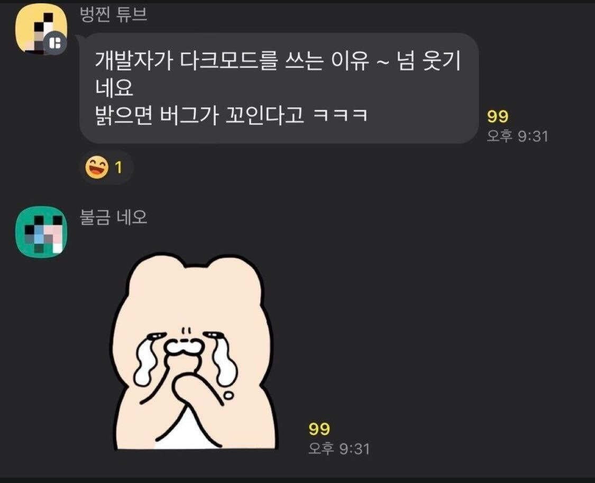
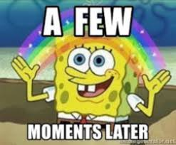
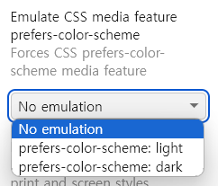
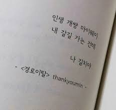
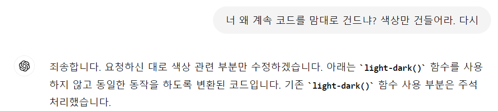
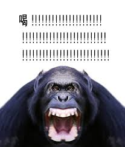

그제였나? 누워서 조선왕조실록 틀어놓고 잠들고 싶어하고 있었는데요  
아~ 도저히 잠이 안와서 노마드코더 좀 봤습니다  
그 중에 이런 영상이 있었는데

<iframe width="560" height="315" src="https://www.youtube.com/embed/vc4DGouf62E?si=hhtqt0DHpVhuzrXQ" title="YouTube video player" frameborder="0" allow="accelerometer; autoplay; clipboard-write; encrypted-media; gyroscope; picture-in-picture; web-share" referrerpolicy="strict-origin-when-cross-origin" allowfullscreen></iframe>

흥미로운데요? 당장 해봐야겠습니다  
어차피 블로그에 다크모드 언젠가 넣어야지 넣어야지 했어서  
시간 남는 김에 해봤습니다

<figure>



<figcaption>
컴하하~
</figcaption>
</figure>

근데 5초컷도 아니고 5분컷도 아닙니다.. 꽤 걸림 ㅋㅋ;; 어그로 ㅈㅅ합니다.  
다크모드 토글로 하고싶은게 아니었으면 진짜 5분컷이긴 한 듯

아무튼 시작합시다

# light-dark() 함수 써봅시다.

먼저 영상에 나온 `light-dark()`함수를 써서,  
`prefer-color-scheme`값이 `dark`인 상태에서 보여줄 화면을 구성하고 싶은데요  
아 근데 `prefer-color-scheme`란..  
여러분이 설정한 "난 다크모드가 좋아 or 라이트모드가 좋아" 시스템 설정입니다  
처음 들어보셨다면 그냥 `light`상태일걸요? 저도 건드린적 없습니다 딱히  
암튼간에

```css
:root {
  color-scheme: light dark;
}
```

일단 이렇게 해서 브라우저에게 "여기는 light와 dark 테마 모두 지원합니다~"라고 알려줍시다

이제, 라이트모드와 다크모드에서 각각 달라야 하는 색상이 있다면 `light-dark()`함수를 쓰면 되는데  
예를 들어 이렇게 되어있다고 합시다

```css
body {
  color: black;
  background-color: white;
}
```

음.. 그러면.. `prefers-color-scheme`값이 `dark`일 때는..

```css
@media (prefers-color-scheme: dark) {
  body {
    color: white;
    background-color: black;
  }
}
```

이렇게 해야할까요??  
너무 귀찮은데요 ㅜㅜ

근데 `light-dark()`라는 채신기술과 함께라면

```css
body {
  color: light-dark(black, white);
  background-color: light-dark(white, black);
}
```

매우 간단해졌네요??


`light-dark(light일 때의 색상, dark일 때의 색상)` 이렇게 써주면 됩니다.

만족스러운데요~  
이제 색상이 반전되어야 하는 곳에 다 이 함수를 적용해줍시다  
이정도는 몇 줄만 고쳐주면 됩니다 잠시만요..



아무튼 이렇게 대강 만들었는데요


아 근데 저는 `prefered-color-scheme` 설정같은거 건드린 적 없다고 했는데, 어떻게 이 화면을 볼 수 있냐면


크롬은 개발자도구에서 - 대충 더보기처럼 생긴 아이콘 - More tools - Rendering에 들어가면



이런게 있습니다? 바꿔가면서 테스트해볼 수 있습니다

# 근데 저는 라이트/다크모드 토글하고 싶은데요?

이게 가장 문제입니다 ㅋㅋㅋ 사실 위에는 진짜 5분컷 가능  
토글버튼 하나로 그냥 `prefered-color-scheme`값을 휙휙 바꾸는게 가능하면 정말 편하겠는데  
좀 찾아봤지만 아쉽게도 그런 방법이 없는 것 같습니다?

그래서 [지인의 블로그(상습숭배중)](https://klloo.github.io/darkmode/)랑 [카카오 기술블로그](https://fe-developers.kakaoent.com/2021/211118-dark-mode/) 등등 몇 개를 참조해봤는데..  
body에 `dark` 클래스를 넣었다뺐다 하는게 국룰인 것 같아보이네요

근데 저는 `light-dark()`함수를 쓰고싶은건데요..  
흠;그래서 이리저리 생각을 해보다가  
`body`에 넣었다뺐다 할 클래스로 `reverse`를 두고  
`body.reverse`에는 `light-dark` 인자를 뒤집어서 작성하기로 했습니다

근데 하고나니까 `dark`넣는거랑 딱히 다른 것도 없고,  
몇 가지 경우에는 이게 더 골아픕니다..



저는 홍대병 걸린.. 남들 가는 길에 잘 가려고 하지 않는 낭만파라서 이렇게 했지만  
그냥 다크모드 토글은 `dark`하시는게 좋은 것 같습니다.  
그러니 괜히 좋아보인다고 막 쓰지 맙시다

## reverse버전 CSS를 작성해요


아무튼 이런 식으로 반전된 색상의 클래스를 작성해준다는 의미인데


어느정도 바뀌긴 했는데, 색상을 따로 주는 요소들은 아직 그대로네요.  
이제 `body`가 `.theme-reverse` 클래스를 가지는 경우, 그 하위의 `요소`들을 손봐줘야 하는데  
저처럼 몽총하게 선택자를 `a .theme-reverse {}` 이렇게 쓰지 맙시다.  
`body.theme-reverse a {}` 이렇게 해줘야 먹어요


이제 CSS를 전부 잘 작성해서 원하던 모냥이 나왔다면  
적당히 만든 버튼에 `onClick`을 등록해줘야겠죠?  
뭐가 있어야 하냐면

- `body`에 `theme-reverse` 클래스를 넣거나 빼기
- 새로고침해도 유지되게 하고 싶으니까, `localStorage`에 현재 모드 정보를 저장하기

그럼 이렇게 됩니다

```typescript
onClick={() => {
	const theme = localStorage.getItem("theme")
	if (!theme || theme === "original") {
	    document.body.classList.add("theme-reverse")
	    localStorage.setItem("theme", "reversed")
	} else {
	document.body.classList.remove("theme-reverse")
	localStorage.setItem("theme", "original")
	}
}}
```

## 새로고침해도 유지됐으면 좋겠어요

이러면 일단 버튼 누르면 모드가 잘 넘어가긴 하는데,  
새로고침하면 localStorage에서 값을 불러오고 그에 맞는 모드를 적용하게 해야겠죠?  
`localStorage.getItem('theme')`를 확인하도록 하면 될 것 같습니다  
근데 아무데나 넣게되면 이런 일이 발생합니다


이러면 야밤에 부모님 몰래 제 블로그를 탐독하다가 섬광탄에 맞는 불상사가 발생할 수 있습니다

이게 Javascript단에서 CSS 속성을 넣어주는거라, 이미 페인팅이 된 후에 야간모드가 적용되고 있어서 그렇습니다

이에 대해 위에서 언급한 [지인의 블로그](https://klloo.github.io/darkmode/)에서는 여기도 Gatsby를 사용했기 때문에 SSR방식을,  
[카카오 기술블로그](https://fe-developers.kakaoent.com/2021/211118-dark-mode/)에서는 SSR이 아닌 경우에도 쓸 수 있는 방법을 채택하여 알려주고 있습니다

후자는 **_자바스크립트는 명시적으로 비동기로 선언되지 않은 경우 DOM 생성을 차단합니다_** 라는 점을 이용해서  
`body`가 시작하자마자 스크립트를 넣게 했나? 그랬었네요

암튼 전자의 방식으로 해봅시다  
Gatsby 프로젝트 루트 폴더의 **gatsby-ssr.tsx**에서  
`onRenderBody`에 `setPreBodyComponents`로 스크립트를 집어넣을 수 있습니다  
아래와 같이 작성했습니다 :

```typescript
exports.onRenderBody = ({ setHtmlAttributes, setPreBodyComponents }) => {
  const script = `
    const theme = localStorage.getItem("theme");
    if (!theme || theme === "original") {
      document.body.classList.add("theme-reverse")
    } else {
      document.body.classList.remove("theme-reverse")
    }
  `
  setHtmlAttributes({ lang: `en` })
  setPreBodyComponents(<script dangerouslySetInnerHTML={{ __html: script }} />)
}
```

`localStorage`에서 `theme`아이템을 가져오고, `reversed`면 클래스를 넣고 아니면 빼는 간단한 스크립트입니다

이렇게 해주면 새로고침해도 실명 걱정은 없어졌습니다

# 댓글창도 바꿔야할 것 같아요 (Giscus)

이제 다 좋은데.. 댓글창이 혼자 따로 노는게 문제입니다  
Giscus 테마는 여러가지가 있어서 그냥 `light`건 `dark`건 정해주면 되는데  
지금 어떤 모드인지? 그리고 모드가 바뀌면 바로 짜잔 바뀌기?를 그냥 이루기가 까다롭더라고여  
방법이 몇 가지 있어보이는데

1. SSR 스크립트 넣을 때 window객체에 `window.__onThemeChange()` 이런 식의 리스너를 같이 넣기
2. 전역 상태관리가 가능하면 간단할듯..
3. localStorage에 이벤트리스너 등록하기

1번은 그냥 스크립트가 계속 늘어나는게 맘에 들지 않았고..  
2번은 당장 전역상태 라이브러리를 두지도 않았는데 이거 하나 하려고 넣기는 좀.  
그래서 3번으로 가보기로 했습니다?

그럼 이제

1. `prefered-color-scheme`값과 `theme-reverse` 여부에 따라 현재 적절한 `curTheme`가 `light`인지 `dark`인지 결정
2. `storageEventListener`등록 : `key: theme`인게 바뀌면 `curTheme`를 바꾼다

사실 1번은 `reverse`같은 발상 하지 않고 `theme`가 `dark`, `light` 중 하나이게 하면 됐는데..  
선택에는 대가가 따르네요


일단 저는 `Giscus` 컴포넌트를 **blog-post.tsx**라는 곳에서 뱉기로 되어있습니다.  
그 곳에서 :

```tsx
useEffect(() => {
  if (window.matchMedia("(prefers-color-scheme: dark)").matches) {
    //시스템 설정이 다크임
    setCurTheme(
      window.localStorage.getItem(KEY_THEME) === REVERSED ? LIGHT : DARK
    ) //뒤집혔으면 라이트로 ㄱㄱ
  } else {
    //시스템 설정이 라이트임
    setCurTheme(
      window.localStorage.getItem(KEY_THEME) === REVERSED ? DARK : LIGHT
    ) //뒤집혔으면 다크로 ㄱㄱ
  }
}, [])
```

먼저 이렇게 `curTheme`를 결정하고  
이제 localStorage에 이벤트 리스너를 등록합시다

```tsx
useEffect(() => {
  const storageListener = (event: StorageEvent) => {
    if (event.key === KEY_THEME) {
      setCurTheme(prev => (prev === DARK ? LIGHT : DARK))
    }
  }
  window.addEventListener("storage", storageListener)
  return () => {
    window.removeEventListener("storage", storageListener)
  }
}, [])
```

이게 마지막줄처럼 이벤트리스너를 제거하도록 해줘야지 이벤트리스너가 계속 쌓이는 불상사를 막을 수 있습니다

아 그리고 이러면 될 줄 알았는데, localStorage에 변화가 생겨도 이벤트가 발생하지 않아서..  
직접 넣어줬습니다.

```tsx
window.dispatchEvent(new StorageEvent("storage", { key: KEY_THEME }))
```

야간모드 토글버튼의 `onClick`에서 이렇게 이벤트를 생성하도록 해줍니다

이제 `<Giscus theme="prefered_color_scheme">`이런 식이던 테마를 `<Giscus theme={curTheme}>` 이런 식으로 바꾸면??


아 빵애애요  
이제 다크모드 덕분에 버그가 꼬이지 않겠는데요~

---

# 마무리

간단한 기능같아보이지만 고민할 것도 난관도 많았습니다  
저는 좀 산기슭으로 돌아돌아 도착한 느낌이 없지않아 있는데  
그래도 이러면서 배우고 사는거 아니겠습니까~

암튼간에 이만 마칩니다

<details>
  <summary>어라? 아이폰에서 왜 안 되지</summary>

아니.. 분명  
[Can I Use](https://caniuse.com/mdn-css_types_color_light-dark)이런 곳이나  
[MDN docs](https://developer.mozilla.org/en-US/docs/Web/CSS/color_value/light-dark#browser_compatibility)이런 곳에서

> Since May 2024, this feature works across the latest devices and browser versions. This feature might not work in older devices or browsers.

라길래 별 걱정없이 썼는데  
배포하고보니 IOS위의 크롬 사파리 등등에서는 완전히 `light-dark`를 지원하지 않는가 봅니다?  
폰으로 들어가보니 색상이 제대로 되어있지 않더라구여..

[browserstack](https://live.browserstack.com/)이라는 곳에서 여러 디바이스별로 테스트를 해볼 수 있길래 봤는데  
웹 브라우저들은 전부 지원하고, 안드로이드도 어지간해서는 다 지원하는데  
IOS만 유독 최신의 최신의 최신도 다 적용이 안 됩니다..

그래서 눈물을 머금고 일단 GPT시켜서 아래와 같이  
코드를 저어언부 `light-dark`없이 다시 쓰면서도 동작은 똑같아서 자바스크립트 코드는 그대로 가능하게 해달라고 했습니다 ㅋㅋ ; ;

```css
body {
  color: var(--color-text);
  background-color: white;
}

@media (prefers-color-scheme: dark) {
  body {
    color: var(--color-light);
    background-color: var(--color-dark);
  }
}

body.theme-reverse {
  color: var(--color-light);
  background-color: var(--color-dark);
}

@media (prefers-color-scheme: dark) {
  body.theme-reverse {
    color: var(--color-text);
    background-color: white;
  }
}
```

근데 또 이자슥이 뭐라고 안 했더니 자꾸 새로운 CSS스타일을 적용시키거나 누락시켜서 꾸짖을 갈! 한 번 했네요



갈! 한번 해주니까 사족은 넣지 않고 알잘딱깔센 하더라구요?

아무튼간에.. `light-dark`가 절 지독히도 괴롭혔네요  
제가 자초한 일인 것 같긴하죠?  
마칩니다

어라? 근데 IOS 업데이트하니까 잘 나오네요

</details>
