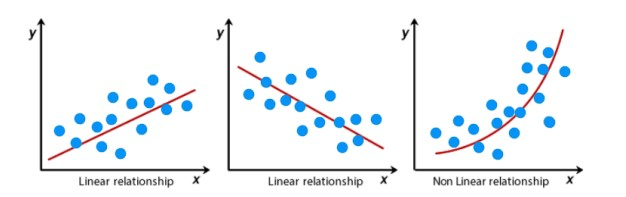
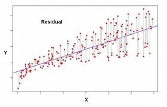
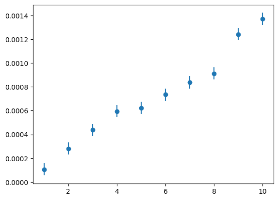
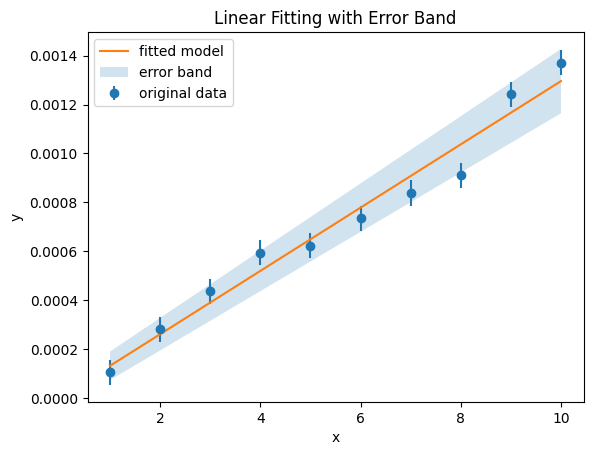

그 왜 이런거 본적 있으시죠?

[](https://www.analyticsvidhya.com/blog/2021/10/everything-you-need-to-know-about-linear-regression/)

위와 같이 데이터들 막.. 찍어놓고, 적당한 선 쭈욱 그어서 "이런 분포를 따릅니다" 라고 하는 것 말입니다  
당연하지만 그냥 사람이 대강 선을 그어내는게 아니라  
적당한 수학적 방법으로 데이터를 가장 잘 표현하는 함수를 구하게 됩니다

그런 과정을 두고 *데이터를 fitting한다*라고 하는데


물론 이렇게 옷 입는 그 피팅은 아닙니다

아무튼 그런 방법들 중 가장 기초적인 임플란트가 **Least Square** Method 입니다
[](https://youngji.medium.com/%EC%B5%9C%EC%86%8C%EC%A0%9C%EA%B3%B1%EB%B2%95-least-squared-method-f7357990329f)
이런 식으로, 그냥 쉽게 말해서 함수로부터 각 지점들까지의 차이를 최소화하려는 방법입니다  
자세한 설명은 나무위키같은거나 [이런 데를](https://www.geeksforgeeks.org/least-square-method/)확인해보세요

아무튼 이런거 하려면 수식을 막 세워야할 것 같지만  
우리에게는 콤푸타가 있습니다  
Python을 쓸거고,  
그래프 그리는 데는 Matplot 라이브러리를,  
수학통계적인 계산은 scipy한테 맡겨버리기로 합시다

# 예제

1부터 10까지의 x값과 그에 대응하는 y, 그리고 yerr(y값의 오차)가 아래와 같이 주어졌다고 해봅시다

```
1 0.000105532 5.12821e-05
2 0.000281377 5.12821e-05
3 0.000437138 5.12821e-05
4 0.000595329 5.12821e-05
5 0.000623162 5.12821e-05
6 0.000735304 5.12821e-05
7 0.000838319 5.12821e-05
8 0.000911662 5.12821e-05
9 0.00124201 5.12821e-05
10 0.00137106 5.12821e-05
```

x y yerr(또는 uncertainty) 와 같은 형태입니다  
일단 이거 가져다가 파싱을 좀 해봅시다 :

```python
import numpy as np
import scipy.optimize as opt
import matplotlib.pyplot as plt

# 데이터 불러오기 및 파싱
with open("linear.dat", "r") as file:
    lines = file.readlines()

x = []
y = []
uncertainty = []
for line in lines:
    try:
        parts = line.split()
        if len(parts) < 3:
            raise ValueError("Invalid format: Insufficient data")

        x.append(float(parts[0]))
        y.append(float(parts[1]))
        uncertainty.append(float(parts[2]))
    except ValueError as e: # 혹시 빈 문자열 등 포맷에 맞지 않는 행이 나오면 넘김
      # 별 일 안할 것임
```

이런거 매번 기억 안 나도 GPT한테 ""linear.dat"파일 열어서 저런 포맷 파싱해줘" 하면 알아서 짜줍니다.  
이렇게 해서 각 x, y, uncertainty 배열들을 만들어두도록 합시다

근데 데이터가 대충 어떻게 생겨먹었는지 알아야 어떤 모양에 맞출지도 알 수 있겠죠?  
점을 찍어봅시다

```python
plt.errorbar(x,y, yerr=uncertainty, fmt='o')
```

이러면 y오차와 함께 데이터 그래프를 찍어주고, `fmt='o'` 옵션으로 인해 데이터가 그냥 똥골뱅이로 표현됩니다



직선 긋고 싶게 생겼죠?

# scipy.optimize.curve_fit

이제 이 데이터들을 가장 잘 표현하는 함수를 알고 싶은건데


마침 도라에몽이 scipy 라이브러리에 `curve_fit`이라는 좋은 도구를 찾아줬습니다~  
[공식문서](https://docs.scipy.org/doc/scipy/reference/generated/scipy.optimize.curve_fit.html)는 에 따르면 `curve_fit`은 least square로 fitting해주는 함수라고 하네요  
least square에 대해서는 아까 소개했죠?

인자로는 `scipy.optimize.curve_fit(f, xdata, ydata, ...)` 이런 식인데 (...는 optional들)

- `f` : 모델 함수
  - 직선으로 할거니까 $y=ax+b$라는 직선을 가정해봅시다
  - 그럼 그냥 `def fit_function(x,a,b) : return a*x+b`와 같이 작성해두고, 이 함수를 넘기면 됩니다
- `xdata`와 `ydata`를 준비해야겠죠? 배열 상태로 준비해둡시다
- `sigma` (_optional_) : 이건 *uncertainty in ydata*라는데 마침 우리 데이터에는 yerr에 해당하는 `uncertainty`가 있었으니 이걸 넣어줍시다

그럼 이제 이렇게 쓰면 됩니다

```python
# 선형 모델 함수 정의
def fit_function(x, a, b):
    return a * x + b

# 선형 모델 fitting
popt, pcov = opt.curve_fit(fit_function, x, y, sigma=uncertainty)
```

리턴값이 궁금한데요

- `popt` : 아까 우리가 모델함수로 $y=ax+b$를 정의했고, `curve_fit`을 사용하여 그 모델함수의 `a`값과 `b`값을 정하고 싶었던 것인데, 이 `a`와 `b`에 해당하는 값들입니다.
- `pcov` : 이건 `covariance matrix`라는 것인데요.. _"둘 이상 변수들 간의 흩어진 정도(분산)의 상관관계를 나타내는 행렬_" 정도로 이해하고 넘어갑시다.

  
공분산행렬은 대충 이렇게 생겼습니다.

이 `pcov`에서 얻고자 하는 것은 우리가 얻은 fitting 결과의 오차범위인데

> To compute one standard deviation errors on the parameters, use `perr = np.sqrt(np.diag(pcov))`

라는 친절한 설명이 있습니다.  
그럼 이 결과들을 이용해서 fitting 결과를 그려봅시다

```python
# pcov로부터 perr값 계산
perr = np.sqrt(np.diag(pcov))
# 데이터와 fitting된 모델 그래프 그리기
plt.errorbar(x, y, yerr=uncertainty, fmt='o', label="original data")
plt.plot(x, fit_function(np.array(x), *popt), label="fitted model")
plt.fill_between(x,
                 fit_function(np.array(x), *(popt - perr)),
                 fit_function(np.array(x), *(popt + perr)),
                 alpha=0.2, label="error band")
plt.legend()
plt.xlabel("x")
plt.ylabel("y")
plt.title("Linear Fitting with Error Band")
plt.show()
```

적당히 matplot으로 그래프를 그리는 코드를 작성합니다.  
제가 지금 matplot(`plt.plot` 등등..)에 대해 별 설명을 하지 않고 있는데  
저도 그냥 [공식문서](https://matplotlib.org/stable/api/_as_gen/matplotlib.pyplot.plot.html)에서 매번 찾아봅니다.  
아무튼 이렇게 적당히 그려보면



이렇게 있어보이는 결과가 나왔습니다~

---

\
되게 뜬금없는 주제였는데요  
데이터분석기법이라는 물리천문학과 수업을 듣다가 그냥 써봤습니다


빅데이터나 AI처럼 데이터를 다루는 분야에서 이런 것들이 되게 기초인 것 같고  
물리천문학과에서도 실험이나 관측 데이터 셋들을 다룰 때 이런게 기초로 많이들 쓰이는 것 같습니다

좀 대충 쓴 것 같은데  
scipy의 `curve_fit`에 대해 더 알아보고싶다면  
[GeeksforGeeks](https://www.geeksforgeeks.org/scipy-curve-fitting/)같은데서 자세히 써놨으니까 참고하십셔

이만 마칩니다
