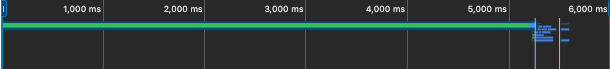
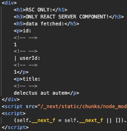
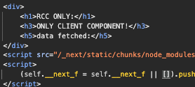
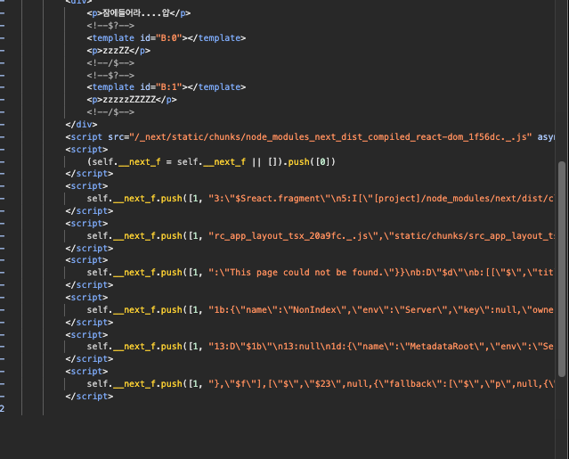
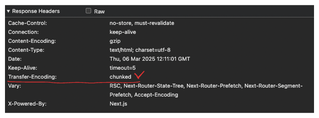
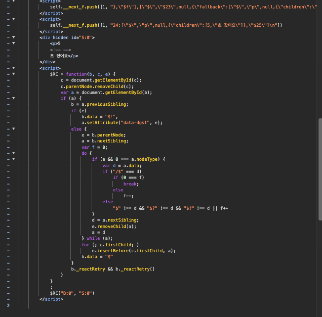
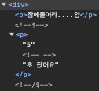
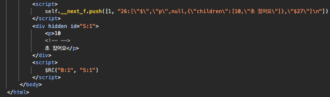
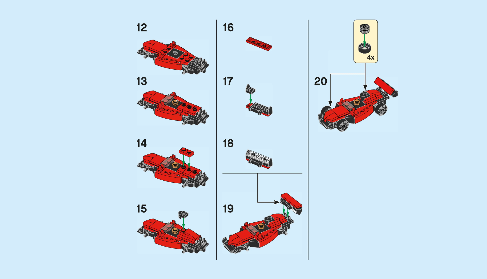
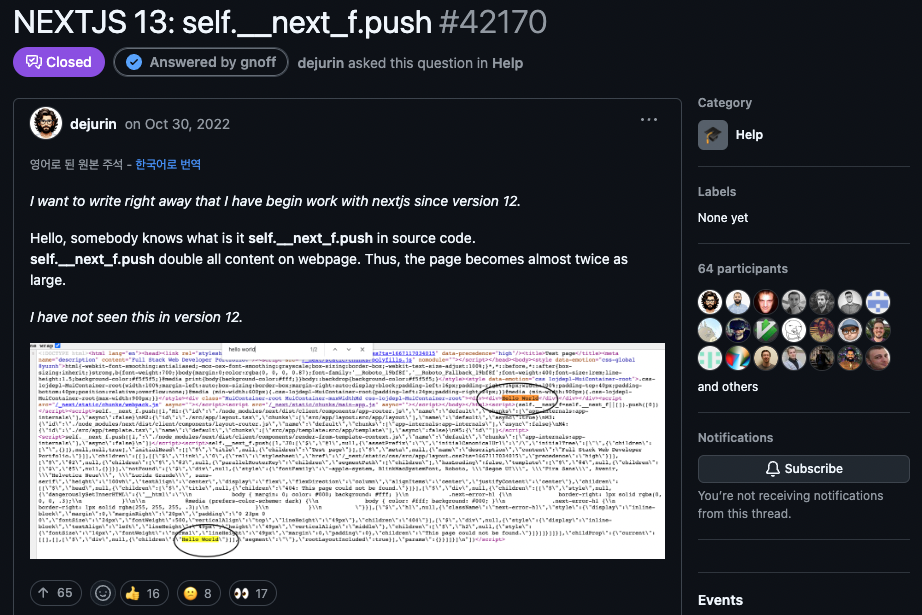

[저번 글](http://localhost:8000/react-18-concurrency-and-streaming-with-rsc/)에서 React 18에서 무슨 일이 있었는지, 동시성 업데이트를 중심으로 살펴봤는데요  
근데 그냥 "이런게 나왔어요~" 만 하고 넘어갔는데


말만 해서는 잘 모르곘으니깐 뭐라도 만들어보고 찍어먹어보고 해봅시다

먼저 :

- 간단하게 서버 컴포넌트를 구현
- 서버 컴포넌트와 Suspense를 함께 사용하여 Streaming
- 클라이언트 컴포넌트는 이제 어떻게 쓰는지
- 클라이언트 컴포넌트와 Suspense를 함께 사용하여 Streaming

이런걸 해보고

- React가 Suspense를 갈아끼우는 법
- Next.js가 RSC Payload를 다루는 법
- Next.js가 당신의 프로젝트를 두 배 무겁게 만듭니다??

머 이런 비밀?에 대해 알아보겠습니다

[저번 글](http://localhost:8000/react-18-concurrency-and-streaming-with-rsc/)에서 소개한 **React 18 동시성 업데이트**가 뭐였는지 기억이 안 나시거나, 아직 안보셔서 모르신다면 쓱 갔다오시면 좋겠습니다.

# 서버 컴포넌트를 만들어보기

서버 컴포넌트를 만들어볼텐데요  
Next.js 13 이상 App Router를 사용한다면, 모든 컴포넌트들이 기본적으로 서버 컴포넌트가 됩니다  
서버 컴포넌트를 사용한답시고 컴포넌트 상단에 `'use server'` 지시어를 쓰는건 하지맙시다.  
컴포넌트는 지시어가 없으면 서버 컴포넌트, `'use client'` 지시어가 있으면 클라이언트 컴포넌트고  
`'use server'`는 [서버 함수](https://react.dev/reference/rsc/server-functions)에 사용합니다.

서버 컴포넌트가 뭐가 좋은거지? 에 대해서는 [관련 Next.js 문서](https://nextjs.org/docs/app/building-your-application/rendering/server-components#benefits-of-server-rendering)를 참고하세요

아무튼간에 서버 컴포넌트를 사용할 수 있고 심지어는 아래처럼 비동기로 만들 수 있습니다 :

```tsx
import { fetchJson } from "@/utils/fetchJson";
import { sleep } from "@/utils/sleep";

export default async function Page() {
  const data = await fetchJson(1); // 더미 데이터를 fetch하는 함수
  await sleep(5000); // 5000ms동안 이 비동기함수의 진행을 중단
  return (
    <div>
      <h1>RSC ONLY:</h1>
      <h3>ONLY REACT SERVER COMPONENT!</h3>
      <h5>data fetched:</h5>
      <p>
        id: {data.id} | userId: {data.userId}
      </p>
      <p>title: {data.title}</p>
    </div>
  );
}
```

이러면 모든게 편해지는데  
`useEffect`와 `useState`로 첫 렌더링 이후에 fetch하고.. 그 전에는 fallback을 리턴하고..  
이런거 그냥 `await` 딸깍으로 데이터가 준비될 때까지 렌더링을 잠깐 멈춰둘 수 있습니다.



`await sleep(5000)`으로 인해 5초 지난 후 렌더링이 재개되어 HTML을 받을 수 있구요



5초 후 받은 HTML에는 이미 값이 다 차있는 상태네요  
비교를 위해 클라이언트 사이드에서 전통적인 방식(`useEffect, useState`사용)으로 대충 구현해보면

```tsx
export default function Page() {
  const [data, setData] = useState<JsonPlaceholder>();

  useEffect(() => {
    sleep(5000).then(() => fetchJson(1).then(res => setData(res)));
  }, []);

  return (
    <div>
      <h1>RCC ONLY:</h1>
      <h3>ONLY CLIENT COMPONENT!</h3>
      <h5>data fetched:</h5>
      {data && (
        <>
          <p>
            id: {data.id} | userId: {data.userId}
          </p>
          <p>title: {data.title}</p>
        </>
      )}
    </div>
  );
}
```

이런 식으로 될까요? 클라이언트 컴포넌트는 _렌더링을 중단_ 까지는 할 수 없으니, 데이터만 5초 기다렸다가 가져오도록 해봤습니다  
아무튼 이런 식으로 데이터가 필요한 부분은 나중에 데이터가 준비되어야 추가하도록 하면



이렇게 `data`가 필요한 부분은 뚝 끊긴 채로 HTML이 전달되고, 그 밑은 나중에 클라이언트 사이드에서 JavaScript를 사용하여 채워집니다

# 서버 컴포넌트에 Suspense를 사용하여 Streaming하기

마법은 이제부터 시작인데요  
아까처럼.. 데이터 준비하는데 오래 걸린답시고 진짜 5초 뒤에나 페이지가 그려지면 아주 끔찍하죠?


다행히도 저번시간에 `Suspense`를 사용하여 Streaming하면 컴포넌트들을 **준비되는 대로** 가져다줄 수 있다고 했습니다  
어떻게 하는지 봅시다

먼저 n초동안 잠들어버리는 간단한 컴포넌트를 만들게요

```tsx
import { sleep } from "@/utils/sleep";

export default async function Sleep({ seconds }: { seconds: number }) {
  await sleep(seconds * 1000);
  return <p>{seconds}초 잤어요</p>;
}
```

비동기 서버 컴포넌트로 만들어서 렌더링이 중단가능하게 합니다  
그런 다음 이 컴포넌트를 사용할 때는 `Suspense`로 경계를 만듭니다

```tsx
import Sleep from "@/components/Sleep";
import { Suspense } from "react";

export default async function Page() {
  return (
    <div>
      <p>잠에들어라....얍</p>
      <Suspense fallback={<p>zzzZZ</p>}>
        <Sleep seconds={5} />
      </Suspense>
      <Suspense fallback={<p>zzzzzZZZZZ</p>}>
        <Sleep seconds={10} />
      </Suspense>
    </div>
  );
}
```

이러면 처음에는 `<Suspense>`를 만났을 때, fallback으로 먼저 HTML을 채웁니다.  
그러고 나중에 서스펜스 경계 내부의 컴포넌트가 준비되었다면, fallback을 갈아끼웁니다.


5초 뒤에 `zzzZZ`가 `5초 잤어요`로 바뀌고,  
10초 뒤에 `zzzzzZZZZZ`가 `10초 잤어요`로 바뀌는거십니다

## Suspense끝나면 fallback을 어떻게 갈아끼우나요?

근데 HTML은 이미 fallback으로 채워서 내려갔는데, 어떻게 fallback자리를 새로 도착한 HTML조각들로 갈아끼울 수 있을까요?  
밑에다 붙이는 것도 아니고..  
이를 알아보기 위해, 위에서 봤던 예시 코드를 실행하면 HTML이 어떻게 변하는지 열어봅시다.

### 1. Suspense가 둘 다 안 끝남

먼저 위 예시에서 두 Suspense가 모두 완료되지 않은 타이밍(~5초 미만)의 HTML을 열어봅시다



보면 이렇게 일단 fallback(`zzzZZ` 등)으로 HTML이 채워지고, 그 뒤로는 아직 HTML이 닫히지 않았는데



이 HTML의 응답헤더에 `Transfor-Encoding: chuncked`와 같이 지정하여 HTML을 Streaming중임을 알 수 있습니다


### 2. Suspense가 하나 끝남

이제 Suspense가 하나 끝난 타이밍(5초 이상 ~ 10초 미만)을 봅시다



Suspense로 기다리던 `5초 잤어요` 블록이 도착했는데,  
웬 `$RC`라는 함수의 선언과 호출이 있는 이상한 스크립트가 같이 왔어요  
이게 React가 **Suspense 경계를 갈아끼우는 비결**입니다

#### `$RC(b, c, e)` : completeBoundary

이 `$RC`라는 함수는 Suspense 경계를 갈아끼우기 위한 함수인데, 원본은 [React fizz instruction 중 하나인 completeBoundary](https://github.com/facebook/react/blob/b9be4537c2459f8fc0312b796570003620bc8600/packages/react-dom-bindings/src/server/fizz-instruction-set/ReactDOMFizzInstructionSetShared.js?ref=hackernoon.com#L46)입니다  
원본 코드에 정말 자세한 주석이 친절하게 써있긴한데요  
위 코드를 기준으로 어떤 일이 일어났는지 다시 봅시다

```html
<div>
  <p>잠에들어라....얍</p>
  <!--$?-->
  <template id="B:0"></template>
  <p>zzzZZ</p>
  <!--/$-->
  <!--$?-->
  <template id="B:1"></template>
  <p>zzzzzZZZZZ</p>
  <!--/$-->
</div>
```

일단 fallback으로 채워진 HTML이 왔었는데, 사실 `<!--$?-->, <!--/$-->`와 같이 수상하고 이상한 주석이 있고  
`<template id="B:0">`처럼 수상해보이는 [콘텐츠 템플릿 요소](https://developer.mozilla.org/ko/docs/Web/HTML/Element/template)도 있습니다  
이 `B:0`이라는 id는 나중에 **제거할 fallback이 어디있는지**를 위한 마킹이고,  
`<!--$?-->`는 Suspense경계의 시작점, `<!--/$-->`는 종료점을 나타냅니다

그리고 첫 번째 Suspense가 끝나고 도착한 HTML조각은 아래와 같았습니다

```html
<div hidden id="S:0">
  <p>
    5
    <!-- -->
    초 잤어요
  </p>
</div>
```

여기에도 `S:0`이라는 수상한 id가 붙어있고, hidden으로 숨겨놓았네요

이제 아까 그 스크립트(`$RC`)를 다시 봅시다

```html
<script>
  /**
   * Suspense되었던 부분이 도착하면 갈아끼우는 스크립트 ($RC함수)
   * b : fallback경계의 id (ex. B:0)
   * c : 새로 도착한 노드의 id (ex. S:0)
   * e : errorDigest
   */
  $RC = function (b, c, e) {
    c = document.getElementById(c); // 새로 도착한 노드를 get
    c.parentNode.removeChild(c); // 원래 있던 자리에서 제거
    var a = document.getElementById(b); // fallback 노드를 get
    if (a) {
      b = a.previousSibling;
      if (e) (b.data = "$!"), a.setAttribute("data-dgst", e);
      else {
        e = b.parentNode;
        a = b.nextSibling;
        var f = 0;
        do {
          // 기존 fallback 노드를 삭제.
          if (a && 8 === a.nodeType) {
            // a타입이 8 => 주석노드
            var d = a.data;
            if ("/$" === d)
              if (0 === f)
                // 종료태그 "/$" 가 나올때까지 노드 삭제를 반복
                break;
              else f--;
            // 시작 태그는 "$?"
            else ("$" !== d && "$?" !== d && "$!" !== d) || f++;
          }
          d = a.nextSibling;
          e.removeChild(a);
          a = d;
        } while (a);
        for (
          ;
          c.firstChild; //받아온 노드를 추가하기.

        )
          e.insertBefore(c.firstChild, a);
        b.data = "$"; // "$"는 완료되었음을 표시함.
      }
      b._reactRetry && b._reactRetry(); // 혹시 실패하면 재시도
    }
  };
  $RC("B:0", "S:0"); // $RC(fallback노드, 새로도착한노드) 를 실행하여 노드를 갈아끼우기
</script>
```

(1) Suspense fallback의 시작점 플래그 주석인`<!--$?-->`부터 종료점 플래그 주석인 `<!--/$-->`까지 노드를 삭제합니다  
(2) Suspense가 완료되고 새로 받아온 노드를 fallback이 있던 자리에 추가합니다

그럼 이후 개발자도구의 Elements를 보면 교체된 자리는



이렇게 `<!--$-->`로 마킹하여 "교체됨"을 나타냈네요.

<figure>


<figcaption>
바꿔치기
</figcaption>
</figure>

### 3. Suspense 둘 다 끝남

Suspense Boundary를 바꿔치기하는 인술이 있는걸 알았으니 이제 이해가 편하겠네요  
두 번째 Suspense가 끝나도 똑같습니다



이제 `$RC`함수 선언이 이미 있으니 `$RC("B:1", "S:1")`이라고 호출만 해주면 되겠죠?  
그리고는 Streaming이 끝났고 html이 닫혔습니다

# Suspense로 클라이언트 컴포넌트를 기다릴 수도 있어요

제곧내  
클라이언트 컴포넌트가 Promise를 반환하는 함수를 받아서 [`use`훅](https://ko.react.dev/reference/react/use)으로 이를 읽으면 됩니다

> use에 전달된 Promise가 대기Pending하는 동안 use를 호출하는 컴포넌트는 Suspend됩니다.

이제 아래처럼 Promise를 props로 받는 간단한 클라이언트 컴포넌트를 만들고

```tsx
"use client";
import { use } from "react";

export default function RCC({ cb }: { cb: Promise<any> }) {
  const result = use(cb);

  return <p>{result}</p>;
}
```

이제 이 `<RCC>`에 Promise를 전달하고 Suspense로 감싸면?

```tsx
export default async function Page() {
  return (
    <div>
      <h1>Client Component + Suspense</h1>
      <Suspense fallback={<p>큰거온다 ....</p>}>
        <RCC cb={getSomething()} />
      </Suspense>
    </div>
  );
}
```

결과는?


이러면 Streaming되는 형태도 위에서 서버 컴포넌트를 Suspense할 때와 정말 아주 비슷하게 이루어집니다  
너무 비슷해서 굳이 또 안보여줘도 될 정도

# 아까부터 자꾸 보이는 `self.__next_f.push`

저는 이거 해보다가 되게 궁금한게 있었는데


이 `self.__next_f.push`가 대체 뭐하는 애들인지?  
`next`라는 단어가 들어가는걸 보니 Next.js에서 몰래 집어넣는 것 같긴 한데요..  
하나 적당히 골라서 알아보기 쉽게 포맷팅해보면

```js
self.__next_f.push([
  1,
  '24:["$","p",null,{"children":[5,"초 잤어요"]},"$25"]\n'
]);
```

이렇게 생겼습니다  
여기 문자열은 **RSC Payload**인데, RSC Payload에 대해서는 이전 글에서 소개했으니 넘어가고  
이를 Next.js는 `self.__next_f`라는 배열에 플래그(`1`)와 함께 집어넣습니다  
[`next/src/client/app-index.tsx`](https://github.com/vercel/next.js/blob/78dc2db916e93ddcffb7418972b40e8d6006fb06/packages/next/src/client/app-index.tsx#L147)에 관련 소스코드가 있으니 들여다보면

```tsx
const nextServerDataLoadingGlobal = ((self as any).__next_f =
  (self as any).__next_f || []);
nextServerDataLoadingGlobal.forEach(nextServerDataCallback);
nextServerDataLoadingGlobal.push = nextServerDataCallback;
```

(1) 먼저 `self.__next_f` 배열을 만들고  
(2) `nextServerDataCallback`을 배열의 기존 원소들에 대해 `forEach`로 호출  
(3) `push`메서드를 오버라이드하여 `__next_f.push`로 새로 들어오는 원소들에 대해 모두 똑같이 `nextServerDataCallabck`을 호출합니다

`nextServerDataCallback`은 이렇게 생겼어요

```tsx
let initialServerDataBuffer: (string | Uint8Array)[] | undefined = undefined
let initialServerDataWriter: ReadableStreamDefaultController | undefined =
  undefined

...

function nextServerDataCallback(
  seg:
    | [isBootStrap: 0]
    | [isNotBootstrap: 1, responsePartial: string]
    | [isFormState: 2, formState: any]
    | [isBinary: 3, responseBase64Partial: string]
): void {
  if (seg[0] === 0) {
    initialServerDataBuffer = []
  } else if (seg[0] === 1) {
    if (!initialServerDataBuffer)
      throw new Error('Unexpected server data: missing bootstrap script.')

    if (initialServerDataWriter) {
      initialServerDataWriter.enqueue(encoder.encode(seg[1]))
    } else {
      initialServerDataBuffer.push(seg[1])
    }
  }
  // ... else seg[0] === 2이거나 3일 때의 로직
}
```

`0~3`까지 4가지 플래그 중 0은 초기화를 나타내어 버퍼를 만들고  
1은 그 이후로 Payload 데이터가 들어온 경우 이를 [ReadableStreamDefaultController](https://developer.mozilla.org/en-US/docs/Web/API/ReadableStreamDefaultController)에 밀어넣어줍니다(payload 또한 함께 스트리밍되므로 RedableStream으로 다루어야 함).

일전에 React Server Component들은 클라이언트에 전달되지 않고 렌더링 결과만이 전달된다고 했습니다  
근데 이 *렌더링 결과*라는게 HTML만 브라우저에 전달하고 끝이라면 일개 HTML 자판기겠죠 RSC는?  
React 어플리케이션으로서 역할을 하게 하려면 Hydration 등을 위한 React Tree 구성 정보를 보내줘야 하고, 이를 위한 설명서가 RSC Payload입니다.  
이 RSC Payload는

<figure>



<figcaption>

[레고® 레이스카 조립법](https://www.lego.com/ko-kr/family/activities/build-a-racing-car) - LEGO.com

</figcaption>
</figure>

레고 한 상자 사면 블록(HTML)과 조립법(RSC Payload)들이 같이 오는 것 처럼요?  
괜찮은 비유인지는 모르곘는데 대충 이래서 RSC Payload가 필요하다고 이해하면 편할 듯 싶습니다

아무튼 그리고 이제 이 RSC Payload를 클라이언트 사이드에서 갖고 써먹기 위해 Next.js는 `self.__next_f` 배열로 관리하는 셈이구요

이에 대해 더 자세한 딥다이브가 낋여오르신다면 [Decoding React Server Component Payloads](https://edspencer.net/2024/7/1/decoding-react-server-component-payloads)라는 글이 있으니 보시면 좋을 것 같아요

> It's not likely to be something you need to worry about in your day-to-day work, but if you're a curious geek like me, read on.

또는 [[A는 B] 1. RSC란?](https://saengmotmi.netlify.app/react/what-is-rsc/) 이라는 글도 있는데 여기도 내용이 아주 좋와요

# `self.__next_f.push`가 어플리케이션을 두 배 무겁게 합니다?

방금 살펴본 이 `self.__next_f.push`가 왜 무엇을 위해 필요한지, Next.js가 이런 방식을 왜 선택했는지 알 수 있는 Github Discussion이 있는데요  
Next.js 13버전이 막 나왔을 때 있었던 [NEXTJS 13: self.\_\_next_f.push](https://github.com/vercel/next.js/discussions/42170#discussioncomment-8137079)이라는 Discussion이 재미있어서 소개하려고 합니다



> `self.__next_f.push`가 제 웹페이지의 모든 컨텐츠에 두 배 이벤트를 적용중임 ㅜㅜ

이러시는데, 이 밑에 메인테이너의 답변이 달리기 전까지 다른 사람들도 막.. 걱정을 토로하셨는데


"업데이트가 필요한듯 ㅜㅜ 이거때문에 페이지가 두 배 커져서 새 Next.js를 떼어냈어요.."


"서버 컴포넌트가 많으면 (아이러니하게도) 페이로드가 너무 커지네용;;"

이런 반응들이 달렸습니다

## 메인테이너의 답변 : 필요한가? 왜 이런 방법을 썼는지?

그러다 Maintainer이신 gnoff라는 분의 [답변](https://github.com/vercel/next.js/discussions/42170#discussioncomment-8880248)으로 이 discussion을 종식시켰는데


본문이 꽤 길고 다 영어라서 막막합니다.  
그래서 정리해서 가져왔어요  
지금부터는 완전히 원문 번역&정리입니다.

### (`self.__next_f.push`는) 꼭 필요한건가요?

짧게 이야기하면, 네. 필요합니다.

React가 상호작용 가능하려면 브라우저에서 Hydration하는데  
이전에는 _클라이언트에서 어플리케이션을 렌더링하는 방법에 대한 모든 지침이 포함된 코드 번들_ 을 다운로드하게 하여 RSC Hydration을 수행했는데,  
이는 규모가 커짐에 따라 번들이 증가하고 브라우저에 훨씬 더 많은 바이트를 전송한다는 단점이 있습니다.

RSC는 일종의 동적 번들링으로 생각할 수도 있는데 :  
서버 렌더링은 **트리**로 표현되는 `클라이언트 코드 청크`와 `서버 HTML 마크업` 세트를 생성합니다(이 트리는 개념적으로 "번들"입니다).  
이는 더이상 완전한 정적이 아니라 런타임에 생성되며 브라우저에서 로드되어야 Hydration이 이루어집니다.

#### HTML에 이미 있는 내용과 중복되는 것 같은데, HTML에 있는 정보들을 써서 Hydration하면 안되나요?

일단 첫 번째 챌린지는 _클라이언트 컴포넌트를 발견하고 HTML 트리 내에서 컴포넌트가 구성되는 위치를 파악_ 할 수 있어야 한다는 것입니다.  
그런데 이를 표시하기 위해 HTML 트리에 메타 데이터를 추가하면 이것도 추가 byte고, SSR된 HTML 마크업에 React만을 위한 속성을 집어넣는거라 낫 굿이예요

그리고 초기 데이터(원문에서도 갑자기 initial data라는 말을 계속 쓰기 시작하는데, 맥락상 페이로드라고 보시면 될 듯)가 Hydration Data뿐만 아니라 *상호작용으로 로드된 UI*일 수도 있다는 점이 문제입니다.

- ex. 숨겨진 컨텐츠가 있는 툴팁이 있고, 클릭핸들러로 이를 표시하는 경우
- 이 경우 트리의 해당 부분은 HTML에 포함되지 않으므로 이 위치를 복구할 방법이 없습니다.

그래도 리프 HTML트리(클라이언트 컴포넌트를 포함하지 않는 HTML)의 hydration 데이터를 제거하기 위해 React에서 가능한 몇 가지 최적화 방안이 있긴합니다.  
React 팀은 언젠가 이 작업을 할 예정은 있는데, 구체적인 ETA는 정해지지 않았습니다.

### 초기 데이터를 가져오기 위한 최적의 방법은 뭔가요?

위에서 React가 Hydration하고 페이지의 (개념적)**번들**을 가져오기 위해 초기 데이터가 필요함을 확인했습니다.  
그럼 문서를 로드할 때 Next.js가 초기데이터를 제공하기 위한 가장 좋은 방법이 뭐가 있을까요?

**데이터 일관성 및 캐시 수명**

- Next.js에서 한 가지 보장하려는 것은 `(SSR에 사용되는 초기 데이터) == (페이지를 Hydration하기 위해 React에 제공하는 초기 데이터)` 이 일관성입니다.
  - 이를 구현하기 위한 가장 좋은 방법은 HTML문서에 초기 데이터를 주입하는 것입니다.
  - 반면 별도의 리소스를 로드해야 한다면 고려할게 많은데, 예를 들어 write가 너무 느리거나, 요청 오류가 발생하거나, ...
- static한 페이지를 캐시하는 경우, 문서와 초기 데이터가 함께 존재하면 캐싱 라이프사이클동안 항상 함께 존재하므로 캐싱 무효화 타이밍에 동기화 걱정도 없습니다.

### 페이지 성능 (Core Web Vital)

Core Web Vital은 중요하며, 페이지가 커져서 중요한 시각정보가 표시되지 않는 경우를 원하지 않습니다.  
초기 데이터는 스트리밍 가능하며, 시각적 컨텐츠보다 우선순위가 낮습니다.  
Next.js에서 렌더링되는 모든 HTML문서에는 항상 다음이 포함되는데 :

- 문서 `head`와 `body`, 그리고
  - 중단된 내용이 없거나 Suspense같은게 없으면 => 전체 페이지 컨텐츠
  - 로딩 상태가 있는(Suspense) 일부 페이지 컨텐츠 => HTML 껍데기

그리고 Next.js에서 추가로 스트리밍할 HTML이 있다면, 초기 데이터보다 이 우선순위를 높입니다.
초기 데이터가 전송되는 유일한 경우는 "_렌더링이 시각적인 컨텐츠를 추가로 계속 표시하기 위해 IO에서 대기중_"인 경우입니다.  
이 경우 가능한 대역폭을 최대로 활용하기 위해 초기 데이터의 일부를 전송합니다.  
또한 static한 페이지는 항상 완전한 HTML이 먼저 생성되며 마지막에 초기 데이터를 추가합니다.

그래서 이게 Core Web Vital에 무슨 의미가 있냐면 :

- 초기 데이터는 *시각적 컨텐츠*의 앞에 위치하지 않으므로 브라우저는 HTML을 받자마자 이를 빠르게 파싱하고 렌더링할 수 있습니다.
- 초기 데이터를 문서 자체에 인코딩하면 다른 리소스의 로딩도 시각적 HTML도 차단하지 않으면서 가장 낮은 우선순위로 데이터가 도착하게 만들 수 있습니다.

연관된 이슈로 **Page Weight**라는게 있는데.. 페이지 자체의 무게가 크면 Core Web Vital이 저하된다는 개념입니다.  
근데 이건 `페이지가 클 수록 "로드할 내용"이 많아진다` ==> `그럼 더 많은 내용을 로드하는데 더 많은 시간이 든다`라는 상관관계가 있을 때 성립하지만,  
초기 데이터의 추가 페이지 무게는 `"로드할 내용"`이 아니라서 Core Web Vital 저하와 관계가 없습니다.

### 앞으로의 React 방향성

장래에 React는 initial data에 대해 [일급](first-class citizens) 지원을 제공하고자 합니다.  
앞으로는 `__next_f.push` 대신에, 이와 완전히 동등한 React 구현체가 있을 예정이며,  
그 때에도 현재 Next.js가 이 방식으로 초기 데이터를 임베드하는 것과 동일한 이유로 여전히 데이터를 문서에 임베드할 것입니다.

### 요약

React는 상호작용을 위해 Hydration해야 합니다. 이는 React 모델의 한 부분으로, Next.js가 손 댈 부분이 없습니다.

RSC는 동적 번들링의 한 형태이므로 hydration(그리고 update)를 위한 **초기 데이터**는 더이상 CDN에서 정적으로 제공될 수 없습니다.  
이 *동적 번들링 형태*에는 장단점이 있지만, 앱 크기와 복잡성이 커질 수록 요청별 동적 번들링이 더 낫다는 것이 React의 판단이며, Next.js는 이를 따릅니다.

Next.js는 Core Web Vital에 큰 영향을 미치는 하위 리소스 및 HTML은 먼저 보내고, 초기 데이터는 상대적으로 늦게 스트리밍하여 최상의 Core Web Vital을 제공할 수 있도록 최적화합니다.  
지금처럼 초기 데이터를 HTML 문서에 임베드하는 것은 나쁘지 않을 뿐 아니라 다른 모든 옵션보다 유리합니다.  
pages router나 non-rsc 프레임워크가 이렇게 하지 않는 것은 초기 데이터가 "완전히 정적"이기 때문입니다.

---

\
여기까지 전부 메인테이너의 답변 원문으로부터 정리한 내용입니다.

이렇게 지금까지 Post-React 18 기능들인 Suspense, Streaming, RSC 등에 대한 간단히 예제를 알아봤고  
React가 어떻게 Suspense를 갈아끼우는지, Next.js가 RSC Payload를 어떻게 다루는지 등에 대해서도 조금 더 알아봤습니다  
게다가 Github Discussion 하나 잡고 탈탈 털어서 Next.js의 설계 의도까지 맛봤네요

<figure>


<figcaption>from 안아줘요 동물맨션</figcaption>
</figure>

이만 마치겠습니다
