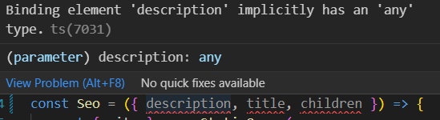
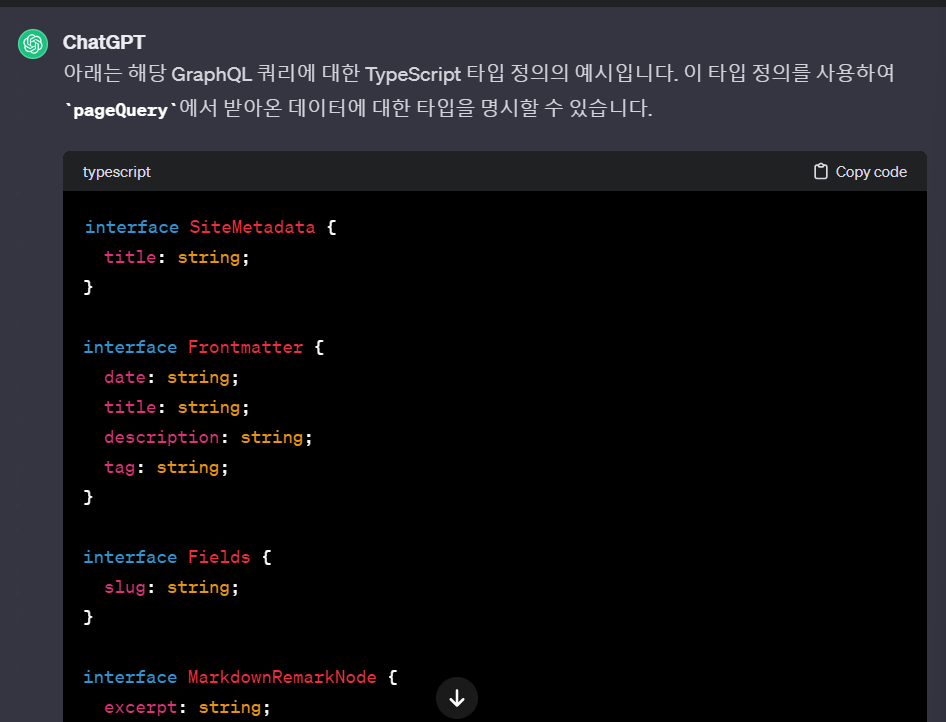

Gatsby는 리액트를 기반으로 하기 때문에,\
처음 시작하면 `index.js`등의 `.js`파일들이 각각\
Component를 `export`하는 것을 볼 수 있습니다. \
리액트 사용자라면 너무 익숙하죠?

이번 시간에는 이렇게 생겨먹은 **React Component** 스타일의 `.js`친구들을\
**타입스크립트**(`.ts` or `.tsx`)로 바꿔버리는...\
마이그레이션 작업을 좀 해보겠습니다\
그냥.. 얼마전에 **TypeScript** 이론을 공부했으니까.. 이걸 실제로 써보려고 그럽니다\
그리고 더 늦기 전에 갈아타야 좀 수월하지 않겠습니까?

들어가기에 앞서..\
[공홈](https://www.gatsbyjs.com/docs/how-to/custom-configuration/typescript/#gatsby-configts)도 참고했고\
매우 똥같은 번역이 있지만 꽤나 참고가 된 [링크](https://hackernoon.com/ko/javascript%EC%97%90%EC%84%9C-typescript%EB%A1%9C-%EB%B0%98%EC%9D%91-%ED%94%84%EB%A1%9C%EC%A0%9D%ED%8A%B8%EB%A5%BC-%EB%A7%88%EC%9D%B4%EA%B7%B8%EB%A0%88%EC%9D%B4%EC%85%98%ED%95%98%EB%8A%94-%EB%B0%A9%EB%B2%95)도 있습니다

# TypeScript Initialize

그.. 타입스크립트는 준비 하셨죠?\
그럼 이제 initialize 하겠습니다\
`npm init gatsby -ts`

그럼 이제 `tsconfig.json`파일이 생기는데요\
[gatsby-minimal-starter-ts](https://github.com/gatsbyjs/gatsby/blob/master/starters/gatsby-starter-minimal-ts/tsconfig.json)에서 내용을 긁어다 쓰셔도 무방하다고 공홈에서 그러네요\
저도 그냥 긁었습니다

그런 다음 일단 `gatsby-*.js`들을 `.ts`로 바꿔줍시다\
얘네들은 제 경험상으론 확장자만 바꿔주고 딱히 뭐 안해줘도 됩니다

# 이제 하나하나 수정해봅시다

이제 `src/component/` 또는.. `src/pages/` `src/templates/` 이런 곳에 있는 `.js`들을 `.ts`로 바꿀건데요\
확장자를 바꾸고나면 빨간줄이 좍좍 그어질텐데\
겁나지만 하나씩 좀 해봅시다..

해야 할 일들은 대충

- 혹시 컴포넌트를 _Functional Component_ 형태로 쓰셨다면 `import {FC} from "react"`를 써서 "이거 리액트 컴포넌트임"을 알려야하는 것 같습니다
- **_`props`에 type safety 집어넣기_**
- `useState`에 type 주기\
  (예 : `[data, setData] = useState() => [data, setData] = useState<typename>()`)
- 필요한 친구들은 타입스크립트버전(`@types/`)를 다시 설치해줘야 합니다\
  (예 : `import kebabCase from "lodash.kebabcase"` -> `npm i --save-dev @types/lodash.kebabcase`)
- 마지막에 `gatsby-node.js`에서 `createPages`의 `component`항목들을 `.js`->`.ts`로 바꾸는 것을 잊지 말도록 합시다

이 중에서 props에 type넣기를 한번 같이 보겠습니다

# props에 type safety 보장하기



확장자를 바꾸고 나면 가장 먼저 눈에 띄는 빨간줄은 이녀석입니다\
사실 이 마이그레이션 작업은 props에 type만 잘 넣어주면 됩니다\
만약 `const Component=({description, title}) => {}`같은 컴포넌트가 있다면\
저같은 경우는 `interface`를 이용하여

```typescript
interface ComponentProps {
  description: string
  title: string
}

const Component = ({ description, title }: ComponentProps) => {}
```

이런식으로 해줬습니다

근데 문제는 graphql 쿼리로 가져오는 `data`같은 props들은 이렇게 단순하게 끝나지 않는데요...\
이 쿼리들 데이터들의 객체관계를 하나하나 `interface`로 표현하고 또 `interface`로.. 아휴\
그냥 GPT한테 query문을 긁어서 가져갑시다..\
알아서 잘 해줍니다.\
아니면 나중에 안 사실인데\
공홈에 보니까 [GraphQL Typegen](https://www.gatsbyjs.com/docs/how-to/local-development/graphql-typegen)이라는게 존재합니다 쩝

아무튼 각 컴포넌트들마다 `export const pageQuery = graphql`로 시작하는 쿼리문들을 긁어다가 GPT한테 인터페이스를 만들어달라고 하면

잘 뱉어줍니다.

이제 이걸 가져다가 적당히 `interface ComponentProps {}`를 작성하고 타입을 명시해주면 되겠습니다.

근데 저같은 경우는 어떤 props는 상황에 따라 props를 넣을 수도 넣지 않을 수도 있는\
꽤나 양자역학적인 슈뢰딩거의 props문제가 있었습니다

이 경우 간단히... `:` 대신 `?:`를 씁시다.

```typescript
interface ComponentProps {
  Schrödinger?: cat
}
```

저처럼 바보같이 `Schrödinger: cat | undefined` 이런 트라이를 하지 말도록 합시다.\
그리고 처음 하시면 헷갈리실까봐 말씀드리는건데\
함수를 넘길 때는.. 만약 인자는 `number`타입이고 반환값은 없다면\
`function(param: number): void` 이런식입니다

# 해치웠나?

음.. 해치운 것 같습니다.\
막상 별거 없죠?\
인생이란게 그렇습니다.

이만 마칩니다
