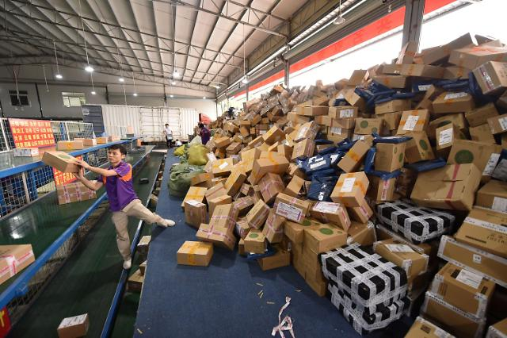
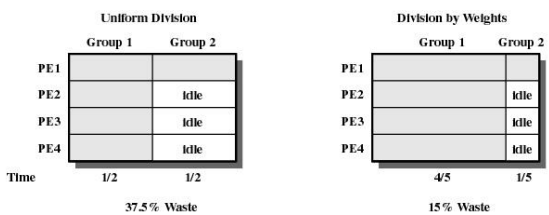
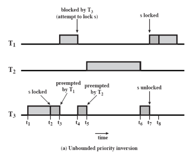

저번 시간에 Uniprocessor Scheduling에 대해 알아봤는데  
계산대가 하나일 때 어떻게 계산을 해야 잘 했다고 소문이 날까? 였습니다

이제 시대가 발전해서  
여러 프로세스(또는 쓰레드)가 하나의 메모리를 공유하는 **멀티 프로세서 시스템**이 매우 흔해졌습니다  
마치.. 하나의 카운터에서 점원이 계산해주던 맥도날드에  
키오스크가 등장하여 4개의 계산대가 생긴 것 처럼요

이렇게 멀티 프로세서 시스템이 되었다면  
기존에 프로세서 하나를 상정하고 만들었던 시스템을 그대로 갖다 쓸 수 없는데  
다음과 같은 **디자인 이슈**들이 생겼기 때문입니다

1. 각 프로세서들에게 **프로세스를 어떻게 할당**할까?
   - Global Queue : 각 프로세서들은 새로 실행할 프로세스(또는 쓰레드)를 Global Queue에서 알아서 꺼낸다.
   - 각 프로세서마다 개별적인 Ready Queue 사용 : 각 프로세서들은 본인들의 Ready Queue에 주어진 일만 한다.
2. 실행중이던 프로세스가 BLOCK되면, 스위칭(다른 프로세스로 갈아끼우기)할까? (= **멀티프로그래밍**을 적용해야 하나?)
   - 동기화가 자주 일어나지 않는 경우 : BLOCK되는 것은 보통 I/O작업일 것이니, 스위칭하는게 좋을 듯.
   - 동기화가 자주 일어나는 경우 : 다른 프로세스로부터의 message를 기다리느라 BLOCK되었을 가능성이 높다.. => 기다리는 프로세스가 옆에서 실제로 실행중이므로, 스위칭하지 않는 것이 좋을 듯..
3. 프로그램 **실행 순서**를 어떻게 할까?
   - 이전에 했던, FCFS, RR, ... 등등의 방법들 중 뭐 쓰는게 좋은가?

그런데 사실.. 가장 중요한 것 같이 보였던 1번과 3번 이슈는 사실 별거 아니었습니다

1번의 경우, Global Queue 방법은 여러 프로세서들이 동시에 집어가지 못하게 Critical Section으로 구현해야 한다는 점이 단점이 될 수 있겠지만  
그렇다고 개별 Ready Queue를 사용하면, 누구는 빨리 끝내고 놀고, 누구는 죽어라 일하는 **idle-while-busy** 문제가 발생합니다.  
마치 두 계산대 앞에 줄을 설 때, 각 계산대에 줄을 서느냐, 한 줄 서기를 하느냐, 인데  
두 계산대가 합심해서 빨리 계산을 끝내려면 한 줄 서기를 하는게 좋겠죠?  
그래서 **Global Queue**로 사용하자, 라는 결론이 났습니다

3번의 경우, 사실은 더이상 **순서가 중요하지 않게 됐습니다**  
계산대가 하나면, 전체 Response Time을 줄이기 위해서는 젤리 하나 사는 사람은 먼저 보내고  
계산이 오래 걸릴 사람은 비교적 나중에 계산해야 효과적이었는데  
이제 계산대가 여러 개 있으니 순서가 큰 의미가 없어졌다는 뜻입니다

그런데 이제 2번이 문제입니다  
멀티 프로세서 시스템이라고 해도, 그 프로세서 개수가 2개일 수도, 100개일 수도 있습니다  
또한 동기화를 매우 자주 수행할 수도, 또는 동기화를 아예 수행하지 않을 수도 있습니다  
이에 따라, 스위칭을 해야 할지, 말아야 할지가 명확하게 결론이 나지 못합니다..

아무튼 이러한 디자인 이슈들을 생각하며 이제 Thread Scheduling에 대해 알아봅시다

# Thread Scheduling

위에서도 언급한 바와 같이, **프로세서의 개수**와 **동기화 수준**에 따라 스케줄링 방법이 달리 적용되어야 하겠습니다

## Load Sharing

개별 스레드 단위로 줄을 세웁니다.  
그냥 일거리를 쌓아 두고, 알아서 가져다 작업하듯이요

- 모든 프로세서에 대해 부하가 분산됩니다.
- No idle-while-busy : 모두가 똑같이 일하게 됩니다.
- 중앙에서 관리하는 스케줄러는 필요 없이, 각 프로세서마다 알아서 Global Queue에서 일감을 가져가면 됩니다.
- Global Queue에는 (당연히도) Mutual Exclusion이 지켜져야 하고, 이에 따라 성능의 bottle-neck이 발생할 수 있습니다.
- 또한, 스레드들이 이 프로세서, 저 프로세서를 왔다갔다 하므로, 캐시를 효율적으로 사용하지 못할 수 있습니다.
- 간단한 방법이기도 하고, CPU가 몇 개 없는 시스템에서는 그나마 합리적인 방법이기에 자주 쓰입니다.

## Gang Scheduling

어플리케이션 단위로 줄을 서서, 어플리케이션 내 모든 스레드들이 동시에 함께 작업하도록 합니다.  
롤하면서 큐 돌릴 때, 친구들이랑 같이 할거면 5인큐로 한꺼번에 줄 서듯이 말입니다

- 어떤 어플리케이션 실행에 n개의 스레드가 필요하면, n개의 CPU를 할당해줍니다.
- 이제 어플리케이션의 모든 스레드를 다 같이 실행하고, time-out되면 다 같이 나갑니다.
- 같은 어플리케이션의 스레드들이 전부 같이 실행중이므로, 동기화로 인해 다른 스레드의 메시지를 기다리느라 block되어도 스위칭하지 않고 기다리면 됩니다.
- 어플리케이션 단위로는 Time Sharing으로 실행합니다. (= Round-Robin으로 번갈아 실행)
- 이러려면 어플리케이션의 스레드를 모두 한 번에 끼울 만큼의 프로세서를 가지고 있어야겠죠?

그런데, 어떤 그룹(어플리케이션)은 스레드를 한 10개 가지고 있고,  
어떤 그룹은 스레드를 단 한 개 가지고 있을 수 있습니다  
그런 경우, 만약 프로세서가 10개인 시스템이라면, 스레드가 9개 이하인 그룹이랑 스레드가 하나인 그룹이랑 같이 실행하면 안 될까요?

네.. 그렇게 실행하지는 않습니다. 대신, 남은 프로세서들이 노는 시간을 줄이기 위해,  
아래와 같이 "스레드의 수에 따른 가중치"를 두어 실행 시간에 차이를 두는 방법을 쓰는 방법이 있습니다.

쪽수로 협박하다니  
완전히 갱갱갱이네요. 스껄

## Dedicated Processor Assignment

Gang Scheduling에서 한 발 더 나아가서, 아예 어플리케이션 단위로 갈아 끼우지도 않습니다.  
계산대가 매우 많으면 줄을 어떻게 세우는지는 하등 상관없이, 그냥 손님들 오는 대로 계산을 해주면 되겠죠?

어플리케이션이 필요한 스레드만큼 고대~로 프로세서를 할당해줍니다.  
당연히 프로세서가 매우 많아야 하겠죠?  
돈이 최고야

## Dynamic Scheduling

사실은.. 어플리케이션들이 얼마나 스레드를 요구할지 알기가 어렵습니다.  
100개정도면 나 프로세서 부자겠지?! 싶어서 Gang Scheduling을 하기로 해도,  
120개 스레드를 필요로 하는 어플리케이션이 나타날 수도 있고요
그러니.. 가능한 한 스케줄링을 해주기로 합니다.

만약 어떤 어플리케이션이 CPU를 10개 필요로 하면..

- CPU 10개 이상 남아있으면? 그냥 주자.
- CPU 2개밖에 없으면? 2개 주자.
- 남은 CPU가 없으면? 프로세서 많이 쓰고 있는 애들한테서 뺏어오자.

대충 이런 식이라고 생각하면 되겠습니다

# Real-Time Scheduling

평화로운 음식점에 ~~개진상~~ 예민한 사람이 들어와서는  
5분 안에 음식 주세요 빨리요!! 라고 하고
그러고는 5분 01초만 지나도 음식 안 먹고 냅다 뛰쳐나가는.. 그런 사람이 있다고 칩시다

컴퓨터의 Task 중에는 이렇게 **Deadline**이 정해져 있고 이걸 지켜야 하는 경우가 있는데  
이를 **Real-Time Task**라고 합니다.  
이 Real-Time Task는 경중에 따라

- Hard Real-Time Task : 아아공습경보공습경보진짜진짜무조건지켜야하고이거안지키면시스템에치명적이고진짜큰일나고무조건데드라인을지켜줘야만하며안그러면큰일납니다꼭지켜야하는리얼타임태스크가따로없습니다
- Soft Real-Time Task : 데드라인 못 지켜도 뭐.. 어쩔 수 없긴 하죠.. 그렇다고 데드라인 넘겨서 task를 완료하는건 무효입니다?

또한 어떤 Real-Time Task는 주기가 있어서(periodic task), 미리 주기와 데드라인, 실행 시간 등예고되어 있으므로 마감을 맞추기 용이한 반면  
어떤 Real-Time Task는 주기도 없이 그냥 갑자기 불쑥 나타나서(aperiodic task), 갑작스러운 이벤트라 마감을 맞춰주기가 까다로운 경우도 있습니다

이런 친구들이 있으니 가급적이면 많은 Real-Time Task들의 Deadline을 맞출 수 있게 노력을 해야겠습니다

## Earliest-deadline Scheduling

가장 생각하기 쉬운 것은, 데드라인이 가장 임박한 task들부터 처리하는 것입니다

- preemptive : 데드라인을 우선순위로 두고, 더 우선순위가 높은 Task가 등장하면 중단하여 해당 Task를 먼저 실행시킵니다.
- 데드라인을 놓치는 상황이 물론 발생할 수 있지만, 데드라인을 지키는 비율 자체는 가장 최적의 방법

그런데.. 데드라인만 중요한게 아니라, **Task의 중요도**또한 중요할 것 같은데요  
아까 살펴봤듯이 Hard Real-Time Task같은, 반드시 데드라인을 맞춰야 하는 Task가 있다면 먼저 좀 해주는게 좋을 것 같습니다

## Rate Monotonic Schduling

그럼 어떤 Task가 얼마나 중요한지 어떻게 알 수 있을까요?  
한 가지 합리적인 생각은 **주기가 짧은** Task들이 중요하다고 생각하는 방법입니다  
그래서 단골 Task들을 더 먼저 처리해주기로 합니다

- Preemptive : 더 단골(주기가 짧은)인 Task가 들어오면, 그 Task를 먼저 실행합니다
- 데드라인을 Earliest Deadline보다는 자주 놓치지만, 많은 시스템이 이 방식을 선호합니다

### Priority Inversion

어라 근데 이런 상황을 가정해봅시다

우선순위(주기가 짧은 순서)는 $T_1 > T_2 > T_3$ 순이고  
$T_1$과 $T_3$는 서로 자원 $s$를 가지고 경쟁하는 사이입니다  
위와 같은 상황은 $T_3$이 먼저 $s$를 가져갔으니(`s locked`), $T_1$은 $s$를 기다리며 block됩니다(`waiting s`)

그럼 이제 $T_1$은 $s$를 기다리며 block되어 있고, $T_3$는 $s$를 가진 채로 작업을 하다가, $T_2$가 들어옵니다  
$T_3$보다 $T_2$가 더 단골이니 $T_3$는 차례를 뺏깁니다(`preempted by T2`)  
$T_2$가 끝나서야 $T_3$가 차례를 얻었고, 좀 더 작업한 후 $s$를 놓은 뒤(`s unlocked`)에야 $T_1$이 실행하게 되었습니다

뭔가 이상합니다.. $T_1$은 분명 $T_2$보다 우선순위가 높은데, $T_2$의 작업이 끝나기를 $T_3$가 기다려야 하는 상황이 벌어졌습니다  
게다가 이번 경우는 운이 좋았지만, $T_1$의 우선순위가 매우 높아도 영영 차례를 다시는 찾지 못하는 상황이 생길 수 있습니다  
이렇게 *우선순위가 역전되는 상황*을 **Priority Inversion**이라고 칭합니다

$T_2$는 $T_1$보다 우선순위가 낮음에도 불구하고,  
"$T_3$보다 내가 단골이니 나 먼저 해줘."를 시전해버리는 것입니다  
사실 $T_3$과 $T_1$은 한 일행인데 말이죠..

**Priority Inheritence**, 즉 우선순위를 상속하여 이를 해결할 수 있습니다  
자신보다 우선순위가 낮은 task에 의해 block(동기화 등..)되는 경우, 자신의 우선순위를 넘겨주는 것인데요  
위와 같은 상황에서도, $T_1$와 $T_3$는 한 일행이고, $T_1$는 최고 단골이니, 이 일행을 $T_2$보다 먼저 처리해줘야 문제가 없겠습니다

# 각 시스템들의 스케줄링 방법

이제 진짜 실전에서 실제 시스템들은 어떻게 스케줄링을 하고 있는지 보고싶은데요  
Windows, UNIX SVR4, LINUX 순으로 알아봅시다

이 시스템들의 공통적인 특징으로는

- 우선순위 기반의 Preemptive Scheduling : 실행중이던 Task보다 우선순위가 높은 Task가 등장하면, 즉 시 중 단
- feedback 기반의 Multi-Level Priority Queue를 사용합니다
- Real-Time Task들은 고정된 우선순위를 가집니다

이런 것들이 있는데  
더 자세히 알아봅시다

## Windows 시스템

Multi-Level Priority Queue 구성 : 총 32개 큐 사용

- Real-Time PQ : 16 Level
  - Real-Time Task들은 우선순위가 고정되며, 같은 레벨의 큐 내에서는 Round-Robin 방식으로 스케줄링
  - 그런데 같은 레벨의 큐에 나밖에 없다면, 내가 계속 실행
- Variable PQ : 16 Level
  - feedback queue : time-out마다 우선순위가 하락
  - 내 이상의 우선순위를 가지는 친구가 없어도, time-out이 적용됨.. (내 우선순위가 하락할 수 있으므로)
  - Processor-bound threads down : time-out마다 우선순위 하락 (최대 -2)
  - I/O-bound threads up : I/O 등으로 Block Queue에 다녀온 경우, CPU를 중간에 포기했을 수 있으므로, 우선순위 상승. (최대 +15)

Variable PQ의 우선순위 구성 : 일단 Variable PQ는 0~15 레벨에 존재하므로 이를 넘을 수는 없다는 점을 기억합시다

- Process Priority : 프로세스가 하는 일의 종류에 따라 결정되는 _base_ 값.
- Thread's Base Priority : $\pm2$ 내에서 조정되는, Thread의 *base*값
- Thread's Dynamic Priority : _base_ - 2 $\leq$ $p$ $\leq$ _base + 15_
  - 즉, 어떤 스레드든 15레벨까지는 도달할 수 있으나, 하락은 2단계로 제한적이다

프로세서들은 이 Multi-Level PQ로부터 언제나 우선 순위가 가장 높은 스레드를 새로 할당받게 되는데,

- 이는 Load Sharing처럼 작동하는 셈이므로, idle-while-busy는 발생하지 않습니다
- 그런데 Load Sharing에서 캐싱을 잘 활용하지 못할 수도 있지 않았나요?
  - soft **affinity** : (가능한 선에서) 스레드가 전에 실행했던 프로세서에서 실행할 수 있도록 고려합니다.

## UNIX SVR4 시스템

여기는 무려 큐가 160개나 됩니다 :

- Real-Time PQ : 상위 60개 큐 (159~100번)
- Kernel-mode process : 그 다음 40개 큐 (99~60번)
- Time-shared : 나머지 60개 큐 (59~0번)

이렇게 큐가 많으면, 우선순위가 가장 높은 친구를 찾으려고 이걸 다 순회하기 힘들겠죠?  
따라서 비트맵을 사용하여, $i$번째 비트에는 "$i$번째 큐에 프로세스가 있는지" 여부를 나타냅니다.

윈도우 시스템에서처럼, Time-Shared에 해당하는 Feedback Queue에서는 다음과 같이 우선순위를 조정합니다 :

- Processor-bound threads down
- I/O bound threads up

그런데 여기서 조금 다른 점은, **starvation을 줄이고자** 좀 더 노력한다는 점인데요  
Time Shared Process의 _time quantum_ $q$는, 우선순위가 높으면 짧게, 낮으면 길게 줍니다.
전에 살펴봤던 $q=2^i$로 하듯이요

## LINUX 시스템

LINUX 시스템은 큐의 레벨이 0번에 가까울수록 높은 우선순위를 가집니다.  
140개의 큐를 사용하는데, 다음과 같이 클래스가 나뉩니다 :

- `SCHED_FIFO` : Real-Time Task 중, 실행 시간이 짧은 경우, time-out없이 FIFO 방식으로 처리합니다. (0~99번 큐)
- `SCHED_RR` : Real-Time Task 중, 실행 시간이 길면.. Round-Robin으로 처리합니다. (0~99번 큐)
- `SCHED_OTHER` : Non-Real-Time 스레드들. (100~139번 큐)

FIFO 스레드가 실행 중일 때는, 아래와 같은 경우에만 중단됩니다 :

- 더 높은 우선순위의 FIFO 스레드 등장
- 실행중인 FIFO 스레드가 Block Queue로 이동
- 실행중인 FIFO 스레드가 systemcall로 차례를 포기

RR 스레드는 위와 같은 경우에 더해서, (같은 우선순위끼리 RR 방법으로 번갈아 실행)까지 포함되겠죠?

이 시스템에서도 큐가 140개로 되게 많아서 비트맵을 사용하고,
140개의 active-queue에 더해 140개의 expired-queue 또한 존재합니다

- time-out되면 : 우선순위를 조정(하락)하고, expired queue로 이동
- 실행 중에 우선순위가 더 높은 스레드 등장 : 우선순위는 그대로, active queue로 복귀
- 이렇게 하면, 어느 순간 active queue가 비어 있는 순간이 오는데, 그 때 active queue와 expired queue를 뒤집어 expired queue를 active로 만듭니다.

뭐가 좋은걸까요 이렇게하면?  
**CPU를 사용하고 나면 우선순위를 확 낮추는 효과**가 있는 셈입니다
우선순위가 매우 높은 스레드 하나(A), 그리고 밑바닥인 스레드 하나(B)가 있다고 생각해보면  
A를 실행한 뒤에 expired queue로 보내지 않는 경우, B가 실행을 하게 되려면 A가 그 많은 우선순위 큐들을 다 지나와야 합니다  
그런데 이 시스템처럼, A가 time-out되어 expired queue로 이동하고 나면, 그 다음에는 B가 실행을 가져갈 수 있으므로 B의 **starvation 발생 가능성이 줄어드는 효과**를 볼 수 있습니다  
살펴본 3가지 시스템들 중, starvation 가능성을 낮추기 위해 가장 많은 노력을 기울였네요

---

\
이렇게 스케줄링에 대해 좀 써봤습니다  
제 일정 스케줄링도 잘 못하는 사람인데 나 원 참

마치겠습니다
