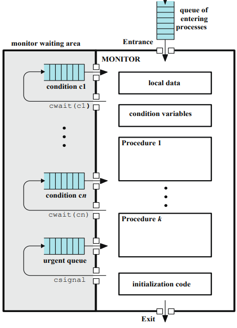

Software 로직으로 이리 보고  
Hardware Instruction으로 저리 봐도  
`while`로 가짜로 대기하는 **Busy-Waiting**이슈를 피할 수는 없었고  
이외에도 다른 이슈가 생기기 마련이었습니다  
그럼 어떡하면 좋죠..?


사실 프로세스 다루는 일은 OS가 전문입니다  
그런 OS가 미리 만들어두고 제공하는, Mutual Exclusion을 위한 툴이 있는데  
**Semaphore**와 **Monitor**입니다

바로 알아봅시다

# Semaphore

**Semaphore**는 하나의 구조체 변수로, 정수 변수 하나와 큐를 가집니다.  
또한 이 semaphore는 세 가지의 *atomic*한 operation을 가지는데,

- Semaphore 정수 변수를 초기화 (주의 : 음수로 초기화 X)
- `SemWait` : 정수 변수의 값을 하나 빼고, 결과가 0보다 작으면 현재 프로세스(값을 하나 뺀 프로세스)를 block시킨다 => 큐로 이동
- `SemSignal` : 정수 변수의 값을 하나 더하고, 결과가 0보다 작거나 같으면 큐에서 (블락되었던) 프로세스를 하나 꺼내준다.

Semaphore의 구조와 operation을 코드처럼 나타내보면 다음과 같습니다.

```c
struct semaphore {
	int count;
	queueType queue;
};
void semWait(semahore s) {
	s.count--; // 하나 빼고,
	if(s.count < 0) { //뺀 결과가 0보다 작으면,
		/* place this process in s.queue */ //큐에 넣고
		/* block this process */ //블락
	}
}
void semSignal(semaphore s) {
	s.count++; //하나 더하고,
	if (s.count <= 0) { //결과가 0보다 작거나 같으면,
		/* remove a process P from s.queue */ //큐에서 아무거나 하나 제거하고
		/* place process P on ready list */ //레디 큐로 보낸다 (실행하라고 보냄)
	}
}
```

- `semWait`을 실행하면, `s.count`값에 따라 _블락되어 `s.queue`로 들어갈 수도, 넘어갈 수도_ 있습니다.
- `semSignal`을 실행하면, `s.count`값에 따라 _`s.queue`에서 프로세스를 하나 꺼내 실행가능하게_ 할 수 있습니다.

그럼, `s.count`값을 2으로 초기화한 경우 `semWait`과 `semSignal`에 따라 어떻게 되는지 생각해봅시다

- `s.count==2`이고, `semWait`: `s.count--` 이후 값이 1이므로 블락되지 않음
- `s.count==1`이고, `semWait`: `s.count--` 이후 값이 0이므로 블락되지 않음
- `s.count==0`이고, `semSignal`: `s.count++` 이후 값이 1이므로, 큐에서 프로세스를 꺼내지 않음(사실은, 큐에 프로세스가 하나도 없음)
- `s.count==1`이고, `semWait`: 위에서와 동일하게, 블락되지 않음
- `s.count==0`이고, `semWait`: `s.count--` 이후 값이 -1이므로, <u>해당 프로세스는 블락되어 큐에 들어감</u>
  - `s.queue`에는 프로세스가 1개
- `s.count==-1`이고, `semWait`: `s.count--` 이후 값이 -2이므로, 해당 프로세스는 블락되어 큐에 들어감
  - `s.queue`에는 프로세스가 2개
- `s.count==-2`이고, `semSignal`: `s.count++` 이후 값이 -1이므로, <u>큐에서 프로세스를 하나 해방</u>
  - `s.queue`에는 프로세스가 1개
- `s.count==-1`이고, `semSignal`: `s.count++` 이후 값이 0이므로, 큐에서 프로세스를 하나 해방
  - `s.queue`에는 프로세스가 0개
- `s.count==0`이고, `semSignal`: `s.count++` 이후 값이 1이므로, 큐에서 프로세스를 꺼내지 않음(사실은, 큐에 프로세스가 하나도 없음)

구구절절 썼는데요.. 규칙이 보이시나요?


결국 semaphore의 값, 즉  
`s.count`의 값은 음수냐 양수냐에 따라서

- `s.count <= 0` : |`s.count`값| == **블락되어 큐에 들어가 있는 프로세스 개수**
- `s.count >= 0` : `s.count`값 == **블락되지 않고 지나갈 수 있는 프로세스 개수**

라는 결론에 도달합니다.  
그리고 앞에서 처음 semaphore에 대해 이야기할 때,  
semaphore는 음수로 초기화하면 안 된다고 잠깐 써뒀는데,  
그 이유가 여기서부터 비롯됩니다  
내 맘대로 초기값을 `-5`로 두고 `semSignal`을 호출하면 `blocked queue`에 보낸 것이 없는데 꺼내려고 하겠죠?  
양치기소년이 될 수 있으니 주의합시다

그럼 이제, Semaphore로 C.S에 한 번에 한 프로세스만 진입하도록  
Mutual Exclusion을 보장하려면..

```c
semaphore s = 1;
...
semWait(s);
/* Critical Section */;
semSignal(s);
...
```

이렇게, semaphore 값을 1로 초기화하여 단 하나의 프로세스만 `semWait`를 통과할 수 있도록 하고,  
C.S에 들어가기 전에 `semWait`를 실행하여 semaphore 값이 1이었다면 진입, 0 이하였다면 대기하도록 하며,  
C.S를 나오면 `semSignal`로 대기하던 프로세스를 하나 깨워줍니다.

매우 간단해졌죠??  
마치 C.S에 혼자 들어가기 위해  
C.S 전에는 문을 걸어잠그고  
C.S를 빠져나올 때는 열쇠를 두고 가는 셈입니다

## Binary Semaphore

위에서 이야기한 semaphore는 굳이 따지면 *Counting Semaphore*이고,  
*Binary Semaphore*도 있는데요  
이 경우 정수 변수인 `int count` 대신 `enum {zero, one} value;`와 같은 ON/OFF값을 가집니다


```c
struct binary_semaphore {
	enum {zero, one} value;
	queueType queue;
}
void semWaitB(binary_semaphore s) {
	if (s.value == one)
		s.value = zero; //1인 경우에만 0으로 바꾼다 (통과)
	else { //0인 경우, 이 프로세스를 블락.
		/* place this process in s.queue */
		/* block this process */
	}
}
void semSignalB(binary_semaphore s) {
	if (s.queue is empty()) //큐가 비었는지 확인하고,
		s.value = one; //큐가 비어있으면 1로 돌린다
	else { //큐에 프로세스가 남아있다면 레디 큐로 하나 풀어준다
		/* remove a process P from s.queue */
		/* place process P on ready list */
	}
}
```

이 경우 큐에 프로세스가 얼마나 있다거나, 몇 개나 통과할 수 있다거나, 이런 것은 알 수없지만  
`count`변수를 따로 유지하거나 할 수도 있긴 합니다  
그리고 [geeksforgeeks](https://www.geeksforgeeks.org/mutex-vs-semaphore/)에 따르면  
전에 썼던 [C++에서 멀티스레딩 써보는 포스팅](https://sungpaks.github.io/multi-threading-in-cpp/)에서 사용했던 **Mutex**가 이러한 Binary Semaphore의 일종이라는 것 같습니다.  
딱 하나만 지나갈 수 있게 허락하는 Semaphore로 상호배제를 구현하는 셈.

확실히 좋아진 것 같긴한데, 아직도 Semaphore로는 부족한게  
아직도 자꾸 몽총한 제가 관리하라고 떠넘기죠?  
`count` 값도 그렇고.. 알아서 잠그고 들어가서 열쇠 놓고 가라고 하고..  
이러다 제가 실수로 열쇠 두고 가는 것을 깜빡하면 어쩌죠?  
변기칸을 잠그고 도망가버리는 어글리 코리안이 되기 십상입니다

그래서 나온게

# Monitors

**Monitor**는 Program-Language Construct, 즉 동기화를 위한 어떤 라이브러리 함수나 패키지같은 것이라고 보면 되는데  
구조는 일단 아래와 같이 생겨먹습니다



자세히는 이어 설명하겠지만  
해당 그림에서 _MONITOR_ 영역, 즉 하얀 색 영역은 그 자체로 Critical Section으로,  
사실상 하나의 *성역*같은 것이라  
그 안에는 단 하나의 프로세스만 들어갈 수 있고  
그 안에 있는 지역 변수는 그 안에서만 접근 가능하며  
미리 정의된 Procedure(≈ function)로만 그 지역 변수를 읽고 쓸 수 있습니다

좀 더 친숙하게는  
🚽 화장실 변기칸 같아서  
🚶 그 안에 사람은 한 명만 들어가서 문을 걸어잠그고  
🧻 그 안에 있는 휴지는 그 안에 들어간 사람만 쓸 수 있고  
💩 그 안에서 할 수 있는 일은..  
;;


아무튼 예.. 그렇습니다  
아예 Scope를 분리해서 C.S로 만들어버리고, 접근은 정해진 함수로만 하는 의존성 역전 like한 발상  
좋은데요

그래서 Monitor는 아래와 같은 구성요소들을 포함하는데

- 한 개 이상의 **procedure** (≈ functino)
- 모니터만의 **지역 변수**
- **Condition 변수**
- **초기화**를 위한 코드

이 **Condition 변수**는 Semaphore와 되게 비슷한 친구인데  
얘도 큐를 가지고 있고, `cwait(c), csignal(c)` 함수를 가집니다  
Semaphore랑 다른 점은 Condition 변수는 **값이 없다**라는 점인데  
따라서 `cwait`은 값이고 뭐고 블락시켜 큐에 집어넣고,  
`csignal`은 값이고 뭐고 해당하는 큐에서 하나 꺼내옵니다

그리고 아까 Monitor 구조 그림에서 좌측 하단에 `urgent queue`라는게 있는데  
요거는 이제 어떤 procedure에서 중간에 `csignal(c)`가 실행되면 프로세스를 깨우게 되니까  
Monitor 내에는 단 하나의 프로세스만 존재한다는 철칙을 지키기 위해  
깨어난 프로세스를 위한 자리를 내주고 `csignal(c)`를 실행한 프로세스는 여기에서 잠시 숨는 곳입니다

[](https://entertain.daum.net/tv/948839/video/392827640)

---

이제 이 OS에서 제공하는 Semaphore나 Monitor라는 툴을 써서  
다른 새로운 문제들을 기깔나게 해결하는 방법을 알아보려고 하는데


이쯤되면 그거까지 고봉밥으로 담기에는 양이 많아지는 것 같으니  
다음 포스팅에 쓰겠습니다?

이만 마칩니다
