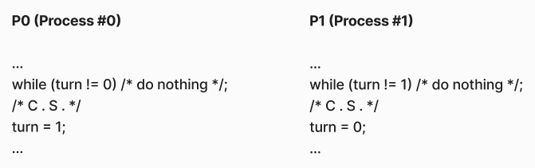
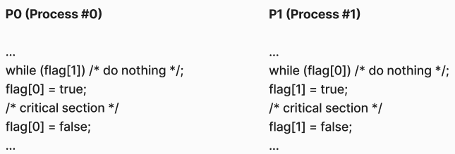
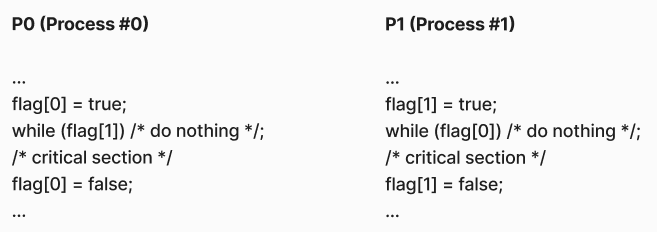
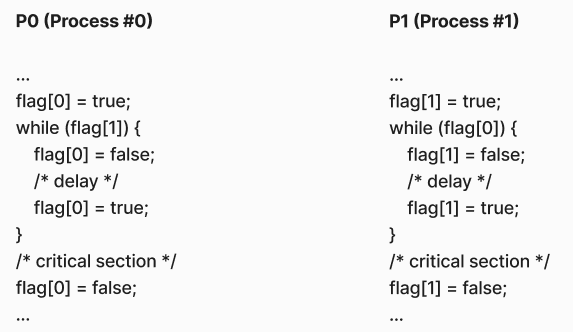
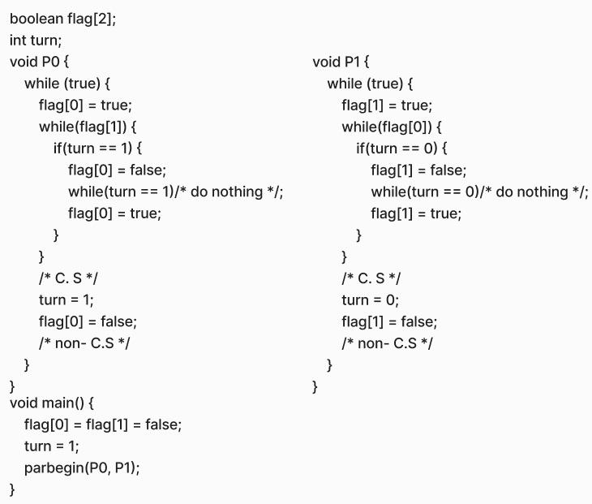
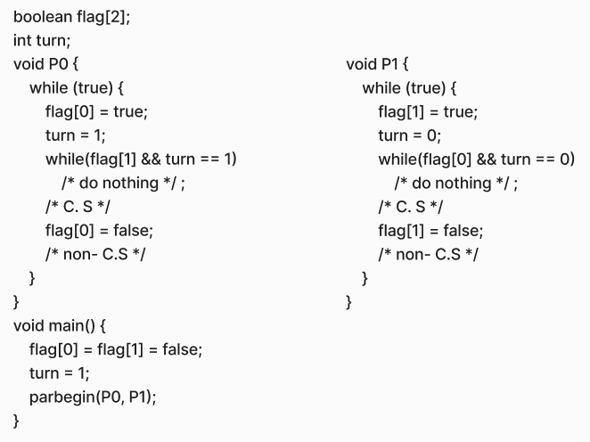

옛날에는 프로그램이 오도기합짜세해병이라서\
악! 한번 시작한 프로그램은 영원한 프로그램! 이었으므로 이게 끝나기 전에는 다른 무언가를 할 수 없었습니다

이후로 어쩌구 저쩌구.. 역사를 거쳐서\
프로그램을 중단시켰다가 다시 실행시키는 방법이 나왔습니다\
덕분에 프로그램을 **번갈아** 실행할 수 있게 된건데\
말이 번갈아서 실행하는거지 매우 빠르게 갈아끼우면 사람으로서는 동시에 실행된다고 느끼게 됩니다\
마치 이미지를 주르륵 갈아끼우면 동영상이 되듯이요\
이렇듯 여러 개의 프로그램들을 프로세스라는 단위로 나눈 다음, 줄 세워서 실행하게 되었습니다..

게다가 이것으로도 모자라서, CPU를 여러 개 둠으로써 프로세스를 **진짜 동시에**실행할 수 있게 되었습니다\
그리고 프로세스 안에 일꾼(=스레드)을 여럿 두기도 하게 되었고..\
아무튼 거두절미하고, 이런 이야기는 나중에 또 쓰기로 하고

그렇게 일을 동시에들 하니까 또 문제가 생깁니다

# 동시성 문제

무슨 문제가 발생하나 봅시다\
잔고 0원인 제 통장에 A가 만원, B가 5만원을 입금하려고 하는데\
제 잔고를 확인 --> 잔고 + 만원.\
이렇게 하는 과정을 동시에 한다고 치면..

A | 잔고 확인 : 잔고 = 0<div style="text-align: right">잔고 확인 : 잔고 = 0 | B</div>

A | 잔고 = 잔고(=0) + 10,000 ==> 잔고 = 10,000<div style="text-align: right">잔고 = 잔고(=0) + 50,000 ==> 잔고 = 50,000 | B</div>

결과적으로 잔고가 50,000이 되었습니다?? ~~뭐야 돌려줘요~~\
게다가 이건 매우 운이 좋은 케이스인데,\
위와 반대로 B의 순서가 A보다 앞섰다면 만원과 오만원을 넣었는데 잔고가 만원이 되어버릴 수도 있습니다..

이렇게 어떤 공유 데이터를 둘 이상의 프로세스가 읽고 쓰는 작업을 하는데,\
그 순서에 따라 결과가 달라지는 경우를 **Race Condition**이라고 하고, \
이게 발생하는 부분을 **Critical Section**(이하 C.S)이라고 부릅니다.

흠.. 어떻게 해결할까요?\
A와 B가 (잔고 읽고, 잔고=잔고+금액)을 한 번에 한 명씩만 하면 되겠죠?\
이렇게 한 번에 한 놈만 Critical Section에 들어오라고 하는 것을 **_Mutual Exclusion_**(상호 배제)이라고 합니다.

이 상호 배제는

- 소프트웨어로 구현하거나,
- 따로 하드웨어 수준의 instruction으로 구현해버리거나,
- OS의 동기화 툴을 이용하거나,

이렇게 크게 세 가지 방법이 있습니다

지금 알아볼 것은 소프트웨어 알고리즘을 잘 작성해서 적당히 Mutual Exclusion을 구현하는 방법인데요\
단순한 발상부터 시작해서 총 6개 방법을 알아봅니다

# 1. 공유 변수 `turn` 사용



마치 카드게임을 하듯이 턴을 정하는 방법입니다.

- 공유 변수인 `turn`을 두고, `turn`값이 0이면 P0가, 1이면 P1가 C.S로 진입합니다.
- `turn`이 상대 차례이면 기다립니다.
- C.S를 빠져나오면, `turn`을 넘깁니다.


이 경우 *Mutual Exclusion*은 지켜집니다만..\
C.S를 나와서 `turn`을 상대편으로 넘겨주기 전에 CPU 실행권을 뺏겨버리곤 영영 돌아오지 못한다면?\
다른 프로세스는 C.S에 진입한다는 현실에 도달하지 못합니다..

게다가 이게 진짜 공평한 턴제라서, C.S로의 진입은 무조건 같은 횟수만큼 _번갈아서_ 진입할 수 있습니다.\
문제는 C.S로의 진입을 P0는 10번만 하고 싶을 수도 있고, 반면 P1는 100번 들어가고 싶을 수도 있습니다..\
이 **무조건 번갈아서 들어갈 수 있다**라는 것은 매우 큰 단점이 되기 때문에, 다음 방법이 등장합니다

# 2. 공유 변수 `flag[2]` 사용 (1) : 나 들어왔어



턴제가 아닌, 공유 변수 `flag[]`를 사용하여 *C.S에 진입헀는지 여부*를 표현합니다.

- `flag[1] == true`이면 P1이 C.S에 진입했다는 의미이므로 P0는 기다림.
- `flag[1] == false`라서 P0가 C.S에 들어가도 괜찮은 경우, `flag[0] = true`로 "나 C.S 들어간다"를 표현


이러면 상대편이 C.S에 관심이 없다면(`flag == false`), 내가 원할 때마다 계속 C.S에 진입할 수 있습니다.\
이전처럼 꼭 진입의 균형을 수호하지 않아도 됩니다 !

그런데 *Mutual Exclusion*을 보장하지 못합니다??\
양 옆의 코드 한 줄 한 줄마다 계속 차례가 넘어간다고 생각해봅시다..

- P0가 `flag[1] == false`임을 확인하고 `while`을 탈출
- P1가 `flag[0] == false`임을 확인하고 `while을 탈출
- P0는 `flag[0] = true`로 올리고, C.S 진입
- P1도 `flag[1] = true`로 올리고, C.S 진입

C.S에 동시에 진입할 수 있게 되어버립니다..\
근데 여기서 `flag[] = true`로 켜는 명령줄 위치를 바꿔주면 떔빵이 가능합니다.\
그게 바로

# 3. 공유 변수 `flag[2]` 사용 (2) : 나 들어갈거야



`while`직전에 먼저 `flag`값을 `true`로 올리도록 순서를 살짝 바꾸어서\
이제 `flag[1]`과 `flag[0]`을 마치 *C.S에 들어가기 위한 의사 표현*으로 사용하게 됩니다

- 먼저 `flag[0] = true`로 놓고 `while`로 기다리다가,
- `flag[1] == false`이면 C.S로 진입

이러면 일단 P0가 `flag[0] = true`를 켜고 나면, P1은 P0가 C.S를 빠져나오기 전까지 그 어디서도 `flag[0] == false`임을 확인할 수 없으며,\
P1이 P0의 `flag[0] = true`직전에 CPU 사용권을 잡아채서 한 줄이라도 실행했다면, P0가 C.S에 진입하는 것이 성립하지 않습니다

이로써 *Mutual Exclusion*을 보장할 수 있게 되었는데, 새로운 문제가 발생합니다 :

- P0가 `flag[0]=true`, CPU 사용권 뺏김
- P1가 `flag[1]=true`, `flag[0]==true`인 것을 보고 기다림
- P0는 `flag[1]==true`인 것을 보고 기다림

이렇게 서로가 서로의 `flag==true`를 확인하고 무작정 기다립니다.\
한 치의 양보 없이 그저 상대편이 `flag=false` 해주기를 기다릴 뿐입니다..\
이렇게 서로 버티는 상황을 **Deadlock**이라고 합니다


그럼 서로 좀 양보하고 그러면 어떨까요?

# 4. 공유 변수 `flag[2] 사용 (3) : 양보



말 그대로 아까 코드에서 양보룰을 추가했습니다.
이제 아래와 같은 동작을 반복합니다 :

- P0가 C.S에 진입하려는데 `flag[1] == true`인 경우, `while`로 진입하되
- `while`내에서 `flag[0]=false`로 양보하고 잠깐 기다림(delay).
- 잠깐 기다린 후 다시 `flag[0]=true`로 놓고, `flag[1]을 재차 확인

이전과 동일하게 *Mutual Exclusion*은 보장되며, 양보로 인해 **Deadlock**은 발생하지 않게 되었습니다.\
그러나 과유불급이라고 했나요.. 무작정 양보하기 때문에 또 새로운 문제인 **Livelock**이 발생해버립니다\
둘 다 `while`에서 서로의 의사를 확인하고 `while`문 내부로 진입한 경우,

- P0가 양보 (`flag[0]=false`), 기다리다가 CPU 사용권 뺏김
- P1가 양보 (`flag[1]=false`), 기다리다가 CPU 사용권 뺏김
- P0가 다시 `flag[0] = true` 하자마자 CPU 사용권 뺏김
- P1이 다시 `flag[1] = true`


[출처](https://www.melon.com/album/music.htm?albumId=10100122)

이런 과정을 반복해버리면 서로가 서로를 양보하다가 Livelock 사태가 벌어지고 맙니다..\
이 경우 딜레이를 줄이거나 아예 없애도 Livelock 문제를 완전히 해결할 수가 없습니다

장난 그만 하고 진짜 문제없는 알고리즘을 살펴보도록 합시다\
앞으로 두 개의 실명제 알고리즘이 나오는데\
'이름이 붙었다는 것은 강하다는 것'\
과 같습니다

# 5. Dekker's Algorithm



각자의 의사 표현인 `flag[2]`만으로는 문제를 해결할 수 없어서, `turn`까지 도입합니다\
P0과 P1 함수에서 막 `while(true)`로 C.S와 non-C.S를 무한반복하는 것 처럼 보이는데,\
그냥 프로그램은 C.S와 non-C.S의 반복적으로 나온다는 것을 간단히 보이기 위한 장치니까 신경쓰지 않아도 됩니다\
아무튼 중요한건 이전의 알고리즘에서 `if(turn==1)`와 `while (turn ==1)`이 추가되었다는 점입니다

- P0는 `flag[1]==true`이면 `turn`을 확인합니다
- P0가 보니까 `turn == 1`인 경우,
  - 내 차례가 아니니까 `flag[0]=false`로 양보하고 기다립니다.
  - `turn==0`이 되면 이제 그만 기다리고, `flag[0]=true`로 다시 올립니다.
- P0가 보니까 `turn == 0`인 경우,
  - 내 차례니까 상대편이 `flag[1]=false`로 양보하기를 기다립니다.
  - `flag[1] == false`가 되면 C.S로 진입하고, 끝나면 `turn`을 넘기고 `flag[0]`을 내립니다.

이렇게, 현재 *내 턴이면 버티고 내 턴이 아니면 양보*하도록 하여 Deadlock과 Livelock 문제를 모두 해결합니다.


또한 이전에 발생했던, 강제로 턴을 기다리는 상황 또는 *Mutual Exclusion*이 보장되지 않는 상황 또한 일어나지 않습니다.

아 근데 좀.. 길지 않나요?\
더 짧게도 가능한 방법이 있습니다

# 6. Peterson's Algorithm



데커 알고리즘에서는 `turn`을 C.S가 끝나고서야 반납했으나,\
피터슨 알고리즘에서는 `turn`을 초장에 양보합니다.\
이 차이로 인해 전체 코드의 길이가 반으로 줄어버립니다!!\
software-approach라는 말은 매번 이 코드를 직접 작성해야 한다는 뜻이라서, 짧고 단순할 수록 당연히 장점이 됩니다.

아무튼 이 알고리즘은

- P0가 C.S에 들어가려면, `flag[0]=true`로 의사표현을 하되, `turn=1`로 턴을 일단 양보합니다.
- `while`에서 기다리지 않고 넘어갈 조건은
  - P1가 C.S에 들어가려 하지 않는 경우 (`flag[1]==false`)
  - P1가 C.S에 들어가고자 하는데(`flag[1]==true`), `turn`이 내 차례일 경우
- 둘 다 아니면 어쩔 수 없이 .. 기다립니다.

재미있는 점은, 양쪽 다 `flag`를 켠 경우 `turn`에 의해 정해지되,\
이 `turn`은 먼저 양보한 쪽이 먼저 C.S에 진입하게 된다는 점입니다. \
이러한 특성으로 인해 *Mutual Exclusion*을 보장 + deadlock과 livelock을 방지하게 됩니다

---

# Software Approach의 단점

근데 지금까지 살펴본 방법에서, 공통적으로 등장하는 문제가 있습니다\
바로 `while`로 기다린다는 것인데요\
`while`을 계속 도는건 사실 CPU 사용권을 받고도 쓰지 않는 것이기 때문에,\
CPU 사용권을 낭비하는 셈이 됩니다.\
또 머냐.. 자바 수업해주신 교수님이\
CPU는 `while`이 중요한 줄 알고 최선을 다해서 실행한다는 언급을 하신게 기억이 나네요

아무튼 이렇게 *열심히 기다리는 문제*를 **Busy Waiting**이라고 합니다\
이건 어쩔 수가 없습니다.. OS의 도움이 없으면 이렇게 가짜로 기다리는 것 외에 방법이 없습니다 ㅜㅜ

그리고 지금까지는 프로세스(또는 스레드)가 딱 둘인 경우를 살펴봤는데\
실제로는 더 많을 수 있고, 그렇게 되면 소프트웨어적인 방법으로는 굉장히 복잡해집니다..

또한 이런 코드들을 직접 작성해야 하므로 아무리 짧아도 어쩔 수 없이 복잡해집니다

뭐 그런 등등의 문제가 있습니다

# 그럼 우짭니까?

hardware instruction을 따로 만들어서 매우 단순하게 한 줄로 해결할 수 있도록 하는 방법이 있습니다\
그러나 이 경우도 `while`을 써서 가짜로 기다리는 Busy Waiting 이슈를 피할 순 없고, 다른 문제들도 존재합니다

Busy Waiting 이슈까지 해결해버리는 진짜 베스트는 아예 OS가 제공하는 동기화 툴을 이용하는 것입니다.

도라에몽 도와줘!

이 다른 방법들에 대해서는 또 후속작을 내놓겠습니다

---

그러고보니 1번같은 방법을 쓴 적이 있습니다\
프론트엔드단에서 제출버튼 연타를 막기 위해

```javascript
isSubmitting = true
postOrPutSomthing(data).then().catch().finally()
isSubmitting = false
```

대충 이딴식으로 써놓는 것인디..\
좀 주먹구구같다는 생각을 버릴 수가 없지만\
간단히 의도를 실현시키기에는 꽤나 적당한 것 같습니다 ㅜㅜ\

아무튼 배고파서 이만 마칩니다
