예.. 저번에 Semaphore와 Monitor에 대해 알아봤는데  
또 새로운 문제를 해결하는 데에도 쓰인다고 했었죠?  
하나는 Producer-Consumer Problem이고  
다른 하나는 Readers-Writers Problem입니다


어떤 프라브람이고, 어떻게 해결할 수 있는지 함 봅시다

# Producer-Consumer Problem

I/O버퍼나 Ready Queue 등등와 같이  
하나의 버퍼, 말하자면 어떤 창고가 있다고 해봅시다  
그리고 작업자인 프로세스들은 딱 두 종류만 있는데  
버퍼라는 창고에 넣을 물건인 데이터를 만들어서 버퍼에 집어넣는 생산자인 Producer와  
버퍼에서 데이터를 가져가는 소비자인 Consumer가 있습니다  
이런 특성의 버퍼는 되게 자주 접할 수 있는데  
레디 큐나 I/O버퍼같은 것들이 그것입니다

아무튼 이제 데이터를 주르륵.. 저장한다고 치면  
다음에 Producer가 버퍼에 쓸 위치는 포인터 `in`으로,  
다음에 Consumer가 버퍼에서 읽을 위치는 포인터 `out`으로 나타내면

초기 상태는 아래와 같이 버퍼가 빈 상태로 시작한다고 하면
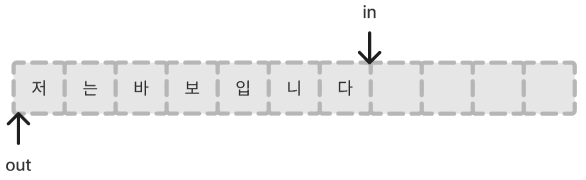
이렇게 `in`과 `out`은 동일한 위치에 있다가

이제 Producer가 데이터를 좀 쓰고 나면
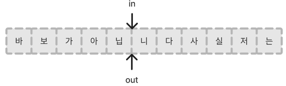
`in`이 쭉 이동한 상태고,

이제 Consumer가 데이터를 읽어가면

`out`또한 쭉 이동한 상태가 됩니다

다시 Producer가 폭주해서 데이터를 쓰되  
만약 버퍼 크기가 `n`이고 버퍼의 끝에 도달하면  
0부터 `out`직전까지는 `out`이 이미 데이터를 읽어갔으니 여기를 또 채워야겠죠?  
Round하게, 끝에 도달하면 `in = (in+1)%n`처럼 해서 0으로 돌아오도록 하고  
다시 쭉 데이터를 씁니다  
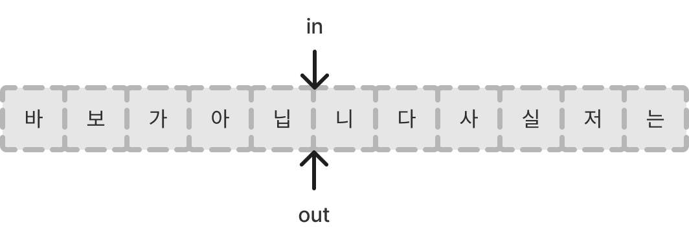
버퍼가 꽉 찼네요..  
더 이상 쓰면 Consumer가 읽어가야 할 '니', '다', 등등..의 글자를 덮어쓰게 되니  
이제 버퍼에 데이터를 쓰는 것은 멈추고  
어떤 문제가 발생할 수 있는지 생각해봅시다

\
일단, 한 번에 여러 Producer가 `in`위치에 데이터를 쓰면 안 될 것 같습니다  
당연하죠? "바보"를 둘이서 나눠 쓸건데, 같은 칸에 쓰면 "바" 또는 "보"만 남게 될 것입니다  

Consumer의 상황도 마찬가지겠죠?  
그러니 어떤 순간에 데이터를 읽거나 쓰거나 하나만 하도록 해야 할 것 같습니다.

근데 이 경우는 이미 앞에서 질리도록 살펴봤던 Mutual Exclusion 문제네요  
Well-Known 입니다만? 🥸

\
또 다른 문제는 일단  
Producer는 버퍼가 가득 차면 데이터를 더 이상 집어넣을 수 없고  
Consumer는 비슷하게, 버퍼가 비어 있다면 데이터를 더 이상 꺼내갈 수 없습니다  
라는 사실에서부터 시작하는데  
그럼 그냥 버퍼가 가득 차면 Producer는 기다리고,  
버퍼가 비어 있으면 Consumer는 기다리면 되지 않을까요?

근데 위 그림을 다시 자세히 들여다보면  
버퍼가 비어 있는 경우 `in`과 `out`이 같은 자리에 있는데  
버퍼가 가득 찬 경우에도 `in`과 `out`이 같은 자리에 있습니다??  
그렇기 때문에 `if (in == out)` 이렇게 쓰는 것만으로는 버퍼가 비어 있는지 가득 찬건지 확인을 할 수가 없습니다 ㅜㅜ

그래서 이걸 구분하기 위해 어쩔 수 없이 Producer와 Writers 각각은 다음과 같이 작성해왔습니다

```c
void producer{
	while (true) {
		v = produce() //대충 data 하나를 만들어 냄
		while ((in+1)%n == out) // 다음 칸이 out과 겹치면 대기
			/* do nothing */;
		buffer[in] = v;
		in = (in+1)%n;
	}
}

void consumer{
	while (true) {
		while(in == out) // 현재 칸이 in과 겹치면 대기
			/* do nothing */;
		w = buffer[out];
		out = (out+1)%n;
		consume(w); //대충 꺼내온 데이터를 소비함
	}
}
```

그냥 버퍼를 아무리 꽉 채워도 한 칸은 비우도록 한 것이죠......  
그리고 OS를 잘 공부한 독자라면  
busy-waiting이잖아? 를 바로 떠올리시겠죠?

이 문제를 semaphore와 monitor로 잘 해결해볼 수 있습니다  
게다가 얘네를 쓰면 꼭 한 칸 비우도록 하지 않아도 됩니다!

## Semaphore로 Producer-Consumer Problem 해결하기

코드 형태를 바로 봅시다

```c
const int sizeofbuffer = /* buffer size */;
semaphore s = 1;
semaphore n = 0;
semaphore e = sizeofbuffer;

void producer() {
	while (true) {
		produce(); //대충 데이터 만드는 함수
		semWait(e); //데이터 집어넣기 전에, 버퍼 꽉 찼는지 확인
		semWait(s); //C.S 잠그기
		append(); //데이터 집어넣기.
		semSignal(s); // C.S 잠금 해제
		semSignal(n); // 데이터를 집어넣었으니, 하나 넣었다고 알리기
	}
}
void consumer() {
	while (true) {
		semWait(n); // 데이터 꺼내기 전에, 버퍼 비었는지 확인
		semWait(s); //C.S 잠그기
		take(); //데이터 꺼내가기.
		semSignal(s); //C.S 구현
		semsignal(e); //데이터를 꺼냈으니, 하나 꺼냈다고 알리기
		consume(); //대충 데이터 소비하는 함수
	}
}
void main() {
	parbegin(producer, consumer);
}
```

이 때, 가상의 함수 `append()`와 `take()`는 대충 데이터를 집어넣고 꺼내가는 동작이라고 보시면 됩니다

세 가지 semaphore가 쓰이는데..

- `semaphore s` => C.S를 잠가 Mutual Exclusion을 보장하기 위함. 초기값 1
- `semaphore n` => 버퍼에 꺼내갈 수 있는 데이터가 얼마나 있는지 나타낸다. 초기값 0 (처음에는 데이터가 없음)
- `semaphore e` => 버퍼에 데이터를 넣을 공간이 얼마나 남았는지 나타낸다. 초기값은 `sizeofbuffer`. (처음에는 버퍼 전체가 비어있으므로)

이렇게 해서,  
producer는 빈 자리(`e`)를 하나 줄이고 $\rightarrow$ 데이터 개수(`n`)를 하나 늘리고,  
consumer는 빈 자리(`e`)를 하나 늘리고 $\rightarrow$ 데이터 개수(`n`)를 하나 줄이고,  
를 지속적으로 수행하게 합니다.  
이 때,  
만약 더 넣을 빈 자리가 없다면(`e`값 $\le$ 0) producer는 `semWait(e)`에서 걸려 대기하고,  
만약 더 가져갈 데이터가 없다면(`n`값 $\le$ 0) consumer는 `semWait(n)`에서 걸려 대기합니다.

이 때 `semWait()`또는 `semSignal()`의 순서가 중요한데  
`semWait(s)`를 `semWait(e)` 또는 `semWait(n)`보다 먼저 놓거나, 하면.. 참사가 벌어집니다  
예를 들어, 제가 실수로 consumer를 `semWait(s)` 다음 `semWait(n)`이 나오도록 작성했다고 칩시다.  
그러면 만약..

버퍼가 비어 있는 상황이라고 가정하고 흐름을 한 번 봅시다

1. 먼저 consumer가 `take()`를 위해 접근
   - `semWait(s)`가 먼저 나왔다고 가정했으므로, `s==1 -> 0`
   - 그 다음, 버퍼가 비어있으므로 `semWait(n)`에 걸려 대기
2. 그 다음, producer가 `append()`를 위해 접근
   - 버퍼에 빈 공간이 있으므로, `semWait(e)`를 통과
   - 그 다음, `semWait(s)`에서, `s==0 -> -1`, 값이 음수가 되었으므로 대기

헉.. 둘 다 Block 상태를 빠져나오지 못하는, Deadlock에 걸려버렸습니다  
서로가 서로를 기다리게 되었네요 ㅜㅜ


Semaphore가 이전의 Software나 Hardware 방식과 비교하여 강력한 것은 맞지만  
문을 잠그고, 키를 두고 가고, 값을 통제하고, .. 를 관리하는 것은 여전히 사람이기 때문에  
이렇게 잘못 사용할 여지가 충분히 남아있습니다  
그럼 Monitor를 사용해본다면?

## Monitor로 Producer-Consumer Problem 해결하기

저번시간에 말한 Monitor란  
한 번에 한 프로세스만 Monitor에 진입하므로 그 자체로 Critical Section이고  
`cwait`, `csignal` 함수와 Block Queue를 가지는 `condition` 변수를 가진다고 했습니다  
그런 Monitor의 특성을 이용하여  
아까 semaphore로 감쌌던, 데이터를 집어넣거나 꺼내는 동작인, `take()`와 `append()`를 작성해봅시다

```c
monitor boundedbuffer; //유한한 버퍼 자체가 모니터 안에 포함됨
char buffer[N]
int nextin, nextout; //다음에 쓸, 또는 읽을 위치
int count; //버퍼에 있는 데이터 갯수
cond notfull //버퍼가 가득 찬 경우 producer가 기다리는 큐를 포함
cond notempty; //버퍼가 비어 있는 경우 consumer가 기다리는 큐를 포함

void append (char x) {
	if (count == N) cwait(notfull); //버퍼가 꽉 참. 기다리기
	buffer[nextin] = x;
	nextin = (nextin + 1) % n;
	count++;
	csignal(notempty); //버퍼에 데이터 하나 넣어뒀으니 consumer 하나를 깨운다
}
void take (char x) {
	if (count == 0) cwait(notempty); //버퍼가 비어 있음. 기다리기
	x = buffer[nextout];
	nextout = (nextout + 1) % n;
	count--;
	csignal(notfull); //버퍼에서 데이터 하나 꺼내갔으니 producer 하나를 깨운다
}
```

`append`할 때는 혹여 버퍼가 꽉 찼다면 condition 변수인 `notfull`에 producer를 기다리게 하고,  
`take`할 때는 혹여 버퍼가 비어있다면 condition 변수인 `notempty`에 consumer를 기다리게 합니다.  
`csignal`은 조건을 묻지도 따지지도 않고 실행하는데,  
전에도 말했 듯이 condition 변수에는 값이 없으므로  
그저 큐에 기다리는 프로세스가 있으면 깨우고, 없으면 말고, 를 하면 됩니다


이렇게 간단히 `append()`와 `take()`라는 일종의 proceduer가 작성되었습니다  
이제 producer와 consumer는 단순히 아래와 같이 동작하면 됩니다 :

```c
void producer() {
	char x;
	while (true) {
		produce(x); //대충 x라는 데이터를 하나 만들어서
		append(x); //집어넣기
	}
}
void consumer() {
	char x;
	while (true) {
		take(x); //꺼내와서
		consume(x); //대충 x라는 데이터를 소비
	}
}
void main() {
	parbegin(producer, consumer);
}
```

진짜 단순해졌습니다  
어랍쇼? Mutual Exclusion은 엿바꿔먹었나요? 라는 생각이 잠깐 들 수도 있지만  
`append()`와 `take()`는 Monitor 내에 정의된 *proceduer*라서, 이미 그런 것은 보장이 다~ 됩니다.  
또한 저렇게 한 번 정의하고 나면, semaphore에서와 같이 저같은 바보가 잘못 써놓을 일은 없습니다.  
그냥 함수만 콜하면 끝이니까요

어? 근데  
이전에 semaphore에서 동기화할 때는,  
C.S를 먼저 통과하고 버퍼의 상태를 확인하면 데드락이 발생했었는데..  
이렇게 Monitor로 구현한 방법 역시  
Monitor 내부는 이미 혼자서만 들어가는 C.S인 셈이고  
그 안에서 버퍼의 상태를 확인하므로 데드락 위험이 있는 것이 아닐까요? 싶지만


Monitor에서 버퍼의 상태를 확인하고 `cwait`으로 인해 블락되어 queue에 들어가면, 이 queue는 보호되는 구역 바깥에 있어서  
C.S를 잠그고 들어가서 멈추는 것이 아니라 바깥으로 나간 상태이므로 다시 C.S는 풀리고, 새로운 프로세스가 들어올 수 있습니다  
condition 변수의 queue(또는 urgent queue)들은 Mutual Exclusion의 보호 대상이 아니라는 점이 중요했네요

# Readers-Writers Problem

비슷한 것 같지만 또 다른 문제가 있습니다  
file이나 공유 메모리 공간처럼, C.S 내에 데이터가 주르륵 있고, 이 것을 읽거나 쓰려고 하는데 이번에는

- reader : 데이터를 읽기만 한다
- writer : 데이터를 읽은 뒤, 쓴다

이 두 종류의 작업자가 있습니다

이 경우 동시에 여러 reader들이 작업하는 것은 괜찮습니다. 데이터를 수정하지 않고 읽기만 하기 때문이고  
그런데 둘 이상의 writer들은 동시에 작업하면 당연히 안 되겠죠?  
reader와 writer가 동시에 작업하는 것은 어떨까요? 좀 애매해 보이기는 하는데..  
이것도 막도록 합시다. 동시에 작업하면 reader가 읽은 값이 수정 전 값인지 수정 후의 값인지 모를 뿐더러  
더 운이 나쁘면 수정되는 사이에 값을 읽어버릴 수도 있습니다  
아무튼 정리하면 조건은 아래와 같습니다

- reader는 한 번에 둘 이상 동시에 파일을 읽기 가능
- writer는 한 번에 단 하나의 writer만이 파일에 쓰기 가능
- 하나의 writer가 파일에 쓰기 작업을 진행중이면, reader는 파일을 읽기 불가

이렇게 됩니다.  
따라서, 이전에 살펴본 producer-consumer 문제와 달리, 코드가 대칭적으로 생겨먹지 않습니다  
아무튼, 이제 reader와 writer를 위한 `reader()` 함수와 `writer()`함수를 작성할건데  
semaphore를 이용하여 위 세 가지 조건을 모두 충족시키도록 해봅시다

```c
/* program readersAndWriters */
int readcount;
semaphore x=1;
semaphore wsem=1;
void reader() {
	while (true) {
		semWait(x);
		readcount++;
		if (readcount == 1) semWait(wsem);
		semSignal(x);
		READUNIT(); //대충 read한다는 뜻
		semWait(x);
		readcount--;
		if (readcount == 0) semSignal(wsem);
		semSignal(x);
	}
}
void writer() {
	while (true) {
		semWait(wsem);
		WRITEUNIT(); //대충 write한다는 뜻
		semSignal(wsem);
	}
}
void main() {
	readcount = 0;
	parbegin(reader, writer);
}
```

`readcount`나 `semaphore x, semaphore wsem`같은 각각의 요소들을 한 줄로 정리하기는 좀 애매해서 주석을 많이 달지 않았습니다

일단 좀 더 짧은 `writer()`부터 살펴보면, 전형적인 C.S 코드인게 보입니다.  
writer든 reader든, writer와 함께 작업할 수 없으므로 `wsem`이라는 semaphore로 C.S를 잠가놓고 작업합니다.

그 다음 `reader()`는, 일단 대충 read하는 문장인 `READUNIT`을 중심으로 위쪽과 아래쪽인, 작업 전과 후로 나눠서 살펴봅시다

- 작업 전에는, _reader_ 하나 추가요~ `readcount++`. 이 때, `semaphore x`로 C.S를 잠그고 진행
- 작업 후에는, _reader_ 하나 나가요~ `readcount--`. 이 때, `semaphore x`로 C.S를 잠그고 진행

그럼 이제 `semaphore x`와 `semaphore wsem`에 의해 각각 C.S 영역이 생겨서 두 개의 방이 생긴다는 뜻인데  
잠깐 그림으로 살펴보면
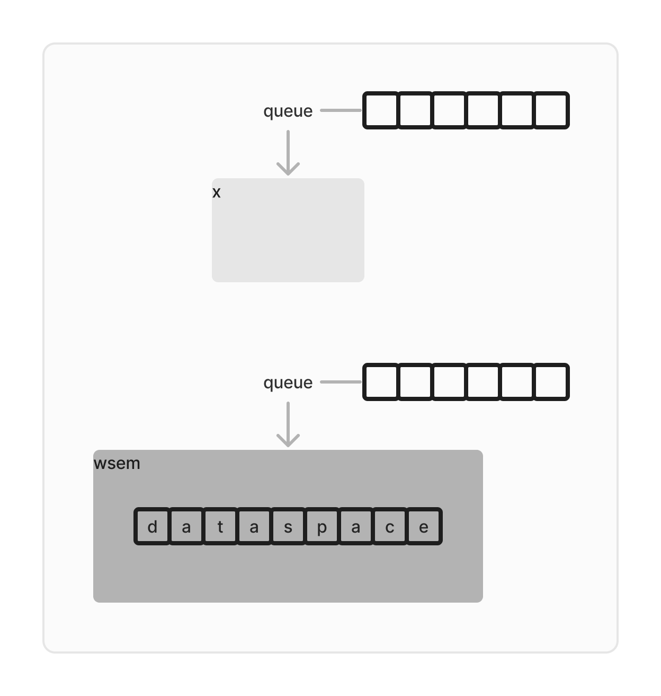
이렇게 시작을 합니다.  
각 semaphore (`x`와 `wsem`)에 의해 제한되는 C.S 영역과 해당 영역이 잠기면 들어가기 위해 대기하는 큐가 존재하고  
`wsem` 내에는 데이터가 읽고 쓰여지는 공간이 존재합니다

이제 writer인 `w1, w2, w3`가 차례대로 도착했다고 해봅시다.  
그럼 당연히 처음 도착한 `w1`만 `wsem` 내로 들어가 작업을 시작하고, `w2`와 `w3`은 대기하겠죠?
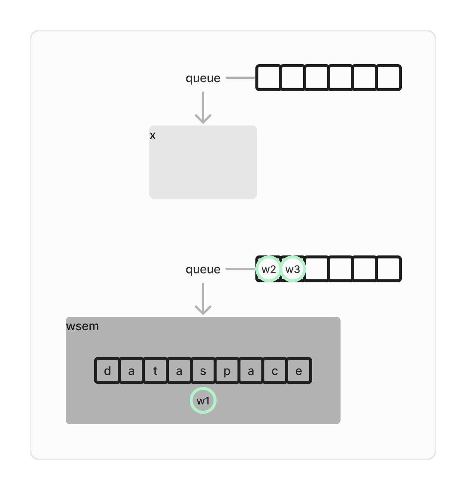
이렇게, `wsem`은 닫혀있습니다. writer는 대문자 I라서 혼자 작업하고 싶어하네요~

이제 `r1`이라는 reader가 하나 와서 `reader()`를 실행한다고 해봅시다.
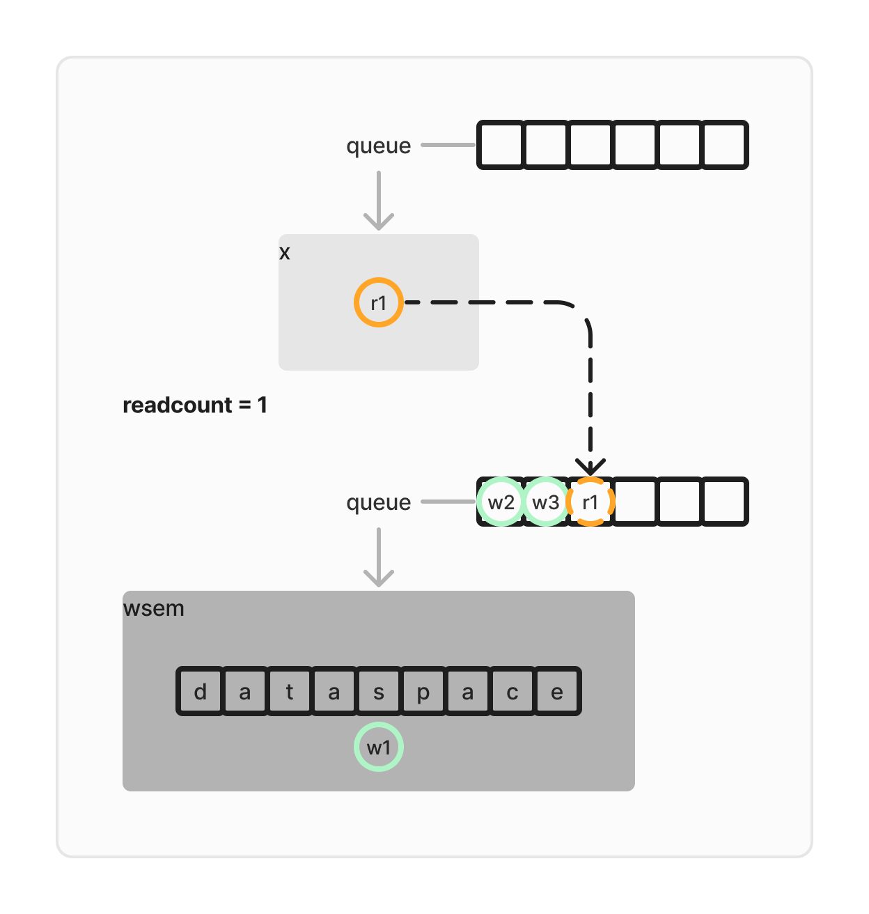
이해를 돕기 위해 `readcount` 변수를 값과 함께 띄웠습니다  
`r1`은 `x`를 잠그고 들어가서는 `readcount++`을 진행했고,  
그런데 그러고 나니 `readcount==1`이므로,  
`r1`은 `wsem`에 가서 **줄을 섭니다. `x`를 잠근 상태 그대로.**

그럼 이제 다른 reader 친구들, `r2`, `r3`, `r4`, `r5`가 주르륵.. 들어오면 어떻게 될까요?
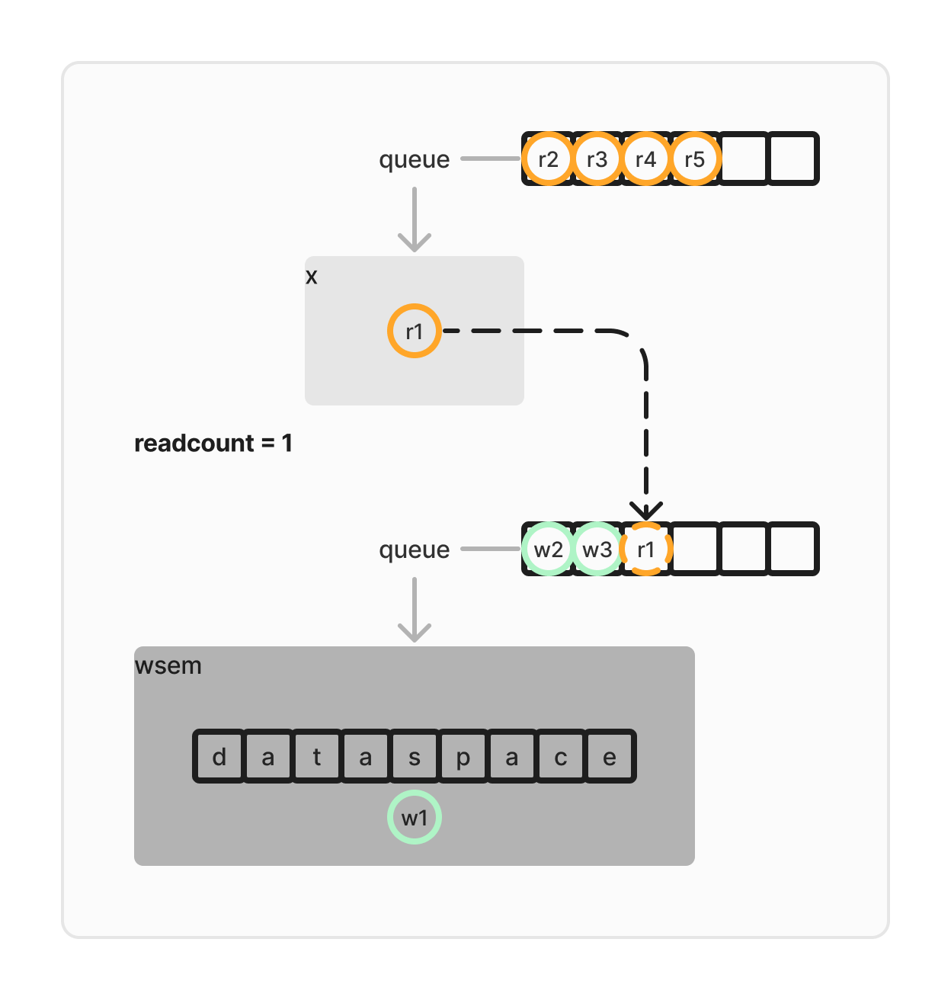
`readcount`를 ++하려고 호기롭게 들어왔지만,  
우리 reader 친구들은 `x`가 닫혀있어서 하는 수 없이 줄을 서게 됩니다..  
즉 writer가 `wsem`을 잠그고 들어가 작업중인 경우, **reader들은 단 하나만 `wsem`에 가서 대표로 줄을 서고, 나머지는 `x`에서 기다립니다.**

막내가 아닌 짬킹이 줄을 서는 선진병영이네요

이제 `w1`이 끝났다고 해봅시다.  
그리고, 이 semaphore는 강한 semaphore라서 큐에서 꺼내오는 순서는 곧 죽어도 FIFO라고 가정하면  
`w2`가 들어가서 작업, .. 끝나면 `w3`가 들어가서 작업, .. 끝나면 `r1`이 들어가니까...?
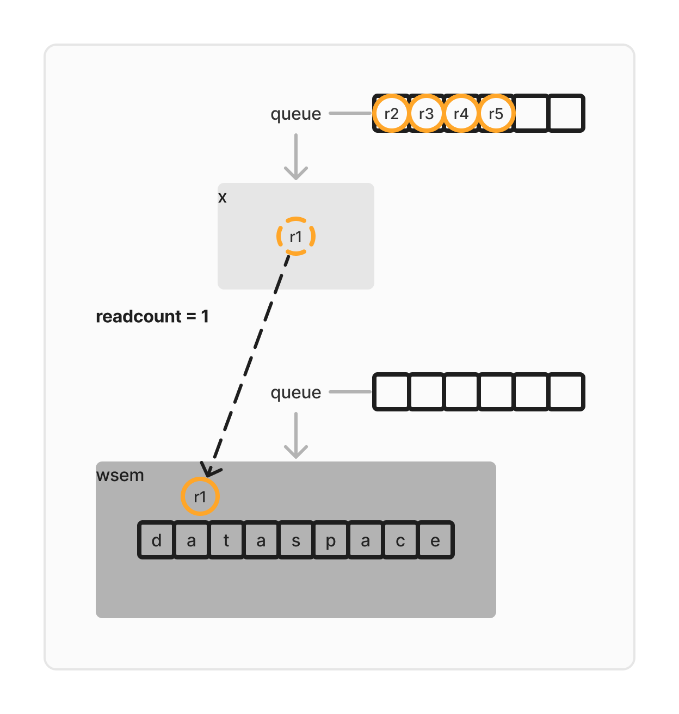
`r1`의 `semWait(wsem)`이 풀린 것이고, `semSignal(x)`로 `x`의 잠금을 풀었습니다.  
이제 `READUNIT()`에서 읽기 작업 중인데, 오래 걸리는 작업이라 여기서 한동안 머무른다고 생각해봅시다.

이 때 `x`은 값이 1로 열려 있고, `wsem`은 `r1`이 0인 채로 지나왔습니다  
이 경우 writer는 `semWait(wsem)`을 먼저 실행하기 때문에 값이 -1이 되어 기다리게 되지만,  
reader는 `x`를 잠근다 $\rightarrow$ `readcount++` $\rightarrow$ `readcount`가 1보다 큰, 2 이상이다 $\rightarrow$ `x`의 잠금을 푼다  
이 과정을 반복하며 `READUNIT()`에 얼마든지 도달할 수 있습니다  
그럼 이 이후로 `r2, r3, r4, r5`가 모두 `READUNIT()`에 도달하고, 새로운 writer인 `w4`가 들어왔다고 해봅시다
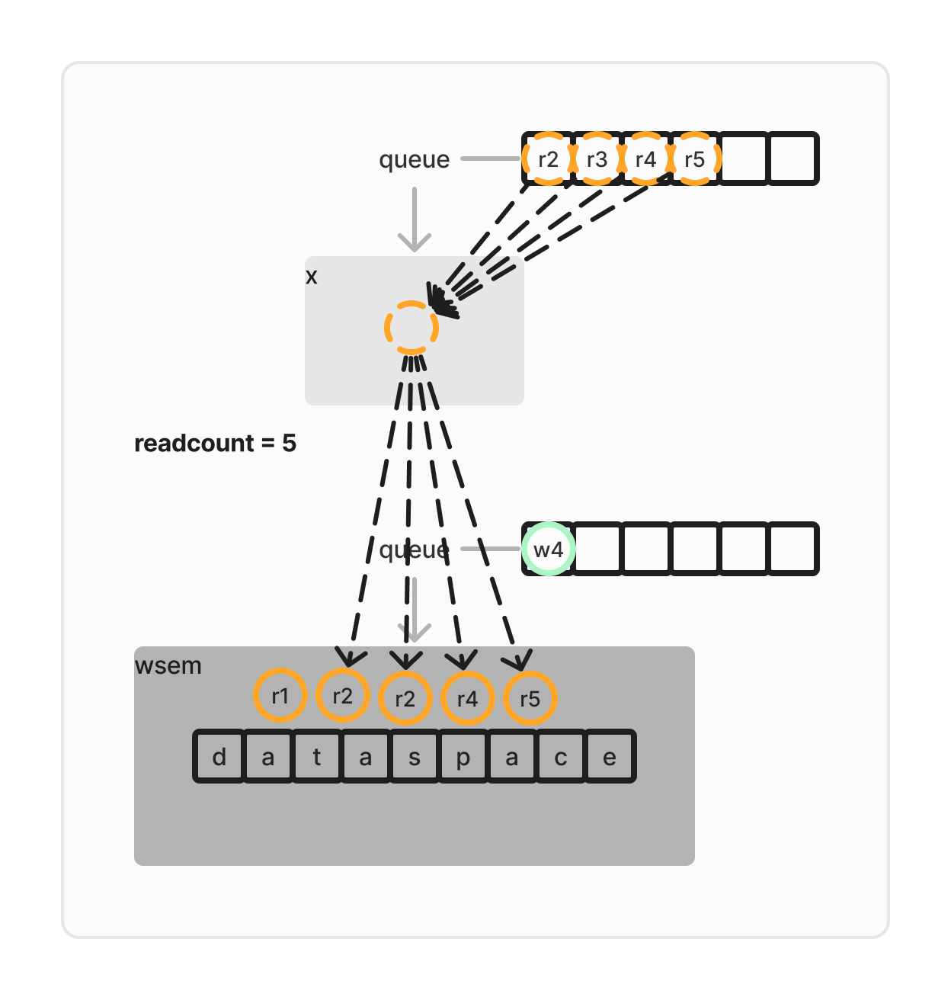
reader들은 너무 외향적이라 다같이 파티를 해버리네요  
writer인 `w4`는 너무 내향적이라 파티에 끼지 못하고 그냥 밖에서 기다립니다..

게다가 여기서 새 reader인 `r6`가 들어와도,  
밖에서 기다리는 `w4`는 신경도 쓰지 않고 그냥 `READUNIT()`하러 들어가버릴 수 있습니다
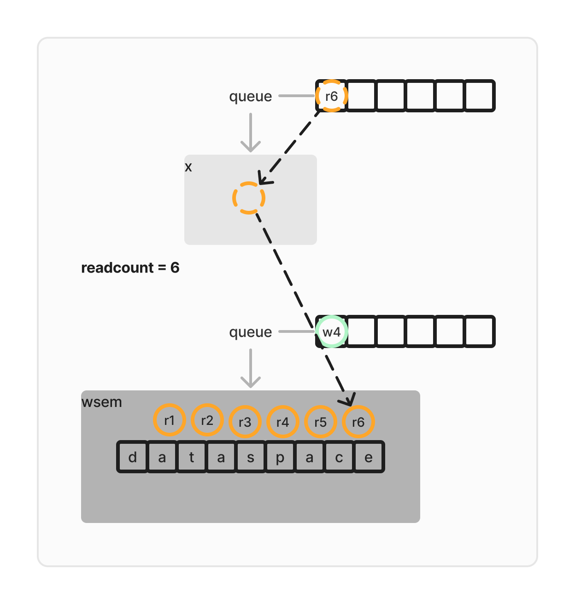
이러한 특성때문에, **reader들이 우선순위를 가진다**고 말합니다.

그렇게 reader들의 왁자지껄 웅성웅성 👥👤👥👥👤 파티가 끝나고
모든 reader들이 나가서 `readcount=0`이 되고 나면, 마지막에 나가는 reader가 `semSignal(wsem)`으로 이제 `wsem`에 아무도 없음을 알립니다.

[](https://www.youtube.com/watch?v=KNp2VyF0qHY)

그러고 나면, 이제 조용해진 `wsem`에 드디어 `w4`가 들어갑니다.
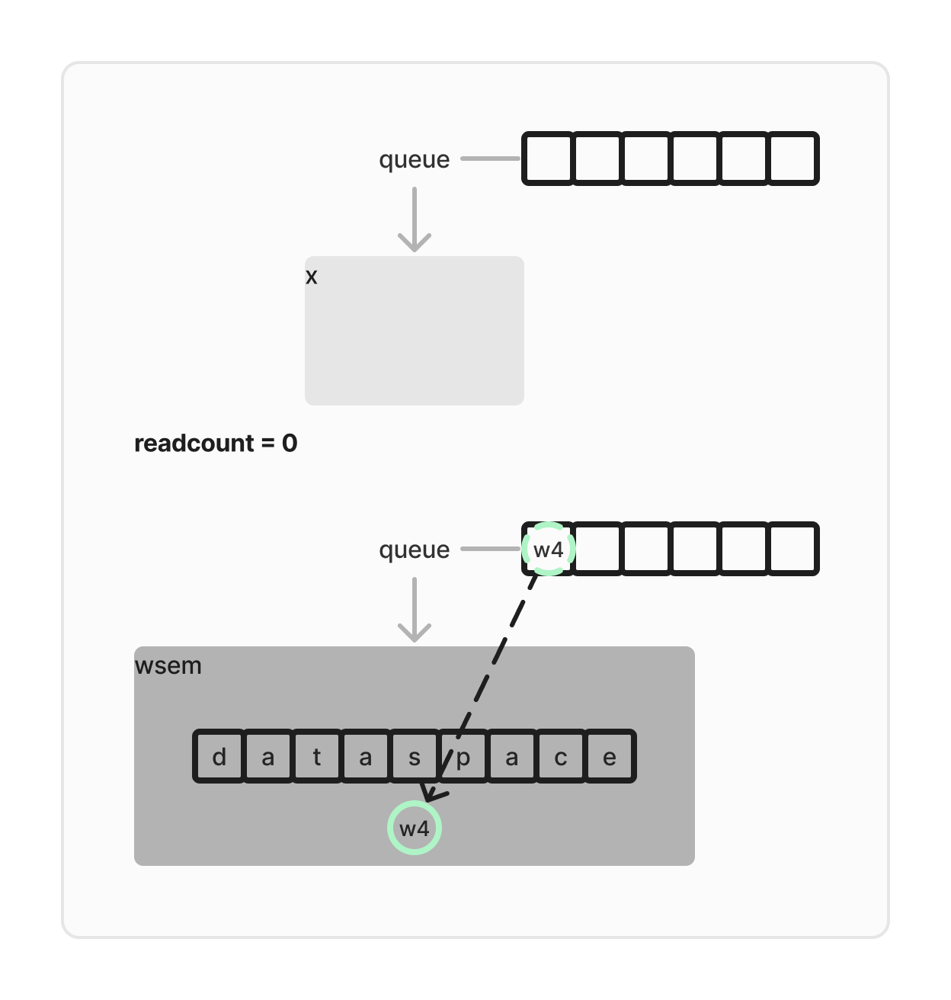
아 시끄러운 `wsem`에 차마 들어가지 못하고 밖에서 기다린 `w4`에 과몰입했는지 이 그림조차 너무 고요하게 느껴집니다...


아무튼, 그래서 정리하자면

`readcount`는

- reader가 작업 중이면 읽기 작업을 진행 중인 reader의 수
- writer가 작업 중이면 기다리는 reader의 수 (하나는 `wsem`에 대표로 줄 서고, 나머지는 `x`에서 줄 선다)

그리고 또 `semaphore x`의 역할은

- `readcount`의 조정을 한 번에 한 프로세스만 하게 하기 위함
- reader들이 C.S에 들어가고자 하는데 이미 writer가 작업중이라 들어가지 못할 때, 짬킹을 제외한 나머지를 줄세우는 역할

마지막으로 `semaphore wsem`은

- writer가 작업중이면, `wsem`을 아예 잠그고 들어간다
- reader가 들어가 있으면, `wsem`은 reader에게만 열려있다

이렇게 됩니다

---

휴.. 생각보다 글이 길어져서 햄드네요  
사실 내일 운영체제 중간고사입니다  
아좌좍~


이만 마칩니다.
