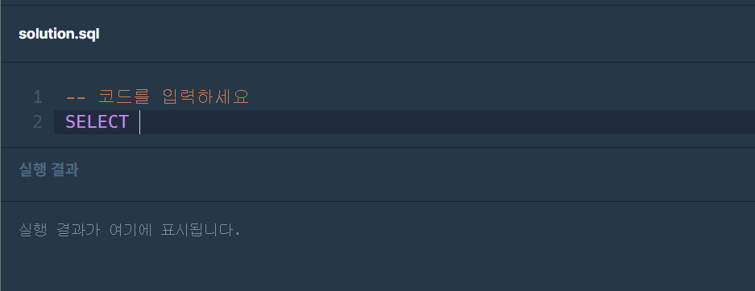

소프트웨어 마에스트로 코딩테스트를 보게됐는데요\
어라?? SQL 문항이 하나 있습니다??\
1년전에 데이터베이스 수업을 듣긴 했으나\
전부 까먹어버렸습니다..\
그래서 급하게 벼락치기를 갈겼습니다!!

## 먼저 SQL문의 대략적인 생김새

오랜만에 SQL문을 마주하니까 교수님께서 해주신 말이 새록새록합니다\
sql문은 대소문자를 구별하지 않는다.. 이건 윈도우 기준이네요\
또 뭐 있더라?아무튼

SQL문에서 해야 할 일은 조회(SELECT)뿐입니다\
\
프로그래머스 SQL문제를 풀어보러 들어가보면 SELECT가 먼저 쓰여있는 것을 볼 수 있습니다

그럼 SELECT로 할 수 있는게 뭐가 있는지 봅시다..\
[MariaDB 문서](https://mariadb.com/kb/en/select/)를 보면 select문 Syntax를 확인해볼 수 있는데

```
SELECT
    [ALL | DISTINCT | DISTINCTROW]
    [HIGH_PRIORITY]
    [STRAIGHT_JOIN]
    [SQL_SMALL_RESULT] [SQL_BIG_RESULT] [SQL_BUFFER_RESULT]
    [SQL_CACHE | SQL_NO_CACHE] [SQL_CALC_FOUND_ROWS]
    select_expr [, select_expr ...]
    [ FROM table_references
      [WHERE where_condition]
      [GROUP BY {col_name | expr | position} [ASC | DESC], ... [WITH ROLLUP]]
      [HAVING where_condition]
      [ORDER BY {col_name | expr | position} [ASC | DESC], ...]
      [LIMIT {[offset,] row_count | row_count OFFSET offset  [ROWS EXAMINED rows_limit] } |
        [OFFSET start { ROW | ROWS }]
        [FETCH { FIRST | NEXT } [ count ] { ROW | ROWS } { ONLY | WITH TIES }] ]
      procedure|[PROCEDURE procedure_name(argument_list)]
      [INTO OUTFILE 'file_name' [CHARACTER SET charset_name] [export_options] |
        INTO DUMPFILE 'file_name' | INTO var_name [, var_name] ]
      [FOR UPDATE lock_option | LOCK IN SHARE MODE lock_option]


export_options:
    [{FIELDS | COLUMNS}
        [TERMINATED BY 'string']
        [[OPTIONALLY] ENCLOSED BY 'char']
        [ESCAPED BY 'char']
    ]
    [LINES
        [STARTING BY 'string']
        [TERMINATED BY 'string']
    ]


lock_option:
    [WAIT n | NOWAIT | SKIP LOCKED]
```

아휴.. 코테가 당장 코앞인데 언제 이걸 전부 공부하죠?\
그러니 많이 쓰이는 것들을 좀 정리해보면

- **SELECT column1, column2, column3 as col3**

  - 먼저 SELECT 뒤에는 조회하고 싶은 컬럼들을 나열합니다.
  - 컬럼 이름을 따로 정하고 싶다면 "컬럼이름 as 별명"과 같이 작성합니다.

- **FROM table**

  - 이건 그냥 문제에서 주는 테이블 이름 씁니다.

- **WHERE 조건...**

  - 조건에 맞는 애들만 조회하고 싶은 경우 씁니다(ex : age >= 13)

- **GROUP BY 컬럼명 HAVING 조건...**

  - 같은 값을 가진 행끼리 그룹짓습니다.
  - 이 때, HAVING절로 조건을 제한할 수 있습니다.
  - WHERE와 HAVING이 다른 점은, HAVING은 집계함수(COUNT, SUM 등..)를 사용할 수 있습니다.

- **ORDER BY col1 ASC, col2 DESC**

  - 결과 정렬 기준을 정합니다.
  - 기본값은 ASC(오름차순)이며, 내림차순을 원할 경우 DESC를 명시합니다.
  - 기준에 차선, 그 다음 기준, ...을 원하면 위와 같이 기준을 나열합니다. (예시의 경우, col1을 기준으로 오름차순 정렬하며, col1값이 같은 행들은 col2를 기준으로 내림차순 정렬)

일단.. 이거 말고도 JOIN이나 UNION, 서브쿼리같은 잡기술들이 좀 있는데요\
그건 실전에서 보면서 알아보도록 합시다

## 내장함수들

그리고 내장함수들을 쓸 경우가 꽤나 있습니다?\
특히 프로그래머스 문제들 중에\
**DATE_FORMAT()**을 써야하는 경우가 굉장히 많습니다\
DATE_FORMAT(날짜컬럼, "%Y-%m-%d")는 꼭 알아두면 좋은데\
항상 프로그래머스 SQL문제들은 날짜를 "YYYY-MM-DD"로 해달라고 하거든요

아무튼 그리고 또 다른것들 대충 주루룩 언급해보면

- 문자열
  - LOCATE("A", "ABC") : "ABC"에서 "A"가 몇 번째?
  - substring("abc", 2) : 2번째 문자부터 반환
  - right("abcd", 1) : "abcd"에서 오른쪽에서 1번째까지
  - left("abcd", 1) : "abcd"에서 왼쪽에서 1번째까지
  - upper(str), lower(str)
  - length("abc") : 글자 수 반환
  - concat("ABC", "DEF") : 문자열 붙이기
  - replace("ABC", "A", "Z") : "ABC"의 "A"를 "Z"로 변환
  - LPAD("def", 5, " _ " ) "def" 왼쪽에 " _ "를, 전체 문자열이 5글자가 되도록 붙이기
  - TRIM(" _ " from " _ abc \_ ") : 특정 문자열 삭제(이건 양 옆)
    - TRIM(leading " _ " from " _ abc \_ ") : 앞에꺼. traling은 뒤에꺼
    - 또는 LTRIM(" \_ _ abc _ _ ", " _ ") , RTRIM

숫자형 - abs, ceiling, floor, round 반올림, truncate(숫자, 자릿수) : 버림 - power, mod - 순위 매기기 : rank() over(order by 컬럼명)

날짜형 - NOW() : 현재 날짜시간 - current_date(), current_time() - year(날짜) : 날짜의 연도, month(), monthname(), dayname()이건요일 - week(날짜) : 올해의 몇 번째 주인지 반환 - datediff(날짜, 날짜) : 차이 반환

사실 이것들은\
소마 이전 기수 코테에서\
특정 함수 모르면 못 풀게 나왔대서.. 급히 정리했던것들입니다 ㅜㅜ

## 프로그래머스 SQL문제 풀이들

제가 푼 것들 조금 정리해둔건데요\
이게 알고리즘도 그렇듯이\
제 답이 항상 최적해이고 효율적이고 쉬운 답인건 아닙니다 ㅜ\
참고만 해주세요~

### 12세 이하인 여자 환자 목록 출력

PT_NO, PT_NAME, GEND_CD, AGE, TLNO 이 테이블에서
PT_NAME, PT_NO, GEND_CD, AGE, TLNO 이렇게 해서, 12세 이하인 여자환자만 출력

- 조건에 따라 : WHERE
- NULL값 대체 : `IFNULL(컬럼명, 대체 문자열)`
- 나이 기준으로 내림차순 정렬 : `ORDER BY AGE DESC`
- 컬럼 이름 변경 `IFNULL(TLNO, "NONE") TLNO` (as를 생략해도 됨)

```sql
-- 코드를 입력하세요
SELECT PT_NAME, PT_NO, GEND_CD, AGE, IFNULL(TLNO, "NONE") TLNO
FROM PATIENT
WHERE GEND_CD = "W" AND AGE < 13
ORDER BY AGE DESC, PT_NAME ASC
```

### 재구매가 일어난 상품과 회원 리스트

- USER_ID와 PRODUCT_ID로 그룹 : `GROUP BY USER_ID, PRODUCT_ID`
- HAVING : where과 비슷하나 집계함수 쓸 때 사용. GROUP BY 다음에 나온다
- 집계함수 COUNT를 써서 조건을 줘야 하니 `GROUP BY ~ HAVING ~`을 사용했습니다

```sql
-- 코드를 입력하세요
SELECT USER_ID, PRODUCT_ID FROM ONLINE_SALE
GROUP BY USER_ID, PRODUCT_ID
HAVING COUNT(PRODUCT_ID) > 1
ORDER BY USER_ID, PRODUCT_ID DESC
```

### 오프라인/온라인 판매 데이터 통합하기

- 결과 함께 보여주기 : `UNION ALL`
  - PPAP처럼 두 결과를 UH~하고 이어붙입니다
- 없는 컬럼 NULL로 대체 : `NULL as USER_ID`
- 2022-03 만족하는거 가져오기 : `LIKE '2022-03-%`
  - LIKE 다음 조건에, *어떤 값이 오든 상관없다*는 뜻으로 %를 씁니다
  - 예를 들어, "%조건%"면, "무조건이야" 또는 "조건이야" 또는 "무조건" 모두 됩니다
  - "%조건"이면, "무조건"만 됩니다
  - "조건%"이면, "조건이야"만 됩니다
- 날짜형식지정 : `DATE_FORMAT(날짜, 형식)` : %Y는 4자리 연도, %m는 2자리 월, %d는 2자리 일

```sql
-- 코드를 입력하세요
SELECT DATE_FORMAT(SALES_DATE, "%Y-%m-%d") as SALES_DATE, PRODUCT_ID, USER_ID, SALES_AMOUNT
FROM ONLINE_SALE as onl
WHERE SALES_DATE LIKE "2022-03-%"
UNION ALL
SELECT DATE_FORMAT(SALES_DATE, "%Y-%m-%d") as SALES_DATE, PRODUCT_ID, NULL as USER_ID, SALES_AMOUNT
FROM OFFLINE_SALE as off
WHERE SALES_DATE LIKE "2022-03-%"
ORDER BY SALES_DATE, PRODUCT_ID, IFNULL(USER_ID, 0)
```

### 가격이 제일 비싼 식품의 정보 출력하기

- 서브쿼리 : `where PRICE = (SELECT ~~~)` : 괄호 안에 담은 쿼리의 결과를 그대로 가져와서 써먹을 수 있습니다

```sql
-- 코드를 입력하세요
SELECT * FROM FOOD_PRODUCT
WHERE PRICE = (SELECT MAX(PRICE) FROM FOOD_PRODUCT)
```

### 3월에 태어난 여성 목록 출력

- 전화번호 NULL인 경우 출력 제외 : `where TLNO is not null`

```sql
-- 코드를 입력하세요
SELECT MEMBER_ID, MEMBER_NAME, gender, date_format(date_of_birth, '%Y-%m-%d') as date_of_birth
from member_profile
where gender = 'W' and tlno is not null and date_format(date_of_birth, '%m') = '03'
```

### 과일로 만든 아이스크림 고르기

- `flavor in (서브쿼리)`를 사용하여 포함되어있는 값인지 확인

```sql
-- 코드를 입력하세요
SELECT flavor from first_half
where total_order > 3000 and flavor in (
    select flavor
    from icecream_info
    where ingredient_type = 'fruit_based'
)
order by total_order desc;
```

### 강원도에 위치한 생산공장 목록 출력하기

- "강원도"로 시작하는거 찾기 : `address like '강원도%'`
- %강원도% : 앞뒤 상관없이 강원도만 있으면 됨 / %강원도 : 강원도로 끝나야함. / 강원도% : 강원도로 시작

```sql
-- 코드를 입력하세요
SELECT factory_id, factory_name, address from food_factory
where address like '강원도%'
```

### 평균 일일 대여 요금 구하기

- 반올림 : round(대상, 자릿수)

```sql
-- 코드를 입력하세요
SELECT round(avg(daily_fee)) as average_fee from car_rental_company_car
where car_type = 'SUV'
```

### 조건에 맞는 도서와 저자 리스트 출력하기

비교적 입문적인 JOIN문제입니다.\
TABLE_A 테이블의 col1 칼럼과, TABLE_B 테이블의 col2 칼럼 값들이 같은 것들끼리 쪼인하려면\
`FROM TABLE_A AS a JOIN TABLE_B AS b ON a.col1 = b.col1`\
이런 식이며.. JOIN에는 INNER JOIN, LEFT OUTER JOIN, RIGHT OUTER JOIN, 등.. 많지만 JOIN만 쓰면 INNER JOIN합니다

 from stackoverflow

대충 이렇습니다.. 조회하려는 용도에 따라 조금씩 나뉩니다.

이 문제에서는 INNER JOIN이면 오케이입니다

```sql
-- 코드를 입력하세요
SELECT BOOK_ID, AUTHOR_NAME, date_format(PUBLISHED_DATE, '%Y-%m-%d') as published_date
FROM BOOK as b join AUTHOR as a on b.author_id = a.author_id
where category = "경제"
order by published_date
```

### 없어진 기록 찾기

- left outer join : 왼쪽 테이블을 기준으로 함. 왼쪽 데이터는 무조건 가져오고, 오른쪽 데이터는 없으면 null로 표기
- outs에는 있는데, ins에는 없는걸 null로 표기하여 가져오고 싶으므로, outs left outer join ins
- 조인해서 가져와서, isnull인것만

```sql
-- 코드를 입력하세요
SELECT outs.animal_id, outs.name
from animal_outs as outs left outer join animal_ins as ins
on ins.animal_id = outs.animal_id
where isnull(ins.animal_id)
```

---

이렇게 좀.. 벼락치기를 해봤습니다\
후회되는 것은.. 이런 SQL 연습할 수 있는 방법이 있었는데\
왜 데베 수업들을 때는 이런거로 연습 안해봤지? 싶네요\
이런거라도 풀어봤으면 시험 쪼금이라도 더 잘 봤을텐데

쩝.. 이만 마칩니다
