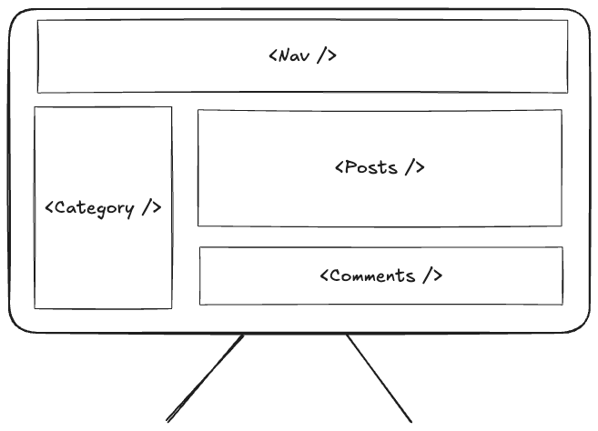
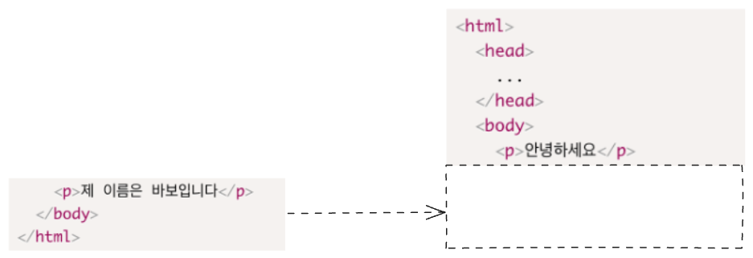
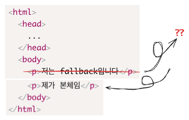
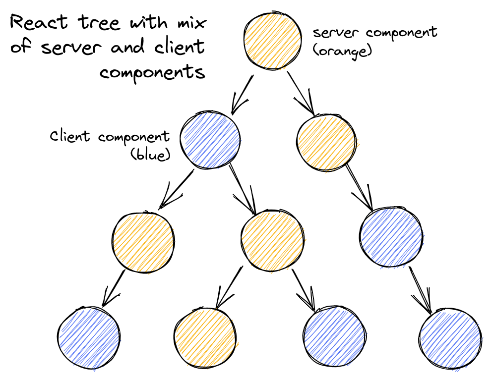
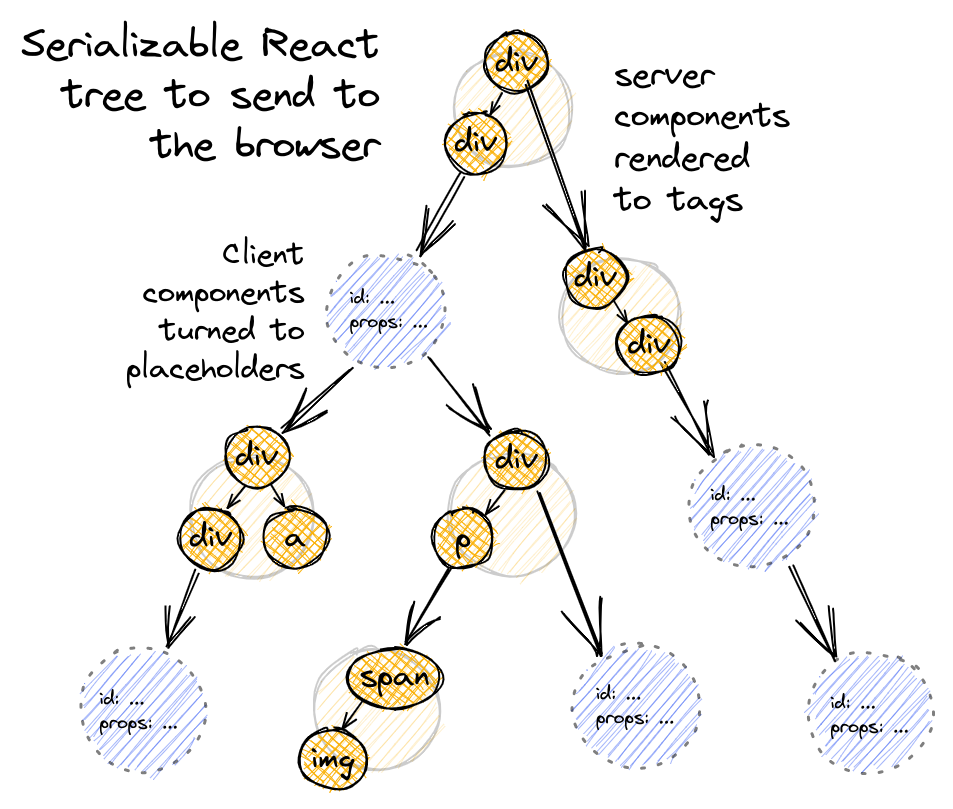
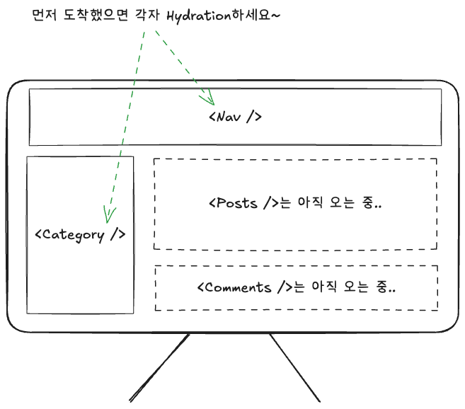
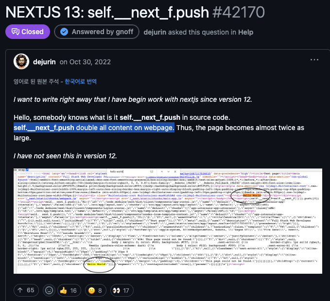

2022년 3월 React 18이 발표되며 **동시성 렌더링**이라는 패러다임이 소개되었습니다  
그리고 그 후속 마이너버전에서는 또 React Server Component가 소개되었고요  
이 뒤로는 이러한 React 18의 기능을 사용한 Next.js 13 App Router가 발표되는 등 아주 SSR계의 무대를 뒤집어놓았는데요  
3년이 지니난 지금 ~~뒷북이지만~~ 이 React 18 당시 어떤 일이 있었는지 대충 알아보려고 합니다

이번 글에서는  
React 18 이전에는 어땠고  
React 18 어떤 일이 있었고  
React 18 이후 어떤 변화가 있었는지  
Server Side Rendering 중심적으로 알아보려고 합니다

어느정도 React에 대해서 아시는 분을 대상으로 씁니다

# React 18 이전의 시대 - CSR vs SSR

React 18 업데이트와 관련하여 넷플릭스 시니어분이 말아주시는 [유튜브 영상](https://www.youtube.com/watch?v=pj5N-Khihgc&list=PLNG_1j3cPCaZZ7etkzWA7JfdmKWT0pMsa&index=4)이 있는데 길지 않으니 한번쯤 보셔도 괜찮을 것 같구요  
여기서는 React 18 이전에 CSR(Client Side Rendering)과 SSR(Server Side Rendering), 그리고 React 18 이후의 SSR에 대해 이야기합니다

<figure>


<figcaption>

출처: 유튜브 [Streaming Server Rendering with Suspense](https://www.youtube.com/watch?v=pj5N-Khihgc&list=PLNG_1j3cPCaZZ7etkzWA7JfdmKWT0pMsa&index=5)

</figcaption>
</figure>

Client Side Rendering(이하 CSR)은 전통적인 React의 렌더링 방식이라고 보시면 되는데요  
브라우저는 JS를 가져오고.. 데이터를 가져다가.. 컴포넌트를 렌더링합니다  
그 다음에서야 사용자는 화면을 보고 상호작용할 수 있습니다

여기서 인터넷이 느리거나, JS 번들사이즈가 크거나 하는 상황을 생각해보면  
`Load JS` 또는 `Fetch Data`에서 필연적으로 병목이 생기게 되고(서버까지 갔다와야 함)  
그동안 유저는 빈 화면을 보며 지루하기 짝이 없는 시간을 보냅니다


그 다음은 (동시성 업데이트 이전의) Server Side Rendering(이하 SSR)을 봅시다.


먼저 서버에서 데이터를 준비(fetch)하고, 컴포넌트를 실행하며 HTML을 한 번 생성하여 브라우저에 보내줍니다.  
브라우저는 HTML을 받았지만, 이건 그냥 진짜 HTML 그잡채라서 React 어플리케이션으로서의 기능이 없습니다  
따라서 그 다음에는 JS를 로드하고, Hydration을 진행합니다.

다시 인터넷이 느리거나 JS 번들 사이즈가 큰 상황을 생각해보면  
`Load JS` 단계에서 병목이 생길 수 있지만, 적어도 유저는 **화면을 볼 수는 있다**는 점이 다릅니다  
상호작용같은건 아직 못하겠지만요


그래도 유저는 상호작용이 준비되는 동안 빈 화면이라도 볼 수 있고 이는 유저 경험에 크게 유리해집니다  
이러한 맥락에서 영상에서는 Server Rendering을 이렇게 표현합니다

> Server rendering is an additional layer of optimization on top of a client rendered app.

## Hydration이 근데 뭔가요?

Hydration이라는 새로운 단어가 익숙하지 않으실 수 있으니 소개하고 넘어가겠습니다  
저도 사실 몇번 봐서는 자꾸 헷갈렸음

이 블로그 만드는데 쓰인 SSR/SSG 프레임워크인 [Gatsby.js의 문서](https://www.gatsbyjs.com/docs/conceptual/react-hydration/)에서는 Hydration을 이렇게 소개합니다

> Hydration is the process of using client-side JavaScript to add application state and interactivity to server-rendered HTML.

그러니까 **일개 HTML쪼가리를 어엿한 React Application으로 만들어주는 과정**인데요  
이벤트 핸들러를 붙여줘서 상호작용할 수 있게 하거나  
상태나 훅 등 React 기능을 붙여주거나  
등등..

이런걸 하려면 그 레시피인 JavaScript가 있어야 하니  
위에서도 Hydration 전에 `Load JS` 단계가 필요했던 것을 볼 수 있습니다

## React 18 이전 SSR의 한계?

근데 문제는 이 SSR의 전 과정이 *전체 어플리케이션*에 대해 동기적으로 일어난다는 점입니다  
각 과정을 "다같이" 진행해야하고 먼저 끝났다고 의리없이 혼자 가는건 못합니다


무슨 말이냐? 아래와 같은 예시를 생각해봅시다



이런 화면이 있을 때, 이 네 컴포넌트들에 대해

1. 필요한 전체 data들을 준비
2. 모든 컴포넌트를 HTMl로 한 번 렌더링하고, 클라이언트에 한번에 전달
3. 모두에 대한 JS를 로드
4. 전체를 Hydration

이런 식의 SSR 과정을 거치게 됩니다

여기서 `<Posts />`, 또는 `<Comments />`가 많은 데이터를 포함한다고 생각해봅시다(보통은 그렇죠?).  
그럼 `<Nav />, <Category />`는 이미 한참전에 준비가 끝났는데, 나머지를 기다리며 계에에속 기다려야 합니다  
이건 마치 짜장면과 탕수육 세트를 시켰는데, 짜장면이 먼저 나왔어도 탕수육이랑 같이 갖다주려고 계에에속 짜장면을 냅두는 상황과 같습니다


이렇게 React 18 이전의 SSR은 각 과정이 개별 컴포넌트 단위가 아닌 전체 어플리케이션(또는 더 쉽게, 페이지?) 단위로 진행되기 때문에 문제가 생기는데

1. **fetch everything** before you can **show anything** : 필요한 전체 데이터의 fetch를 모두 마치기 전까지 HTML을 만들어낼 수 없다
   - `<Posts />`의 data fetch는 오래걸리니까, 다른 부분은 준비가 되었는데도 이 데이터요청때문에 HTML 생성을 시작하지 못하는 경우가 생김
2. **load everything** before you can **hydrate anything** : 전체 앱을 위한 JS를 모두 로드해야만 hydration 단계를 시작할 수 있다
   - `<Nav />, <Category />`의 JS 로드가 먼저 끝나도 `<Posts />, <Comments />`의 JS 로드까지 완료되기를 기다리느라 hydration을 시작하지 못함
   - 그럼 유저는 상호작용할 수 없는 화면만을 보며 많게는 수 초를 기다리게 됨
3. **hydrate everything** before you can **interact with anything** : 모든 hydration작업이 끝날 때까지 유저는 상호작용 할 수 없다
   - 만약 `<Profile>`의 어떤 버튼을 click하고 싶더라도, `<Profile>`을 지나 `<Comments>`의 hydration까지도 기다린 다음에서야 클릭 가능

이 세 가지 문제점을 기억해두고, 이제 React 18에서 무슨 일이 일어났는지 보러갑시다

# React 18 - 동시성 업데이트

[React v.18.0 by The React Team](https://ko.react.dev/blog/2022/03/29/react-v18)

React에서 말하는 동시성의 핵심은 **렌더링이 중단 가능**하다 라는 것인데

- 이전에는 렌더링이 동기(Synchronous)적이어서, 어떤 컴포넌트의 렌더링을 일단 시작했다면 이게 끝나기 전까지 렌더링을 중단할 수 없었습니다
- 반면 **동시성 렌더링**은, 진행중이었던 렌더링을 중지했다 재개하거나, 심지어 진행중이던 렌더링을 아예 중단할 수도 있습니다

React 18은 이 동시성이란걸 어떻게 도달하게 한다는건지, 중요한 요소 몇 개만 개괄적으로 알아봅시다

## Suspense

컴포넌트 트리의 일부가 아직 준비되지 않았다면, `<Suspense>`를 사용하여 로딩상태를 *선언적*으로 지정할 수 있습니다

```jsx
<Suspense fallback={<Spinner />}>
  <Comments />
</Suspense>
```

이 코드블록은 "잠시만요, `<Comments />`가 아직 준비중이니 대신 `<Spinner />`를 드릴게요" 정도의 의미가 됩니다


구체적으로 Suspense블록 안에 뭘 넣어야 하는지, 또는 그게 완성되면 fallback을 어떻게 교체하는지, 등은 다음 글에서 알아보겠습니다

## Streaming

React 18에서는 새로운 서버 렌더링 API가 추가되었는데

`react-dom/server` 패키지는 Suspense를 사용한 스트리밍을 완전히 지원하기 위한 api를 제공합니다

- `renderToPipeableStream` : Node환경
- `renderToReadableStream` : 최신 엣지 런타임 환경(Deno, Cloudflare worker, ...)

라고는 하는데  
일단은.. "Suspense를 사용한 스트리밍"? 에서 이 **스트리밍**이 먼지 뭔저 봅시다

### Streaming HTML

HTTP/1.1 명세에 정의된 [`Transfer-Encoding` HTTP 헤더](https://developer.mozilla.org/ko/docs/Web/HTTP/Headers/Transfer-Encoding#chunked)를 `chunked`로 지정하여 HTML을 잘라서 보낼 수 있습니다


```json
"transfer-encoding": "chunked",
"vary": "Accept-Encoding",
"content-type": "text/html; charset=utf-8"
```

이 경우 `Content-Length`헤더는 생략되며, 브라우저는 종료 청크를 받기 전까지 연결을 끊지 않고 지속적으로 HTML 청크를 받습니다.



### Streaming SSR

위에서 `Transfer-Encoding: chunked`를 사용하여 브라우저에 HTML을 점진적으로 잘라 보낼 수 있다고 했는데요  
이 개념 + 위에서 살펴본 `react-dom/server` 패키지의 api를 사용하여 **서버 사이드 렌더링을 스트리밍**할 수 있습니다  
더 자세한 내용은 [Streaming Server Side Rendering Pattern](https://patterns-dev-kr.github.io/rendering-patterns/streaming-server-side-rendering/) 아티클 또는 [(번역) 스트리밍 HTML과 DOM 비교 알고리즘](https://soobing.github.io/react/html-node-streaming/) 아티클을 참고하시면 좋겠습니다

중요한건 Streaming과 Suspense를 함께 사용할 때인데  
서버에서 렌더링하다 Suspense를 만나면, fallback을 대신 가져간다고 했습니다  
이 때, Suspense가 끝날 때까지 Streaming은 아직 닫히지 않습니다  
이후 기다리던 Suspense가 끝나고 HTML이 도착하면, 이것이 fallback을 대체합니다

근데 완료된 Suspense가 나중에 도착하더라도 이미 fallback이 HTML에 알박기한 상태일텐데, 어떻게 이걸 갈아끼울 수 있을까요??



사실 React는 스트리밍 중에 완료된 Suspense 본체와 함께 작은 `<script>`태그를 같이 보내 HTML을 조작하고 fallback을 갈아끼우는데요  
이 마법에 대해서는 다음 글에서 자세히 보려고 합니다

### React Server Component

React 18의 추가 마이너 업데이트에서는 아기다리고기다리던 React Server Component(이하 RSC)가 추가되었는데요 :  
[React - 서버 컴포넌트](https://ko.react.dev/reference/rsc/server-components)  
[Vercel - What is React Server Component](https://vercel.com/blog/understanding-react-server-components)

React 팀에서는 서버 컴포넌트를 이렇게 소개합니다

> 서버 컴포넌트는 번들링 전에 클라이언트 앱이나 SSR 서버와는 분리된 환경에서 미리 렌더링되는 새로운 유형의 컴포넌트입니다

여기서 "분리된 환경" === "(RSC에서 말하는) 서버" 인 셈이구요  
빌드 시 한 번 실행되는 CI서버거나, 각 요청마다 실행되는 웹 서버이거나, 할 수 있습니다

> 서버 컴포넌트는 브라우저에 전송되지 않으므로 `useState`같은 상호작용 api를 사용할 수 없습니다. 대신 `'use client'` 지시어를 사용하여 클라이언트 컴포넌트를 사용합니다.

이전에는 리액트에서 "컴포넌트"라고 하면 종류는 하나였습니다. 클라이언트에서 렌더링되는 전통적인 그것인데  
이제 **서버 컴포넌트**라는 새로운 종류가 생겼고, 따라서 이와 구별하기 위해 이전의 종류는 **클라이언트 컴포넌트**라고 부르게 됩니다  
이 두 종류의 React Component에 대해서는 유우명하신 React Maintainer이신 Dan Abramov 선생님의 [The Two Reacts.](https://overreacted.io/the-two-reacts/) 아티클이 되게 내용이 좋습니다. 추천

아무튼간에 RSC는 **개별적으로** 데이터를 fetch하여 완전히 서버에서 렌더링되며, 그 렌더링의 결과물인 HTML은 클라이언트 측 React 트리에 **스트리밍**됩니다  
대신에 이 컴포넌트(JS 번들)는 클라이언트에 전달되지 않습니다. 클라이언트에 보내는 것은 단지 컴포넌트의 실행 결과물인 HTML입니다  
또한 RSC는 다른 RSC 또는 RCC(클라이언트 컴포넌트)들과 섞여 React 트리 내에서 혼재할 수 있습니다.

<figure>





<figcaption>

출처 [How React server components work: an in-depth guid](https://www.plasmic.app/blog/how-react-server-components-work#what-are-react-server-components)

</figcaption>
</figure>

이를 이해하기 위해 중요한 그림이 이것인데

- RSC(오렌지색)과 RCC(파란색)은 React Tree 내에서 혼재할 수 있고
- RSC는 서버에서 HTML로 렌더되며
- 그 과정에서 RCC는 placeholder(id, props 등등 참조를 남김)로 표시하고 패스

하단 그림과 같이 한번 Server-Render된 React Tree는 직렬화(문자열로 변환)되어 브라우저에 보내지는데, 이를 **RSC Payload**라고 부릅니다

RSC Payload에 대해 간략히 알아보기 전에, RSC의 특징을 살펴보고 지나갑시다  
가장 큰 RSC의 특징은 **비동기 컴포넌트**가 될 수 있다는 점인데

```tsx
export default async function Foo() {
  const data = await getFooData();
  return <div>{data.description}</div>;
}
```

이런게 가능합니다  
이러면 렌더링을 비동기적으로 진행하므로,  
`getFooData()`에서 Promise를 기다리기 위해 중단하고 나중에 resolve되면 다시 돌아와 렌더링을 재개할 수 있습니다.

그리고 RSC는 아래와 같은 제한사항을 가집니다 :

- RCC는 RSC를 import할 수 없습니다
  - 위에서 _RSC는 클라이언트에 전달되는 JS번들에 포함되지 않는다_ 라고 했습니다. 클라이언트에 전달되지 않으니 RCC에서 RSC를 찾으려 해도 찾을 수가 없겠네요
- RSC에 작성된 모든 코드는 **직렬화**가능해야 합니다
  - `useEffect`같은 React 라이프사이클 훅은 사용할 수 없고
  - props로 함수를 전달할 수 없습니다 (함수는 실행컨텍스트 등의 이유로 직렬화 불가)
- WebSocket 등 지속적인 업데이트를 지원하지 않습니다(대신 클라이언트 사이드에서 구현해야 함).

#### RSC Payload?

> The RSC Payload is a compact binary representation of the rendered React Server Components tree. It’s used by React on the client to update the browser’s DOM. The RSC Payload contains:

RSC 페이로드는 **렌더링된 React 서버 컴포넌트 트리의 압축된 바이너리 표현**입니다.  
클라이언트에서 React가 브라우저의 DOM을 업데이트하기 위해 사용됩니다.  
RSC 페이로드에는 다음이 포함됩니다 :

- 서버 컴포넌트의 렌더링 결과물
- 클라이언트 컴포넌트가 렌더링될 위치와 해당 JS파일에 대한 참조 등을 위한 placeholder
- 서버 컴포넌트에서 클라이언트 컴포넌트로 전달된 모든 props

한마디로 React 컴포넌트 트리 구조가 어떻게 구성되어있는지를 나타내는 별도의 문자열 포맷입니다  
앗 그런데 트리처럼 계층구조를 나타낼거면 그냥 JSON으로 하면 안될까요?  
근데 JSON은 구조상 열렸으면 닫혀야 유효한데, Streaming할 때는 닫히지 않는 경우가 있으니 이에 적합하지 않습니다

```json
{
  "a" : "foo",
  "b" : {
    "b-1" : "bar",
    "b-2" : "baz"
  // ❌ : JSON은 중괄호 쌍이 닫혀야 함
```

대신, 대충 아래와 같이 생겨먹습니다

```text
1:...
4:...
0:...
2:...
3:...
5::I[
  "(app-pages-browser)/./src/components/RCC.tsx",
  ["app/rcc-rsc/page", "static/chunks/app/rcc-rsc/page.js"],
  "RCC",
];
7:[
  "$",
  "div",
  null,
  {
    className: "flex flex-col border border-solid border-white p-2",
    children: [
      ["$", "span", null, { children: ["id: ", 30] }],
      ["$", "span", null, { children: ["userId: ", 2] }],
      ["$", "span", null, { children: ["title: ", "nemo perspiciatis repellat ut dolor libero commodi blanditiis omnis"] }],
      ["$", "span", null, { children: ["completed: ", true] }]
    ]
  }
];
```

이에 대해서는 다음 편에서 자세히 알아봅니다

## Selective Hydration

React 18에서는 또한 [Selective Hydration](https://github.com/reactwg/react-18/discussions/130)을 지원하는데, 이는 React 18에서 도입된 새로운 Streaming 아키텍처에 포함되는 개념입니다  
이는 **클라이언트에 먼저 도착한 컴포넌트는 먼저 hydrate**될 수 있게 구현합니다.



또한 심지어, 유저가 원하는 **특정 영역을 먼저 Hydration**할 수도 있습니다.  
예를 들어, 유저가 `<Nav />` 내의 버튼을 클릭한다면, 이 `<Nav />`의 Hydration 우선순우리ㅡㄹ 높입니다.

더 자세한 내용이 궁금하시다면 [Selective Hydration Pattern](https://patterns-dev-kr.github.io/rendering-patterns/selective-hydration/) 아티클 또는 [New in 18: Selective Hydration](https://github.com/reactwg/react-18/discussions/130) Github Discussion을 정독하시면 좋을 듯

# Post-React18의 SSR은 뭔가 다름

말이 길었는데요, 다시 아까 살펴봤던 React 18 이전의 SSR에서의 세 문제를 떠올려봅시다

(1) **fetch everything** before you can **show anything**  
(2) **load everything** before you can **hydrate anything**  
(3) **hydrate everything** before you can **interact with anything**

근데 이제 React 18에서 동시성 업데이트로 바뀐 SSR은 아래와 같아집니다


이제 일은 컴포넌트별로 각자 하고, ~~MZ사원처럼~~ 먼저 끝나면 먼저 퇴근합니다


그 덕분에 위 세 가지 문제를 해결하게 되는데:  
(1) Suspense 또는 RSC 등 비동기 렌더링으로, `Fetch Data` 단계에서 block되지 않고 각자 진행  
(2) Streaming SSR을 통해, `Render as HTML`이 끝나는 대로 브라우저에 전달하고 Hydration을 진행  
(3) Selective Hydration으로 개별 컴포넌트에 대한 Hydration을 먼저 완료

이처럼 서버 사이드 렌더링에서 **점진적 렌더링**을 가능케 하여, TTFB(Time To First Byte) 단축 등 성능 상의 이점을 제공합니다

# React 18이 가져온 변화 : Next.js 13 App Router

React 18이 공개되고 약 7개월 후, 대표적인 SSR 프레임워크인 Next.js는 [13버전](https://nextjs.org/blog/next-13#new-app-directory-beta)을 발표했는데  
이 업데이트에서는 기존 Pages Router와 다른, **App Router**라는 아예 새로운 패러다임이 등장해버렸습니다

이전의 Next.js Pages Router는 SSR을 지원하여 서버에서 초기 데이터를 로드하고, 미리 HTML을 준비하여 브라우저에 보낼 수 있게 했습니다  
그러나 이 "서버"에 접근하려면 다음 세 가지 메서드를 통해서만 가능했습니다 : `getStaticProps, getStaticPaths, getServerSideProps`


이 메서드들은 페이지의 최상단에만 위치할 수 있었으며, 따라서 초기 데이터 로드는 **페이지 단위**로만 가능했습니다.  
이것의 문제점은 위에서 살펴본 _React 18 이전 SSR의 한계_ 에서 다룬대로입니다

대신 Next.js 13에서 도입된 App Router는 :

- Server Components
- Streaming : UI를 조각별로 스트리밍하고 준비되는 대로 보여줌
- 컴포넌트 수준의 data fetching : `async` 서버 컴포넌트 + 확장된 `fetch` api

등 **동시성** 개념들을 지원합니다.  
덕분에 이전 pages router와 같이 페이지 단위가 아닌, **컴포넌트 단위**로 서버를 활용하고 점진적 렌더링이 가능해졌네요

---

\
원래 이번 글에서 RSC Payload나 Streaming이 어떻게 이루어지는지 예시까지 살펴보려고 했는데  
점점 길어져서 다음 편을 써야곘어요  
되게 대충대충 설명하고 넘어온 것 같은데 그래도 양이 많네요

다음편에서는 실제로 SSR이 어떻게 Streaming되는지  
Suspense 바운더리는 어떻게 교체되는지  
RSC Payload가 어떻게 생겨먹었는지  
등등을 실제로 간단한 코드와 함께 살펴보는 시간 갖도록 하겠습니다  
그리고..



웹페이지를 두 배 무겁게 만드는 Next.js???  
다음 글에 계속.
