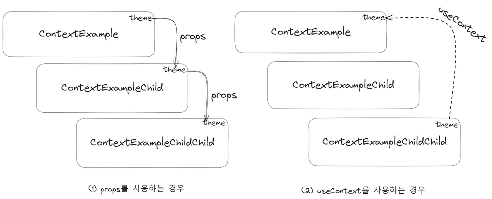
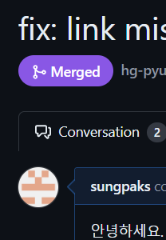

리액트 좀 해봤다 자랑하려면 Hook은 매우 필수적인 것 같은데요


오늘은 이 리액트에서 기본으로 제공하는 Built-in 훅에 대해 좀 알아봅시다  
[공식 문서](https://ko.react.dev/reference/react/hooks)를 참고해서요  
또한 적당한.. 직접 작성한 예제도 들고왔으니 한 번 잡솨보십시요

그리고 진정한 Hook선장이라면  
[Rules of Hooks](https://ko.react.dev/reference/rules/rules-of-hooks)에 대해서도 응당 읽어보고  
코드 짤 때 외않됌? 이라고 외치는 일 없도록 합시다.  
대충 이런 내용들이 있습니다

- 조건문, 반복문 내에서 Hook 호출 X
- 컴포넌트의 최상위 또는 커스텀 Hook 내에서 호출 (조건부 `return` 이후 이런거 X)

아무튼 시작해봅시다

# State Hooks

**State** 훅으로 사용자 입력 등의 정보를 **기억**할 수 있습니다.  
([_참고 : React는 "기억"해야 할 값들(현재 입력 값, 장바구나, ...)을 저장하기 위한 컴포넌트 별 메모리를 **state**라고 부릅니다._](https://ko.react.dev/learn/state-a-components-memory))


값을 유지하고 업데이트하며 리렌더링을 유발하게 하려면 **state**를 사용해야 함은 리액트의 기본이라고 할 수 있겠죠?

## useState & useReducer

`useState`먼저 살펴봅시다.

[**_useState_** 레퍼런스](https://ko.react.dev/reference/react/useState)

- 매개변수 :
  - `initialState` : **state**값의 초기 설정 값.
- 반환값 : 다음 두 개의 값을 가진 배열 반환
  - `state` : 현재 상태 값으로, 첫 번째 렌더링 시에는 `initialState`값과 일치
  - `set` 함수 : 상태 값을 업데이트하고 리렌더링을 유발.

`const [state, setState] = useState(initialState)`와 같이,  
**배열 구조 분해 할당**을 활용하여 작성하는 것이 국룰입니다

또는, 값을 엄격하게 관리하기 위해 `useReducer`를 사용해볼 수도 있습니다.

[**_useReducer_** 레퍼런스](https://ko.react.dev/reference/react/useReducer)

- 매개변수:
  - `reducer` : **state**의 업데이트를 지정할 Reducer 함수. 반드시 **state**와 **action**을 매개변수로 받고, 다음 렌더링에 사용될 **state**를 반환하는 순수함여야 합니다.
  - `initialArg` : **state**의 초기 설정값.
  - `init?` : **선택사항**으로, 초기 **state**를 반환하는 초기화 함수를 여기에 따로 할당해줄 수 있습니다. 할당된 경우 초기 **state**값은 `init(initialArg)`값입니다.
- 반환값 : 다음 두 개의 값을 가진 배열 반환
  - `state` : 현재 상태 값으로, 첫 번째 렌더링 시의 값은 - `init`이 있는 경우, `init(initialArg)` - `init`이 없는 경우, `initialArgs`
  - `dispatch` 함수 : 상태를 새로운 값으로 업데이트하고 리렌더링을 유발

`useState` 또는 `useReducer`를 사용하여 간단한 버튼 클릭 카운트 예제를 작성해볼 수 있습니다.

```jsx
/* StateExample.jsx */
import { useState } from "react";

function StateExample() {
  const [count, setCount] = useState(0);
  return /* ... */
}

export default StateExample;

/* ReducerExample.jsx */
import { useReducer } from "react";

function reducer(state, action) {
  if (action === "up") {
    return state + 1;
  }
  throw new Error("Unknown Action");
}

function ReducerExample() {
  const [count, dispatchCount] = useReducer(reducer, 0);

  return /* ... */
}

export default ReducerExample;
```

<iframe src="https://codesandbox.io/embed/8tlls5?view=preview&module=%2Fsrc%2Findex.js&hidenavigation=1"
     style="width:100%; height: 500px; border:0; border-radius: 4px; overflow:hidden;"
     title="state-and-reducer-sample"
     allow="accelerometer; ambient-light-sensor; camera; encrypted-media; geolocation; gyroscope; hid; microphone; midi; payment; usb; vr; xr-spatial-tracking"
     sandbox="allow-forms allow-modals allow-popups allow-presentation allow-same-origin allow-scripts"
   ></iframe>

# Context Hooks

보통 하위 컴포넌트에게 정보를 전달하기 위해 **props**를 사용하는데요

```jsx
function MyParent() {
  return <MyChildren data={data} />
}

function MyChild({ data }) {
  return <h1>{data}</h1>
}
```

머 이런 식으로 하겠죠?

그런데 이렇게 props를 전달하지 않고도 정보를 전달할 수 있습니다  
예시를 먼저 보면, 아래 예시는 상위 컴포넌트에서 변경되는 `theme`값을 자식 컴포넌트에서 **_구독_** 합니다.

```jsx
import { createContext, useContext, useState } from "react"

export const ThemeContext = createContext("LIGHT")
// Context를 생성하고 내보냅니다.

function ContextExample() {
  const [theme, setTheme] = useState("LIGHT")
  return (
    //Provider로 감싸 그 하위 컴포넌트들에 Context를 제공합니다.
    <ThemeContext.Provider value={theme}>
      <button
        onClick={() => {
          theme === "LIGHT" ? setTheme("DARK") : setTheme("LIGHT")
        }}
      >
        Change The Theme
      </button>
      <ContextExampleChild />
    </ThemeContext.Provider>
  )
}

function ContextExampleChild() {
  //이 컴포넌트에서는 Context를 읽지 않습니다.
  return (
    <div
      style={{
        border: "1px solid black ",
        padding: "10px",
      }}
    >
      <ContextExampleChildChild />
    </div>
  )
}

function ContextExampleChildChild() {
  //이 컴포넌트에서 Context를 읽습니다.
  const theme = useContext(ThemeContext)
  return (
    <div
      style={{
        //ThemeContext에서 얻어온 값에 따라 무언가를 합니다.
        backgroundColor: theme === "DARK" ? "black" : "white",
        border: "1px solid black ",
        color: theme === "DARK" ? "white" : "black",
        height: "100px",
      }}
    >
      2nd Child, Theme : {theme}
    </div>
  )
}

export default ContextExample
```

<iframe src="https://codesandbox.io/embed/tl5x4r?view=preview&module=%2Fsrc%2FContextExample.jsx&hidenavigation=1"
     style="width:100%; height: 500px; border:0; border-radius: 4px; overflow:hidden;"
     title="context-sample"
     allow="accelerometer; ambient-light-sensor; camera; encrypted-media; geolocation; gyroscope; hid; microphone; midi; payment; usb; vr; xr-spatial-tracking"
     sandbox="allow-forms allow-modals allow-popups allow-presentation allow-same-origin allow-scripts"
   ></iframe>

사실상 아래와 같이, props 폭포에 의한 의존성을 역전시키다시피 한 셈인데요



중간 컴포넌트가 몇 개건 간에 건너 뛰어버릴 수 있습니다.  
[이 문서](https://ko.react.dev/learn/passing-data-deeply-with-context)에서 **context**에 대해 더 자세히 알아볼 수 있습니다.

요약하자면, **Context**는 아래와 같이 사용합니다.

1. `export const MyContext = createContext(defaultValue)` 로 context를 생성하고 내보냅니다.
2. 부모에서 `<MyContext.Provider value={...}>`로 자식을 감싸면, 그 하위 자식들은 모두 **context**를 읽을 수 있습니다.
3. 자식 컴포넌트에서는 `useContext(MyContext)` **훅**으로 **context**를 읽습니다.

이렇게 상위 컴포넌트에서 `Context`를 제공하고, 하위 컴포넌트에서 `useContext`로 이를 **구독**할 수 있습니다.

# Ref Hooks

어떤 **정보를 기억**하고는 싶은데, **리렌더링을 유발하지 않게** 하려면 **_Ref_** 를 사용합니다.  
**state**와는 달리, **ref**는 업데이트해도 다시 렌더링되지 않습니다.
이렇게 하여 _리액트 패러다임에서 벗어날 수 있습니다._

- `const ref = useRef(defaultValue);`와 같이 선언합니다.
- `useRef`는 "_현재 값_" 에 해당하는 `current`값을 가진 객체를 반환합니다.
  - `{current: defaultValue}`과 같은 객체
- `ref.current` 프로퍼티를 사용하여 값에 값에 접근하고, 읽고 쓸 수 있습니다.
  - docs의 표현으로는, **React가 추적하지 않는 구성요소의 비밀 주머니인 셈입니다.**


아까 `useState`에서 했던 클릭 카운트 예제와 비슷한 것을 살펴봅시다

```jsx
import { useRef } from "react"

function RefExample() {
  const clickedRef = useRef(0) //useRef로 선언하였으므로, 업데이트되어도 렌더링X
  return (
    <>
      <button
        onClick={() => {
          clickedRef.current++ //ref 업데이트
        }}
      >
        click me
      </button>
      <button
        onClick={() => {
          alert(`you've been clicked ${clickedRef.current} times!!`)
        }}
      >
        check
      </button>
    </>
  )
}

export default RefExample
```

이번에는 `useRef`를 사용하여 비밀스럽게 카운트를 관리하고,  
**check**버튼을 눌러야먄 이를 확인할 수 있게 했습니다.

<iframe src="https://codesandbox.io/embed/rwhj2j?view=preview&module=%2Fsrc%2Findex.js&hidenavigation=1"
     style="width:100%; height: 500px; border:0; border-radius: 4px; overflow:hidden;"
     title="RefSample"
     allow="accelerometer; ambient-light-sensor; camera; encrypted-media; geolocation; gyroscope; hid; microphone; midi; payment; usb; vr; xr-spatial-tracking"
     sandbox="allow-forms allow-modals allow-popups allow-presentation allow-same-origin allow-scripts"
   ></iframe>

# Effect Hooks

또 하나의 React 패러다임의 "탈출구"로 **Effect**가 존재합니다.  
**Effect**가 그래서 뭔데? 를 알아보기 위해, **컴포넌트 내부의 2가지 로직 유형**에 대해 먼저 알아봅시다.

1. **렌더링 코드** : 컴포넌트는 props와 state를 적절히 활용하여 JSX를 반환합니다.

   - [렌더링 코드는 순수해야 합니다.](https://ko.react.dev/learn/keeping-components-pure) "부수 효과 없이 단순 계산만을 수행"하는 경우라고 볼 수 있습니다.

2. **이벤트 핸들러** : 단순 계산 뿐만 아니라, 일종의 *부수 효과*를 갖는, 컴포넌트 내부의 중첩 함수입니다.

   - 예를 들어, 이벤트 핸들러는 입력 필드를 업데이트 하는 등, 사용자의 이벤트에 의해 발생하는 *부수 효과*를 포함합니다.

그런데 *부수 효과*라는 애들은 이벤트에 연관되지 않는 경우가 있습니다.  
예를 들면, 마운트 시 채팅 서버에 접속한다거나, 모달을 바로 열어 보여주거나, ..  
이 예시들은 *부수 효과*임에도 특정 이벤트에 의한 효과가 아닙니다.

**Effect**는 즉 *렌더링 자체에 의해 발생하는 부수 효과*를 특정하는 셈입니다.  
이를 활용하여 컴포넌트에서 외부 시스템과 동기화할 수 있습니다.


이 뜻에 대해 [Docs에서 더 자세한 설명](https://ko.react.dev/learn/synchronizing-with-effects#what-are-effects-and-how-are-they-different-from-events)을 쭉 읽어보시면 좋을 것 같습니다  
`useEffect` 관련 내용은 리액트 개발에서 꽤나 중요하기 때문에... 잘 알아두면 좋은 것 같습니다

**useEffect**의 [레퍼런스](https://ko.react.dev/reference/react/useEffect#examples-dependencies)는 다음과 같이 생겼습니다  
`useEffect(setup, dependencies?)`

- 매개변수
  - `setup` : **Effect** 로직을 포함하는 함수입니다. 필요한 경우 **clean-up**함수를 반환할 수 있습니다.
    - React는 컴포넌트가 DOM에 추가된 이후(마운트 이후)에 `setup`함수를 실행합니다.
    - [clean-up 함수가 필요한 경우](https://ko.react.dev/learn/synchronizing-with-effects#step-3-add-cleanup-if-needed)
  - `dependencies`(선택) : `setup`함수의 코드 내부에서 참조되는 모든 반응형 값들을 포함한 배열로 구성됩니다.
    - 의존성 배열을 전달하지 않는 경우, 컴포넌트가 렌더링 또는 리렌더링 될 때마다 실행됩니다.
    - 빈 의존성 배열을 전달하는 경우, 초기 렌더링 이후 한 번만 실행됩니다.
    - 의존성 배열을 `[a, b]`와 같이 전달하는 경우, `a` 또는 `b`가 변경되면 실행됩니다.
- 반환값 `undefined`

마운트 시 모달을 냅다 보여주고, 모달 보여준 횟수를 콘솔에 찍는 코드를 짜봅시다.  
이를 위해서는,  
(1) 마운트 시 모달을 보여주기 위해, `useEffect`를 의존성 배열 없이 작성하고  
(2) `state`변화에 따라 `console.log`호출은 _순수 계산이 아닌_ **Effect**이므로, `useEffect`를 의존성 배열 `[count]`와 같이 작성해야 하겠습니다

```jsx
import { useEffect, useRef, useState } from "react"

function EffectExample() {
  const modalRef = useRef(null)
  const [count, setCount] = useState(0)

  useEffect(() => {
    // 의존성 배열을 비워 최초 마운트 시에만 Effect를 적용
    modalRef.current.showModal()
    return () => {
      modalRef.current.close()
    }
  }, [])

  useEffect(() => {
    // 의존성 배열에 count를 전달하여, count가 변경되면 side Effect 발생
    console.log(count)
  }, [count])

  return (
    <div>
      <dialog ref={modalRef}>
        하와와~ 모달인거시와요
        <button onClick={() => modalRef.current.close()}>닫기</button>
      </dialog>
      <button
        onClick={() => {
          modalRef.current.showModal()
          setCount(count + 1)
        }}
      >
        열기
      </button>
    </div>
  )
}

export default EffectExample
```

<iframe src="https://codesandbox.io/embed/v9vfl7?view=preview&module=%2Fsrc%2FEffectExample.jsx&hidenavigation=1"
     style="width:100%; height: 500px; border:0; border-radius: 4px; overflow:hidden;"
     title="EffectSample"
     allow="accelerometer; ambient-light-sensor; camera; encrypted-media; geolocation; gyroscope; hid; microphone; midi; payment; usb; vr; xr-spatial-tracking"
     sandbox="allow-forms allow-modals allow-popups allow-presentation allow-same-origin allow-scripts"
   ></iframe>

이외에도 `useEffect`와 미묘한 타이밍 차이를 갖는 변형으로  
`useLayoutEffect`라거나.. `useInsertionEffect`같은게 있는데  
건너뜁시다.

# Performance Hooks

리렌더링 시 불필요한 작업을 건너뛰도록 하여 성능을 최적화해볼 수 있겠는데요


다음 두 훅이 그런거 하려고 만들어졌습니다

- `useMemo`를 사용하여 값을 캐싱합니다.
- `useCallback`를 사용하여 함수 정의를 캐싱합니다.

이런거 하기 전에 [**메모이제이션**](https://ko.react.dev/reference/react/useMemo)에 대해 또 알고 넘어가면 좋을 것 같네요  
대충 *이전에 썼던 값을 캐싱하고 나중에 다시 써먹는 것을 메모이제이션*이라고 합니다

위와 같은 메모이제이션 훅들은 공통적으로 *의존성이 변하지 않았다면 캐싱된 값을 재사용*하는데  
의존성이 변경되어 꼭 UI를 다시 그려야 할 때가 있습니다..  
그런 경우에도 좀 더 매끄러운 사용자 경험을 도모하기 위해  
`useTransition`이나 `useDeferredValue`같은 훅도 있습니다  
천천히 한번 알아봅시다

## useMemo

`useMemo`훅으로 값이 불필요하게 새로 계산되는 것을 막을 수 있습니다


`useMemo(calculateValue, dependencies)` [레퍼런스](https://ko.react.dev/reference/react/useMemo)는 아래와 같습니다

- 매개 변수
  - `calculateValue` : 캐싱하려는 값을 계산하는 순수 함수. 인자는 없으며, 모든 타입의 값을 반환할 수 있어야 합니다.
  - `dependencies` : `calculateValue` 내에서 참조되는 모든 반응형 값들의 배열입니다.
- 반환값
  - 마지막 렌더링 이후로 `dependencies`에 변경이 있는 경우 : `calculateValue`를 다시 호출하여 결과를 반환하고, 그 값을 저장
  - 그렇지 않은 경우 : `calculateValue`를 건너뛰고, 저장했던 값을 반환

이제 `usemMemo`를 활용하여 값을 캐싱하는 ~~억지~~예제를 하나 만들어봅시다

```jsx
import { useMemo, useState, useEffect } from "react"
import { wait } from "./util"

function MemoExample() {
  const [isDarkMode, setIsDarkMode] = useState(false)
  const [isSelected, setIsSelected] = useState(false)
  //useMemo로 text값을 정의하여, isSelected가 변경될 때만 wait(isSelected) 수행
  const text = useMemo(() => wait(isSelected), [isSelected])
  //const text = wait(isSelected);
  //useMemo 쓰지 않으면 리렌더링 시 wait를 다시 수행합니다.

  return (
    <div
      style={{
        backgroundColor: isDarkMode ? "black" : "white",
        color: isDarkMode ? "white" : "black",
      }}
    >
      <div style={{ textDecoration: isSelected ? "line-through" : "none" }}>
        <label>
          <input
            type="checkbox"
            onChange={() => {
              setIsSelected(prev => !prev)
              //isSelected가 변경되므로 text 재계산
            }}
          ></input>
          {text}
        </label>
      </div>
      <button
        onClick={() => {
          setIsDarkMode(prev => !prev)
          //isSelected는 변경되지 않으므로, text는 새로 계산하지 않는다
        }}
      >
        change theme
      </button>
    </div>
  )
}

export default WithUseMemo
```

체크박스를 선택하여 TODO를 ~~DONE~~ 으로 만들거나, 반대로 할 수 있습니다.
또한 버튼을 클릭하여 다크모드로 테마를 바꿔볼 수 있습니다.
이 때, 체크박스 선택 유무에 따른 텍스트를 가져오기 위해, 억지로 500ms를 기다리는 `wait` 함수를 거칩니다.

<iframe src="https://codesandbox.io/embed/clx7p9?view=preview&module=%2Fsrc%2FWithUseMemo.jsx&hidenavigation=1"
     style="width:100%; height: 500px; border:0; border-radius: 4px; overflow:hidden;"
     title="useMemo-and-useCallback-sample"
     allow="accelerometer; ambient-light-sensor; camera; encrypted-media; geolocation; gyroscope; hid; microphone; midi; payment; usb; vr; xr-spatial-tracking"
     sandbox="allow-forms allow-modals allow-popups allow-presentation allow-same-origin allow-scripts"
   ></iframe>

위쪽은 `useMemo`를 사용하여 `const text = useMemo(() => wait(isSelected), [isSelected]);`와 같이 작성한 경우,  
아래쪽은 `const text = wait(isSelected);`와 같이 `useMemo` 없이 작성한 경우입니다.  
체크박스를 선택하거나 해제하면 TODO 또는 DID를 다시 연산해야 하기 때문에 500ms를 공통적으로 기다리지만,  
**change theme**버튼을 클릭하는 경우 차이가 납니다.  
`useMemo`를 사용한 경우, 값을 캐싱하여 연산을 건너뛰기 때문에 바로바로 바뀌는 모습을 확인할 수 있습니다.

## useCallback

위 데모에서, **[useCallback 예시 보기]** 버튼을 눌러 `useCallback` 사용 예제도 한 번 확인해보세요

`useCallback` 예제와 미사용 예제 둘 다 렌더링 시 500ms를 기다리게 됩니다  
다른 점은, `useCallback` 예제는 카운트 증가나 테마 변경 등 리렌더링이 일어나도 500ms를 다시 기다리지 않지만  
미사용 예제는 카운트나 테마를 변경하면 매번 다시 500ms를 기다려버립니다  
왜 이런 결과가 일어날까요??

일단 먼저 [memo](https://ko.react.dev/reference/react/memo)라는 API를 먼저 알고 넘어갑시다  
이 `memo`로 컴포넌트를 감싸면, **props가 변경되지 않은 경우 리렌더링을 패스**합니다.

앗 ! 그런데 JavaScript에서 함수는 [일급 객체](https://ko.wikipedia.org/wiki/%EC%9D%BC%EA%B8%89_%EA%B0%9D%EC%B2%B4)입니다

```js
const f1 = () => {
  return 0
}
const f2 = () => {
  return 0
}
console.log(f1 === f2) // false
```

같은 동작의 함수라도 객체마냥 그 참조가 다르다는 것인데요..  
그럼 렌더링마다 함수들도 객체처럼 다시 생성되는거고  
앗! 그럼 `memo`로 감싸도, props에 함수가 있다면  
매번 다른 함수가 전달되는 셈이라서 리렌더링을 피할 수 없습니다


이 때 구원투수로 `useCallback`이 등장합니다
`useCallback` 훅으로 함수 정의를 캐싱하여 **진짜 아까랑 똑같은 함수**로 유지되게 할 수 있습니다.

`useCallback(fn, dependencies)` [레퍼런스](https://ko.react.dev/reference/react/useCallback)는 아래와 같습니다

- 매개변수
  - `fn` : 캐싱할 함수입니다. 이 함수는 어떤 인자나 반환값도 가질 수 있습니다.
  - `dependencies` : `fn`내에서 참조되는 모든 반응형 값들의 배열입니다.
- 반환값
  - 첫 렌더링 시, `fn`함수를 그대로 반환합니다.
  - 이후 렌더링 시 `dependencies`에 변경이 없다면, 이전에 저장한 함수를 반환합니다.
  - 이후 렌더링 시 `dependencies`에 변경이 있다면, 새로 생성된 함수를 반환합니다.

이제 이 훅으로 어떻게 리렌더링을 최소화했는지 봅시다  
위 예시 구현에 사용된 코드는 아래와 같습니다

```jsx
import { useCallback, useState } from "react"
import { wait } from "./util"
import React from "react"

//memo를 사용하여, 컴포넌트의 onClick함수가 변경되지 않은 경우 리렌더링을 건너뜁니다
const Child = React.memo(({ onClick }) => {
  //Child는 onClick함수를 전달받아 버튼 컴포넌트를 생성하되, 500ms를 매번 기다립니다.
  wait()
  console.log("Child Rendered")
  return (
    <div>
      <button onClick={onClick}>클릭</button>
    </div>
  )
})

function WithUseCallback() {
  const [count, setCount] = useState(0)
  const [dark, setDark] = useState(false)

  //Child에 전달할 onClick함수를 useCallback으로 감싸고, 의존성 배열은 비워 최초 1회만 생성되게 합니다.
  const increment = useCallback(() => {
    setCount(prev => prev + 1)
  }, [])
  const toggleTheme = () => {
    //테마를 반전하는 함수.
    console.log("Theme Toggled")
    setDark(prev => !prev)
  }

  return (
    <div
      style={{
        backgroundColor: dark ? "black" : "white",
        color: dark ? "white" : "black",
      }}
    >
      <h4>✅ useCallback 사용</h4>
      <h1>Count: {count}</h1>
      <Child onClick={increment} />
      <button onClick={toggleTheme}>Toggle Theme</button>
    </div>
  )
}

export default WithUseCallback
```

`Child`는 `React.memo(({onClick})=>{})`과 같이 작성하여, `onClick`이 변하지 않는 한 메모이제이션되어 리렌더링되지 않게 합니다.  
그러나 `useCallback`을 사용하지 않는 경우, 매 렌더링마다 `increment`함수가 매번 재생성되어 `Child`에 전달되므로, `Child`는 매번 재렌더링됩니다.
이를 `useCallback`을 적용하면, `increment`함수를 최초 렌더링 시에만 생성하고, 이를 캐싱하여 재생성되지 않게 합니다. 따라서 `Child`에 전달되는 `increment`함수는 매번 동일한 놈이며, 따라서 `Child`또한 최초 1회만 리렌더링됩니다.

## useTransition

React 18에서 **Transitions**라는 개념이 도입되었는데  
이는 [긴급한 업데이트와 긴급하지 않은 업데이트를 구분하는 개념](<https://www.frontoverflow.com/question/46/useTransition()%20%ED%9B%85%EC%9D%98%20%EC%97%AD%ED%95%A0%EC%9D%B4%20%EB%AD%94%EA%B0%80%EC%9A%94%3F>)입니다.  
state를 _긴급하지 않게_ 업데이트 하여 UI를 block하지 않는 것을 **Transition**이라고 칭하며  
이를 가능하게 하는 것이 `useTransition` 훅입니다.  
뒤에서 몰래 준비하는거라고 하면 이해가 빠를까요?


[레퍼런스](https://ko.react.dev/reference/react/useTransition)는 아래와 같습니다.  
`const [isPending, startTransition] = useTransition();`

- 매개변수 : X
- 반환값
  - `isPending` : 대기중인 Transition 존재 여부
  - `startTransition` : 상태 업데이트를 Transition으로 수행하게 하는 함수

예제가 빠질 수 없겠죠?

```jsx
import { useTransition, useState, useEffect } from "react"
import { wait, Done, Todo } from "./utils"
import Button from "./Button"

function TransitionExample() {
  const [tab, setTab] = useState(0)
  const [isPending, startTransition] = useTransition()

  function setTabTransitionally(nextTab) {
    startTransition(() => setTab(nextTab))
  }

  return (
    <div>
      <Button onClick={() => setTabTransitionally(0)} selected={tab === 0}>
        홈
      </Button>
      <Button onClick={() => setTabTransitionally(1)} selected={tab === 1}>
        할 일 목록(✅useTransition)
      </Button>
      <Button onClick={() => setTab(2)} selected={tab === 2}>
        한 일 목록(❌useTransition)
      </Button>
      <Button onClick={() => setTabTransitionally(3)} selected={tab === 3}>
        한 일 목록
      </Button>
      <div>
        {isPending ? "로딩중..." : ""}
        {!isPending && tab === 1 && <Todo />}
        {!isPending && tab === 2 && <Todo />}
        {!isPending && tab === 3 && <Done />}
      </div>
    </div>
  )
}

export default TransitionExample
```

`Todo`컴포넌트는 500개 아이템을 렌더링하는데, 각 아이템 생성에 1ms가 소모되게 억지로 구성했습니다.  
사용자가 `Todo`가 표시되도록 잘못 누르기라도 하면..  
꼼짝없이 로딩을 기다려야만 합니다  
그러나 `useTransition`과 함께라면, 뒤에서 준비하던 `Todo` 렌더링을 폐기해버리면 그만입니다.

<iframe src="https://codesandbox.io/embed/4dp67x?view=preview&module=%2Fsrc%2FTransitionExample.jsx&hidenavigation=1"
     style="width:100%; height: 500px; border:0; border-radius: 4px; overflow:hidden;"
     title="transition-sample"
     allow="accelerometer; ambient-light-sensor; camera; encrypted-media; geolocation; gyroscope; hid; microphone; midi; payment; usb; vr; xr-spatial-tracking"
     sandbox="allow-forms allow-modals allow-popups allow-presentation allow-same-origin allow-scripts"
   ></iframe>

**[할 일 목록]** 버튼 두 개 중, `useTransition`을 사용한 버튼을 누른 후 바로 **한 일 목록**같은 탭으로 넘어가보세요.  
`useTransition`을 적용한 버튼은 로딩을 취소하고 바로 넘어갈 수 있습니다  
그러나 이 훅을 사용하지 않은 버튼은 한 번 클릭하면  
꼼짝없이 기다려야만 다른 탭으로 넘어갈 수 있습니다

## useDeferredValue

`useDeferredValue` 훅을 사용하면 일부 UI 업데이트를 **지연**시킬 수 있습니다.  
"지연하다, 연기하다" 이런 뜻을 가지는 _defer_ 단어에 맞게요

마치 잔상을 남기는 것과 비슷합니다  
**state**가 새롭게 업데이트 되면,  
React는 이전 값으로 먼저 리렌더링을 시도한 뒤  
백그라운드에서는 새로 업데이트된 값으로 리렌더링을 시도합니다.  
이후 준비되었다면 완료된 리렌더링을 화면에 표시합니다.


[레퍼런스](https://ko.react.dev/reference/react/useDeferredValue)는 아래와 같습니다  
`useDefferedValue(value, initialValue?)`

- 매개변수
  - `value` : 지연시키려는 값으로, 모든 타입을 가질 수 있습니다.
  - `initialValue` (_optional, Canary only_)
- 반환값
  - `currentValue` : 첫 렌더링에서는 (아직 *이전*값이 없으므로) `value`와 동일합니다. 업데이트가 발생하면 (1) 먼저 이전 값과 동일한 반환값으로 리렌더링을 시도하고, (2) 백그라운드에서 새 값과 동일한 반환값으로 리렌더링을 시도합니다.

아까처럼 억지로 리스트 아이템 하나하나 생성할 때마다 1ms씩 걸리는 예제를 생각해봅시다  
업데이트는 빈번한데 매 업데이트가 좀 걸리는 작업이라면  
`useDeferredValue`를 적절히 활용하여 잔상을 남길 수 있습니다

```jsx
/* ---- DeferredValueExample.jsx ---- */
import { useState, useDeferredValue } from "react";
import SlowComponent from "./SlowComponent";

function DeferredValueExample() {
  const [data, setData] = useState("");
  const deferredData = useDeferredValue(data);
  const isStale = data === deferredData;
  //const isStale = true;
  return (
    <div>
      <h2>✅useDefferedValue</h2>
      <input value={data} onChange={(e) => setData(e.target.value)}></input>
      <SlowComponent data={deferredData} isStale={isStale} />
    </div>
  );
}

export default DeferredValueExample;

/* ---- SlowComponent.jsx ---- */
import { memo } from "react";

const SlowComponent = memo(({ data, isStale }) => {
  if (!data) return;
  let listItems = [];
  for (let i = 0; i < 100; i++) {
    listItems.push(<SlowItem data={data} key={i} />);
  }
  return (
    <ul
      style={{
        color: isStale ? "black" : "gray",
      }}
    >
      {listItems}
    </ul>
  );
});

const SlowItem = ({ data }) => {
  const start = performance.now();
  while (performance.now() - start < 1) {
    //wait
  }
  return <li>{data}</li>;
};

export default SlowComponent;
```

**SlowComponent**에서는 1ms씩 걸리는 아이템을 100개 생성합니다  
input란에 타이핑을 칠 때마다 실시간으로 검색이 되게 하였습니다  
이러면 `memo`로 **SlowComponent**를 감싼다 하더라도,  
매 타이핑마다 props가 바뀌어버려서 리렌더링을 피하기 어렵습니다

이 때 `useDeferredValue`를 사용하여  
(1) 백그라운드에서는 새로 업데이트 된 `data`값으로 리렌더링 결과 화면을 준비하고  
(2) 그 전까지는 이전 값(잔상)을 기반으로 화면을 보여줍니다.

이 예제에서는 현재 보는 화면이 잔상에 의한 것인지 알려주기 위해  
잔상인가? 를 확인하여 텍스트를 회색으로 보이게 했습니다

<iframe src="https://codesandbox.io/embed/wm3tz7?view=preview&module=%2Fsrc%2FSlowComponent.jsx&hidenavigation=1"
     style="width:100%; height: 500px; border:0; border-radius: 4px; overflow:hidden;"
     title="deferred-value-sample"
     allow="accelerometer; ambient-light-sensor; camera; encrypted-media; geolocation; gyroscope; hid; microphone; midi; payment; usb; vr; xr-spatial-tracking"
     sandbox="allow-forms allow-modals allow-popups allow-presentation allow-same-origin allow-scripts"
   ></iframe>

아?? "deffered"라고 썼네요; "deferred"인데,, 이거 자꾸 헷갈립니다 ㅋㅋ  
아무튼

왼쪽과 오른쪽 둘 다 다다닥 빠르게 타이핑하여 비교해보시면  
초당 100회의 타이핑이 발생하더라도  
왼쪽(`useDeferredValue`)는 잔상이라는 것을 알리기 위해서만 단 한 번 리렌더링합니다  
그러나 오른쪽(안 쓴 경우)는 계속.. 새로운 업데이트를 위해 안간힘을 씁니다

# Other Hooks

이외에도 고유 id를 생성하는 `useId`같은 다른 훅이 있지만

> 다음 Hook은 대부분 라이브러리 작성자에게 유용하며 애플리케이션 코드에서는 일반적으로 사용되지 않습니다.

라고 하니 더 알아보고 싶다면 [여기로](https://ko.react.dev/reference/react/hooks#other-hooks)

---

# 마무리

리액트는 아무래도 훅이 좀 중요하니까  
잘 정리하고 깊게 알아두고 싶어서  
일부러 코드 샌드박스 예제로 써가면서 들고 왔는데..


아오.. 꽤나 후회했답니다?

그리고 ㅋㅋㅋ 이거 하다가 공식문서 코리안버전에서  
링크가 잘못 들어간 경우를 발견해버려서  
이거 두 줄 고쳐서 기여했는데  
깃허브에 동네방네 소문나버려서 좀.. ^^; 머쓱ㅋㅋ



이만 마칩니다
