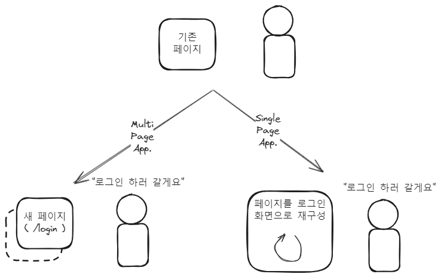

아시다시피, React는 미리 준비된 페이지를 가져다 보여주는 것이 아닌  
클라이언트 사이드에서 자바스크립트를 사용하여 동적으로 뷰를 업데이트합니다.  
이는 곧 경로 하나 깜빡 하지 않고도 모든 페이지를 그려내게 된다는 것인데  
이렇게 페이지를 적당히 필요한 부분만 다시 그리며 뷰를 바꾸는 것을 **SPA (Single Page Application)** 이라고 하고  
요청에 따라 미리 준비된 페이지를 보여주는 것은 **MPA (Multi Page Application)** 이라고 합니다



이런 식으로 된다는 것입니다

근데 이렇게 SPA식으로 하면  
로그인 페이지와 내 정보 페이지를 어떻게 구분할까요?  
MPA라면 URL로 `sungpaks.com/login`, `/sungpaks.com/my-page` 이런 식으로 구분될 수 있습니다  
그런데 SPA는 그렇지 못하죠.. 그냥 `sungpaks.com/`인데 어떨 때는 로그인 페이지고 어떨 때는 내 정보 페이지인겁니다  
이러면 뒤로가기 또는 특정 페이지로 이동하기처럼, 경로가 필요한 동작이 제한적입니다.  
특히 가장 중요한! 인증 여부에 따라 접근을 허가하거나 제한하는 일이 까다롭겠죠

그래서 [React Router](https://reactrouter.com/en/main)라는 것이 등장하여  
이 경로를 정의하고 구분하는, **라우팅**을 쉽게 할 수 있게 해주었습니다  
이것만 있으면 제 맘대로 "여기는 `/login` 경로에 해당하는 페이지야" 라고 정의할 수 있습니다


이제 저는 로그인 여부에 따라  
어떤 페이지는 로그인을 해야만 들어갈 수 있고  
어떤 페이지는 로그인을 안 했어야 들어갈 수 있게 하고 싶습니다  
예를 들어, 마이페이지는 당연히 로그인을 해야 하니, 안 했다면 로그인 페이지로 리다이렉션  
로그인 페이지는 응당 로그인을 안 했어야 들어가게, 로그인 했다면 홈으로 리다이렉션  
이런거요

React Router와 함께 이를 구현해봅시다

# React Router

[React Router 튜토리얼](https://reactrouter.com/en/main/start/tutorial)에 시작하는 법이 잘 나와있습니다  
먼저 `npm install react-router-dom`으로 의존성을 설치해주시고

`/en/main/start/tutorial`같은 우리가 생각하는 url path는 _browser router_ 라고 합니다.  
우리는 이 browser router를 만드는 것인데요

튜토리얼에 따르면, 먼저

```jsx

import import {
  createBrowserRouter,
  RouterProvider,
} from "react-router-dom";

const router = createBrowserRouter([
	{
		path: "/",
		element: <div>world!</div>,
	},
	{
		path: "/hello",
		element: <div>hello world!</div>,
	}
]);
```

이렇게 `createBrowserRouter`로 라우터를 정의하고,  
그 안에 경로와 그에 따른 요소들을 작성해줍니다.  
그런 다음, 최상위 컴포넌트에서, 다음과 같이 작성합니다.

```jsx
ReactDOM.createRoot(document.getElementById("root")).render(
  <React.StrictMode>
    <RouterProvider router={router} />
  </React.StrictMode>
)
```

미리 정의한 라우터를 `<RouterProvider>`에 집어넣어주면 완성입니다.

그런데 좀 더 리액트스러운 방식으로, [createRoutesFromElements](https://reactrouter.com/en/main/utils/create-routes-from-elements)를 사용하여 아래와 같이 할 수도 있습니다.

```jsx
const router = createBrowserRouter(
	createRoutesFromElements(
		<>
			<Route path="/hello" element={<Hello />}>
		</>
	)
)
```

게다가 상위 `Route`로도 감싸서, 당초 원했던 **권한에 따른 경로 분류**를 구현할 수 있습니다.


아래처럼요

```jsx
const router = createBrowserRouter(
  createRoutesFromElements(
    <>
      <Route element={<PrivateRoute />}>
        {/* 로그인이 필요한 페이지 정의 */}
        <Route path="/home" element={<Home />} />
      </Route>
      <Route element={<PublicRoute />}>
        {/* 로그인 없이 접근하는 페이지 정의 */}
        <Route path="/" element={<div>default page</div>} />
        <Route path="/login" element={<Login />} />
      </Route>
    </>
  )
)
```

음.. 근데 사실 `<PrivateRoute />`와 `<PublicRoute />`는 공짜로 주어지는게 아니라서 직접 작성해줘야 합니다

# PrivateRoute

`<PrivateRoute />`에는, "로그인 상태가 아닌 경우 로그인 페이지로 리다이렉션, 그게 아니면 통과!"  
이렇게 되는 로직을 작성해야겠죠?  
`AuthContext`가 최상위 컴포넌트에서 제공되어서, `useContext(AuthContext)`로 언제든 `isAuthenticated` 여부를 가져올 수 있다고 가정합시다.

```jsx
import { Navigate, Outlet } from "react-router-dom"
import { useContext } from "react"
import AuthContext from "../context/AuthContext"

export default function PrivateRoute() {
  const { isAuthenticated } = useContext(AuthContext)

  /* 다른 필요한 로직들 */

  return isAuthenticated ? <Outlet /> : <Navigate to="/login" />
}
```

그럼 간단히 이렇게 쓰면 되겠습니다.  
`<Outlet />`으로 하위 Route로 통과시킬 수 있으며,  
`<Navigate to={path}>`로 원하는 Route로 리다이렉션시킬 수 있습니다

`AuthContext`말고도 전역 상태 관리 라이브러리를 이용하여 인증 여부를 어디서든 볼 수 있게 해도 괜찮겠네요  
저같은 경우는 `AuthContext`라는 context를 사용하기로 했으니

```jsx
// App.jsx

function App() {
  return (
    <AuthProvider>
      <RouterProvider router={router} />
    </AuthProvider>
  )
}
```

이렇게 `Provider`로 감싸줬습니다

# navigate, location

또한 React Router는 경로 관리와 관련하여 다른 편한 기능들도 제공하는데


[useNavigate](https://reactrouter.com/en/main/hooks/use-navigate)와 [useLocation](https://reactrouter.com/en/main/hooks/use-location) 훅입니다  
다른 어디서도 사용할 수 있게, `const navigate = useNavigate();`, `const location = useLocation();` 이렇게 해두고 시작합니다.

먼저, `navigate`함수는  
`navigate(-1)`과 같이 써서 뒤로가기를  
`navigate("/to/go")`와 같이 써서 리다이렉션을  
할 수 있는데, 어라

> It's usually better to use [redirect](https://reactrouter.com/en/main/fetch/redirect) in [loaders](https://reactrouter.com/en/main/route/loader) and [actions](https://reactrouter.com/en/main/route/action) than this hook

이라고 하네요.  
이에 대해 잠깐 알아보고 가자면

- `redirect` : 다른 route로 리다이렉션할 때 사용 (`navigate(/to/go)`처럼)
- `loader` : route 요소가 렌더링되기 전에, 해당 요소에 제공할 데이터를 fetch하는 함수를 정의합니다.
  - `createBrowserRouter`에서, `loader: async () => fetch(url)` 처럼
- `action` : 해당 경로로 non-get 요청이 호출되면 실행할 콜백함수입니다.

아차, 이런 data api들은 `<BrowserRouter>`같은 라우터에는 사용할 수 없으니 [Picking a Router](https://reactrouter.com/en/main/routers/picking-a-router) 여기를 참고합시다.

그리고 `location`은 현재 경로에 대한 여러 정보를 사용할 수 있습니다.  
예를 들면, `google.com/foo`같은 경로에서  
`location.pathname`으로 `/foo`만 가져올 수 있습니다.

그리고 `location`과 `navigate`를 조합하여 사용하면  
아까부터 느꼈던.. 그럼 props는 어디로 전달하지?? 라는 충동을 해결할 수 있는데  
바로. `location`과 `navigate`에서 `state`를 사용하는 거십니다.

<figure>


<figcaption>
use-navigate-location-use
</figcaption>

</figure>

예를 들어, `userId = 1`이라는 값을 `/my-page` 경로에 전달하고 싶다면  
`navigate('my-page', { state : { userId : 1 }})`과 같이 작성하여 `state`에 키-밸류 쌍으로 넘겨줍니다.  
그럼 이제, 도착한 컴포넌트에서는  
`location.state.userId`로 해당 정보를 가져올 수 있습니다.

# 끝

입니다.
