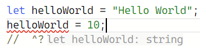

안녕하세요.\
오늘은 TypeScript 가져왔습니다.\
저도 TypeScript는 처음 써보는데요..\
이게 저는 C나 C++, Java..같은\
`int a = 10;` 이런 것만 해봤고\
이거에 익숙해서 그런지\
그냥 냅다 `const a = 10;` 이런 식으로 쓰는거 정말 적응 안됩니다.\
그리고 요새는 파이썬을 또한 다시 만져보고 있는데\
`a = 10` 이건 정말.. 더 그러네요

아무튼 이렇게 Javscript는 타입이 불분명하다는 점 때문에 다른 사람들도 어지간히 불편했나 봅니다.\
이런 니즈가 있었기에 마이크로소프트에서 **TypeScript**라는 것을 내놓았는데요\
꽤나 널리 쓰이게 된지 좀 된 것 같습니다

그래서 남들 하는건 저도 해야겠으니\
어떻게 공부를 시작해볼까? 생각하다가 그냥\
쩝.. Document나 열어봐야지.. 하여 좀 살펴봤습니다\
TypeScript는 친절하게도 여러 수준의 맞춤형 핸드북을 제공합니다\
저는 JavaScript Programmer를 위한.. [이거](https://www.typescriptlang.org/docs/handbook/typescript-in-5-minutes.html)를 골라봤습니다.\
저랑 같이 공부 허쉴?

## TypeScript는요..

[여기](https://www.typescriptlang.org/)에서 소개하는 TypeScript의 특징? 편의성? 머 아무튼 그런거는

- 에디터에서 타입을 체크해줍니다
- 자동완성도 해줍니다
- `interface`를 제공합니다. (구조체와 유사)
- JSX에서도, props같은거 타입을 지정할 수 있게 해줍니다.

음.. 좋네요\
이제 본격적으로 뜯어봅니다\
아 그리고 이제 귀찮으니까 TypeScript는 TS로 줄여서 쓰겠습니다. JavaScript도 JS로 줄여쓰고싶어지면 그렇게 하겠습니다.

## Types By Inference

타입을 추론하여 정한다는 내용인데요\
예를 들어, 이전에 보통 Javascript에서 으레 하듯이\
`let helloWorld = "Hello World";`라고 쓴다면\
TS는 아! `helloWorld`는 `string` 타입이다! 를 기억합니다\
그럼 이제 나중에 10같은 `number`값을 실수로 넣는 상황이 되어도 빨간줄을 좍좍 그어줍니다. 이렇게


## Defining Types

타입을 정의한다는 내용인데요\
항상 위에서처럼 타입 추론에 의지할 수는 없습니다\
디자인 패턴에 따라서는 명시를 해야할 수도 있고,\
그게 아니더라도 선언과 동시에 값을 초기화하지 않을 수도 있죠?

따라서 TS는 사용자에게 타입을 명시할 수 있도록 extension을 제공합니다.\
이름이라면 응당 문자열이게끔 `name: string`과 같이 쓴다던가,\
학번이라면 당연히 숫자이게끔 `id: number`라고 쓴다던가.. 말입니다

만약 Sungho라는 이름의, 학번이 190001인 학생이 있다면\
`const student = {name: "Sungho", id: 190001};`
이렇게 작성할 수 있을텐데요
대신 좀 더 엄격하게, TS를 이용하여 `interface`를 선언하고 사용해볼 수 있습니다 :

```typescript
interface Student {
  name: string
  id: number
}

const student: Student = { name: "Sungho", id: 190001 }
```

이렇게, `interface`를 선언하고 사용하여 객체의 각 property의 타입을 강제할 수 있습니다.\
이렇게 쓰면 좋은 점은, 타입을 잘못 쓴 경우 (`name: 190001`처럼..)말고도 하나 더있는데요,\
예를 들어 property 이름이 헷갈려서 이름을 `username: "Sungho"`라고 써버리는 상황을 또한 방지할 수 있습니다.

아 그리고 객체지향언어인 JS는 클래스가 있으니까 TS에서도

```typescript
class StudentAccount {
  name: string
  id: number

  constructor(name: string, id: number) {
    this.name = name
    this.id = id
  }
}
```

이렇게 타입을 정의할 수 있습니다.\
TS의 신기한 특징은, 위에서 살펴본 `interface Student`에 대해\
`const student: Student = new StudentAccount("Sungho", 190001);`\
과 같이 써버릴 수 있습니다.\
TS가 *Structural Type System*이라서 가능한데, 이거에 관해서는 밑에서 다룹니다

그리고 함수에서도,\
`function setStudent(student: Student) {}`와 같이 인자 타입을 정의할 수도 있고\
`function getStudent(): Student {}`와 같이 리턴값의 타입을 정의할 수도 있습니다.

이 정의할 수 있는 타입은\
JS에서 기본적으로 존재하는 primitive type인

- `boolean`, `bigint`, `null`, `number`, `string`, `symbol`, `undefined`

이런 거에 추가로 TS에서 지원하는 타입으로

- `any` : 뭐든 허용
- `unknown` : `any`와 비슷하지만, 실제로 사용 시 타입을 써야 함
- `never` : 값이 항상 없음..을 의미하는데, 어떤 함수가 무한루프를 돌거나 항상 오류를 발생시키는 등 "리턴 값이 절대 없음" 을 나타내는 상황 등에서 이용하나봅니다
- `void` : 함수가 `undefined`를 반환하거나 반환값이 없을 때

### `type alias` vs `interface` ?

새에 관한 타입을 만들고자 할 때, 두 가지 방법이 있습니다

- `type BirdType = {wings: 2;};` : _type alias_
- `interface BirdInterface {wings: 2;}` : _interface_

대부분의 경우 이 두 방법은 거의 유사하지만, 조금의 차이점이 있고, 공식문서에서는 웬만하면 `interface`를 사용하는게 좋겠다고 말하네요

유사한 점은

- 둘 다 property만 공통적이면 섞어쓸 수 있습니다.(intermix.) 이건 위에서 언급한 *Structural Type System*에 의한 특징
- 확장 가능 : 방식은 다릅니다.. 이런 식으로
  - `type Owl = {nocturnal: true} & BirdType`
  - `interface Chicken extends BirdInterface{colorful : false}`

근데 이제 다른 점이 무엇이냐

- property가 공통적이지 않은데 intermix를 시도하는 경우 에러메시지가 다릅니다. 대충 `interface`를 쓰는 편이 더 직관적이고 간결하다고 설명하네요
- 또 중요한 차이점은, "`interface`는 `open`이고, `type alias`는 `close`"라는 것인데 : - `interface`는 두 번 선언하면 확장됩니다. 예를 들어
  `interface Kitten {purrs : boolean;}` 그 다음에
  `interface Kitten {color: string;}` 이렇게 쓰면 `Kitten` 인터페이스는 확장됩니다. (property 둘 다 가짐)
- 근데 `type`은 두 번 써버리면 그 자체로 성립이 불가
  

뭐 그렇다네요. 적당히 주의하도록 합시다

## Composing Types

이제 타입을 구성해봅시다\
TS와 함께라면 복잡한 타입도 구성해볼 수 있습니다

- Unions : 여러 타입을 결합합니다. 예컨대 `type MyBool = true | false;` 등..
  - 어떤 변수에 들어갈 값을 특정 리터럴로 제한할 때 강력합니다. 예를 들면
    - `type siblings = "brother" | "sister";`
    - `type PrimeNumberUnderTen = 2 | 3 | 5 | 7;`
  - 또는 타입을 둘 이상 허용할 때 쓸 수 있습니다. (`string` 또는 `string`의 배열)
    - _참고 : `typeof`연산자로 타입을 확인할 수 있습니다._ `if (typeof obj === "string")` 이런 식
- Generics : Array가 담을 수 있는 `type`을 제한할 수 있습니다.
  - `type StringArray = Array<string>;` 이런 식
  - 또는, `type ObjectWithNameArray = Array<{ name: string} >;` 이렇게 쓰면 property로 `name`을 가지는 애들만 넣도록 할 수 있습니다.
  - `<T>` 와 같이 써서, 타입을 변수처럼 취급할 수 있습니다. (ex : `interface Backpack<T>{}`)\
    이런 인터페이스에 대해, `declare const backpack: Backpack<string>;`과 같이 작성하여 원하는 타입에 대한 `Backpack<T>` 객체를 생성할 수 있습니다

## Structural Type System

위에서 계속 언급한 **Structural Type System**인데요\
C++같은 다른 언어에서는 **nominal typing**이라고 해서, 클래스의 이름으로 타입을 결정하고 구분짓습니다.\
이와 달리, TS는 내부 *모양*을 보고 타입을 처리합니다.\
그말인 즉, 내부가 똑같이 생겼다면 동일한 타입으로 간주할 수 있습니다.\
예를 들어, `type MyBoolean = true | false` 이렇게 쓰면 그냥 `boolean`으로 받아들입니다.

예를 들어

```typescript
interface Point {
  x: number
  y: number
} //이런 인터페이스가 있고

function logPoint(p: Point) {} //이런 함수가 있을 때

const point1 = { x: 12, y: 26 }
const point2 = { x: 3, y: 26, z: 89 }
logPoint(point1)
logPoint(point2)
//둘 다 가능
```

`point1`은 당연히 가능하고, `point2`또한 property의 subset이 조건을 만족하므로 가능합니다.\
예시에서는 살펴보지 않았지만, 클래스에 대해서도 다를 것 없이\
`x: number`, `y: number` 필드만 가지고 있다면 동일한 타입으로 취급받을 수 있습니다.

<br/>
<br/>
<br/>

여기까지가 TypeScript 문법에 관한 간단한 오버뷰라고 하네요\
이 다음은

- 핸드북 다 읽어보기 : [from start to finish](https://www.typescriptlang.org/docs/handbook/intro.html)
- 예제 풀어보기 : [Playground examples](https://www.typescriptlang.org/play#show-examples)

이런게 준비되어있다고 합니다\
Day 2를 쓸지는 모르겠지만..\
이만 마칩니다
