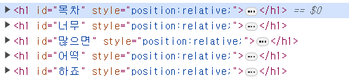

<figure>


<figcaption>Velog를 만드신 velopert님의 블로그 글</figcaption>
</figure>

저저 빨간색 화살표 쳐 놓은 저런거 있잖아요??  
Table Of Contents라고 한다고 하네요. 암튼 목차입니다.  
저런게 좀 있어야 조금 더 블로그다울 것 같습니다.

# 먼저 Table Of Contents 정보를 받아옵시다

그럼 일단.. 마크다운이 HTML로 파싱되고나면..  
각 헤더 요소들(`h1, h2, ... , h6`)을 가져다가..  
그에 상응하는 `<a href="#id">`를 만들고..  
각 헤더 요소들에도 그에 상응하는 `id`를 넣어줘야 하고..

를 하지 않아도 Gatsby에서 다 이미 지원합니다  
각 포스트들은, 제 경우에는 `gatsby-transformer-remark`라는 플러그인 이 파싱해서 HTML로 만드는데 (`gatsby-starter-blog`로 시작한 경우 이 플러그인을 사용)  
아주 편하게도 그 파싱 결과에 `tableOfContents`가 이미 준비되어 있어서, 달라고 하면 바로 줍니다.

<figure>


<figcaption>
안녕하세요저는강도애요저에게목차를주새요 
</figcaption>

</figure>

근데 꺼내는건 알아서 꺼내야합니다 언제까지나 밥상 차려주길 기대할 수는 없겠죠?
**GraphQL**을 적당히 이용해서 쿼리를 날리면 될 것 같습니다

그래서 Gatsby에서 graphql을 어떻게 해야 잘 쓸 수 있는지 문서를 뒤적거리다가..  
헉! 이런걸 발견


개발환경 열어놓고 `localhost:8000/___graphql`(또는 `___graphiql`. `_`가 세 번)으로 들어가면  
이런 깜찍한 in-browser IDE가 존재합니다..  
여기서 적당히 시험해보고 잘 나오는지 확인한 다음 쓰면 될 것 같습니다?

## GraphQL 쿼리를 작성해요

Gatsby에서 GraphQL쿼리를 이용해먹는 법은 몇 가지가 있는데  
일단 `import {graphql} from "gatsby"` 이런식으로 써주면  
graphql 쿼리를 딸깍 할 수 있는 함수?? 뭐 아무튼 그런걸 줍니다.

### Page Query

일단 각 블로그 포스트에 해당하는 페이지를 만드는 컴포넌트에서 쓰이는 방법인 `pageQuery`는..  
아 참 [docs는 여기](https://www.gatsbyjs.com/docs/how-to/querying-data/page-query/)

```graphql
query TableOfContentsBySlug($id: String!) {
  markdownRemark(id: { eq: $id }) {
    id
    tableOfContents
  }
}
```

머 요런식이면 될 것 같은데요? 대충  
`id`에 해당하는 게시글의 마크다운 파싱결과 중에서 `tableOfContents`를 가져온다  
이런 뜻입니다

그럼 아래처럼 줍니다

`"tableOfContents": "<ul>\n<li>\n<p><a href=\"#목차1\">목차1</a></p>\n<ul>\n<li><a href=\"#목차2\">목차2</a></li>\n</ul>\n</li>\n<li>\n<p><a href=\"#목차3\">목차3</a></p>\n</li>\n</ul>"`

대충 보니까 HTML형태를 이미 구성해서 주네요??  
너무 친절해 감동


그럼 이제 대충 **TableOfContents** 컴포넌트를 만들고,

```tsx
export const pageQuery = graphql`
  여기다가 쿼리 넣기	
`
```

이렇게 쓰면, 그 결과가 props에 `data`라는 이름으로 담겨 들어옵니다

근데.. 그럼 `id=?`에 해당하는 바인딩 변수를 넣어줘야 하는데,  
그러려면 `gatsby-node.ts`까지 가서 프로퍼티를 새로 작성하고.. 바인딩 변수를 거기서 어쩌구..  
아! 귀찮은데요!! 다른 방법 없을까요?

### Component Query

[Component Query에 대한 docs](https://www.gatsbyjs.com/docs/how-to/querying-data/use-static-query/)를 살펴보면  
먼저 `useStaticQuery`를 `import`해서  
`const data = useStaticQuery("여기에 쿼리")` 이런 식으로 받아올 수 있나봅니다

이게 더 간단해보이는데 문제는..  
"정적"쿼리라서 변수를 넣어줄 수 없습니다.  
*지금 보고 있는 게시글*에 대한 목차만 있으면 되는데, *모든 게시글*에 대한 목차를 가져오면 안되겠죠?

### 한 줄로 해결 ㅋㅋ

근데 생각해보니까, 각 포스트를 렌더링하는 컴포넌트(저는 `blog-post.tsx`라는 이름)에서  
이미 각 `id`에 해당하는 정보들을 `pageQuery`로 받아오고 있으니  
여기다 `tableOfContents` 한 줄만 추가하면 되겠는데요?

```diff
export const pageQuery = graphql`
  query BlogPostBySlug(
    $id: String!
    $previousPostId: String
    $nextPostId: String
  ) {
    site {
      siteMetadata {
        title
      }
    }
    markdownRemark(id: { eq: $id }) {
      id
      excerpt(pruneLength: 160)
      html
      frontmatter {
        title
        date(formatString: "MMMM DD, YYYY")
        description
        tag
      }
+      tableOfContents
    }
```

이런 식으로 한 다음, `tableOfContents`만 쏙 빼서
새로 만들 목차 컴포넌트에 props로 전달해주면 될 것 같습니다

그럼 이제 컴포넌트를 작성해봅시다.

```tsx
import React from "react"
import { useStaticQuery, graphql } from "gatsby"

interface ComponentProps {
  tableOfContents: string
}

function TableOfContents({ tableOfContents }: ComponentProps) {
  return (
    <div className="toc-container">
      this is ToC
      <div>{tableOfContents}</div>
    </div>
  )
}

export default TableOfContents
```

이렇게 하고 시작해봅시다

# 받아온 Table Of Contents를 HTML로


그대로는 그저 일개 문자열일 뿐이라,  
진짜 HTML 요소로 바꿔줘야 합니다

React에서 지원하는 HTML Attribute로 [dangerouslySetInnerHTML](https://legacy.reactjs.org/docs/dom-elements.html#dangerouslysetinnerhtml)이라는 것이 있는데
문자열을 HTML로 바꿔주지만  
이상한 사람이 준 문자열을 그냥 갖다 바꿔버리면  
[Cross-Site Scripting(XSS)](https://en.wikipedia.org/wiki/Cross-site_scripting)라는 보안이슈가 발생할 수 있어서  
어흥! `dangerously`를 붙여놨다고 하네요

```tsx
<div className="toc" dangerouslySetInnerHTML={{ __html: tableOfContents }} />
```

암튼 이렇게 작성하면


이렇게 나옵니다

# CSS를 넣어요

저도 [no-css club](https://nocss.club/) 참 좋아하지만 정식회원은 아닙니다.  
그대로 쓸 수는 없겠습니다?


## 뷰포트가 넓을 때 : 사이드 메뉴로 만들어요

저는 shout out to velog 하고싶은데요  
velog는 아예 포스트 section은 중앙에 고정이고  
사이드에 목차를 표현할 충분한 공간이 있을 때만 사이드 목차를 띄웁니다  
그럼 먼저 오른쪽 사이드에 고정시켜야겠는데  
velog를 개발자도구로 좀 뜯어보니까

```css
.toc-container {
  position: fixed;
  right: 0;
  width: 25%;
}
```

대충 이런 깔로 했네요  
전 클래스 이름을 table of contents 줄여서 toc라고 했습니다.  
영어권에서는 ToC라고 줄이는것도 은근 국룰인 듯


오른쪽으로 잘 붙어버렸습니다  
이제 velog처럼, 얘는 되게 부수적인 놈이면 좋겠으니  
화면이 줄어들면 없애버리죠?
그리고 밑줄이나 리스트 장식들은 쳐냅시다

```css
@media (max-width: /*적당히..*/) {
  .toc-container {
    display: none;
  }
}
.toc {
  border-left: solid 2px;
  padding-left: 10px;
}
.toc a {
  text-decoration: none;
}
.toc li {
  list-style-type: none;
}
```

## 뷰포트가 좁을 때 : 게시글 맨 위에 냅다 목차를 넣어요

사이드메뉴를 시킬 돈이 없을 때는  
그냥 게시글 시작할 때 냅다 넣고 싶어졌습니다

```tsx
useEffect(() => {
  const mediaQuery = window.matchMedia("(max-width: 85rem)")
  mediaQuery.addEventListener("change", event => {
    if (event.matches) {
      setIsWide(false)
    } else {
      setIsWide(true)
    }
  })
}, [])
```

1. 먼저 `window.matchMedia()`로 미디어 쿼리를 가져오고
2. 미디어 쿼리에 `onChange`리스너를 등록합니다. 미디어 쿼리가 `match`일 때 state를 켜고 끄기로 했어요
3. 이제 컴포넌트를 `isWide`여부에 따라 다르게 렌더링하게 하면 됩니다

어라 근데 목차를 접고 싶어질 수도요  
접고 펼칠 수 있는 더보기란을 만드는 HTML 요소를 활용해서 만들어봅시다

```html
<details>
  <summary>더보기</summary>
  더보기애용
</details>
```

이렇게 하면
`<details>`밑에는 자세한 설명을 숨길 수 있고  
하위에 `<summary>` 요소로 미리보기 제목을 넣어줄 수 있습니다


그럼 아래와 같이 나옵니다


그리고 여기에 `open` attribute까지 넣어주면  
기본으로 열려있고, 필요하면 접어버릴 수도 있게 됩니다

<details>
<summary> 더보기는 이렇게 생기게 만들었습니다?
</summary>

아 빵애애요

</details>

# 진짜로 링크를 연결하기

근데 지금 이 상태로는, 목차의 각 `<a>`태그를 클릭해도  
주소창에 `/#id`가 들어가지만 실제로 이동하지 않습니다


본문 내 각각의 `h1,h2,..,h6` 요소들에 `id`가 들어가있지 않기 때문인데요

<figure>


<figcaption>아직 요소 내에 id가 없다
</figcaption>
</figure>

이것도 간단히  
`gatsby-remark-autolink-headers` 플러그인 딸깍이면 해결됩니다.
`npm install gatsby-remark-autolink-headers` 대충 이런 식으로 설치해주고

```diff
{
      resolve: `gatsby-transformer-remark`,
      options: {
        plugins: [
+          `gatsby-remark-autolink-headers`,
			/* 생략 */
```

`gatsby-config.ts`에서 의존성을 추가해주는데  
주의할 점은, 얘는 `gatsby-transformer-remark`플러그인의 플러그인이라  
그 밑에 `gatsby-remark-autolink-headers`를 끼워넣어야 합니다  
구조가 특이하고 재밌네요


이렇게 되었습니다

# 현재 보고있는 부분은 사이드 목차에서 따로 표시하고 싶어요


지금 위치한 곳이 어딘지, 사이드의 목차를 보면 알 수 있게 하면 좋겠죠?


[mdn web docs](https://developer.mozilla.org/en-US/docs/Web/HTML/Element/details)도 이런 식으로 표현해주고


벨로그에서도 이렇게 합니다


그래서 이렇게 밑줄이라도 그어주려고 합니다

제가 확인해보니 대부분  
"제목 요소가 화면 맨 위를 넘어가면" => 현재 그 제목에 해당하는 목차에 위치했다고 간주.  
이런 식이더라구요?

이거 하려면..

1. 먼저 게시글 내의 모든 제목 요소(`h1,h2,..,h6`) 태그들을 가져오고
2. `top < 0`인 제목 요소들 중에 가장 밑에 있는 애를 가져와서 "현재 목차"로 간주
   - `top < 0`인 애들은 여럿 있을 텐데, JavaScript 배열의 `push`메서드와 `pop`메서드는 맨 뒤 요소를 추가/제거하는 동작이므로, 이걸 이용하면 됨. (스택처럼 된다)
3. 목차 컴포넌트에서 "현재 목차"와 동일한 `textContent`를 갖는 `<a>`태그를 찾고, 해당 태그에만 `activated` 클래스를 집어넣음
4. 이제 `a.activated`에만 따로 뭔가 CSS를 적용

1, 2, 3 과정을 적절한 scroll event로 등록해주면 되겠죠?

아래와 같이 작성했습니다

```tsx
useEffect(() => {
  const postSection = document.getElementById("post-section")
  if (!postSection) return
  //본문에서 제목 요소들을 가져온다
  const headers = postSection.querySelectorAll("h1, h2, h3, h4, h5, h6")
  if (!headers) return

  //스크롤 이벤트 정의
  const scrollEvent = () => {
    const overTheTop: Element[] = []
    //화면 맨 위를 넘어간 제목 요소들 모아서
    headers.forEach(h => {
      if (h.getBoundingClientRect().top < 0) {
        overTheTop.push(h)
      }
    })
    //맨 뒤에있는 요소를 뽑아보면 그게 "현재 목차"에 해당하는 제목 요소
    const curHeaderText = overTheTop.pop()?.textContent
    //목차에서 <a>태그들을 가져오고
    const aTags = document
      .getElementById("table-of-contents")
      ?.querySelectorAll("a")
    //"현재 목차"와 textContent가 친구만 activate
    aTags?.forEach(a => {
      a.classList.remove("activated")
      if (a.textContent === curHeaderText) {
        a.classList.add("activated")
      }
    })
  }
  //스크롤 이벤트 등록
  document.addEventListener("scroll", scrollEvent)

  return () => {
    document.removeEventListener("scroll", scrollEvent)
  }
}, [])
```

머 이런 식으로 해줬습니다..  
원래 제목 요소들의 `id`값으로 비교할까 했는데,  
`id`의 공백이나 특수문자 이런걸 조금 변형하더라구요  
어차피 "내용"이 동일하니까, 이렇게 해줬습니다

# 해치웠나?

하다보니 느낀건데  
왜 이렇게 CSS는 처음 보는게 계속 나오죠?

```css
word-break: keep-all;
overflow-wrap: break-word;
```

velog 뜯어보다가 발견했는데,  
이런 식으로 해서 줄바꿈을 단어 단위로 끊을 수 있습니다  
사소하지만 가독성 차이가 꽤나 큰 것 같아요..

그리고 더보기 요소는 [여기](https://codingeverybody.kr/css-details-%ED%83%9C%EA%B7%B8-%EC%8A%A4%ED%83%80%EC%9D%BC-%EA%BE%B8%EB%AF%B8%EA%B8%B0/)를 참고해서  
좀 상@봉해보이게 바꿨는데 그냥 no css club일 때가 더 낫나? 싶기도 하고..  
디자인 감각이 없으니 참.

암튼간에 이만 마칩니다
