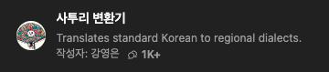

> ! 주의 : TIL 게시글입니다. 다듬지 않고 올리거나 기록을 통째로 복붙했을 수 있는 뒷고기 포스팅입니다.

<figure>



<figcaption>
어따 심심해서 저기 GPT성님헌티 전라도말씨로 바꿔달라헸단께요. 비타오스~
</figcatipn>

</figure>

지난 시간에는 리덕수 그잡채에 대해 알아봤는디라 기억할런가 몰것네잉

이전에 살펴본 Redux는  
액션 타입이 그냥 문자열이라 오타날 확률도 높고, 뭐가 있는지도 헷갈릴 수 있었지라  
데이터랑 상태가 많을수록 store라는 중앙집권식 객체가 점점 커질께  
그리고 state를 직접 건드리면 안된다는 규칙을 개발자가 알아서 지켜야 혀  
이런 문제를 뭐.. 상수 선언하던지, 리듀서를 나눠가지고 해결할 수도 있긴 한디  
이거를 다 간단하게 해결해주는 Redux Toolkit이 나왔당께

[리덕스 툴킷](https://ko.redux.js.org/redux-toolkit/overview/)은 효율적인 Redux 개발을 위한 도구로써, Redux 팀에서 강력추천하는 활용법이제.  
Redux의 대표적인 세 가지 문제를 해결하려고 만들어졌는디

- 저장소 설정이 너무 복잡하다잉
- 쓰다보면 다른 패키지에 의존을 많이 하게 된다잉
- 코드양이 너무 많아진다잉

그래서 나온 것이 리덕스 툴킷이다잉 https://redux-toolkit.js.org/  
`npm install @reduxjs/toolkit`  
여기에는 redux가 이미 포함되어 있당께

## 리듀서 쪼개보기 slice

전에야 하나의 중앙 store만 있구, 그 안에서만 상태를 관리했는디  
이제 `createSlice`를 사용해서 store의 분파를 만들 수 있당께. 마치 지방자치구를 만드는 것처럼 말여.

```jsx
const initialState = { counter: 0, show: false };

const counterSlice = createSlice({
  name: "counter",
  initialState,
  reducers: {
    increment(state) {
      state.counter++;
    },
    decrement(state) {
      state.counter--;
    },
    increase(state, { amount }) {
      state.counter += amount;
    },
    toggle(state) {
      state.show = !state.show;
    }
  }
});
```

이렇게

- `name` : 지방자치구 이름
- `initialState` : 초기 상태값
  - "lazy initialize"라서, state 값이 `undefined`일 때 이게 대신 사용된다잉
- `reducers` : 액션 메서드가 들어간 객체
  - `toggle(state)` 이런 식으로 작성하면, 이전 상태를 받아서 업데이트하게 할 수 있고, `increase(state, payload)`처럼 페이로드를 받아서 쓸 수도 있당께.

전에 리듀서로 `case`문 써서 `type`으로 구분했는디, 이제는 액션 메서드를 따로 만들어서 쓰면 된다잉.  
이러면 오타날 걱정도 없구, 더 명확허게 쓸 수 있당께.

그리고 중요한 점이, **state를 메서드 안에서 직접 변화시키는 것**인데  
이거는 리덕스 툴킷이 [immer](https://github.com/immerjs/immer)라는 라이브러리를 써서 가능한 것이여.  
직접 수정하는 것처럼 보이게 써도, 내부적으로 알아서 복제하고 반환하는 형태로 처리해줌께.  
그러니까 그냥 `state.count++` 이런 식으로 걍 써도 된다잉.

## 리듀서 등록하고 store 만들기

이제 `createSlice`로 만든 슬라이스는 리듀서를 완전히 대체할 수 있당께  
`createStore(counterSlice.reducer)`라고 쓰면 간단하게 store를 만들 수 있당께.

중앙집권적이었던 저장소를 슬라이스로 나누게 되었는디,  
슬라이스가 여러 개 있을 수 있제.  
이전엔 `combineReducer`로 여러 리듀서를 병합했는디,  
리덕스 툴킷에선 `configureStore` 함수를 쓰면 간단혀.

```js
const store = configureStore({
  reducer: {
    counter: counterSlice.reducer,
    foo: fooSlice.reducer
  }
});
```

`configureStore`에 `reducer`라는 속성을 가진 객체를 넘겨주면,  
슬라이스들을 구분하는 이름이랑 그 리듀서를 넣어주면 됨께.  
그러면 자동으로 모든 슬라이스 리듀서를 합친 중앙 저장소가 만들어진당께.

## action을 내보내고 컴포넌트에서 쓰기

`slice`의 actions 객체에는 `reducers:`에서 정의한 액션 메서드들이 다 들어있당께.  
이제 액션 메서드들을 내보내면 되는데, 이건 다 **액션 생성자**로 보면 된다잉.  
이전에는 `{ type: "increment" }` 이런 액션 객체를 직접 만들어서 `dispatch`했는디,  
이제는 `counterSlice.actions.increment`를 호출하면 알아서 `{ type: "increment" }`를 내보낸당께.  
그리고 `counterSlice.actions`를 내보내서 컴포넌트에서 갖다 쓰면 됨께.

`export const counterActions = counterSlice.actions;` 이런 식으로 action 생성자를 내보낼 수 있다잉.

이제 `dispatch(counterActions.increment)` 이렇게 쓰면 된다잉.  
페이로드를 넣고 싶으면 `counterActions.increase(10)` 이런 식으로 쓰면 됨께.

## useSelector로 상태값 가져오기

슬라이스 여러 개를 `configureStore`로 합쳤다면,  
`useSelector`에서 저 reducer 객체의 키 값으로 상태를 찾아야 한당께.

```js
const counter = useSelector(state => state.counter.counter);
const showCounter = useSelector(state => state.counter.show);
const isAuthenticated = useSelector(state => state.auth.authenticated);
```

이런 식으로 철저하게 구분돼있당께.  
이제 `store.fooCounter.counter` 같은 식으로도 손쉽게 상태를 관리할 수 있제.

---

# 비동기 처리나 부수효과를 Redux에서 다루기

리덕스에 몇 가지 제약이 있었는디

- 리듀서 함수는 순수해야 하고, 부수효과가 없고, 동기적으로 동작해야 한다는 것이제.

그래서 HTTP 요청이나 비동기 로직 같은 것들은

- 컴포넌트 안에서 `useEffect`로 처리하던가,
- Redux Toolkit의 Thunk를 사용해서 처리할 수 있당께.

### useEffect로 처리하기

```jsx
const cart = useSelector(state => state.cart);

useEffect(() => {
  fetch(`https://my-firebase-url/cart.json`, {
    method: "PUT",
    body: JSON.stringify(cart)
  });
}, [cart]);
```

이렇게 `useEffect`를 사용해서 상태 변화에 따른 부수효과를 처리할 수 있당께.  
근디 첫 마운트 때 비어 있는 cart를 백엔드에 보내는 문제가 있을 수 있제.

이걸 해결하려면 컴포넌트 함수 바깥에 `let isInitial = true`를 선언해서 첫 마운트 때는 HTTP 요청을 하지 않게 설정할 수 있다잉.

## 액션 생성자 Thunk 사용하기

Thunk는 어떤 작업을 지연시키는 함수라 보면 된다잉.  
비동기 요청이나 다른 액션을 처리할 수 있당께.

```jsx
const sendCartData = cartData => {
  return async dispatch => {
    // 여기에 다른 액션을 dispatch하거나 비동기 요청을 처리함께.
  };
};
```

이런 식으로 액션 생성자 안에 비동기 로직을 넣어 처리할 수 있다잉.

예를 들어, 상태 변화에 따른 HTTP 요청과 알림 액션을 추가하는 로직을 이렇게 작성할 수 있당께.

```jsx
export const sendCartData = cartData => {
  return async dispatch => {
    const sendRequest = async () => {
      const response = await fetch(`https://my-firebase-url/cart.json`, {
        method: "PUT",
        body: JSON.stringify(cartData)
      });
      if (!response.ok) {
        throw new Error("Sending cart data failed.");
      }
    };
    try {
      await sendRequest();
    } catch (error) {}
    dispatch(
      uiActions.showNotification({
        // 알림 payload
      })
    );
  };
};
```

이제 컴포넌트에서 `dispatch(sendCartData(cart));` 이렇게 써서 비동기 작업을 처리할 수 있다잉.

마찬가지로, 첫 마운트 때 데이터를 가져오는 Thunk도 만들 수 있제.

```js
export const fetchCartData = () => {
  return async dispatch => {
    const fetchData = async () => {
      const response = await fetch("https://my-firebase-url/cart.json");

      if (!response.ok) {
        throw new Error();
      }

      const data = await response.json();

      return data;
    };
    try {
      const cartData = await fetchData();
      dispatch(cartActions.replaceCart(cartData));
    } catch {
      /* 에러 처리 */
    }
  };
};
```

이제 컴포넌트에서 `useEffect(()=>{ dispatch(fetchCartData()) }, []);`  
이렇게 간단히 한 줄로 처리할 수 있당께.

---

\
리덕수씨네 툴킷 워땐겨? 덕분에 더 깔끔하고 편리해졌지라  
이만 마치겄소
