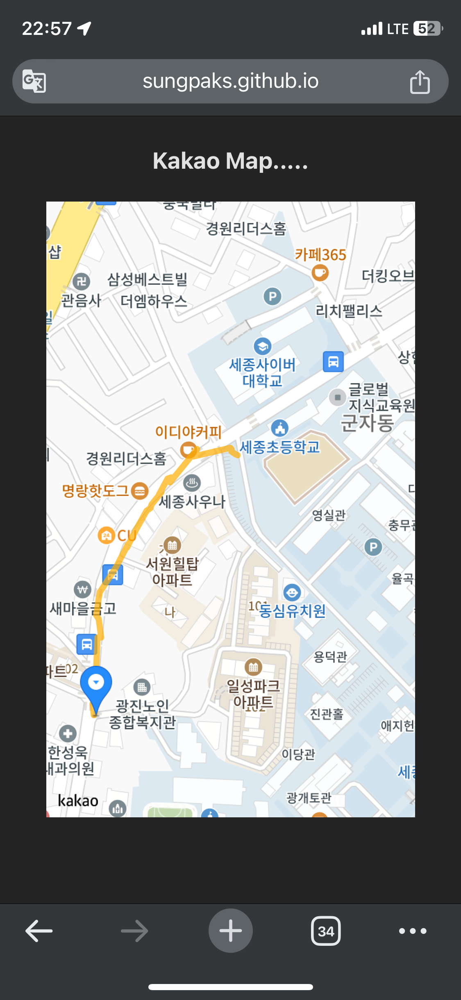

데모 프로젝트 구성 : bun + vite + react  
[vite](https://ko.vitejs.dev/guide/) : JavaScript 모듈화 빌더???  
[bun](https://bun.sh/) : JavaScript runtime, package manager, bundler, etc.

`bun vite react-playground`

- react
- typescript
  `bun install`
  `bun run dev`

[Prettier + ESLint](https://www.daleseo.com/js-prettier/)

## Geolocation API

HTML5에서 지원하는 [Geolocation API](https://developer.mozilla.org/en-US/docs/Web/API/Geolocation) 있음  
`const geo: Geolocation = navigator.geolocation`  
`geo.getCurrentPosition()` 으로 지금 위치 가져올 수 있고  
`geo.watchPosition()`으로 아예 위치 바뀔때마다 호출되는 이벤트리스너를 등록해버릴 수 있음  
둘 다 인자로 `success`는 무조건 넣어야 함. 위치 가져오기 성공 시 실행할 콜백함수임  
`watchPosition()`은 `long` 값을 반환함. 이거 가지고있었다가 `clearWatch()`에 써야 함

## ReactKakaoMapSDK

https://react-kakao-maps-sdk.jaeseokim.dev/docs/intro 에서 튜토리얼 가능  
적당히 Kako 지도 javascript api 따라해주면 되고
ts패키지도 적당히 넣어주고  
`import { Map, MapMarker, Polyline } from 'react-kakao-maps-sdk';`  
https://react-kakao-maps-sdk.jaeseokim.dev/docs/sample/overlay/drawShape/ 선 그리는 것도 있음

## 코드

```tsx
import { useEffect, useState } from "react"
import "./App.css"
import { Map, MapMarker, Polyline } from "react-kakao-maps-sdk"

interface PathType {
  lat: number
  lng: number
}

function App() {
  const geo: Geolocation = navigator.geolocation
  const [latitude, setLatitude] = useState<number>(0)
  const [longitude, setLongitude] = useState<number>(0)
  const [path, setPath] = useState<PathType[]>([])
  console.info(path)

  /** 마운트 시 위치 이벤트 리스너 등록 */
  useEffect(() => {
    const geoId = geo.watchPosition(g => {
      setLatitude(g.coords.latitude)
      setLongitude(g.coords.longitude)
    })

    return () => geo.clearWatch(geoId)
  }, [])

  /** 위치 바뀔 때마다 히스토리에 누적 */
  useEffect(() => {
    if (latitude === 0 || longitude === 0) return
    setPath(prev => [...prev, { lat: latitude, lng: longitude }])
  }, [latitude, longitude])

  return (
    <>
      <div style={{ width: "80vw" }}>
        <h3>Kakao Map.....</h3>
        {latitude === 0 || longitude === 0 ? undefined : (
          <Map
            center={{ lat: latitude, lng: longitude }}
            style={{ width: "100%", height: "500px" }}
          >
            <MapMarker position={{ lat: latitude, lng: longitude }}></MapMarker>
            <Polyline
              path={path}
              strokeWeight={5} // 선의 두께 입니다
              strokeColor={"#FFAE00"} // 선의 색깔입니다
              strokeOpacity={0.7} // 선의 불투명도 입니다 1에서 0 사이의 값이며 0에 가까울수록 투명합니다
              strokeStyle={"solid"} // 선의 스타일입니다
            />
          </Map>
        )}
      </div>
    </>
  )
}

export default App
```

[깃허브 페이지로 배포](https://sungpaks.github.io/react_playground/)해서 사용해본 결과



정확도 관련 수정을 해야 하긴 할 듯

https://ko.vitejs.dev/guide/static-deploy 배포하려면.

- `github.io/repo/` 이렇게 배포하려면 vite.config.ts에 설정 추가해주기 . `base : "/repo/`
