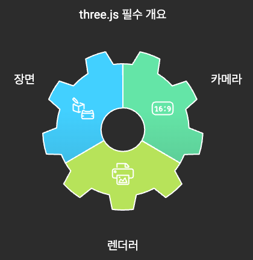
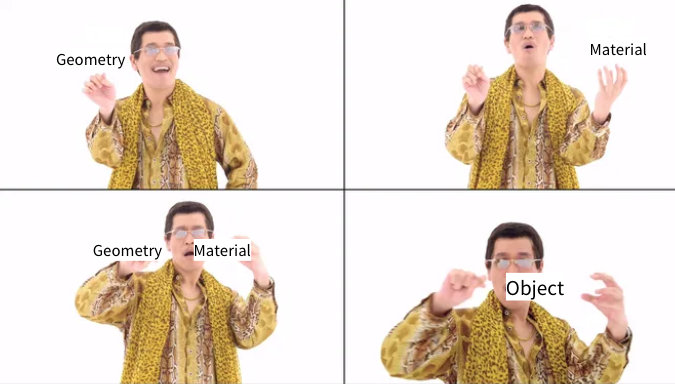
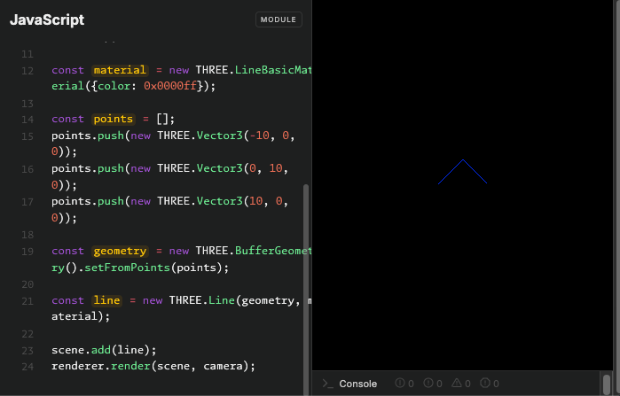

> ! 주의 : TIL 게시글입니다. 다듬지 않고 올리거나 기록을 통째로 복붙했을 수 있는 뒷고기 포스팅입니다.

최근에 Three.js 스터디를 시작하게 되었는데요  
[Three.js](https://threejs.org/)는 JavaScript로 3D 그래픽을 구현할 수 있게 해주는 라이브러리입니다.

공식문서를 쭉 한번 읽어보며 뭘 할 수 있는지를 좀 보려고 해요  
심지어 Three.js는 [한국어 docs](https://threejs.org/docs/index.html#manual/ko/introduction/Installation)를 지원합니다.  
영어 docs면 피로감이 391% 추가되는데, 아주 좋네요  
시작해보겠습니다.

설치는 위 docs에서 쉽게 설치할 수 있습니다.  
`npm install three`처럼 패키지매니저로 설치할 수도 있고,  
CDN으로 가져다 쓸 수도 있구요

# 장면을 만들기 : spinning cube

설치 후 가장 먼저 보이는 것은 [Scene 만들기](https://threejs.org/docs/index.html#manual/ko/introduction/Creating-a-scene) 단계입니다.  
먼저 `import * as THREE from 'three'` 처럼 Three.js의 모듈을 import하고 시작합시다.

<figure>



<figcaption>three.js에서 필수적인 3대 요소. - generated by NapkinAI</figcaption>

</figure>

이제부터 three.js를 본격적으로 시작할건데,  
three.js에서 무언가를 표현하려면 **scene, camera, 그리고 renderer** 세 가지가 필수적입니다.

```js
const scene = new THREE.Scene();
const camera = new THREE.PerspectiveCamera(
  75,
  window.innerWidth / window.innerHeight,
  0.1,
  1000
);
const renderer = new THREE.WebGLRenderer();
renderer.setSize(window.innerWidth, window.innerHeight);
document.body.appendChild(renderer.domElement);
```

이게 사실상 boilerplate처럼 됩니다

카메라는 `PerspectiveCamera`라는 종류를 썼는데, 이외에도 다른 몇 가지 종류가 있습니다.  
생성자에서 전달한 각 속성으로는

- 시야각(field of view) : 각도 값으로 설정합니다. 75$\degree$처럼.
- 종횡비(aspect ratio) : 화면의 너비와 높이 비율로, 보통 요소의 높이와 너비에 맞추어 표시합니다.
- near 절단면 : 이 값보다 가까이 있는 물체는 렌더링하지 않습니다.
- far 절단면 : 이 값보다 멀리 있는 물체는 렌더링하지 않습니다.

렌더러는 `WebGLRenderer`를 사용했습니다. 이 또한 다른 종류의 렌더러가 있는데, WebGL이 지원되지 않는 환경에서 쓸 수 있는 객체가 있는 등, 입니다.

- 먼저 렌더러를 생성(`new THREE.WebGLRenderer()`)하고,
- 크기를 설정합니다(`renderer.setSize(window.innerWidth, innerHeight)`).
- 사이즈는 유지하면서 해상도를 낮추려면, `setSize`의 세 번째 인자인 `updateStyle`을 false로 꺼줍시다.
  - `setSize(window.innerWidth/2, window.innerHeight/2, false)`라고 쓰면, 절반의 해상도로 렌더링됩니다(`<canvas>` 높이너비가 100%인 경우).

`const scene = new THREE.Scene()`처럼 장면 객체도 생성해줍니다.  
나중에 오브젝트를 만들고 장면에 추가할 것입니다.

이제 **renderer 요소를 HTML문서에 삽입**합니다.  
이는 하나의 `<canvas>` 요소로, 렌더러가 장면을 나타내는 구역에 해당합니다.

## 큐브를 하나 추가해봅시다.

예제 오브젝트로 큐브를 하나 추가해봅니다.

```js
// 큐브 기하학 구조 생성
const geometry = new THREE.BoxGeomery(1, 1, 1);
// 재질(색상 등을 정의) 생성
const material = new THREE.MeshBasicMaterial({ color: 0x00ff00 });
// 기하학과 재질을 합치면 => 물체.
const cube = new THREE.Mesh(geometry, material);
// 장면에 추가.
scene.add(cube);
camera.position.z = 5;
```

먼저 `BoxGemoetry`로 큐브를 추가합니다.  
이 객체는 큐브를 만드는데 필요한 모든 **꼭짓점**과 **면**을 포함하는 기하학 객체입니다.  
이 꼭짓점과 면에 대해서는 나중에 알아봅니다.

이제 재질이 필요합니다. 이 재질은 요소에 색상 등의 성질을 부여합니다.  
three.js에서 이러한 "색칠"에 대해 여러 방법이 고민되었지만, 현재로서는 `MeshBasicMaterial`을 사용합니다.  
이 속성이 적용된 오브젝트들은 모두 그 영향을 받습니다.

이제 `Mesh`와 같이 Object를 생성합니다.  
**기하학(Geometry)**과 **재질(material)**을 합쳐 하나의 물체가 되고, 이것이 화면에 삽입되어 자유롭게 움직일 수 있습니다.



이제 물체를 `scene.add()`로 장면에 추가합니다.  
이러면 기본적으로 (0,0,0) 좌표에 위치하므로, 카메라와 큐브가 겹치게 됩니다.  
따라서 카메라를 살짝 움직여줍니다.

## Scene을 렌더링하기.

아직 렌더링하지 않았으므로 아무것도 보이지 않습니다.  
`renderer.render()`로 현재 장면을 렌더할 수 있는데,  
**render or animate loop**로 연속적으로 렌더링할 수 있습니다. (애니메이션)

```js
function animate() {
  requestAnimationFrame(animate);
  // 여기에 큐브를 움직이는 업데이트 로직을 추가하기.
  renderer.render(scene, camera);
}
animate();
```

기본적으로 이렇게 생깁니다.  
Java프로그래밍 시간에 Swing실습으로 배운 [Game-Loop Pattern](https://gameprogrammingpatterns.com/game-loop.html)이 생각나네요  
대충 *입력받고 -> update하고 -> render하는 사이클을 무한반복*하는 패턴이었습니다.

아무튼 이렇게 하면, 화면이 새로고침될 때마다 계속해서 렌더링합니다. (기본적으로 초당 60회)  
_왜 `setInterval`을 사용하지 않나요?_ => setInterval과 비슷해보이지만 다른 이점들을 제공합니다. 예를 들어, 브라우저 창에서 이탈한 경우 멈추는 등.

## 큐브를 움직여요

animate함수에서 렌더링하기 전에 큐브를 업데이트합시다.

```js
function animate() {
  requestAnimationFrame(animate);
  cube.rotation.x += 0.01;
  cube.rotation.y += 0.01;
  renderer.render(scene, camera);
}
animate();
```

이런식으로. 천천히 회전하도록 매 렌더링마다 변형을 추가합니다.  
이 예제는 [여기](https://jsfiddle.net/0c1oqf38/)에서 결과를 확인할 수 있습니다.

# 선 그리기

그 다음은 [WebGL 호환성 검사](https://threejs.org/docs/index.html#manual/ko/introduction/WebGL-compatibility-check)지만, 혹시나 WebGL2를 지원하지 않는 환경에 대처하는 방법에 대한 간단한 내용입니다.  
그 다음 내용인 [선 그리기](https://threejs.org/docs/index.html#manual/ko/introduction/Drawing-lines)를 알아봅시다.

아까는 와이어프레임 [Mesh](https://threejs.org/docs/index.html#api/en/objects/Mesh)를 오브젝트로 사용했는데, 이제 선이나 원을 그려보려고 합니다.

아까처럼 boilerplate를 먼저 작성합시다.

```js
const renderer = new THREE.WebGLRenderer();
renderer.setSize(window.innerWidth, window.innerHeight);
document.body.appendChild(renderer.domElement);

const camera = new THREE.PerspectiveCamera(
  45,
  window.innerWidth / window.innerHeight,
  1,
  500
);
camera.position.set(0, 0, 100);
camera.lookAt(0, 0, 0);

const scene = new THREE.Scene();
```

아까랑 거의 비슷합니다. 카메라 설정만 살짝 달라졌네요.

먼저 재질을 정의합시다.
선을 그리려면 `LineBasicMaterial` 또는 `LineDashedMaterial`을 사용합니다.

```js
const material = new THREE.LineBasicMaterial({ color: 0x0000ff });
```

이렇게 파란색 재질을 생성할 수 있습니다.

그 다음엔 선을 구성할 각 꼭짓점에 대한 기하학을 정의합니다.

```js
const points = [];
points.push(new THREE.Vector3(-10, 0, 0));
points.push(new THREE.Vector3(0, 10, 0));
points.push(new THREE.Vector3(10, 0, 0));

const geometry = new THREE.BufferGeometry().setFromPoints(points);
```

이 `BufferGeometry` 기하학 객체에 대해서는 심화 과정 > 오브젝트를 업데이트하는 방법 단계에서 자세히 다룹니다.  
세 점을 이어 두 개의 선을 그리게 된다는 사실만 기억하시면 됩니다.  
선은 연속된 꼭짓점 쌍 사이에 그려지고, 첫 번째와 마지막 꼭짓점에는 선을 그리지 않습니다.  
이는 곧 *선은 닫혀있지 않다*는 의미입니다.

이제 물체를 그려내기 위한 기하학과 재질이 있으니, 선 물체를 만들어내고, 렌더할 수 있습니다.

```js
const line = new THREE.Line(geometry, material);
scene.add(line);
renderer.render(scene, camera);
```



이렇게 선을 그려낼 수 있습니다.

# 텍스트를 만들기

[three.js에서 텍스트를 다루는 방법](https://threejs.org/docs/index.html#manual/ko/introduction/Creating-text)은 여럿 있는데

1. DOM + CSS : 그냥 HTML요소로 텍스트 추가할 수 있습니다. (오버레이 설명 등)
2. [Texture](https://threejs.org/docs/index.html#api/en/textures/Texture)로 캔버스에 텍스트를 그릴 수 있습니다.
3. 3D 작업 앱으로 만들고 import할 수 있습니다 : [3D 모델 불러오기](https://threejs.org/docs/index.html#manual/ko/introduction/Loading-3D-models)
4. 절체적 텍스트 geometry : `THREE.TextGeometry` 인스턴스인 mesh를 사용하여 절차적으로 사용할 수 있습니다.
   - 이 때, TextGeometry의 font 파라미터가 `THREE.Font`인스턴스로 설정 필요
   - [여기](https://threejs.org/docs/index.html#examples/en/geometries/TextGeometry)참고
5. 비트맵 글꼴

등등.

---

\
다음시간엔 매뉴얼의 심화 과정으로 들어가서 [오브젝트를 업데이트하는 방법](https://threejs.org/docs/index.html#manual/ko/introduction/How-to-update-things)과 [오브젝트를 폐기하는 방법](https://threejs.org/docs/index.html#manual/ko/introduction/How-to-dispose-of-objects)을 보겠습니다.
