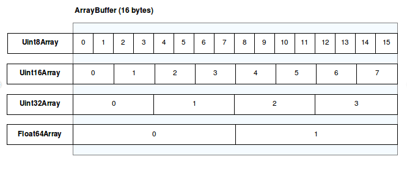

> ! 주의 : TIL 게시글입니다. 다듬지 않고 올리거나 기록을 통째로 복붙했을 수 있는 뒷고기 포스팅입니다.

[저번 포스팅](/til/how-to-threejs-1)에서 기초 매뉴얼을 살펴봤습니다  
이번엔 심화 과정 > 오브젝트 부분을 한번 봅시다.

# 오브젝트를 업데이트 하는 방법

[공식문서](https://threejs.org/docs/index.html#manual/ko/introduction/How-to-update-things)

오브젝트들은

```js
const object = new THREE.Object3D();
scene.add(object);
```

이런 식으로 장면에 추가되거나

```js
const object1 = new THREE.Object3D();
const object2 = new THREE.Object3D();

object1.add(object2);
scene.add(object1); //object1과 object2는 자동으로 자신들의 행렬구조를 업데이트할 것입니다.
```

이런 식으로 다른 오브젝트의 자식으로 장면에 추가되면  
기본적으로 자신의 행렬구조를 자동으로 업데이트합니다.  
라는 말 뜻을 완전히 이해하지 못하고 넘어갔었는데, 나중에 [행렬 변환](https://threejs.org/docs/#manual/ko/introduction/Matrix-transformations)에서 이 의미에 대한 복선이 조금 나옵니다.  
더 뭔소리지? 싶어지긴 하지만..

아무튼간에, 자동으로 행렬구조를 업데이트하고싶지 않다면,  
기본 설정을 풀고 행렬구조를 수동으로 업데이트하게 할 수 있습니다.

```js
object.matrixAutoUpdate = false;
object.updateMatrix();
```

이거에 대해서도 행렬 변환에서 또 다룹니다.

## BufferGeometry

`BufferGeometry`는 꼭짓점 위치, 면 순서, 법선, 색 등 다양한 정보를 [buffers](https://threejs.org/docs/index.html#api/ko/core/BufferAttribute)에 저장하여 GPU보다 효율적으로 데이터를 전송할 수 있게 합니다.
이 `buffers`는 [typed arrays](https://developer.mozilla.org/ko/docs/Web/JavaScript/Guide/Typed_arrays)입니다.

`buffers`가 typed array이기 때문에, `buffers`의 크기를 동적으로 조절하기는 어렵습니다.  
대신에 배열에 담은 내용을 변경해야 합니다.  
이는 곧, `BufferGeometry`에 원소들을 새로 넣을 것이 예상된다면, 그만큼 충분한 크기의 `buffers` 공간을 확보해두어야 한다는 셈입니다.

### Typed Arrays(형식화 배열)?

[typed arrays](https://developer.mozilla.org/ko/docs/Web/JavaScript/Guide/Typed_arrays)는 배열-like한 객체인데, 원시(raw) 이진 데이터에 액세스하기 위한 메커니즘을 제공합니다.  
이 때, 형식화 배열이 배열-like하다고 해서, 보통의 JS 배열과 완전히 비슷하진 않습니다.  
예를 들어, `isArray` 반환값은 `false`이며, `push, pop`같은 일부 배열 메서드가 지원되지 않습니다.

> 형식화 배열은 최대 유연성 및 효율을 위해 그 구현이 버퍼와 뷰로 나뉩니다.

버퍼([ArrayBuffer](https://developer.mozilla.org/ko/docs/Web/JavaScript/Reference/Global_Objects/ArrayBuffer)객체에 의해 구현됨)는 데이터 부분 또는 데이터 덩어리를 나타내는 객체입니다.

> 이야기할 형식이 없으며, 그 콘텐츠에 액세스하기 위한 메커니즘을 제공하지 않습니다.

이는 즉 `ArrayBuffer`가 그냥 단순 메모리 덩어리일 뿐이며, 이를 어떻게 해석하느냐(숫자로 봐야함? 문자로 봐야함? 등.)에 대한 정보를 하등 갖지 않습니다.  
마치 **비어있는 그릇**처럼, 그냥 2byte를 담을 수 있냐, 4byte를 담을 수 있냐 등의 데이터 사이즈를 정할 뿐입니다.

> 버퍼에 포함된 메모리에 객세스하려면 뷰를 사용합니다. 뷰는 context(데이터 형, 시작 오프셋 및 요소 수 등)울 제공하여 데이터를 실제 형식화 배열로 바꿉니다.

예를 들어, 16byte를 포함하는 ArrayBuffer가 있다고 생각합시다.  
이를 `UInt32Array` 뷰로 읽으면 4개의 Unsigned Int로 잘라낼 수 있습니다.

<figure>



<figcaption>MDN docs의 참고사진자료</figcation>

</figure>

이처럼 `ArrayBuffer`에는 일반 고정 길이 이진 데이터 버퍼를 나타내기 위한 데이터타입이고, 이를 직접 조작할 수 없습니다.  
대신 `UInt32Array`같은 **형식화 배열 뷰** 또는 [DataView](https://developer.mozilla.org/ko/docs/Web/JavaScript/Reference/Global_Objects/DataView)를 따로 만들고 버퍼의 콘텐츠를 읽거나 씁니다.

- 형식화 배열 뷰는 자체 설명형 이름을 갖습니다. 예를 들어, `Int8, Uint32` 등. 모든 일반 숫자형을 위한 뷰를 제공합니다.
  - [여기](https://developer.mozilla.org/ko/docs/Web/JavaScript/Guide/Typed_arrays#%ED%98%95%EC%8B%9D%ED%99%94_%EB%B0%B0%EC%97%B4_%EB%B7%B0)에서 자세한 설명
- DataView는 버퍼에 임의로 데이터를 쓰고 읽기 위해 getter, setter API를 제공하는 저수준 인터페이스입니다.
  - 형식화 배열 뷰는 플랫폼의 [엔디언](https://developer.mozilla.org/ko/docs/Glossary/Endianness)에 따르지만, `DataView`는 이와 독립적으로 바이트 순서를 제어할 수 있습니다.

예를 들어,  
먼저 16바이트 고정 길이 버퍼를 생성합니다.

```js
var buffer = new ArrayBuffer(16);
```

이건 그냥 빈 그릇만이 존재할 뿐입니다.  
딱히 뭐 할 수 있는건 없고, 해봤자 아래같은 것 뿐입니다.

```js
if (buffer.byteLength === 16) {
  console.log("YES, 16 bytes.");
}
```

이제 이 버퍼로 뭔가 작업하려면 뷰를 만듭니다. 예를 들어, 형식화 배열 뷰 :

```js
var int32View = new Int32Array(buffer);
```

그럼 이제 보통 배열처럼, 배열의 원소에 액세스하여 읽고 쓸 수 있습니다.

```js
for (var i = 0; i < int32View.length; i++) {
  int32View[i] = i * 2;
}
```

16byte 고정길이 버퍼를 `Int32Array`(4byte씩) 잘랐으니, 4개 항목이 나옵니다.  
for문을 실행하면 배열의 4개 항목은 각각 0,2,4,6으로 값이 채워집니다.

형식화 배열에 대해서는 이만 마칩시다.  
아무튼 이러한 이유로, `BufferGeometry`는 동적으로 길이를 늘렸다 줄일 수 없습니다.

## 매 렌더링마다 랜덤하게 확장되는 선을 그리기

buffer에 최대 500개 꼭짓점을 할당하고, 0개 점부터 시작하는 코드를 만들어봅시다.

```js
/*
boiler plate (scene, camera) 생성
*/
const MAX_POINTS = 500; //500개 꼭짓점으로 한정하기.

const geometry = new THREE.BufferGeometry(); //BufferGeometry를 생성

const positions = new Float32Array(MAX_POINTS * 3); //x,y,z 담아야하니 3배
geometry.setAttribute("position", new THREE.BufferAttribute(positions, 3)); //position이라는 속성을 설정하고, BufferAttribute를 생성

let drawCount = 0; //0에서부터 시작
geometry.setDrawRange(0, drawCount); // 0~drawCount까지

// 빨간색 재질 생성
const material = new THREE.LineBasicMaterial({ color: 0xff0000 });

//기하학과 재질로 line 생성하고, 추가
const line = new THREE.Line(geometry, material);
scene.add(line);
```

이제 아래처럼, 무작위 패턴을 추가하여 업데이트합시다.

```js
function updatePositions() {
  const positionsAttribute = line.geometry.getAttribute("position");
  if (drawCount + 1 < MAX_POINTS) {
    let x = drawCount
      ? positionsAttribute.getX(drawCount - 1) + (Math.random() - 0.5) * 20
      : 0;
    let y = drawCount
      ? positionsAttribute.getY(drawCount - 1) + (Math.random() - 0.5) * 20
      : 0;
    let z = drawCount
      ? positionsAttribute.getZ(drawCount - 1) + (Math.random() - 0.5) * 20
      : 0;

    positionsAttribute.setXYZ(drawCount, x, y, z);
    drawCount++;
  } else {
    drawCount = 0;
  }
  line.geometry.setDrawRange(0, drawCount); // 첫 렌더링 이후 그려낼 점의 갯수를 변경.
  positionsAttribute.needsUpdate = true; // 첫 렌더링 이후 position 데이터 수치를 변경하게 함.
}
```

`drawCount % MAX_POINTS`로 분기를 처리하면 더 간단하겠네요  
암튼간에 `MAX_POINTS`보다 `drawCount`가 적은 동안은, 이전 위치를 기준으로 랜덤하게 뻗는 위치를 생성하고,  
`positionAttribute.setXYZ(drawCount, x,y,z)`로 drawCount번째에 새 꼭짓점을 추가합니다.  
그 뒤 \*\*position 데이터의 변경이 적용되게 하려면 `positionAttribute.needsUpdate=true`로 선언해줍니다.

> 첫 렌더링 이후에 position 데이터 수치를 변경한다면, bounding volumes를 재계산해서 다른 엔진의 절두체 컬링 혹은 헬퍼같은 특성들이 적절히 작동하도록 해야합니다.  
>  `line.geometry.computeBoundingBox();`  
>  `line.geometry.computeBoundingSphere();`

[이런 결과](https://jsfiddle.net/t4m85pLr/1/)가 나옵니다.

## 재질 Materials

모든 uniforms 값들은 자유롭게 변경 가능. 예를 들어, colors, textures, opacity ..  
이 값들은 매 프레임마다 shader에 전송됩니다.  
또한 depthTest, blending, polygonOffset처럼 GLstate관련 파라미터 또한 언제나 변경할 수 있습니다.

런타임(재질이 최소 한 번 렌더링 된 이후)에 쉽게 변경할 수 없는 속성들

- uniforms의 갯수와 타입.
- 아래 속성들의 사용/비사용 여부
  - texture, fog, vertex colors, morphing, shadow map, alpha test, transparent

이러한 요소들을 변경하려면 아래처럼 선언하여 새로운 shader 프로그램을 생성하게 해야 합니다.

```js
material.needsUpdate = true;
```

근데 이건 매우 느리고 프레임이 끊겨보일 수 있습니다. (특히 shader 편집이 DirectX에서 OpenGL보다 느린, Windows같은 경우)

좀 더 부드럽게 하려면, 밝기 0인 빛, 흰 텍스처, 밀도 0인 안개 등의 "가상 값"을 가지도록 특성을 변경하는 방법이 있습니다.

이렇듯, 어떤 기하학 블록에 사용되는 재질은 자유롭게 바꿀 수 있지만, 오브젝트를 블록으로 나누는 구성은 변경할 수 없습니다.  
라는 말의 뜻이 잘 와닿지 않았는데, 오브젝트의 기하학적 구조 또는 특성(면을 나누는 방식, 꼭짓점의 연결 구성 등)을 변경할 수 없다는 말 같네요

### 런타임 중에 재질을 서로 다르게 설정해야 할 때

재질과 블록 수가 적은 경우, 오브젝트를 미리 분리해둘 수 있습니다.  
예를 들어, 사람을 머리/얼굴/상의/바지, .. 이렇게

그러나 모든 얼굴들이 조금씩 다른 경우처럼 그 수가 너무 많다면, 속성/텍스처를 사용하여 얼굴마다 다른 형태를 입히는 방법 등을 생각해볼 수 있습니다.

## 텍스처

사진, 그림, 영상 및 데이터 텍스처를 변경했으면, 이 경우에도 플래그를 설정해야합니다.

```js
texture.needsUpdate = true;
```

## 카메라

카메라의 위치와 대상은 자동으로 업데이트됩니다.  
만약 변경을 원하는 경우

- fov
- aspect
- near
- far

이러한 속성을 변경한 직후, 행렬구조를 다시 계산하게 합니다.  
예를 들어:

```js
camera.aspect = window.innerWidth / window.innerHeight;
camera.updateProjectionMatrix();
```

---

# 오브젝트를 폐기하는 방법

[오브젝트를 폐기하는 방법](https://threejs.org/docs/index.html#manual/ko/introduction/How-to-dispose-of-objects)

three.js의 인스턴스는 생성될 때마다 일정량의 메모리를 할당합니다.  
이들은 특정 개체에 대한 기하학적 구조나 WebGL 재질(버퍼 또는 쉐이더) 개체의 렌더링에 필요한 것입니다.  
그러나 이러한 오브젝트들은 자동으로 폐기되지 않습니다.

## 기하학

기하학은 속성 집합으로 정의된 꼭짓점 정보를 표시합니다.  
three.js는 속성마다 하나의 [WebGLBuffer](https://developer.mozilla.org/en-US/docs/Web/API/WebGLBuffer) 유형의 객체를 만들어 내부에 저장합니다.  
이러한 객체는 [BufferGeometry.dispose](https://threejs.org/docs/index.html#api/ko/core/BufferGeometry.dispose)를 호출할 때만 폐기됩니다.  
그러니 만약 어플리케이션에서 기하학 객체가 더이상 사용되지 않는다면, 이를 호출하여 폐기하세요.

## 재질

재질은 오브젝트가 어떻게 랜더링되는지를 정의합니다. three.js는 재질에 정의된 정보를 사용하여 렌더링을 위한 하나의 쉐이더 프로그램을 구축합니다.  
이 쉐이더 프로그램은 해당 재질이 폐기된 후에만 삭제 가능합니다.  
성능상의 이유로, three.js는 가능하다면 활용 가능한 쉐이더 프로그램을 재사용하게 되어있습니다.  
따라서 쉐이더 프로그램은 모든 관련 재질들이 사라진 후에야 삭제될 수 있으며, `Material.dispose()`를 호출하여 재질을 폐기할 수 있습니다.

## 텍스처

재질의 폐기는 텍스처에 영향을 미치지 않습니다. 이들은 분리되어있고, 따라서 하나의 텍스처를 여러 재질에 동시에 사용할 수 있습니다.  
`Texture` 인스턴스를 만들 때마다 three.js는 내부에서 [WebGLTexture](https://developer.mozilla.org/en-US/docs/Web/API/WebGLTexture) 인스턴스를 만듭니다.  
이는 기하학의 `WebGLBuffer`에서와 비슷하게, `Texture.dispose()`를 호출하여 삭제합니다.

근데 만약 texture가 `ImageBitmap`을 사용하는데, 이제 폐기해야 한다면, `ImageBitmap.close()`를 호출하여 어플리케이션 레벨에서 모든 CPU 자원을 폐기하도록 해야 합니다.  
`Texture.dispose()`에 의해 자동으로 `ImageBitmap.close()`가 트리거되게 할 수는 없는게, 엔진은 이미지 비트맵이 다른 어디서 쓰이는지 아닌지를 알 수 없습니다.

## 렌더링 대상

`WebGLRendererTarget` 타입의 오브젝트는 [`WebGLTexture`](https://developer.mozilla.org/en-US/docs/Web/API/WebGLTexture)의 인스턴스가 할당되어 있으며, 이 뿐만 아니라 [`WebGLFramebuffer`](https://developer.mozilla.org/en-US/docs/Web/API/WebGLFramebuffer)와 [`WebGLRendererbuffer`](https://developer.mozilla.org/ko/docs/Web/API/WebGLRenderbuffer)도 할당되어 커스텀 렌더링 타겟을 실체화합니다.  
이러한 오브젝트는 `WebGLRenderingTarget.dispose()`를 실행하여 폐기합니다.

## 그 외

컨트롤러나 후기 처리 프로세스처럼 `dispose()`메서드가 제공되어 내부 이벤트리스너나 렌더링 타겟을 폐기할 수 있는 친구들이 있습니다.  
일반적으로, API나 파일을 열람하여 `dispose()`가능한지 확인하는 것이 좋습니다.  
이 메서드가 존재한다면 당연히 그 메서드를 이용하여 폐기해야 합니다.

# 샘플

샘플을 한 번 만들어보려고 합니다.  
"오브젝트를 업데이트하는 방법"에서 배운 내용으로, 순간마다(MAX에 도달하기 전까지) 오브젝트를 새로 추가고,  
"오브젝트를 폐기하는 방법"에서 배운 내용으로, 순간마다(0에 도달하기 전까지) 오브젝트를 삭제합니다.

```js
import * as THREE from "three";

const scene = new THREE.Scene();
const camera = new THREE.PerspectiveCamera(
  75,
  window.innerWidth / window.innerHeight,
  0.1,
  1000
);
camera.position.x = 25;
camera.position.y = 25;
const renderer = new THREE.WebGLRenderer();
renderer.setSize(window.innerWidth, window.innerHeight);
document.body.appendChild(renderer.domElement);

function getRandomColor() {
  return (
    "#" +
    Math.floor(Math.random() * 16777215)
      .toString(16)
      .padStart(6, "0")
  );
}

const objects = [];

function addSphere() {
  const geometry = new THREE.SphereGeometry(Math.random() + 0.5, 10, 10);
  const material = new THREE.MeshBasicMaterial({
    wireframe: true,
    color: getRandomColor()
  });
  const sphere = new THREE.Mesh(geometry, material);
  sphere.position.set(
    (Math.random() - 0.5) * 50,
    (Math.random() - 0.5) * 50,
    (Math.random() - 0.5) * 50
  );
  //sphere.position.set((objects.length % 10) * 2, (objects.length / 10) * 2);
  objects.push(sphere);
  scene.add(sphere);
  console.log(renderer.info.memory);
}
function removeSphere() {
  const randomIndex = Math.floor(Math.random() * objects.length);
  const object = objects.splice(randomIndex, 1)[0];
  scene.remove(object);
  object.geometry.dispose();
  object.material.dispose();
  console.log(renderer.info.memory);
}

let radius = 50; // 공전할 반지름
let theta = 0; // 각도 (라디안 값)

// 카메라가 (0,0,0)을 주시하면서 공전하는 함수
function updateCameraPosition() {
  theta += 0.01; // 공전 속도 (값을 조절하여 속도를 변경 가능)

  // 삼각함수를 이용해 카메라의 x, z 좌표를 업데이트 (y 좌표는 고정)
  camera.position.x = radius * Math.cos(theta);
  camera.position.z = radius * Math.sin(theta);

  // 카메라가 항상 (0, 0, 0)을 바라보도록 설정
  camera.lookAt(0, 0, 0);
}

let addPhase = true;
let count = 0;

function animate() {
  requestAnimationFrame(animate);
  if (count++ % 2) {
    if (objects.length === 100) {
      addPhase = false;
    }
    if (objects.length === 0) {
      addPhase = true;
    }
    if (addPhase) addSphere();
    else removeSphere();
  }
  updateCameraPosition();
  renderer.render(scene, camera);
}
animate();
```

<iframe src="https://codesandbox.io/embed/x32ht8?view=preview&module=%2Fsrc%2Findex.js&hidenavigation=1"
     style="width:100%; height: 500px; border:0; border-radius: 4px; overflow:hidden;"
     title="Three.js playground (forked)"
     allow="accelerometer; ambient-light-sensor; camera; encrypted-media; geolocation; gyroscope; hid; microphone; midi; payment; usb; vr; xr-spatial-tracking"
     sandbox="allow-forms allow-modals allow-popups allow-presentation allow-same-origin allow-scripts"
   ></iframe>
   
\
잘 폐기되었는지는 렌더러 객체의 info 속성에서 확인할 수 있습니다.  
예를 들어, `texture`와 `geometry`는 `console.log(renderer.info.memory);`와 같이 로그를 찍어 확인해볼 수 있습니다.

카메라 공전도 넣어봤습니다.  
0,0,0을 바라보며, 반지름 50의 원 궤도를 공전합니다.  
근데 카메라가 아니라 물체들이 움직이는 것 같죠?  
좌표계는 언제나 상대적이니 당연지사입니다.

---

\
재밌는데요..  
옛날에 물리천문학과 수업에서 등한시했던 수학 이론들이 점점 모습을 드러내네요  
악! 뭐지 이 기억은?

이만 마칩니다.
