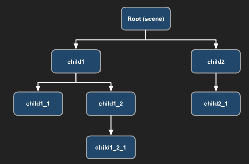
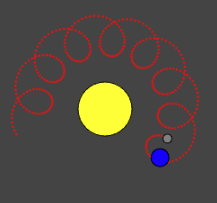
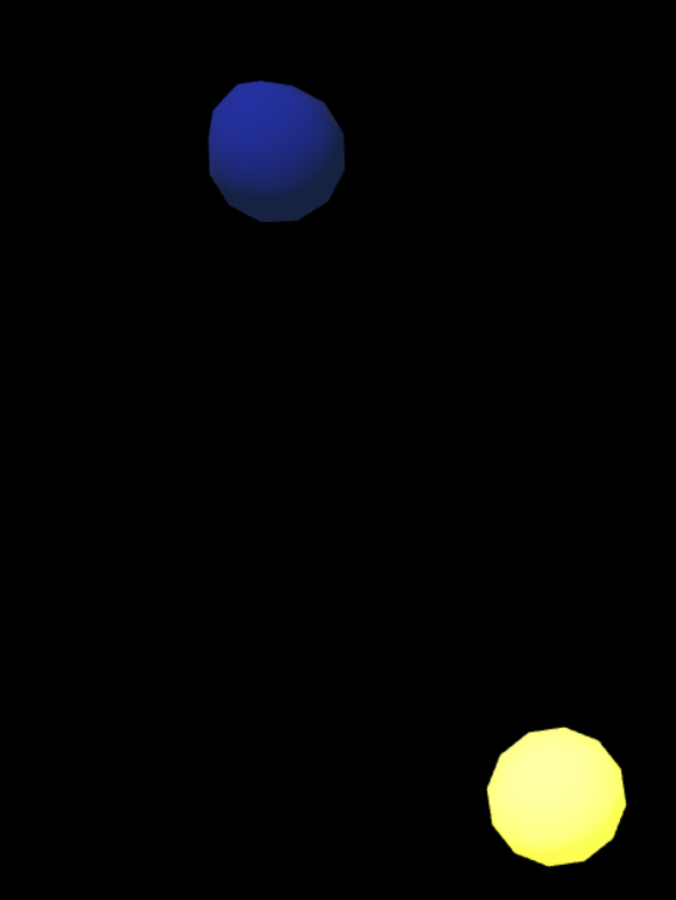
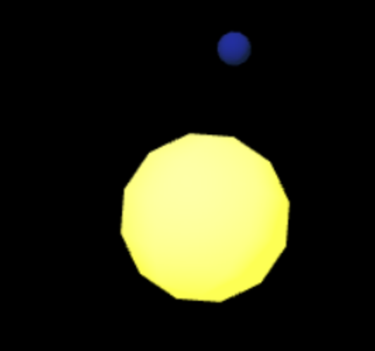
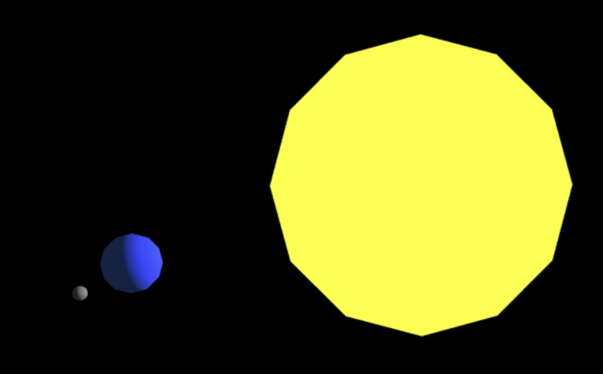
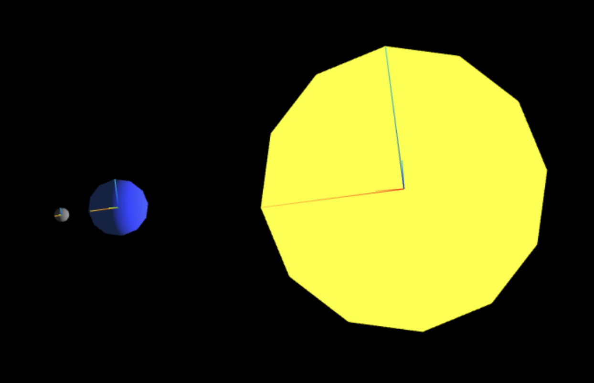
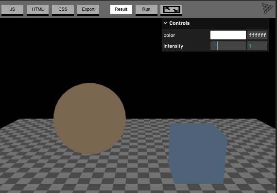
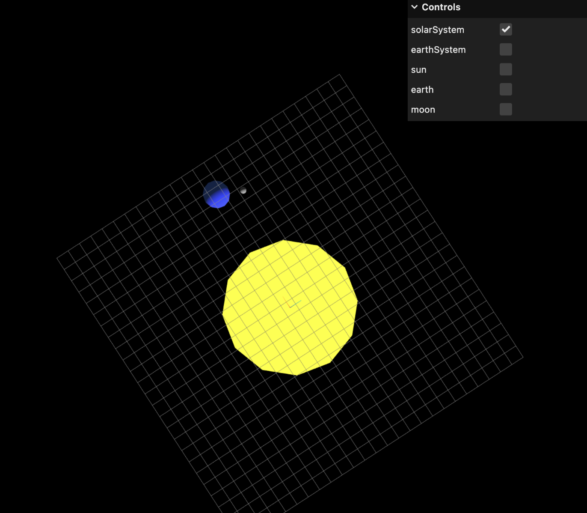
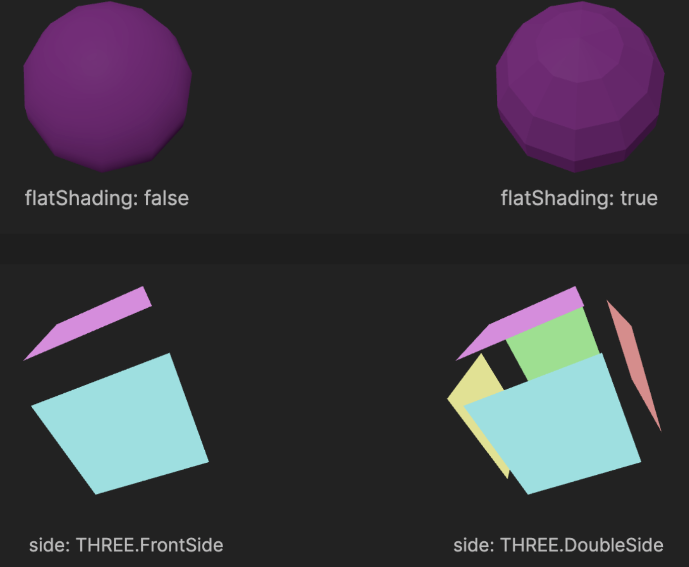

> ! 주의 : TIL 게시글입니다. 다듬지 않고 올리거나 기록을 통째로 복붙했을 수 있는 뒷고기 포스팅입니다.

공부하러 밖에 나가서 음~ 오늘은 또 타입스크립트로 즐기는 Three.js 강의 하나 더 봐야겠다~  
했는데 웬걸? 이어폰을 안 가져왔습니다  
제 기억 상 그 강의가 자막은 그냥 자동생성이었던거같아서  
그냥 코드베이스만 그 강의에서 했던 것처럼 클래스 형태를 따라가는거로 하고  
공식 문서를 봤습니다.

제가 이 시리즈 1~3까지 봤던 공식문서는 three.js documentation이었는데  
알고보니 [manual](https://threejs.org/manual/)도 따로 있습니다  
여기서는 Three.js가 뭔지, 개발환경과 알아두고 시작할 것들, 반응형 디자인, 기본 구조, ... 이런걸 설명해줍니다.  
게다가 documentation에는 번역이 빠진 것도 은근 있고, 그냥 번역체인데  
여기는 역주도 달려있고, 모양새도 뭔가 각잡고 누군가 번역해주신 모양새입니다  
그래서 꽤 좋은 것 같아요. 이런저런 기본구조에 대해서도 잘 알려주고, 예제도 적당하구요

그래서 이거로 기본구조 > 텍스처까지 따라가며 공부해보고 기록한걸 정리해서 올려둡니다.  
사실 조명, 카메라까지도 봤는데 이건 그냥 쭉 보기만 하면서 이런 종류의 조명/카메라가 있구나, 만 봤어요

밑에 태양계를 간단히 느낌만 나게 구현해본 예제 있으니까 구경해보세요

# 원시 모델(Primitives)

https://threejs.org/manual/#ko/primitives  
Three.js 원시 모델이란 : 주로 런타임에서 다양한 인자들로 정의한 3D 모양들입니다  
`BoxGeometry, CircleGeometry, ConeGeometry, ...`  
얘네들은 다 비슷비슷하게 인자를 넣고, 기하학 구조를 정의하고, .. 보통 그렇습니다

근데 특히 `TextGeometry`는 다른 원시 모델들과 다른데  
일단 비동기적으로 폰트를 로드해야해요

```js
const loader = new THREE.FontLoader();
loader.load('../resources/threejs/fonts/helvetiker_regular.typeface.json', (font) => {
	const text = 'three.js'
	const geometry = new THREE.TextGeometry(text, {
		font: font,
		size: ,
		depth: ,
		curveSegments: ,
		bevelEnabled: // 깎아낸 사각
	})
})
```

그래서 이렇게 프로미스 콜백으로 하거나, 비동기함수를 만들고 `await`으로 폰트를 가져오거나 합니다

```ts
 private async setupText() {
    const loader = new FontLoader();
    const font = await loader.loadAsync(
      "https://threejs.org/examples/fonts/helvetiker_regular.typeface.json"
    );
    const geometry = new TextGeometry("HELLO!", {
      font: font,
      size: 0.2,
      height: 0.05,
      curveSegments: 12,
      bevelEnabled: false,
    });
    const material = new THREE.MeshPhongMaterial({ color: 0x2200ff });
    const textMesh = new THREE.Mesh(geometry, material);
    this.text = textMesh;

    this.scene.add(textMesh);
  }
```

그리고 폰트는 기본적으로 중앙이 아닌 왼쪽모서리를 중심으로 회전축이 설정되어있어요  
중앙을 중심으로 돌게 하려면 Three.js에게 geometry의 경계 좌표(bounding box)를 계산해달라고 하고, `getCenter` 메서드에 해당 mesh의 위치값 객체를 넘겨줍니다.  
=> `getCenter` 메서드는 그 받은 위치값의 중앙 좌표값을 자신의 위치값으로 복사.  
=> 그런 다음 해당 메서드는 변경된 위치값 객체를 반환.  
=> 이 객체의 `.multiplyScalar(-1)` 메서드로 전체 텍스트의 회전 중심이 텍스트 중앙에 오도록 조정하면 됨

```ts
geometry.computeBoundingBox();
geometry.boundingBox?.getCenter(textMesh.position).multiplyScalar(-1);
```

근데 이대로 씬에 넣어버리면 위치값을 자동으로 재할당해버려요  
따라서 그 대신, Three.js 씬 그래프의 가장 기본 요소인 `Object3D`를 하나 만들고 이를 부모로 두게 합시다.  
이 기본 요소인 `Object3D`로 감싸는 테크닉은 꽤 자주 나옵니다  
이런 식으로 `Object3D`를 생성하고 텍스트를 감싸면, 텍스트의 회전 중심은 유지한 채로 위치값을 얼마든지 조정할 수 있습니다.

```ts
const parent = new THREE.Object3D();
parent.add(textMesh);
this.text = parent;
```

이렇게

전체 코드

```ts
private async setupText() {
    const loader = new FontLoader();
    const font = await loader.loadAsync(
      "https://threejs.org/examples/fonts/helvetiker_regular.typeface.json"
    );
    const geometry = new TextGeometry("HELLO!", {
      font: font,
      size: 0.2,
      height: 0.05,
      curveSegments: 30,
      bevelEnabled: true,
      bevelThickness: 0.01,
      bevelSize: 0.01,
      bevelSegments: 5,
    });
    const material = new THREE.MeshPhongMaterial({ color: 0xffff00 });
    const textMesh = new THREE.Mesh(geometry, material);

    geometry.computeBoundingBox();
    geometry.boundingBox?.getCenter(textMesh.position).multiplyScalar(-1);

    const parent = new THREE.Object3D();
    parent.add(textMesh);
    this.text = parent;

    this.scene.add(parent);
  }
```

# 씬 그래프(Scene Graph)

https://threejs.org/manual/#ko/scenegraph  
3D엔진에서 씬 그래프란 요소의 계층 구조를 나타낸 그림.  
**각 요소는 각각의 지역공간(local space)을 가진다**(3편에서 살펴봤었습니다)

예시



이 씬그래프를 잘 이해하기 위한 예제로 태양계 구현이 있습니다

## 태양계 구현하기 (태양, 지구, 달의 자전/공전)

태양과 지구와 달만 생각해봅시다  
태양은 자전만 하구요  
지구는 태양 주변을 공전하고 자전합니다  
달은 지구를 공전하고 또한 자전합니다



그럼 달 움직임이 이렇게 되는데  
달의 이 움직임을 그냥 수학적으로 구현하려면 너무 머리가 아픕니다 ㅜㅜ

그러나 이를 상대좌표(지역공간)로 나타내면 훨씬 쉽습니다  
달이 그냥 지구를 중심으로 하는 상대좌표 내에 놓이게 하면, 달은 지구의 움직임에 종속되면서도 본인의 공전 운동에만 집중하면 됩니다

이제 태양, 지구 달을 만들어봅시다?  
그 전에 먼저 `private objects: object3D[] = []`와 같이 물체들의 배열을 만들어둡시다.  
이제 내려다보는 평면에서 자전하게 하려고 합니다

```ts
private update(time: number) {
    time *= 0.001; // ms -> s
    this.objects.forEach((obj) => {
      obj.rotation.y = time;
    });
  }
```

카메라가 `position.set(0,30,0)`처럼 y축방향 위쪽으로 이동해있고, `lookAt(0,0,0)`상태인 경우입니다  
그럼 바라보는 평면상에서 자전하는 양상을 그려내려면 `rotation.y`값을 변경시켜줍니다  
공전은 나중에 알아보겠지만, 지역공간 자체를 회전시키게 될 예정입니다.

그리고 다 똑같은 구형체니까 geometry는 똑같은걸 재활용합시다.

```ts
// radius, width-segment, height-segment
const geometry = new THREE.SphereGeometry(1, 6, 6);
```

높이/너비 분할을 좀 적게 해서 자전운동이 눈에 잘 보이게 좀 해줍시다.  
나중에는 진짜 태양/지구/달같은 텍스처를 넣어서 좀 더 분할수를 높여볼것입니다

### 조명 세팅

아 근데 먼저 조명이 있어야하는데  
태양은 응당 태양계의 빛이니까, 태양 중심에서 뻗어나오는 점광원이 필요합니다

```ts
private setupLight() {
    const color = 0xffffff;
    const intensity = 500;
    const light = new THREE.PointLight(color, intensity);
    light.position.set(0, 0, 0);
    this.scene.add(light);
  }
```

### 태양 만들기

```ts
private setupSun(geometry: THREE.SphereGeometry) {
    const material = new THREE.MeshStandardMaterial({
      emissive: 0xffff00,
    });
    const sun = new THREE.Mesh(geometry, material);
    sun.scale.set(5, 5, 5); // 태양은 더 크게
    this.scene.add(sun);
    this.objects.push(sun);
  }
```

`setupSun` 메서드를 정의하고 콜해줍시다.  
태양은 응당 좀 커야겠으니까 5배씩 확대해주고요  
씬에 그대로 넣습니다.

### 지구 만들기

```ts
private setupEarth(geometry: THREE.SphereGeometry) {
    const material = new THREE.MeshStandardMaterial({
      color: 0x2233ff,
      emissive: 0x112244,
    });
    const earth = new THREE.Mesh(geometry, material);
    this.sun!.add(earth);
    earth.translateX(10); // 태양에서 10만큼 떨어진 곳에 지구
    this.objects.push(earth);
  }
```

태양의 로컬공간에 편입하기 위해 `scene.add`가 아닌 `this.sun.add`로 태양의 자식요소로 넣어줍시다.  
이제 `earth.translateX(10)`처럼 조금 떨어진 곳에 위치하게 해준다면, 태양이 회전함에 따라 로컬좌표계도 함께 회전하고, 그럼 그 안에 속한 지구가 공전하는 듯 보이게 됩니다

근데 아래처럼 태양과 지구의 크기가 똑같아보이게 되는데  
`sun.scale(5,5,5)`로 크기를 확대한게 **지역공간 자체를 확대**한 것입니다..  
그래서 지구의 크기도 그만큼 크게 되고, 거리도 사실 5x10만큼 적용되는 셈입니다

지금까지의 씬 그래프가 `Scene --> this.sun(5x) --> this.earth` 이렇게 되었기 때문입니다



이를 해결하려면 비어있는 씬 그래프 요소를 추가하여 해결합니다.  
**하나의 비어있는 지역 공간을 추가**하여 사실상 태양계를 나타내는 좌표계를 추가한다고 생각하시면 됩니다.

```ts
private setupSolarSystem() {
    const solarSystem = new THREE.Object3D();
    this.scene.add(solarSystem);
    this.objects.push(solarSystem);
    this.solarSystem = solarSystem;
  }
```

이러면 잘 나옵니다. 아래처럼



이러면 태양계에 해당하는 로컬 좌표공간은 (0,0,0)을 중심으로 회전함에 따라 (10,0,0)의 지구는 그 중심을 기준으로 회전합니다  
물체가 직접 회전하는게 아니라 공간 자체가 회전하는거십니다

그리고 이제 씬 그래프가 `scene --> solarSystem --> sun(5x), earth`처럼, 더이상 지구가 태양 밑에 속하지 않습니다  
따라서 태양의 지역공간이 확대되었지만 지구는 태양계의 지역공간에 속하므로 영향을 받지 않습니다

### 달 추가하기

```tsx
private setupEarth(geometry: THREE.SphereGeometry) {
    ...

    // 지구계를 정의하여 나중에 달 넣을때 사용
    const earthSystem = new THREE.Object3D();
    earth.add(earthSystem);
    this.earthSystem = earthSystem;
  }

 private setupMoon(geomtry: THREE.SphereGeometry) {
    const material = new THREE.MeshStandardMaterial({
      color: 0x888888,
      emissive: 0x222222,
    });
    const moon = new THREE.Mesh(geomtry, material);
    moon.translateX(2); // 지구에서 2만큼 떨어진 곳에 달
    moon.scale.set(0.25, 0.25, 0.25); // 달은 지구의 1/4 크기
    this.objects.push(moon);
    this.earthSystem!.add(moon);
  }
```

달을 추가할건데, 아까 빈 로컬공간을 만들었던 것처럼 지구계를 먼저 추가합시다  
그런 다음 적당히, 태양계에 지구 넣은 것처럼, 지구계에 달을 넣으면 됩니다



### 시각적으로 축을 확인하기

Three.js에는 씬그래프 요소들의 좌표계, 축, 등등을 확인할 수 있는 헬퍼 클래스가 있습니다  
예를 들어, 축을 시각적으로 확인하고 싶다면 `AxesHelper`를 사용해요

```ts
private update(time: number) {
    time *= 0.001; // ms -> s
    this.objects.forEach((obj) => {
      const axes = new THREE.AxesHelper();
      // @ts-ignore
      axes.material.depthTest = false;
      axes.renderOrder = 1;
      obj.add(axes);
      obj.rotation.y = time / 3;
    });
  }
```

`axes.material.depthTest = false`로 물체 내부에도 축이 그려지게 하고  
`axes.renderOrder=1`로 설정(기본은 0임)하여 구체 렌더링 후에 그려지게 합니다.



근데 돌아가는 모습을 보다보면 태양과 지구에 축이 막 두 가지가 존재합니다  
이게 태양이랑 태양계 축이 같이 있고, 지구와 지구계 축이 같이 있어서 그렇습니다.  
이런 문제를 해결하고, 축(그리고 좌표격자도)을 켜고 끌 수 있게 하기 위해 컨트롤 패널을 만들어봅시다.

#### 컨트롤 패널 만들기 - lil-gui

[lil-gui](https://github.com/georgealways/lil-gui)는 Three.js가 함께 쓰면 좋다고 권장하고, 실제로 같이 번들에 포함되어있습니다.  
뭐하는 라이브러리냐면, 객체와 속성 이름을 받아서 해당 속성의 타입을 기반으로 속성값을 UI로 조정할 수 있게 만들어주는 라이브러리입니다

Three.js 문서 보다보면 아래같은 예시들이 꽤 많은데



우상단의 "controls" 패널이 바로 이것입니다

일단 우리는 격자와 축을 둘 다 같이 통합하고싶어서, 아래같은 클래스를 추가합시다.

```ts
import * as THREE from "three";
class AxisGridHelper {
  private grid: THREE.GridHelper;
  private axes: THREE.AxesHelper;
  private _visible: boolean;
  constructor(obj: THREE.Object3D, units: number = 10) {
    const grid = new THREE.GridHelper(units, units);
    const axes = new THREE.AxesHelper();

    // @ts-ignore <-- 왜 타입에러 ;
    axes.material.depthTest = false;
    axes.renderOrder = 2;

    grid.material.depthTest = false;
    grid.renderOrder = 1;

    this.grid = grid;
    this.axes = axes;
    this._visible = false;

    obj.add(grid);
    obj.add(axes);
  }

  get visible() {
    return this._visible;
  }
  set visible(v) {
    this._visible = v;
    this.grid.visible = this._visible;
    this.axes.visible = this._visible;
  }
}
```

둘 다 `depthTest`를 끄고, 물체 -> 격자 -> 축 순으로 그려지게 해줍시다.  
그리고 `visible` 프로퍼티를 관리하여 컨트롤할 수 있게 합니다.

이제 다시 돌아가서 이를 이용한 `makeAxisGrid` 메서드를 정의합시다  
3D오브젝트와 그 이름인 `label`, 그리고 선택적으로 격자 크기를 받아서 컨트롤패널에 추가하는 메서드입니다.

```ts
private makeAxisGrid(obj: THREE.Object3D, label: string, units?: number) {
    const helper = new AxisGridHelper(obj, units);
    helper.visible = false;
    this.gui.add(helper, "visible").name(label);
  }
```

이제 `setupModels()`에서 태양/지구/달을 모두 선언한 다음에 이 메서드들을 호출합시다.

```ts
private setupModels() {
    const geometry = new THREE.SphereGeometry(1, 12, 12);
    this.setupSolarSystem();
    this.setupSun(geometry);
    this.setupEarth(geometry);
    this.setupMoon(geometry);

    this.makeAxisGrid(this.solarSystem!, "solarSystem", 25);
    this.makeAxisGrid(this.earthSystem!, "earthSystem");
    this.makeAxisGrid(this.sun!, "sun");
    this.makeAxisGrid(this.earth!, "earth");
    this.makeAxisGrid(this.moon!, "moon");
  }
```

그럼 이렇게 됩니다.



실제로 한 칸 한 칸이 위치 1씩에 대응되어, 10으로 설정한 지구-태양 사이의 거리가 격자판에서 10칸에 대응하는 것을 볼 수 있습니다.  
또한 태양계공간에서의 지구 위치는 변하지 않고 태양계공간이 회전함에 따라 같이 박혀서 움직이는 것을 볼 수 있습니다

### 카메라 인터랙션 추가하기 : OrbitControl

그리고 마우스로 잡아끌어서 시점을 바꾸고, 줌인도 가능하게 하고싶습니다  
`OrbitControls`를 이용하면 쉽습니다

```ts
import { OrbitControls } from "three/examples/jsm/Addons.js";

...

// OrbitControls만 생성하고 추가해줘도 이미 마우스로 잡아끌기 가능함
this.controls = new OrbitControls(this.camera, this.renderer.domElement);
this.controls.enableDamping = true; //부드럽게 전환
this.controls.dampingFactor = 0.05; //부드럽게 전환하는 정도
this.controls.enableZoom = true; //줌 가능하게
```

그리고 `render` 메서드에서 `OrbitControl` 업데이트 한 줄도 추가해줍시다.

```ts
private render(time: number) {
    this.update(time);
    this.controls?.update();
    this.renderer.render(this.scene, this.camera!);
  }
```

# 재질(materials)

https://threejs.org/manual/#ko/materials  
이제 대충 태양계는 끝났구요, 텍스처를 적용하러 가기 전에 재질을 한번 살펴보고 갑시다

Three.js의 기본 재질들 :

- `MeshBasicMaterial` : 광원의 영향을 받지 않음
- `MeshLambertMaterial` : 정점에서만 광원을 계산함..
- `MeshPhongMaterial` : 픽셀 하나하나 광원을 전부 계산하고, + 반사점을 지원함.
- `MeshToonMaterial` : Phong과 비슷하지만, 부드러운 쉐이딩 대신 그라디언트 맵을 사용하여 투톤의 카툰 느낌을 줌.

이 친구들은 3D처럼 보이기 위해 간단한 수학을 사용하지만, 실제와는 좀 다른데요  
얘네 말고도 물리 기반 렌더링을 위한 재질들이 따로 또 있습니다.

_물리 기반 렌더링을 위한_ 재질들 => 물리기반렌더링은 줄여서 PBR(Physically Based Rendering) => 얘네들은 좀 더 복잡한 수학을 사용해요

- `MeshStandardMaterial` : phong과 달리 얘는 `roughness, metalness`를 0~1 사이 값으로 설정가능.
- `MeshPhysicalMaterial` : standard와 비슷하지만, 0~1의 `clearcoat` 속성으로 코팅 세기를 정하고, `clearcoatRoughness`로 코팅의 거침 정도를 정한다.

basic < lambert < phong < standard < physical 순으로 성능부담이 큽니다.

이외 특수한 재질로 `ShadowMaterial, MeshDepthMaterial, MeshNormalMetrial`은 각각 그림자, 픽셀의 깊이, 기하학의 법선을 나타낼 수 있습니다.

`ShaderMaterial, RawShaderMaterial`은 재질 커스텀 시 사용하는데  
전자는 Three.js의 쉐이더 시스템을 사용하지만, 후자는 아예 Three.js 없이 작성합니다.

재질 속성은 [docs](https://threejs.org/docs/#api/ko/materials/Material)를 참고하되, 두 가지 자주 쓰이는거는

- `flatShading` : 물체를 각지게 표현할지. `false`가 기본
- `side` : 어떤 면을 렌더링할지? => 그때 원규님이 말씀하신 뒷면문제다
  - `THREE.FrontSide`(기본값) : 앞면
  - `THREE.BackSide` : 뒷면
  - `THREE.DoubleSide` : 양면

예를 들어 직육면체면 안쪽은 렌더링하지 않아도 되겠죠?



참고 : Three.js는 기본적으로 처음 한 번만 재질의 설정을 적용합니다. 만약 런타임에 재질의 속성을 바꿨으면 `material.needsUpdate = true`로 반영을 해줍시다.

- `flatShading` 속성 변경
- 텍스처 추가/제거 시

# 텍스처(Textures)

https://threejs.org/manual/#ko/textures  
텍스처를 적용해봅시다.  
텍스처가 뭔지는 말 안해도 대충 느낌적인 느낌으로 알고계시죠?

`new THREE.TextureLoader()`로 로더객체를 만들어주고  
`loader.load(url)`로 불러와줍니다  
이게 비동기실행이라고 겁주던데, 예제코드에서도 비동기처럼 취급 안하고 쓰길래 아래처럼 썼습니다.

```ts
  private setupSun(geometry: THREE.SphereGeometry) {
    const loader = new THREE.TextureLoader();
    const sunTexture = loader.load("/src/textures/sun.png");
    sunTexture.colorSpace = THREE.SRGBColorSpace;
    const material = new THREE.MeshBasicMaterial({
\      map: sunTexture,
    });
```

이렇게 하면 되십니다  
근데 `"textures/sun.png"` 이렇게 아니면 `"./textures/sun.png"` 이런 식으로 상대경로로 하니까 불러와지지가 않더라구요  
절대경로로 해주니까 되더랍니다

텍스쳐는 여러 무료 사이트도 있고 한데, [태양계 텍스쳐 사이트](https://www.solarsystemscope.com/textures/)가 있어서 여기서 가져왔습니다  
확실히 확실해요

그리고 이제 color값은 필요없고, 로더에서 텍스처를 가져와서 씁니다.  
`material`만들 때 `map: texture`처럼 컬러 대신 텍스처를 넣으면 됩니다.  
`colorSpace`를 안바꾸면 좀 쨍하더라구요? 공식문서의 예제에서도 이 줄을 넣어두길래 따라했습니다.

`emissive` 속성은 => 지구와 달은 `#222222`로 유지하면 좋은데요, 이게 아니면 광원이 비추지 않는 뒷면은 아예 보이지도 않습니다  
그림자라도 보이게 하려면 있는게 좋더라구요

---

완성한 태양계(데모)입니다

<iframe src="https://codesandbox.io/embed/rzcztw?view=preview&hidenavigation=1"
     style="width:100%; height: 500px; border:0; border-radius: 4px; overflow:hidden;"
     title="three.js (forked)"
     allow="accelerometer; ambient-light-sensor; camera; encrypted-media; geolocation; gyroscope; hid; microphone; midi; payment; usb; vr; xr-spatial-tracking"
     sandbox="allow-forms allow-modals allow-popups allow-presentation allow-same-origin allow-scripts"
   ></iframe>
