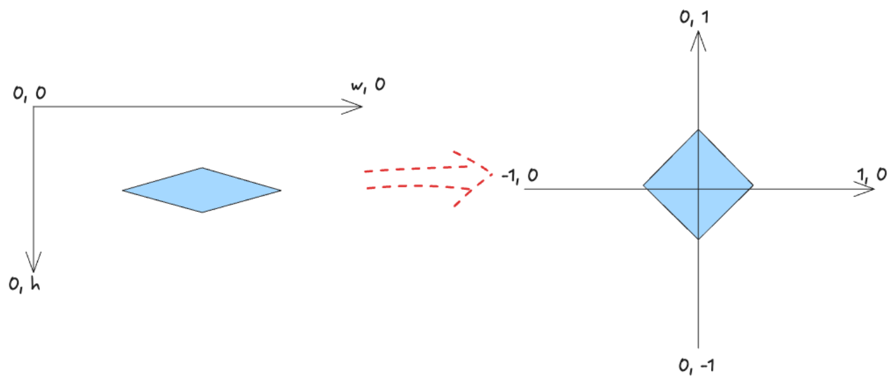
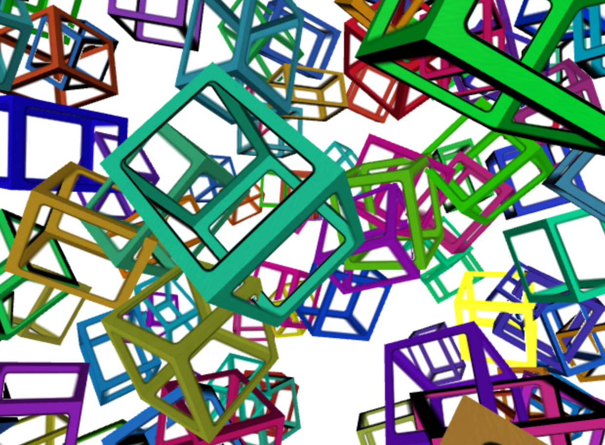
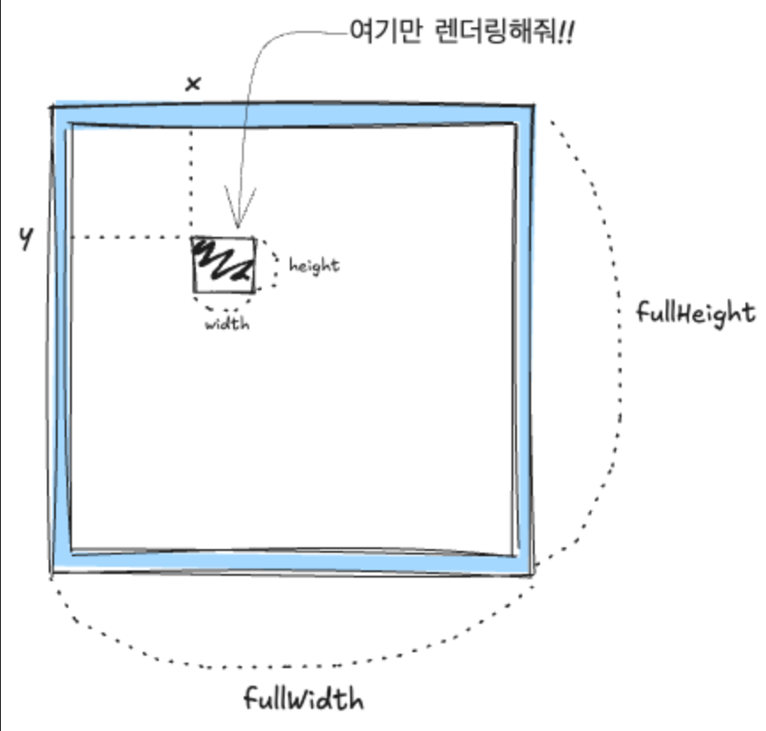
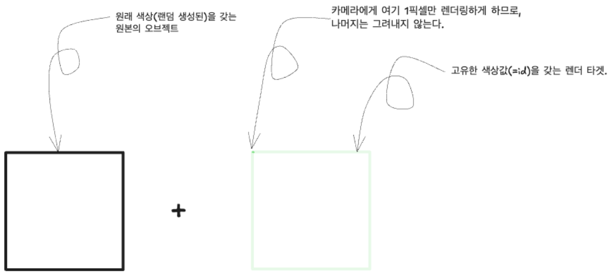

> ! 주의 : TIL 게시글입니다. 다듬지 않고 올리거나 기록을 통째로 복붙했을 수 있는 뒷고기 포스팅입니다.

오늘은 공식문서에서 Render Target과 물체를 마우스로 Picking하는 법에 대해 살펴보겠습니다  
Picking에는 몇 가지 방법이 있는데, 그 중 하나가 Render Target을 사용하는 경우가 있어서 함께 보게 되었습니다

공식문서에서 코드는 js로 작성하는데, 저는 이전에 들었던 [ts + three.js 강의]('/til/threejs-with-typescript-01/')에서 했던 것처럼 TS + 클래스 객체지향처럼 작성해보겠습니다  
그 강의에서 했던 코드베이스를 거의 유지(카메라, 씬, 이벤트 셋업 등)하면서요

# Render Target

[Render Target](https://threejs.org/manual/#ko/rendertargets)이란 직접 렌더링할 수 있는 텍스쳐를 말합니다.  
한 번 텍스쳐로 렌더링한 뒤에는 다른 텍스처처럼 사용할 수 있어요

마치.. 장면을 렌더링하여 텍스처로 만든다고 해야 할까요?  
새로운 렌더링 세계를 만들고 이를 텍스처로 만든다고 해야할까요?

아무튼 먼저 봅시다  
먼저 렌더 타겟을 셋업하는 코드를 작성하겠습니다

```ts
private setupRenderTarget() {
const rtWidth = 512;
const rtHeight = 512;
const renderTarget = new THREE.WebGLRenderTarget(rtWidth, rtHeight);
const rtCamera = new THREE.PerspectiveCamera(
  75,
  rtWidth / rtHeight,
  0.1,
  1000
);
rtCamera.position.y = 40;
rtCamera.lookAt(0, 0, 0);

const rtScene = new THREE.Scene();
// rtScene.background = new THREE.Color("red");
this.rtScene = rtScene;
this.rtCamera = rtCamera;
this.renderTarget = renderTarget;

const light = new THREE.AmbientLight(0x404040); // 부드러운 조명
this.rtScene!.add(light);

const directionalLight = new THREE.DirectionalLight(0xffffff, 1.5); // 강한 조명 추가
directionalLight.position.set(10, 10, 10);
this.rtScene!.add(directionalLight);

... // 이 밑에서 렌더타겟 장면 내부에 물체들을 생성.
```

먼저 이렇게 렌더 타겟 세계를 만듭시다. => `new THREE.WebGLRenderTarget(w, h)`  
여기에 장면을 담겠습니다. => `rtCamera, rtScene`  
조명도 대충 생성해주고요 => `rtScene.add(light)`

여기는 마치 제 2의 렌더링 세계를 만들듯이, 렌더 타겟 내부를 비출 조명과 카메라, 장면, 물체, ...등을 내부에 생성해줘야 합니다.  
그럼 이제 렌더타겟 장면 내부의 물체를 만들차례죠?

```ts
const setupRTModels = () => {
  const basicMaterial = new THREE.MeshBasicMaterial({
    color: 0x808080,
    side: THREE.DoubleSide
  });
  const plane = this.createPlane(basicMaterial);
  const hemiSphere = this.createHemiSphere();
  this.rtScene!.add(plane); //rtScene에 추가
  this.rtScene!.add(hemiSphere); //rtScene에 추가

  for (let i = 0; i < 8; i++) {
    const torusSystem = new THREE.Object3D();
    const torus = this.createTorus();
    torusSystem.add(torus);
    torus.position.set(0, 4, 20);
    torus.rotation.y = Math.PI / 2;
    torusSystem.rotation.y = (i * Math.PI) / 4;
    this.rtScene!.add(torusSystem); //rtScene에 추가
  }

  const ballGeometry = new THREE.SphereGeometry(2, 32, 32);
  const ballMaterial = new THREE.MeshPhongMaterial({ color: 0xff0000 });
  const ball = new THREE.Mesh(ballGeometry, ballMaterial);
  const ballSystem = new THREE.Object3D();
  ballSystem.add(ball);
  ball.position.set(0, 4, 20);
  ballSystem.name = "ballSystem";
  this.rtScene!.add(ballSystem); //rtScene에 추가
};
setupRTModels();
```

이건 [TypeScript로 즐기는 Three.js 강의 - 3. Transform](https://www.youtube.com/watch?v=QDPwVfiYu7g&list=PLe6NQuuFBu7F8tG1ZweG3pME3E4M-Q0LA&index=3)에서 씬 그래프를 이해하고 트랜스폼 등을 이해하기 위한 예제입니다  
아래와 같은 애니메이션이에요


이제 이걸 마치 하나의 텍스처처럼 만들어버리겠다는 뜻인데  
이제 렌더타겟이 완성되었으니, 원래 전체 장면의 모델을 셋업합니다.

```ts
private setupModels() {
    const material = new THREE.MeshBasicMaterial({
      map: this.renderTarget!.texture, // 렌더 타겟을 텍스처로 갖는 재질
    });
    const geometry = new THREE.BoxGeometry(20, 20, 20);
    const lineGeometry = new THREE.EdgesGeometry(geometry);
    const lineMaterial = new THREE.LineBasicMaterial({ color: 0xffffff });
    const line = new THREE.LineSegments(lineGeometry, lineMaterial);
    const box = new THREE.Mesh(geometry, material);
    const group = new THREE.Group();
    group.add(box);
    group.add(line);
    this.scene.add(group);
  }
```

이렇게 렌더타겟을 텍스처로 갖는 정육면체를 생성했고, `lineSegments`로 선도 따줬습니다.

이제 렌더함수에서 :

```ts
private render(time: number) {
	this.update(time);
	this.renderer.setRenderTarget(this.renderTarget!);
	this.renderer.render(this.rtScene!, this.rtCamera!);
	this.renderer.setRenderTarget(null);
	this.renderer.render(this.scene, this.camera!);
}
```

먼저 업데이트함수를 호출하고,

1. 렌더러 타겟을 RenderTarget으로 설정하고 렌더링.
2. 렌더러 타겟을 다시 null로 설정하여 기본 장면을 대상으로 설정.
3. 이제 기본 장면을 렌더링.

그럼 업데이트함수는 :

```ts
private update(time: number) {
    time *= 0.001; // ms -> s
    const ball = this.rtScene!.getObjectByName("ballSystem") as THREE.Object3D;
    if (ball) {
      ball.rotation.y = Math.cos(time / 2) * Math.PI * 20;
    }
  }
```

이렇게 `rtScene`에서 ball을 찾아와서 업데이트해줘야 합니다.


이렇게 됐습니다.  
정육면체의 텍스처로써 렌더 타겟을 렌더링하여,  
마치 각 면에 렌더 타겟의 세상을 가둔 듯이.. 됐네요

이 렌더 타겟은 활용이 많은데  
그림자, 피킹, 후처리 등등에 사용처가 있고  
차의 백미러나 모니터 화면 등을 표현할 때 요긴하게 쓰이겠습니다

그럼 피킹에 어떻게 렌더 타겟을 사용하는지 보기 위해, 피킹에 대해 알아보겠습니다

# 피킹 Picking

[picking](https://threejs.org/manual/#ko/picking)이란:  
사용자가 클릭 또는 터치한 물체를 가려내는 작업입니다. onclick에서 어떤 물체가 선택되었는지 판단하는거죠  
피킹 구현 방법은 수없이 많고, 각자 장단점이 있습니다  
여기서는, 공식문서에 소개된, 주로 사용되는 두 가지 방법을 살펴보려고 합니다

## ray casting : 광선 투사

포인터에서 장면의 절두체로 광선을 쏴 광선이 닿는 물체를 감지하는 기법인데  
이론적으로 가장 간단한 방법입니다

이 경우 먼저 포인터의 좌표를 구하고, 이 좌표를 카메라의 시선과 방향에 따라 3D좌표로 변환합니다.  
그리고 near ~ far 절단면까지 쭉 직선(광선)을 구해 이 직선이 장면 내 각 물체의 삼각형과 교차하는지 확인합니다.

이러면 만약 어떤 물체가 1000개의 삼각형을 가진 복잡한 물체가 1000개 존재하면 백만개의 삼각형을 모두 확인해야 하겠네요..  
그래서 이를 최적화하기 위해, 물체의 경계 좌표가 광선과 교차하는지 확인하고 교차하지 않는다면 그 물체의 삼각형을 확인하지 않는 방식을 생각할 수 있습니다.  
Three.js는 이와 같은 작업을 **RayCater** 클래스가 알아서 해줍니다.

그럼 이제 레이 캐스팅으로 피킹을 해봅시다  
먼저 공식문서대로 `PickHelper`라는 클래스를 먼저 작성해줍니다.

```ts
import * as THREE from "three";

class PickHelper {
  private raycaster: THREE.Raycaster;
  private pickedObject: THREE.Object3D<THREE.Object3DEventMap> | null = null;
  private pickedObjectSavedColor: number = 0;

  constructor() {
    this.raycaster = new THREE.Raycaster();
  }
  pick(
    normalizedPosition: THREE.Vector2,
    scene: THREE.Scene,
    camera: THREE.Camera,
    time: number
  ) {
    // 이미 다른 물체가 피킹된 경우 색을 복원
    if (
      this.pickedObject &&
      this.pickedObject instanceof THREE.Mesh &&
      isMeshStandardMaterial(this.pickedObject.material)
    ) {
      this.pickedObject.material.emissive.setHex(this.pickedObjectSavedColor);
      this.pickedObject = null;
    }

    //절두체로 광선을 쏘자
    this.raycaster.setFromCamera(normalizedPosition, camera);
    //그 광선과 교차하는 물체들을 배열로 반환받자
    const intersectedObjects = this.raycaster.intersectObjects(scene.children);
    if (
      this.pickedObject &&
      this.pickedObject instanceof THREE.Mesh &&
      isMeshStandardMaterial(this.pickedObject.material)
    ) {
      this.pickedObjectSavedColor =
        this.pickedObject.material.emissive.getHex(); // 원본 색상을 저장해두고

      this.pickedObject.material.emissive.setHex(
        // 빛나게 만들기
        (time * 8) % 2 > 1 ? 0x000000 : 0xffffff
      );
    }
  }
}
function isMeshStandardMaterial(
  material: THREE.Material
): material is THREE.MeshStandardMaterial {
  return (material as THREE.MeshStandardMaterial).emissive !== undefined;
}
```

이제 다시 원래 있던 메인 클래스로 돌아갑시다.  
먼저 `new PickHelper()`로 인스턴스를 만들어두고  
다음과 같은 메서드들을 작성합시다.

```ts
private getCanvasRelativePosition(event: MouseEvent) {
    const rect = this.domApp.getBoundingClientRect();
    return {
      x: ((event.clientX - rect.left) * this.domApp.offsetWidth) / rect.width,
      y: ((event.clientY - rect.top) * this.domApp.offsetHeight) / rect.height,
    };
  }

  private clearPickPosition() {
    this.pickPosition.x = -100000;
    this.pickPosition.y = -100000;
  }

  private setPickPosition(event: MouseEvent) {
    const pos = this.getCanvasRelativePosition(event);
    this.pickPosition.x = (pos.x / this.domApp.offsetWidth) * 2 - 1;
    this.pickPosition.y = (pos.y / this.domApp.offsetHeight) * -2 + 1;
  }
```

- `getCanvasRelativePosition`은 클릭한 좌표가 캔버스(저같은 경우는 `domApp` div) 내에서의 위치가 어디인지 계산합니다.
- `clearPickPosition`은 마우스가 캔버스 밖으로 나가는 등의 경우에 대해 임시 초기화를 위한 메서드입니다.
- `setPickPosition`에서 클릭한 (캔버스 상대)위치를 정규화합니다 => NDC(Normalized Device Coord.)로 변환

여기서 잠깐, 저는 `setPickPosition`에서

```ts
this.pickPosition.x = (pos.x / this.domApp.offsetWidth) * 2 - 1;
this.pickPosition.y = (pos.y / this.domApp.offsetHeight) * -2 + 1;
```

이렇게 써둔게 이해가 바로 가지 않았는데요  
Normalized Device Coord.가 뭔지 알아봐야겠습니다

### NDC (Normalized Device Coordinates)로 변환

캔버스(domApp)의 너비와 높이는 가변적이므로, 클릭한 위치도 가변적입니다.  
이를 장치에 무관하게 정규화한 좌표를 Normalized Device Coordinates라고 합니다



오른쪽같은, 범위가 `[-1, 1]`로 제한되는 데카르트좌표계로 옮긴다고 생각하면 될 듯 합니다
그러려면 일단.. 0~w를 0~1까지 줄이고 => `pos.x / w`
0~1을 0~2로 만들고 => `(pos.x/w)*2`
0~2를 -1 ~ 1로 만들고 => `(pos.x/w)*2-1` => NDC 완성!!
y축은 똑같이하지만, y축 양수 방향이 반대니까, `(pos.y/h) * -2 + 1` 이렇게 부호를 뒤집으면 됩니다.

왜 NDC를 사용해야 할까요?

- 말했듯이 화면상의 픽셀 좌표는 해상도나 캔버스 크기에 따라 달라질건데, NDC는 정규화하여 범위를 고정했으니 여러 디바이스에서 일관된 동작
- 렌더링 파이프라인에서 WebGL과 같은 저수준 그래픽 API는 NDC를 사용해줘야 함

아무튼 이렇게 하고 이벤트리스너를 등록하면 :

```ts
window.addEventListener("mousemove", this.setPickPosition.bind(this));
window.addEventListener("mouseout", this.clearPickPosition.bind(this));
window.addEventListener("mouseleave", this.clearPickPosition.bind(this));
```

그리고 마지막으로, 렌더 함수에서 PickHelper의 pick메서드를 호출하면 :

```ts
private render(time: number) {
    time *= 0.001; // ms -> s
    this.pickHelper.pick(
      new THREE.Vector2(this.pickPosition.x, this.pickPosition.y),
      this.scene,
      this.camera!,
      time
    );
    this.renderer.render(this.scene, this.camera!);
  }
```

이제 여기서 공식문서에는 없는, 추가 동작으로 click해서 없어지게까지 한다면!!

```ts
click(scene: THREE.Scene) {
    if (
      this.pickedObject &&
      this.pickedObject instanceof THREE.Mesh &&
      isMeshStandardMaterial(this.pickedObject.material)
    ) {
      this.pickedObject?.geometry.dispose();
      this.pickedObject?.material.dispose();
      scene.remove(this.pickedObject!);
    }
  }
```

주의 : 장면에서 어떤 물체를 제거할 때는 `geometry`와 `material`을 모두 `dispose`로 해제해줘야 합니다.

결과

<iframe src="https://codesandbox.io/embed/qgjv7v?view=preview&module=%2Fsrc%2Fmain.ts"
     style="width:100%; height: 500px; border:0; border-radius: 4px; overflow:hidden;"
     title="sad-goldberg-qgjv7v"
     allow="accelerometer; ambient-light-sensor; camera; encrypted-media; geolocation; gyroscope; hid; microphone; midi; payment; usb; vr; xr-spatial-tracking"
     sandbox="allow-forms allow-modals allow-popups allow-presentation allow-same-origin allow-scripts"
   ></iframe>

근데 이 레이 캐스팅은 몇 가지 문제점이 있는데요

- CPU의 자원을 사용한다는 점.
  - 자바스크립트 엔진은 각 요소를 돌며 광선이 요소의 경계 좌표 안에 교차하는지 확인해야 함.
  - 일단 교차하는 지점을 정확히 알고 이를 넘겨받을 수 있다는 점은 장점이다. 교차점에 특정 표시를 한다거나 이런게 가능
  - 대신 CPU가 많은 일을 해야한다는 것.. 요소가 가진 삼각형이 많을 수록 더 그렇겠다.
- 특이한 방식의 쉐이더나 변이를 감지하지 못함
  - Scene에서 Geometry를 변형하는 쉐이더가 사용된 경우, 자바스크립트는 이 변형을 감지하지 못함..
- 요소의 투명한 구멍을 처리하지 못함. 예를 들어 : 투명한 부분이 있는 텍스처를 적용하면



이렇게 될텐데요, 이렇게 일부가 투명한 경우 이를 뚫고 뒤에 있는 물체를 선택할 수 없습니다.  
Geometry를 기반으로 피킹을 연산하므로, 그게 실제로 투명하든 아니든, Geometry는 그곳에 존재하기 때문입니다

따라서 이런 경우 GPU 기반 피킹을 구현해야 하고, 이 때 **렌더 타겟**을 사용해볼 수 있습니다.

## GPU 기반 피킹

GPU 피킹을 구현하려면 각 요소를 별도의 화면에서 한번 더 렌더링하되, 고유한 색상(id로 사용)을 갖게 해야 합니다.  
=> **Render Target**을 이용하는 것인데요  
그럼 피킹할 때는 **포인터 아래에 있는 픽셀의 색**을 가져와 그 해당 색상값에 대응하는 물체가 선택됨을 알 수 있습니다.

이러면 위에서 말한 2,3번(변형에 대응 못하고, 투명에 대응 못하고)을 해결할 수는 있는데,  
피킹을 위한 렌더 타겟을 하나 더 덧대는거니까 렌더링이 2배가 되는 셈이긴 합니다.

이 때 성능 최적화를 위해 사용 가능한 방법이 있는데  
어차피 한 픽셀만 읽을거니까, 카메라를 픽셀 하나만 렌더링하도록 설정해줄 수 있겠습니다.  
Three.js에서는 `PerspectiveCamera.setViewOffset` 으로 카메라의 특정 부분만 렌더링하도록 할 수 있어요

이를 구현해보기 위해 장면 하나 더 추가해봅시다.

```ts
this.pickingScene = new THREE.Scene();
this.pickingScene.background = new THREE.Color(0);
```

그리고 이제 각 큐브 생성에서, `pickingScene`의 같은 위치에 **피킹용 정육면체**를 추가해줍시다.  
이 피킹용 정육면체에는 id로 쓸 고유 색상값을 지정하고, 이 id 색상값으로 재질을 만들어 추가할겁니다.  
나중에 id색상값을 키값으로 매핑하여 이에 상응하는 정육면체를 바로 불러올 수 있겠어요

먼저 `this.objects` 객체를 추가하고
`private objects: Record<string, THREE.Mesh> = {};`

```ts
for (let i = 0; i < 50; i++) {
  getNewBox(i + 1);
}
```

번호를 넘겨주세요. 박스 만들 때
이제 `getNewBox`함수는

```ts
getNewBox(id: number) {
	... // 이전 box생성코드
	this.objects[id] = cube;
    const pickingMaterial = new THREE.MeshPhongMaterial({
        emissive: new THREE.Color().setHex(id, THREE.NoColorSpace),
        color: new THREE.Color(0,0,0),
        specular: new THREE.Color(0,0,0),
        map: texture,
        transparent: true,
        side: THREE.DoubleSide,
        alphaTest: 0.5,
        blending: THREE.NoBlending
    })
    const pickingCube = new THREE.Mesh(geometry, pickingMaterial);
    this.pickingScene.add(pickingCube);
    pickingCube.position.copy(cube.position);
    pickingCube.rotation.copy(cube.rotation);
    pickingCube.scale.copy(cube.scale);
}
```

이렇게 id와 큐브 쌍을 저장해주고, pickingMaterial을 따로 만들어줍시다.

이 때 `MeshPhongMaterial`로 편법을 쓴 셈인데

- `emissive` 속성을 id색상값으로, `color`와 `specular`를 0으로 설정하면 => 텍스처의 `alphaTest`보다 큰 부분만 id색상값으로 표현됨
- 그리고 `blending` 속성을 `THREE.NoBlending`으로 설정하여 id 색상값이 알파값의 영향을 받지 않도록

그래도 최적은 아니긴합니다.. 여전히 조명 관련 연산이 실행될거다
더 최적화하려면 `alphaTest`보다 높은 경우에 대해서만 id 색상을 렌더링하는 쉐이더를 손수 만들어버려야 한다고 하네요

이제 이 방법으로는 광선 투사법때와 달리 픽셀을 하나(마우스 커서가 위치하는 딱 그 픽셀)만 사용하게 되므로, 위치값이 픽셀 하나만 가리키게 변경됩니다.

```diff
function setPickPosition(event) {
  const pos = getCanvasRelativePosition(event);
-  pickPosition.x = (pos.x / canvas.clientWidth ) *  2 - 1;
-  pickPosition.y = (pos.y / canvas.clientHeight) * -2 + 1;  // Y 축을 뒤집었음
+  pickPosition.x = pos.x;
+  pickPosition.y = pos.y;
}
```

이제 `PickerHelper`클래스도 `GPUPickHelper`로 변경됩니다.
`WebGLRenderTarget`으로 구현하되, 이 렌더 타겟의 크기는 단 1픽셀로.

```ts
class GPUPickHelper {
  private pickingTexture = new THREE.WebGLRenderTarget(1, 1);
  private pixelBuffer = new Uint8Array(4);
```

1픽셀의 렌더 타겟을 생성하고, rgb값을 담을 수 있는 길이 4짜리 Uint8Array버퍼를 생성해줍니다.

이제 `pick` 메서드를 수정할건데

```ts
class GPUPickHelper {
pick(
    cssPosition: THREE.Vector2,
    scene: THREE.Scene,
    camera: THREE.PerspectiveCamera,
    time: number,
    renderer: THREE.WebGLRenderer,
    idToObject: Record<number, THREE.Mesh>
  ) {
    // 이미 다른 물체가 피킹된 경우 색을 복원 - 그대로
    ...
  }
```

먼저 인자를 좀 추가합니다.
`normalizedPosition`은 이제 NDC가 아니니까 `cssPosition`으로 이름을 변경하고,
`renderer`와 `idToObject`까지 넘겨받아줍니다.

"이미 다른 물체가 피킹된 경우 색을 복원"은 그대로 두고

```ts
	// pick 메서드
	...

	const { pickingTexture, pixelBuffer } = this;
    const pixelRatio = renderer.getPixelRatio();
    camera.setViewOffset(
      renderer.getContext().drawingBufferWidth, //전체 너비
      renderer.getContext().drawingBufferHeight, //전체 높이
      (cssPosition.x * pixelRatio) | 0, //사각 x좌표
      (cssPosition.y * pixelRatio) | 0, //사각 y좌표
      1, //사각 좌표 width
      1 //사각 좌표 height
    );
    renderer.setRenderTarget(pickingTexture);
    renderer.render(scene, camera); //1픽셀만큼만 렌더타겟을 렌더링
    renderer.setRenderTarget(null); // 렌더링 대상을 다시 돌려놓고
    camera.clearViewOffset(); // ViewOffset도 다시 돌려놓고

	// 렌더 타겟으로부터 픽셀 데이터를 읽어 버퍼(6번째 인자로 준)에 집어넣어준다
    renderer.readRenderTargetPixels(
      pickingTexture, // 읽을 렌더 타겟
      0, //x
      0, //y
      1, //width
      1, //height
      pixelBuffer //여기에 넣어주세요
    );

    const id = (pixelBuffer[0] << 16) | (pixelBuffer[1] << 8) | pixelBuffer[2];

    const intersectedObject = idToObject[id];
    if (intersectedObject) {
      this.pickedObject = intersectedObject;
      // 피킹한 오브젝트의 기존 색을 저장하고, 빛나게 만들기는 그대로
  }
```

`PerspectiveCamera.setViewOffset`은 ..
`fullWidth, fullHeight, x, y, widht, height`을 받는데
fullWidth, fullHeight 중에, x, y 위치에 width, height 크기로 서브카메라를 둔다는 뜻.



이렇게 PerspectiveCamera가 렌더링할 부분을 제한해버리고, 해당 장면을 렌더링합니다.

그런 다음, 이 1픽셀짜리 렌더 타겟(`pickingTexture`)으로부터 픽셀을 감지하기 위해 renderer.readRenderTargetPixels()  
=> 렌더 타겟으로부터 픽셀을 읽고 이를 버퍼(6번째 인자로 전달한 버퍼)에 넣어줍니다.

그럼 이제 버퍼에는 `[r,g,b]`값이 들어있을것이고 => 비트연산을 활용하여 이를 id값으로 가져오면 :  
그럼 이제 `idToObject[id]`가 교차한 오브젝트 (`intersectedObject`)입니다.

<iframe src="https://codesandbox.io/embed/phr7fy?view=preview&hidenavigation=1"
     style="width:100%; height: 500px; border:0; border-radius: 4px; overflow:hidden;"
     title="damp-worker-phr7fy"
     allow="accelerometer; ambient-light-sensor; camera; encrypted-media; geolocation; gyroscope; hid; microphone; midi; payment; usb; vr; xr-spatial-tracking"
     sandbox="allow-forms allow-modals allow-popups allow-presentation allow-same-origin allow-scripts"
   ></iframe>

요약하자면 아래와 같겠네요



---

급하게 나가야해서 이만 마칩니다
