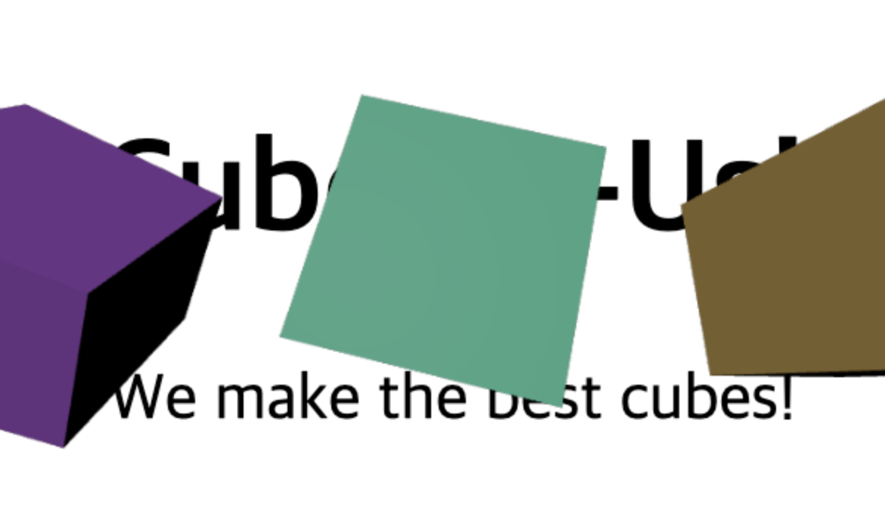
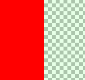
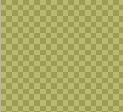
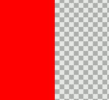
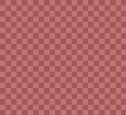
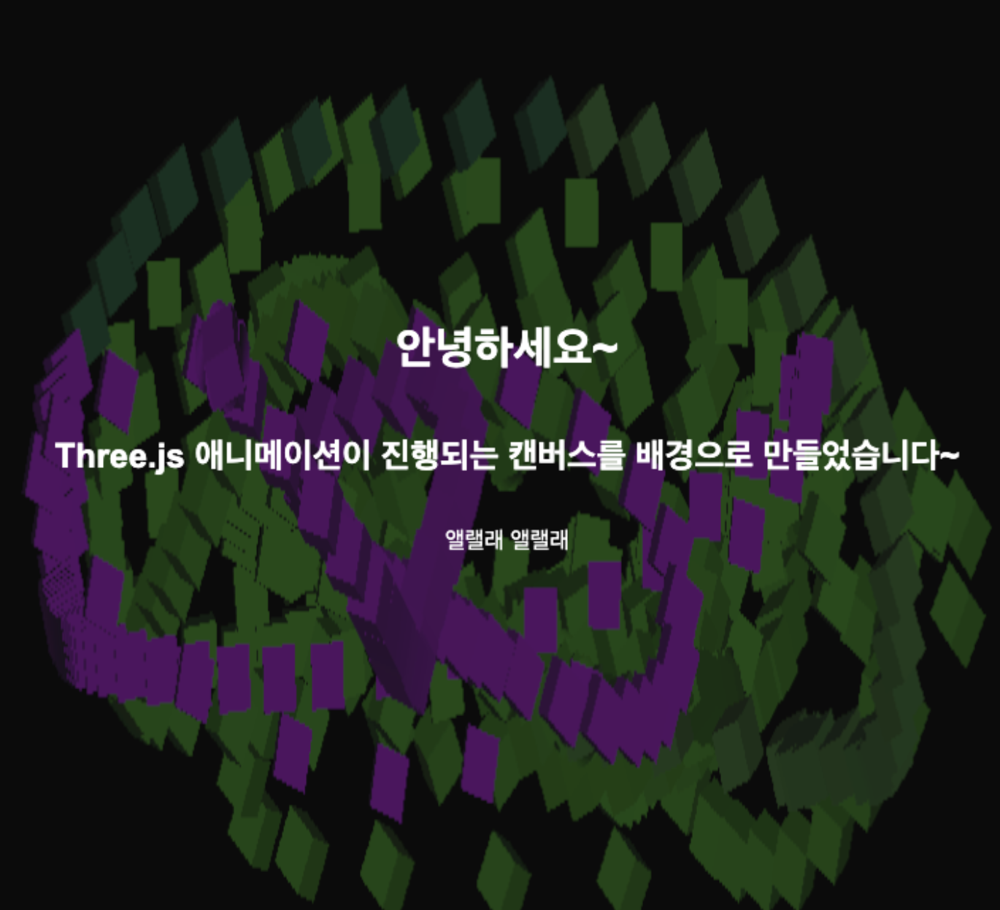

> ! 주의 : TIL 게시글입니다. 다듬지 않고 올리거나 기록을 통째로 복붙했을 수 있는 뒷고기 포스팅입니다.

오늘은 [Three.js 공식문서 > Fundamentals > 여러 팁들](https://threejs.org/manual/#ko/tips)에 대해 살펴보려고 합니다

- 스크린샷 찍기
- 캔버스 초기화 방지하기
- 캔버스 키 입력 받기
- 캔버스를 투명하게 하기
- HTML문서의 배경으로 Three.js 애니메이션을 삽입하기

등의 내용이 집약되어 있습니다.  
많아보이는데 내용이 많진 않습니다

# 캔버스 초기화 방지하기

```ts
this.renderer.setSize(width, height);
```

렌더링 영역이 전체 화면을 채우도록 onresize 핸들러로 다음과 같이 반응형 코드를 작성했을텐데요  
이러면 리사이징 시에 캔버스가 초기화되는 상황이 벌어집니다

어떤 경우에 문제가 될 수 있는지 알아보기 위해,  
사용자가 움직이는 물체로 그림을 그릴 수 있는 예제를 만들어보겠습니다.

### 1. 캔버스 설정

먼저, 커서를 따라다니는 물체를 만들어야 하니 캔버스를 설정해봅시다.

```ts
this.canvas = this.domApp.appendChild(document.createElement("canvas"));
this.renderer = new THREE.WebGLRenderer({
  canvas: this.canvas,
  antialias: true,
  alpha: true,
  preserveDrawingBuffer: true
});
this.renderer.autoClearColor = false;
```

- `preserveDrawingBuffer: true`로 드로잉 버퍼를 보존합니다.
- `renderer.autoClearColor = false`로 설정해 잔상을 남기도록 합니다.

카메라는 `OrthographicCamera`를 사용하겠습니다.

```ts
const camera = new THREE.OrthographicCamera(-20, 20, 10, -10, -1, 1);
```

### 2. 마우스 움직임에 따라 물체 이동

마우스 이벤트를 처리하기 위해 이벤트 리스너를 추가해보겠습니다.

```ts
window.addEventListener("mousemove", this.moveRect.bind(this));
```

`this.moveRect`는 마우스 위치를 받아 큐브를 해당 위치로 이동시키는 역할을 합니다.

```ts
private getRelativePositions(e: MouseEvent) {
  const rect = this.canvas.getBoundingClientRect();
  const x = ((e.clientX - rect.left) * this.canvas.width) / rect.width;
  const y = ((e.clientY - rect.top) * this.canvas.height) / rect.height;
  return { x, y };
}

private moveRect(e: MouseEvent) {
  if (!this.camera) return;
  const { x, y } = this.getRelativePositions(e);
  const normalizedX = (x / this.canvas.width) * 2 - 1;
  const normalizedY = (y / this.canvas.height) * -2 + 1;
  const flatted = new THREE.Vector3(normalizedX, normalizedY, 0).unproject(
    this.camera
  );
  this.cube?.position.set(flatted.x, flatted.y, 0);
}
```

위 코드는 다음과 같은 단계를 거칩니다:

1. `e.clientX`와 `e.clientY`를 캔버스 좌표계로 변환합니다.
2. 변환된 좌표를 NDC(Normalized Device Coordinates)로 정규화합니다.
3. `Vector3.unproject(camera)`를 사용해 월드 스페이스로 변환합니다.

이제 마우스를 따라다니는 큐브가 만들어졌습니다.

<iframe src="https://codesandbox.io/embed/9cdcpm?view=preview&hidenavigation=1"
     style="width:100%; height: 500px; border:0; border-radius: 4px; overflow:hidden;"
     title="interesting-flower-9cdcpm"
     allow="accelerometer; ambient-light-sensor; camera; encrypted-media; geolocation; gyroscope; hid; microphone; midi; payment; usb; vr; xr-spatial-tracking"
     sandbox="allow-forms allow-modals allow-popups allow-presentation allow-same-origin allow-scripts"
   ></iframe>

하지만 이렇게 구현하면, 브라우저 창 크기를 조정할 때 캔버스가 초기화되는 문제가 있습니다.  
이를 해결하려면 렌더 타겟을 이용해 텍스처로 화면을 렌더링하는 방법이 필요합니다.

---

## 렌더 타겟으로 다시 구현하기

### 1. 렌더 타겟 설정

캔버스 크기에 맞는 렌더 타겟을 설정하고 별도의 장면(Scene)과 카메라를 추가합니다.

```ts
private setupRenderTarget() {
  const renderTarget = new THREE.WebGLRenderTarget(
    this.canvas.width,
    this.canvas.height
  );
  const rtCamera = new THREE.OrthographicCamera(-20, 20, 10, -10, -1, 1);
  const rtScene = new THREE.Scene();
  rtScene.background = new THREE.Color("white");

  this.renderTarget = renderTarget;
  this.rtCamera = rtCamera;
  this.rtScene = rtScene;

  const light = new THREE.DirectionalLight(0xffffff, 2);
  light.position.set(0, 0, 1);
  rtScene.add(light);

  this.setupCubeInRenderTarget();
}
```

### 2. 큐브 이동 및 텍스처 적용

렌더 타겟에 있는 카메라로 큐브를 이동시키고, 텍스처를 사용하는 평면을 추가합니다.

```ts
private moveRect(e: MouseEvent) {
  ...
  const flatted = new THREE.Vector3(normalizedX, normalizedY, 0).unproject(
    this.rtCamera!
  );
  this.cube?.position.set(flatted.x, flatted.y, 0);
}

private setupModels() {
  const geometry = new THREE.PlaneGeometry(this.canvas.width, this.canvas.height);
  const material = new THREE.MeshStandardMaterial({
    map: this.renderTarget?.texture,
  });
  const plane = new THREE.Mesh(geometry, material);
  this.scene.add(plane);
  this.plane = plane;
}
```

### 3. 렌더 함수 구현

렌더 타겟을 먼저 렌더링한 뒤 메인 화면을 렌더링합니다.

```ts
private render(time: number) {
  time *= 0.001; // ms -> s
  this.update(time);
  if (this.renderTarget) {
    this.renderer.setRenderTarget(this.renderTarget);
    this.renderer.render(this.rtScene!, this.rtCamera!);
    this.renderer.setRenderTarget(null);
  }
  this.renderer.render(this.scene, this.camera!);
}
```

위 코드를 적용하면 캔버스 초기화 문제를 해결할 수 있습니다. 결과는 :

<iframe src="https://codesandbox.io/embed/cv64tw?view=preview&hidenavigation=1"
     style="width:100%; height: 500px; border:0; border-radius: 4px; overflow:hidden;"
     title="optimistic-gwen-cv64tw"
     allow="accelerometer; ambient-light-sensor; camera; encrypted-media; geolocation; gyroscope; hid; microphone; midi; payment; usb; vr; xr-spatial-tracking"
     sandbox="allow-forms allow-modals allow-popups allow-presentation allow-same-origin allow-scripts"
   ></iframe>
   
근데 왜 배경색이 계쏙 깜장색이죠? ;;; 당최 모르겠네요..  
아무튼 화면 해상도가 변해도 캔버스가 아닌 텍스처에 잔상을 그려뒀기 때문에 초기화되지 않고 그대로 남아있는 모습을 확인하실 수 있습니다

# 키 입력받기

캔버스에서 키보드 입력을 처리하려면 `tabindex`를 지정해주어야 합니다.  
HTML 요소에서 기본적으로 키 입력 이벤트를 받으려면 포커스를 받을 수 있어야 하며, `tabindex` 속성을 통해 이를 활성화할 수 있습니다.

### 1. tabindex 설정

```html
<canvas tabindex="0"></canvas>
```

이렇게 하면 키 입력이 활성화되지만, 포커스 상태를 나타내는 기본 스타일(테두리 강조)이 표시됩니다. 이를 비활성화하려면 `outline` 속성을 꺼줘야 합니다.

```css
canvas:focus {
  outline: none;
}
```

### 2. 키 입력 이벤트 처리

아래는 키 입력 이벤트를 추가한 코드입니다.

```ts
window.addEventListener("keydown", e => {
  if (e.key === "r") {
    this.cube?.material.color.set(getRandomColor());
  }
});
```

위 코드는 `r` 키를 누를 때마다 큐브의 색상을 랜덤으로 변경합니다.  
앞서 보여드린 렌더 타겟 예제와 함께 사용하면 잔상이 남는 화면에서 `r` 키를 눌러 색상이 변하는 효과를 확인할 수 있습니다.  
위의 코드샌드박스 예제에서 r키를 눌러보세요

---

# 캔버스를 투명하게 렌더링하기

캔버스를 투명하게 렌더링하려면 렌더러 생성 시 `alpha: true` 옵션을 설정하면 됩니다.

```ts
this.renderer = new THREE.WebGLRenderer({
  alpha: true
});
```



이런 결과를 만들 수 있습니다.

만약 `premultipliedAlpha: false`를 추가로 지정하면, 미리 계산된 알파값(premultiplied alpha)을 사용하지 않도록 설정할 수 있습니다.

### premultipliedALpha? - 알파 블렌딩

[공식문서에서 걸어둔 링크 (NVIDIA 공식 게시글)](https://developer.nvidia.com/content/alpha-blending-pre-or-not-pre)  
[잉글리쉬포비아를 위한 한국어로 간단히 설명된 글](https://aker.tistory.com/558)

알파 블렌딩은 투명도를 적용하는 방식입니다. 보통 RGB 값에 알파 채널을 곱해 표면의 색상을 혼합합니다.

#### 사후 곱셈 알파 블렌딩

```ts
DestinationColor.rgb =
  SourceColor.rgb * SourceColor.a + DestinationColor.rgb * (1 - SourceColor.a);
```

- 여기서 `SourceColor.a`는 투명도를 나타냅니다.
- 알파값을 비율로 사용해 배경색(DestinationColor)과 소스색(SourceColor)을 섞는 방식입니다.

예를 들어, 아래와 같이 `RGBA(1, 0, 0, 1)`과 `RGBA(0, 1, 0, 0.1)`을 섞는다고 생각해봅시다.

<figure>



<figcaption>
사진 출처 https://aker.tistory.com/558
</figcaption>

</figure>

이를 혼합하면 보통은 "빨간색이 강하고, 초록색은 아주 조금 섞이겠지?"라고 생각하기 마련이겠지만  
사후 곱셈 방식을 적용하면..

<figure>



<figcaption>
사진 출처 https://aker.tistory.com/558
</figcaption>

</figure>

`RGBA(0.5, 0.5, 0, 0.55)`가 나와버립니다  
좀 합리적이지 않은 듯 하네요  
대신에 사전 곱셈 방식을 사용하면..

#### 사전 곱셈(Premultiplied Alpha)

사전 곱셈에서는 알파값을 미리 곱해둔 상태로 계산합니다.

```ts
DestinationColor.rgb =
  SourceColor.rgb + DestinationColor.rgb * (1 - SourceColor.a);
```

<figure>



<figcaption>
사진 출처 https://aker.tistory.com/558
</figcaption>

</figure>

위에서 살펴본 텍스처를 생각해봅시다.  
이번에는 알파를 사전 곱셈해뒀으므로, 오른쪽은 `rgba(0, 0.1, 0, 0.1)`이 되었습니다  
물론 왼쪽은 알파=1이므로 변함없겠죠?

이제 섞어보면..

<figure>



<figcaption>
사진 출처 https://aker.tistory.com/558
</figcaption>

</figure>

사후 곱셈 알파를 적용했던 결과에 비해 꽤 합리적인 결과가 나왔습니다.  
이러한 방식을 통해 색상 혼합을 더욱 자연스럽게 해줄 수 있고,  
이 방식을 사용하는게 그리 어려운 방식도 아니라서 보통 딸깍으로 제공됩니다

---

# HTML 요소의 배경으로 Three.js 렌더링하기

Three.js를 사용해 HTML 요소 배경으로 애니메이션을 추가하는 방법을 알아보겠습니다.  
두 가지 방식이 있는데요

- `position:fixed`로 캔버스를 고정하고 z-index를 내리기
- `iframe`으로 삽입하기

하나하나 살펴봅시다

### 1. CSS로 배경 설정

```css
canvas {
  position: fixed;
  top: 0;
  left: 0;
  width: 100%;
  height: 100%;
  z-index: 1;
}
```

캔버스의 위치를 고정(`position: fixed`)하고 화면 전체를 채우도록 설정합니다.

그런데 이 방식의 단점은, three.js 코드가 다른 메인 코드들(js 등..)과 혼재해야 한다는 점입니다

### 2. iframe으로 구현하기

따라서 대신에 iframe으로 삽입하는 방식을 사용하여, 두 관심사를 분리할 수 있습니다

```html
<body>
  <iframe id="background" src="three.html"></iframe>
  <div class="container">
    <h1>안녕하세요!</h1>
    <h2>Three.js 애니메이션이 적용된 배경입니다.</h2>
    <p>이곳에 내용을 추가할 수 있습니다.</p>
  </div>
</body>
```

원래 `index.html`에 three.js 관련을 작성했는데,  
이를 따로 `three.html`에 분리해뒀습니다. 이를 `iframe`소스로 사용합니다.

iframe과 그 외 스타일은 다음과 같이 지정합니다.

```css
#background {
  position: fixed;
  top: 0;
  left: 0;
  width: 100%;
  height: 100%;
  border: none;
  z-index: 1;
}

.container {
  display: flex;
  justify-content: center;
  flex-direction: column;
  width: 100%;
  align-items: center;
  height: 100%;
  pointer-events: none;
  z-index: 1;
}

.container * {
  z-index: 2;
}
```

z-index를 -1로 하니 body가 iframe을 가려버리기에 마우스이동 인터렉션이 받아지지 않았습니다  
따라서 z-index를 1로 지정하고, iframe 위에 올릴 친구들은 2로 설정했습니다.  
또한 iframe은 기본적으로 border를 생성하므로 `border:none`을 추가해줍시다.



이런 결과를 얻었어요

# 캔버스 스크린샷 찍기

이건 three.js에만 국한되는 기능은 아닙니다만, `canvas.toDataURL`과 `canvas.toBlob` 메서드로 캔버스에 그려진 내용을 스크린샷찍을 수 있습니다.

```ts
const elem = document.querySelector("#screenshot");
elem.addEventListener("click", () => {
  canvas.toBlob(blob => {
    saveBlob(blob, `screencapture-${canvas.width}x${canvas.height}.png`);
  });
});

const saveBlob = (function () {
  const a = document.createElement("a");
  document.body.appendChild(a);
  a.style.display = "none";
  return function saveData(blob, fileName) {
    const url = window.URL.createObjectURL(blob);
    a.href = url;
    a.download = fileName;
    a.click();
  };
})();
```

대충 이렇겠죠?  
근데 이 코드만으로는 three.js에서 렌더링한 결과를 담기 충분하지 않을 때가 많습니다  
텅 빈 이미지가 나와버릴 수 있는건데  
기본적으로 브라우저는 화면을 렌더링한 후 성능을 위해 WebGL 캔버스의 드로잉 버퍼를 비워버리기 때문입니다

이를 해결하기 위해, `canvas.toBlob`호출 직전에 렌더링을 한번 그려내야합니다.

```ts
if (this.renderTarget) {
  this.renderer.setRenderTarget(this.renderTarget);
  this.renderer.render(this.rtScene!, this.rtCamera!);
  this.renderer.setRenderTarget(null);
}
this.renderer.render(this.scene, this.camera!);
```

`render()`메서드에서 이 부분만 쏙 떼면 되겠는데요? update관련은 빼구요  
이 부분만 조심하면 된다는 사실을 인지하고 있으면 당할 일 없겠네요

---

\
마칩니다
