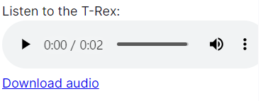

! 주의 : TIL 게시글입니다. 다듬지 않고 올리거나 기록을 통째로 복붙했을 수 있는 뒷고기 포스팅입니다.

프로젝트를 개발하다가 사운드를 넣어야 하게 생겼습니다  
웹페이지에서는 사운드를 어떻게 재생할 수 있을까요

HTML은 [`<audio>` 태그](https://www.tcpschool.com/html-tags/audio)(또는 [여기](https://developer.mozilla.org/en-US/docs/Web/HTML/Element/audio)참고)를 제공합니다.  
이걸 React + TypeScript에서 어떻게 쓸지 봅시다  
그리고 음량 조절도 넣고 싶은데, `<audio>`가 하나만 있는게 아닐 수 있습니다  
따라서 조절한 음량을 전역상태로 관리하고자 [Recoil](https://recoiljs.org/ko/docs/introduction/getting-started/)도 써봤습니다  
번역체지만 한글로 docs가 있어서 아주 따라하기 쉽습니다

아 참고로 `<audio>`태그는 mp3, wav, 또 뭐더라? 하나 더 있는데 세 가지 형식만 지원합니다. 주의하도록 합시다

# `<audio>`를 사용하여 재사용 컴포넌트 만들기

저는 `filename`을 받아서 이걸 틀어주는 재사용 컴포넌트를 만들고 싶어요  
그리고



이런 재생박스는 숨기고 싶습니다. 소리만 나오게 하고 싶어요  
이런 경우 `controls` 속성을 명시하지 않으면 되겠습니다

아무튼 간에, `filename`을 props로 받고 이걸 재생하는 컴포넌트를 만들려면
(1) `useRef`로 `<audio ref={}>` 이렇게 작성하여 레퍼런스를 가져옵니다 (타입은 `HTMLAudioElement`)
(2) `filename`으로 url을 조합합니다. 저는 사운드파일 전부 `/public/sound/`에 저장하므로, `/sound/${filename}` 이러면 됩니다  
(3) props로 재생 여부 `play`가 주어지면, `useEffect`에서 재생하거나 정지하게 합니다
(4) 적절히 `audio` 컴포넌트를 뱉어냅니다

코드 전문은 아래와 같습니다

```tsx
export default function AudioPlayer({
  filename,
  play,
  loop = false,
}: {
  filename: string
  play: boolean
  loop?: boolean
}) {
  const audioRef = useRef<HTMLAudioElement>(null)
  const url = `/sound/${filename}`

  useEffect(() => {
    if (play && audioRef.current) {
      audioRef.current.play()
    } else if (audioRef.current) {
      audioRef.current.pause()
    }
  }, [play, filename])

  return (
    <>
      <audio src={url} ref={audioRef} loop={loop} />
    </>
  )
}
```

나중에는 이 오디오 재생이 끝났는지에 따라 상태를 바꿔주는게 필요해서  
props로 `setState : Dispatch<type>` 이런 식으로 받아오고  
`<audio onEnds={()=>{}}>` 이렇게 `onEnds` 이벤트리스너를 추가해줬습니다

# 음량 조절할게요

근데 사용자가 음량 조절을 하고 싶을 수도 있어요  
시스템 음량을 아예 조절하면 되는게 아닌가 싶지만  
이거 만드는게 러닝 뛸 때 틀어주는 소리인건데  
사용자 취향에 따라 음악을 틀고 뛸 수도 있으니 개별적인 음량조절이 필요해보였습니다

일단 음량 조절에 가장 좋아보이는 것은  
`<input type="range">`겠네요

<input type="range" />

이렇게 깜찍한 인풋입니다

뒤늦게 안 사실인데 `min, max` 속성으로 값 범위도 조절할 수 있습니다  
기본은 0~100입니다

# 음량 조절할게요, 근데 이제 전역상태를 곁들인

위에서 말했다시피 audio 컴포넌트는 하나만 있는게 아니라서  
서비스 내에서 전역적으로 음량을 관리해줘야 하겠습니다  
이왕 이렇게 된 김에 **Recoil**을 써봤어요

먼저 Context Provider로 감싸듯이, 루트 컴포넌트를 `<RecoilRoot>`로 감싸줍니다(App.jsx나 index.js같은 곳에서)

Recoil에서 전역상태는 **Atom**이라고 불립니다.  
이는 어떤 컴포넌트에서나 구독하여 읽고 쓸 수 있읍니다

```tsx
import { atom } from "recoil"

const volumeState = atom({
  key: "volumeState",
  default: 0.5,
})
```

이렇게 음량 atom을 정의해줍시다  
얘를 export하기만 하면 이제 어디서든 `useRecoilState`로 어디서든 가져다 쓸 수 있습니다  
또한 값만 필요하다? `useRecoilValue`를 사용하면 되겠습니다

```tsx
import { useRecoilState } from "recoil"
import volumeState from "../context/VolumeState"
import { Box } from "@mui/material"

export default function VolumeControl() {
  const [volume, setVolume] = useRecoilState(volumeState)
  return (
    <Box m={2}>
      음량 &nbsp;
      <input
        type="range"
        value={volume * 100}
        onChange={e => setVolume(parseInt(e.target.value) / 100)}
      />
    </Box>
  )
}
```

이제 이런 식으로 음량조절 컴포넌트를 간단히 작성할 수 있습니다  
더 자세한 내용은 [공식문서 참고](https://recoiljs.org/ko/docs/introduction/getting-started/)

그리고 [크롬 자동재생 정책을 주의해줍시다.](https://developer.chrome.com/blog/autoplay?hl=ko)

이만 마칩니다
