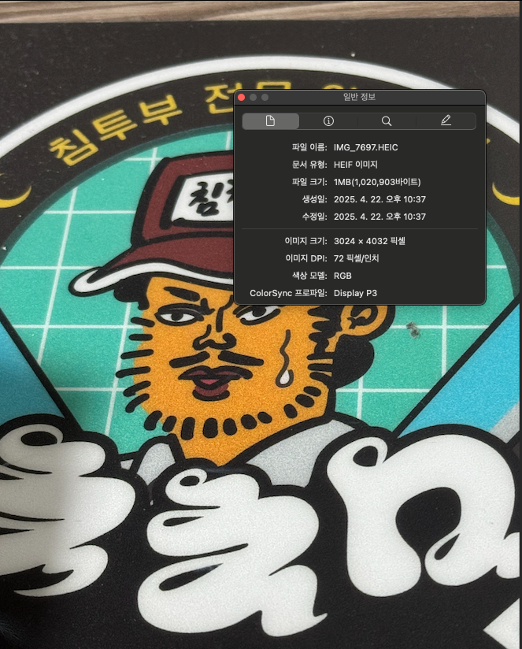
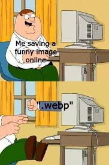
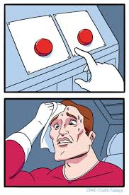
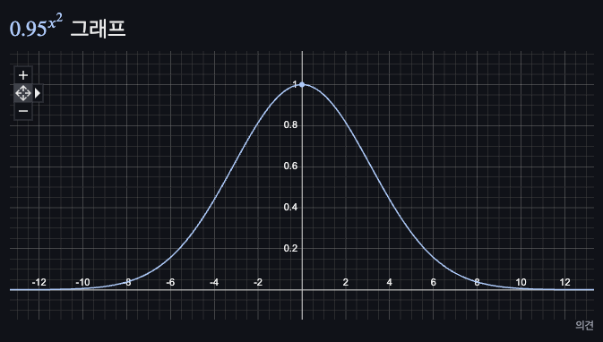

> ! 주의 : TIL 게시글입니다. 다듬지 않고 올리거나 기록을 통째로 복붙했을 수 있는 뒷고기 포스팅입니다.

혹시나 이미지 압축 그냥 긁어다 쓰시려고 들어온 바쁜 분들이라면 [최종코드와 사용하기](#최종코드와-사용하기)로, 반복 압축이 필요하시면 [이제 반복 압축을 구현해요](#이제-반복압축을-구현해요) 이동하세요

어느날 에러 로깅 시스템에서 `413 Content Too Large`를 발견했습니다  
[413 Error](https://developer.mozilla.org/en-US/docs/Web/HTTP/Reference/Status/413)는 요청 엔티티의 용량이 서버에서 지정한 것보다 클 때 반환됩니다


알고보니 유저들이 이미지 등록할 때 그냥 그걸 그대로 받아다 서버에 보내주고 있었습니다  
기존에 서버가 50MB(...)를 최대로 받게 되어 있었는데, 그거마저 넘어버려서 오류가 났던 것인데요,,  
그렇다고 `"00MB 이상은 업로드 안되십니다~"` 해버리면 아주 열받을거같아요  
참나.. 특히나 모바일로 하실거면 용량이 얼마나 되는지도 모르고 올릴텐데

그래서 업로드된 이미지는 압축을 한 번 하고 보내기로 했는데요

# 이미지 압축 전략 ?

근데 그럼 이미지를 압축하려면 뭘 건드리면 좋을까요?

## 폰으로 찍으면 이미지 크기가 너무 커요

아무거나 하나 사진 찍어서 탐색해봅시다



제 마우스패드인데요 ㅋㅋ  
일단 이미지 크기가 너무 큽니다  
데스크탑 모니터라고 하더라도 제 프로젝트같은 경우에는 최대 너비가 1600px을 넘지 않습니다  
게다가 모바일로 이 사진 볼거면 큰 낭비가 따로 없습니다

실제로 나중에 살펴보겠지만 [browser-image-compression](https://github.com/Donaldcwl/browser-image-compression)같은 라이브러리 보면 이미지 사이즈 조절부터 합니다

## 이미지 포맷 - JPEG, PNG, WEBP

이미지 하면 가장 먼저 떠오르는 포맷은 `JPEG`(`JPG`)와 `PNG`인 것 같아요  
두 개 먼저 알아봅시다.

### JPEG vs PNG

이런 분야에 아주 전문이신 [Adobe라는 스타트업의 글](https://www.adobe.com/kr/creativecloud/file-types/image/comparison/jpeg-vs-png.html)을 참고하겠습니다

> JPEG는 Joint Photographic Experts Group의 약자로, 디지털 사진을 저장하는 가장 일반적인 형식입니다. JPEG는 압축을 통해 이미지 파일 크기를 줄여 저장하고, 웹 페이지에 쉽게 업로드 할 수 있게 합니다.

> PNG는 Portable Network Graphics의 약자로, 웹 그래픽, 로고, 차트, 일러스트레이션 등에 사용됩니다. PNG는 압축 가능하지만 JPEG보다는 저장공간을 더 차지합니다. JPEG와 달리 PNG는 투명도를 나타낼 수 있습니다.

이제 JPEG와 PNG의 차이점을 알아보자면,

- JPEG는 **손실 압축 방식**을 사용합니다.
  - 손실 압축이란 파일이 압축될 때 이미지의 일부 데이터가 _영구적으로 삭제_ 되는 경우를 말합니다.
  - 이러한 특성으로 JPEG는 품질이 저하되고 왜곡될 수 있지만, 이미지를 효율적으로 저장할 수 있습니다.
- PNG는 **무손실 압축 방식**을 사용합니다.
  - 이미지가 압축될 때 손실되는 데이터가 없어서 이미지 품질을 유지할 수 있습니다.
  - 덕분에 로고, 그래프, 등등 퀄리티가 중요한 경우에 자주 사용해요


이런 디지털풍화는 위와 같은 JPEG 특성때문에 생깁니다  
대충 정리해보면, 화질구지여도 괜찮으면 JPEG로 꾸겨버리고, 퀄리티를 남겨둬야 한다면 PNG로 해야겠네요

### WebP쓰면됨 ㅋㅋㅋ

근데 PNG, JPEG 고민할 거 없이 요새 사실상 치트키로 쓰이는 차세대 이미지 포맷이 있는데요  
[웹용 이미지 형식 WebP](https://developers.google.com/speed/webp?hl=ko)입니다

> WebP는 웹 이미지에 뛰어난 **무손실 및 손실 압축**을 제공하는 최신 이미지 형식입니다.

WebP 무손실 이미지는 PNG보다 26% 작고, WebP 손실 이미지는 JPEG보다 25~34% 작다고 하네요  
게다가 WebP는 PNG처럼 투명도를 넣을 수도 있고, 압축 후에도 JPEG보다 높은 이미지 퀄리티를 가집니다  
[비교 연구](https://developers.google.com/speed/webp/docs/c_study?hl=ko)에 따르면 WebP를 무손실 압축해도 JPEG보다 압축 품질이 평균 30% 더 좋다고 하네요

사실상 퀄리티와 파일 크기 간의 ~~황밸~~ 절충안입니다  
이미 크롬 브라우저에서는 webp 사용하라고 등떠밀고 권장합니다  
그래서 저도 이거 쓰기로 함



근데 webp meme 치면 왜 이런거 나옴?

# 압축 구현해보기

아무튼 일단 주로 이미지 사이즈를 적절히 줄이고, webp로도 바꾸고, 해서 압축을 구현하기로 했습니다  
이제 압축을 어디서 할건지 정해야겠는데요..  
프로젝트가 Next.js를 사용하니 서버 사이드도 가능하고, 클라이언트 사이드도 가능합니다

- 서버 사이드에서는 [sharp](https://www.npmjs.com/package/sharp)라는 라이브러리가 유명합니다. Next.js Image 컴포넌트에서 내부적으로 sharp를 사용하는 것으로도 많이 알려져 있습니다
- 클라이언트 사이드에서는 [Canvas API](https://developer.mozilla.org/en-US/docs/Web/API/Canvas_API)를 사용해볼 수 있을 것 같네요. 이미지를 캔버스에 그려내고, 너비높이를 줄이고, 다시 이미지로 변환하면 될 것 같아요
- 또한 [node-canvas](https://www.npmjs.com/package/canvas/v/2.0.0-alpha.7)같은 패키지도 있어서, 서버 사이드에서도 canvas api를 사용해볼 수 있습니다
- 또또한 [OffscreenCanvas](https://developer.mozilla.org/en-US/docs/Web/API/OffscreenCanvas)라는 것도 있는데요
  - OffscreenCanvas는 화면을 그려내야 하는 책임을 덜어내고 DOM과 완전히 손절한 친구입니다
  - DOM에 의존하지 않아 가볍고 빠르며, Service Worker에서 작업하여 별도 스레드에서 작업할 수 있습니다



이중에서 저는 canvas api를 사용하기로 했는데요

- 서버 사이드로 구현하려면, 업로드한 파일을 클라이언트 사이드와 서버 사이드 간에 그냥 주고받을 수가 없겠더라구요. fetch같은 것으로 한 번 옮겨야 하는데, 이 과정은 좀 부담일 수 있겠다고 생각했어요
- 또한 서버 리소스를 쓰는 것보다는 브라우저 단에서 책임지게 하는게 더 낫겠다 싶었습니다.
- 브라우저 단에서 기다리게 되더라도, 유저가 파일을 업로드할 때마다 압축을 진행해두면 실제로 `제출` 버튼을 누르기 전까지 압축을 진행해둘 수 있겠다는 생각이었어요
- OffscreenCanvas는 매력적이긴 한데요, canvas와 비슷한 새 친구이니 레퍼런스가 더 많은 canvas로 먼저 만들어보고 나중에 필요하면 개선해볼 수 있을 것 같았습니다
  - OffscreenCanvas의 브라우저 호환성도 걱정은 살짝 됐어요, 2023년부터 사파리, 파이어폭스, 엣지, 크롬 모두 지원하게 되었는데, 구버전을 사용하는 경우 호환되지 않을 수 있습니다

이제 canvas로 구현을 한번 해봅시다

## canvas api를 사용한 구현

인자로 `File` 객체를 받고, 압축하여 `File` 객체를 다시 Promise로 반환하는 함수 `processImage`를 만들어봅시다

```ts
export function processImage(file: File): Promise<File> {}
```

먼저 파일 컨텐츠를 DataURL로 읽어냅니다.  
[DataURL 또는 DataURI](https://developer.mozilla.org/ko/docs/Web/URI/Reference/Schemes/data)는 데이터를 Base64 인코딩하여 URI형식의 문자열로 표현한 형태입니다

```ts
const reader = new FileReader();
reader.readAsDataURL(file);
```

`readAsDataURL`에 `onload` 콜백을 추가합시다.  
데이터를 다 읽어낸 후, 그 데이터를 이미지로 바꿉니다

```ts
reader.onload = (event) => {
  const image = new Image();
  image.src = event.target?.result as string;
  ...
}
```

이제 이 이미지에 또 `onload` 콜백을 추가하여, 이제 진짜 canvas를 사용해 리사이징합시다

```ts
image.onload = () => {
  const canvas = document.createElement("canvas");
  const context = canvas.getContext("2d");

  // ... 이미지 원본 width, height를 가져와서
  // ... 원본 비율을 유지하며 원하는 수치까지 줄인 newWidth, newHeight를 계산합니다

  canvas.width = width;
  canvas.height = height;
  context?.drawImage(image, 0, 0, width, height);
};
```

이제 이 canvas를 Blob으로 변환하고 마침내 File을 다시 만들어냅니다

```ts
canavs.toBlob(
  (blob) => {
    if (!blob) {
      // ...
      return;
    }
    const compressedFile = new File([blob], file.name, {
      type: "image/webp",
      lastModified: Date.now();
    })
  },
  "image/webp",
  // 이 자리에 QUALITY를 지정 가능.
)
```

우리는 차세대 개짱쎈 이미지포맷인 webp로 변환하기로 했으니 webp 형식으로 지정해줍니다
이 때, [toBlob](https://developer.mozilla.org/en-US/docs/Web/API/HTMLCanvasElement/toBlob)에는 세 번째 인자로 QUALITY를 넣을 수 있는데

> 이미지 포맷이 손실 압축을 지원하는 경우 이미지 퀄리티 비율을 0과 1 사이의 수로 지정할 수 있습니다.

필요에 따라 정하시면 되곘습니다  
좀 해보니까 어지간하면 QUALITY는 많이 안 건드리고 이미지 사이즈로 승부보는게 결과물이 좀 괜찮은 듯

### 최종코드와 사용하기

```ts
const MAX_SIZE = 1024;
const QUALITY = 1;
const FORMAT = "image/webp";
export function processImage(file: File): Promise<File> {
  return new Promise((resolve, reject) => {
    if (!file.type.startsWith("image/")) {
      reject(new Error("File is not an image"));
      return;
    }
    const reader = new FileReader();
    reader.readAsDataURL(file);
    reader.onload = event => {
      const image = new Image();
      image.src = event.target?.result as string;
      image.onload = () => {
        const canvas = document.createElement("canvas");
        const context = canvas.getContext("2d");

        let width = image.width; // 2000
        let height = image.height; // 200
        const aspectRatio = width / height; // 10
        if (width > MAX_SIZE) {
          width = MAX_SIZE;
          height = MAX_SIZE / aspectRatio;
        } else if (height > MAX_SIZE) {
          width = MAX_SIZE * aspectRatio;
          height = MAX_SIZE;
        }
        canvas.width = width;
        canvas.height = height;

        context?.drawImage(image, 0, 0, width, height);

        canvas.toBlob(
          blob => {
            if (!blob) {
              reject(new Error("Blob 데이터 생성 중 에러가 발생했습니다."));
              return;
            }
            const compressedFile = new File([blob], file.name, {
              type: FORMAT,
              lastModified: Date.now()
            });
            resolve(compressedFile);
          },
          FORMAT,
          QUALITY
        );
      };
      image.onerror = () =>
        reject(new Error("이미지 로드 중 에러가 발생하였습니다."));
    };
    reader.onerror = () =>
      reject(new Error("파일을 읽는 중 에러가 발생하였습니다."));
  });
}
```

대충 이렇게 만들어서

```ts
const processedFileArray = await Promise.all(
  fileArray.map(async file => {
    const processedImage = await processImage(file);
    return processedImage;
  })
);
```

업로드한 파일을 모두 압축 돌리고 기다려줍니다.

# 정해진 크기 이하로 압축하고 싶어요

근데 문제는 이렇게 압축 한번 맡기면, 결과물이 몇 바이트로 줄어드는지 예상이 안 됩니다  
근데 혹시나 진짜 혹시나, 압축을 한 번 했는데 서버 허용치를 아직도 넘어간다면???????  
실제로 그런일이 있었습니다 ;;

## 라이브러리에서는 어떻게 구현함?

그래서 이미지를 **일정 크기 이하**로 보장하며 압축하려면 어떻게 해야 하지? 라는 생각을 하다가  
[broswer-image-compression](https://github.com/Donaldcwl/browser-image-compression)이라는 오픈소스 라이브러리 구현을 뜯어봤습니다  
알짜배기는 [lib/image-compression.js](https://github.com/Donaldcwl/browser-image-compression/blob/master/lib/image-compression.js)에 있더라구요

그래서 한번 열어보니 ..

```js
const shouldReduceResolution = !options.alwaysKeepResolution && origExceedMaxSize;
while (remainingTrials-- && (currentSize > maxSizeByte || currentSize > sourceSize)) {
    const newWidth = shouldReduceResolution ? canvas.width * 0.95 : canvas.width;
    const newHeight = shouldReduceResolution ? canvas.height * 0.95 : canvas.height;
    [newCanvas, ctx] = getNewCanvasAndCtx(newWidth, newHeight);
    if (outputFileType === 'image/png') {
      quality *= 0.85;
    } else {
      quality *= 0.95;
    }
    ctx.drawImage(canvas, 0, 0, newWidth, newHeight);

    // ... canvas를 file로 변환
```

ㅋㅋㅋ 그냥 될 때까지 quality나 resolution(이미지 크기)를 줄입니다  
반복해서 압축하는거 말고 더 우아한 방법이 있으려나? 해서 찾아봤는데 어쩔 수 없나봐요

## 이제 반복압축을 구현해요

그럼 이제 이미지 반복 압축을 구현해볼텐데요  
while을 돌리려면 코드를 좀 묶어서 간결하게 만들 필요가 있을 것 같아요  
위에서 봤던 라이브러리 코드에서도, `getNewCanvasAndCtx`같이 공통 작업들을 묶어놨으니 저도 좀 묶어버려야겠어요

먼저 canvas를 blob으로 변환하는 함수를 만들겠습니다

```tsx
function canvasToBlob(canvas: HTMLCanvasElement): Promise<Blob> {
  return new Promise((resolve, reject) => {
    try {
      canvas.toBlob(blob => {
        if (!blob) {
          reject(new Error("Blob 데이터 생성 중 에러가 발생했습니다."));
          return;
        }
        resolve(blob);
      });
    } catch (error: any) {
      reject(new Error("Blob 변환 중 에러가 발생했습니다 : " + error?.message));
    }
  });
}
```

`canvas.toBlob`은 콜백형식이라서 좀 귀찮게 생겼어요.. 그래서 Promise 함수를 만들고 이 내부에서 `resolve`하게 했습니다

그리고 이미지를 canvas에 그려내는 작업도 함수로 따로 뺄게요

```ts
function drawImageInCanvas(image: HTMLImageElement, targetSize: number) {
  const canvas = document.createElement("canvas");
  const context = canvas.getContext("2d");
  // ... 또 이미지를 원본 비율을 유지하며 targetSize까지 크기 줄이기 ..
  context?.drawImage(image, 0, 0, newWidth, newHeight);
  return canvas;
```

그러면 이제 반복하기 완전 쉬워졌네요 !!

```ts
// ... 동일하게 파일을 DataUrl로 읽고, 이미지로 로드 ..
let trialCount = 0;
image.onload = async () => {
  while (trialCount++ < MAX_TRIAL) {
    // 원하는 감소곡선에 따라 사이즈를 또 줄임
    const canvas = drawImageInCanvas(
      image,
      MAX_SIZE * Math.pow(DAMPING_FACTOR, trialCount * trialCount)
    );
    // Blob데이터로 변환(image/webp)
    const blob = await canvasToBlob(canvas);
    if (targetSize && blob.size > targetSize) {
      //targetSize가 지정되었고 아직 이거보다 크면 다시 압축
      continue;
    } else {
      //targetSize가 정해지지 않았거나(이 경우 webp변환 겸 1회 압축), targetSize보다 작게 압축했으면 반환
      const compressedFile = new File([blob], file.name, {
        type: FORMAT,
        lastModified: Date.now()
      });
      resolve(compressedFile);
      break;
    }
  }
  reject(new Error("이미지가 너무 큰거같은데요?"));
};
//...
```

라이브러리에서는 이미지 크기를 선형으로 압축하는데요,  
저는 입맛에 따라 좀 변경해봤습니다  
적당히 0.95정도의 factor를 둬서, $0.95^{x^2}$ 이런식으로 감소하게 만들어줬습니다  
아 물론 처음 한 번은 기준 크기(ex. 서비스에서 뭘 해도 이미지가 1200px을 넘지 않으면 1200px까지 일단 줄임)까지 줄인 다음 이 수식이 적용됩니다



이렇게 생겼는데요, 횟수는 자연수니까 y축 기준 오른쪽만 해당합니다  
처음에는 보수적으로 접근해서 최대한 덜 줄여보고, 압축이 반복될 수록 어쩔 수 없이 많이 줄이는 방향성을 구현하고 싶었어요
최대 반복 회수를 10으로 잡는다고 하면 약 0.006%까지 사이즈가 줄어들어버리니.. 사실 여기까지는 갈 상황이 있지도 않을 것 같아요

---

\
이번에는 이미지 압축에 대해 알아봤고요  
오픈소스 라이브러리를 뜯어서 이게 잘하는 짓인지도 한번 봤습니다  
canvas 쓰는거는 항상 재밌는 듯
