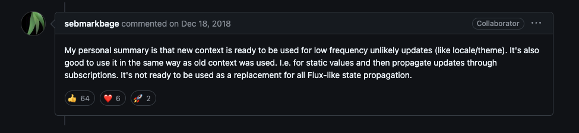
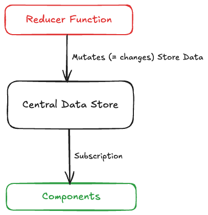
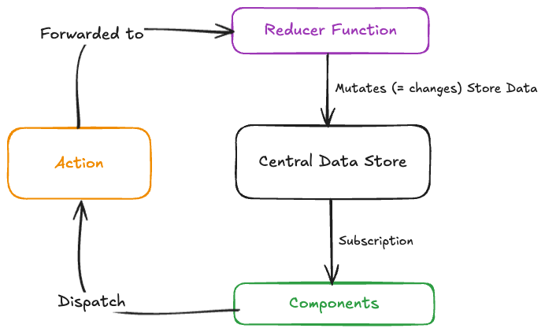
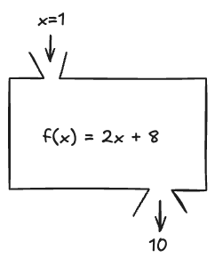

> ! 주의 : TIL 게시글입니다. 다듬지 않고 올리거나 기록을 통째로 복붙했을 수 있는 뒷고기 포스팅입니다.

[Redux](https://redux.js.org/)는 **크로스 컴포넌트 또는 앱 와이드 상태를 위한 상태관리** 시스템인데요  
리액트의 상태관리 라이브러리 하면 먼저 떠오르는 터줏대감? 대명사? 머 그런 느낌입니다  
저한테는요

# Redux VS. Context

근데 우리는 이미 Context API라는 리액트 기본 내장 기능으로 크로스 컴포넌트나 전역 상태관리를 도달할 수 있지 않나요?



2018년쯤에 새로 context가 나왔을 때 콜라보레이터의 이러한 공식멘트가 있었습니다

> 데이터가 자주 변경되는 경우에는 성능에 좋지 않고, 컨텍스트로는 유동적인 상태 확산을 대체할 수 없다

라는 언급인데요  
꽤 시간이 지난 언급이라서 변화가 있었을 수도 있긴합니다

이외에도 컨텍스트만으로는 프로젝트의 규모가 커지고 커지면 설정과 괸락 복잡해질 수 있는데  
리덕스같은 상태관리 툴은 간단히 유동적인 상태 확산 기능을 제공합니다

# Redux의 방식

Redux는 사실상 하나의 **중앙 데이터 저장소**입니다  
단일한 중앙 데이터 저장소에 모든 state가 저장되고, 이를 redux 내부에서 관리합니다

컴포넌트에서는 이것을 꺼내서 쓰기만 하면 돼요.  
마치 **구독**하듯이 사용하는 것인데  
구독이라는 말처럼 수정은 **절대 직접 수정하지 않습니다**  
즉 데이터는 절대 반대 방향으로 흐르지 않는 다는 것입니다



대신에 데이터의 변경을 담당하는 함수인 **Reducer**를 사용합니다  
이 Reducer라고 함은 리액트 훅인 `useReducer()`와는 다른  
자바스크립트 reduce처럼 좀 더 일반적인 프로그래밍 개념에서 나온 것인데  
라고는 하지만 사실 useReducer랑 좀 비슷하게 생긴 것 같기도..

여기서 한 가지 개념이 더 들어오는데 **Action**이라는 것입니다  
컴포넌트는 이 Action만을 알고 Action을 트리거합니다  
약간 이벤트리스너와 이미터같죠?



컴포넌트가 action을 트리거하여 발송하면, 이는 Reducer Function에 전달됩니다  
그럼 Reducer는 미리 정의된 작업을 진행하고, 이 작업은 Central Data Store의 상태값을 바꿉니다.  
상태값이 바뀌면 컴포넌트가 영향을 받는, 그런 순환이 그려지겠죠?

# Redux 사용해보기 (Vanila JS에서)

사실 Redux는 리액트에서만 쓸 수 있는게 아니라  
JavaScript에서는 어디서든 쓸 수 있어요

Count를 관리하는 간단한 예제를 만들어보려면  
먼저 `const redux = require('redux');` 와 같이 import하고

## Reducer를 만들어요

```js
const counterReducer = (state, action) => {
  return {
    counter: state.counter + 1
  };
};
```

Reducer 함수는 `("이전의 상태", "발송된 action") => 새로운 상태 객체 리턴` 이런 구조를 갖는 **순수함수**입니다.

여기서 잠깐, 순수함수란..  
input이 같으면 항상 output이 동일한, side-effect가 없는 함수입니다  
이는 곧 외부와의 소통이 없다는 뜻인데  
http 요청, localStorage에서 뭐 가져오기, 아니면 하다못해 함수블록 바깥의 값을 가져다 쓰기, ... 이런 것을 일절 하지 않는다는 뜻입니다



이런 함수상자를 만들겠다는 뜻입니다.  
우리의 경우에는 `f(x) = x+1` 처럼 만든거겠죠?
입력값 외에 영향을 받거나 주는 요인은 단 하나도 없습니다

## store를 만들어요

이제 이 `counterReducer`를 넣어서 저장소를 생성하겠습니다  
`const store = redux.createStore(counterReducer);`처럼 해주시면  
`counterReducer`를 리듀서함수로 가지는 store를 생성한 거십니다

이 때, 주의할 점은 `createStore` 타이밍에 `counterReducer`가 한 번 실행된다는 점입니다  
그럼 초기값이 0인 count였다면 createStore 직후에 count값은 1이겠죠?

## subscriber를 만들고 등록해요

이제 store의 count값을 구독해볼건데  
마치 이벤트리스너를 등록하듯이, subscriber 콜백함수를 만들고 이를 등록합니다

```js
const counterSubscriber = () => {
  // 구독함수를 작성하고
  const latestState = store.getState();
  console.log(latestState);
};
store.subscribe(counterSubscriber); // 구독. (직접 실행 X)
```

저는 `store.getState()`로 상태값을 가져오고,  
`console.log`로 이를 콘솔에 출력하는 간단한 subscriber함수를 만들어서  
`store.subscribe()`로 구독해줬습니다

## action을 발행해요

이제 상태값을 변경하고 싶으면, action을 dispatch합니다.  
`store.dispatch({type: "increment"})` 이렇게 action객체를 전달합니다.

사실 지금 만든 `counterReducer`같은 경우에는 객체에 어떤 값이 있든간에 counter값을 1 증가시키지만  
action 객체에 `type`같은 프로퍼티를 넣어서 전달하고, reducer에서 이를 확인해서  
counter값을 감소시킬건지 증가시킬건지, 그런 동작을 정의해볼 수도 있겠죠?

이제 대충 Redux를 어떻게 쓰는지 알아봤으니, React에서 이를 이용하는 법을 알아봅시다

# Redux 사용하기 (React에서)

react-redux 패키지를 사용하여 react환경에서 redux를 사용할 수 있습니다

아까 `createStore()`로 생성한 store 있죠?  
이 중앙집권저장소를 모든 컴포넌트에 제공해야겠어요  
필요할 경우 갖다 쓸 수 있게

```jsx
root.render(
  <Provider store={store}>
    <App />
  </Provider>
);
```

이런 식으로 감싸주겠죠? Context의 Provider로 그랬듯이  
`store`는 따로 `store.js`처럼 다른 어딘가에 분리하여 저장해놓고 export해서  
`<Provider></Provider>`에서 제공할 때 이를 import하여 store props로 전달하면 좋겠습니다

## 컴포넌트에서 store에서 상태값 꺼내먹기

react-redux 패키지는 `useSelector` 훅을 제공해요  
저장소는 중앙집권이라고 했습니다. 여기에 여러 상태가 막 있을건데  
`useSelector(state => state.counter)` 이런 식으로 원하는 state만 꺼내올 수 있습니다  
이러면 **구독**하는거니까, 당연히 최신으로 유지되고, 변경 시 리렌더링 대상이 되고, ... 하튼 그렇습니다

action의 발송은 이제 또 훅으로 하게 되는데  
`const dispatch = useDispatch()` 이렇게 훅으로 dispatch 객체를 가져오고  
`dispatch({type: "increment"})` 와 같이 써서 액션을 발행합니다

```jsx
const dispatch = useDispatch();
const counter = useSelector(state => state.counter);

const incrementHandler = () => {
  dispatch({ type: "increment" });
};
const decrementHandler = () => {
  dispatch({ type: "decrement" });
};
```

이런 식이 되겠죠?  
`type` 값에 따라 증가, 감소를 구현하려면 reducer에서

```js
const counterReducer = (state, action) => {
  if (action.type === "increment") {
    return {
      counter: state.counter + 1
    };
  }
  if (action.type === "decrement") {
    return {
      counter: state.counter - 1
    };
  }
};
```

이런식으로 써주면 되겠습니다

## action에 페이로드 전달하기

이미 우리는 action객체로 페이로드를 전달하고 있습니다  
`{ type: 'increment' }`처럼 객체에 전달하는 key-value들이 그것인데  
`type`말고도 자유롭게 다른 무언가를 넣어줄 수 있습니다  
예를 들어, 이전에는 1씩 증가하기만 했는데, 이제 5씩 증가하는 버튼을 만들고 싶으면..

`dispatch({ type: "increase", amount: 5 })`라고 액션 페이로드를 설정하고  
reducer함수에서 이제 해당 동작을 추가하면 되는 일입니다

## reducer 작성 시 주의할 점

이미 이전에 redux의 reducer가 순수함수여야 하고, 순수함수가 무엇인지 설명했습니다  
그럼에도 한 가지 의문이 들 수도 있는데 :

```js
if (action.type === "increment") {
  state.counter++;
  return state;
}
```

이렇게 그냥 이전 state를 변경해서 리턴하면 안 되나요?  
왜 항상 귀찮게 새 state를 만들고 반환하나요?

근데 이건 **절대** 안됩니다. state를 직접 업데이트하면 안 되는데  
[공식문서](https://ko.redux.js.org/usage/structuring-reducers/prerequisite-concepts)에서 관련 내용을 설명중입니다

첫 번째 이유로, redux는 상태가 변경된 후(reducer 작업 이후) 컴포넌트가 실제로 업데이트되어야 하는지 확인하는데  
이 때 **얕은 참조 검사**를 사용합니다.  
이는 곧 **직접 객체를 변화시키면 참조는 동일**하므로 **다시 렌더링되지 않습니다.**

또 다른 이유로, 디버깅과 테스트를 어렵게 하고 코드의 행동이 예측불가해진다고 하는데, 공식문서에 자세한설명이 있습니다

대신 객체의 나머지 부분들은 유지하고 일부만 변경하고자 할 때  
[spread 연산자를 사용](https://ko.redux.js.org/usage/using-object-spread-operator/)할 수 있습니다  
`Object.assign()` 메서드를 이용하는 방법도 있는데  
`{ ...state, counter: state.counter+1 }`이렇게 하면 아주 간결합니다

---

\
다음 시간에는 리덕스 툴킷으로 더 편하게 리덕스를 사용하는 법을 알아보려고 합니다  
이만 마칩니다
