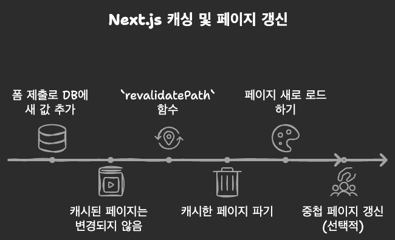

> ! 주의 : TIL 게시글입니다. 다듬지 않고 올리거나 기록을 통째로 복붙했을 수 있는 뒷고기 포스팅입니다.

Next.js에 대해 쓰는건 처음이네요  
최근에 처음 배웠기 때문입니다?

Next.js 13 이전에는 Next.js에서 Route를 만들기 위해 [Pages Router](https://nextjs.org/docs/pages) 방식이 사용되었는데요  
Next.js 13 이후로 새로 나와서 지금 밀고 있는게 [App Router](https://nextjs.org/docs/app)입니다  
지금 두 방식을 모두 지원해요. App Router를 조금 더 권장할 뿐  
아직 많은 프로덕트들이 Pages Router를 여전히 사용중입니다

오늘은 App Router방식으로 Next.js 코드 짜는 법을 기록하것습니더잉

# 폴더구조

```
- /app
	- /about
	- /blog
		- /post-1
```

`/app/` 경로 밑에 웹사이트에 넣을 페이지들을 위치시킵니다  
`/app/`밑에 존재하는 모든 `page.js`파일들은 그에 해당하는 route를 만듭니다.  
예를 들어, `/app/about/page.js` => `"http://my-domain.com/about"`

그리고 이 app폴더 밑에 위치하는 리액트 컴포넌트들은 이제 Next.js에서 특별한 대우를 받게 됩니다.  
**서버 컴포넌트**가 되는 것인데요..  
확인하고 싶으시면 `console.log`를 컴포넌트함수 내에서 찍어봅시다. 브라우저가 아닌 개발서버에 찍힙니다

# 페이지 간 이동

만약 지금 `http://my-domain.com/`애 있는데, `http://my-domain.com/about/`으로 가고 싶다면 우뜩할까요?  
`<a href="/about">` 이러면 되겠죠?  
라고 생각할 수는 있는데 딱히 이상적이진 않습니다. 적어도 이 도메인(이 프로젝트)내의 다른 경로로 이동할거면요

`<a>`태그로 이동하는 것은 **새로운 페이지를 로드**합니다.  
이는 리액트가 렌더링을 다시 하는 수준이 아닌, 페이지를 갈아엎게 되는 것인데  
Next.js는 그렇지 않고도 리액트의 장점을 살리고 SPA로 머무는 것을 허용합니다.  
**클라이언트 측의 JS코드로 UI를 업데이트할 수 있게**한다는 것인데 (기존 리액트 like하게)

이를 위해서는 `<Link href="">`라는 next.js에거 제공하는 특별한 컴포넌트를 사용합니다.  
명력적인 방법도 있는데, `next/navigation`에서 `redirect()`함수를 import하고,  
`redirect('/about')` 이렇게 쓰면 됩니다

# 컴포넌트 추가하기

Next.js의 `app`폴더 밑에서는 특별한 컴포넌트로 취급되는, [예약된 파일 명](https://nextjs.org/docs/app/api-reference/file-conventions)들이 있습니다.  
예를 들면..

- `page.js` 신규페이지
- `layout.js` 형제/중첩 페이지의 레이아웃 (바로 뒤에 알아보겠습니다)
- `not-found.js` 404 Not Found에 대한 폴백 페이지
- `error.js` 기타 오류에 대한 폴백 페이지
- `loading.js` 형제 또는 중첩 페이지에서 데이터를 가져올 때 표시되는 폴백 페이지
- `route.js` : API 경로를 생성합니다. (jsx가 아닌 JSON 등의 데이터를 반환합니다)

이런게 아니고 막 `title-header.jsx`처럼 대충 제목을 지으면 그냥 커스텀 컴포넌트입니다  
그리고 이제 `app` 폴더 밑에는 페이지와 route의 생성 관련한 파일만 남길거고,  
다른 커스텀 컴포넌트는 루트에서 `component/` 폴더를 하나 더 두는게 좋겠네요  
그리고 이제 import할 때, `from '@/components/header'`와 같이 @로 프로젝트의 루트 경로를 조회할 수 있습니다

`app`폴더 밑에서는 예약된 파일명들이 소문자로 시작하니까, 기존 리액트 컴포넌트 파일명의 컨벤션과 다르게, 여기서는 소문자로 시작하게 하면 좋겠네요  
기타등등, [공식문서 보면 다양한 구조가 있습니다](https://nextjs.org/docs/app/building-your-application/routing/colocation)

## layout.js

아까 말한 `layout.js`에 대해 살짝 더 알아봅시다
app폴더를 위한 `layout.js`파일이 최소 하나는 있어야 합니다.  
최소 하나의 근본 레이아웃이 있어야 한다는 뜻입니다

이 `layout.js`는 그 하위의 중첩된 경로에 대해 모두 적용됩니다  
새로운 `layout.js`를 만나지 않는 한은 말이죠  
만약 `/about/layout.js`를 또 만들었다면, 이는 `/about/`이 중첩된 경로에 대해 모두 적용됩니다

```jsx
import "./globals.css";

export const metadata = {
  title: "NextJS Course App",
  description: "Your first NextJS app!"
};

export default function RootLayout({ children }) {
  return (
    <html lang="en">
      <body>{children}</body>
    </html>
  );
}
```

루트 `layout.js`의 코드는 대충 이런식으로 쓸건데요  
보시다시피 루트 layout은 웹사이트의 뼈대 HTML을 정의합니다

그리고 `<head>`내에 들어갈 메타데이터들이 있을건데  
이건 `export const metadata={}`라는 이름으로 객체로써 내보내면 됩니다.  
그리고 favicon은 metadata설정 안 해도, `app`폴더에 `icon.png`라는 이름으로 하나 넣어두면 알아서 이거 가져갑니다.

# Dynamic Route (동적 경로)

예를 들어, 블로그 포스트를 생각해봅시다  
각 포스트들에 대한 slug는 정해져있지 않고, 매번 다르게 추가됩니다  
이걸 미리 다 폴더를 만들고 그럴 수는 없어요  
대신 동적으로 route를 만들어내는 방법이 있습니다

폴더 이름에 `[]`(대괄호)를 쓰면 됩니다. 그리고 그 안에는 임의의 식별자를 추가하구요  
예를 들어, `/[slug]`처럼 쓴다는 의미입니다  
그리고 그 밑에는 `page.js`를 두면 됩니다  
아래처럼

```
/app
	/about
	/blog
		/[slug]
			page.js
		page.js
```

이 경우 `/blog/something-slug`, `/blog/another-slug`, ...와 같이 동적으로 경로분할이 이루어집니다  
그리고 이제 `/[slug]/page.js`에서는 `[slug]`에 해당하는 식별자 값을 알아야 할건데  
`/[slug]/page.js`에는 Next.js가 알아서 props를 넣어줍니다.  
`BlogPostPage({ params })` params라는 이름으로요  
이 params는 동적 경로에 넣은 식별자들이 `key-value`로 들어가있습니다  
즉 `params.slug`와 같이 써서 slug값을 가져올 수 있는거십니다잉

# Server Component VS. Client Component

기본적으로 컴포넌트들은 서버에서 실행됩니다.  
이건 처음 로드될 때 뿐만 아니라, `<Link>`로 네비게이션할 때도 그렇고요  
서버 컴포넌트를 사용하면 [많은 이점](https://nextjs.org/docs/app/building-your-application/rendering/server-components)들을 가져갈 수 있습니다

그런데 useEffect같은 훅을 쓰는 경우 서버 컴포넌트로 실행될 수 없습니다  
localStorage, Geolocaion API 등 웹브라우저(클라이언트 사이드)에서만 가능한 기능도 또한 그렇습니다  
당연히 우리는 컴포넌트를 클라이언트에서 렌더링해야 할 필요가 생기는 시점이 생깁니다  
이 경우 **클라이언트 사이드 컴포넌트임을 명시하기 위해 "use client" 지시어**를 파일 맨 위에 적어줍시다.

근데 `use client`를 항상 매 컴포넌트마다 써버린다면 기존 리액트랑 다를게 별로 없겠죠?  
[서버 컴포넌트의 이점](<(https://nextjs.org/docs/app/building-your-application/rendering/server-components)>)을 활용하려면 최대한 클라이언트 컴포넌트는 컴포넌트 트리의 하단부에 넣는게 좋겠습니다


# 데이터베이스와 통신하기

데이터베이스와 통신하여 데이터를 가져오거나 데이터를 전송하는 일은 매우 흔합니다  
보통은 DB를 따로 두고 CRUD가 가능한 api를 열든지 어쩌든지 하고, `useEffect`에서 `fetch`같은 것으로 통신할텐데요  
Next.js는 풀스택 프레임워크니까 그런거 필요없습니다.  
SQLite를 사용하는 경우를 예시로 한번 살펴봅시다


## 데이터 꺼내오기

데이터베이스에서 직접 꺼내올 수 있는 것은 서버 컴포넌트의 특권입니다  
데이터를 꺼내오려면 다음과 같은 과정을 밟습니다. "식사에 대한 정보"를 가져온다고 생각하겠습니다

1. 일단 데이터 가져오는 함수를 만듭시다. 보통 `/lib/meals.js`처럼 하는가봅니다
2. 그 안에서 `const db = sql('meals.db')`와 같이, db파일을 가져다 데이터베이스를 준비합니다
3. `getMeals()`라는, 데이터 가져오기 함수를 정의할건데, `db.prepare(sql문).all();`처럼 하면 됩니다.
   - `prepare(sql).all()`은 조회, `prepare(sql).run()`은 데이터 수정입니다

```js
import sql from "better-sqlite3";

const db = sql("meals.db");

export function getMeals() {
  return db.prepare("SELECT * FROM meals").all();
}
```

이런 식이겠네요

그리고 이제 컴포넌트에서 이걸 사용할건데  
서버 컴포넌트인 컴포넌트 함수는 **async**가 가능합니다 (원래 안 됐음)  
따라서 Promise에 대해 `await`도 가능하죠  
그래서 이제

```jsx
async function MealsPage() {
  const meals = await getMeals();

  return <MealsGrid meals={meals} />;
}
```

이렇게 쓸 수 있습니다.

### 꺼내오는 동안 폴백 보여주기

근데 당연히 꺼내오는 시간은 여전히 존재합니다  
그럼 기다리는 동안 뭔가 보여주고 싶은데
전에 배운 `<Suspense>`블록이 유용합니다.  
또는 `loading.js`를 만들어둘 수도 있겠고요

`<Suspense>`로 하려면 먼저 `meals` 데이터를 가져오고 렌더하는 코드를 따로 분리합시다

```
async function Meals() {
  const meals = await getMeals();
  return <MealsGrid meals={meals} />;
}
```

이제 이를 `<Suspense>`로 래핑하여 사용합니다

```jsx
<Suspense fallback={<MealsLoading />}>
  <Meals />
</Suspense>
```

이러면 데이터를 가져오는 부분만 쏙 빼서 "준비중입니다 ^^;;"를 하고  
다른 상관없는 부분들은 바로 보여줘버릴 수 있습니다

### error.js

이 타이밍에 `error.js`가 슬슬 있어야겠습니다  
조회가 실패할 수도 있고 말이죠?  
아, `error.js`는 꼭 클라이언트 컴포넌트여야 합니다. 서버 뿐만 아니라 브라우저에서의 에러까지 모두 잡기 위함입니다

```jsx
"use client";

export default function Error({ error }) {
  return (
    <main className="error">
      <h1>An error occurred!</h1>
      <p>{error.message}</p>
    </main>
  );
}
```

대충 이런식으로 하면 되겠는데  
이러면 이제 중첩 route에서 에러 발생 시 이 폴백페이지를 띄웁니다  
props로는 `error`객체를 받아서 디테일을 추가할 수도 있구요

NotFound도 비슷하게 `not-found.js`륾 만들면 되는데, 서버컴포넌트여도 됩니다

### 값 하나만 꺼내오기

```js
export function getMeal(slug) {
  return db.prepare("SELECT * FROM meals WHERE slug = ?").get(slug);
}
```

아까 `prepare().all()`했던 것과 다르게 `.get()`하면 되는데  
그 하나를 식별할 paramter를 넣어서 `.get(slug)`처럼 하겠죠?  
근데 이 경우 `.get(slug)`가 아닌 단순히 `"SELECT * FROM meals WHERE slug="+slug` 하면 안 됩니다. SQL Injection 당하기 딱좋습니다

없는 값인가? 를 확인하려면 일단 저 반환값을 `if(!meal)`처럼 확인하고  
`notFound()`함수를 Next.js에서 제공하니까 이걸 호출하면 제일 가까운 NotFound폴백이 나타납니다

## 데이터 수정하기

응당 데이터를 가져왔다면 다시 집어넣어야겠습니다. 때로는 삭제하고 싶을수도 있고요  
이것도 다이렉트로 서버에 넣어버리거나 하면 좋겠네요  
이를 위해서는 임의의 js함수를 만들고, `'use server'` 지시어를 씁니다.  
이제 그 파일 안에서 `async`함수를 만들면 **Server Action**으로 생성됩니다.  
그럼 서버 컴포넌트가 서버단에서 실행되는 것이 보장되듯이 이 함수도 그렇게 됩니다.

### 폼 제출

폼 제출을 위한 함수를 만듭니다.  
그리고 파일 맨 위에 `use server` 지시어를 써도 되지만  
그냥 함수 정의 맨 위에 `use server`를 써서 개별 함수를 Server Action으로 만들 수 있습니다

```jsx
async function shareMeal(formData) {
	"user server";
	const meal = {
		title: formData.get('title'),
		...
	}
	// meal 객체를 DB에 저장하기.
}

// Form이 있는 컴포넌트 함수에서는..
return (
	<form action={shareMeal}>
	</form>
)
```

이제 server action인 함수를 `<form>`의 action 프로퍼티로 넣어줍니다.  
이게 근데 컴포넌트가 클라이언트 컴포넌트면 오류가 발생하는데  
당연히 서버액션을 클라이언트에서 실행하려면 그렇죠

#### 제출중입니다.. 기달

이제 제출중임을 표현하고 싶으면 `useFormState()`훅을 사용하는데  
아? 훅이라서 클라이언트 컴포넌트여야만 하죠?  
그러니 제출버튼만 따로 빼서 아래와 같이 합시다

```jsx
"use client";

import { useFormStatus } from "react-dom";

export default function MealsFormSubmit() {
  const { pending } = useFormStatus();

  return (
    <button disabled={pending}>
      {pending ? "Submitting..." : "Share Meal"}
    </button>
  );
}
```

이 `useFormStatus`는 form 양식 내부에서만 가능합니다

#### 양식 제출 시 값이 유효하지 않은 경우 그대로 머무르기

Server Action에서 값이 유효하지 않으면 `throw Error`해버릴 수 있지만,  
그럼 페이지를 나가버리는게 단점입니다. 유저들은 이런걸 원하지 않을것인데  
따라서 값이 유효하지 않은 경우 그냥 `return { message: "Invalid input." }`처럼 직렬화 가능한 객체를 반환합시다

이제 Form이 있는 페이지에서, `useFormState`를 사용해야합니다.  
흠.. 그럼 어쩔 수 없이 그 페이지가 이제 클라이언트 컴포넌트가 되어야 하겠네요 ㅜㅜ  
그럼 Server Action은 이제 어떻게 쓰죠?

`const [state, formAction] = useFormState(serverActionFn, initValue)`  
이렇게 훅을 쓸거라서, 원래 <Form action={serverActionFn}>`처럼 전달했던 `serverActionFn`을 이제 `useFormState`훅에 전달합니다  
이를 위해 server action 함수는 이제 `(prevState, formData) => {}`와 같은 형태가 되어야 합니다  
받아오는건 두 가지인데,

- `state`는 상태 (initValue로 넣은 초기값이거나, 제출에 의한 상태값)
- `formAction` : 이걸 이제 form의 action으로 넣어줍니다. `<form action={formAction}>` 이렇게

# Next.js 캐싱

Next.js는 매우 공격적으로 페이지를 캐시합니다  
사실상 한 번 방문한 페이지는 모두 캐싱해놓고 새로 로드하기 전까지는 이걸 보여주죠  
특히 Next.js는 **build할 때 가능한 모든 페이지를 모두 사전 렌더링하고 생성**해둡니다.  
사실상 정적 사이트가 되는건데 이 덕분에 첫 방문시에도 매우 빠르게 페이지를 보여줄 수 있습니다.

근데 이거때문에 위에서 살펴본 폼 제출로 DB에 새 값을 넣어도, 모든 데이터를 보여주는 페이지에는 변화가 없게 됩니다  
따라서 데이터가 변경되거나 그럴 때 **캐시 유효성을 재확인**하도록 트리거해야만 하는데  
server action함수가 끝날 때 (redirect 직전에) 함수를 호출합니다. Next.js에서 제공하는 함수를  
`revalidatePath`입니다. `revalidatePath('/meals')`와 같이 호출하여 해당 경로의 캐시를 폐기합니다.  
그럼 이제 다시 `/meals`경로의 페이지를 사용자가 요청하면, 새로 페이지를 렌더링합니다.

저렇게 하면 딱 저 route만 영향을 받고, 중첩 페이지는 영향받지 않는데  
만약 중첩페이지까지 모두 갱신하려면 두 번째 인자로 `layout`이라고 넘겨줍니다.  
`revalidatePath("/meals", "layout")` 이렇게. 그러면 중첩페이지를 모두 재검사합니다.  
기본값은 `page`라서 그 페이지만 갱신합니다



# 메타데이터

위에서 살펴봤듯이 페이지 컴포넌트에서 `export const metadata`로 메타데이터를 설정할 수 있습니다  
이건 더 구체적인 페이지에 존재하는 metadata가 우선적용되는데  
동적페이지에서는 다르게 합니다

```js
export async function generateMetadata({ params }) {
  const meal = getMeal(params.slug);

  if (!meal) {
    notFound();
    return;
  }

  return {
    title: meal.title,
    description: meal.summary
  };
}
```

이런 식으로, `generateMetaData({ params })`라는 함수에서 객체를 반환하도록 하고, 이를 내보냅니다  
경로 파라미터가 필요하면 인자로 주니까 그거 쓰면 됩니다  
서버에서 실행할거라 `async`도 되고, 서버액션으로 값을 가져올 수도 있습니다

---

\
여기까지인데요  
사실 App Router는 너무 MZ식이라 아직도 Pages Router는 유효하고 많이 남아있습니다  
다음 시간에는 Pages Router로 Next.js를 다시 알아보겠습니다

그리고 [Napkin AI](https://www.napkin.ai/)너무 좋은데요?  
그림 자료들은 다 얘가 해줬습니다

이만 마칩니다
