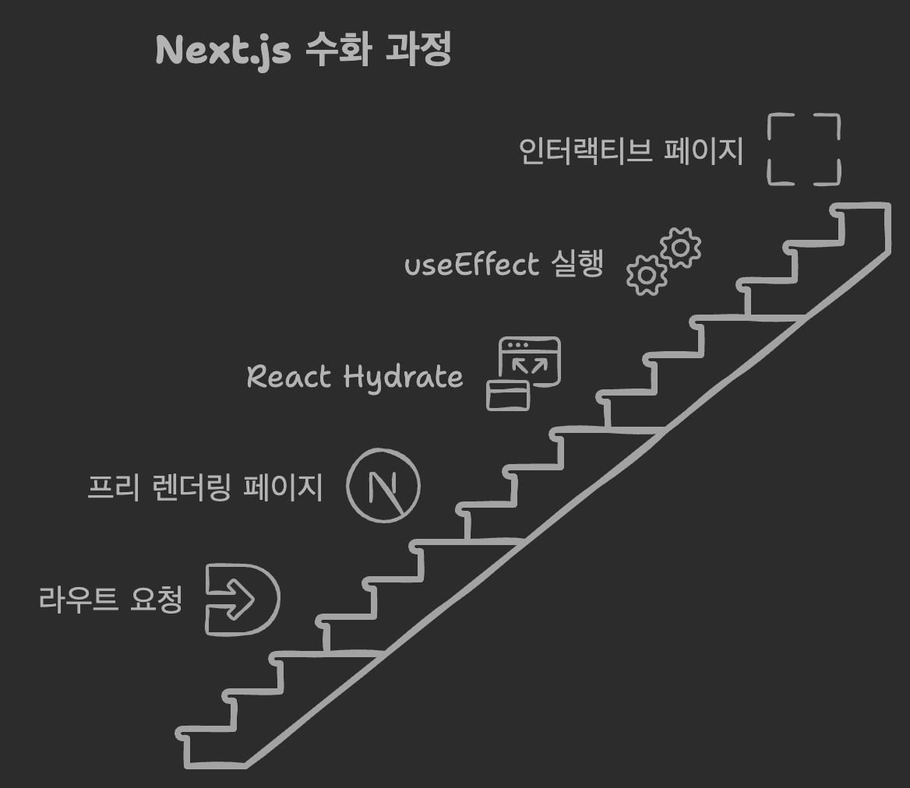
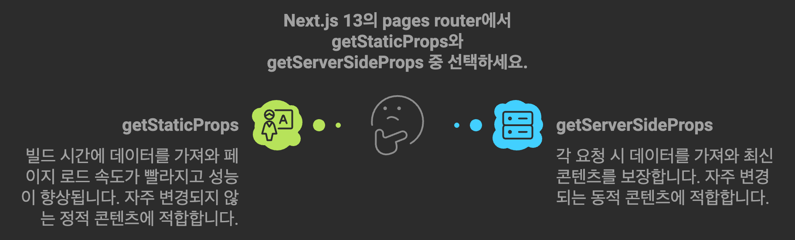

> ! 주의 : TIL 게시글입니다. 다듬지 않고 올리거나 기록을 통째로 복붙했을 수 있는 뒷고기 포스팅입니다.

저번 포스팅에서 Next.js의 [App Router](/til/nextjs-app-router)에 대해 알아봤는데요  
이건 Next.js 13 이후로 나온 기능이고, 이전에는 [Pages Router](https://nextjs.org/docs/pages)만이 존재했습니다  
~~App Router가 등장하기 이전의 범부여..~~

이번에는 Pages Router로 Next.js를 다시 먹어보겠습니다

그리고 저번 App Router 포스팅의 마지막쯤에 살펴본 Next.js의 캐싱은 거의 Next.js 13에서 App Router와 함께 등장한 기능입니다  
예컨대 방문한 모든 Route의 사전렌더링 결과를 캐싱하는 전략 등  
Pages Router에는 보통 해당되지 않습니다

또한 `"use client"`같은 지시자를 사용하지 않습니다  
대신 어떻게 렌더링 타이밍이 결정되냐..는 것은 이제부터 살펴보겠습니다  
또는 [CSR되는 기준](https://nextjs.org/docs/pages/building-your-application/rendering/client-side-rendering)에 대한 공식문서같은 것을 미리 보셔도 괜찮을 듯

# 폴더 구조

이제 `app/` 폴더 대신, `pages/` 폴더 내에 페이지들이 존재합니다  
루트 경로(`example-domain.com/`처럼)는 이제 `index.js`처럼 `index`라는 이름을 갖는 파일의 컴포넌트가 담당합니다

이제 다른 경로의 페이지를 만들려면, 예를 들어, `/pages/news.js`와 같이 파일을 만듭니다  
이러면 이 이름에 해당하는 경로가 생성됩니다. (`example-domain.com/news/`)

다른 방법도 있는데, `/pages/news/index.js`와 같이, 폴더를 만들고 그 밑에 `index.js`를 생성하여 새로운 경로를 정의할 수도 있습니다.  
이렇게 하면 루트에 대한 진입점은 `/pages/index.js`였고, 이제 `/news` 경로에 대한 진입점은 `/pages/news/index.js`가 됩니다  
이 방법이 **세그먼트를 중첩**하여 하위 경로의 페이지들을 막 만들어낼 수 있으므로 자주 쓰입니다

# Dynamic Route (동적 경로)

전에 App Router에서 했듯이, 똑같이 대괄호(`[]`)를 사용합니다  
근데 이번에는 이를 폴더가 아닌 js파일에 대해 사용합니다  
`/pages/news/[newsId].js`처럼요

이제 동적 경로의 매개변수 값을 가져오고 싶을건데 (`newsId`)  
`useRouter()` 훅을 사용하여 `router.query.newsId`처럼 가져옵니다  
어라, 훅을 사용하니 어쩔수없이 클라이언트 컴포넌트가 되나? 싶을 수 있지만  
다른 방법이 뒤에 나옵니다

일단은 아래처럼 합니다.

```jsx
import { useRouter } from "next/router";

export default function DetailPage() {
  const router = useRouter();
  const newsId = router.query.newsId;
  return <h1>The Detail Page : {newsId}</h1>;
}
```

페이지 간 이동은 여전히 `<Link>`로 하면 되겠습니다

# `_app.js`

page를 initialize할 때 Next.js는 `_app.js`컴포넌트를 거칩니다  
여기에서는 아래와 같은 일들을 할 수 있는데

- 공통 layout을 정의
- 페이지에 data 주입하기
- Global CSS를 선언하기

기본적으로 아래처럼 생겼는데

```tsx
import type { AppProps } from "next/app";

export default function MyApp({ Component, pageProps }: AppProps) {
  return <Component {...pageProps} />;
}
```

props로는

- `Component` : 지금 initialize하려는 page입니다. 예를 들어, 유저가 `<Link href="/news">`를 눌렀다면, `/pages/news/index.js`에 해당하는 페이지 컴포넌트입니다
- `pageProps` : [data fetching method](https://nextjs.org/docs/pages/building-your-application/data-fetching)중 하나로 pre-load된 데이터입니다. 이 data fetching method에 대해서는 아래에서 다룹니다

`<Component {...pageProps}>`와 같이 원래 들어갈 `pageProps`를 그대로 모두 전달해주고,  
이외에도 넣어주고 싶은게 있다면 props로 넣어줄 수 있습니다

그리고 [getInitialProps](https://nextjs.org/docs/pages/api-reference/functions/get-initial-props)를 이 타이밍에 사용할 수 있는데  
이는 데이터를 pre-load하는 방법중 하나로, 첫 렌더링 전에 미리 data를 가져오고 주입할 수 있습니다  
공식문서를 보시면 아시겠지만 `getStaticProps, getServerSideProps`가 나오면서 레거시가 되었습니다

# `_document.js`

여기에 Page의 기본 뼈대가 될 HTML을 정의합니다

```tsx
import { Html, Head, Main, NextScript } from "next/document";

export default function Document() {
  return (
    <Html lang="en">
      <Head />
      <body>
        <Main />
        <NextScript />
      </body>
    </Html>
  );
}
```

이 `_document.js`는 무조건 **서버에서만 렌더링**되며, 따라서 이벤트핸들러같은 브라우저 특성은 먹히지 않습니다  
여기서 무조건 포함되어야 하는 것은.. `Html, Head, Main, NextScript`(모두 `next/document`에서 import)입니다

- 이 때 이 `<Head>`는 `next/head`의 `<Head>`와 다릅니다
  - `_document.js`에서 쓰는 `<Head>`컴포넌트는 프로젝트 전체에 해당되는 공통적인 선언을,
  - 다른 개별 페이지에서 사용하는 `next/head`의 `<Head>`는 그 개별 페이지에 해당하는 선언을 나타냅니다
- `<Main />` 바깥에 리액트 컴포넌트가 존재해도 이는 동작하지 않습니다. React 영역전개에 해당하지 않는다는 뜻
  - 그러니 Layout처럼 공통코드를 집어넣고 싶다면, [Layout](https://nextjs.org/docs/pages/building-your-application/routing/pages-and-layouts#layout-pattern) 여기를 참고합시다. 그리고 우리는 아까 `_app.js`에서 공통 코드를 넣어줄 수 있다고 했습니다
- `_document.js`에서는 Data Fetching Method를 사용할 수 없습니다

# Client Side Rendering되는 경우

[Next.js Client-Side Rendering 문서](https://nextjs.org/docs/pages/building-your-application/rendering/client-side-rendering)에서는 CSR로 구현되는 두 가지 경우를 제시합니다.

- `useEffect()` 사용
- 또는 SWR, TanStack Query 등 서드파티 데이터 fetching 라이브러리를 사용
  - (사실 최근에 [이런 글](https://velog.io/@seungchan__y/React-Query-%EC%A0%81%EC%9C%BC%EB%A1%9C-%EC%82%AC%EA%B3%A0%ED%95%98%EA%B8%B0)을 봤는데, "리액트 쿼리(TanStack Query)는 데이터 패칭 라이브러리가 아닙니다"라고 하더라구요? 딴소리하는거긴한데 재밌는 글이라 가져왔습니다.)

`useEffect`훅은 잘 아시겠지만, 렌더링 이후에 추가로 실행되는 개념입니다  
따라서 서버쪽에서 실행될 수 없어요  
다른 데이터 fetching 라이브러리도 client side여야 하니까 그럴만 한 것 같습니다

근데 여기서 의문이 생기는데 "`useEffect`훅만 안 됨? `useState`나 커스텀훅처럼 다른 훅은 되는건가?"라는 것입니다  
공식문서를 좀 봐도 딱히 "훅이면 전부 CSR입니다"라는 명시적인 문장을 찾아보지 못했어서 이런 의문을 가졌습니다 저는  
음.. 근데 [이런 글](https://dev.to/hiteshchawla/using-custom-react-hooks-in-nextjs-3gjo)이나, 다른 어쩌구저쩌구를 다 뒤져봐도  
그냥 훅을 쓰면 필연적으로 클라이언트 컴포넌트가 된다고 결론지어집니다  
"Hooks are not allowd in server components"라는 Next.js 에러메시지가 있기도 하구요

# Page Pre-rendering (Data Fetching Method)



사용자가 어떤 페이지를 처음 요청하면 위와 같은 과정을 거칩니다  
기존의 React식 사고로 어디선가 데이터를 가져오려고 한다면 `useEffect`가 실행되는 타이밍이겠죠?

근데 이제 Next.js에서는 데이터를 Pre-Rendering 단계에서 포함하고 싶습니다. 또 그렇게 할 수 있어요  
이를 위한 두 가지 대표적인 사전 렌더링 방식이 있는데, 둘은 유사하지만 **타이밍**에 차이가 있습니다.

- **Static Generation** : 어플리케이션 빌드 시점(`npm run build`이런거)에 페이지가 Pre-Rendering됩니다
- `**Server Side Rendering** : 사용자의 요청이 들어온 시점에 페이지가 Pre-Rendering됩니다.

## Static Generation

페이지 컴포넌트에서 `getStaticProps`라는 이름으로 함수를 만들고 export하여  
Static Generation 방법으로 데이터를 가져다 사전렌더링에 포함할 수 있습니다  
Next.js는 이 `getStaticProps`를 발견하면 사전 렌더링 프로세스 중에 이를 먼저 실행한 뒤 컴포넌트에 `props`로 주입합니다.  
이 함수는 `async`로 할 수 있고, 그렇게 하면 Next.js는 이 함수의 실행을 기다리고 지나갑니다.

이제 이 `getStaticProps`에서 데이터베이스 연결, http요청, 이런 비동기작업들을 다 하면 됩니다  
이는 서버에서만 실행되고, 절대로 클라이언트 사이드로 넘어가지 않습니다

그 결과로 `getStaticProps`에서는 컴포넌트에 주입할 객체만 반환값으로 넘기면 되는데  
이는 **무조건 props 프로퍼티**를 포함해야 합니다.  
그래야 그 `props` 프로퍼티에 해당하는 값이 컴포넌트에 props로 꽂힙니다

```jsx
export default function HomePage({ meetups }) {
  return <MeetupList meetups={meetups} />;
}

export async function getStaticProps(context) {
  /*
  대충 http 요청이든 Database 연결이든 꿈을 이루기..
  */
  return {
    props: {
      meetups: meetupsFromDatabse
    }
  };
}
```

이렇게 하여, 빌드 프로세스에서 이 페이지를 사전 렌더링할 때 컴포넌트가 포함할 데이터를 주입할 수 있습니다  
인자로는 `context`라는 것을 받습니다. `context.params`와 같이 하여 url 매개변수를 갖다 쓸 수도 있고 그렇습니다

그리고 런타임에 이 사전 렌더링을 다시 수행하고 싶다면 (데이터가 변하거나, ..),  
반환값 객체에서 `revalidate` 프로퍼티를 설정하여 갱신 주기를 설정할 수 있습니다

정리하자면.. `getStaticProps`가 실행되는 경우는 아래와 같습니다

- 매 빌드 시
- `fallback: true` => fallback화면을 띄운 채로, 백그라운드에서 실행
- `fallback: 'blocking'` => 첫 렌더링 직전에 실행을 끝낸다
- 반환하는 객체에 `revalidate` 프로퍼티 쓴 경우, 주기마다 백그라운드 실행
- `revalidate()` 트리거되면 백그라운드에서 실행

### `getStaticPaths`

[페이지가 Dynamic Route를 가지며, getStaticProps를 사용한다면, getStaticPaths 있어야 합니다](https://nextjs.org/docs/pages/building-your-application/data-fetching/get-static-paths)  
`getStaticProps`는 빌드 프로세스에서 사전 렌더링된다고 말했는데  
이는 "Next.js가 동적 페이지의 모든 값들을 알고 있어야 한다"는 뜻입니다  
그래야 존재하는 모든 동적페이지들에 대한 사전 렌더링 결과를 생성하고  
존재하지 않는 경로에 대해서는 생성하지 않게끔 할 수 있습니다

`getStaticProps`를 export한 것처럼, `getStaticPaths`라는 이름의 함수도 만들고 export해줍시다

```jsx
export async function getStaticPaths() {
  return {
    paths: [{ params: { meetupId: "m1" } }, { params: { meetupId: "m2" } }],
    fallback: true
  };
}
```

이런 식으로, `getStaticPaths()`에서는 객체를 반환하고, 그 객체는 `paths` 프로퍼티를 갖습니다  
`paths` 프로퍼티의 값으로는 각 동적페이지 하나 당 객체 하나씩, 결과적으로는 객체 배열이 됩니다  
각 객체 배열의 원소들은 `{ params: {} }`처럼, 개별 동적페이지의 쿼리파라미터에 대한 정보를 갖는 객체들이 됩니다  
물론 지금처럼 하드코딩하기보단, 예를 들어 데이터베이스에서 모든 meetings 건들을 가져와서 저기에 생성하거나, 하겠네요

그리고 반환하는 객체에는 `paths`말고도 `fallback` 프로퍼티도 추가해줘야 합니다

- `fallback: false` => paths에 없는 내용 요청에 대해 404에러
- `fallback: true` => paths에 없는 요청이 들어오면, Next.js는 이 요청에 대한 페이지를 만들어냅니다. 그 전까지는 fallback페이지를 보여줍니다.
- `fallback: 'blocking'` : true처럼 페이지를 만들어내지만, 완성 전까지 fallback을 띄우지 않고 block합니다.

## Server Side Rendering

똑같이 `getServerSideProps`라는 함수를 만들고 export하여, 필요한 데이터를 **request time**에 가져올 수 있습니다  
이 또한 서버에서 실행됨이 보장되며, static때와 마찬가지로 여기서 직접 DB에 연결하거나 http요청을 보낼 수 있습니다


이런 순서로 진행됩니다  
페이지를 요청하는 타이밍에 미리 서버에서 데이터를 준비하고 이를 토대로 HTML을 생성합니다.  
일단 최소한의 HTML만 보내놓고 데이터를 가져와서 화면을 채우는 Client Side Rendering과는 상반되게요

```jsx
export async function getServerSideProps(context) {
	const req = context.req;
	const res = context.res;

	return {
		props: {
			...
		}
	}
}
```

`getStaticProps`와 되게 비슷하게 이런 식으로 씁니다.  
`props` 프로퍼티가 포함된 객체를 반환하고 컴포넌트에 props를 주입한다는 것도 비슷합니다  
그리고 `getStaticProps`의 `context`와 다르게, 여기서의 `context`는 요청(`req`)과 응답(`res`)에 대한 객체도 포함합니다  
예를 드렁, 요청의 헤더를 열어보거나 등등..

# API Route

페이지처럼 HTML코드를 반환하는게 아니라 http 요청을 받는 route를 만들 수 있습니다  
`/pages/api/` 이렇게 api 폴더를 만듭시다. 그냥 경로가 `domain.com/api/`로 시작하게 하는것인데  
이제 이 안에 JS파일을 생성하면, 그 파일의 이름대로 경로 세그먼트가 됩니다  
이 파일의 함수는 모두 서버에서만 실행됩니다

```js
// pages/api/new-meetup.js ===> POST '~~~~/api/new-meetup'

function handler(req, res) {
  if (req.method === "POST") {
    const data = req.body;
    const { title, image, address, description } = data;
  }
}

export default handler;
```

만약 `pages/api/new-meetup.js`에 이렇게 작성해두면,  
`domain.com/api/new-meetup`에 대한 POST요청을 handler가 처리하게 됩니다

예를 들어 MongoDB에 새로 데이터를 넣으려고 한다면 아래처럼 하게 될 것 같네요

```js
import { MongoClient } from "mongodb";

async function handler(req, res) {
  if (req.method === "POST") {
    const data = req.body;

    const client = await MongoClient.connect(mongoUrl);
    const db = client.db();

    const meetupsColleciton = db.collection("meetups");
    const result = await meetupsColleciton.insertOne(data);

    client.close();
    res.status(201).json({ message: "Meetup successfully inserted!" });
  }
}

export default handler;
```

이제 쓸 때는 `fetch("/api/new-meetup", { method:, body:, headers:, })` 이런 식으로 호출합니다  
같은 Next.js 프로젝트 내에 있으니까, 도메인 생략하고 루트부터의 절대경로를 작성해줍니다

---

그럼 `getStaticProps`로 Static Site Generation 방법을 선택할까요,  
아니면 `getServerSideProps`로 Server Side Rendering을 선택할까요?



잘 생각해서 선택하면 되겠습니다  
이만 마칩니다
