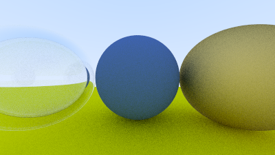

> ! 주의 : TIL 게시글입니다. 다듬지 않고 올리거나 기록을 통째로 복붙했을 수 있는 뒷고기 포스팅입니다.

[Ray Tracing in One Weekend](https://raytracing.github.io/books/RayTracingInOneWeekend.html) 자료를 기반으로 Path Tracing 구현을 학습한 기록입니다  
Path Tracing에 대해서는 다음 시간에 자세히 다루기로 하고,  
**카메라 파라미터를 설정하고 이미지를 렌더링하는 과정**을 먼저 다루고자 합니다.

다만 위 자료와 다르게, 카메라 공간 파라미터 및 공간 기저 관련 기호를 [_[KUOCW] 한정현 컴퓨터그래픽스 (4장-좌표계와 변환)_](https://youtu.be/oGCydIALgJg?si=t_8-MnePfyIo69p1) 에 나오는방식의 기호를 사용하고자 합니다.  
단순히 이게 더 저한테는 편해서 그렇습니다

코드는 다 C++입니다.

# 카메라

이제부터 카메라에 관련한 개념들을 하나씩 정립하며 `camera.h`에 카메라 클래스를 만들어봅니다.

```cpp
class camera {
  public: // 카메라 파라미터 (public)

  private: // 카메라 파라미터로부터 정해진 내부 변수 (private)

};
```

## 카메라 파라미터

카메라 또는 사람의 눈을 생각해봅니다.  
먼저 **카메라 위치**와 **카메라의 시선이 향하는 곳**이 있어야 할 것 같아요.

<figure>


<figcaption>
출처: Ray Tracing in One Weekend
</figcaption>
</figure>

자료에서는 이것을 두고, `lookfrom`(카메라 위치)과 `lookat`(카메라 시선이 향하는 위치)라고 칭합니다.  
대신 저는 **카메라 위치**를 $\mathbf{EYE}$, **카메라 시선이 향하는 위치**를 $\mathbf{AT}$이라고 두겠습니다(3차원 벡터입니다).

근데 3차원 공간에서 카메라를 표현하려면 하나의 자유도가 더 필요한데,  
시선은 그대로 두고, 카메라(눈)을 움직이지 않고도, 시선축을 따라 회전(roll)할 수 있습니다  
마치 눈과 시선은 그대로 두고, 코를 중심으로 얼굴을 회전(기괴한 모습이겠지만)시키는 것처럼요
그래서 "**카메라의 위쪽이 어딘지**"도 필요한데 이것을 $\mathbf{UP}$이라고 합시다.

이 $\mathbf{UP}$벡터는 나머지 두 벡터 $\mathbf{EYE, AT}$과 평행하지만 않게 맘대로 잡으면 되는데  
($\mathbf{EYE, AT}$도 그렇고, "카메라 파라미터를 정하는"중이니까 우리 마음입니다)  
편하게 대충 y축`(0,1,0)`으로 둔다고 생각하고 진행합시다.

이 $\mathbf{EYE, AT, UP}$ 파라미터에 의한 **카메라 공간 기저(u,v,n)** 를 다음과 같이 직교정규 기저(orthonormal basis)로써 얻을 수 있습니다.

$$n=\frac{\mathbf{EYE}-\mathbf{AT}}{\vert\vert\mathbf{EYE}-\mathbf{AT}\vert\vert}, \ u = \frac{\mathbf{UP}\times n}{\vert\vert\mathbf{UP}\times n\vert\vert}, \ v = n \times u$$


- $n$기저는 **카메라 시선의 반대**
- $u$기저는 $\mathbf{UP}$과 $n$기저에 직교정규하게 cross+normalize하여 얻는다.
- $n,u$ 기저 두 개가 만들어졌으니 새로운 직교정규기저 $v$를 cross+normalize로 얻을 수 있다.

이 필드들을 카메라 클래스에 담으면

```cpp
class camera {
  public:
  point3 EYE = point3(0,0,0);
  point3 AT = point3(0,0,-1);
  vec3 UP = vec3(0,1,0);

  private:
  vec3 u,v,n;
  vec3 center; //카메라 중심. == EYE
};
```

## 이미지 해상도 및 시야각

다음으로 그려낼 이미지의 규격을 정합니다.  
응당 이미지 높이/너비를 결정해야겠죠?  
`image_width, image_height` 이런 식으로요  
이건 "길이"라는 개념으로 생각하기보다는 **몇 개 픽셀**인지, 를 나타냅니다.  
컴퓨터로 그려진 이미지는 "몇 픽셀이냐"잖아요


대충 이런식으로 `image_width x image_height`만큼 **픽셀 그리드**가 있을건데  
그림에서는 대충.. 가로로 6칸, 세로로 7칸이어서 6x7픽셀인 셈이고요  
사실은 `image_width x image_height`만큼 있는 것입니다

근데 여기서 `image_width, image_height`를 둘 다 직접 주는 것보다는  
`image_height`대신 `aspect_ratio`를 설정하는게 나아보입니다  
이러면 종횡비를 고정하고 스케일을 조정하기 쉽겠죠

```cpp
class camera {
  public:
  point3 EYE = point3(0,0,0);
  point3 AT = point3(0,0,-1);
  vec3 UP = vec3(0,1,0);

  double aspect_ratio = 1.0; // +
  int image_width = 100;     // +

  private:
  vec3 u,v,n;
  vec3 center;

  int image_height;          // +
};
```

여기까지 하면 **렌더링된(결과) 이미지의 pixel dimension**(픽셀 차원)을 설정했습니다.

## viewport 및 image 공간

이번에는 **viewport**를 설정합니다.  
이건 이미지를 그려내는 실제 공간이 아니고  
**카메라 앞에 놓은 가상의 이미지 평면(공간)** 입니다.


이 viewport평면을 `image_width x image_height`개의 셀로 분할하고,  
우리는 앞으로 이 **각 셀마다 색상을 결정**하는 과정을 거칠건데  
이렇게 viewport에서 `(i, j)번째` 셀에 결정된 색상은 이미지 상에서 `(i, j)번째` 픽셀의 색상에 대응됩니다.  
viewport평면을 분할하는 셀 크기를 정사각을 유지(수평/수직으로 픽셀들이 같은 거리를 가지게)하면 해상도가 유지되겠죠?  
잠깐 코드로 관계를 나타내보면:

```cpp
auto aspect_ratio = 16.0 / 9.0;
int image_width = 400;
int image_height = int(image_width / aspect_ratio);
image_height = (image_height < 1) ? 1 : image_height;

auto viewport_height = 2.0;
auto viewport_width = viewport_height * (double(image_width) / image_height);
```

이 예시에서는 `viewport_height`를 임의로 `2.0`으로 잡아봤습니다.  
`viewport_height`로부터 `viewport_width`를 구할 때 `aspect_ratio`가 아닌  
`image_width/image_height`를 다시 하여 종횡비를 적용했는데  
`aspect_ratio = 16.0/9.0`은 _이상적인_ (원하는) 비율인 반면  
`image_height`를 _1보다 작지 않게_ (최소한 픽셀 하나는 있어야 이미지죠?) 조정한 후의 _실질적인_ 비율을 적용한 것입니다

이제 이 **viewport** 공간에 대해 표현하고 싶은데  
먼저, **시야각**을 결정하여 `viewport_height,width`를 결정하고 싶습니다


시야각은 수직(높이축으로) 시야각과 수평(너비축으로) 시야각 두 가지가 있을텐데  
하나만 정하면 우리는 종횡비가 고정이니까 딸려옵니다.  
수직 시야각(vertical field of view, vfov)을 사용하기로 하고 $\theta$라고 합시다.  
그리고 하나 더, 원점(카메라 중심==EYE)으로부터 뷰포트까지의 거리를 `focal_length`라고 합시다.


이렇게 단순하게 그려볼 수 있고,  
$h = $(focal_length) $\cdot tan(\frac{\theta}{2})$
와 같이 관계가 성립합니다.  
$h$는 $viewport_{height}$의 반절이구요

```cpp
// Viewport의 Dimension
auto focal_length = (EYE - AT).length();
auto theta = degrees_to_radians(vfov);
auto h = std::tan(theta / 2);
auto viewport_height = 2 * h * focal_length;
auto viewport_width = viewport_height * (double(image_width) / image_height);
```

이런식으로 코드를 쓸 수 있겠죠?

이제 `vfov` 필드를 추가해줍니다.

```cpp
class camera {
  public:
  point3 EYE = point3(0,0,0);
  point3 AT = point3(0,0,-1);
  vec3 UP = vec3(0,1,0);

  double aspect_ratio = 1.0;
  int image_width = 100;
  double vfov = 90;          // +

  private:
  vec3 u,v,n;
  vec3 center;

  int image_height;
};
```

### viewport 좌표계와 이미지 좌표계

주의할 점이, viewport 좌표계 구성과 이미지 좌표계 구성이 다릅니다.  
이미지 좌표계는 왼쪽위 모서리부터 시작하여 오른쪽+아래로 내려오는 반면  
뷰포트 좌표계는 아까 만든 카메라 공간 기저 $u,v,n$에 따라,  
뷰포트 중앙에서 시작하여 오른쪽으로 $u$, 위쪽으로 $v$ 축을 진행합니다.


그러니 아래와 같이 뷰포트 평면에 이런 벡터들을 놓아주어 이미지 평면 다루듯이 할 수 있습니다.


코드로는:

```cpp
// Vu, Vv (Image Plane인 Viewport를 따라 좌상단부터 우측아래로 내려가는)
auto viewport_u = viewport_width * u;
auto viewport_v = viewport_height * -v;

// u,v축을 따라 픽셀 간을 이동하는 델타 벡터
pixel_delta_u = viewport_u / image_width;
pixel_delta_v = viewport_v / image_height;

// 좌상단 픽셀 위치 계산
auto viewport_upper_left = center - (focal_length * n) - viewport_u / 2 - viewport_v / 2;
pixel00_loc = viewport_upper_left + 0.5 * (pixel_delta_u + pixel_delta_v);
```

좌상단 픽셀 위치(`pixel00_loc`)는 이런 식입니다:


지금까지를 정리해보면 필드는

```cpp
class camera {
public:
  // 카메라 파라미터 (public)
  double aspect_ratio = 1.0;    // (ideal) 종횡비 aspect ratio
  int image_width = 100;        // 렌더링되는 이미지의 가로 픽셀 수
  int samples_per_pixel = 10;   // 한 픽셀에 대해, 랜덤 샘플링하는 수
  int max_depth = 10;           // 최대 bounce 횟수
  double vfov = 90;             // Vertical 시야각
  point3 EYE = point3(0, 0, 0); // EYE.
  point3 AT = point3(0, 0, -1); // AT.
  vec3 UP = vec3(0, 1, 0);      // UP.

private:
  // 카메라 내부 변수 (private)
  int image_height;           // 렌더링된 이미지의 세로축 픽셀 수
  double pixel_samples_scale; // 색상 scale factor
  point3 center;              // 카메라 중심
  point3 pixel00_loc;         // 좌상단(가장 처음) 픽셀의 위치
  vec3 pixel_delta_u;         // pixel 간 width축(u축) 거리
  vec3 pixel_delta_v;         // pixel 간 height축(v축) 거리
  vec3 u, v, n;               // 카메라 공간 기저
};
```

# 렌더링하기

## initalize

public 파라미터들이 주어지면 private 변수들을 채우기 위해 `initialize`를 내부적으로 호출합니다.

```cpp
class camera {
public:
  // public 파라미터들..

private:
  // private 변수들..


  void initialize() {
    image_height = int(image_width / aspect_ratio);
    image_height = (image_height < 1) ? 1 : image_height;

    pixel_samples_scale = 1.0 / samples_per_pixel;

    center = EYE;

    // Viewport의 Dimension
    auto focal_length = (EYE - AT).length();
    auto theta = degrees_to_radians(vfov);
    auto h = std::tan(theta / 2);
    auto viewport_height = 2 * h * focal_length;
    auto viewport_width = viewport_height * (double(image_width) / image_height);

    // u,v,n 기저 계산
    n = unit_vector(EYE - AT);
    u = unit_vector(cross(UP, n));
    v = cross(n, u);

    // Vu, Vv (Image Plane인 Viewport를 따라 좌상단부터 우측아래로 내려가는)
    auto viewport_u = viewport_width * u;
    auto viewport_v = viewport_height * -v;

    // u,v축을 따라 픽셀 간을 이동하는 델타 벡터
    pixel_delta_u = viewport_u / image_width;
    pixel_delta_v = viewport_v / image_height;

    // 좌상단 픽셀 위치 계산
    auto viewport_upper_left = center - (focal_length * n) - viewport_u / 2 - viewport_v / 2;
    pixel00_loc = viewport_upper_left + 0.5 * (pixel_delta_u + pixel_delta_v);
  }
};
```

## render

응당 렌더링이라는 것은 **이미지를 보는 방법**부터 필요합니다.  
가장 단순하고 직접적인 것은 파일에 구워내는 것인데  
plain text로 이루어지는 **ppm** file 포맷으로 단순하게 해볼 수 있습니다.

아래는 ppm 포맷에 대한 위키 설명입니다.


예제에서 ppm 포맷의 이미지를 3열 2행으로, 0~255 색상을 사용해 채울거고, whitespace 및 개행으로 그리드별로 색상을 지정해주었습니다.

이것을 이용해 원하는 픽셀에 색상을 찍어낼 수 있습니다.

```cpp
void render() {
  initialize();

  std::cout
  << "P3\n"
  << image_width
  << ' '
  << image_height
  << "\n255\n";

  for (int j = 0; j < image_height; ++j) {
    std::clog
    << "\rScanlines remaining: "
    << (image_height - j)
    << ' '
    << std::flush;

    for (int i = 0; i < image_width; ++i) {
      const color pixel_color = // 픽셀마다 색상을 결정하기..
      write_color(std::cout, pixel_color); // 픽셀컬러값을 [0,255]범위로 맞추고 출력하기...
    }
  }

  std::clog << "\rDone.                 \n";
}
```

각 픽셀 컬러의 결정과 `write_color()`에 대해서는 이 다음 편에서 Ray Tracing 및 Path Tracing에 관해 자세히 알아볼 때 할거고  
~~있다 치고~~ 지금은 카메라 설정에 따라 잘 씬이 바뀌는지를 봅니다.

```cpp
cam.vfov = 120;
cam.EYE = point3(-2, 2, 1);
cam.AT = point3(0, 0, -1);
cam.UP = vec3(0, 1, 0);
```


```cpp
cam.vfov = 30;
```


```cpp
cam.vfov = 80;
cam.EYE = point3(0, 0, 0);
```



카메라를 잘 움직일 수 있게 됐네요
