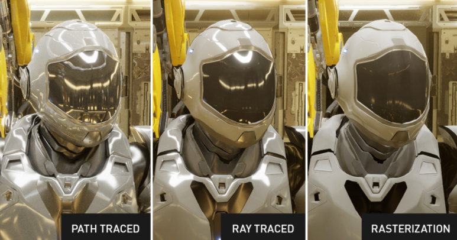

> ! 주의 : TIL 게시글입니다. 다듬지 않고 올리거나 기록을 통째로 복붙했을 수 있는 뒷고기 포스팅입니다.

지난번에 [Ray Tracing in One Weekend](https://raytracing.github.io/books/RayTracingInOneWeekend.html) 하고있다고 했었죠  
이번에는 정말로 **Ray Tracing과 Path Tracing**이 무엇인지 알아보고  
구현까지 한번 훑어봅니다

# 배경

[NVIDIA 테크니컬 블로그에 Path Tracing에 대해 소개](https://developer.nvidia.com/ko-kr/blog/%ED%8C%A8%EC%8A%A4-%ED%8A%B8%EB%A0%88%EC%9D%B4%EC%8B%B1%EC%9D%B4%EB%9E%80/)하는 글이 있으니 가볍게 읽어보셔도 좋을 것 같습니다

<figure>



<figcaption>
출처 - "패스 트레이싱이란?" by NVIDIA 테크니컬 블로그(위 링크)
</figcaption>
</figure>

> *RASTERIZATION*은 단일 관점에서 보는 이미지를 생성하는 기술입니다. 처음부터 GPU의 핵심이었습니다.

그림에서 가장 오른쪽의 RASTERIZATION 예시는 조명 효과가 가장 단순해보입니다.  
[Phong Model](https://en.wikipedia.org/wiki/Phong_reflection_model)같은 고전적인 국소 조명 모델은 강력하면서 단순하지만  
**전체 씬에 의한 관계가 드러나지 않고, 본인과 조명에 의한 관계**만 드러난다는 점에서 한계가 뚜렷합니다.

현실에서는 직접적인 조명 외에도 투명한 유리 뒤에서 들어오는 빛도, 거울이나 호수, 달, ...에 의해 반사된 빛도 있습니다.  
더 현실같으려면 이처럼 단일 지점에서 보이는 것 뿐만 아니라 여러 방향으로, 여러 지점에서 보이는 것이 무엇인지 결정할 수 있어야 하고, 이를 위해 **Ray Tracing**이 등장했습니다.

# Ray Tracing

핵심 아이디어는 이름처럼 **픽셀마다 광선(Ray)을 쏜다**입니다.  
좀 더 자세히는, _카메라에서 각 픽셀로 향하는 광선을 발사_ 하는 것이고요


각 광선은 어떤 물체에 부딪히기 전까지 쭉 나아갑니다.  
그러다 어떤 물체에 부딪혔고(**hit**) 이 지점을 $P$라고 해봅니다.  
이 $P$점에서 **세 가지 광선을 새롭게 발사**합니다.

1. Shadow Ray: 조명까지 광선을 쏩니다. 중간에 막히진 않는지 보려고요
2. Reflection Ray: 표면에서 정반사하여 광선을 쏩니다. 간접적으로 들어오는 빛이 있는지 보려고요
3. Refraction(Transmission) Ray: 표면에서 굴절하여 광선을 쏩니다. 물체를 통과하여 들어온 빛이 있는지 보려고요. 물체가 유리같이 통과할 수 있는 물질이라면


이 과정을 **재귀적**으로 반복합니다.

```
Camera
   |
   v
   P0
  /  \
 R    T
 |    |
 v    v
 P1   P2
/ \
R  T
|
v
P3
```

그럼 이런식으로 Reflection/Transmission Ray가 Tree처럼 뻗게 됩니다.  
트리가 끊기거나 또는 미리 정해진 재귀 깊이(ex. 10번까지만 가자..)를 채웠다면 끝납니다.  
그러고는 **광선을 따라가서 얻었던 빛의 양**을 모두 합산합니다.

대충 코드 비스무리하게 쓰면 이런 식이겠네요

```cpp
Color traceRay(Ray ray, int depth)
{
  if (depth >= maxDepth)
    return Color(0, 0, 0);
  Hit hit = intersect(ray);

  if (!hit)
    return background;

  Color color = localLighting(hit); // shadow ray.

  if (hit.material.reflective) // reflect ray.
    color += kr * traceRay(reflectedRay(hit), depth + 1);

  if (hit.material.transparent) // transmission ray.
    color += kt * traceRay(refractedRay(hit), depth + 1);

  return color;
}
```

이렇게 하면 씬 내에서 물체끼리의 반사, 굴절 등에 의해 간접적으로 빛을 받는 효과를 표현할 수 있습니다.

## 한계?

굉장한 아이디어지만 여전히 현실과 많이 다른 부분이 있는데

첫 번째로, 반사와 굴절 광선이 **이상적으로 매끄러운 평면**을 가정하고 있습니다.  
반사는 거울처럼 정반사되고, 굴절도 평면을 통과한다고 생각하고 있고요.  
현실에서는 **난반사** 및 **흐리게 굴절**되는 경우가 더 많습니다.


두 번째로, 어떤 광선은 튕기고 튕겨서 광원에 닿아 빛을 받는 판정이 나오고, 어떤 광선은 재귀가 끝날 때까지 광원에 닿지 못해 빛을 받지 못하는 판정이 나올 수 있습니다.  
아래 그림에서, 광원에 의해 간접적으로 방이 밝아졌을 것인데  
빨간 점선을 따라가보면 광원과 연결되지 못합니다. bounce 지점에서 shadow ray를 쏴도 벽에 막히고요  
그러나 실제 표면에서는 다른 방향에 의해 확산 반사된 빛이 들어올 수 있습니다.


이제 **Path Tracing**이 이를 해결할 차례입니다.

# Path Tracing

**Path Tracing**은 **Ray Tracing**에서 단순한 아이디어를 더 얹은 확장팩입니다. 핵심은 크게 두 가지인데

- 하나의 광선은 재질에 따라 다음 진행 방향을 **랜덤**하게 뽑아 경로를 이어나갑니다.
- 위와 같은 경로를 **각 픽셀마다 여러 개 반복하고 평균**냅니다.

<figure>


<figcaption>

출처: [Introduction to Computer Graphics with OpenGL ES (J. Han)](https://github.com/medialab-ku/openGLESbook), chapter 16 - slide 11

</figcaption>
</figure>

예를 들어 반사하는 상황이라고 생각해봅니다.  
정말 매끄러운 표면이면 광선을 좁은 범위 안에서 랜덤하게 뽑고, 거친 표면이면 넓은 범위에서 랜덤하게 뽑으면 되겠네요.

이러한 **광선들 각자 여행하고서 결정된 색상들을 종합해서 평균**을 냅니다.  
예를 들어 위 그림의 오른쪽에서, 같은 지점에서 반사하더라도 물체에 막힐 때도, 그렇지 않을 때도 있어서 이것을 평균내면 _적당히 음영진_ 형태를 띠게 될겁니다  
**반복된 무작위 추출을 이용해 결과를 통계적으로 근사**하니 [**몬테카를로 방법**](https://ko.wikipedia.org/wiki/%EB%AA%AC%ED%85%8C%EC%B9%B4%EB%A5%BC%EB%A1%9C_%EB%B0%A9%EB%B2%95)이라고 부를 수 있겠네요

<figure>


<figcaption>

출처: [Introduction to Computer Graphics with OpenGL ES (J. Han)](https://github.com/medialab-ku/openGLESbook), chapter 16 - slide 12

</figcaption>
</figure>

통계적으로 근사한다는 특징답게, ray가 적을수록 실제 결과에 수렴하지 못하고 noisy해지는 모습을 보여줍니다.  
주사위를 6000번 던지면 1~6까지의 숫자가 나오는 비율이 각자 거의 1/6에 가까워진다는 결과를 얻을 수 있겠지만 6번 던진다고 해서 그런 결과를 얻을 수 없는 것과 비슷합니다

안그래도 픽셀만큼 광선을 쏘고, 광선이 교차하는지 확인하고, 광선이 세포분열하듯이 재귀트리의 가지를 수없이 뻗게 되는데  
이렇게 몇백, 몇천 개의 광선을 쏟아내면 굉장히 연산이 무거워집니다  
그래서 한동안은 실시간 렌더링에서는 엄두를 못 내다가, GPU가 강력해짐에 따라 실시간 게임 등에서 활용되고 있습니다

> 2018년에 NVIDIA는 게임 개발자에게 영화 품질의 실시간 렌더링을 제공하는 레이 트레이싱 기술인 [NVIDIA RTX](https://developer.nvidia.com/ko-kr/blog/%ED%8C%A8%EC%8A%A4-%ED%8A%B8%EB%A0%88%EC%9D%B4%EC%8B%B1%EC%9D%B4%EB%9E%80/#:~:text=%EB%A0%88%EC%9D%B4%20%ED%8A%B8%EB%A0%88%EC%9D%B4%EC%8B%B1%20%EA%B8%B0%EC%88%A0%EC%9D%B8-,NVIDIA%20RTX,-%EB%A5%BC%20%EB%B0%9C%ED%91%9C%ED%96%88%EC%8A%B5%EB%8B%88%EB%8B%A4.)를 발표했습니다. ... Minecraft는 실시간 패스 트레이싱에 대한 지원도 포함하여 고르지 않은 몰입형 세계를 빛과 음영이 가득한 몰입형 환경으로 바꿔줍니다. - [NVIDIA 테크니컬 블로그](https://developer.nvidia.com/ko-kr/blog/%ED%8C%A8%EC%8A%A4-%ED%8A%B8%EB%A0%88%EC%9D%B4%EC%8B%B1%EC%9D%B4%EB%9E%80/)

# 어떤 식으로 구현되는지 맛 한번 보기

[지난 포스팅](../path-tracing-01)에서 카메라 설정에 관해 살펴봤습니다.  
거기서 `camera.render()`를 대충 넘어갔었는데, 이런 식으로 생겼던 것 같네요:

```cpp
void render(const hittable& world) {
  initialize();

  std::cout << "P3\n" << image_width << ' ' << image_height << "\n255\n";

  for (int j = 0; j < image_height; j++) {
    std::clog << "\rScanlines remaining: " << (image_height - j) << ' ' << std::flush;
    for (int i = 0; i < image_width; i++) {
      // TODO: 광선을 쏘자
    }
  }

  std::clog << "\rDone.                 \n";
}
```

이 중첩 `i,j` for문 내부를 Ray Tracing 또는 Path Tracing으로 채워봅시다

## Ray Tracing으로 구현하면

고전적인 Ray Tracing을 먼저 살펴봅니다.

```cpp
// for i, j ...
auto pixel_center = pixel00_loc + (i * pixel_delta_u) + (j * pixel_delta_v);
auto ray_direction = pixel_center - camera_center;
ray r(camera_center, ray_direction);

color pixel_color = ray_color(r, world);
write_color(std::cout, pixel_color);
```

1. `i, j`번째 픽셀을 선택합니다. (픽셀은 하나의 점이 아닌 면적을 갖는 사각형 그리드)
2. 그 픽셀 사각형(그리드) 내의 가장 중앙에 있는 지점인 `pixel_center`를 얻습니다.
3. `camera_center` $\rightarrow$ `pixel_center` 방향으로 광선을 쏩니다. 시작점은 `camera_center`고요
4. 이제 이렇게 발사한 광선으로부터, 오브젝트와 교차하는지 등을 검사하여 색상을 결정해줄 `ray_color()`를 호출합니다. (광선이 부딪힐 수 있는 오브젝트인 `hittable`에 대해서는 아래에서 살펴봅니다)

충돌할 물체 없이, `ray_color`를 그냥 오브젝트 충돌 없이 아래와 같은 규칙으로 **광선의 색상을 결정**하도록 할 수 있습니다.

```cpp
color ray_color(const ray& r) {
  vec3 unit_direction = unit_vector(r.direction());
  auto t = 0.5 * (unit_direction.y() + 1.0);
  return (1.0 - t) * color(1.0, 1.0, 1.0) + t * color(0.5, 0.7, 1.0);
}
```

광선의 y축 방향성에 따라, +y쪽으로 나아간 광선은 하늘색을 갖는 경향을, -y쪽으로 나아간 광선은 흰색을 갖는 경향을 갖도록 해봤습니다.


아 광선을 쐈으니까 아무튼 Ray Tracing이라고요~

### 부딪힐 수 있는 물체를 놓자.

Ray Tracing을 맛보기 위해, **광선이 부딪힐 수 있는 물체**를 만들어보고 싶은데요
동그란 구를 하나 둘건데 나중에 편하게 하기 위해서 추상클래스 `hittable`을 먼저 만들어봅니다.

```cpp
class material; // 컴파일러에게 "material class는 나중에 알려줄게요"

class hit_record {
public:
  point3 p;
  vec3 normal;
  shared_ptr<material> mat;
  double t;
  bool front_face;

  void set_face_normal(const ray& r, const vec3& outward_normal) {
    // hit record의 법선벡터를 설정.
    // "outward_normal"은 항상 단위 벡터라고 가정한다.

    front_face = dot(r.direction(), outward_normal) < 0;
    normal = front_face ? outward_normal : -outward_normal;
  }
};

class hittable {
public:
  virtual ~hittable() = default;
  virtual bool hit(const ray& r, interval ray_t, hit_record& rec) const = 0;
};
```

사실 여기까지 오는 과정은 [Ray Tracing in One Weekend](https://raytracing.github.io/books/RayTracingInOneWeekend.html)에서 6장, 7장이 되어서야 도달하는 곳인데, 저는 불친절하니까 과감하게 건너뜁니다.

중요한 것은

- `hittable`이라면 **응당 `hit()`메서드**를 가진다.
  - `bool hit(ray, ray_interval, hit_record)`
  - _광선(첫 번째 인자 `ray`)이 이 오브젝트와 충돌했는가?_ 연산을 구현해야 한다.
- 광선은 매개변수 $t$, 방향벡터 $\mathbf{d}$와 시작점 $\mathbf{o}$에 대해: _$ray(t) = \mathbf{o} + t\cdot \mathbf{d}$_ 와 같이 **매개변수 방정식**으로 나타낸다.
  - 광선이 충돌했을 때의 $t$는 _광선이 얼마나 진행해야 그 지점까지 가는가_ 임
- 광선은 `0 < t < 현재까지 만난 충돌점 중 가장 가까운 것` 에 속하는 범위에서 만나는 것만 충돌로 간주한다.
- `hit` 판정이 `true`(광선이 부딪힘)이라면 **`hit_record`에 충돌 정보를 모두 기록**한다.
  - 광선이 충돌한 지점(`p`), 그 표면의 법선벡터(`normal`), 재질(`material`, 후속 글에서 알아봅니다. 예를들어 난반사하는 재질, 유리같은 재질 등), 광선이 얼마나 진행했는지(`t`), 충돌한게 앞면인지 (`front_face`)

#### 구(Sphere)

이제 예를 들어 `hittable`을 구현하는 `sphere` 클래스를 작성해봅니다.

```cpp
class sphere : public hittable { ... };
```

구의 방정식은 $𝑥^2+𝑦^2+𝑧^2=𝑟^2$인데  
이건 중심이 원점인 경우고, $(C_x, C_y, C_z)$라는 임의의 중심에 대해  
$$(C_x - x)^2 + (C_y - y)^2 + (C_z - z)^2 = r^2$$

3차원 벡터로 나타내면 point $\mathbf{P} = (x,y,z)$에서 중심 $\mathbf{C} = (C_x, C_y, C_z)$로 가는 벡터는 $(\mathbf{C-P})$ 이고, 구의 방정식은:  
$$(\mathbf{C-P}) \cdot (\mathbf{C-P}) = (C_x - x)^2 + (C_y - y)^2 + (C_z - z)^2 = r^2$$  
즉, **이 식을 만족하는 $\mathbf{P}$는 구 위에** 있습니다.

이제 우리는 **우리의 광선 $\mathbf{P}(t) = \mathbf{Q} + t\mathbf{d}$ 가 구 어딘가와 만나는지** 알고 싶은데요  
만약 구와 만난다면, 아래 조건을 만족합니다:

> 구의 방정식에 $\mathbf{P}(t)$를 대입했을 때, 최소 하나의 실수해를 갖는 어떤 임의의 $t$가 존재한다.

$$(\mathbf{C} - \mathbf{P}(t)) \cdot (\mathbf{C} - \mathbf{P}(t)) = r^2$$  
$$\Rightarrow (\mathbf{C} - (\mathbf{Q} + t\mathbf{d})) \cdot (\mathbf{C} -(\mathbf{Q} + t\mathbf{d})) = r^2$$  
$$\Rightarrow (-t\mathbf{d} + (\mathbf{C} - \mathbf{Q})) \cdot (-t\mathbf{d} + (\mathbf{C} - \mathbf{Q})) = r^2$$  
$$\Rightarrow t^2 \mathbf{d}\cdot\mathbf{d} - 2t\mathbf{d}\cdot(\mathbf{C}-\mathbf{Q}) + (\mathbf{C}-\mathbf{Q})\cdot(\mathbf{C}-\mathbf{Q}) - r^2 = 0$$

이제 근의 공식을 써서 해를 구할 수 있습니다:  
근의 공식 $$\frac{-b \pm \sqrt{b^2 - 4ac}}{2a}$$ 에 대해  
$$a = \mathbf{d}\cdot\mathbf{d}, \ \ b=-2 \mathbf{d} \cdot (\mathbf{C}-\mathbf{Q}), \ \ c=(\mathbf{C}-\mathbf{Q})\cdot(\mathbf{C}-\mathbf{Q}) - r^2$$

사실 일단 먼저 판별식(루트 안에 있는 $b^2-4ac$) 먼저 확인하면 교차 여부를 알 수 있긴 합니다.


<figure>

<figcaption>

출처: [Ray Tracing in One Weekend](https://raytracing.github.io/books/RayTracingInOneWeekend.html), Figure 5

</figcaption>
</figure>

다만 실제 광선과의 충돌인지 (광선 진행방향 뒤쪽인지, 등..)는 구한 해가 유효한 `t`범위 안에 있는지도 확인해줘야 합니다.

이것을 구현하면:

```cpp
class sphere : public hittable {
public:
  sphere(const point3& center, double radius, shared_ptr<material> mat)
      : center(center), radius(std::fmax(0, radius)), mat(mat) {}

  bool hit(const ray& r, interval ray_t, hit_record& rec) const override {
    if (radius <= 0)
      return false;

    // 판별식을 통해 충돌여부 먼저 검사
    vec3 oc = center - r.origin(); // vec3 oc = C - Q.
    auto a = dot(r.direction(), r.direction());
    auto b = -2.0 * dot(r.direction(), oc);
    auto c = dot(oc, oc) - radius*radius;
    auto discriminant = b*b - 4*a*c;

    if (discriminant < 0)
      return false;
    auto sqrtd = std::sqrt(discriminant);

    // intersection 하는 해 중 근접점을 찾는다.
    auto root = (-b - sqrtd) / (2.0 * a); // 근의공식 해 (+-) 중 작은 (-) 먼저
    if (!ray_t.surrounds(root)) { // 유효한 t 범위 내에 있는지?
      root = (-b + sqrtd) / (2.0 * a); // 이번엔 큰 (+)에 대해
      if (!ray_t.surrounds(root)) // 유효한 t 범위 내에 있는지?
        return false;
    }

    // 충돌점에서의 정보 기록
    rec.t = root;
    rec.p = r.at(rec.t);
    vec3 outward_normal = (rec.p - center) / radius;
    rec.set_face_normal(r, outward_normal);
    rec.mat = mat;

    return true;
  }

private:
  point3 center;
  double radius;
  shared_ptr<material> mat;
};
```

이제 `ray_color`를 다음과 같이:

```cpp
color ray_color(const ray& r, const hittable& world) {
    hit_record rec;
    if (world.hit(r, interval(0, infinity), rec))
        return color(0, 1, 0);

    // 기존 하늘색 그라데이션 코드
}
```

**구와 광선이 만난다면 초록색**, 아니면 아까 그 하늘색 그라데이션을 줍니다.


이제 음영, 반사, 등등 많은 사실적으로 보이게 하는 요소들을 차차 추가해야겠지만,  
이것만으로 일단 [**Implicit Surface**](https://en.wikipedia.org/wiki/Implicit_surface)를 **Ray Tracing**법으로 구현한 셈입니다

### Implicit Surface Rendering

보통 3D 그래픽스에서 자주 쓰는 [Polygon Mesh](https://en.wikipedia.org/wiki/Polygon_mesh)법은 물체를 그려낼 때 표면을 삼각형(또는 사각형)으로 근사하여 표현합니다.  
예를 들어 구 하나를 하려고 해도, 실제로는 완벽한 곡면이 아니라 충분히 많은 삼각형을 이어붙여 _곡면처럼 보이게_ 렌더링합니다.


GPU Rasterization에서는 스크린에서 각 픽셀이 어떤 삼각형에 속하는지 계산하여 렌더링하게 됩니다.

다른 방법으로, 폴리곤을 명시적으로 배치하여 물체를 만들지 않고 대신에 **수학 식으로 영역을 전개해 표면을 정의**할 수 있습니다.  
예를 들어 반지름 $r$인 구를 표현하기 위해 $F(x,y,z) = x^2 + y^2 + z^2 - r^2$ 이라고 두고,  
이 **영역 조건 $F(x,y,z) = 0$을 만족하면 모두 구의 표면**이다, 라고 할 수 있습니다.


이러한 방식을 **Implicit Surface(Implicit Function)을 이용하여 렌더링**했다고 할 수 있습니다.

Ray Tracing에서는 광선 $P(t) = O + tD$를 쏘는데, **광선이 implicit surface 위에 있는 순간**을 그냥  
$F(P(t)) = 0$ 을 풀어 찾을 수 있습니다.

정리하면

- Polygon Mesh 방식(ex. 삼각형메쉬)은 **물체 표면을 삼각형으로 잘게 쪼개고 공간에 직접 배치하여 표현**합니다.
  - Ray Tracing에서는 **ray가 어느 삼각형과 교차**하는지를 물어봅니다.
- Implicit Function 방식은 **물체 표면을 수학식 $F(x,y,z)$으로 표현**합니다.
  - Ray Tracing에서는 **ray 위의 어떤 점이 $F(x,y,z)=0$을 만족**하는지 물어봅니다.

## Path Tracing은 대충..

**Path Tracing**이 대충 어떤식으로 돌아가는지정도만 봅시다.  
구체적으로는 **material**을 정의해줘야 하는데, 다음 글로 쓰려고요

Path Tracing에서 material이란 일단 **빛을 scatter** 합니다.  
**scatter**란 한마디로 **산란**이라고 해두면 편한 것 같아요  
예를들어 반사하거나, 약간 비틀어서 통과(굴절)시키거나, ..

```cpp
class material {
public:
  virtual ~material() = default;

  virtual bool scatter(const ray& r_in, const hit_record& rec, color& attenuation,
                       ray& scattered) const {
    return false;
  }
};
```

이제 `ray_color`(광선을 쐈을 때 그 광선의 색상을 결정하는 메서드였습니다)는 이렇게 생깁니다:

```cpp
color ray_color(const ray& r, int depth, const hittable& world) const {
  if (depth <= 0)
    return color(0, 0, 0); // ray bounce limit 넘어가면 빛 없음으로 처리

  hit_record rec;

  if (world.hit(r, interval(0, infinity), rec)) {
    ray scattered;
    color attenuation;
    if (rec.mat->scatter(r, rec, attenuation, scattered))
      return attenuation * ray_color(scattered, depth - 1, world);
    return color(0, 0, 0);
  }

  // ... 하늘 색 그라데이션
```

- 뭔가 물체와 만났다면(`world.hit(r, ray_t, rec)==true`), **material의 특성에 따라 scatter**합니다.
- material은 **scatter 후 광선이 어떻게 나아가는지, 색상은 얼마나 곱할지(`attenuation`, 감쇠 계수)** 를 알려줍니다.
- 이번 **광선의 색상은, 다음 광선을 재귀적으로 추적해 얻은 색상에 현재 표면의 `attenuation`을 적용한 값**입니다.
  - 미리 정해진 재귀 레벨 제한을 넘어가면 빛이 없다고 처리합니다. (`color(0,0,0)`)

구체적으로 **본인만의 산란 특성을 갖는 material**을 구현해보는 것은 다음 글에서 해보려고 합니다
이런 결과들을 얻게 될겁니다


