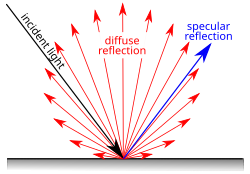
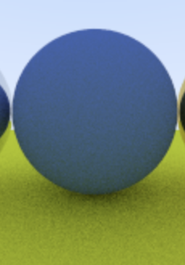
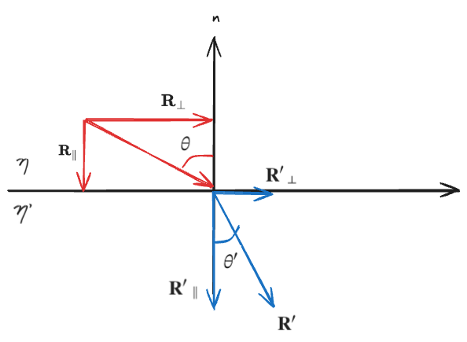

> ! 주의 : TIL 게시글입니다. 다듬지 않고 올리거나 기록을 통째로 복붙했을 수 있는 뒷고기 포스팅입니다.

[이전 포스팅](../path-tracing-02/)에서 `material` 추상클래스 뼈대만 확인했고  
구체적으로 **특성에 따라 광선을 산란(scattering)시키는 여러 재질**들을 구현하기로 했습니다.

# Lambertian Material

우리가 보통 보는 거친 표면들(플라스틱, 나무, 시멘트벽, ...)은 빛을 거의 무작위적으로 난반사합니다.  
이처럼 **바라보는 각도에 관계없이 같은 (겉보기)밝기를 유지하는 이상적인 난반사 성질**을 두고 [**Lambertian 반사**](https://en.wikipedia.org/wiki/Lambertian_reflectance)라고 하네요

<figure>


<figcaption>

출처: [Ray Tracing in One Weekend](https://raytracing.github.io/books/RayTracingInOneWeekend.html), Figure 9

</figcaption>
</figure>

이런 식으로, 표면에 부딪힌 광선은 산란된 후 무작위 거동을 가집니다.  
구와 바닥의 틈새에 상대적으로 더 가까운 빨간색 광선을 생각해보면  
_해당 지점에서 랜덤으로 산란했을 때 밖으로 빠져나가지 못하는_ 확률이 더 많아집니다.  
반면 틈새 바깥쪽에서는 허공(ex. 밝은 하늘색)의 색상을 취할 확률이 더 많아지고요  
이런식으로 **음영 차이**가 자연스럽게 생깁니다.

## Diffuse Model?

제가 학습에 계속 참고했던 [Ray Tracing in One Weekend](https://raytracing.github.io/books/RayTracingInOneWeekend.html)에서는  
Lambertian과 비슷하지만 좀 더 단순하게 거칠고 난반사하는 재질을 표현한 **Diffuse Model**로 먼저 구현하는 것으로 시작합니다

<figure>


<figcaption>

출처: [Ray Tracing in One Weekend](https://raytracing.github.io/books/RayTracingInOneWeekend.html), Figure 10

</figcaption>
</figure>

이런 식으로 **교차점 `p`에서 바깥쪽 반구중에서 랜덤으로 산란**시킵니다.  
가장 쉽게 이걸 하려면 _"일정 범위 내에서 몇 개 뽑고, 반구에 속하지 않으면 버린다"_ 입니다

일단 x,y,z가 `[-1, +1]`인 정사각형 내에서 랜덤을 뽑는 함수 `random(-1, 1)`같은 것을 쓴다면,


2차원에서 생각한다면 이런식의 정사각형에서 여러 점들을 랜덤으로 찍는거고,  
이 안에는 반지름이 1인 단위 구가 내접하는 것을 상상해볼 수 있습니다  
단위 구 바깥의 점들은 버리면 됩니다. 정사각형 안에 있는 점이 아니라 단위 구 안에서 뽑고싶은거니깐요?


이제 버려지지 않은(초록 점) 점들은 원점에서 해당 점까지 가는 벡터를 만들고 정규화하면 **랜덤한 단위 벡터**를 균일하게 뽑은 셈이 됩니다.

```cpp
inline vec3 random_unit_vector() {
  while (true) {
    auto p = vec3::random(-1, 1);
    auto lensq = p.length_squared();
    if (1e-160 < lensq && lensq <= 1)
      return p / sqrt(lensq);
  }
}
```

대충 이런식이고요

그런 다음에는 **충돌면 바깥쪽 반구**인지 알고싶은데..

<figure>


<figcaption>

출처: [Ray Tracing in One Weekend](https://raytracing.github.io/books/RayTracingInOneWeekend.html), Figure 13

</figcaption>
</figure>

이런식으로, **내가 방금 뽑은 단위벡터가 교차점 법선벡터와 나란한가?** 를 보면 됩니다  
아래와 같이 쓸 수 있는데:

```cpp
inline vec3 random_on_hemisphere(const vec3& normal) {
    vec3 on_unit_sphere = random_unit_vector();
    if (dot(on_unit_sphere, normal) > 0.0) // In the same hemisphere as the normal
        return on_unit_sphere;
    else
        return -on_unit_sphere;
}
```

이렇게 **충돌면 바깥 반구 아무곳이나 선택해 반사**하고  
임시로 `attenuation`(감쇠 계수)을 `0.5`인 셈 쳐서 좀 gray color가 나오게 해봅니다.

```cpp
if (world.hit(r, interval(0, infinity), rec)) {
    vec3 direction = random_on_hemisphere(rec.normal);
    return 0.5 * ray_color(ray(rec.p, direction), world);
}
```


굉장히 매트하고 충분히 거칠어보이는 표면이 됐습니다

## Shadow Acne

위 결과가 좀 수상하리만치 어둡고 그런데요  
*하늘색을 받는 판정*을 많이 못받은 것 같이 생겨먹었습니다

광선이 표면에 교차할 때 교차점을 딱 정확하게 구하는 시도를 하게 되는데  
이 때 부동소수점 오류의 영향을 받기 쉬워서 중간에 교차점이 아주 미세하게 어긋난 값일 수 있습니다

교차점 계산 과정을 다시 떠올려보면

1. 구와 광선의 교차 방정식을 풀어 해를 계산 (`double root`, `sphere.hit()`에서)
2. 구한 해(`root`, 즉 교차점에서의 광선 매개변수 `t`)로 실제 교차점 `p`를 계산(`p = r.at(rec.t)`, `ray::at()`은 `o + t*d`)
3. 이 과정에서 값들은 `double`인데, 실수를 유한한 비트로 근사한 것. 중간에 미세하게 반올림 오차 발생 가능
4. 이런식으로 하다보면.. 정확한 교차점 `p=(0,0,1)`이어도, `p=(0,0,0.99999)` 또는 `p=(0,0,1.000001)`과 같이 _약간 진동한_ 위치에서 2차 광선을 새로 발사


간단히 그림으로 보면 이런식이겠는데요  
만약 후자의 경우처럼 `1.000001`과 같이 약~~간 앞에 있으면 문제없지만  
전자의 경우처럼 `0.999999`과 같이 약~~~간 뒤에서 출발하면 **출발하자마자 방금 만난 표면에 또 충돌**해버립니다???

단순하게 해결할 수 있는데, **`t=0.001`미만의, 출발하자마자 만난 경우는 무시**하기로 합니다.

```diff
color ray_color(const ray& r, int depth, const hittable& world) const {
+  if (world.hit(r, interval(0.001, infinity), rec)) {
    ...
  }
}
```


## 진짜 Lambertian Reflection

위에서 **반구에 랜덤으로 광선을 방사**했었는데, 사실 Lambertian Reflection 모델은

<figure>



<figcaption>

출처: 위키 [Lambertian reflectance](https://en.wikipedia.org/wiki/Lambertian_reflectance)

</figcaption>
</figure>

이런식으로 **Lambertian Distribution**을 만들어야 합니다.

핵심은: 반사할 때는, 반사각 $\phi$에 대해, $cos(\phi)$에 비례하게 쏜다는 점입니다.  
한마디로 **충돌 시 법선 축에서 멀어지는 방향에 비해 법선 축에 가까운 방향이 더 자주 선택**되는 것이고
**반사 광선은 표면 법선벡터쪽으로 산란(scatter)될 가능성이 많다** 라고도 볼 수 있습니다

이건 그냥..


랜덤한 단위 벡터를 뽑고, 법선벡터($n$)과 더하면 됩니다.

```cpp
// camera.h
... // ray_color()에서
if (world.hit(r, interval(0.001, infinity), rec)) {
	vec3 direction = rec.normal + random_unit_vector();
	return 0.5 * ray_color(ray(rec.p, direction), depth-1, world);
}
```

<figure>


<figcaption>
반구 균등 분포(상), lambertian 분포(하)
</figcaption>

</figure>

잘 식별되진 않지만 이런 차이가 생겼습니다:

- 변경 후 그림자는 더 뚜렷해졌고
- 변경 후 두 구체 모두 하늘의 파란색을 살짝 더 머금었다.

이는 **광선의 산란이 덜 균일**해졌고, **표면 법선방향으로 산란하는 경향**이 뚜렷해졌고, 이로 인해:

- 그림자져야 하는 틈새쪽에서는 더 많은 빛이 틈새에 남게 됨
- 하늘색을 더 받아야 할(작은 구체 위쪽, 또는 그림자없는 땅) 부분들은 더 많은 빛이 위(하늘)쪽으로 산란함

이같은 특성이 생겼기 때문입니다

## albedo

**albedo**는 라틴어로 whiteness같은 의미라고 하네요  
주로 **fractional reflection(부분 반사율)을 정의**하기 위해 사용되는 용어라고 합니다  
이 개별 material 인스턴스의 특징으로 이 **albedo를 지정**할 수 있게 해봅시다.  
예를 들어, 어떤 Lambertian 표면은 주황빛이고, 어떤 Lambertian 표면은 또 초록빛이고, ..

Lambertian 반사의 경우, 반사 계수 $R$에 따라

- 항상 빛을 산란시키되 색상에 $R$을 적용(`attenuation=R`)시킬 수도 있고
- $R$확률로 빛을 산란시키고 빛 색상은 그대로(`attenuation=1`), 나머지 확률 ($1-R$)에서는 종료(흡수)

이 중 **항상 산란시키고 `attenuation`을 적용한다**로 가봅니다.

```cpp
class lambertian : public material {
  public:
    lambertian(const color& albedo) : albedo(albedo) {}

    bool scatter(const ray& r_in, const hit_record& rec, color& attenuation, ray& scattered)
    ...

  private:
    color albedo;
};
```

이처럼 albedo 필드를 추가해줍니다.  
이제 `scatter`는:

```cpp
bool scatter(const ray& r_in, const hit_record& rec, color& attenuation, ray& scattered) const override {
    auto scatter_direction = rec.normal + random_unit_vector();
    scattered = ray(rec.p, scatter_direction);
    attenuation = albedo;
    return true;
}
```

앗 그런데 `random_unit_vector()`가 `rec.normal`에 완전 반대인 친구가 나와버리면,  
`scatter_direction`은 완전히 영벡터가 되는거 아닐까요  
이런 경우는 제거하고 싶습니다

그래서 이런 것을 `vec3`클래스의 메서드로 추가해주면

```cpp
// class vec3
bool near_zero() const {
  auto s = 1e-8;
  return (std::fabs(e[0]) < s) && (std::fabs(e[1]) < s) && (std::fabs(e[2]) < s);
}
```

다시 `lambertian.scatter()`를:

```cpp
bool scatter(...) {
  auto scatter_direction = rec.normal + random_unit_vector();

  if (scatter_direction.near_zero()) scatter_direction = rec.normal;
}
```

이제

```cpp
lambertian(color(0.1, 0.2, 0.5));
```

lambertian 생성 시 이렇게 색상을 줄 수 있게 되었고  
`color(0.1, 0.2, 0.5)`면 상대적으로 높은 값(`0.5`)의 파란색이 남게됩니다




대충 이런식으로 알록달록한 Lambertian표면을 만들 수 있습니다  
두번째 이미지에 나온 반사하는 재질(큰 구의)은 이제부터 만들어봅시다

# Metal

금속면처럼 매끈한 금속재질은 광선을 랜덤으로 산란하지 않습니다.  
대신에 반사하는데:


빨간색 화살표인 반사광선을 $R$이라고 해봅시다  
이미 알고있는 정보인 (들어오는)광선 $v$, 법선벡터 $n$으로 $R$을 표현하고 싶은데

파란색 $s$ 벡터에 대해, $n$과 나란하지만 딱 $v-s$만큼인(굵은 검은 화살표) 벡터는 $ncos\theta$이니  
$s = v + ncos\theta$입니다  
그리고 $cos\theta = -n\cdot v$와 같구요($v,n$은 단위벡터)  
그럼 $s = v + ncos\theta = v - n(n\cdot v)$입니다

이제 $R = -v + 2s = -v + 2v -2n(n \cdot v) = v - 2n(n \cdot v)$  
따라서 $R = v - 2n(n \cdot v)$ 이라는 관계를 얻었습니다

자주 써먹기 좋게 `vec3` 클래스의 유틸로 또 추가해줍니다.

```cpp
inline vec3 reflect(const vec3& v, const vec3& n) {
    return v - 2*dot(v,n)*n;
}
```

이제 `metal` 클래스 구현은:

```cpp
class metal : public material {
  public:
    metal(const color& albedo) : albedo(albedo) {}

    bool scatter(const ray& r_in, const hit_record& rec, color& attenuation, ray& scattered)
    const override {
        vec3 reflected = reflect(r_in.direction(), rec.normal);
        scattered = ray(rec.p, reflected);
        attenuation = albedo;
        return true;
    }

  private:
    color albedo;
};
```

이번에도 `albedo`에 따라 `attenuation`을 적용하게 하여, 금속같이 보이는 재질의 색상을 결정합니다.  
예를 들어

```cpp
metal(color(0.8, 0.6, 0.2));
```

이러면

이렇게 생긴 색이 나옵니다

```cpp
hittable_list world;

auto material_ground = make_shared<lambertian>(color(0.8, 0.8, 0.0));
auto material_center = make_shared<lambertian>(color(0.1, 0.2, 0.5));
auto material_left   = make_shared<metal>(color(0.8, 0.8, 0.8));
auto material_right  = make_shared<metal>(color(0.8, 0.6, 0.2));

world.add(make_shared<sphere>(point3( 0.0, -100.5, -1.0), 100.0, material_ground));
world.add(make_shared<sphere>(point3( 0.0,    0.0, -1.2),   0.5, material_center));
world.add(make_shared<sphere>(point3(-1.0,    0.0, -1.0),   0.5, material_left));
world.add(make_shared<sphere>(point3( 1.0,    0.0, -1.0),   0.5, material_right));
```

이런 장면을 구성해주면 :


오른쪽이 아까 그 `rgb(0.8, 0.6, 0.2)` 입니다  
다시한번 떠올려보면 **`attenuation` = 이번에 실제로 산란에 반영될 값** 이며 **`albedo` = material이 반사하는 색상 특성** 인 셈입니다

양옆에는 `sphere`인데 타원형처럼 쭉 늘어난게 재밌네요


광선은 원뿔모양으로 발사하게 될텐데, 좌우로 갈수록 비스듬하게 잘린다는 것을 상상해보면 쉽게 납득갑니다.

## 흐린 반사 (Fuzzy)

반사에도 랜덤을 적용해서 흐리게할 수 있습니다.  
흐리다는 뜻으로 `fuzz`계수를 두었다고 생각해보면  
반지름 `fuzz`인 구 표면에서 벡터를 랜덤으로 뽑고, 정반사된 벡터에 더해 _약간 흔들리게_ 해줍니다.

<figure>


<figcaption>

출처: [Ray Tracing in One Weekend](https://raytracing.github.io/books/RayTracingInOneWeekend.html), Figure 16

</figcaption>
</figure>

이 때 주의할 점: _`fuzz`가 너무 크거나 굉장히 스쳐가는 광선에서 뽑은 경우, 표면 아래로 산란_ 하는 수가 있는데  
이런 경우는 _표면으로 흡수되었다_ 라고 간주합시다.

```cpp
class metal : public material {
  public:
    metal(const color& albedo, double fuzz) : albedo(albedo), fuzz(fuzz < 1 ? fuzz : 1) {}

    bool scatter(const ray& r_in, const hit_record& rec, color& attenuation, ray& scattered)
    const override {
        vec3 reflected = reflect(r_in.direction(), rec.normal);
        reflected =
          unit_vector(reflected)
          + (fuzz * random_unit_vector()); // fuzz 추가
        scattered = ray(rec.p, reflected);
        attenuation = albedo;
        return (
          dot(scattered.direction(),
          rec.normal) > 0
        ); // fuzz했을 때 표면 뒤로 넘어간거면 "흡수"
    }

  private:
    color albedo;
    double fuzz; // fuzz 추가
};
```

또 한 가지 유의할 점은,  
**fuzz sphere가 타당하려면, 임의의 길이를 갖는 반사벡터 `reflected`에 비해 일관된 크기 비율로 조정**되어야 한다는 점입니다  
뭔말이냐면 `reflected` 벡터가 크기가 1인 경우와 2인 경우 둘 다 `fuzz=1`인 fuzz sphere에 의해 똑같은 정도로 흐린 효과를 보고 싶은데,  
`reflected + fuzzy_vector`를 그대로 해버리면 크기에 따라 fuzzy영향을 다르게 받는다는 뜻입니다.  
따라서 `reflected = unit_vector(reflected) + (fuzz * random_unit_vector());`와 같이, 반사벡터를 먼저 정규화하고 fuzz를 적용합니다.

이제 아까 그 구 세 개 있는 씬에서 왼쪽에 `fuzz=0.3`, 오른쪽에 `fuzz=1.0` 해봅시다

```cpp
int main() {
    ...
    auto material_ground = make_shared<lambertian>(color(0.8, 0.8, 0.0));
    auto material_center = make_shared<lambertian>(color(0.1, 0.2, 0.5));
    auto material_left   = make_shared<metal>(color(0.8, 0.8, 0.8), 0.3); // fuzz=0.3
    auto material_right  = make_shared<metal>(color(0.8, 0.6, 0.2), 1.0); // fuzz=1.0
    ...
}
```


# Dielectric

한국어로 유전체인데 딱히 와닿진 않습니다  
그냥 유리같은 것이라고 생각하면 되고, 더 자세히는

> 표면에서 반사 or 굴절하고, 내부에서는 빛을 전혀 흡수/산란시키지 않는 _이상적인_ 재질

정도로 말하면 될 것 같아요  
산란 시 두 가지로 나뉩니다:

- **reflected ray**: 반사 광선은 표면에 부딪힌 다음 새로운 방향으로 튕겨나갑니다.
- **refracted ray**: 굴절 광선은 굽어져서 material 안쪽으로 들어갑니다.
  - material 자체가 갖는 _refractive index_ (**굴절률**)에 따릅니다.

## 스넬(Snell)의 법칙

굴절을 나타내는 **Snell's law**는 이렇게 생겼습니다:

$$\eta^\prime sin\theta^\prime = \eta \sin\theta$$

- 입사각 $\theta$, 입사하는 쪽의 굴절률 $\eta$
- 굴절각 $\theta^\prime$, 굴절해 들어가는 쪽의 굴절률 $\eta^\prime$

입사광선 $\mathbf R$과 굴절된 후 광선 $\mathbf R^\prime$를 $n$(법선벡터)에 직교하는 성분과 평행한 성분으로 분리합니다:

$$\mathbf R = \mathbf R_\perp + \mathbf R_\parallel \ \ \ \ \mathbf R^\prime = \mathbf R^\prime_\perp + \mathbf R^\prime_\parallel$$



$cos\theta = (-\mathbf R) \cdot \mathbf n$이고, 법선방향 $\mathbf R$성분 $\mathbf R_\parallel = (\mathbf R\cdot \mathbf n)\mathbf n = -\mathbf ncos\theta$  
그럼 $\mathbf R_\perp = \mathbf R - \mathbf R_\parallel = \mathbf R + \mathbf ncos\theta$  
$R$이 단위벡터면 이 성분의 $\vert \mathbf R_\perp\vert = sin\theta$

스넬의 법칙에 의해, $sin\theta^\prime = \frac{\eta}{\eta^\prime}sin\theta$  
굴절방향 $\mathbf R^\prime$도 단위벡터면, $\vert \mathbf R^\prime_\perp\vert = \frac{\eta}{\eta^\prime}\vert \mathbf R_\perp\vert$  
근데 $\mathbf R^\prime_\perp, \mathbf R_\perp$ 둘 다 방향이 동일하니 크기뿐 아니라 벡터에 대해서도: $\mathbf R^\prime_\perp = \frac{\eta}{\eta^\prime} \mathbf R_\perp$  
따라서:

$$\mathbf R^\prime_\perp = \frac{\eta}{\eta^\prime}(\mathbf R + \mathbf ncos\theta)$$

굴절 벡터를 두 성분으로 분해했을 때, 두 방향은 서로 수직인 관계이니  
$|\mathbf R'|^2 =|\mathbf R'_\perp|^2+|\mathbf R'_\parallel|^2 = 1$로부터  
$$|\mathbf R'_\parallel|=\sqrt{1-|\mathbf R'_\perp|^2}$$이고, 법선에 평행한 성분은 $-\mathbf n$방향이므로

$$\mathbf R^\prime_\parallel = -\mathbf n\sqrt{1 - \vert\mathbf  R^\prime_\perp\vert^2}$$

이제 이에 따라 `vec3` 클래스에 또 유틸을 하나 넣어줄 수 있습니다.

```cpp
inline vec3 refract(const vec3& uv, const vec3& n, double etai_over_etat) {
  auto cos_theta = std::fmin(dot(-uv, n), 1.0);
  vec3 r_out_perp =  etai_over_etat * (uv + cos_theta*n);
  vec3 r_out_parallel = -std::sqrt(std::fabs(1.0 - r_out_perp.length_squared())) * n;
  return r_out_perp + r_out_parallel;
}
```

이제 새로운 `dielectric` 클래스를 구현합니다:

```cpp
class dielectric : public material {
  public:
    dielectric(double refraction_index) : refraction_index(refraction_index) {}

    bool scatter(const ray& r_in, const hit_record& rec, color& attenuation, ray& scattered)
    const override {
        attenuation = color(1.0, 1.0, 1.0);
        double ri = rec.front_face ? (1.0 / refraction_index) : refraction_index;

        vec3 unit_direction = unit_vector(r_in.direction());
        vec3 refracted = refract(unit_direction, rec.normal, ri);

        scattered = ray(rec.p, refracted);
        return true;
    }

  private:
    double refraction_index;
};
```

`main.cc`에서 left 재질을 dielectric으로 바꿔주면

```cpp
auto material_left   = make_shared<dielectric>(1.50);
```


일단 **굴절만 하는** 재질이 됐습니다.

## 전반사

굴절률이 상대적으로 큰 물질에서 작은 물질로 넘어갈 때, 비스듬하게 입사하는 빛은 오히려 반사될 수 있습니다


입사각 $\theta$가 어떤 임계점을 넘어가면 그러한데..  
$$sin\theta^\prime = \frac{\eta}{\eta^\prime}sin\theta$$ 에서 $\theta'$ (굴절 후 각도) 가 $90\degree$ 인 지점이 임계지점이 되겠습니다.  
즉 $sin\theta' = sin 90\degree = 1$인 임계점에 대해, 입사각 $\theta$가 이를 넘어가면 아예 반사된다는거니까  
=> $$1 < \frac{\eta}{\eta'}sin\theta$$ 이면 전반사한다는 점입니다

**굴절되지 않고 반사된다**는 조건이 이러하다면

```cpp
if (ri * sin_theta > 1.0) {
    // Must Reflect
    ...
} else {
    // Can Refract
    ...
}
```

이렇게 분기를 작성할 수 있고

아까 $cos\theta$를 아는 법은

```cpp
double cos_theta = std::fmin(dot(-unit_direction, rec.normal), 1.0);
```

이거였고, $sin\theta = \sqrt{1 - cos^2\theta}$ 이므로

```cpp
double cos_theta = std::fmin(dot(-unit_direction, rec.normal), 1.0);
double sin_theta = std::sqrt(1.0 - cos_theta*cos_theta);

if (ri * sin_theta > 1.0) {
    // Must Reflect
    ...
} else {
    // Can Refract
    ...
}
```

이렇게 되겠네요.  
실제 구현은:

```cpp
bool scatter(const ray& r_in, const hit_record& rec, color& attenuation,
               ray& scattered) const override {
    attenuation = color(1.0, 1.0, 1.0); // 색상 그대로 통과
    double ri = // 들어갈 때는 eta/eta', 나올 때는 eta'/eta. eta'가 refraction_index
        rec.front_face ? (1.0 / refraction_index) : refraction_index;

    vec3 unit_direction = unit_vector(r_in.direction());
    double cos_theta = std::fmin(dot(-unit_direction, rec.normal), 1.0);
    double sin_theta = std::sqrt(1.0 - cos_theta * cos_theta);

    bool cannot_refract = ri * sin_theta > 1.0;
    vec3 direction;
    if (cannot_refract)
      direction = reflect(unit_direction, rec.normal);
    else
      direction = refract(unit_direction, rec.normal, ri);

    scattered = ray(rec.p, direction);
    return true;
  }
```

이런 다음, 전반사되는 것을 확인하려면 _굴절률이 큰 쪽에서 작은쪽으로 갈 때_ 를 봐야해서

```cpp
auto material_left = make_shared<dielectric>(1.00 / 1.33);
```

이런식으로 둡시다. 마치 "물 속에서 공기방울을 본다"고 생각하면 좋네요


## 굴절올리고 반사내려 (Schlick 근사)

굴절하는 재질들도 약~~간 반사하는게 있지 않나요? 유리같은거 봐도..  
이제 일정 확률로 굴절이 아닌 반사하는 경우를 넣어보고 싶은데  
이것을 표현하려면 반영해줘야 할 현실세계 법칙이 있습니다

<figure>


<figcaption>
출처: https://shanesimmsart.wordpress.com/2021/01/04/fresnel-reflection/
</figcaption>
</figure>

잔잔한 수면을 보면 이런식이죠?? 좀 가까이 있어야 안쪽이 잘 보입니다  
Fresnel 반사라는 효과인데 대충 **비스듬하게 볼수록 많이 반사한다**고 생각하면 됩니다.

이걸 정확하게 계산하려면 수식이 귀찮은데, 다행히도 간단하게 근사하는 방법이 있다네요.  
이를 [**Schlick's Approximation**](https://en.wikipedia.org/wiki/Schlick%27s_approximation)이라고 합니다  
대충 이런 내용입니다:

- 정반사 계수 $R$은 다음과 같이 근사된다: $R(\theta) = R_0 + (1-R_0)(1-cos\theta)^5$
- 이 때, refraction index $n_1, n_2$에 대해 $R_0 = (\frac{n_1-n_2}{n_1+n_2})^2$.
- $\theta$ 는 표면 normal과 광선이 이루는 각도. `dot(-unit_direction, rec.normal)`인 `cos_theta`를 그대로 쓰면 된다 (`scatter`에서)

```cpp
 static double reflectance(double cosine, double refraction_index) {
    // Schlick's approximation을 통해 반사율을 구한다
    auto r0 = (1 - refraction_index) / (1 + refraction_index);
    r0 = r0 * r0;
    return r0 + (1 - r0) * std::pow((1 - cosine), 5);
  }
```

`dielectric.scatter(...)`를 이제 이렇게 바꾸면 되겠죠??

```cpp
class dielectric: public material {
  ...
  bool scatter(...) {
    ...
    if (cannot_refract || reflectance(cos_theta, ri) > random_double())
      direction = reflect(unit_direction, rec.normal);
    else
      direction = refract(unit_direction, rec.normal, ri);
  }
}
```


## 속이 텅 빈 유리 구

우리 자주 보는 유리컵들은 이런 특징을 가집니다:  
약간의 두께가 있는 유리 층이 있고, 그 안쪽은 공기로 차있어서

1. 광선이 바깥쪽(공기->유리 층)면에 부딪힌다.
2. 굴절되어 진행하고, 다시 안쪽(유리 층->공기)면에 부딪힌다.
3. 다시 굴절되어 안쪽 공기를 뚫고 진행한다.
4. 다시 반대로, 안쪽 면에 부딪혀 굴절한다 (공기 -> 유리 층)
5. 또한 다시, 바깥쪽 면에 부딪혀 굴절한다 (유리 층 -> 공기)

아직 우리는 Sphere밖에 없으니까 속이 텅 빈 유리구로 이것을 만들어봅니다.  
사실은 그냥 이렇게 두 개 겹치면 됩니다.

```cpp
auto material_left = make_shared<dielectric>(1.50); // 바깥쪽 유리층
auto material_bubble = make_shared<dielectric>(1.00 / 1.50); // 안쪽 공기층을 모델링

world.add(make_shared<sphere>(point3(-1.0, 0.0, -1.0), 0.5, material_left));
world.add(make_shared<sphere>(point3(-1,0.0,-1.0), 0.4, material_bubble));
```

굴절률은, 예를들어 바깥을 `1.00`, 유리를 `1.50`으로 두려면, 밖에있는(조금 더 큰) 구를 `1.50`으로, 안에 있는(조금 더 작은) 구를 `1.00/1.50`으로 해줍니다.


이제 좀 진짜같은 듯

## 색유리??

lambertian, metal에서 albedo가 재질의 색상을 나타내듯이 dielectric도 색상을 가지게 해보고 싶었습니다  
이건 [Ray Tracing in One Weekend](https://raytracing.github.io/books/RayTracingInOneWeekend.html)에는 없는데 그냥 해보고싶어서 알아봤어요  
보다 전문적인 참고자료로는 [PBR-book: Volume Scattering / Transmittance](https://www.pbr-book.org/4ed/Volume_Scattering/Transmittance)를 참고하기 좋은 것 같습니다

### 너무 단순하게 하면

그냥 똑같이 `albedo` 넣고, `attenuation`에 주면 되는거 아닌지?  
대충 색깔을 내는건 되긴합니다. 예를들어:

```cpp
class dielectric : public material {
public:
  dielectric(double refraction_index)
      : albedo(color(1.0, 1.0, 1.0)), refraction_index(refraction_index) {}
  dielectric(const color& albedo, double refraction_index)
      : albedo(albedo), refraction_index(refraction_index) {}
  ...

private:
  double refraction_index;
  color albedo;
}
```

```cpp
// main.cc
auto material_left = make_shared<dielectric>(color(1.0, 0.5, 0.5), 1.50); // 바깥쪽 유리층
auto material_bubble = make_shared<dielectric>(1.00 / 1.50); // 안쪽 공기층을 모델링
```

바깥쪽 유리에 `color(1.0, 0.5, 0.5)`를 줘서 빨간색이 많이 남게 했어요


일단은, 이런식으로 _굴절에 대한 `attenuation`이 `albedo`라는 용어와 맞는지_ 모르겠어요  
굴절하면서 **재질이 색을 흡수한다**여야 하니까 `albedo` 대신에 `absorption`으로 할까요?

용어는 둘째치고, 현실에서는 이렇게 **통과하는 시점에만 색이 흡수되지 않습니다**.

### Beer-Lambert 법칙

물리적으로 진짜 흉내를 내려면 이런식으로 모델링해야 한다고 하네요  
[**Beer-Lambert Law**](https://ko.wikipedia.org/wiki/%EB%B9%84%EC%96%B4-%EB%9E%8C%EB%B2%A0%EB%A5%B4%ED%8A%B8_%EB%B2%95%EC%B9%99): **흡광도는 `물질의 농도`($\mathcal{c}$) 및 `빛이 통과하는 길이`($\mathcal{l}$)에 비례**한다  
=> 흡광도 $\mathcal{A} = \epsilon \cdot \mathcal{c} \cdot \mathcal{l}$ ($\epsilon$은 흡수율)  
우리는 농도와 물질 특성을 나타내는 **RGB별 attenuation coefficient인 `color absorption`** 을 두고 진행해봅니다.

일단 이 dielectric 물질을 통과한 거리가 필요한데,  
`rec.front_face == true`일 때 진입하고, `rec.front_face == false`일 때 탈출하므로  
`auto distance = (rec.p - r_in.origin()).length();` 이러면 되겠네요?  
일단은 아까 속이 빈 유리구처럼 물체를 겹쳐둔 경우가 없다는 조건입니다

이제 우리가 필요한 것은 **매질 내부에서 일정 거리를 이동한 뒤, 흡수되지 않고 남는 비율**인 **투과도**가 필요합니다.  
투과도와 흡광도($\mathcal{A}$)는 $\mathcal{A}=-\log_{10}T,\qquad T=10^{-\mathcal{A}}$ 와 같은 관계를 갖는데,  
농도 + 물질 특성+ 밑 변환 상수($\ln 10$) 까지 `absorption`으로 표현한다고 하면 자연지수 $e$를 밑으로 하여 :  
$$T=e^{-\text{absorption}\cdot l}$$

```cpp
color transmittance(
  std::exp(-absorption.x() * distance),
  std::exp(-absorption.y() * distance),
  std::exp(-absorption.z() * distance)
);
```

이런식으로 **투과도(Transmittance)** 를 얻어낼 수 있습니다.

```cpp
 // 기본값: 손실 없음
  attenuation = color(1.0, 1.0, 1.0);

  // 현재 교차점까지의 ray가 유리 내부를 이동해왔다면 흡수 적용
  if (!rec.front_face) {
	const auto distance = (rec.p - r_in.origin()).length();

	attenuation = color(
		std::exp(-absorption.x() * distance),
		std::exp(-absorption.y() * distance),
		std::exp(-absorption.z() * distance)
	);
  }
```

이런식의 구현이 되겠구요,

```cpp
auto material_left = make_shared<dielectric>(1.50, color(0.0, 1.0, 1.0));
```

이제 `absorption`을 넣어봅니다..  
이 때 주의할 점은, `absorption`은 약간 `albedo`와 다른데  
무색/투명이면 `color(0.0, 0.0, 0.0)`과 같이 _"아무것도 흡수 안함"_ 이라고 해주고  
빨간색을 띠고 싶다면 `color(0.0, 1.0, 1.0)`과 같이 _"R만 흡수 안함. G와 B는 없어진다."_ 가 되어야 합니다.


빨간색 유리 구를 약간 크기를 다르게 해봤습니다.  
구가 커지면 색유리에 의해 영향을 받는 정도가 커져서 빨간색이 짙어지는 것을 볼 수 있습니다

---

\
다음으로는 Sphere뿐만 아니라 Cube, Cylinder, Torus같은 다른 Primitive를 만들어보겠습니다
