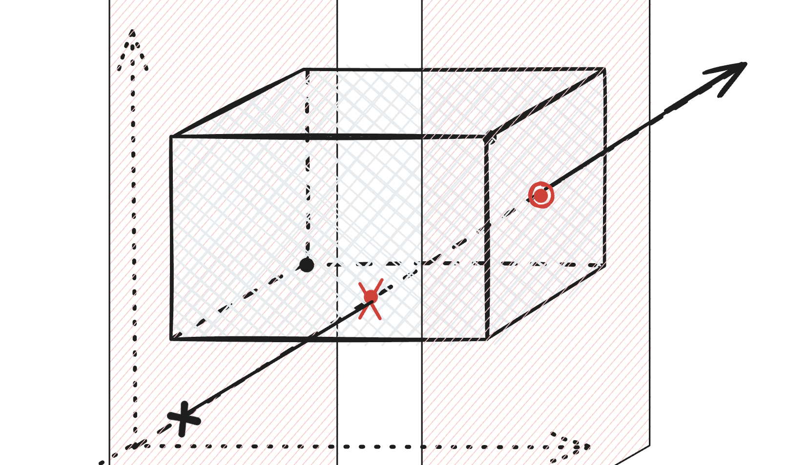
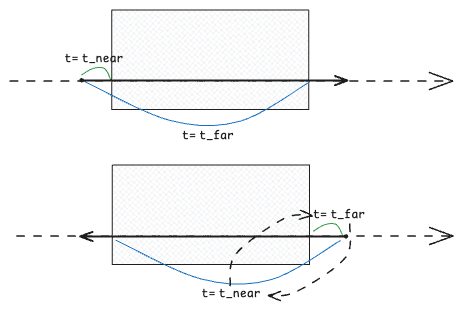

> ! 주의 : TIL 게시글입니다. 다듬지 않고 올리거나 기록을 통째로 복붙했을 수 있는 뒷고기 포스팅입니다.

[지난 글](../path-tracing-03/)에 이어 이번에는 Cube, Cylinder, Torus  
그러니까 직육면체, 원기둥, 도나쓰모양을 만들어봅니다.


핵심은 _충돌 가능한 무언가_ 인 추상클래스 `hittable`만 잘 구현하는 구상클래스를 만들면 된다는 점입니다  
`hit()`만 잘 정의해주면 되겠습니다.

```cpp
class hittable {
public:
  virtual ~hittable() = default;
  virtual bool hit(const ray& r, interval ray_t, hit_record& rec) const = 0;
};
```

# Cube

직육면체 큐브를 정하려면 **중심점과 축별로 세 가지 길이(width, height, depth)** 만 있으면 되겠죠?

```cpp
point3 center
vec3 size(width, height, depth)
```

광선을 쐈는데 직육면체 큐브에 닿은 상황을 생각해봅니다.


우리가 지금 물체를 씬에 표현하는, 물체가 씬에 있다고 주장하는 방식인 _Implicit Function_ 렌더링은 자고로 **영역전개**라고 했습니다.  
따라서 큐브의 영역을 주장해야 하고, 그러니 **큐브의 8개 점 중 최솟값/최댓값만 모은 `box_min, box_max`** 를 먼저 구합니다.

```cpp
const vec3 half_size = size / 2;
const point3 box_min = center - half_size;
const point3 box_max = center + half_size;
```


이제 `hit()`은 다음과 같이 **광선이 영역에 닿았는지 검사**합니다:

- 각 **축별로**, `axis_min` 및 `axis_max`에 언제 닿는지(`t`) 봅니다.
  - 예를 들어, x축에 대해, $ray(t) = o_x + d_x t = x_{min}$(또는 $=x_{max}$)을 만족하는 $t_{near}, t_{far}$ 를 찾습니다.
- 축별로 반복했을 때, $t_{near}$중에서는 가장 큰 것(세 가지 축의 $t_{near}$를 모두 만족한)이 **진입점**이고, 반대로 $t_{far}$중에서는 가장 작은 것이 **이탈점**입니다.



예를들어, x축을 검사하는 과정을 보면  
$x=x_{min}$평면을 광선이 뚫는 지점은 좌측하단에 검은색 X를 그어둔 즈음일건데요  
이것으로는 아직 $x_{min},y_{min},z_{min}$을 모두 만족하는 **진입점**이 아닙니다.  
$y$축으로도 $y=y_{min}$평면을 뚫는 지점, $z$축으로도 $z=z_{min}$평면을 뚫는 지점을 비교해야합니다

코드로는:

```cpp
double t_enter = -infinity;
double t_exit = infinity;
vec3 enter_normal(0, 0, 0);
vec3 exit_normal(0, 0, 0);
```

먼저 *축별로 검사하는 3회의 반복문*을 시작하기 전에,  
**진입점과 이탈점** 그리고 그곳에서의 법선벡터를 담을  
`t_enter, t_exit, enter_normal, exit_normal`을 준비합니다

```cpp
for (int axis = 0; axis < 3; ++axis) {
  // 현재 축 방향으로의 광선 성분
  double origin = r.origin()[axis];
  double direction = r.direction()[axis];

  // 현재 axis 축으로의 방향성 없음
  if (direction == 0.0) {
    // 범위 밖이면 박스에 못들어간다.
    if (origin < box_min[axis] || origin > box_max[axis])
      return false;

    // 범위 안이면 이 축이 t에 관여하지 않는다.
    continue;
  }

  double t_near = (box_min[axis] - origin) / direction;
  double t_far = (box_max[axis] - origin) / direction;

  vec3 near_normal(0, 0, 0);
  vec3 far_normal(0, 0, 0);
  near_normal[axis] = -1; // 축 방향에 반대인게 near plane 법선
  far_normal[axis] = 1;   // 축 방향에 나란한게 far plane 법선

  // 광선 진행방향이 축의 반대방향이면 box_max보다 box_min을 더 나중에 만난다
  // 따라서 t_near가 t_far보다 크고, 이것을 swap해야 t_near가 작은(진입하는)쪽이 된다
  if (t_near > t_far) {
    std::swap(t_near, t_far);
    std::swap(near_normal, far_normal);
  }

  // 가장 늦게 진입하는 축 면이 박스 진입면(진입점)
  if (t_near > t_enter) {
    t_enter = t_near;
    enter_normal = near_normal;
  }

  // 가장 일찍 이탈하는 축 면이 박스 이탈면(이탈점)
  if (t_far < t_exit) {
    t_exit = t_far;
    exit_normal = far_normal;
  }

  if (t_enter > t_exit)
    return false;
}
```



중간에 `t_near > t_far`인 경우에 주의해줍니다  
광선이 축과 반대방향으로 가면 `box_min[axis]`를 만나는 시점인 `t_near`가  
`box_max[axis]`를 만나는 시점인 `t_far`보다 **나중**이기 때문에 `t_near`가 더 큰 상황이 나오는데  
이를 그대로 두면 `t_near`가 해당 축에서의 *진입점*이 아닌 *이탈점*인 상태가 되어버립니다.  
따라서 둘을 교환해줘야겠습니다. (법선벡터도 같이)

참고로 **법선벡터는 광선이 들어가는 방향과는 반대고 나가는 방향과는 나란**합니다.  
법선벡터 또한 **가장 나중에 진입/일찍 이탈하는 축에서의 법선 결과가 선택**되는 것이구요

정리하자면:

- `t_enter`: 각 축 진입 시점(`t`)의 최댓값 = 큐브 밖에서 안으로 hit한 시점(`t`)
- `t_exit`: 각 축 이탈 시점(`t`)의 최솟값 = 큐브 안에서 밖으로 hit한 시점(`t`)
- `t_enter > t_exit`이면 세 조건을 동시에 만족하는 `t`가 없는 것이므로 false

이제 충돌 시 `hit_record`를 채워주는 코드만 넣어주면 끝납니다.

```cpp
//... 작은 구를 흩뿌리기

auto material1 = make_shared<dielectric>(1.5);
world.add(make_shared<cube>(point3(0, 1, 0), vec3(1.0, 1.0, 1.5), material1));

auto material2 = make_shared<lambertian>(color(0.4, 0.2, 0.1));
world.add(make_shared<cube>(point3(-4, 1, 2), vec3(0.8, 1.0, 1.2), material2));

auto material3 = make_shared<metal>(color(0.7, 0.6, 0.5), 0.0);
world.add(make_shared<cube>(point3(4, 1, 0), vec3(0.8, 1.5, 1.0), material3));
```


# Cylinder


원기둥은 파라미터로 **중심점(`center`), 뚜껑 반지름(`radius`), 높이(`height`)** 가 필요합니다  
`hit`은 **옆면과 위아래 두 뚜껑을 나눠서 교차 판정** 하면 편하구요

어떤 좌표 $(x,y,z)$에 대해, 원기둥(원점 중심, y축으로 높이를 갖는) 내부는:  
 $$x^2+z^2\le r^2,\qquad -h/2\le y\le h/2$$  
이런 식입니다

먼저 **옆면**에 대한 교차 판정입니다  
**원기둥의 중심인 `center`** 가 주어졌을 때, 아래와 같이 **광선을 원기둥 로컬공간에서의 광선 원점 `o`, 방향 `d`** 를 얻습니다

```cpp
vec3 o = ray.origin() - center;
vec3 d = ray.direction();
```

이제 **원기둥이 원점에 있는 공간**에서의 광선인 이 $\mathbf{o}+\mathbf{d}t$ 광선을 원기둥 옆면 방정식에 대입합니다:  
$$(o_x+td_x)^2+(o_z+td_z)^2=r^2$$

전개해서 $t$에 대해 정리하면:  
$At^2+Bt+C=0$ $\Rightarrow$ $A=d_x^2+d_z^2$, $B=2(o_xd_x+o_zd_z)$, $C=o_x^2+o_z^2-r^2$

근데 이렇게만 하면 _높이가 무한한 원기둥_ 인거라, 각 해에 대해 다음의 높이 검사를 수행해줍니다:

```cpp
double y = o.y() + t*d.y();
if (-height/2 <= y && y <= height / 2) {
  // 이러면 실제 원기둥 옆면에 닿은 후보임
}
```

그리고 $A==0$이면 *광선이 원기둥 축과 평행*한 것이니 옆면 계산은 건너뜁니다(뚜껑에서 처리될걸요)

**뚜껑의 경우 간단히, 평면 교차 후 원 내부에 속하는지** 확인합니다.

```cpp
double t = (cap_y - o.y()) / d.y();
double x = o.x() + t * d.x();
double z = o.z() + t * d.z();

if (x * x + z * z <= radius * radius) {
  // 뚜껑에 닿은 후보
}
```

이 때, `d.y() == 0`이면 뚜껑과 평행하니 계산을 건너뜁니다(옆면에서 처리될걸요)

코드는

```cpp
bool hit(const ray& r, interval ray_t, hit_record& rec) const override {
  if (radius <= 0 || height <= 0)
    return false;

  const ray local_ray(r.origin() - center, r.direction());
  double closest_t = ray_t.max;
  vec3 outward_normal;

  const bool hit_side = _hit_side_surface(local_ray, ray_t, closest_t, outward_normal);
  const bool hit_cap =
      _hit_caps(local_ray, interval(ray_t.min, closest_t), closest_t, outward_normal);

  if (!hit_side && !hit_cap)
    return false;

  // ... hit_record
  return true;
}
```

앞으로도 _물체가 원점에 위치하는, 물체 로컬공간에서의 광선 구하기_ 는 계속 쓸거라 `local_ray` 유틸이 추가됐습니다
`_hit_side_surface(), _hit_cap()` 두 내부메서드로 나눠서 진행합니다

```cpp
bool _hit_side_surface(const ray& local_ray, interval ray_t, double& hit_t,
                        vec3& outward_normal) const {
  const vec3& o = local_ray.origin();
  const vec3& d = local_ray.direction();
  const double half_height = height / 2;
  const double radius_squared = radius * radius;

  // 옆면:  x² + z² = radius²
  const double a = d.x() * d.x() + d.z() * d.z();
  const double half_b = o.x() * d.x() + o.z() * d.z();
  const double c = o.x() * o.x() + o.z() * o.z() - radius_squared;

  // 원기둥축과 평행하지 않은 광선만 옆면검사.
  if (a > 0.0) {
    const double discriminant = half_b * half_b - a * c;
    if (discriminant >= 0.0) {
      const double sqrt_discriminant = std::sqrt(discriminant);
      // 이차방정식의 두 근 (옆면과 만나는 두 t). root[0]이 먼저 만난 시점, root[1]이 나중
      const double roots[2] = {(-half_b - sqrt_discriminant) / a,
                                (-half_b + sqrt_discriminant) / a};

      for (double t : roots) {
        if (!ray_t.surrounds(t))
          continue;

        const vec3 local_hit = o + t * d;

        // 원기둥의 높이를 벗어남
        if (local_hit.y() < -half_height || local_hit.y() > half_height)
          continue;

        hit_t = t;
        outward_normal = vec3(local_hit.x() / radius, 0, local_hit.z() / radius);
        return true;
      }
    }
  }
  return false;
}
```

옆면 검사는 앞서 말한대로, $x^2+z^2 = r^2$ 안에 속하면서 높이를 벗어나지 않는지 봅니다.

```cpp
bool _hit_caps(const ray& local_ray, interval ray_t, double& hit_t,
                vec3& outward_normal) const {
  const vec3& o = local_ray.origin();
  const vec3& d = local_ray.direction();
  const double half_height = height / 2;
  const double radius_squared = radius * radius;
  bool hit_anything = false;

  // 뚜껑과 평행하지 않은 광선만 검사
  if (d.y() != 0.0) {
    // 아래뚜껑(-1), 윗뚜껑(1)
    for (int sign : {-1, 1}) {
      const double cap_y = sign * half_height;  // 아래/위 뚜껑 높이
      const double t = (cap_y - o.y()) / d.y(); // 뚜껑 평면과 만나는 곳
      if (!ray_t.surrounds(t))
        continue;

      const vec3 local_hit = o + t * d;
      const double distance_squared =
          local_hit.x() * local_hit.x() + local_hit.z() * local_hit.z();

      // 평면과 만난 점이 뚜껑의 원 안에 있어야 함
      if (distance_squared > radius_squared)
        continue;

      hit_t = t;
      outward_normal = vec3(0, sign, 0);
      ray_t.max = t;
      hit_anything = true;
    }
  }

  return hit_anything;
}
```

뚜껑 검사도, 위에서 언급한대로, 윗뚜껑/아래뚜껑 평면과 광선의 교차점이 중심으로부터 `radius` 반경 내에 있는지 검사합니다.


# Torus

y축을 회전축으로 하는 도넛인 Torus의 파라미터는

- `center`: 도넛 전체의 중심(구멍의 중심)
- `major_radius R`: 회전축으로부터 튜브 중심선까지의 거리
- `minor_radius r`: 튜브 자체의 반지름
- 일반적인, 구멍있는 도나쓰를 가정하여 `R > r > 0`이라고 간주합니다.
- 바깥 반지름은 `R+r`이고, 구멍 반지름은 `R-r`입니다. 전체 높이는 `2r`.

<figure>


<figcaption>

출처: [위키피디아 - 원환면](https://ko.wikipedia.org/wiki/%EC%9B%90%ED%99%98%EB%A9%B4)

</figcaption>
</figure>

Torus의 방정식은 원의 방정식에서 출발합니다.

Torus 중심이 원점일 때, Torus 위의 어떤 지점의 y축까지 수평거리 $\rho$는  
$\rho = \sqrt{x^2 + z^2}$

이렇게 두면 튜브 중심선은 $\rho=R$, $y=0$인 곳에 위치합니다.  
이 때 튜브 표면까지의 거리가 $r$이므로:
$$(\sqrt{x^2+z^2}-R)^2 + y^2 = r^2$$

원의 방정식에서 가로를 $\rho - R$, 세로를 $y$로 뒀다고 생각하면 됩니다.  
제곱근을 제거하고 정리하면:

$$(x^2+y^2+z^2+R^2-r^2)^2 - 4R^2(x^2+z^2) = 0$$

이제 여기에 광선 $(x,y,z) = \mathbf{o} + t\mathbf{d}$ 를 대입하여 교차점을 얻을 수 있는데  
어쩌구 저쩌구 계산하면 아무튼 $$At^4 + Bt^3 + Ct^2 + Dt + E = 0$$ 이런식의 **4차식**으로 정리될것으로 보입니다  
이처럼 **Torus를 뚫고 지나가는 광선은 교차점을 최대 4개**가질 수 있습니다.

4차식 푸는 것에 대해서는 아래에서 살펴보고,  
충돌점 `p`를 찾았을 때 그곳에서의 법선벡터는, `p`에서 가장 가까운 튜브 중심선 위의 점 `q`를 잇는 벡터를 찾으면 됩니다.

```cpp
double rho = std::sqrt(p.x() * p.x() + p.z() * p.z());

vec3 q(R * p.x() / rho, 0, R * p.z() / rho);

vec3 outward_normal = unit_vector(p - q);
```

## 4차방정식 해 구하기

몇 가지 방법이 있는 것 같은데 크게:

- 2차방정식 근의 공식처럼 4차방정식도 (복잡하지만) 푸는 공식이 있고 이를 *Ferrari's solution*이라고 한다고 하네요
- 반복법으로 수치적으로 근사하여 해를 찾는 법도 있구요

저는 운좋게 [Don Cross, Fundamentals of Ray Tracing](http://cosinekitty.com/raytrace/)라는 자료에서 **Ferrari 방식의 4차방정식 Solver**를 구현한 코드를 발견해서  
이것을 참고해 아래와 같이 쓸 수 있게 가져왔습니다

```cpp
#include "algebra.h"

auto roots = algebra::solve_quartic_equation(A, B, C, D, E);
```

- `A*t⁴ + B*t³ + C*t² + D*t + E = 0`을 푸는것이고
- 반환형은 `std::vector<double>`, 실수 근을 오름차순으로 반환합니다.
- 중근은 허용오차 `1e-8` 기준으로 합치고
- 실수 근이 없으면 빈 벡터가 반환되고, 음수 근까지 포함하므로 `ray_t` 검사는 별도로 진행해야 합니다.

저도 Ferrari 공식이 뭔지 어떻게 구현된지도 모릅니다.  
대신에 그나마 잘 작동은 하는지 몇 개 단위테스트라도 넣어서 확인했을 뿐이구요  
예를들어:

| 번호 | 테스트 방정식                                                                                | 기대하는 실수해                                                                     |
| ---- | -------------------------------------------------------------------------------------------- | ----------------------------------------------------------------------------------- |
| 1    | $x^4-10x^3+35x^2-50x+24=0$                                                                   | 1, 2, 3, 4                                                                          |
|      | ($=(x-1)(x-2)(x-3)(x-4)=0$)                                                                  |                                                                                     |
| 2    | $x^4-4x^3-7x^2+22x+24=0$                                                                     | −2, −1, 3, 4                                                                        |
|      | $(x+2)(x+1)(x-3)(x-4)=0$                                                                     |                                                                                     |
| 3    | $x^4-1=0$                                                                                    | −1, 1 , 나머지 두 해는 복소수                                                       |
| 4    | $x^4+1=0$                                                                                    | 실수해 없음                                                                         |
| 5    | $x^4-5x^2+10^{-7}x+4=0$                                                                      | 약 −2.0000000166666667, −0.9999999833333333, 1.0000000166666667, 1.9999999833333333 |
| 6    | $x^4 +2.5486754053990341x^3 +20.925256696586143x^2+24.596399841606505x+86.934800121235938=0$ | 실수해 없음                                                                         |

더 많이 있지만 이런 식입니다. 6번 항목은 실제로 렌더링하다가 수치 오류(divide by 0)가 나온 케이스를 집어넣었습니다.

\
\
\
\
이제 교차점을 찾는 코드를 작성할 수 있습니다:

```cpp
bool _find_intersection(const ray& local_ray, interval ray_t, double& hit_t) const {
  const vec3& o = local_ray.origin();
  const vec3& d = local_ray.direction();

  const double R_squared = major_radius * major_radius;
  const double r_squared = minor_radius * minor_radius;

  // p⋅p + R² - r² = a*t² + b*t + c
  const double a = dot(d, d);
  const double b = 2 * dot(o, d);
  const double c = dot(o, o) + R_squared - r_squared;

  if (a == 0.0)
    return false;

  // rho² = p.x² + p.z² = u*t² + v*t + w
  const double u = d.x() * d.x() + d.z() * d.z();
  const double v = 2 * (o.x() * d.x() + o.z() * d.z());
  const double w = o.x() * o.x() + o.z() * o.z();

  // (x² + y² + z² + R² - r²)² - 4R²(x² + z²) = 0
  // => (a*t² + b*t + c)² - 4R²(u*t² + v*t + w) = 0
  const double A = a * a;
  const double B = 2 * a * b;
  const double C = b * b + 2 * a * c - 4 * R_squared * u;
  const double D = 2 * b * c - 4 * R_squared * v;
  const double E = c * c - 4 * R_squared * w;

  const auto roots = algebra::solve_quartic_equation(A, B, C, D, E);

  // 오름차순으로 반환되므로 첫 유효한 근이 가장 가까운 t임
  for (double t : roots) {
    if (ray_t.surrounds(t)) {
      hit_t = t;
      return true;
    }
  }

  return false;
}
```

이것을 이용하여 `torus.hit()`을 작성합니다.

```cpp
bool hit(const ray& r, interval ray_t, hit_record& rec) const override {
  // 구멍이 있는 일반적인 torus만 다룬다.
  if (!(major_radius > minor_radius && minor_radius > 0))
    return false;

  // 1. 월드 공간 광선을 오브젝트 공간으로
  const ray local_ray(r.origin() - center, r.direction());

  // 2. 토러스 교차 계산 => 허용 범위 안의 가장 가까운 교차점 탐색
  double hit_t;
  if (!_find_intersection(local_ray, ray_t, hit_t))
    return false;

  // 3. 법선 계산 및 월드공간 기준 충돌 정보 저장
  const point3 p = local_ray.at(hit_t);
  const double radial_distance = std::sqrt(p.x() * p.x() + p.z() * p.z()); // rho
  const point3 tube_center(major_radius * p.x() / radial_distance, 0,
                            major_radius * p.z() / radial_distance);

  const vec3 outward_normal = unit_vector(p - tube_center);

  // ... hit_record

  return true;
}
```

이제 Torus가 잘 구현됐는지 확인해봅니다.

```cpp
auto material4 = make_shared<dielectric>(1.5, color(1.0, 0.5, 1.5));
world.add(make_shared<torus>(point3(0, 1, 0), 1.0, 0.25, material4));

auto material5 = make_shared<lambertian>(color(0.4, 0.2, 0.1));
world.add(make_shared<torus>(point3(-4, 1, 0), 1.0, 0.75, material5));

auto material6 = make_shared<metal>(color(0.7, 0.6, 0.5), 0.0);
world.add(make_shared<torus>(point3(4, 1, 0), 1.0, 0.5, material6));
```


---

\
4가지 모양과 3가지 재질이 되었으니 모두 한 눈에 볼 수 있는 장면을 한번 만들어보면


# 회전/축소확대 변환 구현하기

지금까지는 저 편할대로 구현했는데요  
큐브는 면들이 다 축을 따라서 형성되고.. 원기둥은 항상 높이축이 y축이고.. 토러스도 항상 뚫린축이 y축이고..  
구는 회전한다는 개념이 별로 없으니까 몰랐는데, 여러 모양들을 만들고 나니까 **회전**을 시키고 싶은 충동이 듭니다.  
회전시키는 김에 **축소확대 변환**도 있으면 재밌을 것 같구요

세 가지가 필요할 것 같아요:

- `transformed_hittable` 래퍼클래스
- 작은 `transform` 타입
- `quaternion` 으로 회전을 표현하기

이것으로 사실상 **오브젝트 공간(Object Space)**을 구현하는 것처럼 됩니다.

## 1. 변환 가능한 hittable 래퍼클래스

기존 물체들은 다 `hittable`을 구현하는 클래스였는데요  
`hittable` 자체를 *변환 가능*이라고 하기보단, 래퍼클래스를 두는게 나아보입니다.

```cpp
class transformed_hittable : public hittable {
  shared_ptr<hittable> object;
  transform local_to_parent;

public:
  bool hit(const ray& r, interval ray_t, hit_record& rec) const override;
}
```

래퍼클래스를 두는 이유는

- `hittable`을 직접 수정하려면 모든 도형의 `hit()`에서 변환을 적용해야 하고, 이것을 추상클래스 단위로 강제하려면 `hit_local()`같은 인터페이스를 추가해야할 것 같아요
- `hittable_list`도 감쌀 수 있어 여러 도형을 함께 회전하거나 스케일할 수도 있습니다.

## 2. transform 클래스

translation, rotation, scale만 저장합니다.

```cpp
class transform {
  vec3 translation;        // 기본값 (0,0,0)
  quaternion rotation;     // 기본값 단위 쿼터니언
  vec3 scale;              // 기본값 (1,1,1)

public:
  point3 apply_point(const point3&) const;
  vec3 apply_vector(const vec3&) const;
  vec3 apply_normal(const vec3&) const;

  point3 inverse_point(const point3&) const;
  vec3 inverse_vector(const vec3&) const;
}
```

**변환 순서는 로컬 축으로 scale → rotation → translation으로 고정**합니다.

- 부모 공간 점 = `rotate(q, scale * local_point) + translation`
- 부모 공간 벡터 = `rotate(q, scale * local_vector)`
- 로컬 공간 점 = `rotate(inverse(q), parent_point - translation) / scale`
- 로컬 공간 벡터 = `rotate(inverse(q), parent_vector) / scale`
- 부모 공간 법선 = `normalize(rotate(q, local_normal / scale))`

법선벡터의 경우, 벡터에 적용하는 선형변환을 그대로 적용하면 비균일 축소확대에서 법선벡터로서의 수직성질을 잃어버립니다.  
대신에 **법선벡터는 선형변환의 역전치행렬**(ex. 선형변환 $A = RS$일 때, $A^{-T}$)을 적용해줘야 합니다.

- 점의 변환 순서는 위에서도 보듯이 스케일->회전->평행이동이므로, $P' = RSP + T$, 여기서 선형변환 $A=RS$
- 법선에 적용해야 하는 선형변환 행렬은 $A^{-T} = (A^{-1})^T = (S^{-1}R^{-1})^T = (R^{-1})^T(S^{-1})^T$
- 회전행렬의 경우 $(R^{-1})^T = R$이고, 스케일 행렬은 대각행렬이니 $(S^{-1})^T = S^{-1}$
- 따라서 $A^{-T} = RS^{-1}$

이렇게 되어 "부모 공간 법선 구하기"는 `normalize(rotate(q, local_normal / scale))`입니다.

## 3. Quaternion

회전을 위해 쿼터니언은 최소한으로 시작합니다.  
지금은 제가 가진게 `vec3`클래스밖에 없어서, 별도로 `double w, vec3 xyz` 이렇게 실수부 허수부를 관리해봅니다.  
쿼터니언 클래스가 가지는 기능은:

- identity 기본 생성자, `axis`+`angle`로 생성
- 정규화 및 conjugate를 통한 단위 quaternion 역회전
- quaternion 곱으로 회전 합성
- `rotate(vec3)`를 지원합니다.

기본 뼈대는:

```cpp
class quaternion {
public:
  quaternion() : w(1), v(0, 0, 0) {}

private:
  double w;
  vec3 v;

  quaternion(double w, const vec3& v) : w(w), v(v) {}
};
```

회전하지 않는 단위 쿼터니언은 `(1,0,0,0)`입니다.  
값 생성자를 `private`으로 두어 임의의 쿼터니언을 만들지 않도록 했습니다.

회전을 나타내는 쿼터니언은 회전축 $\mathbf{u}$, 회전각 $\theta$에 대해:  
$$(cos(\frac{\theta}{2}), sin(\frac{\theta}{2})\mathbf{u})$$

```cpp
static quaternion from_axis_angle(const vec3& axis, double radians) {
    if (axis.length_squared() == 0)
      throw std::invalid_argument("rotation axis must be nonzero");

    const double half_theta = radians / 2;

    return quaternion(std::cos(half_theta), unit_vector(axis)*std::sin(half_theta));
  }
```

이런식으로 **회전축과 회전각을 주면 회전 쿼터니언을 생성**해주는 스태틱 메서드(팩토리??)를 노출합니다.

**역회전**의 경우, 항상 단위 쿼터니언을 유지한다는 전제가 있으면 그냥 conjugate를 취하면 되는데:

```cpp
quaternion inverse() const { return quaternion(w, -v); }
```

**벡터 회전**은 `vec3 p`와 쿼터니언 `q`에 대해 $\mathbf{q}\cdot (0, \mathbf{p})\cdot \mathbf{q}^{-1}$이고  
임시 쿼터니언을 만들지 않고 하려면

- 전개:  
  $$\mathbf qP\mathbf q^{-1}=(w,\mathbf v)(0,\mathbf p)(w,-\mathbf v)=\left(0,\;(w^2-\|\mathbf v\|^2)\mathbf p+2(\mathbf v\cdot\mathbf p)\mathbf v+2w(\mathbf v\times\mathbf p)\right)$$
- 단위 쿼터니언 $w^2+\|\mathbf v\|^2=1$ 및 $\mathbf v\times(\mathbf v\times\mathbf p)=\mathbf v(\mathbf v\cdot\mathbf p)-\|\mathbf v\|^2\mathbf p$ 적용:  
  $$(w^2-\|\mathbf v\|^2)\mathbf p+2(\mathbf v\cdot\mathbf p)\mathbf v+2w(\mathbf v\times\mathbf p)=\mathbf p+2w(\mathbf v\times\mathbf p)+2\mathbf v\times(\mathbf v\times\mathbf p)=\mathbf p+w\mathbf t+\mathbf v\times\mathbf t,\quad \mathbf t=2(\mathbf v\times\mathbf p)$$

```cpp
vec3 rotate(const vec3& p) const {
  const vec3 t = 2 * cross(v, p);
  return p + w * t + cross(v, t);
}
```

마지막으로, **회전 합성**을 위한 쿼터니언끼리의 곱은:  
두 쿼터니언 $q_1​=(w_1​,\mathbf v_1​),q_2​=(w_2​,\mathbf v_2​)$에 대해  
$$q_1​q_2​=(w_1​w_2​−\mathbf v_1​\cdot \mathbf v_2​, \ w_1 \mathbf {v}_2 ​ +w_2\mathbf{​v}_1​ + \mathbf v_1​×\mathbf v_2​)​$$

```cpp
quaternion operator*(const quaternion& rhs) const {
    const double result_w = w * rhs.w - dot(v, rhs.v);
    const vec3 result_v =
        w * rhs.v + rhs.w * v + cross(v, rhs.v);

    const double length =
        std::sqrt(result_w * result_w + result_v.length_squared());

    return quaternion(result_w / length, result_v / length);
  }
```

## 4. transformed_hittable 완성하기

몇 가지 규칙을 가정하고 넘어가자면

- 지금은 **여러 transform을 하나의 $\mathbf{TRS}$로 병합하지 않습니다**. 대신에 래퍼(`transformed_hittable`)를 여러 개 중첩하면 그런 효과를 낼 수 있습니다.
- 회전/스케일 기준점은 **로컬 원점**입니다. 원하는 동작과 달라질 수 있으니 이제 오브젝트에 직접 `center`를 지정하는 대신 `transform`에서 평행이동시켜서 위치를 정합니다.

뼈대는:

```cpp
class transformed_hittable : public hittable {
public:
  transformed_hittable(std::shared_ptr<hittable> object, const transform& local_to_parent)
      : object(object), local_to_parent(local_to_parent) {
    if (!object)
      throw std::invalid_argument("object must not be null");
  }

private:
  std::shared_ptr<hittable> object;
  transform local_to_parent;
};
```

`transformed_hittable.hit()`은, **광선을 local공간으로 변환하고, 이것으로 object충돌검사를 진행하고, record는 부모 공간 기준으로 기록**합니다.

```cpp
bool hit(const ray& r, interval ray_t, hit_record& rec) const override {
  const ray local_ray(local_to_parent.inverse_point(r.origin()),
                      local_to_parent.inverse_vector(r.direction()));

  hit_record local_rec;
  if (!object->hit(local_ray, ray_t, local_rec))
    return false;

  // 기존 rec.normal은 이미 ray를 향하도록 뒤집혔으므로,
  // 바깥쪽 법선을 복원한 뒤 변환한다.
  const vec3 local_outward =
    local_rec.front_face ? local_rec.normal : -local_rec.normal;

  rec = local_rec;
  rec.p = r.at(rec.t);
  rec.set_face_normal(r, local_to_parent.apply_normal(local_outward));

  return true;
}
```

이런 식인데, **변환할 ray 방향은 정규화하지 않습니다**.  
우리는 계속 (`ray_t` 구간검사에서)`t`의 크기를 비교하는 중이라, 부모/자식 공간 간에 `t`는 유지되었으면 좋겠어요  
또한 부모/자식 공간 간에 `t`가 유지되니 `rec.p = r.at(local_rec.t)`처럼 그대로 `t`를 써서 부모 공간 교차점을 얻어낼 수 있습니다.

또한 `object->hit`에서 `rec.normal`을 받아오고 나면, ray를 거스르는 쪽이도록 뒤집혀있습니다.  
로컬공간에서의 바깥으로 나가는 법선벡터 `local_outward`를 얻으려면, 지금이 뒷면이면 일단 뒤집어줍니다.  
그래야 나중에 또 나오는 `rec.set_face_normal()`에서 "법선벡터가 광선 반대쪽이니까 `front_face=true`다"라고 잘못 판단하는 일이 없습니다.

---

```cpp
world.add(make_shared<transformed_hittable>(
  object, transform(center, rotation, scale)));
```

처음에 회전/축소변환 없이 만들었던 씬에 무작위 변환을 추가해봤습니다


