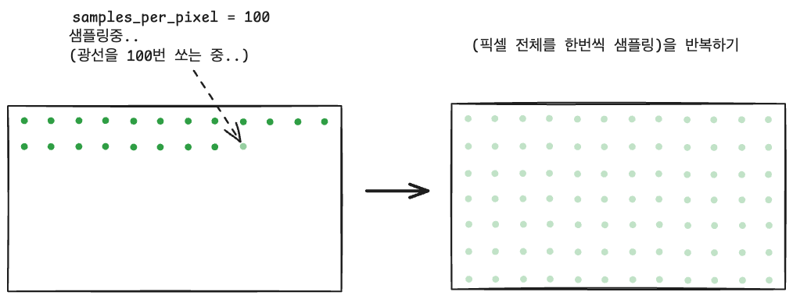
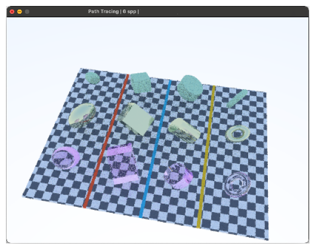
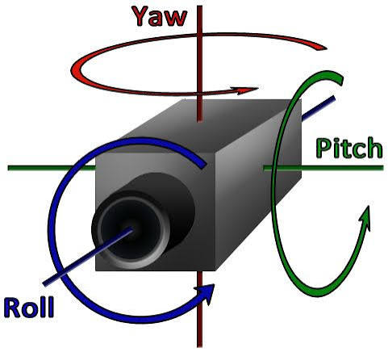
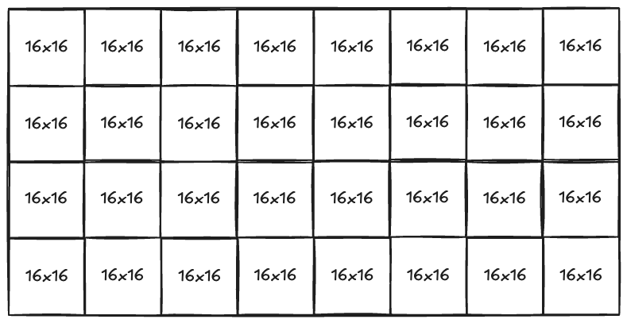

> ! 주의 : TIL 게시글입니다. 다듬지 않고 올리거나 기록을 통째로 복붙했을 수 있는 뒷고기 포스팅입니다.

[이전 글](../path-tracing-04/)까지 해서 Path Tracing으로 여러 재질을, 여러 모양을 씬에 추가해봤는데요  
지금까지는 카메라가 고정이고, 전체 픽셀을 `samples_per_pixel`만큼 샘플링하고 이미지가 완성될 때까지 손가락빨면서 기다리는 형태였습니다.  
그리고 슬슬 연산량이 많아져서 렌더링 시 샘플링 숫자와 해상도에 따라 거의 몇분씩 기다릴 때도 있었고요

이제 욕심이 나는 것은 **카메라를 움직이면서 장면 내부를 돌아다니고 싶다**는 것입니다.  
다행히도 시리즈 1편에서 카메라 공간에 대한 준비를 정성들여 해놨다는 점은 있는데  
그 외에는 갈길이 멉니다.

# 점진적인 렌더링

당장 문제는 지금 렌더링하는 구조가 **픽셀 하나하나 순차적으로 완성하여 버퍼에 담고 한번에 이미지를 렌더**하는 구조라는 것입니다



좌측처럼요. 전체 픽셀에 대해 샘플링 100번씩 다 하고나서 이미지가 완성되기를 기다릴 수밖에 없습니다. 중간 결과물을 볼 수도 없구요  
일단 카메라를 움직이면서 장면의 렌더링이 진행되는(점점 샘플링이 누적되는 것을) 것을 보려면 우측처럼 만들어야 합니다.  
**전체 픽셀에 대해 한 번씩 샘플링하는 반복**으로 바꿔서, 중간 결과물을 (충분히 샘플링되지 못해서 사실적인 결과가 아직 안나왔어도) 보고 싶습니다.

지금 코드 구조는 다시말해서

```cpp
for (각 픽셀) {
      for (목표 샘플 수) {
          // ray_color()로 경로 하나를 끝까지 추적
      }
      // 이 픽셀의 최종 색을 파일에 출력
  }
```

이런 식인데 이제:

```cpp
while(렌더링중) {
  for (각 픽셀) {
    ray r = get_ray(x, y);
    누적_색상[x, y] += ray_color(r, max_depth, world);
  }
  ++누적_샘플_수;
}
```

이 `while(렌더링중)`을 흔한 _창을 띄워서 렌더링루프를 돌리는 GUI 툴_ 을 사용한다 치면

```cpp
while (창이 열려 있음) {
  입력_처리();

  if (카메라가_변했음) {
    카메라_기저_갱신();
    누적_버퍼_초기화();
    누적_샘플_수 = 0;
  }

  for (각 픽셀) {
    ray r = get_ray(x, y);
    누적_색상[x, y] += ray_color(r, max_depth, world);
  }
  ++누적_샘플_수;

  // 평균을 구한 뒤, 표시용으로만 감마 보정
  화면에_표시(누적_색상 / 누적_샘플_수);
}
```

이렇게요

**Path Tracing**이라는 것에 대해 다시 생각해보면 **많은 독립시행(광선쏘기)을 쌓아서 점점 어딘가로 수렴**하는 과정입니다.  
그럼 독립시행을 한 픽셀에 대해 100번 다 하면서 지나가고 평균내나,  
전체 픽셀에 대해 한 번씩 독립시행하면서 지나간 뒤 지금 독립시행한만큼 평균내나,  
별 상관 없네요?

구현할 것은 이정도인 것 같아요:
**선형 색상의 합**과 **총 샘플 수**를 유지해서, 표시할 때만 한 번 나누고(평균내기)+감마보정

## 렌더링 구조 개편하기

```cpp
// camera.h
private:
// double pixel_samples_scale; <- 제거
std::vector<color> accumulated_colors;
int accumulated_samples = 0;
```

기존 `pixel_samples_scale` private 변수를 제거하고, 두 개 변수를 추가합니다.

- **선형 색상의 합**(감마보정 전 색상 합)
  - 1차원 `vector`에 일렬로.
  - `(i,j)`픽셀은 `j*image_width+i`에 들어간다.
- **누적 샘플 수(`accumulated_samples`)**

이제 public 메서드로 이걸 추가하고

```cpp
void reset_accumulation() {
  initialize();

  accumulated_colors.assign(
    static_cast<std::size_t>(image_width) * image_height,
    color(0, 0, 0)
  );
  accumulated_samples = 0;
}

void render_pass(const hittable& world) {
  for (int j = 0; j < image_height; ++j) {
    for (int i = 0; i < image_width; ++i) {
      const ray r = get_ray(i, j);
      const std::size_t index = static_cast<std::size_t>(j) * image_width + i;

      accumulated_colors[index] += ray_color(r, max_depth, world);
    }
  }
  ++accumulated_samples;
}

color averaged_color(int i, int j) const {
  if (accumulated_samples == 0) return color(0,0,0);

  const std::size_t index = static_cast<std::size_t>(j) * image_width + i;

  return accumulated_colors[index] / accumulated_samples;
}
```

- `reset_accumulation()`에서 카메라 파라미터 초기화 및 현재까지 샘플링하고 합산했던 것들을 지웁니다.
- `render_pass(world)`에서 **전체 픽셀에 대해 한 번 Ray-Trace 샘플링** 하고 그 결과를 누적합니다.
- `averaged_color`는 일차원벡터에 저장된 `i,j`번째 픽셀 색상을 가져와 평균낸 값을 반환합니다.

반드시 `reset_accumulation() -> render_pass(world)` 순서를 지키는 것에 유의합니다.

이제 이것을 모두 아우르는 `render_progressive` 메서드를 만듭니다:

```cpp
void render_progressive(const hittable& world) {
  reset_accumulation();

  for (int sample = 0; sample < samples_per_pixel; ++sample) {
    render_pass(world);

    std::clog
    << "\rSamples accumulated: "
    << sample_count()
    << " / "
    << samples_per_pixel
    << ' '
    << std::flush;
  }

  std::cout << "P3\n" << image_width << ' ' << image_height << "\n255\n";

  for (int j = 0; j < image_height; ++j) {
    for (int i = 0; i < image_width; ++i) {
      write_color(std::cout, averaged_color(i, j));
    }
  }

  std::clog << "\rDone.                              \n";
}
```

## SDL2로 뷰어 만들기

> SDL(Simple DirectMedia Layer)은 그래픽, 오디오, 입력 장치 제어를 추상화하여 크로스플랫폼 멀티미디어 앱과 게임을 쉽게 만들 수 있게 해주는 C 기반 오픈소스 라이브러리입니다

처음봤는데 일단 창에 그림을 그려낼 적당한 라이브러리가 필요해서 가져왔습니다.  
설치는 AI시키면 알아서 설치랑은 해주고요. 인간은 중요한 것에 집중합시다.

SDL2를 사용해 그래픽 뷰어를 띄우려면  
그려낼 이미지 정보를 담는 표시용 픽셀 저장공간인 `texture`도 준비하고..  
그림을 그려줄 `renderer`도 생성하고.. 그림을 올릴 `window`도 준비하고..  
뭐가 많은데 그냥

```cpp
class viewer {
public:
  void run(camera& cam, const hittable& world) {
    cam.reset_accumulation();

    // ... SDL2 관련 초기화 코드들

    /** 여기서부터 메인 루프를 시작하기 */
    }
  }

private:
  // 여기에 화면 변환에 필요한 함수들을 쓴다.
};
```

메인 루프를 시작하기 전에, 필요한 내부메서드를 씁시다.

```cpp
private:
  /** 선형색상(누적버퍼)
   *  --> 표시용 텍스처 데이터타입(RGBA 4바이트 per pixel)
   */
  static Uint8 to_byte(double linear_component) {
    const double gamma_component =
      linear_to_gamma(linear_component);

    const interval intensity(0.0, 0.999);

    return static_cast<Uint8>(
      256 * intensity.clamp(gamma_component)
    );
  }

  static void update_texture(SDL_Texture* texture, const camera& cam) {
    void* pixels = nullptr;
    int pitch = 0;

    if (SDL_LockTexture(texture, nullptr, &pixels, &pitch) != 0)
      throw std::runtime_error(SDL_GetError());

    for (int j = 0; j < cam.height(); ++j) {
      auto* row = static_cast<Uint8*>(pixels) + static_cast<std::size_t>(j) * pitch;
      for (int i = 0; i < cam.image_width; ++i) {
        color c = cam.averaged_color(i, j);
        auto* pixel = row + 4 * i;

        pixel[0] = to_byte(c.x());
        pixel[1] = to_byte(c.y());
        pixel[2] = to_byte(c.z());
        pixel[3] = 255;
      }
    }

    SDL_UnlockTexture(texture);
  }
```

- `to_byte(linear_component)`: `0.25`같이 0~1범위의 double 선형색상이 들어오면: 감마보정 -> 범위 clamp -> `Uint8`범위로 반환해줍니다.
  - 사실 지금까지 몰래 [감마보정](https://en.wikipedia.org/wiki/Gamma_correction)하고있었고, 가장 단순하게 _linear space -> gamma space 넘어갈 때 `sqrt`를 적용_ 하는 근사를 사용했습니다.
  - 그리고 색상을 `Uint8` 타입의 0~255 범위로 넘겨줘야 해서 범위변환해줍니다.
- `update_texture(texture, cam)`
  - `texture`는 SDL에서 _현재 이미지를 담는 표시용 픽셀 저장 공간_ 정도의 친구입니다.
  - `pitch`는 *한 행의 시작 주소에서 다음 행 시작 주소까지*의 바이트 간격입니다. (`SDL_Locktexture()`로부터 받아옵니다.)

ex. `width=3, pitch=16`일 때:

```
행 0: [RGBA][RGBA][RGBA][여유 4바이트]
행 1: [RGBA][RGBA][RGBA][여유 4바이트]
행 2: [RGBA][RGBA][RGBA][여유 4바이트]
```

이제 **메인 루프**는:

```cpp
bool running = true;

while (running) {
  SDL_Event event;

  // 종료조건
  while (SDL_PollEvent(&event)) {
	if (event.type == SDL_QUIT)
	  running = false;
	if (event.type == SDL_KEYDOWN && event.key.keysym.sym == SDLK_ESCAPE)
	  running = false;
  }

  if (!running)
	break;

  // 1. 전체 픽셀에 대해 샘플링 한 번 진행
  cam.render_pass(world);

  // 2. 현재까지의 평균을 표시용 texture에 기록
  update_texture(texture.get(), cam);

  // 3. 출력할 화면 Clear하고
  if (SDL_RenderClear(renderer.get()) != 0)
	throw std::runtime_error(SDL_GetError());
  // 4. 출력할 화면 준비
  if (SDL_RenderCopy(renderer.get(), texture.get(), nullptr, nullptr) != 0)
	throw std::runtime_error(SDL_GetError());
  // 5. 준비된 화면을 window에 표시
  SDL_RenderPresent(renderer.get());

  const std::string title =
	  "Progressive Path Tracing | " + std::to_string(cam.sample_count()) + " spp";

  SDL_SetWindowTitle(window.get(), title.c_str());
}
```



이제 이렇게 창을 띄울 수 있게 됐는데요  
아직은 한 패스 한 패스 샘플링할 때마다 굉장히 오래걸립니다.  
이미지에 보이듯이 굉장히 noisy하게 시작하구요  
그래도 noisy하다가 샘플링할수록 점점 걷히는 맛이 재밌습니다

# 키 입력으로 카메라 조작하기

카메라의 조작은 이렇게 합니다

- **이동**: **눈과 바라보는 곳을 함께** 옮깁니다.
  - `cam.EYE += movement; cam.AT += movement` => 시선방향 고정
- **회전**: 눈은 그대로 두고 **바라보는 방향만 변경** 합니다.
  - `cam.AT = cam.EYE + target_distance * forward;`

```cpp

static bool handle_camera_key(camera& cam, SDL_Keycode key) {
  const double move_step = 1;
  const double turn_step = degrees_to_radians(5.0);
  const double pitch_limit = degrees_to_radians(85.0);

  const double target_distance = (cam.AT - cam.EYE).length();

  vec3 forward = unit_vector(cam.AT - cam.EYE);       /** 시선벡터 */
  const vec3 up = unit_vector(cam.UP);                /** 카메라 위쪽 벡터 */
  const vec3 right = unit_vector(cross(forward, up)); /** 카메라 오른쪽 벡터 */

  vec3 movement(0, 0, 0);
  double yaw = 0;
  double pitch = 0;

  switch (key) {

  case SDLK_w: movement = move_step * forward; break;
  case SDLK_s: movement = -move_step * forward; break;
  case SDLK_a: movement = -move_step * right; break;
  case SDLK_d: movement = move_step * right; break;
  case SDLK_q: movement = -move_step * up; break;
  case SDLK_e: movement = move_step * up; break;

  case SDLK_LEFT: yaw = turn_step; break;
  case SDLK_RIGHT: yaw = -turn_step; break;
  case SDLK_UP: pitch = turn_step; break;
  case SDLK_DOWN: pitch = -turn_step; break;

  default: return false;
  }
  if (movement.length_squared() > 0) {
    cam.EYE += movement;
    cam.AT += movement;
    return true;
  }
  if (yaw != 0) { // yaw는 좌우 (고개를 젓듯이)
    forward = quaternion::from_axis_angle(up, yaw).rotate(forward);
  }
  if (pitch != 0) { // pitch는 상하 (고개를 끄덕하듯이)
    // UP과 시선이 평행해지는 일을 방지하기
    const double current_pitch = std::asin(interval(-1.0, 1.0).clamp(dot(forward, up)));

    const double next_pitch =
        interval(-pitch_limit, pitch_limit).clamp(current_pitch + pitch);
    const double actual_pitch = next_pitch - current_pitch;

    if (std::abs(actual_pitch) < 1e-10)
      return false;
    forward = quaternion::from_axis_angle(right, actual_pitch).rotate(forward);
  }
  cam.AT = cam.EYE + target_distance * unit_vector(forward);
  return true;
}
```



Yaw Pitch Roll 아시죠?

- 좌,우 화살표가 `yaw` (카메라 `up`축으로 좌우로 회전)
- 위,아래 화살표가 `pitch` (카메라 `right`축으로 위아래 회전)
- WASDQE는 각 축으로 평행이동

이제 `viewer.run(cam, world)`에서 `while(running)` 메인루프 내에서:

```cpp
while (running) {
  SDL_Event event;
  bool camera_changed = false;

  while (SDL_PollEvent(&event)) {
    if (event.type == SDL_QUIT)
      running = false;
    if (event.type == SDL_KEYDOWN) {
      if (event.key.keysym.sym == SDLK_ESCAPE) running=false;
      else if (handle_camera_key(cam, event.key.keysym.sym)) camera_changed = true;
    }
  }

  if (!running) break;
  if (camera_changed) cam.reset_accumulation();
```

이렇게 이벤트를 듣고있으면 되겠습니다.  
아차, 카메라가 업데이트되었으면 `reset_accumulation()`으로 처음부터 다시 화면을 그리라고 해야합니다

# 성능 Profiling하기

**총 시간** 및 **측정횟수**를 저장할게요. **하나의 `render_pass`당 쓰는 평균시간**을 알아보려구요  
아까 한 번 `render_pass`를 진행하는 속도가 꽤 느려서 노이즈가 느리게 걷힌다고 했었는데  
최적화를 적용하고서 `render_pass`가 빨리 진행되는지, 얼마나 개선되었는지 직접 보려구요

시간 간격 측정용 시계로 `std::chrono::stead_clock`을 사용할 수 있습니다.

```cpp
 /** 여기서부터 메인 루프 */
bool running = true;

using clock = std::chrono::steady_clock;

double total_render_ms = 0.0;
std::size_t measured_passes = 0;

while (running) {
  ...
```

- 카메라가 변하면 측정값을 초기화하고
- `render_pass(world)` 주변에 시간 측정을 감싸줍니다.

```cpp
if (camera_changed) {
	cam.reset_accumulation();

	total_render_ms = 0.0;
	measured_passes = 0;
}

// 1. 전체 픽셀에 대해 샘플링 한 번 진행
const auto start = clock::now();
cam.render_pass(world);
const auto end = clock::now();
const double render_ms = std::chrono::duration<double, std::milli>(
    end - start
  ).count();
total_render_ms += render_ms;
++measured_passes;
const double average_ms = total_render_ms / measured_passes;
```

이제 값을 출력합니다. *타이틀*에 보여주고, *50회 샘플링 누적마다 콘솔에 로그*를 찍어줍니다.

```cpp
  std::ostringstream title;
  title << std::fixed << std::setprecision(2)
		<< "Path Tracing | " + std::to_string(cam.sample_count()) + " spp"
		<< " | Last: " << render_ms << " ms"
		<< " | Avg: " << average_ms << " ms/pass";

  SDL_SetWindowTitle(window.get(), title.str().c_str());

  if (measured_passes % 50 == 0) {
	std::clog << std::fixed << std::setprecision(2)
    << "[render] " << cam.image_width << 'x' << cam.height()
    << ", depth=" << cam.max_depth
    << ", passes=" << measured_passes << ", total=" << total_render_ms << " ms"
    << ", avg=" << average_ms << " ms/pass" << '\n';
  }
```

처음 이거 구현하고나서 이렇게 찍혔습니다:

```
[render] 400x300, depth=20, passes=50, total=14401.21 ms, avg=288.02 ms/pass
[render] 400x300, depth=20, passes=50, total=15125.91 ms, avg=302.52 ms/pass
[render] 400x300, depth=20, passes=50, total=15157.85 ms, avg=303.16 ms/pass
[render] 400x300, depth=20, passes=100, total=30255.38 ms, avg=302.55 ms/pas
```

```
[render] 240x180, depth=20, passes=50, total=5203.23 ms, avg=104.06 ms/pass
[render] 240x180, depth=20, passes=50, total=5464.21 ms, avg=109.28 ms/pass
[render] 240x180, depth=20, passes=50, total=5445.33 ms, avg=108.91 ms/pass
[render] 240x180, depth=20, passes=50, total=5762.10 ms, avg=115.24 ms/pass
[render] 240x180, depth=20, passes=100, total=11547.40 ms, avg=115.47 ms/pass
```

400x300같이 작은 이미지에서도 한 번 샘플링하는 데 평균 0.3초가 걸립니다;;

# 최적화하기

가성비 있어보이는 것으로 몇 가지 해봤습니다.

## Torus 충돌연산 시 Bounding Sphere 필터링

저번에 봤듯이 Torus `hit()`연산은 4차방정식 풀이를 수반하는데  
문제는 이거 한 번 푸는데 굉장히 비쌉니다. 가능한한 생략하면 좋겠어요

Bounding Sphere와 광선은:

- Torus의 큰 반지름 $R$, 작은 반지름 $r$에 대해 바운딩 구 반지름 $B=R+r$이면 될 것 같아요
  - 수치적 오차를 약간 허용하기 위해 아주 작은 padding도 넣겠습니다
- $\mathbf{o,d}$: Torus 로컬 공간 기준으로 광선의 시작점 및 방향입니다.
- 광선의 매개변수 $t$

광선이 구 내부에서 시작할 수 있다는 점에 주의하는 것이 좋은데  
`t_enter = -3, t_exit = 3`과 같이, 나가는 점만 양수로 주어질 것 같아요  
지금은 **정확한 Torus가 아니라 Bounding Sphere를 검사**하는 중이라서 굉장히 보수적으로 잡아야하기 때문에  
`ray_t`에 조금이라도 발을 걸치고 있다면 다음으로 넘어가야 합니다.

예를 들어 `ray_t`가 `[0.001, 1]`이어도

```
구 내부 구간: [-3 ----------------------- 3]
검사할 구간:          [0.001 --- 1 ]
```

이 구간에 조금이라도 걸칠 수 있으니 정밀검사를 하기로 합니다.  
Sphere를 만들 때 했었지만 또 해보자면

판별식 및 근의공식 세우기:

- 구 중심이 원점이면 표면 방정식은 $p\cdot p = B^2$
- 광선 대입: $(o+td)\cdot(o+td)=B^2$
- 전개해서: $(d\cdot d)t^2+2(o\cdot d)t+(o\cdot o-B^2)=0$
- 그럼 이차방정식 근의공식을 풀기 위해, $a=d\cdot d, \ \ b=2(o\cdot d),\ \ c=o\cdot o-B^2$
- 짝수 일차항에 대한 근의공식으로 풀기 위해 $h=o\cdot d,\qquad b=2h$ 로 두면:
- 방정식은 $at^2+2ht+c=0$
- 근의공식에 대입하면 $t=\frac{-2h\pm\sqrt{4h^2-4ac}}{2a}=\frac{-h\pm\sqrt{h^2-ac}}{a}$

이대로 Bounding Sphere 검사 내부메서드를 추가해줍니다.

```cpp
bool _overlaps_bounding_sphere(const ray& local_ray, interval ray_t) const {
  const vec3& o = local_ray.origin();
  const vec3& d = local_ray.direction();

  // 경계보다 구를 아주 약간 크게 잡는다 (오차에 의한 탈락 최소화)
  const double torus_radius = major_radius + minor_radius;
  const double padding = 1e-8 * std::fmax(1.0, torus_radius);
  const double bound_radius = torus_radius + padding;

  const double a = dot(d, d);
  if (a == 0.0) // direction이 없는 셈. 이 조건만 아니면 항상 a는 양수다.
    return false;
  const double h = dot(o, d);
  const double c = dot(o, o) - bound_radius * bound_radius;

  const double discriminant = h * h - a * c;
  if (discriminant < 0.0)
    return false;

  const double sqrtd = std::sqrt(discriminant);
  const double t_enter = (-h - sqrtd) / a;
  const double t_exit = (-h + sqrtd) / a;

  return t_enter <= ray_t.max && t_exit >= ray_t.min;
}
```

그럼 이제 `torus.hit()`은..

```cpp
bool hit(const ray& r, interval ray_t, hit_record& rec) const override {
  // 구멍이 있는 일반적인 torus만 다룬다.
  if (!(major_radius > minor_radius && minor_radius > 0))
    return false;

  // 1. 월드 공간 광선을 오브젝트 공간으로
  const ray local_ray(r.origin() - center, r.direction());

  // 2. 바운딩 구와 검사 구간이 겹치지 않으면 조기종료
  if (!_overlaps_bounding_sphere(local_ray, ray_t))
    return false;

  // 3. 정확한 토러스 교차 계산 => 허용 범위 안의 가장 가까운 교차점 탐색
  double hit_t;
  if (!_find_intersection(local_ray, ray_t, hit_t))
    return false;

  ...
```

전에 약소하나마 Torus hit 검사 관련하여 단위테스트를 쪼매 추가해뒀었는데


잘 통과했으니 시각적으로 Torus 표현에 문제가 없는지 확인하기 전에 1차 안심이구요

Profiling 수치는

```
[render] 400x300, depth=20, passes=50, total=2281.09 ms, avg=45.62 ms/pass
[render] 400x300, depth=20, passes=50, total=2366.64 ms, avg=47.33 ms/pass
[render] 400x300, depth=20, passes=100, total=4735.42 ms, avg=47.35 ms/pass
[render] 400x300, depth=20, passes=50, total=2494.12 ms, avg=49.88 ms/pass
[render] 400x300, depth=20, passes=50, total=2498.66 ms, avg=49.97 ms/pass
[render] 400x300, depth=20, passes=50, total=2492.68 ms, avg=49.85 ms/pass
[render] 400x300, depth=20, passes=50, total=3627.90 ms, avg=72.56 ms/pass
[render] 400x300, depth=20, passes=50, total=3627.71 ms, avg=72.55 ms/pass
[render] 400x300, depth=20, passes=50, total=3932.53 ms, avg=78.65 ms/pass
```

```
[render] 240x180, depth=20, passes=50, total=842.65 ms, avg=16.85 ms/pass
[render] 240x180, depth=20, passes=100, total=1676.97 ms, avg=16.77 ms/pass
[render] 240x180, depth=20, passes=150, total=2512.84 ms, avg=16.75 ms/pass
[render] 240x180, depth=20, passes=200, total=3347.24 ms, avg=16.74 ms/pass
[render] 240x180, depth=20, passes=250, total=4176.33 ms, avg=16.71 ms/pass
[render] 240x180, depth=20, passes=300, total=5008.64 ms, avg=16.70 ms/pass
[render] 240x180, depth=20, passes=50, total=873.04 ms, avg=17.46 ms/pass
[render] 240x180, depth=20, passes=100, total=1742.40 ms, avg=17.42 ms/pass
[render] 240x180, depth=20, passes=150, total=2612.44 ms, avg=17.42 ms/pass
[render] 240x180, depth=20, passes=50, total=871.05 ms, avg=17.42 ms/pass
[render] 240x180, depth=20, passes=50, total=869.56 ms, avg=17.39 ms/pass
[render] 240x180, depth=20, passes=50, total=869.03 ms, avg=17.38 ms/pass
[render] 240x180, depth=20, passes=50, total=868.18 ms, avg=17.36 ms/pass
[render] 240x180, depth=20, passes=50, total=873.56 ms, avg=17.47 ms/pass
[render] 240x180, depth=20, passes=100, total=1745.74 ms, avg=17.46 ms/pass
[render] 240x180, depth=20, passes=150, total=2615.97 ms, avg=17.44 ms/pass
[render] 240x180, depth=20, passes=200, total=3489.18 ms, avg=17.45 ms/pass
```

이런식이고, 개선 수치를 비교해보면

```
해상도       개선 전 평균         개선 후 평균      시간 감소율    속도 배율
━━━━━━━  ━━━━━━━━━━━━━━━━  ━━━━━━━━━━━━━━━  ━━━━━━━━━━━  ━━━━━━━
400×300    298.91 ms/pass    57.09 ms/pass   80.90% 감소   5.24배
───────  ────────────────  ───────────────  ───────────  ───────
240×180    110.64 ms/pass    17.16 ms/pass   84.49% 감소   6.45배
```

뷰어 켜보고 생각보다 엄청 빨라져서 놀랐었습니다.

## 멀티 스레딩

GPU에 올리는것까진 힘들어도, CPU 멀티스레딩이라도 해보면 어떨까요??  
예를들어 스레드 네 개가 동시에 각자 `render_pass` 연산을 병렬적으로 하는겁니다

### 난수 생성기

이를 위해서는 난수 생성기부터 손봐야 하는데  
_스레드별로 분리_ 해줘야 합니다. `std::rand()`함수는 경합 및 상태공유 문제 때문에..

```cpp
#include <atomic>
#include <random>

inline std::mt19937& random_generator() {
  static std::atomic<unsigned int> next_id{0};

  thread_local std::mt19937 generator([]() {
    const unsigned int id = next_id.fetch_add(1, std::memory_order_relaxed);

    std::seed_seq seed(20260910u, id);
    return std::mt19937(seed);
  }());

  return generator;
}

inline double random_double() {
  // [0, 1)
  return std::generate_canonical<double, 53>(random_generator());
}
```

스레드마다 별도로 난수 생성기를 가질 수 있도록 해줍니다.  
각 스레드 최초 호출 때 한번 생성기가 초기화되고, 스레드마다 이후 호출에서는 상태를 이어서 사용하게 됩니다.

- `thread_local`: 스레드마다 별도의 생성기와 난수 상태를 유지한다는 키워드
- `next_id`: 각 생성기에 서로 다른 ID 부여
- `atomic`: 여러 스레드가 동시에 ID를 받아도 중복되지 않게 처리
- `seed_seq`: 공통 시드와 ID를 조합하여 생성기를 초기화
- `generate_canonical`: 생성기로부터 `[0,1)` 범위 실수를 생성하기

### Thread Pool

```cpp
#ifndef THREAD_POOL_H
#define THREAD_POOL_H

#include <condition_variable>
#include <cstddef>
#include <exception>
#include <functional>
#include <mutex>
#include <thread>
#include <vector>
#include <utility>

class thread_pool {
public:
  explicit thread_pool(unsigned int thread_count) {
    if (thread_count == 0)
      thread_count = 1;

    try {
      for (unsigned int i = 0; i < thread_count; ++i) {
        workers_.emplace_back([this]() { worker_loop(); });
      }
    } catch (...) {
      stop_and_join();
      throw;
    }
  }

  ~thread_pool() { stop_and_join(); }

  thread_pool(const thread_pool&) = delete;
  thread_pool& operator=(const thread_pool&) = delete;

  std::size_t size() const { return workers_.size(); }

  void parallel_for(std::size_t count, std::function<void(std::size_t)> task) {
    if (count == 0)
      return;

    {
      std::lock_guard<std::mutex> lock(mutex_);

      task_ = std::move(task);
      task_count_ = count;
      next_task_ = 0;
      remaining_ = count;
      error_ = nullptr;
    }

    work_ready_.notify_all();

    std::exception_ptr error;

    {
      std::unique_lock<std::mutex> lock(mutex_);

      all_done_.wait(lock, [this]() { return remaining_ == 0; });

      error = error_;
      task_ = nullptr;
    }

    if (error)
      std::rethrow_exception(error);
  }

private:
  std::vector<std::thread> workers_;

  std::mutex mutex_;
  std::condition_variable work_ready_;
  std::condition_variable all_done_;

  std::function<void(std::size_t)> task_;
  std::size_t task_count_ = 0;
  std::size_t next_task_ = 0;
  std::size_t remaining_ = 0;

  bool stopping_ = false;
  std::exception_ptr error_;

  void worker_loop() {
    while (true) {
      std::size_t index;

      {
        std::unique_lock<std::mutex> lock(mutex_);

        work_ready_.wait(lock, [this]() { return stopping_ || next_task_ < task_count_; });

        if (stopping_)
          return;

        index = next_task_++;
      }

      std::exception_ptr error;

      try {
        // 무거운 계산은 mutex를 잡지 않은 상태에서 수행.
        task_(index);
      } catch (...) {
        error = std::current_exception();
      }

      {
        std::lock_guard<std::mutex> lock(mutex_);

        if (error && !error_)
          error_ = error;

        --remaining_;

        if (remaining_ == 0)
          all_done_.notify_one();
      }
    }
  }

  void stop_and_join() {
    {
      std::lock_guard<std::mutex> lock(mutex_);
      stopping_ = true;
    }

    work_ready_.notify_all();

    for (auto& worker : workers_) {
      if (worker.joinable())
        worker.join();
    }
  }
};

#endif
```

너무 길지만 실상 중요한 것은

- `worker_loop()` 내에서, `index=next_tas;` : **작업 스레드는 잠깐 잠금을 잡고, 아직 맡지 않은 작업번호 하나를 가져간다**.
  - 다른 무거운 작업 (렌더링)은 잠금을 해제하고 실행합니다. **같은 픽셀에 쓰지만 않으면 장땡**이니까요
  - 이런식으로 하면 **먼저 끝난 스레드가 다음 타일을 가져가는 식**으로 작업을 분배할 수 있습니다.
- `remaining_`: 아직 완료되지 않은 작업 수입니다. 메인 스레드는 이게 0이 될때까지 기다립니다.

### 병렬 `render_pass`

먼저 `render_pass`에서 하던 픽셀에 광선쏘기 루프를

```cpp
// 기존 픽셀 루프를 떼어내서 "본인이 처리할 사각형 범위 내에서 실행"하기
void render_tile(const hittable& world, int x_begin, int y_begin, int x_end, int y_end) {
  for (int j = y_begin; j < y_end; ++j) {
    for (int i = x_begin; i < x_end; ++i) {
	  const ray r = get_ray(i, j);
	  const std::size_t index = static_cast<std::size_t>(j) * image_width + i;

	  accumulated_colors[index] += ray_color(r, max_depth, world);
    }
  }
}
```

이렇게 떼어내줍니다. 본인 영역에 한해 광선쏘기 루프 돌도록

기존 `render_pass`는 단일 스레드 비교용으로 남길게요.  
전체 범위 `0, 0, image_width, image_height`로

```cpp
void render_pass(const hittable& world) {
    render_tile(world, 0, 0, image_width, image_height);
    ++accumulated_samples;
  }
```

이제 병렬로 샘플링하는 API는:

```cpp
/** 병렬로 샘플 패스 계산하기. */
void render_pass_parallel(const hittable& world, thread_pool& pool) {
  const int tile_size = 16;
  const int tiles_x = (image_width + tile_size - 1) / tile_size;
  const int tiles_y = (image_height + tile_size - 1) / tile_size;
  const std::size_t tile_count = static_cast<std::size_t>(tiles_x) * tiles_y;

  pool.parallel_for(tile_count, [this, &world, tiles_x, tile_size](std::size_t tile_index) {
    const int tile_x = static_cast<int>(tile_index % tiles_x);
    const int tile_y = static_cast<int>(tile_index / tiles_x);

    const int x_begin = tile_x * tile_size;
    const int y_begin = tile_y * tile_size;

    const int x_end = std::min(x_begin + tile_size, image_width);
    const int y_end = std::min(y_begin + tile_size, image_height);

    render_tile(world, x_begin, y_begin, x_end, y_end);
  });

  ++accumulated_samples;
}
```



이런식으로 전체 화면(픽셀들)을 타일을 분할하고, 스레드가 이 타일들을 하나씩 가져다 처리합니다.

```
메인 스레드: render_pass_parallel() 호출 — 패스당 한 번
  ↓
작업 스레드 3개:
  남은 타일 번호 하나 가져오기
  → render_tile()로 그 타일 내 픽셀들에 대해 1회 샘플링 계산
  → 끝나는 대로 다음 남은 타일 가져오기
  ↓
모든 타일 완료
  → accumulated_samples++
  → render_pass_parallel() 끝
  → 메인 스레드가 화면 표시
```

`viewer.run()`에서:

```cpp
// 여기서부터 메인 루프
thread_pool pool(4);
std::clog << "Render workers: " << pool.size() << '\n';

bool running = true;
...

while (running) {
  ...

  cam.render_pass_parallel(world, pool); // <-- render_pass(world)를 병렬API로 교체
  ...
}
```

`cam.render_pass(world)`였던 것을  
`cam.render_pass_parallel(world, 쓰레드_풀)`로 바꿔주면 됩니다.

이제 실행해서 로그를 보면

```
Render workers: 4
[render] 400x300, depth=20, passes=50, total=806.08 ms, avg=16.12 ms/pass
[render] 400x300, depth=20, passes=100, total=1503.61 ms, avg=15.04 ms/pass
[render] 400x300, depth=20, passes=150, total=2246.48 ms, avg=14.98 ms/pass
[render] 400x300, depth=20, passes=200, total=2976.15 ms, avg=14.88 ms/pass
[render] 400x300, depth=20, passes=250, total=3680.80 ms, avg=14.72 ms/pass
[render] 400x300, depth=20, passes=300, total=4387.03 ms, avg=14.62 ms/pass
[render] 400x300, depth=20, passes=350, total=5100.75 ms, avg=14.57 ms/pass
[render] 400x300, depth=20, passes=400, total=5830.50 ms, avg=14.58 ms/pass
[render] 400x300, depth=20, passes=450, total=6541.81 ms, avg=14.54 ms/pass
```

아까 Torus 최적화까지만 하고 단일 스레드를 유지했을 때와 비교해보면:

```
항목                  단일 스레드          4스레드
━━━━━━━━━━━━━━━━  ━━━━━━━━━━━━━━━  ━━━━━━━━━━━━━━━
측정 패스 수              200              450
────────────────  ───────────────  ───────────────
총 렌더링 시간        8,162.81 ms      6,541.81 ms
────────────────  ───────────────  ───────────────
가중 평균            40.81 ms/pass    14.54 ms/pass
```

대충 약 2.8배!!

---

<br />

<video controls src="progressive_renderer.mp4" title=""></video>
