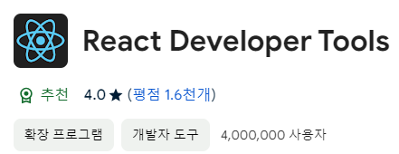
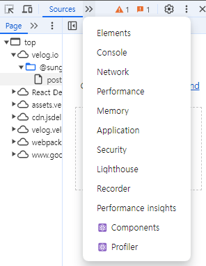
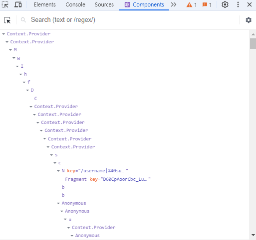
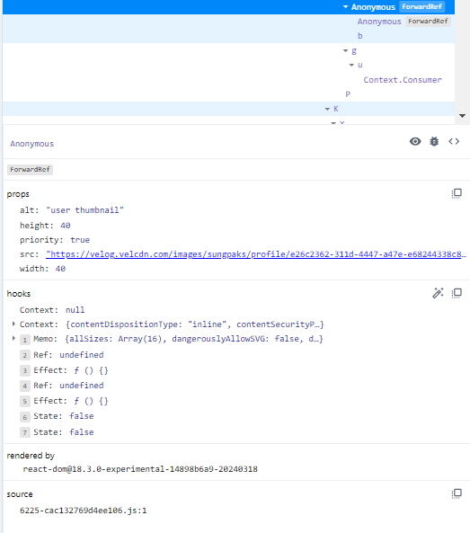
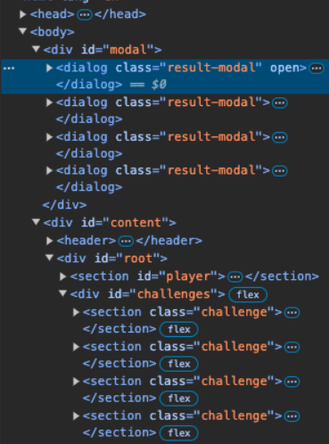

> ! 주의 : TIL 게시글입니다. 다듬지 않고 올리거나 기록을 통째로 복붙했을 수 있는 뒷고기 포스팅입니다.

96년전인 1928년에는 IBM에서 [천공카드](https://namu.wiki/w/%EC%B2%9C%EA%B3%B5%20%EC%B9%B4%EB%93%9C)라는 것을 표준화했습니다  
인생 경험이 많으신 교수님들께서는 이 천공카드로 코딩하시던 시절을 가끔 말씀하시는데.. 아무튼
천공카드에 구멍뚫고 전산실에 제출하여 코딩하시던 96년차 개발자 대신  
0년차? 개발자인 제가 왔습니다  

# JSX 컴포넌트도 값임

JSX 컴포넌트 뭉티기들을 값으로 취급할 수 있습니다.  
그럼 변수로 넣든, props로 넘기든, 할 수 있겠죠?

```jsx
export default function Foo() {
	const header = <div>
		<h2>hello~</h2>
	</div>
	return (
		<div>
			{header}
			<main>
				<p>contents here...</p>
			</main>
		</div>
	)
}
```

변수에 jsx를 조건부로 담아서 동적인 화면을 보여주든지,  
props에 넘겨서 뭔가 재사용 컴포넌트같은 것을 만들든지,  
그래볼 수 있겠습니다.  

# 컴포넌트 타입 동적으로 정하기

제가 `Tabs` 라는 재사용컴포넌트를 만들고 싶은데요..  
버튼이 여럿 있고 이걸 `<menu>`같은 것으로 감싼 형태입니다  

```jsx
export default function Tabs({ children, buttons }) {
	return (
		<>
			<menu>
				{buttons}
			</menu>
			{children}
		</>
	)
}
```

대충 이런식으로 만들려고 해요  
근데 `<div>`로 감싸고 싶으면 우뜨카죠? div버전을 따로 만들까요?  
놉. 아래처럼 가능. 

```jsx
export default function Tabs({ children, buttons, buttonsContainer }) {
	const ButtonsConatiner = buttonsContainer;
	return (
		<>
			<ButtonsContainer>
				{buttons}
			</ButtonsContainer>
			{children}
		</>
	)
}
```

이렇게 `buttonsContainer`라는 것을 props로 받아오게 하고  
`<Tabs>`컴포넌트 렌더링할 때 `buttonsContainer="menu"`처럼 props를 넘기면 됩니다  
주의 : html요소면 그냥 문자열("div","menu", ..)이고, jsx컴포넌트면 `{Component}` 이렇게.  
그리고, Tabs 내에서 `buttonsContainer`를 props로 받았다고 그대로 `<buttonsContainer>` 해버리면  
이게 소문자라서 html 요소인 줄 압니다.  
따라서 `const ButtonsContainer = buttonsContainer`처럼(위에서 했듯이) 따로 매핑하등가  
또는 그냥 처음부터 props이름을 `ButtonsContainer`라고 하면 바로 쓸 수 있읍니다. 그냥 이렇게 하는게 편하긴함

# props 영역전개

재사용컴포넌트 만들거나 아무튼 뭐뭐할때 가끔  
props로 준 attribute값들을 다시 안쪽에서 안 넣어주면  
당연히 동작하지 않는데  
예를 들어`<Foo onClick={handleClick} disable>`이런거 쓰면  
`onClick`도 props로 받고 등록 `disable`도 props로 받고 등록, ...  
하지 않아도 됩니다 사실

```jsx
export default function Foo({ children, ...props }) {
	return (
		<button
			{...props}
		>
			{children}
		</button>
	)
}
```

걍 이렇게 하면 됨.  
`...`(spread operator)는 잘 쓰면 이렇게 편합니다 

# React Developer Tools



이 확장프로그램 진짜 물건입니다. 이미 유명하고 저만 몰랐던거같음  
이거 깔아서 리액트로 빌드된 웹페이지 가서 켜보면



개발자 도구에 이런 Components와 Profiler 탭이 생깁니다  
저는 velog에서 켜봤어요 ㅋㅋㅋ  



이런 식으로 컴포넌트 트리 구조도 확인해볼 수 있고



컴포넌트 클릭하면 밑에 props나 hooks, 이런것들 막 볼 수 있습니다  
디버깅 진짜 개쉬워짐;;

Profiler는 개발모드나 뭐시기뭐시기 아니면 켜볼 수 없는 것 같네요  
벨로그의 Profiler는 훔쳐보지 못했습니다...  
아무튼 Profiler에도 막..  
상호작용했을 때 컴포넌트의 리렌더링이 뭐뭐 일어나는지, 몇 초나 일어나는지,  
왜 일어났는지, 이런걸 볼 수 있습니다  
귀찮아서 사진은 생략할게요. 직접 써보시면 좋겠습니다

# Ref 활용하기

[useRef 훅](https://sungpaks.github.io/react-hooks-guide-with-examples/#ref-hooks)에 대한 글은 이전에 쓴 적이 있는데  
참조(`ref`)란 그 변화가 리렌더링에 추적되지 않는, 깍두기같은 친구였습니다  
이 ref로는 할 수 있는게 꽤 많은데  

## HTML 요소에 연걸하기

HTML요소를 참조로 참조할 수 있습니다.  

```jsx
function MyInput() {
	const ref=useRef();
	const handleClick = () => {
		console.log(ref.current.value);
	}

	return (
	<>
		<input ref={ref} onChange={}/>
		<button onClick={handleClick}>제출</button>
	</>
	)
}
```

이런식으로, attribute에 `ref={ref}`처럼 넘겨주면, 얘네가 마운트된 후에 `ref`는 `<input>`요소를 참조하게 됩니다  
그럼 `ref.current`는 마치 `getElementById()`같은 DOM조작 함수로 얻어온 `<input>`처럼 쓸 수 있게됩니다  
그래서 `ref.current.value`라고 쓰면 `<input>`에 입력된 값을 가져올 수 있는 거십니다  

이렇게 하면 기존에 입력란에 했던 리액트 국룰과는 다르게 할 수 있어요  
보통은 useState로 아래처럼 **양방향 바인딩**을 하곤 합니다  

```jsx
function MyInput() {
	const [value, setValue] = useState('');
	const handleClick = () => {
		console.log(value);
	}

	return (
	<>
		<input value={value} onChange={(e)=>setValue(e.target.value)}/>
		<button onClick={handleClick}>제출</button>
	</>
	)
}
```

대충 이렇게 되겠죠?  
이렇게 하면 사실 한 글자 한 글자가 리렌더링인데  
위에서 ref로 했듯이 저렇게 하면 그렇지 않습니다  
ref는 리렌더링을 유발하지 않는 깍두기니깐요~

입력을 제출하고 나면 초기화하고 싶은 경우 그러면  
`ref.current.value = ''` 이렇게 쓸 수도 있긴 하겠는데  
사실 리액트는 이렇게 명령적인 코드보다는 **선언적인 구조**를 가지는 패러다임이 목적입니다  
**DOM 변화는 React에게 전담**하고, 직접적인 DOM 조작은 지양하려는 것인데  
`ref`에서 읽어오는 것 까지는 괜찮다 봐도,  
저런 명령적인 초기화는 조금 패러다임을 어기는 셈이 되겠네요  

뭐 어쩌란건지 .. 라고 하실 수 있지만  
아무튼 양방향 바인딩이든, ref써서 하든, 상황과 목적에 맞게 쓰라는 셈이 되겠네요~

## 값을 소중히 갖고 있기

아시다시피 `useRef`에 담은 값은 리액트에서 소중하게 다루므로  
상태값의 변화로 인해 리렌더링될 때도 값이 잘 유지됩니다.  
이런 특성을 이용해서 보통 타이머같은거 만들어야 할 때  
5초 뒤에 타이머를 제거하고 싶다? 그러면 이 타이머의 id를 갖고 있어야 `clearTimeout(id)`같은 것을 할 텐데요  
이런 값을 보관하기에도 좋습니다.  
이런 값은 리렌더링을 유발하지도 않을거고, 상태변화가 있어도 아랑곳하지 않을 깍두기라서요

그래서 `ref.current = setTimeout()`처럼 썼다가  
나중에 적당히 `clearTimeout(ref.current)`해주면 타이머가 지워집니다  

## 모달 만들기

`<dialog>`로 편하게 모달을 만들 수 있는데  
```jsx
export default function Modal({}) {
  return (
    <dialog open>
      HI
      <form method="dialog" >
        <button>close</button>
      </form>
    </dialog>
  );
}
```

대충 이런 식입니다.  
`<dialog>`는 기본이 hidden이라 `open` attribute로 열어줄 수 있구요  
`<form method="dialog">` 밑에 버튼만 똭 달아주면 자동으로 모달을 닫는 버튼이 됩니다  

음.. 근데 응당 모달이라면 배경이 흐려지면 좋겠는데요  
이건 내장 `backdrop`요소가 존재하는데  
지금은 `open` attribute로 강제로 열었기 때문에 활성화되지 않습니다  
대신에, dialog DOM 객체의 `.showModal()`을 부르면 이 때 활성화됩니다  
그럼 `<Modal ref={ref}>` 이런 식으로 전달해서, 모달 컴포넌트에서는 `ref`를 props로 받고  
`ref.current.showModal()`해주면 되지 않을까요?  

그런데 **ref는 props로 전달할 수 없습니다**!! 예약어처럼요
그럼 어떻게 하느냐,  
`forwardRef()`라는 함수로 참조전달해야합니다

```jsx
const Modal = forwardRef(function Modal({ ...props }, ref) {

})
```

네 이렇게 감싸주시면 됩니다  
`ref`는 props 다음 두 번째 인자로 들어오니 받아주시면 됩니다  

그리고 이렇게 `forwardRef`로 참조전달했을 때, `useImperativeHandle()`이라는 함수를 또 사용해볼 수 있습니다  
이건 참조전달을 받는 함수형 컴포넌트에서  
바깥쪽(참조를 전달한 쪽)에서 그 참조를 가지고 할 수 있는 동작을 정의하는 것인데요  

`useImperative()`는 첫 번째 인자로는 `ref`를, 두 번째 인자로는 객체를 뱉는 함수를 받습니다  
백문이불여일견. 아래와 같이 생겨먹습니다

```jsx
const Modal = forwardRef(function Modal(props, ref) {
	const dialog = useRef();
	
	useImperativeHandle(ref, () => {
		open () {
			dialog.current.showModal();
		}
	})

	return <dialog ref={dialog}></dialog>
})
```

이렇게, 내부에서는 `<dialog ref={dialog}>` 이렇게 HTML요소에 연결할 참조를 만들어주고,  
바깥에서 받아온 `ref` 참조에게는 명령형 핸들러?메서드?같은 것을 만들어줍니다.  
`ref.current.open()`처럼 쓸 수 있게 expose(노출)시키는거죠

그럼 바깥에서는, `<Modal ref={ref}>`와 같이 평소처럼 ref를 연결하고  
그 ref에 대해서는, 모달을 열고 싶으면 `ref.current.open()`으로 열어주면 됩니다  

사실 `useImperativeHandle()`로 명령적 핸들러를 노춣시켜줄 필요 없이  
참조전달로 받은 `ref`를 바로 `<dialog ref={ref}>`로 꽂아넣고,  
참조를 전달한 바깥쪽에서 `ref.current.showModal()`이렇게 하면 되는게 아니냐? 하실 수 있는데  
지금 우리가 이 모달 컴포넌트를 직접 작업했기 때문에 그렇게 하면 된다는 사실을 아는것입니다.  
사실 다른 사람이 짜 놓은 코드면, 저 한줄이면 되는게 맞는지, 더 뭔가 해야하는게 있는지,  
심지어는 이게 `showModal()`을 호출할 수 있는 `<dialog>`객체가 맞긴 한지?  
를 알 수 없습니다...  
따라서 약간, 의존성을 뒤집는 것처럼, 그냥 `.open()`이라는 메뉴를 주문하기만 하면 되게 expose해준것입니다 

이렇게 하면 `open`으로 강제로 연 것이 아닌 `.showModal()`로 자연스럽게 열어줬으니  
모달 배경쪽이 흐린 효과를 톡톡히 볼 수 있습니다~

# Portal

저렇게 모달을 만들고 나면  
컴포넌트가 얼~~마나 깊은 위치에 존재하건, 그 위치에서 마운트됩니다  
시각적으로 상관없을 수도 있지만, 사실  
모달같은거는 그 무엇보다 상단에 존재하므로  
DOM트리의 가장 위쪽에 존재하는게 어떨까요?  

그래서 Portal이 존재합니다 : [createPortal 공식 설명](https://react-ko.dev/reference/react-dom/createPortal)  
일단 프로젝트의 최상단 진입점에다가 `<div id="modal-root">`같은 요소를 하나 추가해줍시다  
여기는 사실상 나루토에서 미나토가 순신술 쓰듯이, 마킹 수리검을 꽂는 셈입니다  

<figure>


<figcaption>
만화 [나루토] 중..
</figcaption>

</figure>

이제, 컴포넌트에서 리턴하는 jsx코드를 `createPortal()`함수로 감싸 첫 번째 인자로 전달합니다  
그리고 두 번째 인자로는, 아까 `<div id='modal-root'>`(마킹 수리검 꽂은 곳)의 객체를 가져다 넣습니다  
`document.getElementById('modal-root')` 이런 식으로 가져오면 되겠죠?  
아래처럼 작성한다는 말입니다

```jsx
const Modal = forwardRef(function Modal() {
	...
	return createPortal(
		<dialog>
			<p>모달입니다</p>
		</dialog>,
		document.getElementById('modal-root')
	)
})
```



원래 `<section id="challenge">`와 동급으로 있던 `<dialog>`뭉치들을  
portal써서 `<body>`바로 하위의 div까지 텔레포트시켰습니다


---


아.. 힘들어. 여기까지 하고 다음에 더 하겠습니다

