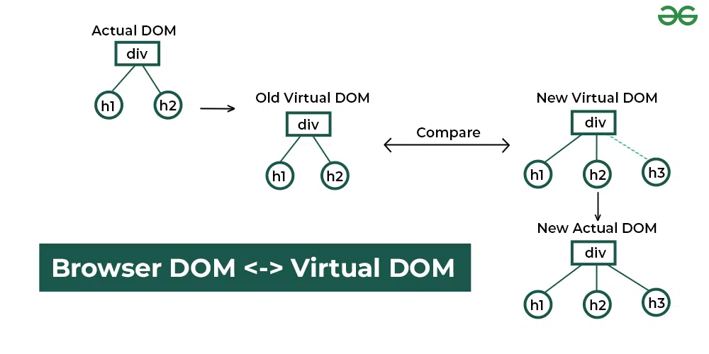

> ! 주의 : TIL 게시글입니다. 다듬지 않고 올리거나 기록을 통째로 복붙했을 수 있는 뒷고기 포스팅입니다.

거두절미

# useEffect에 대해

## useEffect 필요한 경우?

알고들 계시리라 봅니다만,  
함수형 컴포넌트가 렌더링될 때  
이 컴포넌트 함수가 실행되는 양상을 살펴봅시다

```jsx
export default function Foo() {
  const [value, setValue] = useState(0);
  
  setInterval(() => {
    setValue((prev) => prev + 1); 
  }, 1000);

  return (
    <div>
      <p>{value}</p>
    </div>
  );
}
```

대충 이런 `Foo.jsx`가 있다고 생각해봅시다  
1초마다 1씩 값이 늘어나는 것을 상상하고 이런 코드를 작성했을 수 있지만  
매우 끔찍한 일이 일어납니다.. 궁금하면 직접 해보세요.  

<iframe src="https://codesandbox.io/embed/z6sthx?view=preview&module=%2Fsrc%2FApp.js&hidenavigation=1"
     style="width:100%; height: 500px; border:0; border-radius: 4px; overflow:hidden;"
     title="fast-snow"
     allow="accelerometer; ambient-light-sensor; camera; encrypted-media; geolocation; gyroscope; hid; microphone; midi; payment; usb; vr; xr-spatial-tracking"
     sandbox="allow-forms allow-modals allow-popups allow-presentation allow-same-origin allow-scripts"
   ></iframe>

아유.. 귀찮은데 샌드박스 만들어왔습니다

이유는 아시다시피  
`setState()`는 컴포넌트 함수의 재실행을 촉발합니다  
그럼 `setInterval`에 의해 1초 뒤 `setValue()`가 호출되고,  
그럼 이제 다시 Foo 컴포넌트 함수가 재실행됩니다  
그럼 다시 `setInterval`이 추가되고, 1초 뒤 `setValue()`가 호출되고, 또 Foo 컴포넌트 함수가 실행되고, ..  
근데 `setInterval`은 계속 남습니다. 이건 함수 컴포넌트가 재실행된다고 없어지지 않아요  
사실상 미아가 되는건데..  
그러면 미아 interval이 배로배로 늘어나버립니다

`setInterval` 없이 그냥 냅다 `setValue()`를 바로 부르면 더 직관적일까요?  

```jsx
export default function Foo() {
  const [value, setValue] = useState(0);

  setValue(10); //여기서 사실상 Foo()를 다시 호출하는 셈임

  return (
    <div>
      <p>{value}</p>
    </div>
  );
}
```

이러면 `Too many re-renders.` 에러가 나버립니다  
`setValue()`를 만나면 `Foo()` 컴포넌트 함수는 다시 실행되므로 답없는 재귀함수가 되는 셈입니다

## useEffect로 해결

그럼 이런거 한 번만 실행하게 하려고 `useEffect`를 쓴다는 사실 알고계시죠??  
http api를 호출할 때나 저런거 할 때나, `useEffect()`를 의존성배열을 비운 채 사용하여  
**최초 마운트 시 1회만 실행**하게 합니다  
아래처럼요

```jsx
import { useEffect, useRef, useState } from "react";

let isInitial = true;

export default function Foo() {
  const [value, setValue] = useState(0);

  useEffect(() => { //이 useEffect로 감싼 코드는 통째로 가져다가..
    setInterval(() => {
      setValue((prev) => prev + 1);
    }, 1000);
  }, []);

  return (
    <div>
      <p>{value}</p>
    </div>
  );
} //여기까지 다 실행한 타이밍에 useEffect에 담긴 코드를 실행함

```

React는 컴포넌트 함수를 실행중에 `useEffect`훅을 만나면 해당 부분을 건너뜁니다.  
그 `useEffect`내에 있던 코드는 가지고 있다가, 컴포넌트 함수 실행이 끝나면 실행합니다.  

그럼 먼저, `setInterval`은 건너뛴 채 렌더링이 완료되고,  
이제 `useEffect`가 실행되므로 타이머가 세팅됩니다  
이후 1초가 지나서 `setValue()`가 실행되었지만..  
**의존성 배열이 비어있기 때문에 `useEffect`내부는 다음 렌더링 때 재실행되지 않습니다**.  

## 거기선 useEffect 쓰지 마세요 

[useEffect가 필요하지 않을 수도 있습니다.](https://ko.react.dev/learn/you-might-not-need-an-effect#)  

```jsx
const storedIds = JSON.parse(localStorage.getItem('selectedPlaces')) || [];
if (storedIds.indexOf(id) === -1) {
	localStorage.setItem('selectedPlaces', JSON.stringify([id, ...storedIds]));
}
```

이런게 있다고 칩시다  
이런거 useEffect로 빼야 할까요?  
굳이.. 인데요, *state 변화*도 없고, 더군다나 localStorage에 갔다오는 것은 *동기적*인 동작이기 떄문입니다  

*이벤트핸들러*도 마찬가지입니다. 특정 조건에서만 호출되므로 위에서 살펴본 끔찍한 일이 벌어지지 않습니다..  

이외에도, `useEffect`를 굳이 사용하지 않을 상황이 많으니 링크를 살펴보세요  

## clean up 함수

`useEffect`는 컴포넌트 함수의 실행이 끝난 뒤 호출된다고 말씀드렸습니다  
그런데 또한, `useEffect` 내부에 전달하는 콜백함수 내에서 함수를 return하면  
해당 함수는 `useEffect` 내부가 재실행되기 직전, 또는 컴포넌트가 사라지기 바로 직전에 실행됩니다  
아래처럼요

```jsx
useEffect(()=>{
	let timer = setTimeout(()=>{
		// ...
	}, 1000)

	//Clean Up 함수
	return () => {
		clearTimeout(timer)
	}
}, [])
```

이러면 이 `useEffect`가 속한 컴포넌트가 DOM에서 제거되기 직전에 `()=>{clearTImeout(timer)}`가 실행됩니다.  
또한 의존성 배열에 값이 뭔가 있었다면, 그 값이 변화되어 리렌더링이 진행될 때도 실행되겠네요  
아, 그리고 useEffect 내부의 최초 실행 시에는 당연히 Clean Up함수가 실행되지 않습니다

의존성 배열에 값이 있는 경우에 대해서까지는 다루지 않아도 될거라고 생각합니다  
`useEffect`에 대해 밑바닥부터 알고 싶으시면 [공식문서](https://ko.react.dev/reference/react/useEffect) 또는 [이상한 사람이 쓴 글](https://sungpaks.github.io/react-hooks-guide-with-examples/#effect-hooks)을 참고하세요

# React가 화면을 그리는 비밀

## Virtual DOM

<figure>



<figcaption>

출처 [GeeksforGeeks](https://www.geeksforgeeks.org/reactjs-virtual-dom/)

</figcaption>

</figure>

리액트는 DOM의 스냅샷인 Virtual DOM을 유지합니다  
정확히는 두 개 유지하는데, New버전과 Old버전입니다  

어떤 state가 변하거나 해서 새로운 업데이트가 발생하면,  
이 내용이 New Virtual DOM에 반영됩니다.  
그럼 이제 Old VIrtual DOM과 이 업데이트 된 New Virtual DOM을 비교하고  
변한 곳을 캐치해내고, 그 **변한 지점만 실제 DOM에 반영하여 업데이트**합니다.  

단지 그 뿐입니다  

## key

`list.map(item => <li key={item}>{item}</li>) 이런거 해보셨을겁니다  
이렇게 목록으로 여러 컴포넌트를 생성하는 경우 무조건 `key` 속성이 명시되어야 합니다  
알겠는데, `key`는 그래서 뭘까요?  

이름에서 짐작 가능하듯이, `key`는 **컴포넌트의 각 인스턴스를 구별하는 식별자**입니다  
사실 `<Foo />`같은거 여러번 써놓으면, 같은 함수 컴포넌트에서 찍어냈지만  
각기 다른 인스턴스입니다. 상태값 같은 것들도 당연히 따로 갖고요  
같은 설계도로 찍은 다른 결과물이라는 뜻인데  
따라서 목록으로 찍어낼 때 이 각 인스턴스들을 구별하기 위한 `key`를 넣는 것입니다  

이 `key`는 또한, **어떤 값이 바뀌면 해당 컴포넌트를 재삽입(다시 마운트)하고 싶을 때** 사용해볼 수 있습니다  
예를 들어, 어떤 `value`값이 변경되었다면, `<Foo />` 컴포넌트를, 리렌더링 수준이 아니라 갈아끼우고 싶습니다  
이런 경우 내부에서 `useEffect`를 쓸 수도 있겠지만, 간단히 `key`를 이용하면 해결됩니다  
`<Foo key={value} />` 이렇게요  

## State Scheduling, 그리고 State Batching

`useState`훅에서 나오는 `setState()`함수는 **비동기적**입니다.  
`setState()` 상태변화 함수를 만나는 순간! 함수컴포넌트 재실행!!  
이게 아니고, 상태 변화를 **예약**할 뿐입니다  

그래서 아래같은 코드는 생각한 대로 흘러가지 않습니다  
```jsx
//원래 value값을 0으로 시작했다고 할 때
setValue(value+1); //1?
setValue(value+1); //2?
```

음.. 아마 결과는 1일걸요?  
value+1이 연달아 일어나게 하려면 `setValue(prev => prev+1)`같이 상태변화함수로 해야합니다  

확실한건, 첫 번째 `setValue(value+1)` 줄 직후에 `value`는 업데이트되지 않습니다  
언급했듯이 `setValue()`를 만난다고 해서 그 자리에서 바로 상태 값을 변경하지 않기 때문입니다  
그렇게 하는 대신, React는 `setState`들을 긁어다가, 한 번에 처리합니다  

이렇게 상태 업데이트를 모아서 한 번에 처리하는 것을 **State Batching**이라고 합니다  
이는 .. 함수 내의? 상태변화를 모두 모아서 처리한다고 해야할 것 같네요  
공식문서에는 아래처럼 말합니다  

> **React waits until _all_ code in the event handlers has run before processing your state updates.**

그리고 재미있는 것은, [여기](https://yozm.wishket.com/magazine/detail/2493/)에서 말하는 바와 같이  
React 17까지는 이 상태 배칭에 문제가 있었습니다  
Promise나 setTimeout같이, 콜백으로 넘어가고 나면 이를 기다리지 않았기 떄문인데..  
이후로는 그러한 경우까지 모두 커버되도록 해결되었다고 하네요  

## MillionJS 패키지

[millionjs](https://million.dev/)는 리액트 성능 최적화를 위한 패키지인데  
그냥 `npm install million`으로 설치하고, config파일에 적용해준 다음에  
매뉴얼 따라서 실행해보면, cli에 `"~~컴포넌트가 n% 빨라졌어요"`같은게 뜹니다  
내부적으로 Virtual DOM 업데이트를 최적화해주고, 다른 어쩌구저쩌구가 많은가본데  
재밌어서 가져와봤습니다 

---

이만 마칩니다  
.  