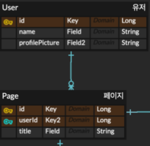
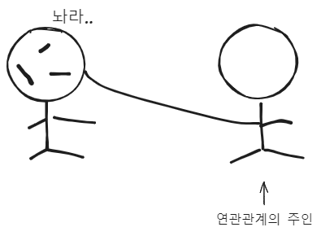

> ! 주의 : TIL 게시글입니다. 다듬지 않고 올리거나 기록을 통째로 복붙했을 수 있는 뒷고기 포스팅입니다.

[저번에 한거](https://sungpaks.github.io/til/spring-boot-crud-and-trying-hexagonal-architecture/) PR올려서 피드백을 받았는데  
고칠게 한참이나 있었습니다.  
피드백 반영하기 위한 수정사항이 있었고 그 기록입니다

# 소유주 확인

유저가 page같은 어떤 정보를 요청할 때  
다른 유저의 정보까지 접근 가능하면 안 되겠죠?  
응당 본인의 정보만 접근이 가능해야 하겠습니다  
관리자 권한이 있는 경우를 제외하면요.

그래서.. 일부 api 요청에 대해 _"소유주가 맞는지?"_ 체크를 하기로 하여  
_"요청 들어오면 토큰 뜯어서 유저 정보 확인할까요?"_ 라고 질문했는데..

갈!!!!!! 토큰을 왜 뜯냐??  
`@AuthenticationPrincipal`로 바로 확인해버릴 수 있는데!!  
https://docs.spring.io/spring-security/reference/servlet/integrations/mvc.html  
https://wildeveloperetrain.tistory.com/324  
이런거 참고해서 해봐라!!

라고 꾸짖음 당했습니다.

자세히 알아보니.. SpringSecurity에서 제공하는 기능을 사용하면  
Controller의 인자에서 `@AuthenticationPrincipal` 어노테이션으로 인증 정보를 가져올 수 있었습니다  
이 `principal`값은 유저를 구분하는 고유값이고 제가 진행중인 프로젝트에서는 `userId`(고유한 문자열)을 넣고 있었으므로  
그냥.. Controller에서 인자로 `@AuthenticationPrincipal userId` 이렇게 가져오기만 하면 되는 일이었습니다

이제 `(현재 인증 정보) === (요청하려는 정보의 소유주)` 를 확인하고,  
일치하지 않으면 에러를 던지면 되겠어요
근데 자바 코드인데 `===`로 확인했네요? ㅋㅋㅋ 진짜로 자주 저러고 있습니다. 습관적으로..

## 이런 검증은 어디서 하면 좋나요?

`userId`가 소유주에 해당하는게 맞는지..  
이런 검증들은 어디서 하는게 좋을까요??  
Controller? Service? ..? 이에 대해 전문가 팀원과 이야기해봤는데요..(사실상 듣는 쪽이었음)  
[계약에 의한 설계](https://kukim.tistory.com/76)와 단일 책임 원칙을 생각해본다면  
**Controller**가 적당하다고 생각됩니다  
Service의 일은, 비즈니스 로직을 수행하는 책임 하나만 지고, 값에 대한 의심은 하지 않게 합니다  
Controller의 일은, 적절한 서비스를 호출하는 책임을 지고, 부적절한 요청 검증은 이 선에서 처리하는게 좋겠어요  
이런 원칙을 두어야.. 제가 제 코드를 믿지 못하고 Controller에서도 검증, Service에서도 검증, ... 이러는 상황이 벌어지지 않겠습니다

# CHARSET 설정

전에 다른 프로젝트 할 때도 당했던건데  
윈도우만 그런지?는 모르겠지만?(다른 팀원들은 맥쓰는데 관련 트러블이 없었다는 것 같아요)  
MySQL에 한글 넣으려면 따로 CHARSET을 설정해줘야 합니다  
안그러면 `Data truncation: Incorrect string value` 이렇게 생긴 에러가 발생합니다

이건 직접 MySQL 들어가서  
`ALTER TABLE 테이블 convert to charset UTF8;` 이런 식으로 해줄 수도 있고

스프링 단에서 할 수는 없나? 싶어서 찾아보고 [여기](https://yeonyeon.tistory.com/167)를 참고한 결과,
엔티티 전체에 적용은 못한다고 하네요? 가능한 방법을 알고계시다면 알려주세요.  
`@Column(columnDefinition = "VARCHAR(100) CHARACTER SET UTF8")` 이렇게 어노테이션에 속성을 추가해서 컬럼단위로는 설정해줄 수 있습니다

# 엔티티 연관관계 매핑



대충 이런 관계가 있다고 해봅시다
처음에는 그냥, `Page`의 `userId`가 `User`의 `id`이게끔 관계만 두고,  
_특정 유저의 페이지들을 조회_ 하는 등의 상황에서는  
FK를 걸든, 쪼인을 하든, 한다는 순전히 DB관점에서 생각했습니다

근데 JPA로 테이블을 엔티티로 영속화하여 사용하므로 그러한 관점에서 매핑해야겠어요  
이를 위해 일단 기존에 `String userId;`(ERD에서는 `Long`인데 실제로 `String`으로 사용중)로 했었다면  
`User user` 이렇게 하고 `@ManyToOne, @OneToMany, ...` 같은 어노테이션을 붙여서  
다대일, 일대다, 등 엔티티간의 연관관계를 매핑해줍니다.

이 때, **연관관계의 주인**개념이 존재하는데,  
이는 즉 매핑을 거는 쪽이 주체가 된다는. 거십니다



대충 그림으로는 이런식ㅋㅋㅋ으로 실제 손을 뻗어서 잡은 쪽이 연관관계의 주인이라는 뜻인데  
DB입장에서 보면 FK를 가지는 쪽이 되겠죠?

이 **연관관계의 주인은 자식 테이블(엔티티)가 되게 매핑하는게 좋다**(1-M에서, M쪽)고 하는데  
DB관점에서 생각해보면, 보통 테이블 간에 FK를 걸 때 자식 테이블이 FK를 가지므로  
엔티티 간에 매핑을 할 때도 자식 테이블에서 매핑을 걸어주는게 합리적이고, 패러다임이 일치하겠죠?  
이렇게 해서, 부모 엔티티에서는 자식 엔티티에 대해서는 하등 몰라도 되게끔 하면 좋겠습니다

그런데 부모 엔티티에 매핑된 자식 엔티티들을 자주 참조해야할 수도 있어요  
위 예시를 또 들어보면, _특정 유저의 모든 페이지 조회_ 이런 것들이 있겠죠?  
이런 경우, `@OneToMany` 어노테이션에 `mappedBy` 속성을 넣어서 **읽기 전용**으로 참조해줍시다  
이렇게 읽기 전용으로 해주지 않으면, 연관관계가 양쪽 다 걸려버리니  
부모가 수정될 떄마다 자식도 수정되는 드러운 사태가 벌어지고 맙니다..

앗, 그리고 다대다 매핑(`@ManyToMany`)을 할 일이 생긴다면, **중간 테이블**을 만들어서  
`@ManyToOne - @OneToMany`로 풀어내는게 좋겠다고 합니다  
더 자세한 내용은 저는 [여기..](https://colevelup.tistory.com/41)를 참고했어욥

그리고 연관관계의 `FetchType`을 `LAZY`로 설정하니  
`No serializer found for class .....` 어쩌구 에러가 떴는데  
REST API니까 JSON으로 반환하고자 직렬화하려는데?  
앗! `LAZY`로 인해 프록시객체가 들어차있는 바람에..  
이 엔티티를 직접 반환하지 못하는 상황이 벌어진 거십니다  
그래서 DTO를 만들고, 여기에 필요한 것만 뽑아 감싸서 반환하게 했습니다~

# 매핑하니까 N+1문제가 .

N+1문제란..  
제가 만약 _모든 Page 엔티티를 조회_ 한다고 해봅시다  
저는 `select * from pages`처럼 1회 쿼리로 끝나겠지? 라고 생각하지만  
현실은.. Page 엔티티에 연관관계가 등록된 User까지 가져오려고 시도하여  
각각의 Page 엔티티 하나마다 "그 Page를 쓴 유저"를 가져오는 쿼리까지 발생해버립니다!

그럼 Page 엔티티를 10개 가져왔다면, (Page 모두 가져오기 1회) + (각 Page에 연관된 User 가져오기 1회) \* 10 = 11회의 쿼리가 발생합니다 ㄷㄷ  
N개 엔티티를 가져오는 상황에서, 기대한 1회 쿼리가 아닌 N+1회의 쿼리가 발생한다고 하여 저런 이름이 붙었습니다

앞서 `FetchType`을 알아보고 가자면  
연관관계 매핑된 엔티티들을 `EAGER`로 즉시로딩할 수 있고, 또는 `LAZY`로 지연로딩할 수 있습니다.  
`EAGER`는 호출 타이밍에 객체를 전부 가져오고  
`LAZY`는 실제 참조하기 전까지는 프록시 객체를 가짜로 집어넣어둡니다  
이걸 `LAZY`로 설정하면 N+1문제가 발생하던 것이 1회의 쿼리만 발생하는 듯 보이지만  
N에 해당하는 연관 엔티티들을 참조할 때마다 새로운 쿼리가 발생되므로  
쿼리의 발생 시점이 다를 뿐이지 N+1문제가 해결되지 않습니다 ㅜㅜ  
딸깍으로 꿀빨기는 실패했어요

근데 `LAZY`로 일단 해두면 좋은게  
제가 만약 Page 엔티티만 조회하고 싶어요.. 연관된 User는 궁금하지도 않고.  
`EAGER`였다면 궁금하지 않았던 User까지 다 가져오겠지만  
`LAZY`와 함께하고, DTO같은 객체에 필요한 것만 담아서 사용하면?  
궁금하지도 않았던 User 엔티티를 조회하는 쿼리가 발생할 일이 없습니다! 굿

그래서 N+1프라브람.. 해결하는 방법이 뭐냐 하면  
(1) JPQL로 직접 메서드를 작성하고, fetch join을 사용 : INNER JOIN 유발  
(2) Entity Graph : `@EntityGraph(attributePath)` 어노테이션으로 엔티티 그래프를 지정하고, JPQL작성 : EAGER조회, OUTER JOIN 유발  
(3) Batch Size 설정  
(4) `@Fetch(FetcMode.SUBSELECT)`로 서브쿼리처럼 할 수 있다  
(5) Querydsl같은 쿼리빌더같은거로 손수 작성..  
등등.. 많은 방법이 있어보였는데  
저는 1번 fetch join으로 해보기로 했습니다

기존에 Page 엔티티에서 `findAll()`을 사용해버리면 User 연관관계를 개별 쿼리로 가져온다는 점이 문제였던 것이니까  
*PageRepository.java*에서 fetch join 버전 `findAll()`을 작성하기로 했습니다

```java
@Query("select p from Page p join fetch p.user")
	List<Page> findAllJoinFetch();
```

이런 식으로 하면 되겠죠?  
JPQL은 SQL과 사알짝 다르지만 굉장히 유사하네요

---

기록 끝~
