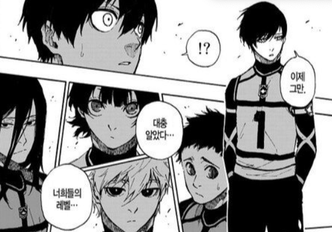
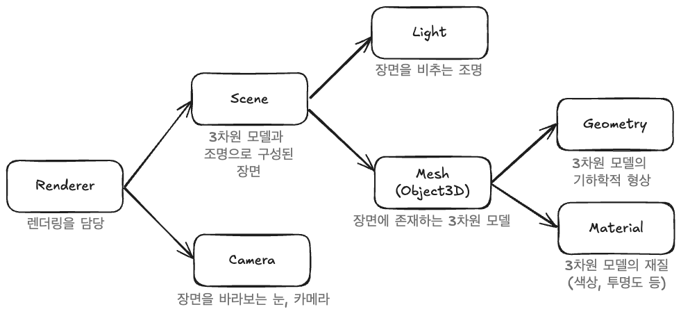
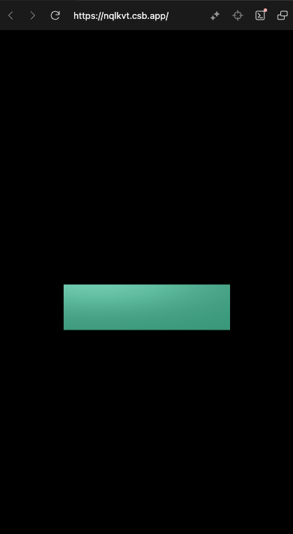

> ! 주의 : TIL 게시글입니다. 다듬지 않고 올리거나 기록을 통째로 복붙했을 수 있는 뒷고기 포스팅입니다.

저번에 공식문서를 쭉 따라하고 TIL정리를 했었는데요 : [1](/til/how-to-threejs-1) [2](/til/how-to-threejs-2) [3](/til/how-to-threejs-3)  
뭐가 있는지도 대충 알았겠다, 이제 강의를 보려고 합니다

[TypeScript로 즐기는 Three.js](https://www.youtube.com/watch?v=WLdkjdh-sgU&list=PLe6NQuuFBu7F8tG1ZweG3pME3E4M-Q0LA)라는 강의를 보고 있어요  
친구가 추천해줬기도 하고, 스터디 팀원분들도 이거 보시는 분들이 꽤 있는 것 같습니다  
무료 무려입니다. 무한한 감사.

저는 진득하게 강의 듣는거 좀 안좋아하는데,  
이미 좀 알고 써본 상태로 강의를 듣는건 꽤 괜찮은 것 같아요



그때서야 강의하시는 분들이 말씀하시는 한 마디 한 마디를 그나마 더 잘 이해할 수 있고  
또한 작성하시는 코드 한 줄 한 줄의 의도가 더 와닿습니다

아무튼 오늘은 1강부터 보려고 하는데, 기초적인 소개가 있지만 건너뛸게요  
가장 기본적인 회전하는 큐브 애니메이션을 만드는 것으로 시작합니다

# 먼저 Three.js의 기본 구성 요소



Three.js에서 렌더링을 위해서는 대략 이런 파이프라인?이 필요합니다

먼저, 화면 렌더링(그리기)을 담당하는 **Renderer**가 필요하겠죠?  
그리고 이제 물질세계를 나타낼 장면인 **Scene**을 만듭니다  
물질세계를 보려면 눈(**Camera**)이 있어야겠네요

이제 다시 물질세계는 조명(**Light**)과 물질(**Mesh**)로 이루어집니다.  
물질만 있으면 빛이 없어서 볼 수 없고, 빛만 있으면 볼 물질이 없겠죠?

물질은 다시 기하학적 특성인 **Geometry**와 재질 특성인 **Material**로 나뉩니다.  
기하학적 특성은 모양새고, 재질은 색상, 투명도, 질감 등이겠네요

# 세팅

`npm create vite@latest`로 프로젝트를 만듭니다. VanilaJS와 TypeScript를 선택해서요  
그리고 `npm install three`로 Three.js 패키지를,  
`npm install @types/three`로 Three.js의 타입 정의들을 설치합니다

그리고, 쓸데없는거 지우고, `index.html, main.js, style.css`만 남깁시다  
`index.html`에는 `<div id="app" />` 요소가 있어야 합니다. 여기를 우리 Three.js앱의 엔트리포인트로 쓰려구요  
`style.css`은 다 지우고 대충 높이너비 100%, 배경색 검은색을 칠해줍시다  
이제 `main.js`에서 아래와 같이 클래스를 정의하고 인스턴스화합니다

```ts
class App {
  private renderer: THREE.WebGLRenderer;
  private domApp: HTMLElement;
  private scene: THREE.Scene;
  private camera?: THREE.PerspectiveCamera;
  private cube?: THREE.Mesh;
}
new App();
```

그리고 먼저 앞으로 필요할 모든 변수들을 정의해줬습니다  
생성자에서 생성하고 들어갈 것은 조건부 없이, 나중에 할당할 것들은 `?`붙여서 조건부로 타입을 넣었습니다

# constructor

이제 생성자에

```ts
constructor() {
    this.renderer = new THREE.WebGLRenderer({ antialias: true });
    this.renderer.setPixelRatio(Math.min(2, window.devicePixelRatio));
    this.domApp = document.querySelector("#app")!;
    this.domApp.appendChild(this.renderer.domElement);

    this.scene = new Three.Scene();

    this.setupCamera();
    this.setupLight();
    this.setupModel();
}
```

첫줄 : 계단현상 방지 안티엘리어싱  
둘째줄 : 픽셀비율 최적화  
셋째줄 : id=app인 div 가져와서  
넷째줄 : WebGLRenderer의 DOM요소를 자식으로 추가

이거부터 쓰고 시작합시다.
맨 밑줄 세 개의 메서드는 이제부터 살펴봅시다.

# setupCamera()

카메라를 정의해요

```ts
private setupCamera() {
    const width = this.domApp.clientWidth;
    const height = this.domApp.clientHeight;
    this.camera = new THREE.PerspectiveCamera(75, width / height, 0.1, 100);
    this.camera.position.z = 2;
  }
```

카메라 생성자를 호출할 때는 `(시야각, 종횡비, 최소 절단거리, 최대 절단거리)`와 같이 생성합니다  
이 때, 종횡비를 브라우저 창에 맞추기 위해 HTML요소의 `clientWidth, clientHeight`를 가져온 것입니다  
그리고 `this.camera.position.z = 2`와 같이 z축으로 이동하게 하여 (0,0,0)좌표를 내려다볼 수 있게 합니다

# setupLight()

조명을 정의해요

```ts
private setupLight() {
    const color = 0xffffff;
    const intensity = 1;
    const light = new THREE.DirectionalLight(color, intensity);
    light.position.set(-1,2,4);
    this.scene.add(light);
}
```

[DirectionalLight](https://threejs.org/docs/index.html#api/en/lights/DirectionalLight)은 특정 방향으로 방출되는 조명입니다  
무한히 멀리 도달하는 평행광선처럼 동작하는데  
그냥 햇빛같다고 생각하시면 됩니다.  
햇빛은 근사적으로 평행광선으로 입사하는 것처럼 생각할 수 있으니까요

생성자에는 색상과 강도?명도? 를 전달하여 생성하고  
위치를 적당히 세팅해주고, 장면에 추가합니다

# setupModel()

3D객체인 모델을 정의해요  
모델은 material재질과 geometry기하학성질로 구성된다고 했습니다

```ts
private setupModels() {
    const geometry = new THREE.BoxGeometry(1, 1, 1); //가로,세로,깊이
    const material = new THREE.MeshPhongMaterial({ color: 0x44aa88 });
    this.cube = new THREE.Mesh(geometry, material);

    this.scene.add(this.cube);
  }
```

네모모양 기하학과 퐁 재질을 썼는데  
[퐁 재질](https://threejs.org/docs/index.html#api/en/materials/MeshPhongMaterial)이란 :

> A material for shiny surfaces with specular highlights.

그냥 광 좀 나는 재질이라고 합니다
이제 기하학과 재질을 섞어서 녹이면 3D객체인 `Mesh`가 탄생합니다  
이것을 `this.cube` 필드에 담아주고 장면에 추가합니다

# render하기

이제 렌더링하고싶은데, 아래같은 `render`메서드를 정의합니다

```ts
private render(time: number) {
    this.renderer.render(this.scene, this.camera!);
  }
```

장면과 카메라를 넣어 `Renderer`객체의 `render`메서드를 호출합니다.  
`time` : 나중에 애니메이션으로 등록할거라 첫 번째 인자로 타임스탬프를 받습니다

그리고 이제 `setupEvents()`라는 메서드를 만들고 constructor 맨 마지막에 추가합니다

```ts
setupEvents() {
    this.renderer.setAnimationLoop(this.render.bind(this));
}
```

[setAnimationLoop](https://threejs.org/docs/#api/en/renderers/WebGLRenderer.setAnimationLoop)로 애니메이션 루프를 설정하는 작업입니다  
`setAnimationLoop`는 [requestAnimationFrame](https://developer.mozilla.org/ko/docs/Web/API/Window/requestAnimationFrame)처럼 쓸 수 있는 빌트인 함수구요  
rAF처럼 쓰는거니까 매 (가능한) 프레임마다 콜백을 호출하고, 콜백함수는 첫 번째 인자로 타임스탬프를 넘겨받습니다

# 반응형 설정하기



지금은 이런식일건데요  
브라우저의 창 크기가 변해도 물체 크기가 고정되고, 반응형으로 변하지 않습니다  
처음 그려질 때도 이상하게 되어있구요

일단 `resize` 메서드를 작성합니다

```ts
private resize() {
    const width = this.domApp.clientWidth;
    const height = this.domApp.clientHeight;
    const camera = this.camera;

    if (camera) {
      camera.aspect = width / height;
      camera.updateProjectionMatrix();
    }
    this.renderer.setSize(width, height);
  }
```

루트 요소의 현재 너비,높이를 가져와 이를 기반으로 카메라의 종횡비를 업데이트합니다.  
또한 렌더러의 사이즈를 설정하구요  
이 때, 카메라의 프로퍼티를 변경하고 나면 `updateProjectionMatrix()`로 행렬연산을 트리거해야하는데  
이에 대해서는 [여기에서 배웠습니다](/til/how-to-threejs-3/#오브젝트를-변형하는-방법-두-가지)

이제 `setupEvents()`메서드를 수정합니다

```ts
private setupEvents() {
    window.onresize = this.resize.bind(this);
    this.resize();
    this.renderer.setAnimationLoop(this.render.bind(this));
  }
```

리사이징 이벤트에 아까 그 메서드를 등록합니다.  
근데 브라우저가 열릴 때는 `onresize`가 트리거되지 않아요  
따라서 처음에 한 번 호출하여 리사이징을 한 번 해줍시다.

# 회전하는 애니메이션 넣기

다음과 같은 `update`메서드를 작성해요

```ts
private update(time: number) {
  time *= 0.001; // ms -> s
  if (this.cube) {
    this.cube.rotation.x = time;
    this.cube.rotation.y = time;
  }
}

private render(time: number) {
  this.update(time);
  this.renderer.render(this.scene, this.camera!);
}

```

아까 `renderer.setAnimationLoop`는 타임스탬프를 인자로 받는다고 했습니다.  
이걸 `update`함수 호출 시에 넘겨줄건데, ms단위라서 초단위로 바꿔줍시다  
그리고 이제 큐브의 회전값을 `time`값으로 업데이트해주면 지속적으로 회전하는 모습을 볼 수 있습니다

<iframe src="https://codesandbox.io/embed/nqlkvt?view=preview&hidenavigation=1"
     style="width:100%; height: 500px; border:0; border-radius: 4px; overflow:hidden;"
     title="flamboyant-darkness-nqlkvt"
     allow="accelerometer; ambient-light-sensor; camera; encrypted-media; geolocation; gyroscope; hid; microphone; midi; payment; usb; vr; xr-spatial-tracking"
     sandbox="allow-forms allow-modals allow-popups allow-presentation allow-same-origin allow-scripts"
   ></iframe>

---

\
네모네모~ 네모네모~ 싸인  
이만 마칩니다. 비타오스~
