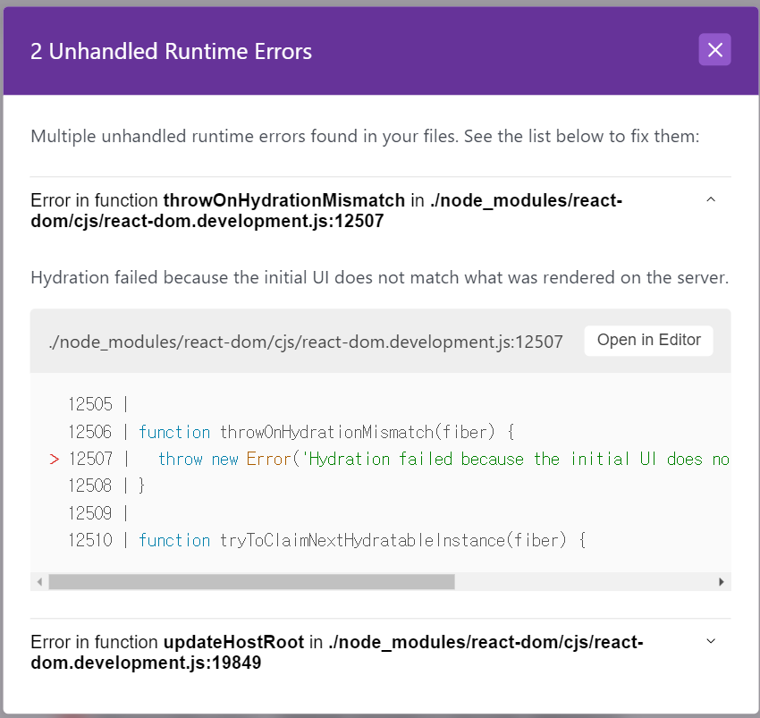
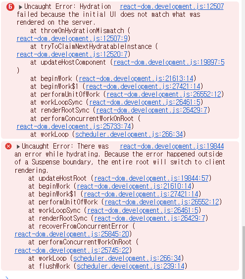

> ! 주의 : TIL 게시글입니다. 다듬지 않고 올리거나 기록을 통째로 복붙했을 수 있는 뒷고기 포스팅입니다.

블로그 글 쓰려고 여느 때처럼 `gatsby develop`으로 개발 모드를 열었는데  
띠용~  



이런 런타임 에러가 떴습니다  



콘솔에서는 이런 에러가 났구요

근데 제가 쓴 코드를 지적해주는게 아니라..  
그냥 저런 모듈 내부 코드에서의 에러 위치만 나오니까  
아주 미칠노릇. 일 뻔 했습니다  

# hydration이 뭔가요?

먼저 에러에서 hydration이라는게 있는데, hydration이 뭔지 알아보고 갑시다.  
[Understanding React Hydration - Gatsbyjs.com](https://www.gatsbyjs.com/docs/conceptual/react-hydration/)  

Gatsby.js는 정적 사이트 생성(SSG)과 서버 사이드 렌더링(SSR)을 지원하는 프레임워크입니다. Next.js와 비슷하게요  
이는 즉, **정적 HTML 뼈대**를 서버 측에서 먼저 조립하고, 이걸 **클라이언트 사이드**에 넘기는 셈입니다.  
제가 "HTML 뼈대"라고 말한 것처럼, 이 자체로는 interactive하지 않습니다. 딱딱하고 메마른 뼈대 그 잡채인 셈인데  
클라이언트 사이드에서 **React는 이 뼈대에다 JavaScript 코드를 집어넣어 살아 움직일 수 있게** 만듭니다.  
마치 물을 주는 것 같네요. 이 과정이 hydrating입니다.

# 이유를 찾아보자

구글에 throwOnHydrationMismatch같은 검색어로 좀 검색을 해봤는데  
SSG, SSR의 대표주자인 Next.js에서 [관련 공식문서](https://nextjs.org/docs/messages/react-hydration-error)를 발견할 수 있었습니다  

Gatsby는 Next.js처럼 SSG, SSR을 지원하는 프레임워크예요.  
에러에서 "rendered on the server"라고 말하니까, 관련 문제임이 틀림없었습니다  

결과적으로, **서버 사이드 렌더링 결과물과 클라이언트 사이드 렌더링 결과물이 다르다**는게 원인이었습니다.  
저 링크에서 가능한 원인 후보군으로 몇 개 집어줬는데  
- `window`, `localStorage`같은 browser-only 기능을 사용함
- `<ul>,<ol>` 없이 독립적인 `<li>` 사용
- `<p>` 태그 밑에 중첩된 `<div>`나 `<p>` 사용

제 경우, 알고 보니 ***`<p>`요소 밑에 `<p>`요소가 또 중첩***되어 있어서 문제였습니다.  
그렇지 않게끔 만들어주고나서 해결됐어요.  

# `<p>` 밑에 왜 `<p>` 있으면 안 됨?

사실 이건 아예 DOM 규칙 자체를 위반하는 경우입니다.  
원래 `<p>` 밑에는 다른 블록 요소들이 존재하기를 기대하지 않습니다. 
[The Paragraph element - MDN](https://developer.mozilla.org/ko/docs/Web/HTML/Element/p)을 한번 보시면,  
`<p>` 요소 내에서 다른 블록 요소가 등장하는 순간 해당 `<p>`요소는 자동으로 닫힙니다.  

즉 아래처럼 쓰면  
```html
<p>
	<p>
		p 중첩했지롱~
	</p>
</p>
```

아래처럼 됩니다.

```html
<p>

</p>
<p>
	p 중첩했지롱~
</p>
```

React는 이런 경우에 대해 `Warning: validateDOMNesting(...): <p> cannot appear as a descendant of <p>` 와 같은 경고를 줍니다.  
p 요소가 p의 하위 요소로 나타나면 안 된다고 하네요.  

그리고 이게 결과적으로 서버 사이드의 사전 렌더링에 비해 다른 결과를 내버릴 수 있어서, hydration mismatch 오류까지 찾아왔네요.  

---

원래 딱히 에러 한 번 난거 가지고 글까지는 잘 쓰지 않는데요  
이건 SSR, SSG, hydration에 대해서도 다룰 수 있었고,  
저런 validateDOMNesting에 대해서도 알아보는 기회였어서  
얻어가는 것이 많은 것 같아서 써봤습니다.  

그리고 사실 `<p>` 내부에서 블록요소 중첩 안 되는거 처음 알았음;  
이만 마칩니다.