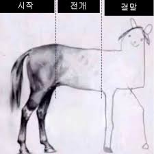

라고는 해도 열심히 쓴답니다~

**네이버 부스트캠프 챌린지 4주 과정**을 시작했는데요  
처음에는 "코어타임이 7시까지라고 했으니까 그때까지만 전집중하면 끝이겠지?"  
라고 생각했는데 오산이었습니다

사실 또 다른거 하는게 많은데  
갑자기 부스트캠프라는 개큰일정이 확 들어와버려서  
진짜 너어무 바빠졌습니다  
그래도 할 일이 많은건 항상 좋은 것 같아요

<figure>

<figcaption>
사실 그정도는 아닙니다.
</figcaption>
</figure>

## 같이 해요

슬랙에 400명인가? 많은 사람들이 모여 있는데  
42서울 라피신할 때 생각이 막 나곤 합니다..  
그 때도 슬랙에 사람들이 왁왁 있고 왁왁 올라오고 그랬는데  
다른 점이 있다면 부스트캠프는 온라인에서만 만난다 라는 점이겠네요

또 42서울 생각이 나는 것은 여기서도 피어세션이라는 함꼐 하는 시간이 있는 것인데  
42서울때 동료평가는 아예 시간의 제한 없이 1:1로 진행하는 것도 있고, 코드를 면밀하게 나눴던 반면  
여기는 좀 **어느 측면에서는 느슨하다?** 라고 생각됩니다  
근데 이 느슨하다, 라는 것이 약하다는 것은 아니고  
그냥 방식이 다르다 뿐인 것 같습니다

두 시간 동안 6명의 팀원들이 각자의 코드를 완벽히 리뷰할 수는 없어요 사실  
게다가 함께 줌으로 미팅하는 시간은 1시간 뿐이라서  
결과물을 서로 나누고 리뷰하고, 검증하는 데 목맨다는 방향성은 전혀 아닙니다

피어들과 한 시간을 보내는 방법도 정해져 있지는 않은데  
여러 방식을 같이 해봤습니다. 코드 설명도 해보고, 서로 코멘트도 주고받아보고, ...  
근데 매일 올라오는 **함께 살펴볼 사항들 을 함께 이야기하고 각자의 학습을 나누는 것**이 가장 좋았던 것 같아요  
구현에만 집중했던 사람이 있고, 학습에 더 쏟은 사람이 있는데  
전자의 경우에도 **생각지 못했던 학습 포인트**를 얻어가는 거고  
학습에 더 쏟은 사람들은 이걸 **재정비**하는 시간이 되기도 하고, 나누면서 **더 채우는 시간**이 되더라구요

아무튼.. 생각보다 **느슨한 피어 학습 방식이지만, 그래서 그 장점이** 있는 것 같아요  
다양한 사람들과 배움을 나누고 성장하는 건 항상 재밌긴 하죠

## 요구사항 분석과 설계

사실 이 부분이 가장 저로서는 낯선 포인트였습니다  
머리부터 박고 구현하는 편인데  
이건 어느 정도나 통하지 규모가 커질 수록 구현에 앞서 준비준비를 잘 해두는 것이 중요하죠...  
큰 건물을 세우려면 역시 밑그림을 그리기가 매우 중요한 것 같아요  
**짝설계**나, **체크포인트**같이 **설계**를 잘 해볼 수 있도록 하는 장치들이 있기 때문에  
설계와 친해지는 시간이 되고 있어 좋습니다  
확실히 **설계로 먼저 방향성과 가닥을** 잡은 뒤 구현에 들어가면 효과적임을 느낍니다

그리고 사실 개발에서는 **요구사항 분석**이 진짜 중요한 포인트인데  
같은 요구사항이라도 이걸 말한 사람과 개발자의 **관점**과 **이해**가 다를 수 있습니다  
그리고 대개 요구사항은 알고리즘 문제처럼 완전히 정해져 있는 게 아니죠..  
이건 그래서 이거 하라는거야, 저거 하라는거야? 라는 생각이 들기 마련인 것 같아요  
게다가 부스트캠프에서는 요구사항이 꽤 길고.. 막막하고.. 그렇습니다  
이런 **요구사항을 분석하고 이해**하고, 이를 잘 따라가는 이런 연습이 도움이 많이 됨을 느낍니다

슬랙에서도 자주 있어요.. 이 부분은 이런 의도인가요? 애매 한 것 같아요! 이런 질문들이 있는데  
어느 정도 범위 밖은 **개인의 판단**에 따라라, 라는 답변이 많습니다.  
이게 진짜 현실 경험이지 않나? 싶어요  
요구사항을 잘 녹여내면서도 **주도적**인 판단으로 진행하는 연습이 많이 되는 것 같습니다

저는 **요구사항 분석할 때 꼭 글로** 써봅니다  
내가 **이해한 요구사항**을 다시 글로 뱉어보는 건데요  
그러고 나서 다른 사람들이 이해한 바와 비교해보거나  
또는 다시 요구사항 원문으로 돌아가서, 빠진 부분이나 애매한 부분, 내가 잘못 이해한 부분, 이런게 있지는 않은가 확인하곤 합니다  
이렇게 한 번 하고 대충 구현을 위한 흐름을 설계해보면  
처음엔 막막해보였어도 길이 어느 정도 보이곤 합니다

---

사실 하면서 .. 학습과 구현, 또는 과정과 결과 사이의 **밸런스**를 맞추는 게 꽤 고민입니다  
슬랙 보면 다른 캠퍼분들도 그런 고민들이 많은 것 같더라구요  
어떤 분들은 새벽까지 구현에 매달리시기도 하고..  
아직도 그 균형을 찾아가는 중인데  
확실한 것은.. **성취가 아니라 성장**을 쫓아야 하는 것 같습니다  
앞으로도 많이 남았으니 경험치 많이 얻어가야겠습니다. 푸하하
